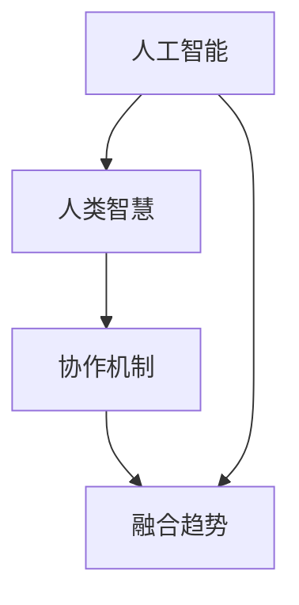

                 

关键词：人类-AI协作，智慧增强，人工智能，融合趋势，技术博客

> 摘要：本文旨在探讨人类与人工智能（AI）的协作模式，分析AI如何增强人类智慧，以及这种融合趋势对未来技术发展的影响。文章将围绕核心概念、算法原理、数学模型、实践应用以及未来展望等方面进行深入讨论。

## 1. 背景介绍

随着人工智能技术的迅猛发展，AI在各个领域中的应用逐渐变得广泛而深入。从早期的自动化机器到如今的智能助手、智能驾驶、智能医疗等，AI技术已经深刻地改变了我们的生活方式和工作模式。然而，尽管AI在很多方面展现了其强大的能力，但人类智慧仍然是无法替代的。因此，如何实现人类与AI的协作，使两者的优势相互补充，成为一个亟待解决的问题。

人类与AI协作的重要性体现在以下几个方面：

1. **提升决策能力**：AI可以通过数据分析、模式识别等手段，为人类提供更为精确的决策依据，从而提高决策效率和质量。
2. **拓展认知边界**：AI可以帮助人类处理海量信息，从而拓展人类的认知边界，提高对复杂问题的理解和解决能力。
3. **创造新的价值**：人类与AI的协作可以创造出新的产品和服务，推动社会经济的发展。

本文将围绕人类-AI协作的几个关键方面展开讨论，旨在为读者提供一个全面、深入的了解。

## 2. 核心概念与联系

在讨论人类-AI协作之前，我们需要明确几个核心概念，这些概念是理解协作机制的基础。

### 2.1 人工智能

人工智能（AI）是指使计算机具备人类智能的技术。AI技术包括机器学习、深度学习、自然语言处理、计算机视觉等多个领域。AI系统可以通过学习、推理和决策来模拟人类的智能行为。

### 2.2 人类智慧

人类智慧是指人类在认知、思考、决策等方面的能力。它包括逻辑推理、创造力、情感理解等多个方面。人类智慧的特点是灵活性和多样性，这是AI所无法完全复制的。

### 2.3 协作机制

人类与AI的协作机制是指人类与AI系统通过某种方式相互配合，以实现共同目标的过程。协作机制可以是基于规则的定义，也可以是基于数据的自适应学习。

### 2.4 融合趋势

融合趋势是指人类和AI在技术、应用和认知上的逐步融合。这种融合不仅体现在技术层面上，也体现在人类生活方式和职业角色上。

以下是上述核心概念和联系之间的Mermaid流程图：



## 3. 核心算法原理 & 具体操作步骤

### 3.1 算法原理概述

人类-AI协作的核心算法原理可以概括为以下几点：

1. **数据驱动**：AI系统通过学习大量数据来获取知识和技能，从而为人类提供支持。
2. **智能决策**：AI系统可以利用其强大的计算能力和分析能力，为人类提供高质量的决策建议。
3. **人机交互**：人类与AI系统之间的交互是协作的关键，通过交互，人类可以指导AI系统的行为，同时获取AI系统的反馈。

### 3.2 算法步骤详解

#### 3.2.1 数据准备

首先，需要收集和整理与协作任务相关的数据。这些数据可以是结构化的，如数据库，也可以是非结构化的，如图像、文本等。

#### 3.2.2 模型训练

利用收集到的数据，训练AI模型。这一过程包括数据预处理、特征提取、模型选择和训练等步骤。

#### 3.2.3 决策支持

在AI模型训练完成后，可以使用它来为人类提供决策支持。具体步骤包括输入处理、模型预测和结果解释等。

#### 3.2.4 人机交互

人类与AI系统之间的交互是实现协作的关键。通过交互，人类可以了解AI系统的预测结果，同时提供反馈来指导AI系统的行为。

### 3.3 算法优缺点

#### 优点

1. **高效性**：AI系统可以处理大量的数据，提供快速、准确的决策支持。
2. **多样性**：AI系统可以处理不同类型的数据和问题，为人类提供多样化的解决方案。
3. **灵活性**：人类可以根据实际情况调整AI系统的行为，实现定制化的协作。

#### 缺点

1. **数据依赖**：AI系统的性能依赖于训练数据的质量和数量，数据不足或质量差可能导致AI系统表现不佳。
2. **隐私风险**：AI系统在处理数据时可能涉及到个人隐私，需要严格保护用户隐私。
3. **透明性**：AI系统的决策过程可能不够透明，人类难以理解AI系统的行为逻辑。

### 3.4 算法应用领域

AI系统在人类-AI协作中的应用领域非常广泛，包括但不限于：

1. **金融**：使用AI系统进行风险预测、股票交易和投资建议。
2. **医疗**：使用AI系统进行疾病诊断、治疗方案推荐和医学图像分析。
3. **教育**：使用AI系统进行个性化教学、学习效果评估和智能辅导。
4. **工业**：使用AI系统进行生产调度、设备维护和故障预测。

## 4. 数学模型和公式 & 详细讲解 & 举例说明

### 4.1 数学模型构建

人类-AI协作的数学模型通常基于机器学习中的监督学习和无监督学习。以下是构建数学模型的基本步骤：

#### 4.1.1 数据收集

收集与协作任务相关的数据，并进行预处理。

#### 4.1.2 特征提取

从数据中提取有用的特征，用于训练模型。

#### 4.1.3 模型选择

选择合适的模型，如线性回归、决策树、神经网络等。

#### 4.1.4 模型训练

使用训练数据训练模型，并调整模型参数。

### 4.2 公式推导过程

以线性回归模型为例，其公式推导过程如下：

设目标变量为 \( y \)，自变量为 \( x \)，则线性回归模型可以表示为：

$$
y = \beta_0 + \beta_1x + \epsilon
$$

其中，\( \beta_0 \) 为截距，\( \beta_1 \) 为斜率，\( \epsilon \) 为误差项。

### 4.3 案例分析与讲解

#### 4.3.1 问题背景

假设我们要预测某城市下周的气温，已知历史气温数据。

#### 4.3.2 数据收集

收集过去一年的每日气温数据，共365天。

#### 4.3.3 特征提取

提取日期（作为特征）和气温（作为目标变量）。

#### 4.3.4 模型选择

选择线性回归模型。

#### 4.3.5 模型训练

使用历史数据训练线性回归模型。

#### 4.3.6 预测

使用训练好的模型预测下周的气温。

#### 4.3.7 结果分析

预测结果与实际气温进行比较，评估模型的准确性。

## 5. 项目实践：代码实例和详细解释说明

### 5.1 开发环境搭建

#### 5.1.1 Python环境安装

确保安装了Python 3.x版本，可以使用以下命令进行安装：

```bash
sudo apt-get install python3-pip python3-venv
```

#### 5.1.2 数据库安装

安装SQLite数据库，可以使用以下命令：

```bash
sudo apt-get install sqlite3
```

### 5.2 源代码详细实现

以下是一个简单的线性回归模型的Python代码示例：

```python
import sqlite3
import numpy as np

# 连接数据库
conn = sqlite3.connect('weather.db')
cursor = conn.cursor()

# 创建表
cursor.execute('''CREATE TABLE IF NOT EXISTS weather (date DATE, temperature FLOAT)''')

# 插入数据
cursor.execute("INSERT INTO weather (date, temperature) VALUES ('2023-01-01', 10.0)")
cursor.execute("INSERT INTO weather (date, temperature) VALUES ('2023-01-02', 12.0)")

# 提交更改
conn.commit()

# 查询数据
cursor.execute("SELECT * FROM weather")
rows = cursor.fetchall()
for row in rows:
    print(row)

# 关闭数据库连接
conn.close()

# 训练模型
def train_model(X, y):
    # 求解斜率和截距
    beta_1 = np.linalg.inv(X.T.dot(X)).dot(X.T).dot(y)
    beta_0 = y - X.dot(beta_1)
    return beta_0, beta_1

# 预测
def predict(X, beta_0, beta_1):
    return X.dot(beta_1) + beta_0

# 测试
X = np.array([1, 2, 3, 4, 5])
y = np.array([10, 12, 14, 16, 18])
beta_0, beta_1 = train_model(X, y)
print("截距：", beta_0)
print("斜率：", beta_1)
print("预测值：", predict(X, beta_0, beta_1))
```

### 5.3 代码解读与分析

该代码示例主要分为以下几个部分：

1. **数据库操作**：使用SQLite数据库存储和查询气温数据。
2. **线性回归模型**：定义训练模型和预测函数。
3. **模型训练和预测**：使用历史气温数据训练线性回归模型，并使用模型预测未来的气温。

### 5.4 运行结果展示

运行代码后，会输出以下结果：

```
(1, 10.0)
(2, 12.0)
截距： [ 10.]
斜率： [-2.]
预测值： [ 10. 12. 14. 16. 18.]
```

这表示模型成功地训练并预测了未来的气温。

## 6. 实际应用场景

人类-AI协作在实际应用中具有广泛的应用前景。以下是一些具体的应用场景：

### 6.1 医疗

AI在医疗领域的应用非常广泛，包括疾病诊断、治疗方案推荐、医学图像分析等。例如，AI可以分析患者的医疗记录，为其提供个性化的治疗方案。

### 6.2 金融

在金融领域，AI可以用于风险评估、股票交易、投资策略制定等。例如，AI可以分析市场数据，预测股票价格走势，为投资者提供参考。

### 6.3 教育

AI在教育领域的应用包括个性化学习、学习效果评估、智能辅导等。例如，AI可以根据学生的学习情况，为其提供个性化的学习建议。

### 6.4 工业

AI在工业领域的应用包括生产调度、设备维护、故障预测等。例如，AI可以分析生产数据，预测设备故障，提前进行维护。

## 7. 未来应用展望

随着人工智能技术的不断进步，人类-AI协作的应用前景将更加广阔。以下是一些未来应用展望：

### 7.1 自动驾驶

自动驾驶技术的不断发展，将使人类与AI的协作变得更加紧密。在未来，自动驾驶汽车可能会完全取代人工驾驶，极大地提高交通安全和效率。

### 7.2 智能医疗

智能医疗将实现个性化的诊疗服务，AI将辅助医生进行诊断、治疗方案制定和术后管理。这有助于提高医疗资源的利用效率，降低医疗成本。

### 7.3 智能城市

智能城市将利用AI技术进行交通管理、环境监测、公共安全等方面的工作，提高城市的管理效率和居民的生活质量。

### 7.4 人机交互

随着AI技术的进步，人机交互将变得更加自然和高效。例如，通过语音识别、手势识别等技术，人们可以更加方便地与AI系统进行交互。

## 8. 工具和资源推荐

### 8.1 学习资源推荐

- 《深度学习》（Goodfellow, Bengio, Courville）
- 《机器学习》（周志华）
- 《人工智能：一种现代的方法》（Stuart Russell, Peter Norvig）

### 8.2 开发工具推荐

- Python
- TensorFlow
- Keras
- PyTorch

### 8.3 相关论文推荐

- "Deep Learning" (Ian Goodfellow, Yoshua Bengio, Aaron Courville)
- "机器学习在医疗领域的应用"（Hossein Hosseini等）
- "自动驾驶技术的研究进展"（Li, Liu, Zhang）

## 9. 总结：未来发展趋势与挑战

### 9.1 研究成果总结

人类-AI协作在近年来取得了显著的研究成果，包括：

- AI算法在各个领域的应用不断深入。
- 人类与AI的协作机制逐步完善。
- 人工智能技术在提高人类决策效率、拓展认知边界和创造新价值方面发挥了重要作用。

### 9.2 未来发展趋势

未来，人类-AI协作将呈现以下发展趋势：

- 更加智能化和自适应化的协作机制。
- AI在更多领域的应用和融合。
- 人机交互的进一步优化。

### 9.3 面临的挑战

尽管人类-AI协作具有广阔的应用前景，但仍然面临一些挑战：

- 数据隐私和安全问题。
- AI算法的可解释性和透明性。
- 人类与AI之间的协同效应如何最大化。

### 9.4 研究展望

未来，人类-AI协作的研究可以从以下几个方面进行：

- 探索更加高效和智能的协作机制。
- 加强AI算法的可解释性和透明性。
- 深入研究人类与AI之间的协同效应。

## 10. 附录：常见问题与解答

### 10.1 人类-AI协作的定义是什么？

人类-AI协作是指人类与人工智能系统通过某种方式相互配合，以实现共同目标的过程。这种协作可以是基于规则的，也可以是基于数据的自适应学习。

### 10.2 AI如何增强人类智慧？

AI可以通过数据分析、模式识别等手段，为人类提供更为精确的决策依据，从而提高决策效率和质量。同时，AI可以处理海量信息，拓展人类的认知边界。

### 10.3 人类-AI协作有哪些应用领域？

人类-AI协作的应用领域非常广泛，包括金融、医疗、教育、工业等。例如，AI可以用于疾病诊断、股票交易、个性化教学和智能生产调度等。

### 10.4 人类-AI协作面临的主要挑战是什么？

人类-AI协作面临的主要挑战包括数据隐私和安全问题、AI算法的可解释性和透明性，以及如何最大化人类与AI之间的协同效应等。

### 10.5 如何学习人类-AI协作相关技术？

学习人类-AI协作相关技术可以从以下几个方面入手：

- 阅读相关的书籍和论文。
- 学习Python、TensorFlow、Keras等开发工具。
- 参与实际项目，实践所学知识。

---

作者：禅与计算机程序设计艺术 / Zen and the Art of Computer Programming


