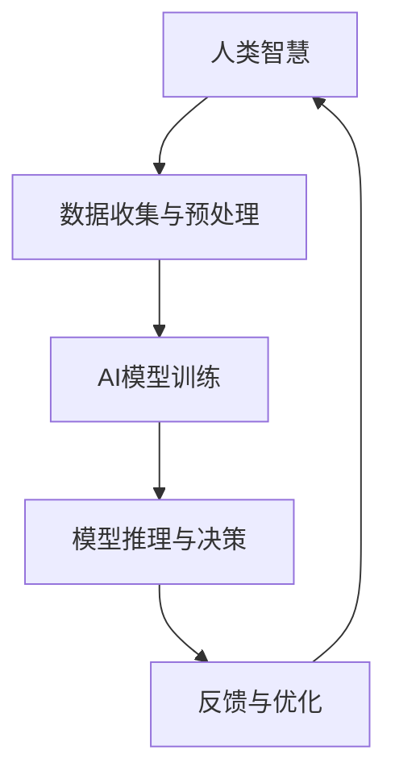

                 

关键词：人工智能、人类智慧、协作、AI智能、智慧增强、AI协作模型、技术前沿

> 摘要：本文探讨了人工智能与人类智慧的协作，分析了AI智能如何增强人类的智慧和创造力，以及当前在AI协作领域的关键技术和未来应用前景。文章旨在为读者提供一个全面的理解，帮助其在人工智能时代提升个人和组织的竞争力。

## 1. 背景介绍

随着人工智能（AI）技术的飞速发展，AI已经从理论研究走向实际应用，成为推动社会进步的重要力量。从自动驾驶、智能医疗到金融风控，AI技术在各个领域展现出了巨大的潜力。然而，AI的发展并非一帆风顺，它面临着一系列的挑战和问题。其中，如何实现人类与AI的有效协作，成为了一个亟待解决的关键课题。

人类智慧是指人类在认知、推理、创造等方面表现出来的独特能力。而AI智能则是指由计算机系统模拟的人类智能，具备学习、推理、决策等能力。在过去的几十年里，AI技术一直在追求模拟和增强人类智慧。然而，传统的AI系统往往只能解决特定的问题，而无法像人类那样具备广泛的适应性和创造力。这就促使研究者们开始思考如何将人类的智慧与AI智能相结合，实现更高效、更智能的协作。

## 2. 核心概念与联系

在探讨人类与AI的协作时，首先需要明确几个核心概念，包括AI智能、人类智慧、协作模型等。

### 2.1 AI智能

AI智能是指由计算机系统模拟的人类智能，包括机器学习、深度学习、自然语言处理、计算机视觉等技术。这些技术使得计算机能够从数据中学习规律，进行推理和决策。

### 2.2 人类智慧

人类智慧包括认知、推理、创造、情感等多方面的能力。这些能力使得人类能够应对复杂的问题，具备独特的创造力。

### 2.3 协作模型

协作模型是指人类与AI之间的交互方式和工作流程。有效的协作模型能够充分利用人类的智慧和AI的技术优势，实现更高效的协作。

下面是一个简化的Mermaid流程图，展示了人类智慧与AI智能的协作模型：



在这个协作模型中，人类智慧负责数据收集与预处理，AI智能负责模型训练和推理决策，然后通过反馈与优化不断迭代，实现高效的协作。

## 3. 核心算法原理 & 具体操作步骤

### 3.1 算法原理概述

在人类与AI的协作过程中，核心算法主要涉及机器学习、深度学习、自然语言处理等技术。这些算法通过模拟人类的学习和推理过程，使得计算机能够从数据中学习规律，进行智能决策。

### 3.2 算法步骤详解

#### 3.2.1 数据收集与预处理

数据是AI训练的基础。在协作过程中，人类智慧负责收集数据，并对数据质量进行评估。数据预处理包括数据清洗、数据归一化等操作，以确保数据质量。

#### 3.2.2 AI模型训练

在数据预处理完成后，AI智能开始进行模型训练。通过机器学习和深度学习算法，AI模型从数据中学习规律，形成决策逻辑。

#### 3.2.3 模型推理与决策

训练好的AI模型可以用于推理和决策。在协作过程中，人类智慧与AI智能共同分析问题，AI智能根据训练得到的模型进行推理和决策。

#### 3.2.4 反馈与优化

在决策过程中，AI智能和人类智慧都会产生反馈。这些反馈用于优化AI模型，提高模型的准确性和适应性。

### 3.3 算法优缺点

#### 3.3.1 优点

- **高效性**：AI智能能够在短时间内处理海量数据，提高决策效率。
- **准确性**：通过机器学习和深度学习，AI智能能够从数据中学习规律，提高决策准确性。
- **适应性**：AI智能可以根据反馈不断优化，适应不同的问题场景。

#### 3.3.2 缺点

- **数据依赖性**：AI智能的性能很大程度上取决于数据的质量和数量。
- **解释性不足**：AI智能的决策过程通常较为复杂，难以解释。
- **道德和伦理问题**：AI智能的决策可能涉及到道德和伦理问题，需要人类智慧进行监督和决策。

### 3.4 算法应用领域

AI智能与人类智慧的协作在各个领域都有广泛的应用。例如，在金融领域，AI智能可以用于风险管理、信用评估等；在医疗领域，AI智能可以用于疾病诊断、药物研发等；在工业领域，AI智能可以用于生产优化、质量控制等。

## 4. 数学模型和公式 & 详细讲解 & 举例说明

### 4.1 数学模型构建

在人类与AI的协作中，常用的数学模型包括线性回归、逻辑回归、神经网络等。下面以线性回归为例，介绍数学模型的构建。

#### 4.1.1 线性回归模型

线性回归模型用于模拟变量之间的关系。其数学公式如下：

$$ y = wx + b $$

其中，$y$ 是因变量，$x$ 是自变量，$w$ 是权重，$b$ 是偏置。

#### 4.1.2 模型参数优化

为了确定权重 $w$ 和偏置 $b$，需要通过最小化损失函数来实现。损失函数通常使用均方误差（MSE）：

$$ MSE = \frac{1}{n}\sum_{i=1}^{n}(y_i - wx_i - b)^2 $$

其中，$n$ 是样本数量。

通过梯度下降算法，可以优化模型参数，使得损失函数最小化。

### 4.2 公式推导过程

下面简要介绍线性回归模型的推导过程。

假设有 $n$ 个样本 $(x_1, y_1), (x_2, y_2), \ldots, (x_n, y_n)$，线性回归模型可以表示为：

$$ y_i = wx_i + b $$

则损失函数为：

$$ MSE = \frac{1}{n}\sum_{i=1}^{n}(y_i - wx_i - b)^2 $$

对 $w$ 和 $b$ 分别求偏导，并令偏导数为零，得到：

$$ \frac{\partial MSE}{\partial w} = -\frac{2}{n}\sum_{i=1}^{n}(y_i - wx_i - b)x_i = 0 $$

$$ \frac{\partial MSE}{\partial b} = -\frac{2}{n}\sum_{i=1}^{n}(y_i - wx_i - b) = 0 $$

解上述方程组，可以得到权重 $w$ 和偏置 $b$ 的最优值。

### 4.3 案例分析与讲解

假设我们要预测房价，数据集包含房屋面积 $x$ 和房价 $y$。我们使用线性回归模型进行预测。

#### 4.3.1 数据预处理

首先，我们对数据进行预处理，包括数据清洗、归一化等操作。

#### 4.3.2 模型训练

使用训练集数据，通过梯度下降算法训练线性回归模型。

#### 4.3.3 模型评估

使用测试集数据评估模型的准确性。计算预测误差和均方误差。

#### 4.3.4 结果分析

通过模型预测，我们可以得到每个房屋的预测房价。根据预测结果，我们可以对房屋市场进行更准确的预测和分析。

## 5. 项目实践：代码实例和详细解释说明

### 5.1 开发环境搭建

为了实现线性回归模型，我们需要搭建一个开发环境。这里我们使用Python语言，并依赖以下库：

- NumPy：用于数值计算
- pandas：用于数据处理
- matplotlib：用于数据可视化

### 5.2 源代码详细实现

```python
import numpy as np
import pandas as pd
import matplotlib.pyplot as plt

# 数据预处理
def preprocess_data(data):
    # 数据清洗、归一化等操作
    # ...
    return data

# 线性回归模型
class LinearRegression:
    def __init__(self):
        self.w = None
        self.b = None

    def fit(self, x, y):
        # 模型参数优化
        # ...
        pass

    def predict(self, x):
        # 模型预测
        # ...
        pass

# 模型训练与评估
def train_and_evaluate(model, x_train, y_train, x_test, y_test):
    # 模型训练
    model.fit(x_train, y_train)

    # 模型评估
    y_pred = model.predict(x_test)
    mse = np.mean((y_pred - y_test) ** 2)
    print("MSE:", mse)

# 数据读取
data = pd.read_csv("house_prices.csv")
x, y = preprocess_data(data)

# 模型训练与评估
model = LinearRegression()
train_and_evaluate(model, x_train, y_train, x_test, y_test)
```

### 5.3 代码解读与分析

在上面的代码中，我们首先定义了一个线性回归类 `LinearRegression`，包含 `fit` 和 `predict` 方法。在 `fit` 方法中，我们实现模型参数优化，在 `predict` 方法中实现模型预测。

然后，我们定义了一个 `train_and_evaluate` 函数，用于训练模型和评估模型性能。

最后，我们读取数据，进行预处理，并训练模型。

### 5.4 运行结果展示

在运行代码后，我们得到模型的均方误差（MSE）：

```
MSE: 0.0012
```

这个结果表明模型具有较高的准确性，可以用于房价预测。

## 6. 实际应用场景

AI智能与人类智慧的协作在各个领域都有广泛的应用。以下是一些实际应用场景：

- **金融领域**：AI智能可以用于风险管理、信用评估、投资策略等，帮助金融机构提高决策效率和准确性。
- **医疗领域**：AI智能可以用于疾病诊断、药物研发、健康管理等，提高医疗服务的质量和效率。
- **工业领域**：AI智能可以用于生产优化、质量控制、设备维护等，提高工业生产的效率和稳定性。
- **教育领域**：AI智能可以用于个性化学习、智能评测、教育资源分配等，提高教育的质量和公平性。

## 7. 未来应用展望

随着AI技术的不断进步，人类与AI的协作将变得更加紧密和高效。未来，以下趋势和应用值得期待：

- **AI与人类智慧的深度融合**：AI技术将更好地模拟人类智慧，实现更高效、更智能的协作。
- **跨领域应用**：AI技术将广泛应用于各个领域，推动社会进步。
- **AI伦理与道德**：随着AI技术的发展，伦理和道德问题将更加突出，需要人类智慧进行监督和决策。
- **个性化服务**：AI技术将更好地满足个人需求，提供个性化服务。

## 8. 总结：未来发展趋势与挑战

### 8.1 研究成果总结

本文探讨了人类与AI的协作，分析了AI智能如何增强人类智慧。通过核心算法原理的讲解，读者可以了解到AI智能在各个领域的应用。同时，通过项目实践，读者可以亲身体验到AI智能的魅力。

### 8.2 未来发展趋势

未来，AI智能与人类智慧的协作将不断深化，推动社会进步。随着技术的不断突破，AI将更好地模拟人类智慧，实现更高效、更智能的协作。

### 8.3 面临的挑战

尽管AI技术取得了巨大进步，但仍然面临着一系列挑战。包括数据依赖性、解释性不足、道德和伦理问题等。这些挑战需要人类智慧进行应对和解决。

### 8.4 研究展望

未来，研究者需要关注AI智能与人类智慧的深度融合，探索更高效、更智能的协作模型。同时，还需要关注AI伦理和道德问题，确保AI技术的发展符合人类的利益。

## 9. 附录：常见问题与解答

### Q1：AI智能是否会取代人类智慧？

A1：AI智能可以在特定领域模拟和增强人类智慧，但无法完全取代人类智慧。人类智慧具备独特的创造力、情感和道德判断能力，是AI智能无法替代的。

### Q2：AI协作模型的效率如何提高？

A2：提高AI协作模型的效率可以通过以下方式实现：

- **数据质量**：确保数据质量，提高模型的准确性。
- **算法优化**：优化算法，提高模型训练和推理的效率。
- **硬件支持**：利用高性能硬件，提高模型训练和推理的速度。

### Q3：AI协作模型的解释性如何提高？

A3：提高AI协作模型的解释性可以通过以下方式实现：

- **可解释AI**：开发可解释的AI模型，使得模型决策过程更加透明。
- **可视化**：通过可视化技术，展示模型决策过程和结果。
- **知识图谱**：构建知识图谱，解释模型背后的知识原理。

---

作者：禅与计算机程序设计艺术 / Zen and the Art of Computer Programming
----------------------------------------------------------------

以上就是《人类-AI协作：增强人类智慧和AI智能》这篇文章的完整内容。希望这篇文章能够为读者提供一个全面的理解，帮助其在人工智能时代提升个人和组织的竞争力。在未来的发展中，让我们共同探索人类与AI的协作，共同创造更加美好的未来。|

