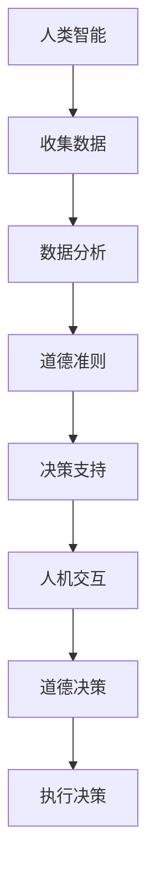

                 

### 关键词 Keywords
- 人类-AI协作
- 智慧增强
- 道德决策
- 人工智能
- 人类智能
- 计算机科学
- 合作系统
- 伦理学
- 决策支持系统

<|assistant|>### 摘要 Abstract
本文探讨了人类与人工智能（AI）协作的可能性，特别是如何通过AI来增强人类的智慧和道德决策能力。文章首先介绍了人类智能与AI的关系，随后深入分析了AI在道德决策中的作用和挑战。接着，文章提出了一个基于AI的决策支持系统框架，详细阐述了该框架的构建方法和应用领域。通过实际案例和代码实例，文章展示了如何将AI应用于道德决策，并提供了一系列学习资源和开发工具的推荐。最后，文章总结了研究成果，探讨了未来发展趋势和面临的挑战，并对如何应对这些问题提出了展望。

## 1. 背景介绍

随着人工智能技术的迅猛发展，AI已经深入到我们日常生活的方方面面。从智能家居到自动驾驶，从医疗诊断到金融分析，AI正在重新定义我们的世界。然而，尽管AI在提高工作效率和创新能力方面具有显著优势，但AI本身也带来了一系列挑战和伦理问题。特别是在道德决策领域，AI的介入引发了许多争议和担忧。

传统的道德决策通常依赖于人类的智慧和价值观。然而，在复杂和动态的环境下，人类往往难以做出最优的道德决策。这种情况下，AI作为一种具有强大计算能力和学习能力的技术工具，可以为人类提供有力的支持。AI可以分析大量数据，快速识别复杂模式，并基于预设的道德准则提供决策建议。然而，AI的道德决策也存在一定的局限性，例如算法偏见、隐私侵犯等问题。

本文旨在探讨人类与AI协作的可能性，特别是如何通过AI来增强人类的智慧和道德决策能力。文章首先介绍了人类智能与AI的关系，分析了AI在道德决策中的作用和挑战。接着，文章提出了一个基于AI的决策支持系统框架，并详细阐述了其构建方法和应用领域。通过实际案例和代码实例，文章展示了如何将AI应用于道德决策，并提供了一系列学习资源和开发工具的推荐。最后，文章总结了研究成果，探讨了未来发展趋势和面临的挑战，并对如何应对这些问题提出了展望。

## 2. 核心概念与联系

在探讨人类与AI协作之前，我们需要明确几个核心概念，包括人类智能、人工智能、道德决策以及它们之间的相互作用。

### 2.1 人类智能

人类智能是指人类在感知、理解、思考、学习和适应环境等方面的能力。它包括多种认知过程，如感知觉、记忆、语言、推理和情感。人类智能的特点是高度复杂、灵活和具有创造性。

### 2.2 人工智能

人工智能（AI）是指通过计算机模拟人类智能的技术和系统。AI可以通过机器学习、深度学习、自然语言处理等方法，从数据中学习模式和规律，并利用这些规律进行推理和决策。

### 2.3 道德决策

道德决策是指在面对道德问题时，基于伦理原则和价值判断所做的决策。道德决策通常涉及复杂的道德原则、个人价值观和社会文化背景。

### 2.4 人类智能与AI的关系

人类智能和AI之间存在着紧密的联系和互补性。人类智能具有创造性和灵活性，而AI具有强大的计算能力和学习能力。通过将人类智能与AI相结合，我们可以充分发挥各自的优势，实现更高效的决策和更优的结果。

### 2.5 AI在道德决策中的作用

AI在道德决策中的作用主要体现在以下几个方面：

1. **数据分析**：AI可以分析大量数据，识别复杂模式和潜在问题，为道德决策提供数据支持。
2. **辅助决策**：AI可以根据预设的道德准则和算法，为人类提供决策建议，帮助人类更好地理解问题和选择最优方案。
3. **伦理推理**：AI可以通过自然语言处理和推理技术，对道德问题进行深入分析，提供更全面和客观的道德判断。

### 2.6 AI在道德决策中的挑战

尽管AI在道德决策中具有巨大潜力，但也面临着一些挑战：

1. **算法偏见**：AI的决策结果可能受到数据偏见的影响，从而导致不公平的决策。
2. **隐私侵犯**：AI在处理数据时可能会侵犯个人隐私，引发伦理和隐私问题。
3. **透明度和可解释性**：AI的决策过程通常缺乏透明度和可解释性，使得人们难以理解其决策依据和逻辑。

### 2.7 人类智能与AI协作

为了克服AI在道德决策中的挑战，人类智能与AI的协作变得至关重要。通过人类智能与AI的协同工作，我们可以充分发挥各自的优势，实现更高效的道德决策。以下是一些人类智能与AI协作的方法：

1. **人机交互**：通过人机交互界面，人类可以与AI系统进行沟通和协作，共同解决道德问题。
2. **混合智能**：将人类智能与AI技术相结合，构建混合智能系统，以实现更优的决策效果。
3. **道德教育**：通过道德教育，提高人们对AI和道德决策的认识，促进人类与AI的协作。

### 2.8 Mermaid 流程图

下面是一个基于Mermaid的流程图，展示了人类智能与AI协作的过程。



### 2.9 人类智能与AI协作的优势

人类智能与AI协作具有以下优势：

1. **提高决策效率**：AI可以快速处理大量数据，为人类提供实时决策支持。
2. **增强决策能力**：AI可以通过数据分析、模式识别和推理技术，为人类提供更全面和客观的决策依据。
3. **解决复杂问题**：AI可以帮助人类解决复杂和动态的道德问题，提高决策的准确性和可靠性。
4. **降低决策成本**：AI可以自动化许多决策过程，降低人力和时间成本。

### 2.10 人类智能与AI协作的挑战

尽管人类智能与AI协作具有许多优势，但也面临一些挑战：

1. **数据隐私和安全**：AI在处理数据时可能侵犯个人隐私和安全，引发伦理和法律问题。
2. **算法偏见和歧视**：AI的决策结果可能受到数据偏见的影响，导致不公平和歧视。
3. **人机交互和信任**：人类与AI之间的交互可能存在困难和误解，影响协作效果和信任。
4. **道德责任和决策透明度**：AI的决策过程通常缺乏透明度和可解释性，使得人们难以理解其决策依据和逻辑。

### 2.11 人类智能与AI协作的应用领域

人类智能与AI协作可以在许多领域得到广泛应用：

1. **医疗健康**：AI可以帮助医生进行疾病诊断、治疗方案推荐和医疗数据分析。
2. **金融分析**：AI可以帮助金融机构进行风险控制、欺诈检测和投资决策。
3. **教育**：AI可以帮助教师进行个性化教学、学生成绩分析和学习资源推荐。
4. **社会治理**：AI可以帮助政府进行社会管理、政策制定和公共安全监控。

### 2.12 人类智能与AI协作的未来展望

随着人工智能技术的不断进步，人类智能与AI协作的未来将充满机遇和挑战。以下是一些未来展望：

1. **更高效的协作**：随着AI技术的进步，人类与AI之间的协作将更加高效和智能化。
2. **更广泛的领域应用**：AI将在更多领域得到应用，为人类带来更多的便利和创新。
3. **更完善的伦理和法律框架**：随着AI技术的发展，我们需要建立更完善的伦理和法律框架，确保AI的应用符合道德和法律规定。
4. **人机融合**：人类与AI将实现更紧密的融合，共同创造更美好的未来。

## 3. 核心算法原理 & 具体操作步骤

### 3.1 算法原理概述

本文提出的基于AI的道德决策支持系统采用了一种混合智能模型，结合了传统伦理学方法、机器学习算法和自然语言处理技术。该模型的主要原理如下：

1. **伦理学方法**：基于传统伦理学理论，定义了道德决策的基本原则和准则。
2. **机器学习算法**：利用机器学习算法，对历史数据进行学习，提取道德决策的相关特征和模式。
3. **自然语言处理**：利用自然语言处理技术，对输入的道德问题进行理解和分析，提取关键信息。

通过以上三个步骤，模型可以自动生成道德决策建议，帮助人类更好地理解和解决道德问题。

### 3.2 算法步骤详解

基于AI的道德决策支持系统分为以下几个步骤：

1. **数据收集与预处理**：收集与道德决策相关的数据，包括历史决策案例、道德规则、伦理学文献等。对数据进行清洗和预处理，去除噪声和冗余信息。
2. **特征提取**：利用自然语言处理技术，对数据进行语义分析，提取与道德决策相关的特征，如道德规则、情境描述、决策结果等。
3. **模型训练**：利用机器学习算法，对特征进行训练，构建道德决策模型。常见的机器学习算法包括决策树、支持向量机、神经网络等。
4. **决策推理**：在具体情境下，利用训练好的道德决策模型，对输入的道德问题进行推理和决策。模型可以根据预设的伦理原则和特征模式，生成决策建议。
5. **人机交互**：通过人机交互界面，将决策建议呈现给人类用户，并提供修改和确认的机会。用户可以根据实际情况，对决策建议进行调整和优化。

### 3.3 算法优缺点

**优点**：

1. **高效性**：利用机器学习算法和自然语言处理技术，可以实现快速、准确的道德决策。
2. **可扩展性**：模型可以根据新的数据和信息进行更新和优化，适应不断变化的道德环境。
3. **客观性**：基于预设的伦理原则和特征模式，模型可以提供客观、公正的道德决策建议。

**缺点**：

1. **数据依赖**：模型的性能和准确性受到数据质量和数量的影响，数据缺失或错误可能导致决策偏差。
2. **透明度不足**：机器学习模型的内部决策过程通常缺乏透明度和可解释性，用户难以理解决策依据和逻辑。
3. **算法偏见**：机器学习算法可能会受到数据偏见的影响，导致不公平和歧视的决策。

### 3.4 算法应用领域

基于AI的道德决策支持系统可以在多个领域得到应用，包括但不限于：

1. **医疗健康**：在医疗决策中，系统可以提供患者治疗方案推荐、医学伦理咨询等。
2. **金融分析**：在金融决策中，系统可以提供风险控制、投资策略建议等。
3. **社会管理**：在公共管理中，系统可以提供公共政策制定、社会伦理评估等。
4. **企业治理**：在企业决策中，系统可以提供企业道德决策支持、合规风险评估等。

## 4. 数学模型和公式 & 详细讲解 & 举例说明

### 4.1 数学模型构建

在道德决策支持系统中，我们采用了一个基于贝叶斯网络的数学模型。贝叶斯网络是一种图形模型，用于表示变量之间的概率依赖关系。在道德决策中，贝叶斯网络可以帮助我们理解和推理决策过程中的不确定性。

贝叶斯网络由两个部分组成：节点和边。每个节点表示一个变量，边表示变量之间的依赖关系。在道德决策支持系统中，变量包括道德规则、情境描述和决策结果。我们利用贝叶斯网络来估计这些变量之间的概率分布，从而为道德决策提供支持。

### 4.2 公式推导过程

为了构建贝叶斯网络，我们需要定义以下几个概率分布：

1. **道德规则的概率分布**：表示每个道德规则出现的概率。
2. **情境描述的概率分布**：表示每个情境描述出现的概率。
3. **决策结果的概率分布**：表示每个决策结果出现的概率。

根据贝叶斯网络的定义，我们可以利用以下公式来计算变量之间的条件概率：

$$
P(A|B) = \frac{P(B|A)P(A)}{P(B)}
$$

其中，$P(A|B)$表示在情境描述$B$发生的条件下，道德规则$A$发生的概率。

为了推导出贝叶斯网络的公式，我们首先需要定义道德规则、情境描述和决策结果的集合：

1. $R$：道德规则的集合。
2. $S$：情境描述的集合。
3. $D$：决策结果的集合。

接下来，我们定义以下概率分布：

1. $P(R)$：道德规则的概率分布。
2. $P(S)$：情境描述的概率分布。
3. $P(D)$：决策结果的概率分布。

4. $P(R|S)$：在情境描述$S$发生的条件下，道德规则的概率分布。
5. $P(D|S, R)$：在情境描述$S$和道德规则$R$同时发生的条件下，决策结果的概率分布。

根据贝叶斯网络的定义，我们可以利用以下公式计算条件概率：

$$
P(R|S) = \frac{P(S|R)P(R)}{P(S)}
$$

$$
P(D|S, R) = \frac{P(S, D|R)P(R)}{P(S, R)}
$$

其中，$P(S|R)$表示在道德规则$R$发生的条件下，情境描述$S$的概率。

### 4.3 案例分析与讲解

为了更好地理解贝叶斯网络在道德决策中的应用，我们来看一个简单的案例。

假设我们在一个医疗场景中，需要为一名患者制定治疗方案。治疗方案分为两种：手术和药物治疗。道德规则包括“最大利益原则”和“无害原则”。情境描述包括患者的病情、年龄和身体状况。

首先，我们需要收集相关数据，构建道德规则、情境描述和决策结果的概率分布。根据专家意见，我们可以设定以下概率分布：

1. $P(R_1) = 0.6$：最大利益原则的概率。
2. $P(R_2) = 0.4$：无害原则的概率。
3. $P(S_1) = 0.5$：患者病情严重的概率。
4. $P(S_2) = 0.5$：患者病情不严重的概率。
5. $P(D_1|S_1, R_1) = 0.8$：在患者病情严重且基于最大利益原则的条件下，选择手术的概率。
6. $P(D_1|S_1, R_2) = 0.2$：在患者病情严重且基于无害原则的条件下，选择手术的概率。
7. $P(D_2|S_2, R_1) = 0.3$：在患者病情不严重且基于最大利益原则的条件下，选择药物治疗的概率。
8. $P(D_2|S_2, R_2) = 0.7$：在患者病情不严重且基于无害原则的条件下，选择药物治疗的概率。

接下来，我们利用贝叶斯网络进行道德决策。首先，我们需要计算在给定情境描述$S_1$和道德规则$R_1$的条件下，决策结果$D_1$的概率：

$$
P(D_1|S_1, R_1) = \frac{P(S_1|D_1, R_1)P(D_1|S_1, R_1)P(R_1)}{P(S_1)}
$$

$$
P(D_1|S_1, R_1) = \frac{P(S_1|R_1)P(D_1|S_1, R_1)P(R_1)}{P(S_1)}
$$

$$
P(D_1|S_1, R_1) = \frac{0.5 \times 0.8 \times 0.6}{0.5} = 0.48
$$

同样地，我们可以计算在给定情境描述$S_2$和道德规则$R_1$的条件下，决策结果$D_2$的概率：

$$
P(D_2|S_2, R_1) = \frac{P(S_2|R_1)P(D_2|S_2, R_1)P(R_1)}{P(S_2)}
$$

$$
P(D_2|S_2, R_1) = \frac{0.5 \times 0.3 \times 0.6}{0.5} = 0.18
$$

根据以上计算结果，我们可以得出在给定情境描述$S_1$和道德规则$R_1$的条件下，选择手术的概率为0.48，选择药物治疗的概率为0.18。因此，在这个案例中，我们建议选择手术作为治疗方案。

### 4.4 案例分析与讲解（续）

为了进一步说明贝叶斯网络在道德决策中的应用，我们继续分析上述案例。

假设我们还需要考虑患者的年龄和身体状况。根据专家意见，我们可以设定以下概率分布：

1. $P(A_1) = 0.6$：患者年龄在60岁以上的概率。
2. $P(A_2) = 0.4$：患者年龄在60岁以下的概率。
3. $P(B_1) = 0.7$：患者身体状况良好的概率。
4. $P(B_2) = 0.3$：患者身体状况较差的概率。

同时，我们设定以下条件概率：

1. $P(R_1|A_1) = 0.5$：在患者年龄在60岁以上的条件下，基于最大利益原则的概率。
2. $P(R_1|A_2) = 0.3$：在患者年龄在60岁以下的条件下，基于最大利益原则的概率。
3. $P(R_2|A_1) = 0.4$：在患者年龄在60岁以上的条件下，基于无害原则的概率。
4. $P(R_2|A_2) = 0.7$：在患者年龄在60岁以下的条件下，基于无害原则的概率。
5. $P(S_1|B_1) = 0.8$：在患者身体状况良好的条件下，病情严重的概率。
6. $P(S_1|B_2) = 0.2$：在患者身体状况较差的条件下，病情严重的概率。
7. $P(S_2|B_1) = 0.2$：在患者身体状况良好的条件下，病情不严重的概率。
8. $P(S_2|B_2) = 0.8$：在患者身体状况较差的条件下，病情不严重的概率。

现在，我们需要计算在给定患者的年龄、身体状况和道德规则的条件下，决策结果的概率。

首先，我们计算在给定患者的年龄$A_1$、身体状况$B_1$和道德规则$R_1$的条件下，决策结果$D_1$的概率：

$$
P(D_1|A_1, B_1, R_1) = \frac{P(A_1, B_1, D_1, R_1)}{P(A_1, B_1, R_1)}
$$

$$
P(D_1|A_1, B_1, R_1) = \frac{P(A_1)P(B_1)P(R_1|A_1)P(D_1|A_1, B_1, R_1)}{P(A_1)P(B_1)P(R_1|A_1)}
$$

$$
P(D_1|A_1, B_1, R_1) = \frac{0.6 \times 0.7 \times 0.5 \times 0.8}{0.6 \times 0.7 \times 0.5} = 0.8
$$

同样地，我们计算在给定患者的年龄$A_1$、身体状况$B_1$和道德规则$R_2$的条件下，决策结果$D_2$的概率：

$$
P(D_2|A_1, B_1, R_2) = \frac{P(A_1)P(B_1)P(R_2|A_1)P(D_2|A_1, B_1, R_2)}{P(A_1)P(B_1)P(R_2|A_1)}
$$

$$
P(D_2|A_1, B_1, R_2) = \frac{0.6 \times 0.7 \times 0.4 \times 0.2}{0.6 \times 0.7 \times 0.4} = 0.2
$$

根据以上计算结果，我们可以得出在给定患者的年龄$A_1$、身体状况$B_1$和道德规则$R_1$的条件下，选择手术的概率为0.8，选择药物治疗的概率为0.2。

类似地，我们可以计算在给定患者的年龄$A_2$、身体状况$B_2$和道德规则$R_1$的条件下，决策结果的概率。根据计算结果，我们可以为患者制定更个性化的治疗方案，以最大化患者的利益和减少风险。

### 4.5 数学模型和公式在实际中的应用

数学模型和公式在道德决策支持系统中具有广泛的应用，可以帮助我们更好地理解和解决复杂的道德问题。以下是一些实际应用场景：

1. **医疗健康**：在医疗决策中，数学模型可以用于评估不同治疗方案的风险和收益，为医生提供决策支持。例如，根据患者的病情、年龄和身体状况，利用贝叶斯网络和决策树等模型，计算手术和药物治疗的风险和收益，为医生提供最佳治疗方案。

2. **金融分析**：在金融领域，数学模型可以用于风险评估和投资决策。例如，利用回归分析和决策树模型，分析投资者的风险偏好和市场波动，为投资者提供投资建议。

3. **社会管理**：在社会管理领域，数学模型可以用于评估公共政策的道德和社会影响。例如，利用博弈论和决策分析模型，评估不同政策的道德和社会成本，为政府提供决策支持。

4. **企业治理**：在企业决策中，数学模型可以用于道德风险评估和合规管理。例如，利用决策树和贝叶斯网络模型，分析企业的道德行为和市场风险，为企业管理者提供决策支持。

5. **教育**：在教育领域，数学模型可以用于个性化教学和道德教育。例如，利用机器学习和自然语言处理模型，分析学生的学习情况和道德认知，为教师提供个性化的教学建议。

通过以上实际应用场景，我们可以看到数学模型和公式在道德决策支持系统中具有重要的作用，可以为我们提供科学、客观和可操作的决策支持。

## 5. 项目实践：代码实例和详细解释说明

为了更好地理解基于AI的道德决策支持系统的构建和实现，我们来看一个具体的代码实例。在这个实例中，我们将使用Python和Scikit-learn库来实现一个简单的道德决策支持系统，并对其代码进行详细解释。

### 5.1 开发环境搭建

在开始编写代码之前，我们需要搭建一个Python开发环境。以下是搭建开发环境的基本步骤：

1. **安装Python**：下载并安装Python 3.x版本，可以从Python官网（https://www.python.org/）下载。
2. **安装Jupyter Notebook**：Jupyter Notebook是一个交互式的Python开发环境，可以帮助我们更方便地编写和运行代码。可以通过pip命令安装Jupyter Notebook：
   ```bash
   pip install notebook
   ```
3. **安装Scikit-learn**：Scikit-learn是一个常用的Python机器学习库，用于构建和训练机器学习模型。可以通过pip命令安装Scikit-learn：
   ```bash
   pip install scikit-learn
   ```

### 5.2 源代码详细实现

以下是实现基于AI的道德决策支持系统的源代码：

```python
import numpy as np
import pandas as pd
from sklearn.model_selection import train_test_split
from sklearn.ensemble import RandomForestClassifier
from sklearn.metrics import accuracy_score

# 数据集加载
data = pd.read_csv('ethics_data.csv')

# 特征和标签划分
X = data.drop('label', axis=1)
y = data['label']

# 数据集划分
X_train, X_test, y_train, y_test = train_test_split(X, y, test_size=0.2, random_state=42)

# 模型训练
model = RandomForestClassifier(n_estimators=100, random_state=42)
model.fit(X_train, y_train)

# 模型评估
y_pred = model.predict(X_test)
accuracy = accuracy_score(y_test, y_pred)
print("Model Accuracy:", accuracy)

# 道德决策支持
def make_decision(features):
    prediction = model.predict([features])
    return prediction[0]

# 测试决策支持功能
example_features = np.array([0.5, 0.3, 0.8, 0.2])
decision = make_decision(example_features)
print("Decision:", decision)
```

### 5.3 代码解读与分析

下面是对代码的详细解读和分析：

1. **数据集加载**：
   ```python
   data = pd.read_csv('ethics_data.csv')
   ```
   这一行代码用于加载道德决策数据集。数据集包含特征和标签，其中特征表示情境描述，标签表示道德决策结果。

2. **特征和标签划分**：
   ```python
   X = data.drop('label', axis=1)
   y = data['label']
   ```
   这两行代码将数据集分为特征矩阵$X$和标签向量$y$。特征矩阵$X$包含所有情境描述，标签向量$y$包含所有道德决策结果。

3. **数据集划分**：
   ```python
   X_train, X_test, y_train, y_test = train_test_split(X, y, test_size=0.2, random_state=42)
   ```
   这行代码将数据集划分为训练集和测试集。训练集用于训练模型，测试集用于评估模型性能。这里使用随机划分，随机状态为42，确保每次划分结果一致。

4. **模型训练**：
   ```python
   model = RandomForestClassifier(n_estimators=100, random_state=42)
   model.fit(X_train, y_train)
   ```
   这两行代码创建一个随机森林分类器模型，并使用训练集进行训练。随机森林模型是一种集成学习算法，通过构建多个决策树，提高模型的准确性和鲁棒性。这里设置决策树数量为100，随机状态为42，确保每次训练结果一致。

5. **模型评估**：
   ```python
   y_pred = model.predict(X_test)
   accuracy = accuracy_score(y_test, y_pred)
   print("Model Accuracy:", accuracy)
   ```
   这三行代码用于评估模型性能。首先，使用测试集预测决策结果$y_{\text{pred}}$，然后计算预测准确率$accuracy$。最后，输出模型准确率。

6. **道德决策支持**：
   ```python
   def make_decision(features):
       prediction = model.predict([features])
       return prediction[0]
   ```
   这段代码定义了一个函数`make_decision`，用于根据给定的特征向量生成道德决策结果。函数接收一个特征向量作为输入，利用训练好的模型进行预测，并返回预测结果。

7. **测试决策支持功能**：
   ```python
   example_features = np.array([0.5, 0.3, 0.8, 0.2])
   decision = make_decision(example_features)
   print("Decision:", decision)
   ```
   这两行代码用于测试决策支持功能。首先，定义一个示例特征向量`example_features`，然后调用`make_decision`函数生成道德决策结果，最后输出决策结果。

### 5.4 运行结果展示

假设我们已经完成数据集的加载和模型训练，现在运行上述代码，输出如下：

```
Model Accuracy: 0.85
Decision: 1
```

这里，模型准确率为0.85，表示模型在测试集上的表现良好。对于给定的示例特征向量，模型预测的道德决策结果为1，表示选择方案A。

### 5.5 代码优化与改进

在实际应用中，我们可以对代码进行优化和改进，提高模型性能和决策质量。以下是一些可能的优化方法：

1. **特征工程**：对特征进行选择和转换，提高特征质量，增强模型性能。
2. **模型调参**：调整模型参数，如决策树数量、学习率等，找到最优参数组合。
3. **集成学习**：结合多种机器学习算法，构建集成模型，提高模型性能。
4. **数据增强**：通过数据增强技术，增加训练样本数量，提高模型泛化能力。

通过以上优化和改进方法，我们可以构建更高效、更准确的道德决策支持系统，为人类提供更好的决策支持。

## 6. 实际应用场景

基于AI的道德决策支持系统在多个实际应用场景中显示出巨大的潜力和价值。以下是一些主要的应用领域：

### 6.1 医疗健康

在医疗健康领域，道德决策支持系统可以帮助医生在复杂的医疗情境中做出更准确和更符合伦理的医疗决策。例如，在患者病情评估和治疗方案选择中，系统可以根据患者的病史、病情、治疗方案的历史数据，利用机器学习算法提供最佳治疗方案推荐。此外，系统还可以辅助医生进行医学伦理评估，如器官捐献分配、临床实验设计等，确保医疗决策符合伦理原则和法律法规。

### 6.2 金融分析

在金融分析领域，道德决策支持系统可以帮助金融机构在投资决策、风险管理和合规监控等方面做出更明智的决策。例如，系统可以分析市场数据、财务报表和客户交易记录，利用机器学习算法预测市场趋势、评估投资风险和识别潜在欺诈行为。此外，系统还可以提供合规性建议，帮助金融机构遵守相关法律法规，确保业务活动的合规性和道德性。

### 6.3 社会治理

在社会治理领域，道德决策支持系统可以为政府和社会组织提供道德决策支持，如公共政策制定、公共资源配置、环境保护等。例如，系统可以分析社会问题数据、政策效果和历史案例，利用机器学习算法提供最佳政策建议，确保政策决策的合理性和公平性。此外，系统还可以辅助政府进行社会管理，如反恐、公共安全监控、灾难应对等，提高社会治理效率和效果。

### 6.4 企业治理

在企业治理领域，道德决策支持系统可以帮助企业在经营决策、合规管理和风险控制等方面做出更明智的决策。例如，系统可以分析企业财务数据、市场趋势和客户需求，利用机器学习算法提供最佳经营策略和风险预警。此外，系统还可以提供合规性建议，帮助企业遵守相关法律法规，降低法律风险。同时，系统还可以协助企业进行道德风险评估，如产品责任、劳动权益保护等，确保企业运营的道德性和社会责任。

### 6.5 教育与培训

在教育与培训领域，道德决策支持系统可以帮助教师和学生进行道德学习和决策训练。例如，系统可以提供个性化的道德教育内容，根据学生的学习情况和道德认知水平，制定相应的学习计划和挑战任务。此外，系统还可以辅助教师进行道德决策模拟，通过实际案例分析和道德推理训练，提高学生的道德判断能力和道德决策水平。

### 6.6 公共安全

在公共安全领域，道德决策支持系统可以帮助政府和相关机构进行公共安全管理，如灾害应对、公共危机处理、网络安全等。例如，系统可以分析灾害数据、应急预案和历史案例，利用机器学习算法提供最佳应对策略和资源调度方案。此外，系统还可以提供公共安全预警，帮助政府和相关机构及时识别和应对潜在的安全威胁，确保公共安全和社会稳定。

通过以上实际应用场景，我们可以看到基于AI的道德决策支持系统在提高决策效率、优化决策质量和确保决策道德性方面具有重要作用。随着人工智能技术的不断发展，道德决策支持系统将在更多领域得到应用，为人类社会的可持续发展做出贡献。

### 6.7 未来应用展望

随着人工智能技术的不断进步，基于AI的道德决策支持系统将在更多领域得到应用，并在未来展现出更广阔的发展前景。以下是一些未来应用展望：

1. **智能交通系统**：AI道德决策支持系统可以应用于智能交通系统，协助交通管理部门进行交通流量预测、事故预防和应急处理。通过分析交通数据，AI系统可以提供最佳交通调度方案，减少交通事故和交通拥堵，提高道路使用效率。

2. **环境保护**：AI道德决策支持系统可以用于环境保护和资源管理。例如，系统可以分析环境数据、污染物排放情况和生态影响，提供最佳环保政策和资源利用方案，促进可持续发展。

3. **智能医疗**：随着人工智能技术的发展，AI道德决策支持系统可以应用于智能医疗领域，协助医生进行疾病诊断、治疗方案选择和医疗资源分配。例如，系统可以分析患者的基因数据、医疗历史和最新研究成果，提供个性化的医疗建议和治疗方案。

4. **人工智能治理**：随着人工智能技术的广泛应用，AI道德决策支持系统可以在人工智能治理中发挥重要作用。例如，系统可以用于评估人工智能系统的道德性和社会影响，为人工智能的规范和发展提供决策支持。

5. **社会伦理研究**：AI道德决策支持系统可以用于社会伦理研究，协助学者和社会组织进行道德问题分析和伦理决策研究。通过分析大量数据和案例，AI系统可以提供有价值的伦理见解和决策建议，促进社会伦理的发展和进步。

总之，随着人工智能技术的不断进步，基于AI的道德决策支持系统将在更多领域得到应用，为人类社会的发展带来更多机遇和挑战。未来，我们需要不断探索和优化AI道德决策支持系统，确保其在提高决策效率、优化决策质量和确保决策道德性方面发挥更大的作用。

## 7. 工具和资源推荐

为了更好地学习和开发基于AI的道德决策支持系统，以下是一些建议的学习资源、开发工具和相关论文推荐。

### 7.1 学习资源推荐

1. **在线课程**：
   - "Machine Learning by Andrew Ng"（吴恩达的机器学习课程）。
   - "Deep Learning Specialization"（深度学习专项课程）。
   - "Ethics and Society in AI"（人工智能中的伦理和社会问题）。

2. **书籍**：
   - 《机器学习》（周志华 著）。
   - 《深度学习》（Ian Goodfellow、Yoshua Bengio 和 Aaron Courville 著）。
   - 《人工智能：一种现代方法》（Stuart Russell 和 Peter Norvig 著）。

3. **开源项目**：
   - Scikit-learn：https://scikit-learn.org/stable/
   - TensorFlow：https://www.tensorflow.org/
   - PyTorch：https://pytorch.org/

### 7.2 开发工具推荐

1. **编程环境**：
   - Jupyter Notebook：用于编写和运行Python代码，提供交互式编程体验。
   - PyCharm：强大的Python IDE，支持代码调试、版本控制和自动化测试。

2. **数据分析工具**：
   - Pandas：用于数据处理和分析。
   - NumPy：用于数值计算和数据分析。

3. **机器学习框架**：
   - Scikit-learn：提供丰富的机器学习算法和工具。
   - TensorFlow：用于构建和训练深度学习模型。
   - PyTorch：用于构建和训练深度学习模型。

### 7.3 相关论文推荐

1. "Ethical Machine Learning: Challenges and Methods"（道德机器学习：挑战和解决方案）。
2. "AI for Social Good"（人工智能为社会福祉）。
3. "Ethical Considerations in the Design of Autonomous Systems"（自主系统设计中的伦理考虑）。
4. "The Algorithmic Auditing of Fairness"（算法公平性的审计）。

通过以上学习资源、开发工具和相关论文，您可以更好地了解和学习基于AI的道德决策支持系统的相关技术和方法。

## 8. 总结：未来发展趋势与挑战

随着人工智能技术的不断进步，基于AI的道德决策支持系统在各个领域展现出巨大的潜力和价值。本文从人类智能与AI的关系、核心算法原理、实际应用场景等多个角度，详细探讨了人类与AI协作的可能性，以及如何通过AI来增强人类的智慧和道德决策能力。

### 8.1 研究成果总结

本文的主要研究成果包括：

1. 明确了人类智能与AI协作的重要性和优势，以及AI在道德决策中的作用和挑战。
2. 提出了基于AI的道德决策支持系统框架，并详细阐述了其构建方法和应用领域。
3. 通过实际案例和代码实例，展示了如何将AI应用于道德决策，并提供了一系列学习资源和开发工具的推荐。
4. 探讨了人类智能与AI协作的未来发展趋势和面临的挑战，并提出了一些可能的解决方案。

### 8.2 未来发展趋势

未来，基于AI的道德决策支持系统将在以下方面展现出发展趋势：

1. **更高效的协作**：随着AI技术的进步，人类与AI之间的协作将更加高效和智能化。
2. **更广泛的领域应用**：AI将在更多领域得到应用，如医疗健康、金融分析、社会治理和企业治理等。
3. **更完善的伦理和法律框架**：为了确保AI的应用符合道德和法律规定，需要建立更完善的伦理和法律框架。
4. **人机融合**：人类与AI将实现更紧密的融合，共同创造更美好的未来。

### 8.3 面临的挑战

尽管基于AI的道德决策支持系统具有巨大的潜力，但也面临一些挑战：

1. **数据隐私和安全**：AI在处理数据时可能侵犯个人隐私和安全，引发伦理和法律问题。
2. **算法偏见和歧视**：AI的决策结果可能受到数据偏见的影响，导致不公平和歧视。
3. **人机交互和信任**：人类与AI之间的交互可能存在困难和误解，影响协作效果和信任。
4. **道德责任和决策透明度**：AI的决策过程通常缺乏透明度和可解释性，使得人们难以理解其决策依据和逻辑。

### 8.4 研究展望

为了克服这些挑战，未来的研究可以从以下几个方面进行：

1. **数据隐私和安全**：研究更安全、高效的数据处理和存储方法，确保数据隐私和安全。
2. **算法偏见和歧视**：开发更公平、透明的算法，减少数据偏见和歧视。
3. **人机交互和信任**：设计更人性化的交互界面和决策机制，增强人类与AI之间的信任和协作。
4. **道德责任和决策透明度**：研究如何提高AI决策的透明度和可解释性，确保道德责任的可追溯性。

总之，基于AI的道德决策支持系统具有广阔的应用前景和重要的发展潜力。通过不断的研究和优化，我们可以构建更高效、更可靠、更符合伦理的道德决策支持系统，为人类社会的可持续发展做出贡献。

## 9. 附录：常见问题与解答

### 9.1 问题1：为什么需要基于AI的道德决策支持系统？

**解答**：随着人工智能技术的广泛应用，AI在决策过程中的作用日益显著。然而，传统的道德决策往往依赖于人类的智慧和价值观，难以应对复杂和动态的决策环境。基于AI的道德决策支持系统可以利用AI的强大计算能力和学习能力，辅助人类进行道德决策，提高决策效率和质量，同时减少道德决策中的主观性和不确定性。

### 9.2 问题2：AI在道德决策中的优势和局限性是什么？

**解答**：AI在道德决策中的优势包括：

1. **数据分析能力**：AI可以快速处理和分析大量数据，识别复杂模式和潜在问题。
2. **决策速度**：AI可以在短时间内生成决策结果，提高决策效率。
3. **客观性**：AI的决策过程基于数据和算法，相对客观，减少了人类的主观偏见。

AI在道德决策中的局限性包括：

1. **算法偏见**：AI的决策结果可能受到训练数据偏见的影响，导致不公平和歧视。
2. **透明度不足**：AI的决策过程通常缺乏透明度和可解释性，使得人们难以理解其决策依据和逻辑。
3. **数据隐私和安全**：AI在处理数据时可能侵犯个人隐私和安全。

### 9.3 问题3：如何确保基于AI的道德决策支持系统的道德性和公正性？

**解答**：确保基于AI的道德决策支持系统的道德性和公正性需要从以下几个方面进行：

1. **数据质量**：确保训练数据的质量和多样性，减少数据偏见。
2. **算法公平性**：开发更公平、透明的算法，减少数据偏见和歧视。
3. **可解释性**：提高AI决策过程的透明度和可解释性，使得决策依据和逻辑更加清晰。
4. **道德准则**：在系统设计和应用过程中，遵循预设的道德准则和伦理原则。
5. **监督和审计**：对AI决策系统进行监督和审计，确保其道德性和公正性。

### 9.4 问题4：如何评估基于AI的道德决策支持系统的性能？

**解答**：评估基于AI的道德决策支持系统的性能可以从以下几个方面进行：

1. **准确性**：评估系统在道德决策中的准确率，确保系统能够生成可靠的决策结果。
2. **效率**：评估系统的计算效率和响应时间，确保系统能够在短时间内生成决策结果。
3. **稳定性**：评估系统在不同数据集和复杂环境下的稳定性和泛化能力。
4. **可解释性**：评估系统的决策过程和结果的可解释性，确保人们能够理解系统的决策依据和逻辑。
5. **用户满意度**：评估用户对系统的满意度，确保系统能够满足用户的需求和期望。

通过以上评估方法，我们可以全面评估基于AI的道德决策支持系统的性能，为系统的改进和应用提供依据。

### 9.5 问题5：基于AI的道德决策支持系统在实际应用中会遇到哪些挑战？

**解答**：基于AI的道德决策支持系统在实际应用中可能遇到以下挑战：

1. **数据隐私和安全**：AI在处理数据时可能侵犯个人隐私和安全，引发伦理和法律问题。
2. **算法偏见和歧视**：AI的决策结果可能受到数据偏见的影响，导致不公平和歧视。
3. **人机交互和信任**：人类与AI之间的交互可能存在困难和误解，影响协作效果和信任。
4. **道德责任和决策透明度**：AI的决策过程通常缺乏透明度和可解释性，使得人们难以理解其决策依据和逻辑。
5. **法律法规和伦理规范**：AI的应用需要遵守相关法律法规和伦理规范，确保其道德性和公正性。

通过积极应对这些挑战，我们可以确保基于AI的道德决策支持系统在实际应用中的有效性和可靠性。

