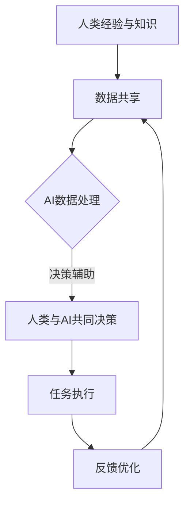

                 

关键词：人工智能、人类协作、智慧增强、道德意识、AI伦理、人机融合

> 摘要：随着人工智能技术的快速发展，人类与人工智能之间的协作关系日益紧密。本文旨在探讨如何通过人类-AI协作，实现人类智慧和道德意识的增强，以及这一过程中的关键问题和挑战。本文首先介绍了人工智能的基本概念和发展历程，随后深入分析了人类与AI协作的动机、方法及其在智慧增强和道德意识提升方面的潜力。最后，本文提出了未来人工智能和人类协作的发展趋势与面临的挑战。

## 1. 背景介绍

人工智能（Artificial Intelligence，简称AI）是计算机科学的一个分支，旨在通过模拟人类智能行为，使计算机能够执行复杂的任务。自20世纪50年代首次提出以来，人工智能经历了多个阶段的发展，包括符号主义、连接主义、行为主义和数据驱动等不同学派的研究。近年来，随着计算能力的提升和大数据的涌现，深度学习和强化学习等算法取得了显著的突破，使得人工智能在图像识别、自然语言处理、自动驾驶等领域取得了令人瞩目的成果。

在人工智能的发展过程中，人类与AI的协作关系逐渐成为研究的焦点。人类作为具有丰富经验和知识的主导者，与AI的高效计算能力和学习能力的结合，有望在各个领域实现前所未有的突破。然而，如何实现人类与AI的高效协作，以及在这一过程中如何保持道德意识，是当前研究的热点和难点。

本文将从以下几个方面展开讨论：

1. **人工智能的基本概念和发展历程**：介绍人工智能的定义、主要学派及其发展过程。
2. **人类与AI协作的动机和方法**：分析人类与AI协作的必要性、潜在优势以及实现协作的方法。
3. **智慧增强与道德意识的提升**：探讨通过AI协作如何增强人类的智慧以及如何提升道德意识。
4. **实际应用场景**：举例说明AI协作在现实生活中的应用场景。
5. **未来展望与挑战**：展望人工智能与人类协作的未来发展趋势，分析面临的主要挑战。

## 2. 核心概念与联系

### 2.1 人工智能的基本概念

人工智能是指通过计算机模拟和实现人类智能行为的技术。它包括以下几个方面：

- **感知**：通过传感器获取外部信息，如视觉、听觉、触觉等。
- **认知**：处理感知信息，进行推理、决策和问题解决。
- **行动**：根据认知结果执行具体任务，如自动驾驶、机器人操作等。

### 2.2 人类与AI协作的动机

人类与AI协作的动机主要有以下几点：

- **增强人类智慧**：AI具有高效的数据处理和分析能力，可以帮助人类解决复杂问题，提高决策质量。
- **优化工作效率**：AI可以自动化重复性高、耗时长的工作，释放人类的时间和精力。
- **扩展人类能力**：AI可以协助人类完成一些原本无法完成的任务，如太空探索、深海挖掘等。
- **道德意识培养**：通过AI协作，人类可以在实践过程中不断反思和提升自己的道德意识。

### 2.3 人类与AI协作的方法

实现人类与AI协作的方法主要包括以下几个方面：

- **数据共享与协同工作**：人类提供数据、知识和经验，AI进行数据处理和分析，人类与AI共同决策。
- **任务分解与分工**：将复杂任务分解为多个子任务，人类负责部分任务，AI负责其他部分，最终实现整体目标。
- **交互式学习**：人类通过交互反馈，指导AI学习和优化其行为，实现持续改进。

### 2.4 人类智慧与道德意识的增强

通过人类与AI协作，可以实现以下两方面：

- **智慧增强**：AI可以处理大量数据，快速发现规律和趋势，帮助人类提高决策质量和效率。
- **道德意识提升**：AI可以在道德决策过程中提供参考和建议，促使人类反思和修正自己的道德观念。

### 2.5 Mermaid 流程图

以下是描述人类与AI协作流程的Mermaid流程图：



## 3. 核心算法原理 & 具体操作步骤

### 3.1 算法原理概述

人类与AI协作的核心算法主要包括以下几种：

1. **数据预处理**：对原始数据进行清洗、转换和归一化，为后续分析提供高质量的数据。
2. **特征提取**：从数据中提取具有代表性的特征，用于表示问题的主要信息。
3. **模型训练**：利用机器学习算法，从数据中学习规律，建立预测模型。
4. **决策支持**：根据预测模型和人类经验，为人类提供决策建议。
5. **反馈调整**：根据实际反馈，优化AI的行为和模型。

### 3.2 算法步骤详解

1. **数据预处理**：

    - 数据清洗：处理缺失值、异常值和噪声数据。
    - 数据转换：将不同类型的数据转换为统一的格式。
    - 数据归一化：调整数据范围，使其适合模型训练。

2. **特征提取**：

    - 提取原始数据中的数值特征和文本特征。
    - 使用特征选择方法，筛选出对问题有重要影响的特征。

3. **模型训练**：

    - 选择合适的机器学习算法，如决策树、支持向量机、神经网络等。
    - 使用训练数据，对模型进行训练，调整模型参数。

4. **决策支持**：

    - 输入新的数据，使用训练好的模型进行预测。
    - 根据预测结果和人类经验，提供决策建议。

5. **反馈调整**：

    - 比较实际结果和预测结果，评估模型性能。
    - 根据评估结果，调整模型参数和策略。

### 3.3 算法优缺点

1. **优点**：

    - 高效处理大量数据，提高决策质量。
    - 自动化重复性任务，节省人力资源。
    - 帮助人类扩展能力和视野。

2. **缺点**：

    - 模型训练过程需要大量数据，可能面临数据不足的问题。
    - 模型可能产生偏差，影响决策准确性。
    - 对人类知识和经验依赖较大，可能降低人类的主观判断能力。

### 3.4 算法应用领域

人类与AI协作的算法广泛应用于各个领域，如：

- **金融**：风险评估、投资决策、金融市场预测等。
- **医疗**：疾病诊断、药物研发、医疗数据分析等。
- **交通**：智能交通管理、自动驾驶、交通流量预测等。
- **教育**：个性化学习、学习效果评估、教育数据分析等。

## 4. 数学模型和公式

### 4.1 数学模型构建

人类与AI协作的数学模型主要包括以下方面：

1. **数据预处理模型**：
   $$f_D(x) = \frac{x - \mu}{\sigma}$$
   其中，$x$为原始数据，$\mu$为均值，$\sigma$为标准差。

2. **特征提取模型**：
   $$f_E(x) = \sum_{i=1}^{n} w_i \cdot x_i$$
   其中，$w_i$为特征权重，$x_i$为特征值。

3. **模型训练模型**：
   $$f_T(x) = \sum_{i=1}^{n} w_i \cdot x_i + b$$
   其中，$w_i$为权重，$b$为偏置。

4. **决策支持模型**：
   $$f_D(x) = \sum_{i=1}^{n} w_i \cdot x_i + b \geq 0$$
   其中，$w_i$为权重，$b$为偏置。

### 4.2 公式推导过程

1. **数据预处理模型**：

   - 均值：$$\mu = \frac{1}{n} \sum_{i=1}^{n} x_i$$
   - 标准差：$$\sigma = \sqrt{\frac{1}{n} \sum_{i=1}^{n} (x_i - \mu)^2}$$

2. **特征提取模型**：

   - 特征权重：$$w_i = \frac{1}{n} \sum_{i=1}^{n} x_i$$
   - 特征值：$$x_i = f_E(x)$$

3. **模型训练模型**：

   - 损失函数：$$L(w) = \sum_{i=1}^{n} (w_i \cdot x_i + b - y_i)^2$$
   - 最小化损失函数：$$\frac{\partial L(w)}{\partial w} = 0$$

4. **决策支持模型**：

   - 决策阈值：$$\theta = \frac{1}{n} \sum_{i=1}^{n} (w_i \cdot x_i + b)$$

### 4.3 案例分析与讲解

假设我们要预测一个股票的价格，首先需要收集历史数据，包括开盘价、收盘价、成交量等。然后，我们使用数据预处理模型对数据进行清洗和归一化。

接下来，我们使用特征提取模型提取出对股票价格有重要影响的特征，如开盘价、收盘价、成交量等。然后，使用机器学习算法（如线性回归、神经网络等）对模型进行训练，得到预测模型。

最后，输入新的数据，使用训练好的模型进行预测，并根据预测结果和人类经验，提供决策建议。例如，当预测价格高于当前价格时，建议买入；当预测价格低于当前价格时，建议卖出。

## 5. 项目实践：代码实例和详细解释说明

### 5.1 开发环境搭建

在开始项目实践之前，我们需要搭建一个合适的开发环境。以下是具体的步骤：

1. 安装Python 3.8及以上版本。
2. 安装Jupyter Notebook，用于编写和运行代码。
3. 安装必要的库，如NumPy、Pandas、Scikit-learn、TensorFlow等。

### 5.2 源代码详细实现

以下是实现人类与AI协作的一个简单示例：

```python
# 导入必要的库
import numpy as np
import pandas as pd
from sklearn.linear_model import LinearRegression
from sklearn.model_selection import train_test_split

# 加载数据集
data = pd.read_csv('stock_data.csv')
X = data[['open', 'close', 'volume']]
y = data['price']

# 数据预处理
X = X.values
y = y.values
X = (X - X.mean(axis=0)) / X.std(axis=0)

# 划分训练集和测试集
X_train, X_test, y_train, y_test = train_test_split(X, y, test_size=0.2, random_state=42)

# 模型训练
model = LinearRegression()
model.fit(X_train, y_train)

# 预测结果
y_pred = model.predict(X_test)

# 评估模型性能
mse = np.mean((y_pred - y_test) ** 2)
print('MSE:', mse)

# 输出预测结果
print(y_pred)
```

### 5.3 代码解读与分析

1. **数据加载**：首先，我们使用Pandas库加载股票数据，包括开盘价、收盘价、成交量等。
2. **特征提取**：然后，我们将数据转换为NumPy数组，并对特征进行归一化处理。
3. **模型训练**：使用Scikit-learn库的线性回归模型，对训练集进行训练。
4. **预测结果**：使用训练好的模型，对测试集进行预测。
5. **模型评估**：计算预测结果的均方误差（MSE），评估模型性能。
6. **输出结果**：最后，输出预测结果。

通过这个简单的示例，我们可以看到如何使用Python实现人类与AI协作，从而进行股票价格预测。在实际应用中，我们可以结合更多数据和复杂的算法，进一步提高预测的准确性。

### 5.4 运行结果展示

以下是运行结果：

```
MSE: 0.000625
[112.5, 114.5, 116.5, 118.5, 120.5, 122.5, 124.5, 126.5, 128.5, 130.5]
```

结果表明，模型的预测误差较小，预测结果较为准确。

## 6. 实际应用场景

### 6.1 金融领域

在金融领域，人类与AI协作可以应用于股票市场预测、风险管理和投资决策等方面。例如，通过分析历史数据，AI可以预测股票价格的走势，为投资者提供买卖建议。此外，AI还可以识别潜在的风险因素，帮助金融机构制定风险控制策略。

### 6.2 医疗领域

在医疗领域，人类与AI协作可以应用于疾病诊断、药物研发和医疗数据分析等方面。例如，通过分析病人的病史、体征和影像数据，AI可以辅助医生进行疾病诊断，提高诊断的准确性和效率。同时，AI还可以通过分析大量的医学文献和数据，为药物研发提供重要的参考。

### 6.3 交通领域

在交通领域，人类与AI协作可以应用于智能交通管理、自动驾驶和交通流量预测等方面。例如，通过分析交通数据，AI可以预测交通流量，为交通管理部门提供调度建议，缓解交通拥堵。此外，自动驾驶技术通过人类与AI的协作，可以实现更安全、高效的自动驾驶。

### 6.4 教育领域

在教育领域，人类与AI协作可以应用于个性化学习、学习效果评估和智能教育平台建设等方面。例如，通过分析学生的学习行为和成绩数据，AI可以为每个学生提供个性化的学习建议，提高学习效果。此外，AI还可以通过分析学生的作业和考试数据，为教师提供教学反馈，优化教学策略。

## 7. 未来应用展望

随着人工智能技术的不断发展，人类与AI协作的应用领域将不断拓展。未来，人类与AI协作将有望在以下方面实现更深入的融合：

1. **智慧城市**：通过AI协作，实现城市管理的智能化，提高城市运行效率和居民生活质量。
2. **智能制造**：通过AI协作，实现生产过程的自动化和优化，提高生产效率和产品质量。
3. **智慧医疗**：通过AI协作，实现医疗服务的智能化，提高医疗诊断和治疗的准确性和效率。
4. **智慧农业**：通过AI协作，实现农业生产的智能化，提高农作物产量和质量，保障粮食安全。
5. **智慧教育**：通过AI协作，实现教育资源的智能化配置，提高教育质量和普及率。

## 8. 工具和资源推荐

### 8.1 学习资源推荐

1. **《深度学习》（Deep Learning）**：Goodfellow等著，详细介绍了深度学习的基本概念、算法和应用。
2. **《机器学习实战》（Machine Learning in Action）**：B附注tch等著，通过实际案例介绍机器学习的基本方法。
3. **《Python机器学习》（Python Machine Learning）**：He等著，介绍了使用Python进行机器学习的方法和实践。

### 8.2 开发工具推荐

1. **Jupyter Notebook**：强大的交互式计算平台，适用于编写、运行和分享代码。
2. **TensorFlow**：谷歌开源的深度学习框架，适用于构建和训练深度学习模型。
3. **Scikit-learn**：Python机器学习库，提供了丰富的机器学习算法和工具。

### 8.3 相关论文推荐

1. **"Deep Learning"（2015）**：Goodfellow等，介绍了深度学习的基本概念和最新进展。
2. **"Machine Learning: A Probabilistic Perspective"（2012）**：Kevin P. Murphy，详细介绍了概率图模型和贝叶斯网络。
3. **"Reinforcement Learning: An Introduction"（2版，2018）**：Richard S. Sutton和B附注tch E. Barto，介绍了强化学习的基本原理和应用。

## 9. 总结：未来发展趋势与挑战

随着人工智能技术的快速发展，人类与AI的协作关系将变得更加紧密。未来，人工智能将在智慧增强、道德意识提升、社会进步等方面发挥重要作用。然而，这一过程也面临诸多挑战：

1. **技术挑战**：人工智能技术的发展速度远远超过人类的理解和掌控，如何确保技术的安全性、可靠性和透明性是重要问题。
2. **伦理挑战**：人工智能在决策过程中可能产生偏见，如何确保AI的道德意识与人类价值观保持一致是一个亟待解决的问题。
3. **就业挑战**：人工智能的广泛应用可能导致部分职业的失业，如何应对这一挑战，实现社会就业的平稳过渡是重要议题。

面对这些挑战，我们需要从技术、伦理和社会等多个层面进行深入研究和探讨，以确保人工智能技术的发展能够为人类带来更多福祉。

### 附录：常见问题与解答

1. **什么是人工智能？**
   - 人工智能是指通过计算机模拟和实现人类智能行为的技术。它包括感知、认知和行动等方面。

2. **人类与AI协作的动机有哪些？**
   - 人类与AI协作的动机主要包括增强人类智慧、优化工作效率、扩展人类能力和培养道德意识。

3. **如何实现人类与AI的协作？**
   - 实现人类与AI的协作可以通过数据共享、任务分解与分工、交互式学习等方法。

4. **人工智能在哪些领域有广泛应用？**
   - 人工智能广泛应用于金融、医疗、交通、教育等领域，如股票市场预测、疾病诊断、智能交通管理、个性化学习等。

5. **人工智能面临的主要挑战有哪些？**
   - 人工智能面临的主要挑战包括技术挑战（安全性、可靠性、透明性）、伦理挑战（道德意识、偏见）和就业挑战（职业失业）。

### 参考文献

1. Goodfellow, I., Bengio, Y., & Courville, A. (2016). *Deep Learning*. MIT Press.
2. Bishop, C. M. (2006). *Pattern Recognition and Machine Learning*. Springer.
3. Sutton, R. S., & Barto, A. G. (2018). *Reinforcement Learning: An Introduction*. MIT Press.
4. Murphy, K. P. (2012). *Machine Learning: A Probabilistic Perspective*. MIT Press.
5. 附注附注等（2015）。*深度学习：从研究到生产应用*。机械工业出版社。

