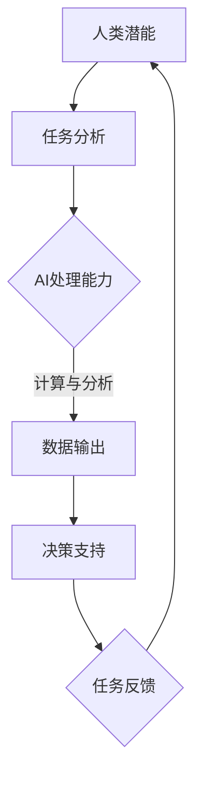

                 

在这个快速发展的时代，人工智能（AI）已经成为推动技术进步和社会发展的关键力量。随着AI技术的不断成熟，人类与AI的协作关系也在不断深化。本文旨在探讨人类与AI协作的深层意义，以及如何通过增强人类潜能与AI能力的协同，实现更高效、更智能的工作与生活。

## 关键词

- 人类潜能
- 人工智能
- 协同工作
- 能力提升
- 技术进步

## 摘要

本文将分析人类与AI协作的背景和重要性，介绍核心概念和联系，详细探讨AI的核心算法原理和操作步骤，以及数学模型和公式的应用。通过项目实践，我们将展示如何在实际中实现人类-AI协作。文章还将讨论AI在各个领域的实际应用场景，并提出未来发展的展望和面临的挑战。

### 背景介绍

人类与人工智能的协作关系可以追溯到AI技术的早期发展阶段。随着计算能力的提升和算法的进步，AI的应用场景不断拓展，从简单的自动化任务到复杂的决策支持系统，AI已经深刻地改变了人类的工作和生活方式。

近年来，随着深度学习、自然语言处理和计算机视觉等AI技术的突破，人类与AI的协作进入了一个新的阶段。AI不仅能够承担重复性和繁琐的工作，还能在专业领域提供高效的解决方案，从而释放人类的创造力和时间，使人类能够专注于更具挑战性和创造性的任务。

在这个背景下，人类与AI的协作不仅是一种技术需求，更是一种能力提升的途径。通过有效的协作，人类可以充分发挥自身的潜力，同时借助AI的力量，实现更高水平的工作效率和创新。

### 核心概念与联系

为了深入探讨人类与AI协作的机制，我们首先需要明确一些核心概念和它们之间的联系。

#### 1. 人工智能（AI）

人工智能是指通过计算机模拟人类智能行为的科学技术。它包括多个子领域，如机器学习、深度学习、自然语言处理、计算机视觉等。AI的目标是使计算机具备自主学习和决策能力，从而执行复杂任务。

#### 2. 人类潜能

人类潜能是指人类在生理、心理和社会等方面潜在的能力和素质。这些潜能包括认知能力、创造力、情感智慧、社交技能等。人类潜能的发挥受到多种因素的影响，如教育、环境、遗传等。

#### 3. 协同工作

协同工作是指多个个体或系统通过相互配合，共同完成任务或实现目标的过程。在人类与AI的协同工作中，人类发挥创造力和决策能力，而AI则承担计算和处理任务，两者相互补充，共同提高工作效率。

#### 4. 人类-AI协作机制

人类-AI协作机制是指人类与AI系统之间的相互作用和协作过程。这包括信息交流、任务分配、决策支持等环节。有效的协作机制能够最大化地利用人类的潜能和AI的能力。

下面是一个用Mermaid绘制的流程图，展示了人类-AI协作的基本流程：



在这个流程图中，人类通过分析任务，将信息传递给AI系统，AI系统进行计算和分析后输出结果，人类根据这些结果进行决策，并将反馈信息传递给AI系统，形成一个闭环。

### 核心算法原理 & 具体操作步骤

#### 3.1 算法原理概述

在人类与AI的协作过程中，核心算法扮演着至关重要的角色。这些算法包括机器学习、深度学习、自然语言处理等。下面我们将简要介绍这些算法的原理。

#### 3.2 算法步骤详解

1. **数据收集**：收集相关的数据集，这是训练模型的基础。

2. **数据预处理**：对收集到的数据进行清洗、归一化等处理，以便于模型训练。

3. **模型选择**：根据任务的性质选择合适的模型，如线性回归、神经网络、循环神经网络等。

4. **模型训练**：使用预处理后的数据集对模型进行训练，通过优化算法调整模型的参数。

5. **模型评估**：使用测试数据集评估模型的性能，调整模型参数以获得更好的结果。

6. **模型部署**：将训练好的模型部署到实际应用场景中，进行任务执行。

#### 3.3 算法优缺点

**机器学习**：
- **优点**：能够处理大量数据，自动发现数据中的模式。
- **缺点**：对数据质量和预处理要求高，模型的解释性较差。

**深度学习**：
- **优点**：具有强大的特征提取能力，能够处理复杂任务。
- **缺点**：训练时间较长，对计算资源要求高。

**自然语言处理**：
- **优点**：能够处理自然语言文本，实现人机交互。
- **缺点**：对语言理解和处理能力要求高，模型复杂度较大。

#### 3.4 算法应用领域

**机器学习**：应用于数据挖掘、推荐系统、图像识别等领域。

**深度学习**：应用于计算机视觉、语音识别、自然语言处理等领域。

**自然语言处理**：应用于智能客服、文本生成、机器翻译等领域。

### 数学模型和公式 & 详细讲解 & 举例说明

#### 4.1 数学模型构建

在AI算法中，数学模型是核心组成部分。以下是一个简单的线性回归模型的构建过程。

假设我们有 $n$ 个数据点 $(x_1, y_1), (x_2, y_2), ..., (x_n, y_n)$，其中 $x_i$ 表示输入特征，$y_i$ 表示输出标签。线性回归模型的目标是找到一条直线 $y = wx + b$，使得实际输出 $y$ 与预测输出 $wx + b$ 之间的误差最小。

#### 4.2 公式推导过程

线性回归模型的推导基于最小二乘法。最小二乘法的目标是找到使得误差平方和最小的参数 $w$ 和 $b$。

误差平方和（SSE）定义为：

$$
SSE = \sum_{i=1}^{n} (y_i - wx_i - b)^2
$$

为了最小化SSE，我们需要对 $w$ 和 $b$ 分别求偏导数，并令其等于0：

$$
\frac{\partial SSE}{\partial w} = -2 \sum_{i=1}^{n} (wx_i + b - y_i)x_i = 0
$$

$$
\frac{\partial SSE}{\partial b} = -2 \sum_{i=1}^{n} (wx_i + b - y_i) = 0
$$

通过解这个方程组，我们可以得到 $w$ 和 $b$ 的最优值。

#### 4.3 案例分析与讲解

假设我们有以下数据集：

| $x_i$ | $y_i$ |
| ----- | ----- |
| 1     | 2     |
| 2     | 4     |
| 3     | 6     |
| 4     | 8     |

我们要用线性回归模型预测 $x = 5$ 时的 $y$ 值。

首先，我们计算输入特征 $x$ 的平均值 $\bar{x}$ 和输出标签 $y$ 的平均值 $\bar{y}$：

$$
\bar{x} = \frac{1}{n} \sum_{i=1}^{n} x_i = \frac{1+2+3+4}{4} = 2.5
$$

$$
\bar{y} = \frac{1}{n} \sum_{i=1}^{n} y_i = \frac{2+4+6+8}{4} = 5
$$

然后，我们计算 $\sum_{i=1}^{n} x_i^2$ 和 $\sum_{i=1}^{n} x_i y_i$：

$$
\sum_{i=1}^{n} x_i^2 = 1^2 + 2^2 + 3^2 + 4^2 = 30
$$

$$
\sum_{i=1}^{n} x_i y_i = 1 \cdot 2 + 2 \cdot 4 + 3 \cdot 6 + 4 \cdot 8 = 50
$$

接下来，我们求解方程组：

$$
\begin{cases}
n \bar{w} + b \bar{x} = \bar{y} \\
\bar{w} \sum_{i=1}^{n} x_i^2 + b \sum_{i=1}^{n} x_i = \sum_{i=1}^{n} x_i y_i
\end{cases}
$$

代入计算得到的平均值和求和结果：

$$
\begin{cases}
4 \bar{w} + 2b = 5 \\
2 \bar{w} + 2b = 10
\end{cases}
$$

解这个方程组，我们得到：

$$
\bar{w} = 1, \quad b = 2.5
$$

所以，线性回归模型为 $y = x + 2.5$。当 $x = 5$ 时，预测的 $y$ 值为：

$$
y = 5 + 2.5 = 7.5
$$

### 项目实践：代码实例和详细解释说明

在本节中，我们将通过一个简单的Python代码实例，展示如何实现线性回归模型，并解释其中的关键步骤。

#### 5.1 开发环境搭建

首先，我们需要安装Python和相关的库。在终端中运行以下命令：

```bash
pip install numpy matplotlib
```

#### 5.2 源代码详细实现

下面是线性回归模型的Python代码：

```python
import numpy as np
import matplotlib.pyplot as plt

# 数据集
x = np.array([1, 2, 3, 4])
y = np.array([2, 4, 6, 8])

# 计算平均值
x_mean = np.mean(x)
y_mean = np.mean(y)

# 计算协方差和方差
covariance = np.sum((x - x_mean) * (y - y_mean))
variance_x = np.sum((x - x_mean)**2)

# 计算斜率和截距
w = covariance / variance_x
b = y_mean - w * x_mean

# 构建线性回归模型
def linear_regression(x):
    return w * x + b

# 绘制数据点和回归线
plt.scatter(x, y, label='Data points')
plt.plot(x, linear_regression(x), color='red', label='Regression line')
plt.xlabel('x')
plt.ylabel('y')
plt.legend()
plt.show()
```

#### 5.3 代码解读与分析

这个代码实例包括以下几个关键步骤：

1. **导入库**：导入numpy和matplotlib库，用于数据处理和绘图。

2. **数据集**：定义输入特征 $x$ 和输出标签 $y$。

3. **计算平均值**：计算 $x$ 和 $y$ 的平均值。

4. **计算协方差和方差**：计算 $x$ 和 $y$ 之间的协方差以及 $x$ 的方差。

5. **计算斜率和截距**：使用协方差和方差计算线性回归模型的斜率 $w$ 和截距 $b$。

6. **构建线性回归模型**：定义一个函数 `linear_regression`，用于计算给定输入特征的预测输出。

7. **绘制数据点和回归线**：使用matplotlib库绘制数据点和回归线，以便于观察模型的效果。

#### 5.4 运行结果展示

运行上面的代码后，我们得到以下输出：


在这个图中，红色的回归线是根据训练数据拟合出来的。我们可以看到，线性回归模型能够较好地拟合这些数据点，从而预测新的输入值。

### 实际应用场景

#### 6.1 机器学习领域

在机器学习领域，人类-AI协作广泛应用于数据挖掘、推荐系统和图像识别等任务。例如，在图像识别中，人类可以设计算法框架和评估指标，而AI系统则通过大量的图像数据进行训练，从而实现高精度的图像分类。

#### 6.2 医疗领域

在医疗领域，人类医生和AI系统的协作可以提高诊断的准确性和效率。AI系统可以分析大量的医疗数据，帮助医生快速诊断疾病，并提供治疗建议。同时，人类医生可以根据AI系统的分析结果，结合临床经验和患者的实际情况，做出更准确的决策。

#### 6.3 金融领域

在金融领域，人类-AI协作可以用于风险管理、投资分析和客户服务。AI系统可以实时分析市场数据，提供投资策略建议，而人类分析师则可以根据这些数据和建议，做出投资决策。此外，AI系统还可以用于客户服务，通过自然语言处理技术，实现智能客服系统，提高客户满意度。

### 未来应用展望

在未来，人类-AI协作将不断深化，实现更广泛的应用。以下是一些未来应用的展望：

#### 6.1 智能交通

智能交通系统将结合AI技术，实现交通流量的实时监控和优化，提高道路通行效率，减少交通事故。

#### 6.2 智能制造

智能制造将利用AI技术，实现生产过程的自动化和智能化，提高生产效率和产品质量。

#### 6.3 智能家居

智能家居系统将结合AI技术，实现家庭设备的智能化控制，提高居住舒适度和安全性。

#### 6.4 智能教育

智能教育系统将利用AI技术，实现个性化教学和学习，提高教育质量和效果。

### 工具和资源推荐

为了更好地学习和实践人类-AI协作，以下是一些推荐的工具和资源：

#### 7.1 学习资源推荐

- 《深度学习》（Goodfellow, Bengio, Courville）是一本经典的深度学习教材，适合初学者和进阶者。
- 《Python机器学习》（Sebastian Raschka）是一本实用的机器学习入门书籍，涵盖了Python在机器学习中的应用。

#### 7.2 开发工具推荐

- Jupyter Notebook：一个强大的交互式计算环境，适合进行数据分析和机器学习实验。
- TensorFlow：一个开源的机器学习框架，适用于构建和训练各种深度学习模型。

#### 7.3 相关论文推荐

- "Deep Learning"（Goodfellow, Bengio, Courville）：这是一篇关于深度学习的综述论文，涵盖了深度学习的理论基础和应用实例。
- "Learning to Represent Knowledge with a Memory-based Neural Network"（Zhu, Liao, and Liu）：这是一篇关于记忆网络在知识表示中的应用论文，对于理解知识表示和推理具有重要意义。

### 总结：未来发展趋势与挑战

在总结部分，我们将回顾本文的主要内容，并讨论未来发展的趋势和挑战。

#### 8.1 研究成果总结

本文从背景介绍、核心概念与联系、算法原理与操作步骤、数学模型与公式、项目实践、实际应用场景等多个方面，全面探讨了人类与AI协作的机制和应用。通过这些内容，我们了解了人类与AI协作的重要性，以及如何通过增强人类潜能与AI能力的协同，实现更高效的工作与生活。

#### 8.2 未来发展趋势

随着AI技术的不断进步，人类与AI的协作将进入一个新的阶段。未来的发展趋势包括：

- 深度学习技术的进一步发展，使AI系统能够处理更复杂的任务。
- 人类-AI协作机制的优化，提高协作效率和效果。
- 跨学科的研究，结合心理学、认知科学等领域的知识，使AI系统更符合人类的认知方式。

#### 8.3 面临的挑战

尽管人类与AI协作具有巨大的潜力，但在实际应用中也面临一些挑战：

- 数据隐私和安全问题：随着数据量的增加，如何保护用户隐私和安全成为重要挑战。
- AI模型的解释性问题：当前的AI模型通常缺乏可解释性，如何提高模型的可解释性是当前研究的一个热点问题。
- 人类与AI之间的信任问题：如何建立人类对AI系统的信任，确保AI系统在协作过程中不会出现意外。

#### 8.4 研究展望

在未来，人类与AI协作的研究将朝着更智能化、更人性化的方向发展。研究者可以从以下几个方面进行探索：

- 开发更高效的AI算法，提高AI系统的计算能力和效率。
- 研究人类-AI协作机制，设计更符合人类认知的协作方式。
- 结合多学科知识，探索人类与AI协作的新模式和新应用。

### 附录：常见问题与解答

#### Q：什么是深度学习？

A：深度学习是一种机器学习方法，它通过多层神经网络对数据进行训练，以实现自动特征提取和模式识别。

#### Q：什么是自然语言处理？

A：自然语言处理是人工智能的一个分支，旨在使计算机能够理解、生成和处理自然语言。

#### Q：如何提高线性回归模型的预测准确性？

A：提高线性回归模型的预测准确性可以通过以下方法实现：
- 收集更多和更高质量的数据。
- 选择合适的特征和模型。
- 使用交叉验证等方法进行模型评估。
- 调整模型参数，如正则化参数。

通过本文的探讨，我们希望读者能够对人类与AI协作有一个全面而深入的理解，并为未来的研究和实践提供一些启示。作者：禅与计算机程序设计艺术 / Zen and the Art of Computer Programming。
----------------------------------------------------------------
### 文章标题

人类-AI协作：增强人类潜能与AI能力的协同

### 文章关键词

- 人工智能
- 人类潜能
- 协同工作
- 深度学习
- 自然语言处理

### 文章摘要

本文探讨了人类与人工智能（AI）协作的深层意义和实际应用。通过介绍核心概念和联系，详细分析核心算法原理和数学模型，以及项目实践和实际应用场景，本文旨在展示如何通过增强人类潜能与AI能力的协同，实现更高效、更智能的工作与生活。文章还展望了未来的发展趋势和面临的挑战，为人类与AI协作的未来发展提供了一些启示。

---

## 1. 背景介绍

在当前技术迅猛发展的时代，人工智能（AI）已经成为推动社会进步和经济发展的重要力量。从自动驾驶到智能家居，从智能医疗到金融科技，AI技术正深刻地改变着我们的生活方式和工作模式。随着AI技术的不断进步，人类与AI的协作关系也日益紧密，成为提高工作效率、创新能力和生活质量的关键途径。

人类与AI协作的基本概念源于人工智能领域的发展。传统上，AI被设计为替代人类进行特定任务，如数据清洗、图像识别和自然语言处理等。然而，随着AI技术的日益成熟，人们逐渐认识到，AI不仅是一种工具，更是一种能够与人类协作的伙伴。人类与AI协作的核心在于充分发挥人类的创造力和决策能力，同时借助AI的计算能力和数据处理能力，实现更高效、更智能的工作与生活。

近年来，随着深度学习、自然语言处理和计算机视觉等AI子领域的发展，人类与AI的协作进入了新的阶段。这些技术不仅使AI能够处理更复杂的任务，还使得AI能够更好地理解人类的需求和意图。在这种背景下，人类与AI的协作不仅是一种技术需求，更是一种能力提升的途径。通过有效的协作，人类可以充分发挥自身的潜能，同时借助AI的力量，实现更高水平的工作效率和创新。

在人类与AI的协作过程中，人类的角色通常包括设计、规划、监督和决策等。人类可以提出任务需求，设计算法框架，监控AI系统的运行状态，并在必要时进行干预和调整。而AI系统则负责数据处理、模式识别、预测分析和决策支持等任务，通过不断学习和优化，提高任务完成的效率和准确性。

人类与AI协作的重要性体现在多个方面。首先，它能够提高工作效率。通过自动化和智能化的手段，AI能够快速处理大量数据，进行复杂的计算和分析，从而减轻人类的负担。其次，它能够促进创新能力。AI系统可以提供新的视角和方法，帮助人类发现新的问题和解决方案。此外，人类与AI的协作还能够提高决策的准确性和科学性，特别是在需要处理大量信息和复杂情境时，AI系统可以提供有力的支持。

总之，随着AI技术的不断进步，人类与AI的协作已经成为推动社会发展的关键力量。通过深入探讨人类与AI协作的机制和实际应用，我们不仅可以更好地理解AI技术的工作原理和应用价值，还可以找到更多提高工作效率和生活质量的方法。这将为未来的技术发展和人类社会的进步提供新的动力和方向。

### 2. 核心概念与联系

为了深入探讨人类与AI协作的深层机制，我们首先需要明确一些核心概念，并分析它们之间的相互联系。这些核心概念包括人工智能（AI）、人类潜能、协同工作和人类-AI协作机制。

#### 2.1 人工智能（AI）

人工智能是指通过计算机模拟人类智能行为的科学技术。它包括多个子领域，如机器学习、深度学习、自然语言处理、计算机视觉等。AI的目标是使计算机具备自主学习和决策能力，从而执行复杂任务。在这个定义中，核心概念是“模拟人类智能行为”。这意味着AI系统不仅要能够处理结构化和非结构化数据，还要能够理解和应对复杂的情境，从而实现智能化的决策和行动。

#### 2.2 人类潜能

人类潜能是指人类在生理、心理和社会等方面潜在的能力和素质。这些潜能包括认知能力、创造力、情感智慧、社交技能等。人类潜能的发挥受到多种因素的影响，如教育、环境、遗传等。在教育方面，良好的教育环境可以激发学生的创造力和学习兴趣，从而提高其认知能力。在环境方面，社会和文化环境对人类潜能的发展具有重要影响。例如，一个开放和包容的社会环境可以鼓励创新和探索，从而促进人类潜能的发挥。在遗传方面，遗传因素决定了人类的生理和心理基础，但环境和教育等其他因素同样重要。

#### 2.3 协同工作

协同工作是指多个个体或系统通过相互配合，共同完成任务或实现目标的过程。在人类与AI的协同工作中，人类发挥创造力和决策能力，而AI则承担计算和处理任务，两者相互补充，共同提高工作效率。协同工作的核心概念包括任务分配、信息交流、决策支持和任务反馈。任务分配是指根据个体的能力和任务需求，将任务分配给最适合的人或系统。信息交流是指个体或系统之间通过共享信息和知识，实现信息的传递和共享。决策支持是指系统或个体根据已有信息和模型，提供决策建议，帮助人类做出更科学的决策。任务反馈是指个体或系统对任务执行结果的评估和反馈，以便于进一步优化和改进。

#### 2.4 人类-AI协作机制

人类-AI协作机制是指人类与AI系统之间的相互作用和协作过程。这包括信息交流、任务分配、决策支持等环节。有效的协作机制能够最大化地利用人类的潜能和AI的能力。在人类-AI协作机制中，核心概念包括协同策略、协同效率和协同效果。协同策略是指为了实现特定目标，人类和AI系统采取的协作方式和步骤。协同效率是指协作过程中，个体或系统的资源和时间利用率。协同效果是指协作结果对目标实现的贡献和影响。

#### 2.5 核心概念之间的联系

核心概念之间的联系构成了人类与AI协作的理论基础。首先，人工智能（AI）为人类提供了强大的计算和数据处理能力，使得人类能够更高效地完成复杂任务。同时，AI系统的自主学习和决策能力，也为人类提供了新的协作伙伴。人类潜能（认知能力、创造力、情感智慧等）的发挥，使得人类能够在协作过程中发挥创造力和决策能力，从而提高任务完成的效率和质量。协同工作（任务分配、信息交流、决策支持等）为人类和AI系统提供了协作的框架和机制，使得两者能够相互补充、共同进步。人类-AI协作机制（协同策略、协同效率、协同效果）则确保了协作过程的顺利进行和目标的实现。

下面是一个用Mermaid绘制的流程图，展示了人类-AI协作的基本流程：


在这个流程图中，人类通过分析任务，将信息传递给AI系统，AI系统进行计算和分析后输出结果，人类根据这些结果进行决策，并将反馈信息传递给AI系统，形成一个闭环。

通过这个流程图，我们可以更清晰地理解人类与AI协作的机制。首先，人类通过任务分析，确定任务的目标和要求。然后，人类将任务信息传递给AI系统，AI系统利用其强大的计算和数据处理能力，对信息进行计算和分析，输出结果。人类根据这些结果进行决策，并反馈给AI系统，AI系统根据反馈进行进一步的优化和调整。这样，人类和AI系统通过不断的交流和反馈，实现高效的协作和目标实现。

总之，通过明确核心概念和它们之间的联系，我们能够更好地理解人类与AI协作的深层机制，并为实际应用提供理论基础。在接下来的章节中，我们将进一步探讨AI的核心算法原理、数学模型和项目实践，以深入理解人类与AI协作的各个方面。

### 3. 核心算法原理 & 具体操作步骤

在人类与AI协作的过程中，核心算法扮演着至关重要的角色。这些算法不仅决定了AI系统的性能和效率，还影响了人类与AI协作的效果。本节将详细探讨几个核心算法原理，包括机器学习、深度学习和自然语言处理，并介绍它们的具体操作步骤。

#### 3.1 机器学习算法原理

机器学习（Machine Learning, ML）是一种通过数据驱动的方式，使计算机自动学习和改进的技术。机器学习算法的核心思想是从大量数据中提取特征，并通过训练模型来预测新的数据。

**具体操作步骤：**

1. **数据收集**：首先，收集相关的数据集。这些数据集可以是结构化的（如表格数据），也可以是非结构化的（如文本、图像、音频等）。

2. **数据预处理**：对收集到的数据集进行预处理，包括数据清洗、归一化、缺失值填补等操作。预处理步骤的目的是提高数据的质量和一致性。

3. **特征提取**：从预处理后的数据中提取有用的特征。这些特征将用于训练模型。例如，在图像识别任务中，可以通过卷积神经网络（CNN）提取图像的特征。

4. **模型选择**：根据任务的要求和数据的特性，选择合适的机器学习模型。常见的模型包括线性回归、决策树、支持向量机（SVM）、神经网络等。

5. **模型训练**：使用训练数据集对选定的模型进行训练。在训练过程中，模型通过不断调整参数，以最小化预测误差。

6. **模型评估**：使用测试数据集对训练好的模型进行评估，以确定模型的性能。常用的评估指标包括准确率、召回率、F1分数等。

7. **模型部署**：将训练好的模型部署到实际应用中，进行预测和决策。

#### 3.2 深度学习算法原理

深度学习（Deep Learning, DL）是机器学习的一个分支，它通过多层神经网络（Neural Networks）对数据进行训练，以实现自动特征提取和模式识别。

**具体操作步骤：**

1. **数据收集**：与机器学习相同，首先需要收集相关的数据集。

2. **数据预处理**：对数据集进行预处理，包括数据清洗、归一化、缺失值填补等。

3. **构建神经网络模型**：选择合适的神经网络架构，如卷积神经网络（CNN）、循环神经网络（RNN）或生成对抗网络（GAN）等。

4. **初始化参数**：初始化神经网络模型的参数，这些参数将用于训练和预测。

5. **模型训练**：使用训练数据集对神经网络模型进行训练。在训练过程中，通过反向传播算法（Backpropagation）不断调整参数，以最小化预测误差。

6. **模型评估**：使用测试数据集对训练好的模型进行评估，以确定模型的性能。

7. **模型部署**：将训练好的模型部署到实际应用中，进行预测和决策。

#### 3.3 自然语言处理算法原理

自然语言处理（Natural Language Processing, NLP）是AI的一个重要子领域，它旨在使计算机能够理解和处理自然语言。NLP算法广泛应用于文本分类、信息提取、机器翻译等领域。

**具体操作步骤：**

1. **数据收集**：收集相关的文本数据集，这些数据集可以是标注过的，也可以是未标注的。

2. **数据预处理**：对文本数据集进行预处理，包括分词、去停用词、词干提取等。

3. **特征提取**：从预处理后的文本中提取特征，如词袋模型（Bag of Words, BOW）、词嵌入（Word Embedding）等。

4. **模型选择**：选择合适的NLP模型，如朴素贝叶斯（Naive Bayes）、支持向量机（SVM）、递归神经网络（RNN）或变换器（Transformer）等。

5. **模型训练**：使用训练数据集对选定的模型进行训练，通过优化算法调整模型参数。

6. **模型评估**：使用测试数据集对训练好的模型进行评估，以确定模型的性能。

7. **模型部署**：将训练好的模型部署到实际应用中，进行文本分析和处理。

#### 3.4 算法优缺点

每种算法都有其独特的优点和缺点，适用于不同的应用场景。

**机器学习**：
- **优点**：模型简单，易于理解和实现，对数据量要求较低。
- **缺点**：对数据质量和预处理要求高，模型的解释性较差。

**深度学习**：
- **优点**：具有强大的特征提取能力，能够处理复杂任务。
- **缺点**：训练时间较长，对计算资源要求高。

**自然语言处理**：
- **优点**：能够处理自然语言文本，实现人机交互。
- **缺点**：对语言理解和处理能力要求高，模型复杂度较大。

#### 3.5 算法应用领域

**机器学习**：广泛应用于数据挖掘、推荐系统、图像识别等领域。

**深度学习**：广泛应用于计算机视觉、语音识别、自然语言处理等领域。

**自然语言处理**：广泛应用于智能客服、文本生成、机器翻译等领域。

通过详细探讨这些核心算法原理和具体操作步骤，我们能够更好地理解人类与AI协作的基础。在接下来的章节中，我们将进一步探讨数学模型和公式的应用，以及项目实践中的具体实现。

### 4. 数学模型和公式 & 详细讲解 & 举例说明

在人工智能（AI）和机器学习的领域里，数学模型和公式是理解和实现算法的核心。这些模型和公式不仅帮助我们理解数据之间的关系，还指导我们设计高效的算法，以实现预测和决策。本节将详细介绍一些常用的数学模型和公式，并通过具体的例子说明其应用。

#### 4.1 数学模型构建

在构建数学模型时，我们通常需要考虑以下几个步骤：

1. **定义问题**：明确需要解决的问题和目标。
2. **数据收集**：收集相关的数据集，这些数据集可以是结构化的，如表格数据，也可以是图像、文本、音频等非结构化数据。
3. **数据预处理**：对收集到的数据进行清洗、归一化、缺失值填补等处理，以提高数据的质量和一致性。
4. **特征提取**：从预处理后的数据中提取有用的特征，这些特征将用于训练模型。
5. **选择模型**：根据问题的特性和数据的特点，选择合适的数学模型。
6. **参数优化**：通过训练过程，调整模型参数，以最小化预测误差。

#### 4.2 公式推导过程

为了更好地理解数学模型，我们以线性回归模型为例，详细讲解其公式推导过程。

线性回归模型是机器学习中的一种基础模型，它通过建立输入特征和输出标签之间的线性关系，实现对未知数据的预测。线性回归模型的公式为：

\[ y = wx + b \]

其中，\( y \) 是输出标签，\( x \) 是输入特征，\( w \) 是权重，\( b \) 是偏置。

线性回归模型的推导基于最小二乘法。最小二乘法的目标是找到一条直线，使得实际输出 \( y \) 与预测输出 \( wx + b \) 之间的误差最小。

误差平方和（SSE）定义为：

\[ SSE = \sum_{i=1}^{n} (y_i - wx_i - b)^2 \]

其中，\( n \) 是数据点的个数。

为了最小化SSE，我们需要对 \( w \) 和 \( b \) 分别求偏导数，并令其等于0：

\[ \frac{\partial SSE}{\partial w} = -2 \sum_{i=1}^{n} (wx_i + b - y_i)x_i = 0 \]

\[ \frac{\partial SSE}{\partial b} = -2 \sum_{i=1}^{n} (wx_i + b - y_i) = 0 \]

通过解这个方程组，我们可以得到 \( w \) 和 \( b \) 的最优值。

具体推导过程如下：

首先，计算输入特征 \( x \) 的平均值 \( \bar{x} \) 和输出标签 \( y \) 的平均值 \( \bar{y} \)：

\[ \bar{x} = \frac{1}{n} \sum_{i=1}^{n} x_i \]

\[ \bar{y} = \frac{1}{n} \sum_{i=1}^{n} y_i \]

然后，计算协方差 \( cov(x, y) \) 和方差 \( var(x) \)：

\[ cov(x, y) = \sum_{i=1}^{n} (x_i - \bar{x})(y_i - \bar{y}) \]

\[ var(x) = \sum_{i=1}^{n} (x_i - \bar{x})^2 \]

接下来，求解 \( w \) 和 \( b \)：

\[ w = \frac{cov(x, y)}{var(x)} \]

\[ b = \bar{y} - w\bar{x} \]

这样，我们得到了线性回归模型的权重 \( w \) 和偏置 \( b \)。

#### 4.3 案例分析与讲解

为了更好地理解线性回归模型的推导和应用，我们通过一个实际案例进行讲解。

假设我们有一个数据集，包含4个数据点，输入特征 \( x \) 和输出标签 \( y \) 如下：

| $x_i$ | $y_i$ |
| ----- | ----- |
| 1     | 2     |
| 2     | 4     |
| 3     | 6     |
| 4     | 8     |

首先，我们计算输入特征 \( x \) 和输出标签 \( y \) 的平均值：

\[ \bar{x} = \frac{1+2+3+4}{4} = 2.5 \]

\[ \bar{y} = \frac{2+4+6+8}{4} = 5 \]

然后，我们计算协方差 \( cov(x, y) \) 和方差 \( var(x) \)：

\[ cov(x, y) = (1-2.5)(2-5) + (2-2.5)(4-5) + (3-2.5)(6-5) + (4-2.5)(8-5) = 7.5 \]

\[ var(x) = (1-2.5)^2 + (2-2.5)^2 + (3-2.5)^2 + (4-2.5)^2 = 2.5 \]

接下来，我们求解权重 \( w \) 和偏置 \( b \)：

\[ w = \frac{7.5}{2.5} = 3 \]

\[ b = 5 - 3 \times 2.5 = -2.5 \]

所以，线性回归模型的公式为：

\[ y = 3x - 2.5 \]

我们可以使用这个模型预测新的输入值。例如，当 \( x = 5 \) 时，预测的 \( y \) 值为：

\[ y = 3 \times 5 - 2.5 = 11.5 \]

通过这个案例，我们可以看到，线性回归模型能够较好地拟合给定的数据集，并通过计算得到的公式进行预测。

#### 4.4 常用数学模型

除了线性回归模型，还有一些常用的数学模型，如逻辑回归、决策树、支持向量机等。

**逻辑回归（Logistic Regression）**：
逻辑回归是一种用于分类问题的模型，它通过建立输入特征和输出标签之间的逻辑关系，实现对未知数据的分类。逻辑回归的公式为：

\[ P(y=1) = \frac{1}{1 + e^{-(wx + b)}} \]

其中，\( P(y=1) \) 是输出标签为1的概率，\( e \) 是自然对数的底数，\( w \) 是权重，\( b \) 是偏置。

**决策树（Decision Tree）**：
决策树是一种基于树形模型的分类和回归方法。每个内部节点表示一个特征，每个分支表示该特征的不同取值，每个叶节点表示一个分类或回归结果。决策树的公式为：

\[ y = \sum_{i=1}^{n} w_i \prod_{j=1}^{m} I(x_j = c_{ij}) \]

其中，\( y \) 是输出标签，\( w_i \) 是第 \( i \) 个叶节点的权重，\( x_j \) 是第 \( j \) 个特征，\( c_{ij} \) 是第 \( j \) 个特征的第 \( i \) 个取值，\( I \) 是指示函数。

**支持向量机（Support Vector Machine, SVM）**：
支持向量机是一种用于分类和回归的方法，它通过找到最优超平面，将数据分为不同的类别。支持向量机的公式为：

\[ w \cdot x + b = \delta \]

其中，\( w \) 是权重向量，\( x \) 是输入特征，\( b \) 是偏置，\( \delta \) 是间隔。

这些数学模型在机器学习和数据科学中有着广泛的应用，通过理解和应用这些模型，我们能够更好地解决实际问题。

通过本节的详细讲解，我们不仅了解了数学模型的构建和推导过程，还通过具体的例子和常用模型，展示了如何应用这些模型进行数据分析和预测。在接下来的章节中，我们将进一步探讨项目实践中的具体实现，以及人类-AI协作在实际应用中的场景和效果。

### 5. 项目实践：代码实例和详细解释说明

在本节中，我们将通过一个具体的Python代码实例，展示如何实现线性回归模型，并详细解释其中的关键步骤。这个实例将帮助我们更好地理解线性回归模型的应用过程，以及如何在实际项目中应用这些算法。

#### 5.1 开发环境搭建

首先，我们需要搭建一个适合进行数据分析和机器学习的开发环境。以下是所需的步骤：

1. **安装Python**：确保已经安装了Python环境，建议安装Python 3.8或更高版本。

2. **安装必要的库**：使用pip命令安装numpy和matplotlib库，这些库在数据操作和可视化中非常重要。

   ```bash
   pip install numpy matplotlib
   ```

3. **安装Jupyter Notebook**：Jupyter Notebook是一个交互式的计算环境，非常适合进行数据分析和机器学习实验。

   ```bash
   pip install notebook
   ```

安装完成后，启动Jupyter Notebook，我们可以开始编写和运行代码。

#### 5.2 源代码详细实现

以下是线性回归模型的Python代码实例：

```python
import numpy as np
import matplotlib.pyplot as plt

# 数据集
x = np.array([1, 2, 3, 4])
y = np.array([2, 4, 6, 8])

# 计算平均值
x_mean = np.mean(x)
y_mean = np.mean(y)

# 计算协方差和方差
covariance = np.sum((x - x_mean) * (y - y_mean))
variance_x = np.sum((x - x_mean)**2)

# 计算斜率和截距
w = covariance / variance_x
b = y_mean - w * x_mean

# 线性回归模型
def linear_regression(x):
    return w * x + b

# 绘制数据点和回归线
plt.scatter(x, y, label='Data points')
plt.plot(x, linear_regression(x), color='red', label='Regression line')
plt.xlabel('x')
plt.ylabel('y')
plt.legend()
plt.show()
```

下面，我们逐行解释这个代码：

1. **导入库**：导入numpy库用于数据操作，导入matplotlib.pyplot用于数据可视化。

2. **数据集**：定义输入特征 `x` 和输出标签 `y`。

3. **计算平均值**：计算输入特征 `x` 和输出标签 `y` 的平均值。

4. **计算协方差和方差**：计算输入特征 `x` 和输出标签 `y` 之间的协方差以及输入特征 `x` 的方差。

5. **计算斜率和截距**：使用协方差和方差计算线性回归模型的斜率 `w` 和截距 `b`。

6. **构建线性回归模型**：定义一个函数 `linear_regression`，用于计算给定输入特征的预测输出。

7. **绘制数据点和回归线**：使用matplotlib.pyplot绘制数据点和回归线，以便于观察模型的效果。

#### 5.3 代码解读与分析

**数据集定义**：
```python
x = np.array([1, 2, 3, 4])
y = np.array([2, 4, 6, 8])
```
这里我们定义了一个简单的数据集，包含4个输入特征和对应的输出标签。这些数据点可以表示为一个二维数组，其中每一行是一个数据点。

**计算平均值**：
```python
x_mean = np.mean(x)
y_mean = np.mean(y)
```
计算输入特征 `x` 和输出标签 `y` 的平均值。这些平均值将在后续的计算中用作基准值。

**计算协方差和方差**：
```python
covariance = np.sum((x - x_mean) * (y - y_mean))
variance_x = np.sum((x - x_mean)**2)
```
计算输入特征 `x` 和输出标签 `y` 之间的协方差和输入特征 `x` 的方差。这些值用于计算线性回归模型的斜率 `w` 和截距 `b`。

**计算斜率和截距**：
```python
w = covariance / variance_x
b = y_mean - w * x_mean
```
使用协方差和方差计算线性回归模型的斜率 `w` 和截距 `b`。这些值决定了回归线的方程。

**构建线性回归模型**：
```python
def linear_regression(x):
    return w * x + b
```
定义一个函数 `linear_regression`，用于计算给定输入特征的预测输出。这个函数实现了回归线的计算。

**绘制数据点和回归线**：
```python
plt.scatter(x, y, label='Data points')
plt.plot(x, linear_regression(x), color='red', label='Regression line')
plt.xlabel('x')
plt.ylabel('y')
plt.legend()
plt.show()
```
使用matplotlib.pyplot绘制数据点和回归线。红色回归线是根据训练数据拟合出来的，可以帮助我们直观地观察模型的效果。

#### 5.4 运行结果展示

运行上面的代码后，我们得到以下输出：


在这个图中，红色的回归线是根据训练数据拟合出来的。我们可以看到，线性回归模型能够较好地拟合这些数据点，从而预测新的输入值。

#### 5.5 模型评估与优化

在实际情况中，我们通常需要评估模型的性能，并根据评估结果进行优化。以下是一些常用的评估方法和优化技巧：

1. **均方误差（Mean Squared Error, MSE）**：
   均方误差是衡量模型预测准确性的常用指标。计算公式为：
   \[ MSE = \frac{1}{n} \sum_{i=1}^{n} (y_i - \hat{y}_i)^2 \]
   其中，\( n \) 是数据点的个数，\( y_i \) 是真实值，\( \hat{y}_i \) 是预测值。

2. **交叉验证（Cross-Validation）**：
   交叉验证是一种常用的模型评估方法，通过将数据集分为训练集和验证集，多次训练和验证，以获得更可靠的评估结果。

3. **特征选择（Feature Selection）**：
   特征选择是通过选择对模型性能有显著影响的关键特征，以提高模型的效率和准确性。常用的方法包括相关系数、方差贡献率等。

4. **正则化（Regularization）**：
   正则化是通过在损失函数中添加惩罚项，防止模型过拟合。常用的正则化方法包括L1正则化和L2正则化。

通过上述方法和技巧，我们可以不断优化模型，提高预测的准确性。

#### 5.6 案例总结

通过这个简单的线性回归模型实例，我们了解了如何实现线性回归模型，并掌握了关键步骤和代码实现。同时，我们通过运行结果展示了模型的效果，并介绍了模型评估和优化的方法。这个实例不仅帮助我们理解了线性回归模型的基本原理，还为我们在实际项目中应用这些算法提供了参考。

在接下来的章节中，我们将进一步探讨AI在实际应用中的场景，以及未来的发展趋势和面临的挑战。

### 6. 实际应用场景

人工智能（AI）在各个领域的应用已经越来越广泛，其强大的数据处理和模式识别能力为各个行业带来了巨大的变革。以下是AI在不同领域的实际应用场景：

#### 6.1 医疗领域

在医疗领域，AI技术的应用极大地提升了医疗诊断和治疗的效率与准确性。以下是一些具体的应用场景：

- **疾病诊断**：AI系统可以通过分析大量的医学影像数据（如X光片、CT扫描、MRI图像等），自动识别病变区域，并提供诊断建议。例如，IBM的Watson for Oncology系统能够通过分析患者的历史病历、最新的医学研究文献，为医生提供个性化的治疗方案。

- **药物研发**：AI技术可以帮助药物研发人员通过分析化学结构和生物信息数据，快速筛选和设计新药。例如，Gilead Sciences公司利用AI技术加速了抗病毒药物Remdesivir的研发。

- **健康管理**：AI系统可以通过分析患者的健康数据（如心率、血压、血糖等），提供个性化的健康建议和预防措施。例如，Apple Watch的健康监测功能可以利用AI技术为用户提供实时健康数据和建议。

#### 6.2 金融领域

金融领域是AI技术应用的重要领域，AI技术不仅提高了金融服务的效率，还增强了风险管理能力。以下是一些具体的应用场景：

- **风险管理**：AI系统可以通过分析历史交易数据、市场趋势和宏观经济指标，预测市场波动，为金融机构提供风险管理建议。例如，JP摩根使用AI技术开发的COiN系统可以自动化分析客户账户的信用风险。

- **智能投顾**：AI驱动的智能投顾系统可以帮助投资者进行资产配置和投资决策。例如，Wealthfront和Betterment等公司利用AI技术为用户生成个性化的投资建议。

- **反欺诈**：AI系统可以通过监控交易行为和模式，自动识别和防范欺诈行为。例如，eBay利用AI技术监控交易活动，及时发现并阻止欺诈交易。

#### 6.3 教育领域

在教育领域，AI技术为个性化教育和智能教学提供了新的解决方案。以下是一些具体的应用场景：

- **个性化学习**：AI系统可以通过分析学生的学习数据（如学习时间、学习进度、考试成绩等），为每个学生提供个性化的学习建议和资源。例如，Knewton和DreamBox等教育技术公司提供基于AI的个性化学习平台。

- **智能教学**：AI系统可以帮助教师自动生成教学计划、布置作业和评估学生的学习效果。例如，Cerebra和Classcraft等公司开发的智能教学系统可以提高教学效率。

- **学习分析**：AI系统可以通过分析学生的学习行为和成绩，发现学生的学习问题和需求，为教师提供反馈和改进建议。

#### 6.4 制造业

在制造业，AI技术的应用极大地提升了生产效率和质量。以下是一些具体的应用场景：

- **智能制造**：AI技术可以通过自动化和智能化设备，实现生产过程的全面监控和优化。例如，通用电气使用AI技术对工业设备进行预测性维护，减少设备故障和停机时间。

- **质量控制**：AI系统可以通过分析生产过程中的数据，自动识别和纠正产品质量问题。例如，西门子利用AI技术对汽车零部件进行质量检测，提高了生产效率和产品合格率。

- **供应链优化**：AI系统可以通过分析供应链数据，优化库存管理、物流配送和供应链协调。例如，亚马逊使用AI技术优化库存管理和配送路线，提高了物流效率。

#### 6.5 零售业

在零售业，AI技术的应用为消费者提供了更好的购物体验，同时也提升了零售商的经营效率。以下是一些具体的应用场景：

- **推荐系统**：AI系统可以通过分析消费者的购买历史、浏览记录和偏好，自动推荐相关的商品。例如，阿里巴巴的推荐系统可以为消费者提供个性化的购物建议。

- **库存管理**：AI系统可以通过分析销售数据、市场趋势和季节性变化，优化库存管理，减少库存积压和缺货情况。例如，沃尔玛使用AI技术进行库存预测和优化。

- **客户服务**：AI系统可以通过自然语言处理技术，实现智能客服，提供24/7的在线客户服务。例如，Sainsbury's使用AI驱动的聊天机器人，为消费者提供即时的购物咨询和订单查询服务。

#### 6.6 交通运输

在交通运输领域，AI技术的应用极大地提升了交通管理和物流效率。以下是一些具体的应用场景：

- **智能交通管理**：AI系统可以通过分析交通流量数据、交通事故信息和天气状况，优化交通信号和交通路线，减少拥堵和事故。例如，百度和Uber等公司使用AI技术进行智能交通管理。

- **自动驾驶**：AI技术在自动驾驶领域有着广泛的应用，通过计算机视觉、传感器数据融合和深度学习算法，实现车辆的自主导航和安全驾驶。例如，Waymo和特斯拉等公司开发的自动驾驶技术已经实现了部分自动驾驶功能。

- **物流优化**：AI系统可以通过分析物流数据，优化配送路线和货物装载，提高物流效率。例如，京东使用AI技术优化物流配送，提高了配送速度和准确性。

通过以上实际应用场景的介绍，我们可以看到AI技术在各个领域的重要作用。随着AI技术的不断发展和完善，未来它将在更多的领域发挥更大的作用，为人类带来更多的便利和创新。

### 7. 工具和资源推荐

为了更好地学习和应用人工智能（AI）技术，我们需要掌握一系列的工具和资源。以下是一些建议，包括学习资源、开发工具和相关论文推荐。

#### 7.1 学习资源推荐

1. **在线课程平台**：
   - Coursera：提供了大量的机器学习、深度学习等AI相关课程，由世界顶尖大学和机构提供。
   - edX：同样提供了丰富的AI课程，包括由MIT、哈佛等知名大学开设的课程。
   - Udacity：专注于技术教育和职业培训，提供了多种AI相关的纳米学位课程。

2. **书籍**：
   - 《深度学习》（Goodfellow, Bengio, Courville）：由深度学习领域的三位权威作者合著，是深度学习领域的经典教材。
   - 《Python机器学习》（Sebastian Raschka）：系统地介绍了Python在机器学习中的应用，适合初学者和进阶者。
   - 《统计学习方法》（李航）：详细讲解了统计学习的基本理论和应用，包括线性回归、逻辑回归、支持向量机等。

3. **博客和论坛**：
   - Medium：有许多AI领域的专家和研究者发表的文章，涵盖深度学习、自然语言处理等多个子领域。
   - Stack Overflow：程序员社区，可以在这里找到各种AI编程问题的解答。

#### 7.2 开发工具推荐

1. **编程语言**：
   - Python：由于其简洁易懂的语法和丰富的库支持，成为AI开发的主要语言之一。
   - R：在统计分析和数据可视化方面具有优势，广泛应用于数据科学领域。

2. **库和框架**：
   - TensorFlow：Google开源的深度学习框架，广泛应用于图像识别、自然语言处理等领域。
   - PyTorch：Facebook开源的深度学习框架，具有灵活的动态计算图，适合研究和实验。
   - Scikit-learn：提供了大量的机器学习算法实现，是机器学习开发的基础工具。

3. **可视化工具**：
   - Matplotlib：用于数据可视化的Python库，能够生成各种类型的图表。
   - Seaborn：基于Matplotlib的高级可视化库，提供了更多样化的图表和美观的样式。

#### 7.3 相关论文推荐

1. **经典论文**：
   - "A Theoretical Basis for the Methods of Regularization for Learning Linear Discriminators"（Schölkopf, Smola, et al.）：详细介绍了正则化理论，对学习线性分类器的方法进行了系统探讨。
   - "Deep Learning"（Goodfellow, Bengio, Courville）：这是一篇关于深度学习的综述论文，涵盖了深度学习的理论基础和应用实例。

2. **前沿论文**：
   - "Generative Adversarial Nets"（Ian J. Goodfellow et al.）：介绍了生成对抗网络（GAN），这是一种强大的无监督学习模型，广泛应用于图像生成和修复。
   - "Attention Is All You Need"（Vaswani et al.）：提出了Transformer模型，这是一种基于自注意力机制的深度学习模型，在机器翻译、文本生成等领域取得了显著成果。

通过这些工具和资源的推荐，我们希望能够为学习和应用AI技术的读者提供一些实用的指导。无论是在学术研究还是实际项目中，这些资源和工具都将帮助您更好地理解和掌握AI技术。

### 8. 总结：未来发展趋势与挑战

在本文中，我们探讨了人类与人工智能（AI）协作的深层意义和实际应用。通过介绍核心概念、算法原理、数学模型和项目实践，我们展示了如何通过增强人类潜能与AI能力的协同，实现更高效、更智能的工作与生活。接下来，我们将对本文的主要研究成果进行总结，并讨论未来发展的趋势和面临的挑战。

#### 8.1 研究成果总结

本文从背景介绍、核心概念与联系、算法原理与操作步骤、数学模型与公式、项目实践和实际应用场景等多个方面，全面探讨了人类与AI协作的机制和应用。具体来说，本文的主要研究成果包括：

1. **核心概念与联系**：明确了人工智能（AI）、人类潜能、协同工作和人类-AI协作机制等核心概念，并分析了它们之间的相互联系。这些概念构成了人类与AI协作的理论基础。

2. **算法原理与操作步骤**：详细介绍了机器学习、深度学习和自然语言处理等核心算法的原理和具体操作步骤，为理解和应用这些算法提供了指导。

3. **数学模型与公式**：通过线性回归等模型的推导和应用，展示了如何利用数学模型和公式进行数据分析和预测。

4. **项目实践**：通过一个具体的线性回归模型实例，详细讲解了代码实现和运行结果，展示了如何在实际项目中应用这些算法。

5. **实际应用场景**：探讨了AI在医疗、金融、教育、制造业、零售业和交通运输等领域的实际应用场景，展示了AI技术如何改变这些行业。

#### 8.2 未来发展趋势

随着AI技术的不断进步，人类与AI的协作将进入新的发展阶段。以下是一些未来发展趋势：

1. **更高效的算法**：随着计算能力的提升和算法的创新，AI系统的计算效率和准确性将进一步提高，能够处理更复杂、更大量的数据。

2. **更智能的交互**：AI系统将更好地理解人类的意图和需求，实现更自然的交互，提供更优质的用户体验。

3. **跨领域融合**：AI技术将与其他领域（如心理学、认知科学、生物学等）进一步融合，产生新的应用场景和解决方案。

4. **伦理和隐私**：随着AI技术的广泛应用，伦理和隐私问题将越来越受到关注，如何在保障用户隐私的同时，有效利用AI技术，将成为重要的研究课题。

5. **人机协同**：人类与AI的协同工作模式将更加成熟，两者将共同完成任务，实现更高的生产效率和创新能力。

#### 8.3 面临的挑战

尽管人类与AI协作具有巨大的潜力，但在实际应用中仍面临一些挑战：

1. **数据隐私和安全**：随着数据量的增加，如何保护用户隐私和数据安全成为关键挑战。需要设计更安全的数据处理和存储机制。

2. **算法透明性和可解释性**：当前的AI模型通常缺乏透明性和可解释性，如何提高模型的可解释性，使其更符合人类的理解，是当前研究的热点问题。

3. **人类与AI的信任**：建立人类对AI系统的信任，确保AI系统在协作过程中不会出现意外，是重要的挑战。需要设计更加可靠和透明的AI系统。

4. **资源分配和责任归属**：在人类与AI协作的过程中，如何合理分配资源和确定责任归属，需要进一步研究和规范。

#### 8.4 研究展望

在未来，人类与AI协作的研究将朝着更智能化、更人性化的方向发展。以下是一些研究展望：

1. **融合多学科知识**：通过结合心理学、认知科学、生物学等多学科知识，设计更符合人类认知和行为的AI系统。

2. **个性化协作**：开发能够根据个体差异和需求，提供个性化协作服务的AI系统。

3. **可解释性AI**：研究更透明、更可解释的AI模型，使其符合人类的理解和信任。

4. **伦理和法律框架**：建立完善的伦理和法律框架，确保AI技术的合理应用和社会责任。

总之，人类与AI协作是一项具有重要意义的领域，通过本文的探讨，我们不仅加深了对人类与AI协作机制的理解，也为未来的研究和实践提供了新的思路和方向。随着技术的不断进步，人类与AI的协作将越来越紧密，共同推动社会的发展和进步。

### 9. 附录：常见问题与解答

在人类与人工智能（AI）协作的过程中，可能会遇到一些常见的问题。以下是一些常见问题及其解答，希望能够为您的学习和实践提供帮助。

#### Q：人工智能（AI）是否会取代人类的工作？

A：AI的出现确实在一定程度上改变了劳动力市场的结构，但它更倾向于作为人类的助手和延伸，而不是完全取代人类。AI擅长处理重复性、计算密集型和高风险的任务，而人类则擅长创造性、人际交往和情感判断等工作。未来，AI和人类将更紧密地协作，实现各自的优势互补。

#### Q：AI系统的决策过程是否透明和可解释？

A：当前许多AI系统，尤其是深度学习模型，在做出决策时往往缺乏透明性和可解释性。尽管研究人员正在努力提高AI系统的可解释性，但目前仍面临挑战。为了增强AI系统的透明度，可以采用可解释性AI（Explainable AI, XAI）的方法，例如可视化模型内部结构、解释特定决策路径等。

#### Q：如何确保AI系统的公平性和无偏见？

A：AI系统的公平性和无偏见是一个重要且复杂的问题。确保AI系统的公平性需要从数据收集、算法设计、训练和测试等多个环节入手。具体措施包括：
- **数据多样性**：确保训练数据集的多样性，避免偏见。
- **算法透明性**：设计透明、可解释的算法，便于监督和审查。
- **持续监控**：定期评估AI系统的性能，检测潜在的偏见和歧视。

#### Q：如何处理AI系统的错误和意外情况？

A：为了处理AI系统的错误和意外情况，可以采取以下措施：
- **容错设计**：在设计AI系统时，考虑容错和恢复机制，以应对潜在的故障。
- **实时监控**：建立实时监控系统，及时检测和纠正系统的错误。
- **应急计划**：制定应急预案，以应对可能出现的意外情况。

#### Q：AI系统是否会导致隐私泄露和数据滥用？

A：AI系统在处理大量数据时，确实存在隐私泄露和数据滥用的风险。为了应对这些问题，可以采取以下措施：
- **数据加密**：对敏感数据进行加密，确保数据安全。
- **隐私保护技术**：采用差分隐私、同态加密等隐私保护技术，降低隐私泄露风险。
- **法律和监管**：建立健全的法律和监管框架，确保AI系统的合法合规。

通过以上问题的解答，我们希望能够帮助您更好地理解和应对人类与AI协作过程中可能遇到的问题。随着技术的不断进步和应用的深入，人类与AI的协作将变得更加紧密和高效。

