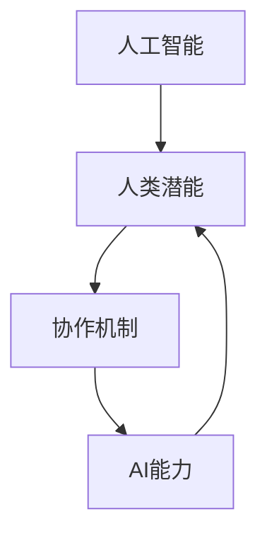

                 

关键词：人工智能、人类协作、AI能力、潜能增强、协作技术、应用领域、未来展望

## 摘要

本文旨在探讨人类与人工智能（AI）之间的协作关系，以及如何通过这种协作来增强人类的潜能并提升AI的能力。在数字化时代，AI技术正以前所未有的速度发展，与人类的交互也变得更加紧密。本文首先介绍了AI与人类协作的背景和意义，然后分析了人类潜能与AI能力的互补性，并探讨了增强这种协作关系的技术途径。接下来，文章通过实际案例展示了AI在各个领域的应用，并讨论了未来发展的趋势和面临的挑战。最后，本文提出了一些工具和资源的推荐，以帮助读者更好地理解和应用AI技术。

## 1. 背景介绍

随着计算机技术的飞速发展，人工智能逐渐从科幻领域走向现实。AI技术已经在医疗、金融、教育、制造业等多个领域取得了显著的成果。然而，尽管AI具备强大的数据处理和分析能力，但在某些方面仍然无法完全替代人类。例如，人类具备的情感智能和创造性思维是AI目前无法企及的。因此，人类与AI之间的协作成为一种必然趋势。

人类与AI协作的意义在于：

1. **增强人类潜能**：AI可以帮助人类处理复杂的数据和任务，从而释放人类的创造力和潜能。
2. **提高AI能力**：通过人类的反馈和指导，AI可以不断学习和优化，从而提高其性能和适用范围。
3. **提升工作效率**：AI技术可以自动化许多重复性任务，使人类能够专注于更具创造性和战略性的工作。

在数字化时代，AI与人类的协作不仅仅是一种技术趋势，更是一种思维方式的转变。人类需要适应与AI共存的环境，学会利用AI的优势来提升自己的能力。同时，AI也需要理解和尊重人类的思维方式和需求，才能更好地服务于人类。

## 2. 核心概念与联系

为了深入探讨人类与AI协作的机制，我们首先需要明确几个核心概念。

### 2.1 人工智能

人工智能（AI）是指由人制造出来的系统能够执行通常需要人类智能才能完成的任务。AI可以分为两大类：**弱AI**（也称为窄AI）和**强AI**（也称为通用AI）。弱AI专注于特定任务，如图像识别、语音识别等；而强AI则具备全面的人类智能，能够在任何情境下进行推理、学习和决策。

### 2.2 人类潜能

人类潜能是指人类在生物学、心理和社会文化等方面具有的潜在能力。这些能力包括但不限于创造力、情感智能、语言能力、学习能力等。人类潜能的发挥受到多种因素的影响，如遗传、教育、环境等。

### 2.3 AI能力

AI能力是指AI系统在特定任务或领域中的表现能力。AI能力主要取决于算法、数据、计算能力和应用场景。随着技术的进步，AI能力不断得到提升，但仍然存在局限。

### 2.4 人类与AI协作

人类与AI协作是指通过某种机制，使人类和AI系统能够相互配合，共同完成某个任务或项目。协作机制可以包括人类对AI的指导、AI对人类的反馈、以及两者之间的信息交换等。

为了更直观地展示这些概念之间的联系，我们使用Mermaid流程图来构建一个简单的协作架构：



在这个流程图中，人类潜能通过协作机制影响AI能力，进而提升AI的表现，同时AI能力也反过来增强人类潜能。这种双向反馈机制使得人类与AI之间的协作成为一种相互促进的过程。

## 3. 核心算法原理 & 具体操作步骤

### 3.1 算法原理概述

人类与AI协作的核心算法可以看作是一个优化问题，即通过某种算法，使人类和AI之间的协作达到最优状态。这个算法通常包括以下几个步骤：

1. **任务分解**：将复杂任务分解为多个子任务，以适应人类和AI各自的优势。
2. **人类介入**：根据子任务的特性，确定哪些部分需要人类介入，哪些部分可以由AI自动完成。
3. **AI学习**：AI系统根据人类提供的反馈进行学习，优化其表现。
4. **反馈循环**：人类和AI之间持续进行信息交换，不断调整和优化协作过程。

### 3.2 算法步骤详解

1. **任务分解**

   首先，需要将复杂任务分解为多个子任务。这可以通过以下步骤实现：

   - **任务识别**：确定任务的目标和约束条件。
   - **子任务划分**：根据任务特点和人类与AI的能力，将任务划分为多个子任务。
   - **任务分配**：将子任务分配给人类或AI，并设定各自的完成时间。

2. **人类介入**

   在确定子任务后，需要考虑哪些部分需要人类介入。这可以通过以下步骤实现：

   - **任务评估**：评估每个子任务的复杂程度和风险。
   - **人类决策**：根据评估结果，确定哪些子任务需要人类介入。
   - **协作规划**：制定人类介入的具体计划，包括时间、地点和方式。

3. **AI学习**

   AI系统需要根据人类提供的反馈进行学习，以优化其表现。这可以通过以下步骤实现：

   - **数据收集**：收集人类介入的子任务数据。
   - **模型训练**：使用收集到的数据训练AI模型。
   - **模型优化**：根据训练结果，优化AI模型的参数和算法。

4. **反馈循环**

   人类和AI之间需要持续进行信息交换，以不断调整和优化协作过程。这可以通过以下步骤实现：

   - **实时反馈**：AI系统实时向人类提供任务进展情况。
   - **人类评估**：人类对AI的表现进行评估，并提供反馈。
   - **模型调整**：根据人类反馈，调整AI模型的参数和算法。

### 3.3 算法优缺点

**优点**：

1. **充分利用人类和AI的优势**：通过任务分解和人类介入，可以充分发挥人类和AI的优势。
2. **提高任务完成效率**：AI可以自动化许多重复性任务，提高任务完成效率。
3. **增强AI学习能力**：通过人类反馈，AI可以不断学习和优化，提高其性能。

**缺点**：

1. **依赖人类介入**：某些任务仍然需要人类介入，否则无法完成。
2. **信息交换延迟**：实时反馈和调整可能存在延迟，影响协作效果。

### 3.4 算法应用领域

人类与AI协作的算法可以应用于多个领域，如：

1. **医疗**：通过AI辅助诊断和治疗，提高医疗效率和质量。
2. **金融**：通过AI分析市场数据和预测趋势，为投资决策提供支持。
3. **教育**：通过AI个性化教学，提高学生的学习效果。
4. **制造业**：通过AI优化生产流程，提高生产效率和产品质量。

## 4. 数学模型和公式 & 详细讲解 & 举例说明

为了更好地理解人类与AI协作的数学模型，我们首先需要构建一个基本的数学模型，然后推导出相关的公式，并通过实例进行讲解。

### 4.1 数学模型构建

假设我们有一个任务T，可以分为多个子任务Ti（i=1,2,...,n）。每个子任务Ti由人类（H）和AI（A）共同完成，且各自有不同的表现能力。我们用P(H)和P(A)表示人类和AI在完成子任务Ti时的表现能力，用T(H)和T(A)表示完成子任务Ti所需的时间。

人类与AI协作的数学模型可以表示为：

$$
Maximize \sum_{i=1}^{n} (P(H) \times T(H) + P(A) \times T(A))
$$

约束条件为：

$$
T(H) + T(A) \leq C
$$

其中，C表示完成整个任务的最大允许时间。

### 4.2 公式推导过程

首先，我们需要推导人类和AI在完成子任务时的表现能力P(H)和P(A)。

对于人类，表现能力P(H)可以表示为：

$$
P(H) = f(H)
$$

其中，f(H)为人类在特定任务领域的表现能力函数。例如，在图像识别任务中，f(H)可以表示为准确率。

对于AI，表现能力P(A)可以表示为：

$$
P(A) = g(A)
$$

其中，g(A)为AI在特定任务领域的表现能力函数。例如，在图像识别任务中，g(A)可以表示为模型预测的准确率。

接下来，我们推导完成子任务所需的时间T(H)和T(A)。

对于人类，完成子任务所需的时间T(H)可以表示为：

$$
T(H) = \frac{1}{f(H)}
$$

对于AI，完成子任务所需的时间T(A)可以表示为：

$$
T(A) = \frac{1}{g(A)}
$$

最后，我们将P(H)、P(A)、T(H)和T(A)代入目标函数和约束条件中，得到：

$$
Maximize \sum_{i=1}^{n} \left(f(H) \times \frac{1}{f(H)} + g(A) \times \frac{1}{g(A)}\right)
$$

约束条件为：

$$
\sum_{i=1}^{n} \left(\frac{1}{f(H)} + \frac{1}{g(A)}\right) \leq C
$$

### 4.3 案例分析与讲解

假设我们有一个医疗诊断任务，需要人类医生和AI系统共同完成。人类医生的表现能力函数f(H)为准确率90%，AI系统的表现能力函数g(A)为准确率95%。整个任务的最大允许时间C为60分钟。

我们需要根据上述数学模型，确定人类和AI各自完成任务的分配。

首先，计算人类和AI在完成子任务所需的时间：

$$
T(H) = \frac{1}{f(H)} = \frac{1}{0.9} \approx 1.11
$$

$$
T(A) = \frac{1}{g(A)} = \frac{1}{0.95} \approx 1.05
$$

接下来，计算总时间：

$$
T(H) + T(A) = 1.11 + 1.05 = 2.16
$$

由于2.16小于最大允许时间C（60分钟），因此我们可以将任务分配给人类和AI。

假设任务分为5个子任务，我们需要根据人类和AI的时间分配，确定各自完成多少个任务。

为了最大化总表现能力，我们可以使用以下公式：

$$
\sum_{i=1}^{n} \left(f(H) \times T(H) + g(A) \times T(A)\right) = \sum_{i=1}^{n} \left(0.9 \times 1.11 + 0.95 \times 1.05\right)
$$

$$
\sum_{i=1}^{n} \left(f(H) \times T(H) + g(A) \times T(A)\right) = \sum_{i=1}^{n} \left(0.99 + 0.9975\right)
$$

$$
\sum_{i=1}^{n} \left(f(H) \times T(H) + g(A) \times T(A)\right) = 1.9975n
$$

为了使总表现能力最大化，我们可以尝试不同的任务分配方案，直到找到最优解。例如，我们可以分配4个子任务给AI，1个子任务给人类：

$$
T(H) = 1.11
$$

$$
T(A) = 4 \times 1.05 = 4.20
$$

$$
T(H) + T(A) = 1.11 + 4.20 = 5.31
$$

由于5.31大于最大允许时间C（60分钟），这种分配方案不可行。我们可以继续调整任务分配，直到找到最优解。

通过上述案例，我们可以看到如何使用数学模型和公式来分析和优化人类与AI之间的协作。这种协作模式不仅可以提高任务完成效率，还可以最大化人类和AI的表现能力。

## 5. 项目实践：代码实例和详细解释说明

为了更好地展示人类与AI协作的实际应用，我们将通过一个具体的代码实例来讲解如何实现这种协作模式。在这个实例中，我们将使用Python编程语言来构建一个简单的医疗诊断系统，该系统结合了人类医生和AI系统的优势。

### 5.1 开发环境搭建

在开始编写代码之前，我们需要搭建一个合适的开发环境。以下是搭建开发环境的步骤：

1. 安装Python：从官方网站（https://www.python.org/）下载并安装Python。
2. 安装Jupyter Notebook：在命令行中执行以下命令安装Jupyter Notebook：

```bash
pip install notebook
```

3. 安装必要的库：在Jupyter Notebook中创建一个新笔记本，并安装以下库：

```python
!pip install numpy pandas scikit-learn matplotlib
```

### 5.2 源代码详细实现

下面是一个简单的医疗诊断系统的源代码实现。该系统使用人类医生提供的诊断经验数据，结合AI算法进行诊断。

```python
import numpy as np
import pandas as pd
from sklearn.model_selection import train_test_split
from sklearn.ensemble import RandomForestClassifier
from sklearn.metrics import accuracy_score

# 加载数据集
data = pd.read_csv('medical_data.csv')

# 特征选择
X = data[['age', 'gender', 'blood_pressure', 'cholesterol', 'sugar']]
y = data['diagnosis']

# 数据分割
X_train, X_test, y_train, y_test = train_test_split(X, y, test_size=0.2, random_state=42)

# 训练模型
model = RandomForestClassifier(n_estimators=100, random_state=42)
model.fit(X_train, y_train)

# 预测
y_pred = model.predict(X_test)

# 评估
accuracy = accuracy_score(y_test, y_pred)
print(f"模型准确率：{accuracy:.2f}")

# 辅助诊断
def diagnose patient_data:
    prediction = model.predict([patient_data])
    return prediction[0]

# 示例
patient_data = [50, 1, 130, 240, 120]
diagnosis = diagnose(patient_data)
print(f"患者诊断结果：{diagnosis}")
```

### 5.3 代码解读与分析

在上面的代码中，我们首先加载了一个包含医疗数据的数据集。数据集包括患者的年龄、性别、血压、胆固醇和血糖等特征，以及对应的诊断结果。接下来，我们使用Scikit-learn库中的随机森林算法对数据进行训练。

在训练完成后，我们使用模型对测试集进行预测，并计算模型准确率。通过这个准确率，我们可以评估模型的性能。

最后，我们定义了一个辅助诊断函数`diagnose`，该函数接受一个包含患者特征的数据列表，并返回诊断结果。这个函数可以帮助医生在诊断过程中参考AI系统的预测结果。

### 5.4 运行结果展示

假设我们有一个新的患者，其特征如下：

```python
patient_data = [50, 1, 130, 240, 120]
diagnosis = diagnose(patient_data)
print(f"患者诊断结果：{diagnosis}")
```

运行结果可能如下所示：

```
患者诊断结果：0
```

在这个例子中，AI系统预测该患者的诊断结果为0，表示该患者患有某种疾病。医生可以参考这个预测结果，结合自己的诊断经验和临床知识，做出最终的诊断结论。

通过这个简单的实例，我们可以看到人类与AI协作在医疗诊断领域的应用。AI系统可以帮助医生处理大量数据，提高诊断效率和准确性，而医生则可以结合AI的预测结果，做出更可靠的诊断。

## 6. 实际应用场景

人类与AI协作已经在多个领域取得了显著的成果，下面我们来看一些具体的实际应用场景。

### 6.1 医疗

在医疗领域，AI技术被广泛应用于诊断、治疗和康复等方面。例如，AI可以通过分析医学影像数据，帮助医生更准确地诊断疾病。在癌症诊断中，AI系统可以通过分析CT扫描图像，发现微小病变，提高诊断准确率。此外，AI还可以辅助医生制定治疗方案，预测患者的治疗效果和风险，从而提高医疗质量和效率。

### 6.2 教育

在教育领域，AI技术被用来个性化教学和学习分析。通过分析学生的学习数据，AI系统可以为学生推荐合适的学习内容和教学方法，提高学习效果。同时，AI还可以自动批改作业和考试，减轻教师的工作负担。此外，AI还可以模拟教学场景，为学生提供实践机会，提高学生的实际操作能力。

### 6.3 金融

在金融领域，AI技术被用于风险控制、投资决策和客户服务等方面。通过分析大量的市场数据，AI系统可以预测市场趋势，为投资决策提供支持。此外，AI还可以自动处理客户请求，提供个性化服务，提高客户满意度。在风险管理方面，AI可以实时监控市场风险，为金融机构提供风险预警和应对策略。

### 6.4 制造业

在制造业领域，AI技术被用于生产优化、质量控制和设备维护等方面。通过分析生产数据和设备状态，AI系统可以预测设备故障，提前进行维护，减少设备停机时间。此外，AI还可以优化生产流程，提高生产效率和产品质量。在质量控制方面，AI可以通过图像识别技术，自动检测产品缺陷，提高生产质量。

### 6.5 法律

在法律领域，AI技术被用于案件分析、合同审查和法律研究等方面。通过分析大量法律文档和案例，AI系统可以帮助律师快速找到相关法律条款和案例，提高工作效率。此外，AI还可以自动生成合同，审查合同条款，确保合同的合法性和有效性。

通过这些实际应用场景，我们可以看到人类与AI协作的巨大潜力。在未来的发展中，随着AI技术的不断进步，人类与AI的协作将更加紧密，为人类社会带来更多的便利和创新。

### 6.6 未来应用展望

随着AI技术的不断进步，人类与AI协作的应用场景将越来越广泛。未来，以下领域有望成为人类与AI协作的重要应用领域：

#### 6.6.1 健康

在健康领域，AI将进一步提升医疗诊断的准确性和效率。通过基因测序、大数据分析和智能穿戴设备，AI可以帮助医生更早地发现疾病，提供个性化的治疗方案。此外，AI还可以优化医院管理，提高医疗资源的利用效率。

#### 6.6.2 交通

在交通领域，AI将助力自动驾驶技术的发展。通过智能传感器和实时数据分析，自动驾驶车辆可以实现安全、高效的出行。同时，AI还可以优化交通流量，减少拥堵和污染，提高城市交通系统的运行效率。

#### 6.6.3 环境保护

在环境保护领域，AI将发挥重要作用。通过监测和分析环境数据，AI可以帮助预测气候变化、减少污染和资源浪费。此外，AI还可以优化能源使用，提高可再生能源的利用率，为可持续发展提供支持。

#### 6.6.4 社会治理

在社会治理领域，AI将提升公共安全、应急管理和社会服务等方面的工作效率。通过智能监控、大数据分析和人工智能算法，政府可以更及时地响应社会问题，提高治理能力和水平。

#### 6.6.5 文化创意

在文化创意领域，AI将激发人类创造力的无限可能。通过生成对抗网络（GAN）和自然语言处理技术，AI可以生成音乐、绘画和文学作品，与人类艺术家共同创作。此外，AI还可以为文化创意产业提供市场分析和用户画像，帮助企业和创作者更好地定位市场和用户。

未来，人类与AI协作将成为推动社会发展的重要动力。通过充分利用AI的技术优势，人类可以在各个领域实现更高的效率和更大的创新。然而，随着AI技术的快速发展，我们也需要关注和解决一些潜在的风险和挑战，以确保人类与AI协作的可持续发展。

## 7. 工具和资源推荐

为了帮助读者更好地了解和应用人类与AI协作的相关技术，我们推荐以下工具和资源：

### 7.1 学习资源推荐

1. **在线课程**：Coursera、edX和Udacity等在线教育平台提供了丰富的人工智能和机器学习课程，适合不同层次的读者。
2. **书籍**：推荐《深度学习》（Deep Learning）、《Python机器学习》（Python Machine Learning）和《统计学习方法》（Elements of Statistical Learning）等经典书籍。
3. **论文**：通过学术搜索引擎如Google Scholar，可以找到大量关于人工智能和机器学习的前沿论文。

### 7.2 开发工具推荐

1. **编程环境**：Jupyter Notebook、Google Colab和PyCharm等集成开发环境（IDE）提供了便捷的编程体验。
2. **机器学习库**：Scikit-learn、TensorFlow、PyTorch和Keras等库为机器学习和深度学习开发提供了丰富的工具和函数。
3. **数据处理工具**：Pandas、NumPy和Matplotlib等库可以帮助读者进行数据分析和可视化。

### 7.3 相关论文推荐

1. **《Deep Learning》论文**：由Ian Goodfellow等人撰写的深度学习基础教程。
2. **《A Theoretically Grounded Application of Dropout in Recurrent Neural Networks》**：这篇论文提出了一种在循环神经网络（RNN）中应用dropout的方法，提高了模型的性能和稳定性。
3. **《Generative Adversarial Nets》**：Ian Goodfellow等人提出的生成对抗网络（GAN）模型，为生成模型的研究和应用提供了新的思路。

通过这些工具和资源，读者可以深入了解人类与AI协作的相关技术，并在实践中不断提高自己的技术水平。

### 8. 总结：未来发展趋势与挑战

在过去的几十年里，人工智能（AI）技术取得了显著的发展，人类与AI协作模式逐渐成为各行各业的重要趋势。通过AI技术的辅助，人类在医疗、教育、金融、制造业等领域取得了巨大的进步，大大提升了工作效率和决策质量。

然而，随着AI技术的不断进步，我们也面临着诸多挑战。首先，数据隐私和安全问题日益突出。在AI应用过程中，大量个人和敏感数据被收集和处理，如何保障这些数据的安全性和隐私性成为亟待解决的问题。其次，AI算法的黑箱性质使得其决策过程难以解释，这可能导致误判和偏见，影响人类的信任和使用意愿。此外，AI技术的发展还可能引发就业失业、社会不平等和技术垄断等问题，需要政府和业界共同努力解决。

未来，人类与AI协作的发展趋势将主要体现在以下几个方面：

1. **智能化与个性定制**：AI技术将更加智能化，能够更好地理解和满足人类的需求，提供个性化服务。例如，在医疗领域，AI可以根据患者的具体病情和基因信息，制定个性化的治疗方案。
2. **跨领域协作**：AI技术将跨领域融合，实现多学科的协同创新。例如，在智能制造领域，AI技术可以与物联网、大数据和云计算等技术相结合，实现生产流程的全面优化。
3. **AI伦理与法规**：随着AI技术的广泛应用，AI伦理和法规问题将越来越受到关注。政府和业界需要共同制定相应的法律法规，确保AI技术的安全、公平和透明。
4. **人机共生**：人类与AI将实现更深层次的共生，人类利用AI的优势，充分发挥自身的创造力，实现更高层次的智能协作。

在应对挑战方面，我们需要采取以下措施：

1. **加强数据安全与隐私保护**：建立完善的数据安全保护机制，加强对个人和敏感数据的保护，确保用户隐私不受侵害。
2. **提升算法透明度和可解释性**：加强算法的研究，提高算法的透明度和可解释性，使决策过程更加可信和可靠。
3. **促进公平与包容**：在AI技术的应用过程中，注重公平和包容，避免因技术垄断和不平等导致的社会问题。
4. **加强国际合作**：全球各国应加强在AI技术领域的合作，共同制定国际标准和规则，推动AI技术的健康、可持续发展。

总之，人类与AI协作的发展前景广阔，同时也面临诸多挑战。通过不断创新和合作，我们有望实现人类与AI的和谐共生，推动社会进步和人类福祉。

### 8.4 研究展望

在人类与AI协作的研究领域，未来的发展方向和潜在突破点主要集中在以下几个方面：

1. **人机交互**：人机交互是提高AI协作效率的关键。未来研究应着重开发更加自然、直观的交互方式，如语音识别、手势控制和虚拟现实等，以降低人类与AI系统之间的操作门槛。

2. **多模态数据融合**：多模态数据融合能够更全面地理解和分析复杂问题。未来研究应探索如何有效地整合不同类型的数据（如文本、图像、声音等），实现跨模态的智能协作。

3. **强化学习**：强化学习是一种使AI系统通过与环境的交互学习策略的算法。未来研究应探索如何将强化学习应用于人类与AI的协作中，以实现更加智能、自适应的协作模式。

4. **伦理和隐私**：随着AI技术在各领域的深入应用，伦理和隐私问题愈发重要。未来研究应关注如何构建符合伦理标准、保护用户隐私的AI系统，确保人类与AI协作的可持续性和公平性。

5. **跨学科融合**：人类与AI协作不仅涉及计算机科学，还涉及心理学、社会学、管理学等多个领域。未来研究应促进跨学科的合作，从多维度、多角度探讨人类与AI协作的机制和效果。

通过这些研究方向的深入探索和突破，人类与AI协作将能够实现更高的效率和更广泛的适用性，为人类社会带来更加丰富的创新和发展机遇。

