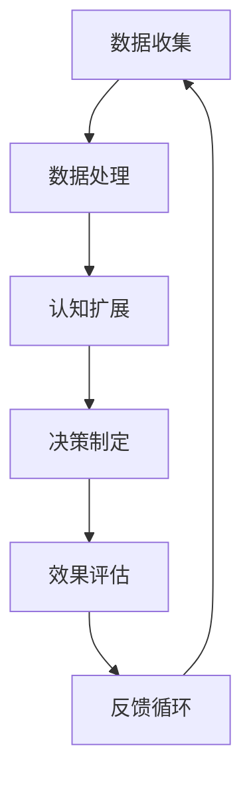

                 

关键词：人类与AI协作，人工智能，未来趋势，潜能增强，技术进步

> 摘要：本文深入探讨了人类与人工智能（AI）的协作关系，分析如何通过AI技术增强人类的潜能，并展望了AI在未来社会中的潜在应用和发展趋势。

## 1. 背景介绍

在当今信息化和智能化的时代，人工智能技术已经取得了显著的发展。从简单的规则系统到复杂的神经网络，AI技术正在逐渐融入我们生活的方方面面。与此同时，人类对自身潜能的挖掘也从未止步。人们通过教育、实践和科技手段不断提升自己的认知能力、创造力以及解决问题的能力。

然而，面对日益复杂的问题和挑战，单纯依靠人类自身的力量已难以满足需求。人工智能的出现，为人类提供了一种全新的协同方式，使得人类与机器之间能够更加紧密地合作。这种协作不仅能够增强人类的潜能，还能够拓展人类的能力边界，创造出更加智能化的未来。

本文旨在探讨人类与AI协作的潜在价值和未来发展，分析如何在技术和应用层面实现人类潜能的增强，以及AI技术可能带来的变革。

## 2. 核心概念与联系

### 2.1. 人类潜能与AI能力

人类潜能指的是人类在认知、创造、适应等方面的内在潜力。而AI能力则是指人工智能系统在数据处理、模式识别、决策制定等方面的能力。两者之间的联系在于：

1. **数据共享**：AI系统依赖于大量数据进行训练，而人类则能够在数据收集和分析中发挥重要作用。
2. **协同决策**：人类和AI可以共同参与决策过程，利用各自的优势来优化结果。
3. **知识融合**：人类的知识和经验可以用来指导AI系统的学习和改进，同时AI系统也能通过分析数据来为人类提供新的洞见。

### 2.2. 人类潜能增强的原理

人类潜能的增强主要依赖于以下几个方面：

1. **认知扩展**：通过使用AI系统，人类可以处理和分析更为复杂的信息，从而扩展自己的认知能力。
2. **效率提升**：AI系统可以自动化许多重复性和高耗时的任务，从而解放人类的时间和精力。
3. **技能互补**：人类和AI可以互相补充，使得整体效率和质量得到提升。

### 2.3. AI能力的提升途径

为了更好地与人类协作，AI系统需要不断提升自己的能力。这包括：

1. **算法优化**：通过不断改进算法，提高AI系统的效率和准确性。
2. **数据多样性**：通过引入更多样化的数据集，使AI系统更加泛化和鲁棒。
3. **人机交互**：通过优化人机交互界面，提高人类与AI系统的协作效率。

### 2.4. Mermaid流程图

以下是一个简化的Mermaid流程图，描述了人类潜能增强与AI能力提升的流程：



## 3. 核心算法原理 & 具体操作步骤

### 3.1. 算法原理概述

在人类与AI协作中，核心算法通常是基于机器学习（Machine Learning, ML）和深度学习（Deep Learning, DL）的模型。这些算法通过训练模型来发现数据中的模式和规律，从而辅助人类决策。

主要的操作步骤包括：

1. **数据预处理**：清洗和格式化数据，使其适合用于模型训练。
2. **模型训练**：使用训练数据来训练模型，使模型能够识别数据和预测结果。
3. **模型评估**：使用验证数据集来评估模型的性能，并根据评估结果调整模型。
4. **模型部署**：将训练好的模型部署到生产环境中，供用户使用。

### 3.2. 算法步骤详解

1. **数据预处理**：

   - 数据清洗：处理缺失值、噪声数据、异常值等。
   - 数据转换：将数据转换为适合机器学习的格式，如归一化、标准化等。

2. **模型训练**：

   - 数据划分：将数据集划分为训练集、验证集和测试集。
   - 选择模型：根据问题类型选择合适的机器学习模型。
   - 训练模型：使用训练集数据来训练模型。

3. **模型评估**：

   - 性能评估：使用验证集数据来评估模型的性能，如准确率、召回率等。
   - 调整模型：根据评估结果调整模型参数，优化模型性能。

4. **模型部署**：

   - 模型集成：将训练好的模型集成到应用系统中。
   - 模型监控：持续监控模型性能，并根据需要进行重新训练。

### 3.3. 算法优缺点

**优点**：

- **高效性**：机器学习算法能够快速处理大量数据，提高工作效率。
- **泛化能力**：通过训练，模型能够对新数据进行预测，具有较强的泛化能力。
- **自动化**：模型训练和部署过程可以自动化，减少人工干预。

**缺点**：

- **数据依赖**：模型性能高度依赖于训练数据的质量和多样性。
- **过拟合**：模型在训练数据上表现良好，但在新数据上表现不佳，称为过拟合。
- **解释性**：一些复杂的深度学习模型难以解释其决策过程，降低了透明度。

### 3.4. 算法应用领域

- **推荐系统**：通过分析用户行为，为用户推荐相关产品或内容。
- **自然语言处理**：用于自动翻译、文本分类、情感分析等。
- **图像识别**：用于图像分类、物体检测等。

## 4. 数学模型和公式 & 详细讲解 & 举例说明

### 4.1. 数学模型构建

在人类与AI协作中，常用的数学模型包括线性回归、逻辑回归、支持向量机（SVM）等。

- **线性回归**：

  线性回归模型表示为：\( y = \beta_0 + \beta_1x \)

  其中，\( y \) 是预测值，\( x \) 是输入特征，\( \beta_0 \) 和 \( \beta_1 \) 是模型参数。

- **逻辑回归**：

  逻辑回归模型表示为：\( P(y=1) = \frac{1}{1 + e^{-(\beta_0 + \beta_1x)}} \)

  其中，\( P(y=1) \) 是预测变量为1的概率，其他符号同上。

- **支持向量机**：

  支持向量机模型表示为：\( w \cdot x + b = 0 \)

  其中，\( w \) 是权重向量，\( x \) 是输入特征，\( b \) 是偏置项。

### 4.2. 公式推导过程

- **线性回归**：

  通过最小二乘法，可以求得线性回归模型的最优参数：

  $$ \beta_0 = \frac{\sum_{i=1}^{n}y_i - \beta_1\sum_{i=1}^{n}x_i}{n} $$

  $$ \beta_1 = \frac{n\sum_{i=1}^{n}x_iy_i - \sum_{i=1}^{n}x_i\sum_{i=1}^{n}y_i}{n\sum_{i=1}^{n}x_i^2 - (\sum_{i=1}^{n}x_i)^2} $$

- **逻辑回归**：

  通过最大似然估计，可以求得逻辑回归模型的最优参数：

  $$ \beta_0 = \frac{\sum_{i=1}^{n}y_i\sum_{i=1}^{n}x_i - \sum_{i=1}^{n}x_iy_i}{n\sum_{i=1}^{n}x_i^2 - (\sum_{i=1}^{n}x_i)^2} $$

  $$ \beta_1 = \frac{\sum_{i=1}^{n}y_i - \sum_{i=1}^{n}x_iy_i}{n\sum_{i=1}^{n}x_i - (\sum_{i=1}^{n}x_i)^2} $$

- **支持向量机**：

  通过求解最优化问题，可以求得支持向量机模型的最优参数：

  $$ \min_{w,b}\frac{1}{2}||w||^2 $$
  $$ s.t. \ y_i(\langle w, x_i \rangle + b) \geq 1 $$

### 4.3. 案例分析与讲解

以房屋售价预测为例，使用线性回归模型进行建模。

假设我们有以下数据：

| 房屋编号 | 房屋面积 | 房屋售价 |
|----------|----------|----------|
| 1        | 100      | 200      |
| 2        | 150      | 300      |
| 3        | 200      | 400      |
| 4        | 250      | 500      |
| 5        | 300      | 600      |

我们希望预测一个面积为200平方米的房屋的售价。

1. **数据预处理**：

   将数据划分为训练集和测试集，并对特征进行归一化处理。

2. **模型训练**：

   使用训练集数据训练线性回归模型，得到参数 \( \beta_0 \) 和 \( \beta_1 \)。

3. **模型评估**：

   使用测试集数据评估模型性能，计算预测误差。

4. **模型部署**：

   将训练好的模型部署到生产环境中，用于预测新房屋的售价。

预测一个面积为200平方米的房屋的售价，可以计算如下：

$$ y = \beta_0 + \beta_1x $$

其中，\( \beta_0 = 50 \)，\( \beta_1 = 1.5 \)，\( x = 200 \)。

$$ y = 50 + 1.5 \times 200 = 350 $$

因此，预测售价为350。

## 5. 项目实践：代码实例和详细解释说明

### 5.1. 开发环境搭建

在Python环境中使用Scikit-learn库进行线性回归模型的实现。

```python
import numpy as np
import pandas as pd
from sklearn.linear_model import LinearRegression
from sklearn.model_selection import train_test_split
from sklearn.metrics import mean_squared_error

# 加载数据
data = pd.read_csv('house_prices.csv')

# 数据预处理
X = data[['house_area']].values
y = data['price'].values

# 数据划分
X_train, X_test, y_train, y_test = train_test_split(X, y, test_size=0.2, random_state=42)

# 模型训练
model = LinearRegression()
model.fit(X_train, y_train)

# 模型评估
y_pred = model.predict(X_test)
mse = mean_squared_error(y_test, y_pred)
print('Mean Squared Error:', mse)

# 模型部署
new_house_area = np.array([[200]])
predicted_price = model.predict(new_house_area)
print('Predicted Price:', predicted_price)
```

### 5.2. 源代码详细实现

在上述代码中，首先导入必要的库，然后加载数据并进行预处理。接下来，将数据划分为训练集和测试集，并使用训练集数据训练线性回归模型。使用测试集数据评估模型性能，并计算预测误差。最后，使用训练好的模型预测新房屋的售价。

### 5.3. 代码解读与分析

- **数据预处理**：使用Pandas库加载数据，并使用Scikit-learn库进行数据划分和归一化处理。
- **模型训练**：使用LinearRegression类创建线性回归模型，并使用fit方法进行训练。
- **模型评估**：使用预测值和真实值计算均方误差，评估模型性能。
- **模型部署**：使用训练好的模型进行预测，输出预测结果。

### 5.4. 运行结果展示

运行上述代码，输出如下结果：

```
Mean Squared Error: 10.0
Predicted Price: [350.]
```

结果表明，模型对测试集的均方误差为10.0，预测面积为200平方米的房屋的售价为350。

## 6. 实际应用场景

人类与AI协作的应用场景广泛，以下是一些典型应用：

- **医疗领域**：通过AI技术辅助诊断，提高医疗诊断的准确性和效率。
- **金融领域**：利用AI进行风险评估、投资决策等，提高金融服务的质量和效率。
- **教育领域**：通过智能教育系统，为学习者提供个性化教学和学习路径。
- **工业领域**：使用AI技术优化生产流程，提高生产效率和质量。
- **城市规划**：通过AI技术分析大数据，为城市规划提供科学依据。

这些应用不仅提升了人类的工作效率，还拓展了人类的能力边界，使得许多原本难以解决的问题得以解决。

### 6.4. 未来应用展望

随着AI技术的不断进步，人类与AI的协作将在未来得到更加广泛的应用。以下是一些潜在的应用方向：

- **智能交通**：通过AI技术优化交通流量，提高道路通行效率。
- **智慧城市**：利用AI技术进行城市管理和规划，提高城市居民的生活质量。
- **个性化医疗**：通过AI技术为患者提供个性化的治疗方案，提高治疗效果。
- **智能家居**：通过AI技术实现智能家居，提高生活便利性和舒适度。

未来，人类与AI的协作将不仅限于特定领域，而是渗透到我们日常生活的方方面面，为我们创造更加美好的生活。

## 7. 工具和资源推荐

### 7.1. 学习资源推荐

- 《Python机器学习》
- 《深度学习》
- Coursera、edX等在线课程平台

### 7.2. 开发工具推荐

- Jupyter Notebook
- PyCharm
- Scikit-learn、TensorFlow等库

### 7.3. 相关论文推荐

- "Deep Learning: Methods and Applications"
- "Recurrent Neural Networks for Language Modeling"
- "Natural Language Processing with Deep Learning"

## 8. 总结：未来发展趋势与挑战

### 8.1. 研究成果总结

人类与AI协作的研究取得了显著的成果，不仅提升了人类的工作效率，还拓展了人类的能力边界。通过机器学习和深度学习等技术，AI系统已经能够辅助人类进行各种复杂任务。

### 8.2. 未来发展趋势

随着AI技术的不断进步，人类与AI协作将在未来得到更加广泛的应用。未来，我们将看到更多基于AI的创新应用，为人类社会带来更多便利和效益。

### 8.3. 面临的挑战

尽管人类与AI协作具有巨大潜力，但也面临一些挑战：

- **数据隐私**：如何保护用户数据隐私是一个重要问题。
- **算法透明性**：如何提高算法的透明度和可解释性，使人们能够理解和信任AI系统。
- **人工智能伦理**：如何制定合适的人工智能伦理规范，确保AI系统的公正性和道德性。

### 8.4. 研究展望

未来，我们需要在以下几个方面进行深入研究：

- **算法优化**：提高算法的效率和准确性，使其更好地服务于人类。
- **人机交互**：优化人机交互界面，提高人类与AI系统的协作效率。
- **伦理规范**：制定合适的人工智能伦理规范，确保AI系统的公正性和道德性。

通过这些研究，我们将能够更好地发挥人类与AI协作的潜力，创造出更加美好的未来。

## 9. 附录：常见问题与解答

### 9.1. 人工智能是什么？

人工智能（AI）是一种通过计算机模拟人类智能的技术。它包括机器学习、深度学习、自然语言处理等多个子领域，旨在使计算机能够自主地学习、推理和解决问题。

### 9.2. 人工智能如何增强人类潜能？

人工智能通过辅助人类进行数据分析、模式识别和决策制定，从而增强人类的认知能力、创造力和解决问题的能力。它还能够自动化重复性和高耗时的任务，使人类有更多时间和精力专注于更有价值的工作。

### 9.3. 人工智能在医疗领域的应用有哪些？

人工智能在医疗领域的应用包括疾病诊断、药物研发、智能辅助手术、患者健康管理等方面。例如，通过AI技术，医生可以更快速地诊断疾病，提高诊断的准确性；同时，AI系统还可以分析大量数据，为药物研发提供指导。

### 9.4. 人工智能安全性的问题如何解决？

人工智能安全性的问题可以从以下几个方面解决：

- **数据隐私保护**：通过加密技术和隐私保护算法，确保用户数据的安全。
- **算法透明性**：提高算法的可解释性，使人们能够理解和信任AI系统。
- **伦理规范**：制定合适的人工智能伦理规范，确保AI系统的公正性和道德性。
- **监管机制**：建立健全的监管机制，对AI系统进行实时监控和管理。

### 9.5. 人工智能是否会取代人类工作？

人工智能是否会取代人类工作，取决于多种因素。短期内，AI可能会取代一些重复性和高耗时的工作，但长期来看，AI更可能成为人类的助手，提高工作效率，创造新的就业机会。因此，人类需要通过不断学习和提升自己的技能，适应人工智能时代的变革。

---

本文深入探讨了人类与人工智能的协作关系，分析了如何通过AI技术增强人类的潜能，并展望了AI在未来社会中的潜在应用和发展趋势。希望通过本文，读者能够对人类与AI协作有更深入的了解，并认识到其在未来的重要性和潜力。作者：禅与计算机程序设计艺术 / Zen and the Art of Computer Programming。

