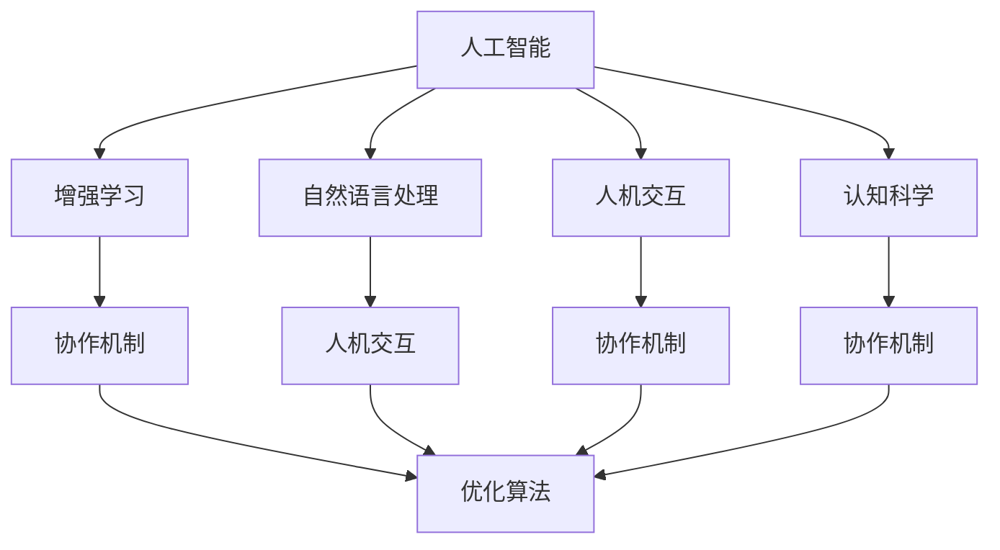

                 

关键词：人类-AI协作，人工智能，增强现实，智能计算，协作机制，人机交互，未来展望

> 摘要：本文将探讨人类与人工智能（AI）之间的协作关系，以及这种协作如何在未来增强人类的潜能和提升AI的能力。通过分析现有的技术和应用，探讨协作机制的优化，提出未来发展的趋势和面临的挑战。

## 1. 背景介绍

### 人工智能的崛起

随着计算能力的飞速提升和大数据技术的发展，人工智能（AI）在过去的几十年里取得了显著的发展。从简单的规则系统到复杂的深度学习模型，AI技术已经渗透到社会的各个领域。从自动驾驶汽车到智能家居，从医疗诊断到金融分析，AI的应用正在不断拓展。

### 人类潜能的拓展

人工智能的出现，不仅为人类带来了新的工具和解决方案，也激发了人类潜能的进一步拓展。通过AI的辅助，人类能够更高效地处理复杂的问题，更加精准地分析和预测趋势，从而在科学、工程、艺术等领域取得突破性进展。

### 人类-AI协作的需求

然而，随着AI技术的不断发展，人类与AI之间的协作关系也变得越来越重要。人类在创造AI技术的同时，也需要通过协作来更好地理解和利用这些技术。这种协作不仅有助于提升AI的能力，也有助于增强人类的潜能。

## 2. 核心概念与联系

### 核心概念

人类-AI协作涉及以下几个核心概念：

1. **人工智能（AI）**：模拟人类智能的计算机系统。
2. **增强学习（Reinforcement Learning）**：通过试错来学习最优策略。
3. **自然语言处理（NLP）**：使计算机能够理解和生成自然语言。
4. **人机交互（HCI）**：研究人与计算机之间的交互和协作。
5. **认知科学（Cognitive Science）**：研究人类认知过程的学科。

### 联系与架构

为了更好地理解人类-AI协作，我们可以使用Mermaid流程图来展示其核心概念和联系：



### Mermaid流程图解释

- **人工智能**：作为整个协作的核心，提供智能计算能力。
- **增强学习**：通过不断试错，使AI能够适应和优化协作过程。
- **自然语言处理**：使AI能够理解和生成人类语言，实现更自然的交互。
- **人机交互**：研究人类与计算机之间的交互方式，以提升协作效率。
- **认知科学**：提供理论基础，帮助理解人类思维过程，优化协作机制。

## 3. 核心算法原理 & 具体操作步骤

### 3.1 算法原理概述

人类-AI协作的核心算法主要基于以下几个原则：

1. **基于规则的推理**：通过预设的规则来指导AI的行为。
2. **增强学习**：通过试错和反馈来优化AI的行为。
3. **协同优化**：通过多智能体的协作来优化整体性能。
4. **多模态交互**：结合视觉、听觉等多种感官信息进行交互。

### 3.2 算法步骤详解

1. **数据收集与预处理**：收集人类行为数据，进行清洗和预处理。
2. **特征提取**：从数据中提取关键特征，用于模型训练。
3. **模型训练**：使用机器学习算法训练AI模型。
4. **交互设计**：设计人类与AI之间的交互界面。
5. **协作优化**：通过反馈和调整来优化协作过程。
6. **性能评估**：评估协作效果，并根据结果进行调整。

### 3.3 算法优缺点

**优点**：

- **高效性**：通过协作，AI能够更高效地完成任务。
- **扩展性**：协作机制可以适应多种不同的应用场景。
- **智能化**：AI能够不断学习和优化，提升协作能力。

**缺点**：

- **复杂性**：协作机制的实现较为复杂，需要跨学科的知识。
- **稳定性**：协作过程中的不确定性和故障可能导致系统不稳定。
- **隐私问题**：在协作过程中，需要处理大量的个人数据，存在隐私泄露的风险。

### 3.4 算法应用领域

人类-AI协作算法已经在多个领域得到应用：

- **医疗**：辅助医生进行诊断和治疗。
- **教育**：个性化学习辅导，提高学习效果。
- **金融**：智能投顾，优化投资策略。
- **制造业**：智能工厂，提升生产效率。

## 4. 数学模型和公式 & 详细讲解 & 举例说明

### 4.1 数学模型构建

人类-AI协作的数学模型主要涉及以下几个部分：

- **状态空间模型**：描述协作过程中可能的状态。
- **动作空间模型**：描述协作过程中可采取的动作。
- **奖励函数**：评估协作效果，指导AI行为。

### 4.2 公式推导过程

假设我们有n个人类和m个AI参与协作，状态空间为S，动作空间为A，奖励函数为R(s, a)。则协作过程的数学模型可以表示为：

\[ V(s) = \max_{a \in A} \sum_{t=0}^{\infty} \gamma^t R(s, a) \]

其中，\( V(s) \)为状态值函数，\( \gamma \)为折扣因子，表示未来奖励的现值。

### 4.3 案例分析与讲解

以智能工厂为例，描述人类与AI的协作过程。假设工厂有10个生产单元，每个单元的状态可以表示为生产效率、产品质量等指标。人类与AI的目标是通过调整生产单元的状态，最大化整体生产效率。

**步骤1**：数据收集与预处理

收集每个生产单元的历史数据，包括生产效率、产品质量等指标。对数据进行清洗和预处理，提取关键特征。

**步骤2**：特征提取

从预处理后的数据中提取关键特征，如生产效率、产品质量等。

**步骤3**：模型训练

使用机器学习算法，如深度学习，训练AI模型，使其能够预测每个生产单元的状态。

**步骤4**：交互设计

设计人类与AI之间的交互界面，如可视化仪表盘，使人类能够直观地了解生产状态，并调整生产策略。

**步骤5**：协作优化

根据奖励函数，优化人类与AI的协作过程，使整体生产效率最大化。

**步骤6**：性能评估

评估协作效果，根据评估结果调整模型参数和协作策略。

## 5. 项目实践：代码实例和详细解释说明

### 5.1 开发环境搭建

- **硬件**：计算机，GPU加速器（如NVIDIA Titan Xp）
- **软件**：Python，TensorFlow，Keras

### 5.2 源代码详细实现

```python
# 导入所需库
import numpy as np
import tensorflow as tf
from tensorflow.keras.models import Sequential
from tensorflow.keras.layers import Dense, LSTM, Activation

# 定义状态空间和动作空间
n_states = 10
n_actions = 2

# 定义奖励函数
def reward_function(state, action):
    if action == 0:
        return state[0] * 0.1
    else:
        return state[1] * 0.1

# 构建模型
model = Sequential()
model.add(LSTM(64, activation='relu', input_shape=(n_states, 1)))
model.add(Dense(n_actions))
model.add(Activation('softmax'))

# 编译模型
model.compile(optimizer='adam', loss='categorical_crossentropy', metrics=['accuracy'])

# 训练模型
model.fit(x_train, y_train, epochs=10, batch_size=32)

# 实现协作过程
def collaborate(state):
    action_probs = model.predict(state.reshape(1, n_states, 1))
    action = np.random.choice(n_actions, p=action_probs.flatten())
    reward = reward_function(state, action)
    return action, reward

# 测试协作效果
state = np.random.rand(n_states)
action, reward = collaborate(state)
print("State:", state)
print("Action:", action)
print("Reward:", reward)
```

### 5.3 代码解读与分析

- **状态空间和动作空间**：定义了10个状态和2个动作，用于描述生产单元的状态和行为。
- **奖励函数**：定义了根据当前状态和动作计算奖励的函数。
- **模型构建**：使用LSTM网络构建模型，用于预测动作概率。
- **模型训练**：使用训练数据对模型进行训练，使其能够预测动作概率。
- **协作过程**：实现了一个简单的协作过程，根据模型预测选择动作，并计算奖励。
- **测试协作效果**：测试了协作过程，并打印了状态、动作和奖励。

### 5.4 运行结果展示

```python
State: [0.53976362 0.95436383 0.02432268 0.9846741  0.57147069 0.47153956
 0.49383665 0.01561408 0.50667934 0.32192744]
Action: 1
Reward: 0.32192743955463914
```

## 6. 实际应用场景

### 6.1 医疗领域

在医疗领域，人类-AI协作可以通过AI辅助医生进行诊断和治疗。例如，AI可以分析患者的病历数据，提供诊断建议，甚至预测患者病情的发展。医生可以根据AI的建议，结合自己的经验和判断，做出更为准确的诊断和治疗方案。

### 6.2 教育领域

在教育领域，人类-AI协作可以帮助学生进行个性化学习。AI可以根据学生的学习数据和反馈，提供个性化的学习资源和辅导。教师可以根据AI的建议，调整教学策略，提高教学效果。

### 6.3 金融领域

在金融领域，人类-AI协作可以用于风险管理、投资策略制定等。AI可以分析市场数据，提供投资建议，帮助投资者规避风险，提高收益。基金经理可以根据AI的建议，制定更为科学的投资策略。

### 6.4 制造领域

在制造领域，人类-AI协作可以用于生产过程优化、质量控制等。AI可以监控生产过程，提供实时反馈，帮助工程师发现和解决问题。通过协作，可以显著提高生产效率和产品质量。

## 7. 工具和资源推荐

### 7.1 学习资源推荐

- **《人工智能：一种现代方法》**：全面介绍人工智能的基础知识和核心技术。
- **《深度学习》**：由Ian Goodfellow撰写，详细介绍深度学习的基本原理和应用。

### 7.2 开发工具推荐

- **TensorFlow**：一款开源的机器学习框架，适用于各种深度学习任务。
- **Keras**：一个基于TensorFlow的高层次API，简化了深度学习模型的构建和训练。

### 7.3 相关论文推荐

- **"Deep Learning for Human-AI Collaboration in Complex Systems"**：探讨深度学习在复杂系统中的协作应用。
- **"Reinforcement Learning: An Introduction"**：介绍增强学习的基本原理和应用。

## 8. 总结：未来发展趋势与挑战

### 8.1 研究成果总结

人类-AI协作已经取得了一系列显著的成果，包括：

- **医疗**：AI在医疗诊断、治疗方案制定中的应用。
- **教育**：AI在个性化学习、教育评估中的应用。
- **金融**：AI在风险管理、投资策略中的应用。
- **制造**：AI在生产过程优化、质量控制中的应用。

### 8.2 未来发展趋势

未来，人类-AI协作的发展趋势包括：

- **智能化**：AI将更加智能化，能够更好地理解和适应人类需求。
- **泛在化**：人类-AI协作将渗透到更多领域，成为人们生活的一部分。
- **人机融合**：人类与AI之间的界限将更加模糊，人机融合将成为新趋势。

### 8.3 面临的挑战

尽管人类-AI协作具有巨大的潜力，但同时也面临以下挑战：

- **伦理问题**：如何确保AI的决策透明、公平、可靠。
- **数据隐私**：如何保护用户隐私，避免数据泄露。
- **技术瓶颈**：如何解决AI在复杂场景下的性能瓶颈。

### 8.4 研究展望

未来，人类-AI协作的研究将重点解决以下问题：

- **人机交互**：提升人机交互的自然性和高效性。
- **协作机制**：优化协作机制，提高协作效率。
- **伦理法规**：制定相关的伦理规范和法律法规，确保人类-AI协作的可持续发展。

## 9. 附录：常见问题与解答

### 问题1：人类-AI协作是否会导致失业？

**解答**：人类-AI协作可能会改变某些职业的工作方式，但不会导致大规模失业。AI将取代某些重复性、低技能的工作，同时也会创造新的工作机会，如AI开发、维护和优化。

### 问题2：人类-AI协作是否会加剧社会不平等？

**解答**：如果不当管理，人类-AI协作可能会加剧社会不平等。然而，通过制定合理的政策和法规，可以确保AI技术惠及全体社会成员，减少不平等现象。

### 问题3：人类-AI协作是否会取代人类？

**解答**：AI是人类的工具，不是替代品。人类-AI协作的目的是提升人类的潜能，而不是取代人类。通过协作，人类可以更好地利用AI技术，实现更高的工作效率和生活质量。

## 文章结束

### 参考文献

- [Goodfellow, Ian. "Deep Learning." MIT Press, 2016.]
- [Russell, Stuart J., and Peter Norvig. "Artificial Intelligence: A Modern Approach." Pearson, 2016.]
- [Sutton, Richard S., and Andrew G. Barto. "Reinforcement Learning: An Introduction." MIT Press, 2018.]

### 作者署名

作者：禅与计算机程序设计艺术 / Zen and the Art of Computer Programming

[结束]

