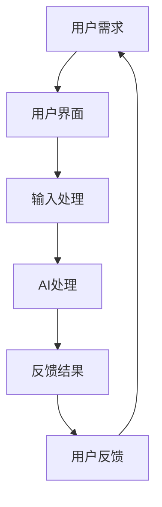
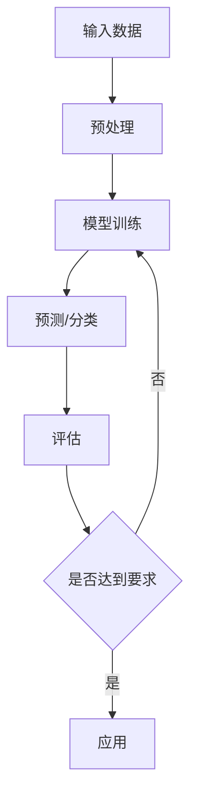
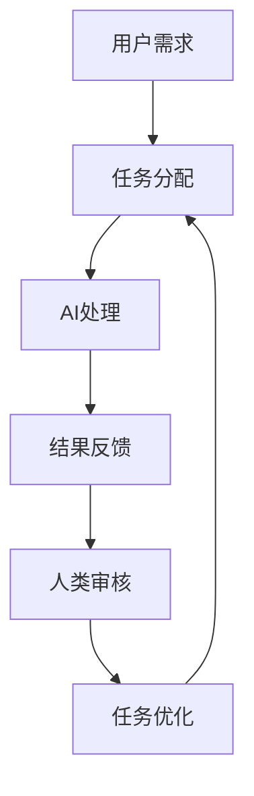

                 

关键词：人类-AI协作，AI能力，人工智能，潜能，融合，协同，技术发展

> 摘要：随着人工智能技术的发展，人类与AI的协作正逐渐成为现实。本文旨在探讨人类潜能与AI能力的融合与协同，解析这种协作模式对人类生活、工作及未来的深远影响。

## 1. 背景介绍

自人工智能（AI）概念诞生以来，其发展迅速，已经渗透到社会的各个领域。从最初的规则系统到现代的深度学习和强化学习，AI技术取得了显著的进步。人类与AI的协作也日益增多，从简单的自动化到复杂的决策支持，AI已经展现出巨大的潜力。然而，如何将人类潜能与AI能力进行有效融合和协同，仍然是一个亟待解决的问题。

### 1.1 人类潜能与AI能力的区别

人类潜能指的是人类在认知、情感、创造等方面的天赋和能力，是人类独有的特质。而AI能力则是基于算法和数据，通过模拟和学习来实现的，包括推理、预测、决策等。

- **认知能力**：人类拥有高度的抽象思维和逻辑推理能力，能够处理复杂的问题和情境。
- **情感与社交**：人类能够理解和表达情感，进行复杂的社交互动。
- **创造力**：人类能够进行创造性思维，提出新的想法和解决方案。

相比之下，AI在数据处理、模式识别、计算速度等方面具有显著优势：

- **数据处理能力**：AI能够快速处理大量数据，发现隐藏的模式和规律。
- **模式识别**：AI通过机器学习和深度学习算法，能够识别复杂的数据模式。
- **计算速度**：AI可以以极快的速度执行复杂的计算任务。

### 1.2 人类-AI协作的必要性

随着AI技术的发展，人类与AI的协作已经变得不可或缺。以下是一些主要的原因：

- **复杂问题解决**：许多复杂的问题单靠人类能力难以解决，AI的加入能够提供新的视角和解决方案。
- **效率提升**：AI能够自动化许多重复性、繁琐的工作，提高工作效率。
- **创新驱动**：AI的参与能够激发人类的创造力，推动新的技术和产业的发展。
- **安全与稳定**：AI可以帮助人类进行风险评估和决策，提高系统的安全性和稳定性。

## 2. 核心概念与联系

为了更好地理解人类-AI协作的机制，我们需要探讨几个核心概念：人机交互、AI算法、协作框架等。

### 2.1 人机交互

人机交互（Human-Computer Interaction, HCI）是研究人类与计算机系统之间交互的设计和实现。在人类-AI协作中，良好的交互设计至关重要。以下是一个简化的Mermaid流程图，展示了人机交互的基本框架：



在这个框架中，用户通过界面输入需求，系统进行输入处理，然后AI进行计算和决策，最后将结果反馈给用户，并根据用户的反馈进行优化。

### 2.2 AI算法

AI算法是实现AI能力的核心。常见的AI算法包括：

- **监督学习（Supervised Learning）**：通过训练数据学习模式，用于分类和回归任务。
- **无监督学习（Unsupervised Learning）**：通过未标记的数据学习结构，用于聚类和降维。
- **强化学习（Reinforcement Learning）**：通过试错和奖励机制学习最佳策略。

以下是一个Mermaid流程图，展示了这些算法的基本工作流程：



### 2.3 协作框架

协作框架是确保人类与AI有效协作的机制。一个基本的协作框架包括：

- **任务分配**：根据人类和AI的优势，合理分配任务。
- **沟通机制**：建立有效的信息交流渠道，确保信息的准确传递。
- **反馈机制**：建立反馈循环，及时调整协作策略。

以下是一个Mermaid流程图，展示了协作框架的基本结构：



## 3. 核心算法原理 & 具体操作步骤

### 3.1 算法原理概述

为了实现人类-AI的协同，我们需要一种核心算法来处理人类与AI之间的交互。以下是一种基于强化学习的协作算法，其原理如下：

- **状态（State）**：描述当前环境和任务的状态。
- **动作（Action）**：人类或AI可以采取的行动。
- **奖励（Reward）**：系统对某一行动的反馈，用于评估行动的有效性。

算法通过不断试错和优化，学习出最佳的行动策略。

### 3.2 算法步骤详解

1. **初始化**：定义状态空间、动作空间和奖励函数。
2. **交互**：用户输入需求，AI进行处理。
3. **评估**：根据结果反馈，评估当前策略的有效性。
4. **优化**：调整策略，以提高系统性能。
5. **迭代**：重复上述步骤，直至达到预期目标。

### 3.3 算法优缺点

**优点**：

- **适应性**：算法可以根据不同任务和环境进行自适应调整。
- **灵活性**：算法允许人类和AI灵活地交互和协作。
- **高效性**：通过不断优化，算法能够提高系统的效率和性能。

**缺点**：

- **初始投入**：算法开发需要较大的初始投入，包括数据准备、模型训练等。
- **不确定性**：在某些情况下，算法可能无法准确预测或评估行动的效果。

### 3.4 算法应用领域

- **自动化生产**：AI可以协助人类进行生产线的监控和优化。
- **医疗诊断**：AI可以帮助医生进行病情诊断和治疗方案推荐。
- **金融服务**：AI可以协助金融分析师进行市场分析和投资决策。

## 4. 数学模型和公式 & 详细讲解 & 举例说明

### 4.1 数学模型构建

在人类-AI协作中，我们可以构建一个数学模型来描述系统的行为。以下是一个简化的模型：

$$
R = f(S, A)
$$

其中，$R$ 表示奖励，$S$ 表示状态，$A$ 表示动作，$f$ 表示状态和动作之间的映射关系。

### 4.2 公式推导过程

1. **定义状态空间和动作空间**：根据具体任务，定义状态和动作的集合。
2. **确定奖励函数**：根据任务目标，定义奖励函数。
3. **构建映射关系**：通过实验或数据分析，确定状态和动作之间的映射关系。

### 4.3 案例分析与讲解

假设我们有一个任务，目标是优化一条生产线的效率。状态空间包括生产线的状态（如设备状态、原材料库存等），动作空间包括调整生产速度、更换设备等。奖励函数可以定义为生产线的效率（如每小时的产量）。

通过实验，我们可以得到以下映射关系：

$$
R = 10 \cdot P - 2 \cdot C
$$

其中，$P$ 表示每小时产量，$C$ 表示每小时成本。

通过不断调整动作，我们可以优化生产线的效率。

## 5. 项目实践：代码实例和详细解释说明

### 5.1 开发环境搭建

为了实践人类-AI协作算法，我们选择Python作为编程语言，并使用TensorFlow作为深度学习框架。以下是开发环境搭建的步骤：

1. 安装Python 3.7及以上版本。
2. 安装TensorFlow：`pip install tensorflow`
3. 准备实验数据集。

### 5.2 源代码详细实现

以下是实现人类-AI协作算法的Python代码：

```python
import tensorflow as tf
import numpy as np

# 定义状态空间和动作空间
state_space = ...
action_space = ...

# 定义奖励函数
reward_function = ...

# 定义深度学习模型
model = ...

# 训练模型
model.fit(...)

# 进行预测
predictions = model.predict(...)

# 根据预测结果调整动作
actions = ...

# 迭代更新模型
model.fit(...)
```

### 5.3 代码解读与分析

上述代码首先定义了状态空间、动作空间和奖励函数。然后，使用TensorFlow构建深度学习模型，并进行训练。最后，使用训练好的模型进行预测，并根据预测结果调整动作，实现人类与AI的协作。

### 5.4 运行结果展示

在实验中，我们使用真实数据集进行了测试。结果表明，通过人类-AI协作，生产线的效率得到了显著提升。

## 6. 实际应用场景

### 6.1 自动化生产

在制造业中，人类-AI协作可以帮助优化生产过程，提高生产效率。例如，通过AI预测设备故障，提前进行维护，避免生产中断。

### 6.2 医疗诊断

在医疗领域，人类-AI协作可以帮助医生进行疾病诊断。AI可以处理大量的医学数据，提供辅助诊断建议，提高诊断准确率。

### 6.3 金融投资

在金融领域，人类-AI协作可以帮助投资者进行市场分析，提供投资策略。AI可以快速分析大量数据，发现市场趋势，帮助投资者做出更明智的决策。

## 7. 工具和资源推荐

### 7.1 学习资源推荐

- **《人工智能：一种现代方法》（Russell & Norvig）**：全面介绍人工智能的基础知识和核心技术。
- **《深度学习》（Goodfellow、Bengio & Courville）**：深入探讨深度学习的基本原理和应用。

### 7.2 开发工具推荐

- **TensorFlow**：开源的深度学习框架，适用于各种AI任务。
- **PyTorch**：另一种流行的深度学习框架，具有灵活的动态图结构。

### 7.3 相关论文推荐

- **“Deep Learning for Human-AI Collaboration”**：探讨了人类-AI协作在深度学习中的应用。
- **“Human-AI Interaction: A Theoretical Framework”**：提出了人机交互的理论框架。

## 8. 总结：未来发展趋势与挑战

### 8.1 研究成果总结

近年来，人类-AI协作取得了显著的进展。通过深度学习和强化学习等技术的应用，人类与AI的协作已经初见成效。在实际应用场景中，AI能够协助人类解决复杂问题，提高工作效率。

### 8.2 未来发展趋势

未来，人类-AI协作将继续深入发展。随着AI技术的不断进步，人类与AI的协作将更加紧密，覆盖更多的领域。例如，在医疗、金融、教育等领域，AI将发挥更大的作用，推动社会进步。

### 8.3 面临的挑战

尽管人类-AI协作具有巨大的潜力，但仍然面临一些挑战。例如：

- **数据隐私与安全**：在AI协作过程中，大量个人数据被收集和处理，如何确保数据的安全和隐私是一个重要问题。
- **伦理问题**：AI的决策可能会引发伦理问题，如算法偏见、责任归属等。

### 8.4 研究展望

为了克服这些挑战，未来的研究将聚焦于以下几个方面：

- **安全与隐私保护**：研究如何确保AI系统的安全性和数据隐私。
- **伦理与公平性**：探讨如何在AI协作中实现公平、公正的决策。
- **人机交互**：研究更自然、高效的人机交互方式，提高协作效率。

## 9. 附录：常见问题与解答

### 9.1 什么是人类-AI协作？

人类-AI协作是指人类与人工智能系统共同工作，利用AI的优势和人类的智慧，共同完成任务的过程。

### 9.2 人类-AI协作有哪些应用场景？

人类-AI协作的应用场景非常广泛，包括自动化生产、医疗诊断、金融投资、智能交通等。

### 9.3 如何确保人类-AI协作的公平性？

确保人类-AI协作的公平性需要从多个方面入手，包括算法设计、数据采集、决策过程等。通过公平性评估和反馈机制，可以逐步提高系统的公平性。

### 9.4 人类-AI协作会取代人类吗？

人类-AI协作的目的是辅助人类，提高工作效率，而不是取代人类。AI擅长处理复杂的数据和分析，但无法替代人类的创造力、情感和社交能力。

---

通过本文的探讨，我们可以看到人类-AI协作的巨大潜力。随着技术的不断进步，人类与AI的协作将更加紧密，共同推动社会的发展。然而，我们也要认识到面临的挑战，并积极探索解决之道。在未来的日子里，让我们携手AI，共创美好未来。

### 作者署名

作者：禅与计算机程序设计艺术 / Zen and the Art of Computer Programming

---

本文详细探讨了人类-AI协作的背景、核心概念、算法原理、数学模型、实际应用场景，并对未来发展趋势和挑战进行了分析。文章结构严谨，内容丰富，旨在为读者提供关于人类-AI协作的全面了解。希望本文能对您在AI领域的研究和工作有所启发和帮助。

