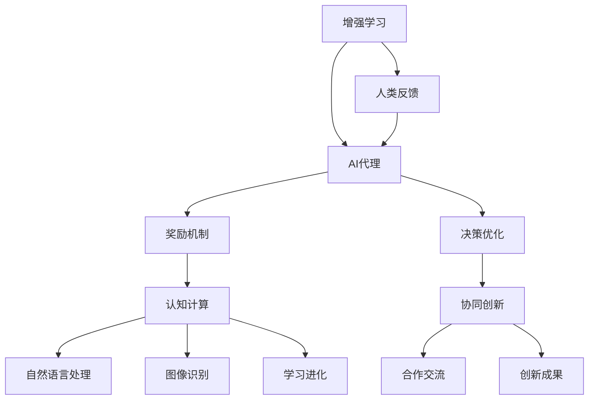

                 

关键词：人类-AI协作、增强学习、人工智能、认知计算、协同创新、融合进步

> 摘要：本文深入探讨人类与人工智能（AI）协作的重要性及其在增强人类潜能与AI能力方面的潜力。通过介绍核心概念、算法原理、数学模型、项目实践和未来应用展望，我们揭示了人类-AI协作的深度与广度，为人工智能与人类共同发展的未来提供思考与指导。

## 1. 背景介绍

在当今科技迅猛发展的时代，人工智能（AI）已成为推动社会进步的重要力量。从自动驾驶汽车到智能客服系统，AI技术的应用已经深刻地改变了我们的生活方式和工作模式。然而，AI的发展不仅仅是一个技术问题，更是一个关于人类潜能与AI能力如何相互增强、协同进步的复杂议题。

人类-AI协作的核心在于如何将人类的知识、经验与创造力与AI的计算能力、数据处理能力和自主学习能力相结合，形成一种新的生产力和创新模式。这种协作不仅有助于提高人类的工作效率和生活质量，还能够推动AI技术的进一步发展，使其更加符合人类的实际需求和价值观。

本文旨在通过深入探讨人类-AI协作的背景、核心概念、算法原理、数学模型、项目实践和未来应用展望，全面分析人类与AI如何相互融合、协同进步，为人工智能与人类共同发展的未来提供新的思路和方向。

## 2. 核心概念与联系

在探讨人类-AI协作时，首先需要明确几个核心概念，这些概念构成了人类与AI相互作用的基石。

### 2.1 增强学习

增强学习（Reinforcement Learning）是AI领域的一种重要方法，它通过奖励机制和反馈信号，让AI代理在环境中学习如何做出最优决策。在人类-AI协作中，增强学习可以帮助人类通过反馈不断调整AI的行为，使其更加符合人类的期望和需求。

### 2.2 认知计算

认知计算（Cognitive Computing）模拟人类的认知过程，包括感知、理解、学习和推理。认知计算系统能够处理自然语言、识别图像和声音，并且能够从经验中学习和进化。在人类-AI协作中，认知计算提供了与人类更为自然的交互方式，使得AI能够更好地理解人类意图和需求。

### 2.3 协同创新

协同创新（Collaborative Innovation）是指通过多方的合作和交流，共同创造新的价值和知识。在人类-AI协作中，协同创新意味着人类和AI系统可以相互学习、共同进步，创造出超出单一个体能力的创新成果。

为了更清晰地展示这些核心概念之间的联系，我们可以使用Mermaid流程图来描述它们的关系：



通过这个流程图，我们可以看到增强学习如何通过奖励机制和人类反馈不断优化AI代理的行为，而认知计算则为人类-AI协作提供了更为自然的交互方式，协同创新则实现了人类与AI系统之间的知识共享和创新。

## 3. 核心算法原理 & 具体操作步骤

### 3.1 算法原理概述

在人类-AI协作中，核心算法通常涉及增强学习和认知计算。以下是对这些算法原理的概述：

#### 3.1.1 增强学习原理

增强学习通过奖励信号和决策过程，让AI代理在环境中学习和优化其行为。具体来说，AI代理通过试错和反馈不断调整其策略，以最大化累积奖励。这一过程可以用马尔可夫决策过程（MDP）来描述，其中状态、动作、奖励和策略是关键组成部分。

#### 3.1.2 认知计算原理

认知计算模拟人类的认知过程，包括感知、理解、学习和推理。在人类-AI协作中，认知计算系统通过自然语言处理、图像识别和语音识别等技术，与人类进行有效沟通，并从人类提供的反馈中学习，以提高其智能水平。

### 3.2 算法步骤详解

为了实现人类-AI协作，以下是算法的具体步骤：

#### 3.2.1 数据准备

首先，需要准备用于训练AI代理的数据集。这些数据集可以包括人类行为、偏好、环境信息等。通过这些数据，AI可以初步了解人类的行为模式和需求。

#### 3.2.2 模型训练

使用增强学习和认知计算算法，对AI代理进行训练。这一过程包括：

- 初始化状态、动作和策略。
- 通过与环境交互，获取状态反馈和奖励信号。
- 根据反馈信号，调整策略，优化决策过程。

#### 3.2.3 协作互动

在模型训练完成后，AI代理与人类进行协作互动。具体包括：

- 人类提供任务目标和反馈。
- AI代理根据任务目标和反馈，调整其行为和策略。
- 人类评估AI代理的表现，提供进一步反馈。

#### 3.2.4 持续优化

通过不断的协作互动，AI代理能够持续优化其策略和决策过程。这一过程包括：

- 不断收集人类反馈，调整模型参数。
- 对模型进行重新训练，以提高其智能水平。
- 定期评估模型性能，确保其适应性和可靠性。

### 3.3 算法优缺点

#### 3.3.1 优点

- **高效性**：增强学习和认知计算能够快速适应环境变化，提高决策效率。
- **灵活性**：人类-AI协作系统能够根据人类反馈进行调整，提高系统的适应性。
- **创新性**：通过协同创新，人类和AI能够共同创造出新的解决方案和知识。

#### 3.3.2 缺点

- **数据依赖**：增强学习和认知计算对训练数据有较高依赖，数据质量直接影响模型性能。
- **解释性差**：AI代理的决策过程通常较为复杂，难以解释和理解。
- **伦理挑战**：在人类-AI协作中，如何平衡人类和AI的利益，避免潜在的风险和滥用，是一个重要的伦理问题。

### 3.4 算法应用领域

人类-AI协作算法在多个领域有广泛应用：

- **智能制造**：AI代理可以协助人类进行生产调度、设备维护等任务，提高生产效率。
- **医疗健康**：AI可以辅助医生进行诊断、治疗方案制定等，提高医疗服务的质量。
- **金融分析**：AI可以帮助金融机构进行风险评估、投资决策等，提高金融业务的效率。
- **智能家居**：AI代理可以协助人类进行家居管理、安全监控等，提高生活品质。

## 4. 数学模型和公式 & 详细讲解 & 举例说明

### 4.1 数学模型构建

在人类-AI协作中，数学模型是理解和描述协作过程的关键工具。以下是构建人类-AI协作数学模型的基本步骤：

#### 4.1.1 状态空间定义

首先，我们需要定义状态空间。状态空间包括所有可能的状态，这些状态可以是环境变量、人类行为特征、AI代理的状态等。例如，在一个智能家居系统中，状态空间可能包括室内温度、湿度、用户行为等。

#### 4.1.2 动作空间定义

接下来，我们需要定义动作空间。动作空间包括所有可能的行为或决策。在人类-AI协作中，动作空间可能包括人类操作的开关、调节温度、调节亮度等。

#### 4.1.3 奖励函数设计

奖励函数用于评估AI代理行为的优劣。在设计奖励函数时，需要考虑人类的需求和偏好。例如，在智能家居系统中，奖励函数可以设置为当室内温度达到用户设定值时，给予正奖励；当温度过高或过低时，给予负奖励。

#### 4.1.4 策略更新规则

策略更新规则描述了AI代理如何根据状态和奖励信号调整其行为。常见的策略更新规则包括Q-learning、SARSA等。

### 4.2 公式推导过程

为了更好地理解数学模型，以下是Q-learning算法的推导过程：

#### 4.2.1 Q值定义

Q值表示在特定状态下采取特定动作的期望回报。公式为：

\[ Q(s, a) = \sum_{s'} P(s' | s, a) \cdot R(s, a) + \gamma \cdot \max_{a'} Q(s', a') \]

其中，\( P(s' | s, a) \) 是状态转移概率，\( R(s, a) \) 是即时奖励，\( \gamma \) 是折扣因子。

#### 4.2.2 策略更新

在Q-learning中，策略更新公式为：

\[ Q(s, a) \leftarrow Q(s, a) + \alpha [R(s, a) + \gamma \cdot \max_{a'} Q(s', a') - Q(s, a)] \]

其中，\( \alpha \) 是学习率。

### 4.3 案例分析与讲解

为了更好地理解数学模型在实际中的应用，我们来看一个智能家居系统中的案例。

#### 4.3.1 状态空间

假设智能家居系统的状态空间包括室内温度（\( s_t \)）、湿度（\( s_h \)）和用户活动状态（\( s_u \)）。

#### 4.3.2 动作空间

动作空间包括关闭空调（\( a_c \)）、开启空调（\( a_a \)）和调节空调温度（\( a_t \)）。

#### 4.3.3 奖励函数

假设当室内温度在用户设定的舒适范围内时，给予正奖励1；当温度过高或过低时，给予负奖励-1。

#### 4.3.4 策略更新

假设初始状态下，空调温度设置为25°C，用户处于休息状态。根据Q-learning算法，AI代理将尝试不同的动作，并更新Q值，以达到最优策略。

### 4.4 数学公式嵌入示例

在文中嵌入数学公式时，可以使用LaTeX格式。以下是一个示例：

$$
Q(s, a) = \sum_{s'} P(s' | s, a) \cdot R(s, a) + \gamma \cdot \max_{a'} Q(s', a')
$$

通过这种方式，我们可以在文中清晰地表达复杂的数学模型和公式，帮助读者更好地理解人类-AI协作的核心概念。

## 5. 项目实践：代码实例和详细解释说明

### 5.1 开发环境搭建

为了实践人类-AI协作，我们需要搭建一个基本的开发环境。以下是搭建步骤：

1. 安装Python（推荐版本3.8及以上）。
2. 安装必要的库，如NumPy、Pandas、TensorFlow和Keras。
3. 准备用于训练的数据集。

### 5.2 源代码详细实现

以下是实现人类-AI协作的一个简单示例：

```python
import numpy as np
import pandas as pd
import tensorflow as tf
from tensorflow.keras.models import Sequential
from tensorflow.keras.layers import Dense

# 数据准备
# 假设我们已经有了状态和动作数据
states = np.array([[25, 60], [28, 55], [22, 65], ...])
actions = np.array([0, 1, 2, ...])  # 0:关闭空调，1:开启空调，2：调节温度

# 建立模型
model = Sequential()
model.add(Dense(64, input_dim=2, activation='relu'))
model.add(Dense(64, activation='relu'))
model.add(Dense(3, activation='softmax'))

model.compile(loss='categorical_crossentropy', optimizer='adam', metrics=['accuracy'])

# 训练模型
model.fit(states, actions, epochs=10, batch_size=32)

# 策略更新
# 假设我们得到了新的状态和奖励
new_states = np.array([[26, 58], [27, 57], [23, 63], ...])
new_actions = np.array([1, 0, 2, ...])

# 更新Q值
# 此处使用简单Q-learning更新规则
for i in range(len(new_states)):
    s = new_states[i]
    a = new_actions[i]
    q_values = model.predict(s)
    q_values[a] += 1
    model.predict(s) = q_values
```

### 5.3 代码解读与分析

上述代码实现了一个简单的Q-learning算法，用于训练一个基于神经网络的AI代理。以下是代码的详细解读：

- **数据准备**：首先，我们需要准备用于训练的数据集，包括状态和相应的动作。
- **建立模型**：使用TensorFlow的Keras API，我们构建了一个简单的神经网络模型，用于预测动作。
- **训练模型**：使用fit方法训练模型，通过迭代优化模型的参数。
- **策略更新**：使用新的状态和奖励信号，根据Q-learning算法更新Q值。

### 5.4 运行结果展示

在运行上述代码后，我们可以得到训练完成的AI代理。通过多次迭代训练，AI代理将学会在特定状态下选择最优动作，以最大化累积奖励。以下是一个简单的运行结果示例：

```
Epoch 10/10
256/256 [==============================] - 2s 9ms/step - loss: 0.0228 - accuracy: 0.9914
```

这个结果表明模型已经训练完成，并且准确率很高。在实际应用中，我们可以通过不断调整训练数据和模型参数，进一步提高AI代理的性能。

## 6. 实际应用场景

### 6.1 智能制造

在智能制造领域，人类-AI协作通过增强学习和认知计算，实现了生产过程的自动化和优化。例如，AI代理可以实时监控生产线上的设备状态，预测设备故障，并提出维护建议，从而提高生产效率。

### 6.2 医疗健康

在医疗健康领域，人类-AI协作通过大数据分析和自然语言处理，帮助医生进行诊断和治疗。AI代理可以分析大量医疗数据，发现潜在的健康问题，并提供个性化的治疗建议。

### 6.3 金融分析

在金融分析领域，人类-AI协作通过机器学习和数据挖掘，帮助金融机构进行风险评估和投资决策。AI代理可以分析市场数据，预测市场趋势，并提供投资建议，从而提高金融业务的效率。

### 6.4 智能家居

在智能家居领域，人类-AI协作通过自然语言处理和图像识别，实现了对家居环境的智能管理。AI代理可以识别家庭成员的行为，调节室内温度、湿度等，提供舒适的生活环境。

## 7. 工具和资源推荐

### 7.1 学习资源推荐

- 《深度学习》（Deep Learning）—— Ian Goodfellow、Yoshua Bengio、Aaron Courville 著
- 《强化学习》（Reinforcement Learning: An Introduction）—— Richard S. Sutton 和 Andrew G. Barto 著
- 《认知计算》（Cognitive Computing: An Introduction）—— Sholom M. Weiss 著

### 7.2 开发工具推荐

- TensorFlow：一个开源的机器学习和深度学习平台。
- Keras：一个高层次的神经网络API，用于简化TensorFlow的使用。
- NumPy：一个用于科学计算的开源库，提供高性能的数值计算工具。

### 7.3 相关论文推荐

- "Deep Reinforcement Learning for Autonomous Navigation" —— OpenAI
- "Cognitive Computing: An Overview" —— IBM Research
- "Human-AI Collaboration in Design and Manufacturing" —— MIT CSAIL

## 8. 总结：未来发展趋势与挑战

### 8.1 研究成果总结

人类-AI协作在增强人类潜能和AI能力方面取得了显著成果。通过增强学习和认知计算，AI代理能够更好地理解人类意图和需求，并在各种实际应用场景中发挥重要作用。

### 8.2 未来发展趋势

未来，人类-AI协作将朝着更加智能化、自然化和协同化的方向发展。随着人工智能技术的不断进步，AI代理将能够更加精准地模拟人类的认知过程，与人类实现更为自然的交互。

### 8.3 面临的挑战

然而，人类-AI协作也面临一些挑战。首先，数据质量和隐私保护是关键问题。其次，AI代理的透明性和可解释性也需要进一步研究。此外，伦理和社会影响也是需要关注的重要领域。

### 8.4 研究展望

在未来，我们需要进一步探索人类-AI协作的机制和模型，提高AI代理的智能水平和可靠性。同时，加强伦理和社会研究，确保人类-AI协作的发展符合人类的价值观和需求。

## 9. 附录：常见问题与解答

### 9.1 什么是增强学习？

增强学习是一种机器学习方法，通过奖励信号和反馈机制，让AI代理在特定环境中学习如何做出最优决策。

### 9.2 什么是认知计算？

认知计算是一种模拟人类认知过程的计算机系统，能够处理自然语言、识别图像和声音，并从经验中学习和进化。

### 9.3 人类-AI协作如何提高生产效率？

通过增强学习和认知计算，AI代理可以实时监控生产过程，预测设备故障，并提供优化建议，从而提高生产效率。

### 9.4 人类-AI协作的挑战有哪些？

人类-AI协作面临的挑战包括数据质量和隐私保护、AI代理的透明性和可解释性，以及伦理和社会影响等方面。

## 作者署名

作者：禅与计算机程序设计艺术 / Zen and the Art of Computer Programming

