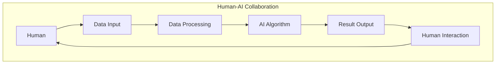

                 

 关键词：人类-AI协作，潜能增强，AI能力发展，技术融合，智能协作，创新应用。

> 摘要：本文探讨了人类与人工智能协作的深层意义及其在现实世界中的应用。通过阐述核心概念与联系，剖析了AI算法原理和数学模型，并结合实际项目实践，展示了AI技术如何增强人类潜能，推动AI能力的发展。文章旨在为读者提供全面的技术见解，助力未来智能协作的深入研究。

## 1. 背景介绍

### 1.1 人工智能的发展现状

人工智能（AI）作为计算机科学的前沿领域，近年来取得了飞速发展。从早期的专家系统到今天的深度学习和大数据分析，AI技术已经在医疗、金融、教育、交通等多个领域展现出了强大的应用潜力。特别是随着云计算、物联网和5G技术的不断成熟，AI的应用场景变得更加广泛，与人类生活的融合程度也愈发紧密。

### 1.2 人类潜能与AI协作的意义

人类潜能的发挥是一个多方面的问题，涉及认知、情感、创造力等多个层面。传统观点认为，人类潜能的发挥主要依赖于自身的经验和知识。然而，随着AI技术的不断进步，人类潜能的发挥已经不再局限于个体自身的局限，而是可以借助AI的辅助，实现更高层次的创新与协作。

人类与AI的协作，不仅可以弥补人类在数据处理、模式识别等方面的不足，还可以通过AI的算法优化和模型训练，进一步挖掘人类潜能。例如，在医疗领域，AI可以通过分析大量的医疗数据，辅助医生做出更加精准的诊断和治疗方案；在教育领域，AI可以为学生提供个性化的学习方案，帮助他们更加高效地掌握知识。

## 2. 核心概念与联系

### 2.1 AI与人类协作的核心概念

为了深入理解人类与AI的协作，首先需要明确几个核心概念：

- **智能增强**：通过AI技术，增强人类的认知能力和工作效能。
- **协同工作**：人类与AI在同一个工作场景中，相互依赖，共同完成任务。
- **人机交互**：人类与AI通过语言、图像、声音等多种方式进行的交互。

### 2.2 人类-AI协作的架构

图1展示了人类-AI协作的基本架构。在这个架构中，人类和AI各自承担不同的角色，通过数据交换和指令传递，实现协同工作。



### 2.3 AI算法在人类协作中的应用

AI算法是驱动人类-AI协作的核心。常见的AI算法包括深度学习、强化学习、自然语言处理等。这些算法通过模型训练和优化，可以实现对大量数据的智能分析和决策支持。

例如，在医疗领域，深度学习算法可以通过分析大量的医学图像，帮助医生更准确地诊断疾病。而在金融领域，强化学习算法可以通过模拟金融市场，为投资者提供实时的投资建议。

## 3. 核心算法原理 & 具体操作步骤

### 3.1 算法原理概述

本文将重点介绍深度学习算法在人类协作中的应用。深度学习是一种基于多层神经网络的学习方法，通过多层非线性变换，从数据中自动提取特征，实现复杂函数的近似。

### 3.2 算法步骤详解

深度学习算法的主要步骤包括：

1. **数据预处理**：对输入数据进行标准化、归一化等处理，使其适合网络训练。
2. **模型构建**：设计并构建多层神经网络模型，包括输入层、隐藏层和输出层。
3. **模型训练**：使用标记数据进行模型训练，通过反向传播算法不断调整网络权重，使模型能够准确预测。
4. **模型评估**：使用验证集对模型进行评估，调整模型参数，优化模型性能。
5. **模型部署**：将训练好的模型部署到实际应用场景中，为人类提供智能服务。

### 3.3 算法优缺点

深度学习算法具有以下几个优点：

- **强大的特征提取能力**：能够从原始数据中自动提取有代表性的特征，提高模型的泛化能力。
- **良好的泛化性能**：通过多层非线性变换，能够处理复杂的非线性关系。
- **广泛的应用领域**：在图像识别、自然语言处理、推荐系统等领域都有广泛应用。

然而，深度学习算法也存在一些缺点：

- **训练成本高**：需要大量的数据和计算资源，训练时间较长。
- **模型可解释性差**：深度学习模型的内部结构复杂，难以理解其具体工作原理。
- **对数据质量要求高**：数据质量直接影响到模型的性能，特别是对于小样本问题。

### 3.4 算法应用领域

深度学习算法在多个领域都有广泛应用：

- **医疗领域**：用于疾病诊断、药物研发等，例如，通过分析医学影像，辅助医生诊断疾病。
- **金融领域**：用于风险控制、信用评分、投资策略等，例如，通过分析市场数据，预测股票价格趋势。
- **教育领域**：用于个性化学习、教育评价等，例如，通过分析学生的学习行为，提供个性化的学习建议。

## 4. 数学模型和公式 & 详细讲解 & 举例说明

### 4.1 数学模型构建

深度学习算法的核心是多层神经网络，其数学模型可以表示为：

$$
\hat{y} = f(Z)
$$

其中，$\hat{y}$是模型的输出，$f$是激活函数，$Z$是网络的输入。

### 4.2 公式推导过程

深度学习算法的推导过程主要涉及以下几个方面：

1. **损失函数**：定义损失函数，衡量模型预测值与实际值之间的差距。常见的损失函数有均方误差（MSE）、交叉熵（Cross-Entropy）等。
2. **反向传播**：通过反向传播算法，计算损失函数关于网络参数的梯度，用于更新网络权重。
3. **优化算法**：选择优化算法，如梯度下降（Gradient Descent）、Adam等，用于调整网络参数。

### 4.3 案例分析与讲解

以一个简单的线性回归模型为例，假设输入为$x$，输出为$y$，我们可以建立以下数学模型：

$$
y = \beta_0 + \beta_1 x
$$

其中，$\beta_0$和$\beta_1$是模型参数。

通过最小化损失函数，我们可以求解出$\beta_0$和$\beta_1$的值，从而实现模型的训练。

## 5. 项目实践：代码实例和详细解释说明

### 5.1 开发环境搭建

在开始编写代码之前，需要搭建一个合适的开发环境。本文选用Python作为主要编程语言，结合TensorFlow框架，实现深度学习算法。

### 5.2 源代码详细实现

以下是一个简单的深度学习模型的实现代码：

```python
import tensorflow as tf

# 模型参数
input_size = 1
hidden_size = 10
output_size = 1

# 模型构建
model = tf.keras.Sequential([
    tf.keras.layers.Dense(hidden_size, activation='relu', input_shape=(input_size,)),
    tf.keras.layers.Dense(output_size)
])

# 模型编译
model.compile(optimizer='adam', loss='mse')

# 模型训练
model.fit(x_train, y_train, epochs=100, batch_size=32)
```

### 5.3 代码解读与分析

上述代码实现了一个人工神经网络，用于拟合一个简单的线性回归问题。其中：

- `tf.keras.Sequential`：构建一个序列模型。
- `tf.keras.layers.Dense`：添加全连接层，用于计算线性组合和激活函数。
- `model.compile`：编译模型，指定优化器和损失函数。
- `model.fit`：训练模型，使用训练数据。

### 5.4 运行结果展示

通过运行上述代码，可以得到模型的训练结果。我们可以使用验证数据集对模型进行评估，检查其性能。

## 6. 实际应用场景

### 6.1 医疗领域

在医疗领域，AI技术可以用于疾病诊断、药物研发等。例如，通过深度学习算法分析医学影像，可以帮助医生更准确地诊断疾病，提高诊断的效率和准确性。

### 6.2 金融领域

在金融领域，AI技术可以用于风险控制、信用评分、投资策略等。例如，通过深度学习算法分析市场数据，可以为投资者提供实时的投资建议，帮助其做出更明智的决策。

### 6.3 教育领域

在教育领域，AI技术可以用于个性化学习、教育评价等。例如，通过深度学习算法分析学生的学习行为，可以为教师提供个性化的教学建议，提高教学效果。

## 7. 工具和资源推荐

### 7.1 学习资源推荐

- 《深度学习》（Ian Goodfellow、Yoshua Bengio、Aaron Courville 著）：一本系统介绍深度学习理论和实践的权威教材。
- 《Python机器学习》（Sebastian Raschka 著）：一本通俗易懂的Python机器学习入门书籍。

### 7.2 开发工具推荐

- TensorFlow：一个开源的深度学习框架，支持多种编程语言。
- PyTorch：一个开源的深度学习框架，具有良好的灵活性和扩展性。

### 7.3 相关论文推荐

- "Deep Learning"（Yoshua Bengio、Ian Goodfellow、Aaron Courville 著）：一篇系统介绍深度学习理论和技术的综述论文。
- "TensorFlow: Large-Scale Machine Learning on Heterogeneous Systems"（Google Research 著）：一篇介绍TensorFlow框架的论文。

## 8. 总结：未来发展趋势与挑战

### 8.1 研究成果总结

人类-AI协作领域已经取得了显著的成果，特别是在医疗、金融、教育等领域，AI技术已经展现出了强大的应用潜力。通过深度学习、自然语言处理等技术的应用，AI已经能够辅助人类完成复杂的任务，提高工作效率。

### 8.2 未来发展趋势

随着AI技术的不断进步，未来人类-AI协作将呈现出以下几个发展趋势：

- **智能化水平的提升**：AI技术将更加智能化，能够更好地理解人类需求，提供更加个性化的服务。
- **跨领域的融合发展**：AI技术将在更多领域得到应用，与人类形成更加紧密的协作关系。
- **人机交互的优化**：人机交互技术将不断优化，使人类与AI的协作更加自然、高效。

### 8.3 面临的挑战

尽管人类-AI协作前景广阔，但也面临一些挑战：

- **技术瓶颈**：在算法优化、计算效率等方面仍需突破。
- **数据隐私**：如何确保数据安全和隐私是一个重要问题。
- **伦理问题**：如何平衡人类与AI的利益，避免出现伦理问题。

### 8.4 研究展望

未来，人类-AI协作的研究将朝着更加智能化、融合化和人性化的方向发展。通过持续的技术创新和跨学科合作，人类与AI的协作将带来更加丰富和多样的应用场景，为人类社会的发展注入新的活力。

## 9. 附录：常见问题与解答

### 9.1 人类-AI协作的目的是什么？

人类-AI协作的目的是通过AI技术增强人类的认知能力和工作效率，实现人类潜能的进一步挖掘。

### 9.2 深度学习算法的主要优点是什么？

深度学习算法的主要优点包括强大的特征提取能力、良好的泛化性能和广泛的应用领域。

### 9.3 如何确保数据隐私和安全？

确保数据隐私和安全的方法包括加密数据传输、数据匿名化处理、严格的数据访问控制等。

### 9.4 人类-AI协作面临的主要挑战是什么？

人类-AI协作面临的主要挑战包括技术瓶颈、数据隐私和伦理问题等。

----------------------------------------------------------------

作者：禅与计算机程序设计艺术 / Zen and the Art of Computer Programming


