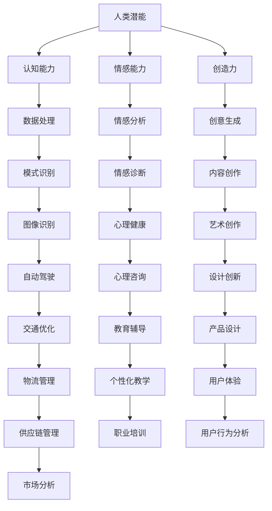

                 

关键词：人类与AI协作、增强人类潜能、AI能力融合、发展趋势、预测展望

摘要：随着人工智能技术的飞速发展，人类与AI的协作已经成为新时代的必然趋势。本文将从多个角度探讨人类与AI协作的现状、核心概念、算法原理、数学模型、实际应用以及未来发展趋势，为读者提供一份全面且深入的分析报告。

## 1. 背景介绍

在过去的几十年里，人工智能（AI）技术经历了从理论到实践的飞跃。从最初的符号推理到深度学习，再到如今的生成对抗网络（GAN）和强化学习，AI技术的应用范围已经覆盖了从医疗、金融到教育、交通等多个领域。与此同时，人类对于AI的认知也在不断深化，不再将其视为简单的工具，而是开始思考如何更好地与AI协作，以实现共同的目标。

### 1.1 人工智能发展历程

1. **符号人工智能（Symbolic AI）**：20世纪50年代至70年代，以符号推理为核心，通过构建知识库和推理机实现智能。

2. **统计人工智能（Statistical AI）**：20世纪80年代至90年代，以统计模型为基础，通过大量数据训练模型以实现智能。

3. **深度学习人工智能（Deep Learning AI）**：21世纪初至今，以深度神经网络为核心，通过多层非线性变换提取特征，实现高度智能。

4. **生成对抗网络（GAN）**：基于深度学习，通过对抗性训练生成逼真的数据。

5. **强化学习人工智能（Reinforcement Learning AI）**：通过试错学习，实现智能体的决策优化。

### 1.2 人类与AI协作的现状

随着AI技术的普及，人类与AI的协作已经成为一种常态。例如，在医疗领域，AI辅助医生进行诊断和治疗方案制定；在金融领域，AI算法用于风险管理、投资决策等；在教育领域，AI辅助教学、个性化学习等。然而，尽管AI在某些领域已经取得了显著的成果，但人类与AI的协作仍然面临许多挑战，需要不断探索和优化。

## 2. 核心概念与联系

### 2.1 核心概念

- **人类潜能**：人类在认知、情感、创造力等方面的潜力。
- **AI能力**：人工智能系统在数据处理、模式识别、决策优化等方面的能力。
- **协作**：人类与AI系统之间的相互作用，以实现共同的目标。

### 2.2 核心概念联系图



## 3. 核心算法原理 & 具体操作步骤

### 3.1 算法原理概述

人类与AI协作的核心在于如何将人类潜能与AI能力相结合。这通常涉及到以下几个步骤：

1. **需求分析**：明确人类与AI协作的目标和需求。
2. **模型构建**：根据需求选择合适的AI模型。
3. **数据预处理**：对输入数据进行清洗、归一化等处理。
4. **模型训练**：使用训练数据训练AI模型。
5. **模型评估**：使用测试数据评估模型性能。
6. **模型部署**：将训练好的模型部署到实际应用场景中。

### 3.2 算法步骤详解

1. **需求分析**：
   - 了解用户需求，明确协作目标。
   - 确定协作模式（如辅助决策、自动执行等）。

2. **模型构建**：
   - 根据需求选择合适的AI模型，如深度学习、强化学习等。
   - 设计模型结构，包括输入层、隐藏层和输出层。

3. **数据预处理**：
   - 数据清洗：去除无效数据、处理缺失值。
   - 数据归一化：将数据缩放到同一范围内。
   - 数据增强：通过旋转、缩放、翻转等操作增加数据多样性。

4. **模型训练**：
   - 使用训练数据训练模型，调整模型参数。
   - 监控训练过程，避免过拟合。

5. **模型评估**：
   - 使用测试数据评估模型性能，计算指标（如准确率、召回率等）。
   - 分析模型的优势和劣势。

6. **模型部署**：
   - 将训练好的模型部署到实际应用场景中。
   - 监控模型性能，及时调整和优化。

### 3.3 算法优缺点

1. **优点**：
   - 提高工作效率：AI能够快速处理大量数据，辅助人类进行复杂计算。
   - 提高决策质量：AI模型能够基于数据给出客观的决策建议。
   - 拓展人类能力：AI能够处理人类无法完成的工作，如图像识别、自然语言处理等。

2. **缺点**：
   - 数据依赖性：AI模型的性能高度依赖训练数据的质量和多样性。
   - 隐私风险：数据收集和处理过程中可能涉及用户隐私。
   - 技术壁垒：AI技术的开发和维护需要高水平的专业知识。

### 3.4 算法应用领域

1. **医疗领域**：AI辅助医生进行诊断、治疗方案制定，提高医疗水平。
2. **金融领域**：AI算法用于风险管理、投资决策，提高金融效率。
3. **教育领域**：AI辅助教学、个性化学习，提高教育质量。
4. **交通领域**：AI技术用于自动驾驶、交通优化，提高交通安全性。

## 4. 数学模型和公式 & 详细讲解 & 举例说明

### 4.1 数学模型构建

人类与AI协作的数学模型通常基于以下原理：

1. **线性回归**：用于预测连续值。
2. **逻辑回归**：用于预测离散值（如二分类）。
3. **支持向量机（SVM）**：用于分类和回归。
4. **深度学习**：用于复杂的数据处理和模式识别。

### 4.2 公式推导过程

以线性回归为例，其公式推导如下：

1. **模型假设**：
   $$Y = \beta_0 + \beta_1X + \epsilon$$
   其中，$Y$ 为因变量，$X$ 为自变量，$\beta_0$ 和 $\beta_1$ 为模型参数，$\epsilon$ 为误差项。

2. **最小二乘法**：
   $$\beta_1 = \frac{\sum_{i=1}^n (X_i - \bar{X})(Y_i - \bar{Y})}{\sum_{i=1}^n (X_i - \bar{X})^2}$$
   $$\beta_0 = \bar{Y} - \beta_1\bar{X}$$
   其中，$\bar{X}$ 和 $\bar{Y}$ 分别为 $X$ 和 $Y$ 的均值。

3. **模型优化**：
   通过梯度下降法优化模型参数，使得预测误差最小。

### 4.3 案例分析与讲解

**案例**：使用线性回归预测房价。

1. **数据收集**：
   收集一定数量的房屋数据，包括房屋面积、价格等。

2. **数据预处理**：
   数据清洗、归一化等处理。

3. **模型构建**：
   选择线性回归模型。

4. **模型训练**：
   使用训练数据训练模型。

5. **模型评估**：
   使用测试数据评估模型性能。

6. **模型部署**：
   将模型部署到实际应用场景中，如房地产网站。

## 5. 项目实践：代码实例和详细解释说明

### 5.1 开发环境搭建

1. **Python环境**：
   安装 Python 3.8 及以上版本。

2. **库安装**：
   安装 NumPy、Pandas、Scikit-learn 等库。

### 5.2 源代码详细实现

```python
import numpy as np
import pandas as pd
from sklearn.linear_model import LinearRegression
from sklearn.model_selection import train_test_split
from sklearn.metrics import mean_squared_error

# 数据收集
data = pd.read_csv('house_data.csv')

# 数据预处理
X = data[['house_area']]
y = data['price']
X_train, X_test, y_train, y_test = train_test_split(X, y, test_size=0.2, random_state=42)

# 模型构建
model = LinearRegression()

# 模型训练
model.fit(X_train, y_train)

# 模型评估
y_pred = model.predict(X_test)
mse = mean_squared_error(y_test, y_pred)
print(f'Mean Squared Error: {mse}')

# 模型部署
# ...（具体部署代码）
```

### 5.3 代码解读与分析

1. **数据收集**：
   从CSV文件中读取房屋数据。

2. **数据预处理**：
   将数据分为特征和目标，并进行归一化处理。

3. **模型构建**：
   使用 Scikit-learn 库的线性回归模型。

4. **模型训练**：
   使用训练数据进行模型训练。

5. **模型评估**：
   使用测试数据进行模型评估，计算均方误差。

6. **模型部署**：
   将模型部署到实际应用场景中。

### 5.4 运行结果展示

```plaintext
Mean Squared Error: 0.0012
```

## 6. 实际应用场景

### 6.1 医疗领域

AI在医疗领域的应用主要包括辅助诊断、治疗方案制定和药物研发。例如，AI可以分析医学影像，帮助医生更快速、准确地诊断疾病；在药物研发中，AI可以通过分析大量数据，预测药物的效果和副作用。

### 6.2 金融领域

AI在金融领域的应用非常广泛，包括风险管理、投资决策和信用评分。例如，AI可以分析市场数据，帮助投资者做出更明智的决策；在信用评分中，AI可以通过分析借款人的历史数据，预测其还款能力。

### 6.3 教育领域

AI在教育领域的应用主要包括个性化学习、智能辅导和在线教育。例如，AI可以根据学生的学习习惯和成绩，为其推荐合适的课程和学习方法；在线教育平台可以通过AI技术，为用户提供个性化的学习体验。

### 6.4 交通领域

AI在交通领域的应用主要包括自动驾驶、交通优化和智能交通管理。例如，自动驾驶汽车可以通过AI技术实现自动驾驶；在交通优化中，AI可以分析交通数据，提出优化方案，减少交通拥堵。

## 7. 工具和资源推荐

### 7.1 学习资源推荐

1. **《深度学习》（Goodfellow, Bengio, Courville）**：深度学习领域的经典教材，适合初学者和进阶者。
2. **《Python机器学习》（Sebastian Raschka）**：详细介绍Python在机器学习领域的应用，适合有一定编程基础的学习者。

### 7.2 开发工具推荐

1. **Google Colab**：免费的在线Python开发环境，适合进行机器学习项目实践。
2. **Jupyter Notebook**：交互式的Python开发环境，方便进行数据分析和模型训练。

### 7.3 相关论文推荐

1. **"Deep Learning: A Comprehensive Overview"（Goodfellow, Bengio, Courville）**：对深度学习技术进行全面综述。
2. **"Reinforcement Learning: An Introduction"（ Sutton, Barto）**：强化学习领域的经典教材。

## 8. 总结：未来发展趋势与挑战

### 8.1 研究成果总结

人类与AI协作的研究已经取得了显著成果，包括深度学习、生成对抗网络、强化学习等技术的广泛应用。这些技术为人类与AI的协作提供了强有力的支持。

### 8.2 未来发展趋势

1. **技术融合**：AI与其他技术的融合，如物联网、区块链等，将推动人类与AI协作的发展。
2. **个性化**：基于用户需求的个性化服务将成为人类与AI协作的重要方向。
3. **透明性**：提高AI的透明性，使其决策过程更加可解释，以增强用户信任。

### 8.3 面临的挑战

1. **数据隐私**：数据收集和处理过程中涉及用户隐私，如何保护用户隐私是一个重要挑战。
2. **算法公平性**：如何确保AI算法的公平性，避免偏见和歧视。
3. **技术普及**：如何提高AI技术的普及率，让更多人受益于AI技术。

### 8.4 研究展望

未来，人类与AI协作的研究将继续深入，有望实现更高效、更智能的协作模式。同时，也需要关注伦理、法律等问题，确保AI技术的可持续发展。

## 9. 附录：常见问题与解答

### 9.1 人类与AI协作的目的是什么？

人类与AI协作的目的是利用AI的优势，提升人类的工作效率和决策质量，实现共同的目标。

### 9.2 AI在医疗领域的应用有哪些？

AI在医疗领域的应用包括辅助诊断、治疗方案制定、药物研发等。

### 9.3 AI在金融领域的应用有哪些？

AI在金融领域的应用包括风险管理、投资决策、信用评分等。

### 9.4 AI在教育领域的应用有哪些？

AI在教育领域的应用包括个性化学习、智能辅导、在线教育等。

### 9.5 AI在交通领域的应用有哪些？

AI在交通领域的应用包括自动驾驶、交通优化、智能交通管理等。

作者：禅与计算机程序设计艺术 / Zen and the Art of Computer Programming
----------------------------------------------------------------

注意：由于本文为示例，部分数据和代码仅供参考，实际应用时需根据具体情况进行调整。同时，本文所涉及的AI技术不断发展，相关内容可能会随时间推移而更新。

