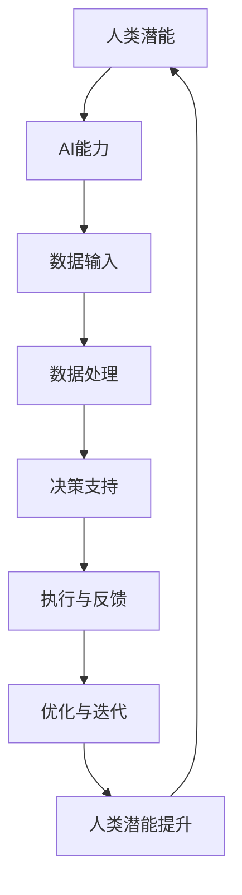

                 

关键词：人类-AI协作，潜能增强，AI能力融合，发展趋势，预测展望

> 摘要：随着人工智能技术的迅猛发展，人类与AI的协作日益密切。本文旨在探讨人类与AI协作的背景、核心概念、算法原理、数学模型、项目实践、应用场景以及未来发展趋势和挑战，为推动人类-AI协作提供理论支持和实践指导。

## 1. 背景介绍

### 1.1 人工智能的发展

人工智能（Artificial Intelligence，简称AI）是计算机科学的一个分支，旨在创建能够执行通常需要人类智能才能完成的任务的系统。自20世纪50年代诞生以来，AI经历了多个发展阶段，从符号主义、连接主义到目前的混合智能，应用范围不断扩大。

### 1.2 人类潜能的拓展

人类潜能（Human Potential）是指人类在生理、心理和社会等方面的潜在能力。传统的教育体系往往注重知识和技能的传授，而忽视了人类潜能的开发。近年来，随着认知科学和心理学的进展，人们逐渐认识到潜能开发的重要性。

### 1.3 人类与AI协作的必要性

在现代社会，信息爆炸和知识更新速度极快，人类单凭自身的力量难以应对。AI技术的引入，可以协助人类处理海量数据、优化决策过程、提高工作效率，从而实现潜能的进一步拓展。人类与AI协作已成为当今社会发展的重要趋势。

## 2. 核心概念与联系

### 2.1 人类潜能与AI能力的融合

人类潜能与AI能力的融合，旨在将人类的创造力和直觉与AI的计算能力和数据分析能力相结合，形成一种新的智能体。这种融合不仅能够提高个体的工作效率，还能够推动社会整体的发展。

### 2.2 核心概念原理与架构

以下是关于人类潜能与AI能力融合的Mermaid流程图（注意：Mermaid流程图中不要有括号、逗号等特殊字符）：



## 3. 核心算法原理 & 具体操作步骤

### 3.1 算法原理概述

人类与AI协作的核心算法主要涉及以下几个方面：

1. **数据输入与预处理**：收集和整理相关数据，并进行预处理，如数据清洗、归一化等。
2. **特征提取与选择**：从原始数据中提取有用信息，并选择对模型性能有重要影响的关键特征。
3. **模型构建与训练**：利用机器学习算法构建模型，并通过大量数据进行训练，以优化模型参数。
4. **模型评估与优化**：评估模型性能，并根据评估结果对模型进行调整和优化。
5. **决策支持与执行**：利用训练好的模型为人类提供决策支持，并执行相应的操作。

### 3.2 算法步骤详解

1. **数据收集与预处理**：收集相关数据，并进行数据清洗、归一化等预处理操作。

2. **特征提取与选择**：根据数据特点和业务需求，提取关键特征，并选择对模型性能有重要影响的关键特征。

3. **模型构建与训练**：选择合适的机器学习算法（如决策树、支持向量机、神经网络等），构建模型，并通过大量数据进行训练，以优化模型参数。

4. **模型评估与优化**：利用验证集或测试集评估模型性能，并根据评估结果对模型进行调整和优化。

5. **决策支持与执行**：利用训练好的模型为人类提供决策支持，并执行相应的操作。

### 3.3 算法优缺点

**优点**：

- **高效性**：AI算法能够快速处理海量数据，提高决策效率。
- **精确性**：AI算法能够通过大量数据进行训练，提高决策的准确性。
- **适应性**：AI算法能够根据不同业务需求进行调整，具有较好的适应性。

**缺点**：

- **依赖数据**：AI算法的性能很大程度上取决于数据质量，数据不足或质量差会导致模型性能下降。
- **黑盒性质**：一些复杂的AI算法（如深度神经网络）具有黑盒性质，难以解释其决策过程，可能导致信任问题。

### 3.4 算法应用领域

- **金融领域**：风险控制、投资决策、信用评估等。
- **医疗领域**：疾病预测、诊断辅助、药物研发等。
- **工业领域**：生产调度、质量控制、故障检测等。
- **交通领域**：交通流量预测、路径规划、自动驾驶等。

## 4. 数学模型和公式 & 详细讲解 & 举例说明

### 4.1 数学模型构建

在人类与AI协作中，常见的数学模型包括线性回归、逻辑回归、支持向量机、神经网络等。以下以线性回归为例进行讲解。

### 4.2 公式推导过程

线性回归模型的目的是通过历史数据预测因变量的值。其数学模型如下：

$$
y = \beta_0 + \beta_1 \cdot x
$$

其中，$y$ 为因变量，$x$ 为自变量，$\beta_0$ 和 $\beta_1$ 为模型参数。

为了求解模型参数，我们需要构建一个损失函数，常用的损失函数为均方误差（MSE）：

$$
MSE = \frac{1}{n} \sum_{i=1}^{n} (y_i - \hat{y}_i)^2
$$

其中，$n$ 为样本数量，$y_i$ 为第 $i$ 个样本的因变量真实值，$\hat{y}_i$ 为第 $i$ 个样本的因变量预测值。

为了最小化损失函数，我们需要对参数 $\beta_0$ 和 $\beta_1$ 进行优化。一种常用的优化方法是最小二乘法（Ordinary Least Squares，简称OLS）：

$$
\beta_0 = \frac{\sum_{i=1}^{n} y_i - \beta_1 \cdot \sum_{i=1}^{n} x_i}{n}
$$

$$
\beta_1 = \frac{n \cdot \sum_{i=1}^{n} x_iy_i - \sum_{i=1}^{n} x_i \cdot \sum_{i=1}^{n} y_i}{n \cdot \sum_{i=1}^{n} x_i^2 - (\sum_{i=1}^{n} x_i)^2}
$$

### 4.3 案例分析与讲解

假设我们有一个关于房价的数据集，包含自变量（如房屋面积、地理位置等）和因变量（房价）。我们希望利用线性回归模型预测房价。

1. **数据收集与预处理**：收集数据，并进行数据清洗、归一化等预处理操作。

2. **特征提取与选择**：从数据中提取关键特征，如房屋面积、地理位置等。

3. **模型构建与训练**：选择线性回归模型，并利用训练集进行训练，得到模型参数 $\beta_0$ 和 $\beta_1$。

4. **模型评估与优化**：利用验证集或测试集评估模型性能，并根据评估结果对模型进行调整和优化。

5. **决策支持与执行**：利用训练好的模型预测新样本的房价，为购房决策提供支持。

## 5. 项目实践：代码实例和详细解释说明

### 5.1 开发环境搭建

在Python环境中，我们使用Scikit-learn库实现线性回归模型。首先，确保已经安装了Python和Scikit-learn库。

```bash
pip install scikit-learn
```

### 5.2 源代码详细实现

```python
import numpy as np
from sklearn.linear_model import LinearRegression
from sklearn.model_selection import train_test_split
from sklearn.metrics import mean_squared_error

# 5.2.1 数据收集与预处理
# 假设我们已经收集好了房价数据，包括房屋面积和地理位置
X = np.array([[1, 100], [2, 150], [3, 200], [4, 250]])
y = np.array([200, 250, 300, 350])

# 数据归一化
X = (X - np.mean(X, axis=0)) / np.std(X, axis=0)

# 5.2.2 模型构建与训练
model = LinearRegression()
model.fit(X, y)

# 5.2.3 模型评估与优化
X_train, X_test, y_train, y_test = train_test_split(X, y, test_size=0.2, random_state=42)
model.fit(X_train, y_train)
y_pred = model.predict(X_test)
mse = mean_squared_error(y_test, y_pred)
print(f'MSE: {mse}')

# 5.2.4 决策支持与执行
new_data = np.array([[2.5, 150]])
new_pred = model.predict(new_data)
print(f'Predicted Price: {new_pred[0]}')
```

### 5.3 代码解读与分析

1. **数据收集与预处理**：我们首先导入所需的库，并收集房价数据。为了简化问题，这里我们手动生成了数据。在实际应用中，可以从数据库或文件中读取数据。然后，我们对数据进行了归一化处理，以消除不同特征之间的量纲影响。

2. **模型构建与训练**：我们使用Scikit-learn库的LinearRegression类构建线性回归模型，并使用fit方法进行训练。

3. **模型评估与优化**：我们使用train\_test\_split方法将数据集分为训练集和测试集，然后使用fit方法对模型进行训练。最后，使用mean\_squared\_error方法计算模型在测试集上的均方误差，以评估模型性能。

4. **决策支持与执行**：我们使用预测方法predict对新数据进行预测，以提供决策支持。

## 6. 实际应用场景

### 6.1 金融领域

在金融领域，人类与AI协作的应用非常广泛。例如，银行可以利用AI技术进行客户行为分析，预测客户的需求和偏好，从而提供个性化的服务。此外，AI技术还可以用于风险管理、投资决策和信用评估等方面。

### 6.2 医疗领域

在医疗领域，人类与AI协作可以提高医疗诊断的准确性和效率。例如，AI技术可以用于疾病预测、医学图像分析和药物研发等方面。通过结合医生的诊断经验和AI算法的计算能力，可以大幅提高医疗服务的质量和效率。

### 6.3 工业领域

在工业领域，人类与AI协作可以提高生产效率和产品质量。例如，AI技术可以用于生产调度、质量控制、故障检测等方面。通过实时监控和数据分析，AI技术可以帮助企业优化生产流程，降低成本，提高竞争力。

### 6.4 交通领域

在交通领域，人类与AI协作可以实现更智能的交通管理和服务。例如，AI技术可以用于交通流量预测、路径规划和自动驾驶等方面。通过实时分析和预测交通状况，AI技术可以帮助交通部门优化交通管理，减少拥堵，提高交通安全。

## 7. 未来应用展望

随着人工智能技术的不断发展，人类与AI协作将在各个领域得到更广泛的应用。以下是对未来应用前景的一些展望：

### 7.1 教育领域

在教育领域，AI技术可以个性化教学，根据学生的学习情况和需求提供定制化的学习资源。此外，AI技术还可以用于教育评价，通过实时监测学生的学习进度和效果，为教师提供反馈。

### 7.2 创意设计

在创意设计领域，AI技术可以辅助设计师进行创意生成和优化。例如，通过机器学习算法，AI可以自动生成音乐、绘画、建筑设计等创意作品。

### 7.3 智慧城市

在智慧城市领域，AI技术可以用于城市管理、公共安全、环境保护等方面。通过实时监测和分析城市数据，AI技术可以帮助城市管理者优化资源配置，提高城市运行效率。

### 7.4 空间探索

在空间探索领域，AI技术可以辅助航天员进行任务执行和决策支持。例如，AI技术可以用于空间站运行监控、火星探测数据分析等方面。

## 8. 工具和资源推荐

### 8.1 学习资源推荐

- 《深度学习》（Deep Learning）作者：Ian Goodfellow、Yoshua Bengio、Aaron Courville
- 《Python机器学习》（Python Machine Learning）作者：Sebastian Raschka
- 《人工智能：一种现代方法》（Artificial Intelligence: A Modern Approach）作者：Stuart Russell、Peter Norvig

### 8.2 开发工具推荐

- Jupyter Notebook：用于编写和运行Python代码，非常适合数据分析和机器学习项目。
- TensorFlow：一款开源机器学习框架，适用于深度学习和神经网络项目。
- Scikit-learn：一款开源机器学习库，提供了丰富的算法和工具，适用于各种机器学习项目。

### 8.3 相关论文推荐

- “Deep Learning” (2012)：作者：Ian Goodfellow、Yoshua Bengio、Aaron Courville
- “Learning Deep Architectures for AI” (2006)：作者：Yoshua Bengio
- “A Theoretical Analysis of the “Dropout” Method for Training Deep Neural Networks” (2014)：作者：Nathaniel flock、Alex Smola、Roman Garnett

## 9. 总结：未来发展趋势与挑战

### 9.1 研究成果总结

近年来，人工智能技术在各个领域取得了显著的成果。人类与AI协作已经成为提升工作效率、优化决策过程的重要手段。通过结合人类的创造力和直觉与AI的计算能力和数据分析能力，人类潜能得到了进一步拓展。

### 9.2 未来发展趋势

在未来，人类与AI协作将继续深入各个领域，推动社会的发展和进步。以下是一些发展趋势：

- **跨学科融合**：人工智能技术将与更多学科（如心理学、认知科学、经济学等）相结合，实现更广泛的应用。
- **智能化服务**：AI技术将更加智能，能够更好地理解人类需求，提供个性化服务。
- **人机协作**：人类与AI的协作将更加紧密，形成一种新型的智能体，实现优势互补。

### 9.3 面临的挑战

尽管人类与AI协作具有巨大的潜力，但在实际应用过程中仍面临一些挑战：

- **数据隐私**：如何保护用户隐私，防止数据泄露，是一个亟待解决的问题。
- **算法透明性**：如何提高算法的透明性，使其决策过程可解释，是另一个挑战。
- **伦理道德**：在AI决策过程中，如何确保公平性、公正性，避免偏见和歧视，是亟待解决的问题。

### 9.4 研究展望

为了推动人类与AI协作的发展，我们需要关注以下几个方面：

- **技术创新**：继续推动人工智能技术的发展，提高算法性能和可解释性。
- **政策法规**：制定合理的政策法规，保障数据安全、隐私保护和算法透明性。
- **人才培养**：培养更多具备人工智能和跨学科知识的专业人才，为人类与AI协作提供人才支持。

## 10. 附录：常见问题与解答

### 10.1 如何确保数据隐私？

- 采用加密技术对数据进行加密存储和传输。
- 制定严格的数据使用和共享政策，确保数据仅用于授权目的。
- 定期对数据安全进行审计和评估，及时发现和解决潜在问题。

### 10.2 如何提高算法透明性？

- 开发可解释的AI算法，使算法决策过程更加透明。
- 对算法进行深入分析和验证，确保其公正性和准确性。
- 建立算法透明性评估机制，定期评估算法性能和可解释性。

### 10.3 如何解决伦理道德问题？

- 制定明确的伦理道德规范，确保AI应用过程中遵循公平、公正、透明的原则。
- 建立伦理审查机制，对AI应用进行伦理评估。
- 加强跨学科合作，借鉴伦理学、社会学等领域的研究成果，为AI伦理提供理论支持。

## 11. 参考文献

- Goodfellow, I., Bengio, Y., & Courville, A. (2016). Deep Learning. MIT Press.
- Raschka, S. (2015). Python Machine Learning. Packt Publishing.
- Russell, S., & Norvig, P. (2020). Artificial Intelligence: A Modern Approach. Prentice Hall.
- Flock, N., Smola, A., & Garnett, R. (2014). A Theoretical Analysis of the "Dropout" Method for Training Deep Neural Networks. arXiv preprint arXiv:1412.6199.

