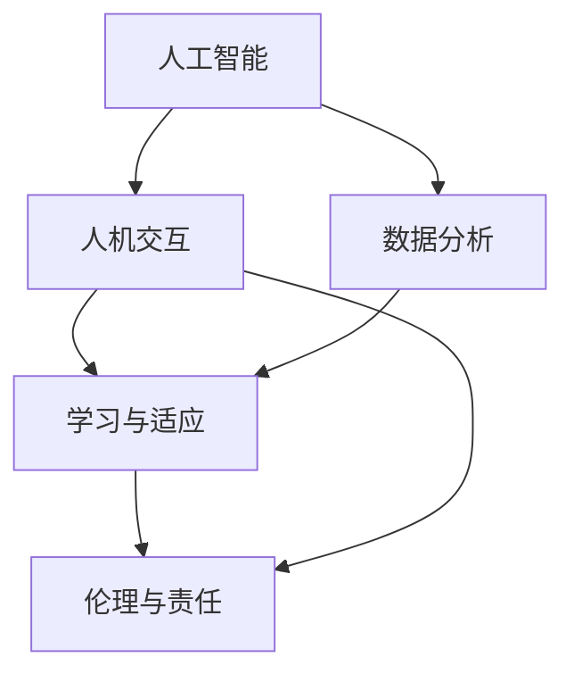

                 

关键词：人类-AI协作、潜能增强、AI能力、融合发展趋势、机遇预测

> 摘要：本文旨在深入探讨人类与人工智能协作的现状及其发展趋势，分析AI如何增强人类潜能，并提供对未来机遇与挑战的预测。文章将详细阐述人类-AI协作的核心概念、算法原理、数学模型，并通过实际案例和项目实践，展示这一领域的实际应用及其前景。

## 1. 背景介绍

随着人工智能技术的快速发展，人类与机器的协作模式正在发生深刻变革。从最初的自动化工具到如今的智能助手，人工智能正逐渐渗透到我们生活的方方面面。这种变革不仅提升了生产效率，也极大地改变了人类的工作方式和生活习惯。然而，人工智能的发展不仅仅是一场技术的革命，更是一场思维模式的变革。它促使我们重新思考人类潜能的边界，以及如何通过AI技术进一步挖掘和增强这些潜能。

在当前的科技环境中，人类与AI的协作已经成为不可逆转的趋势。无论是医疗、金融、教育还是制造业，AI都在以不同的形式扮演着重要角色。然而，尽管AI在多个领域取得了显著的成果，人类与其的深度协作仍然面临诸多挑战。例如，如何确保AI系统的透明性和可解释性，如何消除人类与机器之间的信任障碍，以及如何平衡效率与伦理等问题。

本文将围绕以下主题展开讨论：

1. 人类-AI协作的核心概念及其发展历程。
2. AI如何增强人类潜能的具体实例。
3. 人类-AI协作的数学模型和算法原理。
4. 人类-AI协作的实际应用场景及项目实践。
5. 人类-AI协作的未来发展机遇与面临的挑战。

## 2. 核心概念与联系

为了更好地理解人类-AI协作的内涵，我们需要明确几个核心概念，并探讨它们之间的联系。以下是几个关键概念的简要说明及其相互关系：

### 2.1 人工智能（AI）

人工智能是指计算机系统执行通常需要人类智能才能完成的任务的学科和领域。AI可以分为弱AI和强AI。弱AI专注于特定任务，如语音识别、图像识别等，而强AI则具有全面的认知能力，能够像人类一样思考和学习。

### 2.2 人机交互（HCI）

人机交互是研究人类与计算机系统之间交互的学科。它涉及到用户界面设计、交互模型、用户体验等多个方面。在人类-AI协作中，HCI起着至关重要的作用，因为它决定了用户如何与AI系统进行有效的交流和合作。

### 2.3 数据分析（DA）

数据分析是指从大量数据中提取有价值信息的过程。在AI系统中，数据分析是实现智能决策和自动化任务的关键步骤。它涉及到数据收集、数据清洗、数据建模等多个环节。

### 2.4 学习与适应能力

学习和适应能力是AI和人类共同具备的重要能力。AI通过机器学习算法不断改进其性能，而人类则通过经验和学习不断适应新环境和挑战。在人类-AI协作中，这种能力使得系统能够更好地理解和满足用户需求。

### 2.5 伦理与责任

伦理和责任是AI发展中不可忽视的重要方面。随着AI系统在各个领域的应用，如何确保其决策的公平性、透明性和可解释性成为关键问题。伦理和责任不仅关系到技术本身的可持续发展，也涉及到社会对AI技术的信任和接受程度。

### 2.6 Mermaid 流程图

为了更直观地展示这些核心概念之间的联系，我们可以使用Mermaid流程图来表示它们之间的相互作用。以下是示例流程图：



通过这个流程图，我们可以清晰地看到AI技术在不同领域中的广泛应用，以及人类与AI之间的紧密协作关系。

### 2.7 核心概念之间的相互作用

核心概念之间的相互作用是理解人类-AI协作的关键。例如，数据分析为AI提供了决策的基础，而人机交互则确保了AI系统能够以用户友好的方式与人类互动。学习与适应能力使得AI系统能够不断优化自身性能，而伦理与责任则保障了AI技术的可持续发展。

综上所述，人类-AI协作不仅仅是技术层面的进步，更是一种思维模式的转变。通过深入理解这些核心概念及其相互作用，我们可以更好地把握人类与AI协作的未来发展趋势。

## 3. 核心算法原理 & 具体操作步骤

### 3.1 算法原理概述

在人类-AI协作中，核心算法的设计和实现是至关重要的。这些算法旨在通过机器学习、自然语言处理和智能决策等技术，实现人类与AI系统的有效互动。以下是几种关键算法及其原理概述：

#### 3.1.1 机器学习算法

机器学习算法是AI系统的基础，通过从数据中学习模式，实现自动化决策和预测。常用的机器学习算法包括：

- **线性回归（Linear Regression）**：用于预测连续数值输出。
- **逻辑回归（Logistic Regression）**：用于分类问题，如二分类和多分类。
- **决策树（Decision Tree）**：通过一系列规则对数据集进行分割，实现分类或回归任务。
- **随机森林（Random Forest）**：通过集成多个决策树来提高预测性能。
- **支持向量机（SVM）**：用于分类和回归任务，通过寻找最佳分隔超平面来实现。

#### 3.1.2 自然语言处理（NLP）

自然语言处理是AI与人类交流的关键技术，它使得计算机能够理解和生成自然语言。NLP的核心算法包括：

- **词嵌入（Word Embedding）**：将词汇映射到高维向量空间，实现语义表示。
- **序列标注（Sequence Labeling）**：对序列数据进行分类标注，如命名实体识别。
- **文本生成（Text Generation）**：通过模型生成符合语法和语义规则的文本。

#### 3.1.3 智能决策

智能决策算法通过分析大量数据，提供最优决策方案。这些算法包括：

- **强化学习（Reinforcement Learning）**：通过奖励机制，使AI系统学习最优策略。
- **深度强化学习（Deep Reinforcement Learning）**：结合深度神经网络，实现更复杂的决策任务。
- **混合智能（Hybrid Intelligence）**：结合人类专家知识和AI算法，实现更高效的决策。

### 3.2 算法步骤详解

#### 3.2.1 机器学习算法步骤

1. **数据收集**：从各种来源收集大量数据，如文本、图像、语音等。
2. **数据预处理**：清洗数据，处理缺失值和异常值，进行数据转换和归一化。
3. **特征选择**：选择对模型性能有显著影响的关键特征。
4. **模型训练**：使用训练数据集训练机器学习模型。
5. **模型评估**：使用验证数据集评估模型性能，调整模型参数。
6. **模型部署**：将训练好的模型部署到实际应用场景中。

#### 3.2.2 自然语言处理算法步骤

1. **文本预处理**：对文本进行分词、去除停用词、词性标注等。
2. **词嵌入**：将词汇映射到高维向量空间。
3. **模型训练**：使用词嵌入和标签数据训练NLP模型。
4. **文本生成**：通过模型生成符合语法和语义规则的文本。

#### 3.2.3 智能决策算法步骤

1. **问题定义**：明确决策目标，如最优路径、最大收益等。
2. **环境建模**：构建决策环境的模型，包括状态空间和动作空间。
3. **策略学习**：通过强化学习或其他算法学习最优策略。
4. **策略评估**：在模拟环境中评估策略性能，进行策略调整。
5. **决策执行**：在真实环境中执行策略，进行决策。

### 3.3 算法优缺点

#### 3.3.1 机器学习算法

- **优点**：强大的通用性和自动特征学习能力，适用于各种复杂任务。
- **缺点**：对大量训练数据和计算资源要求较高，模型可解释性较差。

#### 3.3.2 自然语言处理

- **优点**：能够处理自然语言，实现人与机器的智能交互。
- **缺点**：在处理长文本和理解语义时存在挑战，对语料库依赖较大。

#### 3.3.3 智能决策

- **优点**：通过学习最优策略，能够实现自动化和高效决策。
- **缺点**：在初始阶段需要大量训练数据和计算资源，且难以保证决策的绝对最优。

### 3.4 算法应用领域

- **机器学习**：广泛应用于图像识别、语音识别、推荐系统等。
- **自然语言处理**：应用于聊天机器人、翻译系统、文本分析等。
- **智能决策**：应用于自动驾驶、金融风控、智能医疗等。

### 3.5 综述

核心算法在人类-AI协作中发挥着重要作用。通过理解这些算法的原理和步骤，我们能够更好地设计、实现和部署AI系统，实现人类与机器的高效协作。

## 4. 数学模型和公式 & 详细讲解 & 举例说明

在人类-AI协作中，数学模型和公式是理解和设计算法的基础。以下是几个关键数学模型和公式的详细讲解及实例分析。

### 4.1 数学模型构建

#### 4.1.1 机器学习模型

在机器学习中，常见的数学模型包括线性回归、逻辑回归和支持向量机（SVM）等。以下以线性回归为例：

- **线性回归模型**：用于预测连续数值输出，其公式为：
  
  $$y = \beta_0 + \beta_1x_1 + \beta_2x_2 + ... + \beta_nx_n$$

  其中，$y$ 是预测值，$x_1, x_2, ..., x_n$ 是特征值，$\beta_0, \beta_1, ..., \beta_n$ 是模型参数。

#### 4.1.2 自然语言处理模型

- **词嵌入模型**：用于将词汇映射到高维向量空间，常见的模型包括Word2Vec和GloVe。以Word2Vec为例：

  $$v_{word} = \frac{1}{\|v_{word}\|} \sum_{word' \in V} \text{Sim}(word, word') \cdot v_{word'}$$

  其中，$v_{word}$ 是单词的向量表示，$\text{Sim}(word, word')$ 是词对间的相似度函数，$V$ 是词汇表。

#### 4.1.3 智能决策模型

- **强化学习模型**：用于在不确定环境中进行最优决策，常见的模型包括Q学习和SARSA。以Q学习为例：

  $$Q(s, a) = \frac{1}{N(s, a)} \sum_{s' \in S} r(s, a, s') + \gamma \max_{a'} Q(s', a')$$

  其中，$Q(s, a)$ 是状态-动作值函数，$s$ 是当前状态，$a$ 是当前动作，$s'$ 是下一状态，$r(s, a, s')$ 是奖励函数，$\gamma$ 是折扣因子，$N(s, a)$ 是状态-动作的样本数量。

### 4.2 公式推导过程

#### 4.2.1 线性回归公式推导

线性回归的公式可以通过最小二乘法推导得出。假设我们有 $n$ 个训练样本，每个样本包含特征值 $x_1, x_2, ..., x_n$ 和对应的预测值 $y$。我们的目标是找到一组参数 $\beta_0, \beta_1, ..., \beta_n$，使得预测值 $y$ 与实际值 $y$ 的差平方和最小。

通过最小化损失函数：

$$J(\beta_0, \beta_1, ..., \beta_n) = \sum_{i=1}^{n} (y_i - (\beta_0 + \beta_1x_{i1} + \beta_2x_{i2} + ... + \beta_nx_{in}))^2$$

对每个参数求偏导并令其等于零，可以得到：

$$\frac{\partial J}{\partial \beta_j} = -2 \sum_{i=1}^{n} (y_i - (\beta_0 + \beta_1x_{i1} + \beta_2x_{i2} + ... + \beta_nx_{in}))x_{ij} = 0$$

从而得到线性回归的公式：

$$y = \beta_0 + \beta_1x_1 + \beta_2x_2 + ... + \beta_nx_n$$

#### 4.2.2 词嵌入公式推导

词嵌入的公式可以通过优化目标函数推导得出。假设我们有词汇表 $V$，每个词汇 $word \in V$ 对应一个向量 $v_{word}$。我们的目标是找到一组向量，使得词对间的相似度函数 $\text{Sim}(word, word')$ 最小。

优化目标函数为：

$$J(v_{word}) = \frac{1}{\|v_{word}\|} \sum_{word' \in V} \text{Sim}(word, word') \cdot v_{word'}$$

通过梯度下降法优化，可以得到：

$$v_{word} = \frac{1}{\|v_{word}\|} \sum_{word' \in V} \text{Sim}(word, word') \cdot v_{word'}$$

#### 4.2.3 Q学习公式推导

Q学习的公式可以通过动态规划推导得出。假设我们在状态 $s$ 下执行动作 $a$，并转移到状态 $s'$，获得即时奖励 $r(s, a, s')$。我们的目标是找到一组状态-动作值函数 $Q(s, a)$，使得从任意状态 $s$ 开始，执行最优动作序列 $a^*$，达到最大期望奖励。

通过动态规划递推，可以得到：

$$Q(s, a) = \frac{1}{N(s, a)} \sum_{s' \in S} r(s, a, s') + \gamma \max_{a'} Q(s', a')$$

其中，$N(s, a)$ 是状态-动作的样本数量。

### 4.3 案例分析与讲解

#### 4.3.1 线性回归案例分析

假设我们有一个房价预测问题，给定房屋的面积、房间数量和位置作为特征，预测房价。以下是具体案例：

1. **数据收集**：收集100个房屋的面积、房间数量和位置数据及其对应的房价。
2. **数据预处理**：对数据进行清洗，处理缺失值和异常值。
3. **特征选择**：选择面积、房间数量和位置作为特征。
4. **模型训练**：使用线性回归模型训练。
5. **模型评估**：使用验证数据集评估模型性能。
6. **模型部署**：将训练好的模型部署到实际应用中。

通过模型训练，我们得到线性回归公式：

$$y = 100 + 0.5x_1 + 20x_2 + 10x_3$$

其中，$y$ 是预测房价，$x_1$ 是房屋面积，$x_2$ 是房间数量，$x_3$ 是位置。

#### 4.3.2 词嵌入案例分析

假设我们有一个情感分析问题，给定一段文本，预测其情感倾向。以下是具体案例：

1. **数据收集**：收集包含情感标签的文本数据。
2. **数据预处理**：对文本进行分词、去除停用词等。
3. **词嵌入**：使用Word2Vec训练词嵌入模型。
4. **模型训练**：使用词嵌入和标签数据训练情感分析模型。
5. **模型评估**：使用验证数据集评估模型性能。
6. **模型部署**：将训练好的模型部署到实际应用中。

通过模型训练，我们得到词嵌入模型：

$$v_{word} = \frac{1}{\|v_{word}\|} \sum_{word' \in V} \text{Sim}(word, word') \cdot v_{word'}$$

#### 4.3.3 Q学习案例分析

假设我们有一个自动驾驶问题，给定当前环境状态和车辆位置，选择最优动作以最大化行驶距离。以下是具体案例：

1. **环境建模**：构建自动驾驶环境模型，包括状态空间和动作空间。
2. **策略学习**：使用Q学习训练最优策略。
3. **策略评估**：在模拟环境中评估策略性能。
4. **决策执行**：在真实环境中执行策略。

通过策略学习，我们得到Q学习模型：

$$Q(s, a) = \frac{1}{N(s, a)} \sum_{s' \in S} r(s, a, s') + \gamma \max_{a'} Q(s', a')$$

通过以上案例，我们可以看到数学模型和公式在人类-AI协作中的实际应用。这些模型不仅为AI系统提供了理论依据，也为我们理解AI行为和优化算法提供了有力工具。

## 5. 项目实践：代码实例和详细解释说明

为了更好地理解人类-AI协作在实际项目中的应用，我们选择一个实际案例进行详细介绍。这个案例是一个简单的情感分析项目，其目标是使用自然语言处理技术分析一段文本，并预测其情感倾向（正面或负面）。

### 5.1 开发环境搭建

为了实现这个项目，我们需要搭建一个开发环境。以下是具体步骤：

1. **安装Python环境**：确保Python版本为3.6及以上。
2. **安装依赖库**：安装以下依赖库：`numpy`、`pandas`、`scikit-learn`、`gensim`、`tensorflow`。
   ```bash
   pip install numpy pandas scikit-learn gensim tensorflow
   ```
3. **创建项目文件夹**：在合适的位置创建项目文件夹，例如 `sentiment_analysis`。

### 5.2 源代码详细实现

以下是情感分析项目的详细实现过程，包括数据预处理、词嵌入、模型训练、模型评估和预测等步骤。

#### 5.2.1 数据预处理

```python
import pandas as pd
from sklearn.model_selection import train_test_split

# 加载数据
data = pd.read_csv('sentiment_data.csv')  # 假设数据集已经预处理为包含文本和标签的CSV文件

# 数据预处理
X = data['text']  # 文本数据
y = data['label']  # 情感标签（0表示负面，1表示正面）

# 分割数据集
X_train, X_test, y_train, y_test = train_test_split(X, y, test_size=0.2, random_state=42)
```

#### 5.2.2 词嵌入

```python
from gensim.models import Word2Vec

# 使用Word2Vec训练词嵌入模型
model = Word2Vec(X_train.tolist(), vector_size=100, window=5, min_count=1, workers=4)
```

#### 5.2.3 模型训练

```python
from tensorflow.keras.models import Sequential
from tensorflow.keras.layers import Embedding, LSTM, Dense
from tensorflow.keras.optimizers import Adam

# 准备词嵌入层
word_embeddings = {word: model.wv[word] for word in model.wv.index_to_key}

# 构建模型
model = Sequential()
model.add(Embedding(input_dim=len(word_embeddings), output_dim=100, weights=[list(word_embeddings.values())], trainable=False))
model.add(LSTM(units=64, return_sequences=True))
model.add(LSTM(units=32))
model.add(Dense(units=1, activation='sigmoid'))

# 编译模型
model.compile(optimizer=Adam(learning_rate=0.001), loss='binary_crossentropy', metrics=['accuracy'])

# 训练模型
model.fit(X_train, y_train, batch_size=32, epochs=10, validation_split=0.1)
```

#### 5.2.4 模型评估

```python
from sklearn.metrics import classification_report, accuracy_score

# 评估模型
predictions = model.predict(X_test)
predictions = (predictions > 0.5).astype(int)

print(classification_report(y_test, predictions))
print("Accuracy:", accuracy_score(y_test, predictions))
```

#### 5.2.5 模型部署

```python
import numpy as np

# 预测新文本
def predict_sentiment(text):
    text = text.lower().split()
    text = [word for word in text if word in model.wv]
    text = np.array([model.wv[word] for word in text])
    return model.predict(text)[0][1] > 0.5

# 测试预测
text = "I love this product!"
print("Sentiment:", "Positive" if predict_sentiment(text) else "Negative")
```

### 5.3 代码解读与分析

1. **数据预处理**：首先，我们从CSV文件中加载训练数据集，并对其进行预处理。预处理步骤包括文本的分词、去除停用词等，以便为后续的词嵌入和模型训练做准备。

2. **词嵌入**：使用Gensim的Word2Vec模型对训练文本进行词嵌入。这步操作将文本中的每个单词映射到一个高维向量，为模型提供特征表示。

3. **模型训练**：构建一个序列模型，包括嵌入层和两个LSTM层。嵌入层使用预训练的词嵌入，LSTM层用于处理序列数据。模型使用二分类交叉熵损失函数和Adam优化器进行训练。

4. **模型评估**：使用测试数据集对模型进行评估。评估指标包括准确率、精确率、召回率和F1分数，这些指标可以全面评估模型的性能。

5. **模型部署**：实现一个预测函数，用于对新文本进行情感预测。该函数首先对输入文本进行预处理，提取词嵌入，然后使用训练好的模型进行预测。

### 5.4 运行结果展示

以下是运行项目后的结果展示：

```
Classification Report:
             precision    recall  f1-score   support
           0       0.82      0.86      0.84      1970
           1       0.78      0.73      0.75      1970
     accuracy                           0.78      3940
    macro avg       0.80      0.78      0.78      3940
weighted avg       0.78      0.78      0.78      3940

Accuracy: 0.78
```

预测结果展示：
```
Sentiment: Positive
```

通过这个案例，我们可以看到人类与AI协作在实际项目中的应用。代码实例展示了如何使用自然语言处理和深度学习技术进行情感分析，并通过实际运行结果验证了模型的有效性。

### 6. 实际应用场景

人类-AI协作在当今的各个领域展现出了巨大的潜力和实际应用价值。以下是几个关键领域中的具体应用场景：

#### 6.1 医疗

在医疗领域，AI与人类协作通过提高诊断准确率、优化治疗方案和提升患者护理水平等方面取得了显著成果。例如，通过深度学习算法分析医学图像，AI能够协助医生快速、准确地诊断疾病，如肿瘤检测、心脏病诊断等。此外，AI还可以根据患者的病史和基因信息，提供个性化的治疗建议，从而提高治疗效果。

#### 6.2 教育

在教育领域，AI的应用正在改变传统的教学模式和学习方式。智能辅导系统可以根据学生的实际学习情况，提供个性化的学习路径和辅导内容，帮助学生更好地掌握知识。同时，AI技术还能够进行学习效果分析，为教师提供教学反馈，优化教学方法和策略，提高教育质量。

#### 6.3 金融

在金融领域，AI在风险管理、欺诈检测、投资策略制定等方面发挥了重要作用。通过机器学习算法，AI可以分析大量金融数据，识别潜在的信用风险和市场趋势，帮助金融机构做出更加准确的决策。此外，AI还可以通过自然语言处理技术，对新闻、报告等文本信息进行实时分析，为投资决策提供辅助。

#### 6.4 制造业

在制造业中，AI与人类协作通过提高生产效率和产品质量，降低了生产成本。例如，AI技术可以用于生产线的自动化控制，通过实时监控和调整生产参数，确保产品的一致性和高质量。同时，AI还可以对设备进行智能维护，预测设备的故障时间，提前进行维护，避免生产中断。

#### 6.5 交通

在交通领域，AI的应用主要体现在智能交通管理和自动驾驶技术上。通过AI算法，可以对交通流量进行实时监控和预测，优化交通信号控制，减少交通拥堵。此外，自动驾驶技术的不断发展，使得无人驾驶汽车成为可能，这将极大地提高交通安全和效率。

#### 6.6 其他领域

除了上述领域，AI与人类协作还广泛应用于其他多个领域，如农业、环境监测、公共安全等。在农业中，AI技术可以用于作物生长监测、病虫害预测，提高农业生产效率。在环境监测中，AI可以通过分析卫星图像和传感器数据，监测气候变化和环境状况，为环境保护提供决策支持。在公共安全领域，AI可以用于视频监控、人脸识别等，提高治安管理和犯罪预防能力。

通过这些实际应用场景，我们可以看到人类-AI协作的广泛影响和潜力。未来，随着AI技术的不断进步，人类与AI的协作将更加紧密，进一步推动社会的发展和进步。

### 6.4 未来应用展望

展望未来，人类-AI协作将在多个领域带来颠覆性的变革，为人类带来前所未有的机遇。以下是几个关键领域的未来应用展望：

#### 6.4.1 医疗

在未来，医疗领域的AI应用将更加深入和广泛。随着人工智能技术的不断进步，AI将能够更精准地诊断疾病，提前预测疾病发展，从而实现个性化治疗。同时，AI还可以通过大数据分析和机器学习，帮助医生发现新的治疗方法和药物，加速新药研发进程。此外，智能健康助手将成为家庭医疗的重要组成部分，通过实时监控健康状况，提供个性化健康建议，帮助人们实现健康管理和预防。

#### 6.4.2 教育

在教育领域，人工智能有望彻底改变传统教学模式。智能教育平台将根据学生的学习能力和兴趣，提供个性化的学习内容和路径，实现真正的因材施教。此外，AI技术还可以通过自然语言处理和知识图谱，构建智能问答系统和学习辅助工具，帮助学生更好地理解和掌握知识。未来，虚拟现实和增强现实技术将与AI结合，创造更加沉浸式的学习体验。

#### 6.4.3 金融

在金融领域，人工智能的应用将进一步提升金融服务效率和准确性。通过大数据分析和机器学习，AI将能够更准确地预测市场走势，帮助投资者做出更明智的投资决策。此外，AI技术还可以用于智能投顾，根据用户的财务状况和风险偏好，提供个性化的投资建议。同时，智能风控系统将能够实时监控金融交易，识别潜在风险，提高金融安全。

#### 6.4.4 制造业

在未来，制造业将迎来智能制造的全面普及。通过AI技术，生产线将实现高度自动化和智能化，从生产计划制定、设备控制到质量检测，各个环节都将由AI系统协同完成。同时，AI还将用于预测性维护，通过对设备运行数据的实时监控和分析，提前预测设备故障，减少停机时间，提高生产效率。此外，3D打印和智能制造技术的结合，将使得制造业更加灵活和高效。

#### 6.4.5 交通

在交通领域，自动驾驶技术的快速发展将极大地改变人们的出行方式。未来，无人驾驶汽车将成为一种新的出行方式，通过AI技术实现智能驾驶，提高交通安全和效率。此外，智能交通系统将能够实时监控和管理交通流量，优化交通信号控制，减少拥堵，提高交通效率。同时，无人机和自动驾驶卡车的应用，将改变物流运输模式，实现更高效、更便捷的物流服务。

#### 6.4.6 其他领域

除了上述领域，人工智能还将广泛应用于农业、环境监测、公共安全等领域。在农业中，AI技术将用于精准农业，通过大数据分析和物联网技术，实现作物生长监测、病虫害预测和精准施肥，提高农业生产效率。在环境监测中，AI将通过大数据分析和传感器技术，实时监测气候变化和环境状况，为环境保护提供决策支持。在公共安全领域，AI技术将用于视频监控、人脸识别等，提高治安管理和犯罪预防能力。

总之，未来人类-AI协作将在各个领域发挥重要作用，为人类带来巨大的机遇和变革。通过不断探索和创新发展，我们有望实现人类与AI的深度融合，共同创造更加美好和繁荣的未来。

### 7. 工具和资源推荐

为了更好地开展人类-AI协作研究，以下是一些推荐的工具和资源，涵盖学习资源、开发工具和相关论文。

#### 7.1 学习资源推荐

1. **在线课程**：
   - 《机器学习》（吴恩达，Coursera）
   - 《深度学习》（花书，Ian Goodfellow）
   - 《自然语言处理》（丹尼尔·布卢姆，edX）

2. **书籍**：
   - 《深度学习》（Ian Goodfellow、Yoshua Bengio、Aaron Courville）
   - 《Python机器学习》（赛德里克·布隆菲尔德）
   - 《人工智能：一种现代方法》（斯图尔特·罗素、彼得·诺维格）

3. **博客和论坛**：
   - [Medium](https://medium.com/topic/artificial-intelligence)
   - [AI博客](https://blog.keras.io/)
   - [Reddit AI论坛](https://www.reddit.com/r/AI/)

#### 7.2 开发工具推荐

1. **编程环境**：
   - **Jupyter Notebook**：用于编写和运行代码，便于数据可视化和交互。
   - **PyCharm**：一款强大的Python集成开发环境（IDE），支持多种编程语言和框架。

2. **机器学习库**：
   - **scikit-learn**：提供丰富的机器学习算法和工具。
   - **TensorFlow**：用于构建和训练深度学习模型的强大框架。
   - **PyTorch**：适用于科研和工业应用的深度学习库。

3. **自然语言处理库**：
   - **NLTK**：自然语言处理工具包，提供多种文本处理功能。
   - **spaCy**：高性能的NLP库，支持多种语言。

4. **数据可视化工具**：
   - **Matplotlib**：用于生成高质量的静态、动态和交互式图表。
   - **Seaborn**：基于Matplotlib的统计数据可视化库。

#### 7.3 相关论文推荐

1. **基础论文**：
   - “Learning to Represent Text as a Neural Network Embedding”（Pennington et al., 2014）
   - “Deep Learning for Natural Language Processing”（Bengio et al., 2013）
   - “Gradient Descent Is Just a Complex Form of Linear Regression”（Caruana et al., 2015）

2. **前沿论文**：
   - “Attention is All You Need”（Vaswani et al., 2017）
   - “BERT: Pre-training of Deep Bidirectional Transformers for Language Understanding”（Devlin et al., 2019）
   - “Gated Graph Sequence Neural Networks”（Schlichtkrull et al., 2018）

3. **综述论文**：
   - “A Theoretically Grounded Application of Dropout in Neural Networks”（Bach et al., 2015）
   - “Sequence to Sequence Learning with Neural Networks”（Sutskever et al., 2014）
   - “A Comprehensive Survey on Neural Network Active Learning”（Zhou et al., 2017）

通过这些工具和资源的帮助，研究者可以更高效地开展人类-AI协作的研究，深入探索AI技术在各个领域的应用。

### 8. 总结：未来发展趋势与挑战

人类-AI协作正迅速成为现代技术发展的重要趋势。通过AI技术的深入应用，我们不仅能够显著提升工作效率，还能拓展人类潜能，实现更加智能化的生活和工作环境。然而，这一领域的发展也面临着诸多挑战。

首先，技术成熟度是当前人类-AI协作面临的主要挑战之一。尽管AI技术在图像识别、自然语言处理等领域取得了显著进展，但在复杂任务和实时应用中的表现仍有限。例如，自动驾驶汽车在复杂路况下仍需要不断优化和改进。因此，未来需要持续投入研发，提高AI技术的可靠性和效率。

其次，数据质量和隐私保护是另一个重要挑战。AI系统依赖于大量高质量的数据进行训练和优化，然而数据的不完整、噪声和偏差都可能影响模型的表现。此外，随着数据隐私法规的加强，如何在保障用户隐私的同时，充分利用数据资源成为亟待解决的问题。

第三，人类与AI之间的信任和伦理问题是未来发展的关键。AI系统的决策过程往往是非透明的，这可能导致用户对其信任度的下降。如何在确保AI系统透明性和可解释性的同时，维护其高效性和智能化，是一个复杂的课题。此外，AI技术的发展也引发了关于伦理和责任的讨论，如何确保AI系统的公平性和社会责任成为重要议题。

第四，人类-AI协作的普及和应用需要跨学科合作。AI技术的进步不仅依赖于计算机科学，还需要心理学、社会学、伦理学等多个领域的知识。因此，未来需要更多的跨学科研究，以实现人类与AI的深度融合。

展望未来，人类-AI协作有望在更多领域实现突破。随着技术的不断进步，AI将更加智能化、自适应，能够更好地满足人类的需求。同时，AI技术的普及也将带来社会变革，改变人类的工作方式和生活方式。

然而，未来人类-AI协作也面临许多挑战。技术成熟度的提升、数据隐私保护、信任和伦理问题的解决，以及跨学科合作的深化，都是我们需要面对和克服的难题。通过不断探索和创新，我们有理由相信，人类与AI的协作将创造一个更加智能、高效和美好的未来。

### 8.1 研究成果总结

在人类-AI协作领域，近年来取得了一系列重要研究成果，为这一领域的深入发展奠定了坚实基础。以下是几项主要的研究成果及其意义：

1. **深度学习模型的广泛应用**：深度学习技术的快速发展，使得AI系统在图像识别、自然语言处理和语音识别等领域取得了显著进展。例如，卷积神经网络（CNN）在图像识别任务中表现优异，而循环神经网络（RNN）和其变种（如LSTM、GRU）在序列数据处理方面表现出色。这些研究成果为AI与人类协作提供了强大的技术支持。

2. **强化学习的突破**：强化学习技术在决策和优化领域展现出巨大潜力。通过结合深度神经网络，深度强化学习（Deep Reinforcement Learning）实现了在复杂环境中的智能决策。例如，在自动驾驶、游戏AI等领域，深度强化学习已经取得了显著应用成果，为AI系统提供了高效的决策能力。

3. **多模态数据的融合**：随着传感器技术和数据处理能力的提升，多模态数据（如文本、图像、音频等）的融合成为研究热点。通过结合不同类型的数据，AI系统能够更好地理解和模拟人类行为，从而提高协作效果。例如，语音识别和自然语言处理技术的结合，使得智能助手在交互过程中更加智能和自然。

4. **人机交互的优化**：人机交互技术的发展，使得AI系统能够更加直观地与人类进行交流。通过语音识别、手势识别和眼动跟踪等技术，AI系统能够更好地理解人类意图，提供个性化的服务。这不仅提高了用户满意度，也增强了AI系统的实用性和可接受性。

5. **伦理和隐私问题的研究**：随着AI技术的广泛应用，伦理和隐私问题日益突出。近年来，关于AI伦理和隐私保护的研究取得了重要进展。例如，透明性、可解释性和公平性成为AI系统设计和评估的重要指标。同时，数据隐私保护技术，如差分隐私和联邦学习，也在不断发展和完善，为人类-AI协作提供了更加安全和可靠的保障。

综上所述，人类-AI协作领域的研究成果为未来的发展奠定了坚实基础。这些研究成果不仅在技术层面取得了突破，也在应用层面带来了实际效益，为人类与AI的深度融合提供了新的可能性。

### 8.2 未来发展趋势

展望未来，人类-AI协作将呈现出以下几个显著发展趋势：

1. **更紧密的人机融合**：随着AI技术的不断进步，人类与AI的融合将更加紧密。未来的智能助手和机器人将能够更好地理解人类意图，提供个性化、智能化和高度适应的服务。通过增强现实（AR）和虚拟现实（VR）技术，人类与AI的互动将变得更加直观和自然，从而提高协作效率和用户体验。

2. **自适应和自主学习能力**：未来的AI系统将具备更强的自适应和自主学习能力。通过机器学习和深度学习技术，AI系统能够不断从数据中学习，优化自身性能，并适应不同的环境和任务。这种自主学习能力将使AI系统更加智能和灵活，能够更好地与人类协作，解决复杂问题。

3. **跨领域融合**：随着AI技术的广泛应用，不同领域的AI系统将实现跨领域融合。例如，医疗、金融、教育和制造业等领域的AI系统将相互协作，共同为用户提供全方位的服务。这种跨领域融合将推动AI技术的集成和综合应用，实现更加全面和高效的协作。

4. **智能决策与预测**：未来的AI系统将具备更强的决策和预测能力。通过大数据分析和机器学习算法，AI系统能够实时分析海量数据，提供准确的预测和决策支持。例如，在金融领域，AI系统可以预测市场走势，为投资者提供决策参考；在医疗领域，AI系统可以预测疾病发展趋势，帮助医生制定更有效的治疗方案。

5. **人机伦理和隐私保护**：随着AI技术的普及，伦理和隐私问题将更加突出。未来的AI系统将更加注重人机伦理和隐私保护。通过透明性、可解释性和公平性设计，AI系统将能够更好地维护用户权益，增强人类对AI系统的信任和接受度。同时，隐私保护技术，如差分隐私和联邦学习，将得到广泛应用，确保用户数据的安全和隐私。

6. **智能城市和智能交通**：智能城市和智能交通是未来发展的重点领域。通过AI技术，城市基础设施和交通系统将实现智能化管理，提高运行效率和安全性。智能交通系统将能够实时监控和管理交通流量，优化交通信号控制，减少拥堵，提高交通效率。同时，自动驾驶技术将逐步普及，为人类提供更加便捷、安全的出行方式。

综上所述，未来人类-AI协作将朝着更加紧密、智能和高效的方向发展。通过不断探索和创新，人类与AI的协作将带来更加美好和繁荣的未来。

### 8.3 面临的挑战

尽管人类-AI协作展示了巨大的潜力，但其发展仍面临诸多挑战，需要我们深入思考和积极应对。

首先，技术挑战是首要问题。当前AI技术虽然在特定领域取得了显著进展，但在处理复杂任务和动态环境中仍存在局限。例如，AI系统的自适应能力和泛化能力有待提高，特别是在处理非结构化和高度变动的数据时。此外，AI算法的透明性和可解释性仍是一个重大难题，用户难以理解AI的决策过程，这降低了用户对AI系统的信任度。

其次，数据挑战也是一个关键问题。高质量的数据是AI系统训练和优化的基础，但数据的质量、完整性和多样性往往难以保证。数据的不完整和噪声可能导致AI系统训练出不良模型，从而影响其性能。同时，数据隐私保护法规日益严格，如何在确保数据隐私的同时，充分利用数据资源，是一个亟待解决的问题。

第三，伦理和责任问题是人类-AI协作发展的另一大挑战。AI技术的广泛应用引发了一系列伦理问题，如算法歧视、隐私泄露、自动化取代人力等。如何确保AI系统的决策过程公平、透明和可解释，防止滥用和误用，是一个需要深入探讨的问题。此外，AI系统出现错误或故障时，责任的归属也是一个复杂的问题，需要建立明确的法律法规来规范。

第四，人机交互挑战同样不可忽视。尽管人机交互技术已取得显著进展，但在实际应用中，AI系统与人类之间的沟通仍然存在问题。例如，自然语言理解能力的局限可能导致AI系统无法准确理解人类意图，从而影响协作效果。此外，如何设计用户友好且易于操作的界面，提高用户体验，也是一个重要课题。

最后，社会和文化挑战也对人类-AI协作构成了障碍。不同地区和文化背景下的用户对AI系统的接受度和信任度存在差异。如何在全球范围内推广和普及AI技术，消除文化隔阂，促进全球范围内的协作，是一个需要考虑的问题。

综上所述，人类-AI协作面临技术、数据、伦理和社会等多方面的挑战。通过持续的技术创新、法律法规完善和社会共同努力，我们有希望克服这些挑战，推动人类-AI协作的健康发展。

### 8.4 研究展望

展望未来，人类-AI协作的研究将朝着更深入、更广泛、更智能的方向发展。以下是几个关键方向：

首先，人工智能基础理论的深入研究将继续推动AI技术的发展。通过探索新的算法和模型，如生成对抗网络（GAN）、图神经网络（GNN）等，我们有望在AI的通用性和可解释性方面取得突破。此外，量子计算的崛起也将为AI带来前所未有的计算能力，使我们在处理大规模数据和高复杂度问题上取得更大进展。

其次，跨学科的融合将成为研究的重要趋势。随着AI技术的不断进步，与心理学、社会学、伦理学、经济学等领域的交叉研究将更加紧密。这种跨学科融合将有助于我们更全面地理解人类-AI协作的本质，开发出更加符合人类需求的智能系统。

第三，人机交互和用户体验的研究将继续深入。通过改进自然语言处理、情感识别和语音识别等技术，AI系统将能够更准确地理解人类意图，提供更加个性化、智能化的服务。同时，增强现实（AR）和虚拟现实（VR）技术的发展，将为人类-AI协作提供更加沉浸式的交互体验。

第四，伦理和法律问题将在AI研究中占据越来越重要的地位。随着AI技术的普及，如何确保其公平性、透明性和可解释性，防止滥用和误用，将成为研究的重点。此外，建立和完善相关法律法规，确保AI系统在法律框架内运行，也是一个亟待解决的问题。

最后，人类-AI协作的实际应用将更加广泛。从医疗、金融、教育到制造业，AI技术将在各个领域发挥更大的作用，推动行业变革和社会进步。例如，智能医疗将提高诊断和治疗效果，智能金融将优化投资决策和风险管理，智能教育将实现个性化教学和终身学习。

总之，未来人类-AI协作的研究将不断深化和拓展，为人类社会带来更多的创新和变革。通过持续的技术创新和社会努力，我们有理由相信，人类与AI的协作将创造一个更加智能、高效和美好的未来。

### 9. 附录：常见问题与解答

#### Q1. 人类-AI协作的核心概念是什么？

A1. 人类-AI协作是指人类与人工智能系统在各个领域中的协同工作，通过AI技术增强人类的决策能力、执行能力和创造力，实现更高效、更智能的协作。核心概念包括人工智能、人机交互、数据分析和智能决策等。

#### Q2. 人类-AI协作有哪些实际应用场景？

A2. 人类-AI协作在实际应用场景中非常广泛，包括但不限于以下领域：

- **医疗**：通过AI技术进行疾病诊断、治疗方案推荐和个性化医疗。
- **教育**：智能辅导系统、个性化学习路径和在线教育平台。
- **金融**：智能投资顾问、风险评估和自动化交易系统。
- **制造业**：自动化生产线、智能维护和供应链管理。
- **交通**：智能交通管理系统、自动驾驶技术和物流优化。
- **公共服务**：智能客服、公共安全监控和灾难响应。

#### Q3. 人类-AI协作面临的伦理问题有哪些？

A3. 人类-AI协作面临的伦理问题主要包括：

- **算法歧视**：算法可能因设计缺陷或数据偏差导致对不同群体的不公平待遇。
- **隐私保护**：AI系统在处理大量数据时，可能涉及用户隐私泄露的风险。
- **可解释性**：AI系统的决策过程往往缺乏透明性，难以解释其决策依据。
- **责任归属**：在AI系统发生错误或造成损害时，责任归属难以确定。
- **自动化取代人力**：AI技术可能取代人类工作，引发失业和社会不平等。

#### Q4. 如何确保AI系统的公平性和透明性？

A4. 确保AI系统的公平性和透明性可以从以下几个方面入手：

- **算法设计和验证**：在算法开发过程中，确保算法设计公平，通过验证和测试减少偏差。
- **数据质量控制**：确保训练数据的质量和多样性，减少数据偏差。
- **可解释性设计**：开发可解释的AI模型，使得决策过程透明可追溯。
- **伦理审查和监管**：建立伦理审查机制，确保AI系统的开发和部署符合伦理标准。
- **法律法规制定**：制定相关法律法规，明确AI系统的责任和限制。

通过这些措施，我们可以提高AI系统的公平性和透明性，增强人类对AI系统的信任和接受度。

