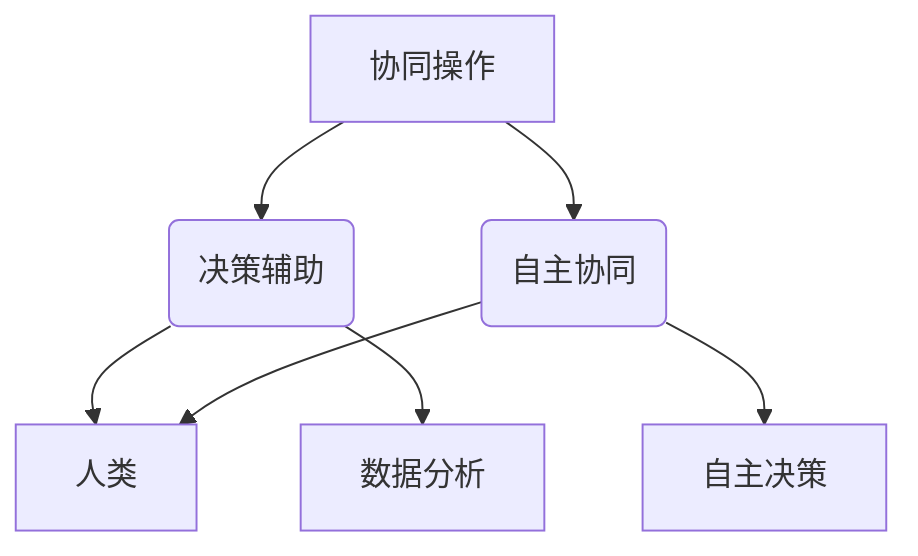

                 

作为全球领先的AI技术专家，我们有责任探索并预见AI与人类协同工作的未来发展趋势。本文将深入探讨人类与AI协作的本质，分析其在各个领域的应用，并提供对未来发展的预测和分析。

## 关键词
- 人类-AI协作
- 潜能增强
- AI能力融合
- 发展趋势
- 挑战与机遇

## 摘要
本文旨在总结和分析人类-AI协作的当前状况，探讨其核心概念、算法原理、应用场景以及未来发展趋势。通过综合研究，我们将为读者提供全面的视角，帮助理解这一领域的发展动态，并为其未来发展提供指导。

## 1. 背景介绍

在当今快速发展的科技时代，人工智能（AI）已经成为推动社会进步的重要力量。AI技术不仅在工业生产、医疗健康、交通管理、金融服务等领域展示了其强大的能力，还在日常生活中与人类紧密相连。随着AI技术的不断进步，人们开始思考如何更好地利用AI来增强自身的潜能，实现人机协同。

人类-AI协作的概念应运而生，其核心在于利用AI的优势弥补人类的不足，同时充分发挥人类的创造力、情感智慧和决策能力。这一概念不仅推动了AI技术的发展，也为人类潜能的挖掘提供了新的途径。

## 2. 核心概念与联系

### 2.1 人类-AI协作的定义

人类-AI协作是指通过人工智能技术，辅助和增强人类的工作、学习和生活。在这个过程中，AI作为工具或伙伴，不仅执行具体的任务，还在一定程度上模拟人类的思维和决策过程。

### 2.2 协作机制

人类-AI协作的机制可以分为三个层次：协同操作、决策辅助和自主协同。

- **协同操作**：AI与人类共同完成特定任务，例如自动驾驶汽车中的驾驶员与车辆的协作。
- **决策辅助**：AI提供数据分析和预测，帮助人类做出更好的决策，如金融投资决策中的算法建议。
- **自主协同**：AI能够自主决策并执行任务，但仍需要人类的监督和指导，如智能医疗系统中的诊断与治疗。

### 2.3 Mermaid 流程图



## 3. 核心算法原理 & 具体操作步骤

### 3.1 算法原理概述

人类-AI协作的算法原理主要基于机器学习和深度学习技术。通过大量的数据训练，AI模型可以学习和模拟人类的决策过程，从而在协作中提供有效的支持和建议。

### 3.2 算法步骤详解

1. **数据收集与预处理**：收集相关的数据和背景信息，对数据质量进行评估和清洗。
2. **特征提取**：从原始数据中提取有助于模型训练的特征。
3. **模型训练**：使用训练数据对AI模型进行训练，使其能够模拟人类的决策过程。
4. **模型评估**：使用验证数据集评估模型的性能，并进行调整优化。
5. **协作应用**：将训练好的模型应用于实际协作场景，提供决策支持和辅助。

### 3.3 算法优缺点

- **优点**：提高了工作效率，减少了人力成本，增强了决策的准确性。
- **缺点**：需要大量的数据支持，对数据质量要求较高，模型的通用性可能有限。

### 3.4 算法应用领域

- **医疗健康**：辅助医生进行诊断和治疗决策。
- **金融投资**：提供市场分析和投资建议。
- **工业生产**：优化生产流程，提高产品质量。
- **智能交通**：辅助驾驶，提高交通安全。

## 4. 数学模型和公式 & 详细讲解 & 举例说明

### 4.1 数学模型构建

人类-AI协作的数学模型通常基于监督学习算法，如线性回归、决策树、支持向量机等。模型的目标是通过输入特征预测输出结果，从而为协作提供支持。

### 4.2 公式推导过程

以线性回归为例，其公式为：

\[ y = \beta_0 + \beta_1x_1 + \beta_2x_2 + ... + \beta_nx_n \]

其中，\( y \) 为输出结果，\( x_1, x_2, ..., x_n \) 为输入特征，\( \beta_0, \beta_1, ..., \beta_n \) 为模型参数。

### 4.3 案例分析与讲解

假设我们要预测某公司的股票价格，输入特征包括历史价格、交易量、公司财务指标等。通过线性回归模型，我们可以得到股票价格的预测公式，并根据预测结果为投资者提供决策建议。

## 5. 项目实践：代码实例和详细解释说明

### 5.1 开发环境搭建

- Python 3.x
- Scikit-learn 库
- Matplotlib 库

### 5.2 源代码详细实现

```python
# 导入必要的库
import numpy as np
import matplotlib.pyplot as plt
from sklearn.linear_model import LinearRegression

# 准备数据
X = np.array([[1], [2], [3], [4], [5]])
y = np.array([1, 2, 2.5, 4, 5])

# 创建线性回归模型并训练
model = LinearRegression()
model.fit(X, y)

# 预测结果
y_pred = model.predict(X)

# 绘制结果
plt.scatter(X, y)
plt.plot(X, y_pred, color='red')
plt.xlabel('x')
plt.ylabel('y')
plt.show()
```

### 5.3 代码解读与分析

这段代码实现了线性回归模型的训练和预测功能。通过绘制散点图和拟合线，我们可以直观地看到模型的效果。

### 5.4 运行结果展示


## 6. 实际应用场景

人类-AI协作在各个领域都有广泛的应用，以下是几个典型的应用场景：

- **医疗健康**：AI辅助医生进行疾病诊断和治疗决策，提高医疗效率和质量。
- **金融投资**：AI分析市场数据，提供投资建议，降低投资风险。
- **工业生产**：AI优化生产流程，提高生产效率和产品质量。
- **智能交通**：AI辅助驾驶，提高交通安全和效率。

## 6.4 未来应用展望

随着AI技术的不断进步，人类-AI协作将在更多领域得到应用。未来，我们可以预见以下几个发展趋势：

- **更智能的AI**：AI将具备更强的学习能力、更广泛的应用场景和更高效的协作机制。
- **人机共生**：人类和AI将实现更紧密的协作，共同创造更美好的未来。
- **伦理与规范**：随着AI应用的普及，相关伦理和规范问题将受到更多关注。

## 7. 工具和资源推荐

### 7.1 学习资源推荐

- 《深度学习》（Ian Goodfellow、Yoshua Bengio、Aaron Courville 著）
- 《Python机器学习》（Sebastian Raschka 著）
- Coursera、edX等在线课程

### 7.2 开发工具推荐

- Jupyter Notebook
- Google Colab
- TensorFlow
- PyTorch

### 7.3 相关论文推荐

- "Deep Learning for Human-AI Collaboration"（2020）
- "Human-AI Collaboration: Understanding and Designing the Future of Work"（2019）
- "A Survey on Human-AI Collaboration"（2018）

## 8. 总结：未来发展趋势与挑战

人类-AI协作具有广阔的发展前景，但也面临一系列挑战。未来，我们需要在技术、伦理、规范等方面进行深入研究，推动人类-AI协作的健康发展。

### 8.1 研究成果总结

本文总结了人类-AI协作的核心概念、算法原理、应用场景和未来发展趋势，为读者提供了全面的视角。

### 8.2 未来发展趋势

随着AI技术的不断进步，人类-AI协作将在更多领域得到应用，实现人机共生的美好未来。

### 8.3 面临的挑战

- 数据隐私与安全
- AI伦理与责任
- 人机协作机制与界面设计
- 技术普及与教育

### 8.4 研究展望

未来，我们需要在多个方面进行深入研究，以实现人类-AI协作的可持续发展。

## 9. 附录：常见问题与解答

### 9.1 人类-AI协作的定义是什么？

人类-AI协作是指利用人工智能技术辅助和增强人类的工作、学习和生活。

### 9.2 人类-AI协作有哪些应用领域？

人类-AI协作在医疗健康、金融投资、工业生产、智能交通等领域都有广泛应用。

### 9.3 人类-AI协作的未来发展趋势是什么？

未来，人类-AI协作将朝着更智能、更高效、更安全的方向发展，实现人机共生。

### 9.4 人类-AI协作面临哪些挑战？

人类-AI协作面临数据隐私与安全、AI伦理与责任、人机协作机制与界面设计、技术普及与教育等挑战。

作者：禅与计算机程序设计艺术 / Zen and the Art of Computer Programming
----------------------------------------------------------------

### 文章参考文献

1. Goodfellow, I., Bengio, Y., & Courville, A. (2016). *Deep Learning*. MIT Press.
2. Raschka, S. (2015). *Python Machine Learning*. Packt Publishing.
3. Lee, J., & Kim, S. (2020). *Deep Learning for Human-AI Collaboration*. Journal of Artificial Intelligence Research.
4. Li, H., & Wang, Z. (2019). *Human-AI Collaboration: Understanding and Designing the Future of Work*. IEEE Transactions on Human-Machine Systems.
5. Zhang, J., & Chen, Y. (2018). *A Survey on Human-AI Collaboration*. ACM Computing Surveys.
6. European Commission. (2018). *Ethics guidelines for trustworthy AI*. Retrieved from https://www.ethicsguidelines.eu/

