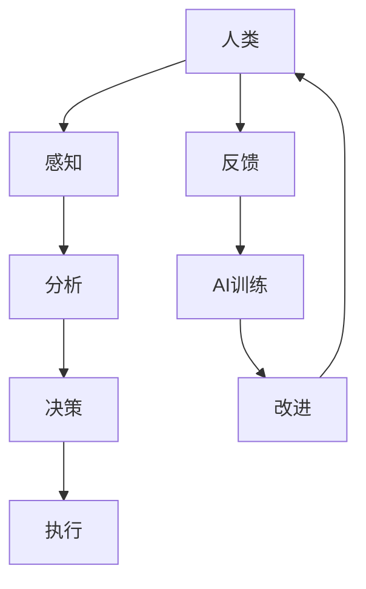

                 

关键词：人类-AI协作，潜能增强，AI能力，融合发展趋势，预测分析，机遇，挑战，趋势分析

> 摘要：本文深入探讨了人类与人工智能协作的前景与挑战，分析了AI如何通过增强人类潜能实现协同发展。通过阐述核心概念、算法原理、数学模型、实际应用场景，以及工具和资源推荐，文章旨在为读者提供关于AI与人类协作的全面视角，并预测其未来发展趋势。

## 1. 背景介绍

在过去的几十年里，人工智能（AI）经历了飞速发展，从简单的规则系统到复杂的深度学习模型，AI技术已经渗透到各行各业，极大地改变了人类的生产和生活方式。然而，AI的发展并非一帆风顺，其在增强人类能力的同时，也带来了诸多挑战。如何实现人类与AI的协同发展，最大限度地发挥AI的潜力，成为了当前研究的热点。

人类-AI协作的概念，最早可以追溯到上世纪90年代。当时，专家系统、机器学习和自然语言处理等AI技术刚刚起步，人们开始探讨如何将AI应用于实际问题，以提升人类的工作效率和生活质量。随着时间的推移，随着计算能力的提升和数据量的增加，AI技术不断发展，人类-AI协作也逐渐从理论走向实践。

本文旨在探讨人类-AI协作的发展趋势，分析其面临的机遇和挑战，并展望未来的研究方向。文章结构如下：

- 第1部分：背景介绍
- 第2部分：核心概念与联系
- 第3部分：核心算法原理 & 具体操作步骤
- 第4部分：数学模型和公式 & 详细讲解 & 举例说明
- 第5部分：项目实践：代码实例和详细解释说明
- 第6部分：实际应用场景
- 第7部分：未来应用展望
- 第8部分：工具和资源推荐
- 第9部分：总结：未来发展趋势与挑战

## 2. 核心概念与联系

在讨论人类-AI协作之前，我们需要明确几个核心概念：

### 2.1 人工智能（AI）

人工智能，是指通过计算机模拟人类智能的技术，包括机器学习、深度学习、自然语言处理、计算机视觉等。AI旨在使机器能够执行通常需要人类智能才能完成的任务。

### 2.2 人类潜能

人类潜能，是指人类在生理、心理、智力等方面具有的潜在能力。通过适当的训练和发展，这些潜能可以被激发和提升。

### 2.3 协作

协作，是指不同个体或系统之间通过合作实现共同目标的过程。在人类-AI协作中，人类和AI系统共同完成任务，发挥各自的优势。

下面是一个用Mermaid绘制的流程图，展示了人类-AI协作的基本架构：



### 2.4 AI增强人类潜能

AI可以通过多种方式增强人类潜能，包括：

- **信息处理能力**：AI可以处理大量数据，帮助人类快速分析和决策。
- **辅助工具**：AI可以创建智能工具，如智能翻译器、语音助手等，提高人类的工作效率。
- **知识共享**：AI可以通过网络共享知识，帮助人类快速获取所需信息。

### 2.5 人类潜能增强AI

人类潜能增强AI，是指通过人类智能的干预，提高AI的学习能力和适应能力。具体方式包括：

- **数据标注**：人类可以协助AI进行数据标注，提高模型的准确性。
- **算法优化**：人类可以基于经验，对AI算法进行优化，提高其性能。

## 3. 核心算法原理 & 具体操作步骤

在人类-AI协作中，核心算法扮演着至关重要的角色。以下将介绍一种常见的AI算法——深度学习算法，并详细解释其原理和操作步骤。

### 3.1 算法原理概述

深度学习算法是一种基于多层神经网络的学习方法。它通过模拟人脑神经元之间的连接和交互，实现对复杂数据的建模和预测。深度学习算法的核心组成部分包括：

- **输入层**：接收外部输入数据。
- **隐藏层**：对输入数据进行处理和变换。
- **输出层**：生成最终预测结果。

### 3.2 算法步骤详解

深度学习算法的具体操作步骤如下：

1. **数据预处理**：对输入数据集进行清洗、归一化等预处理操作。
2. **构建模型**：根据任务需求，设计合适的神经网络结构。
3. **训练模型**：使用训练数据集，通过反向传播算法，不断调整模型参数，使模型达到预期性能。
4. **验证模型**：使用验证数据集，对模型进行评估，调整模型参数。
5. **测试模型**：使用测试数据集，对模型进行最终评估。

### 3.3 算法优缺点

深度学习算法具有以下优点：

- **强大的建模能力**：能够处理复杂、高维度的数据。
- **自动特征提取**：隐藏层中的神经元可以自动提取数据中的特征。

但同时也存在一些缺点：

- **计算成本高**：训练深度学习模型需要大量的计算资源和时间。
- **对数据质量要求高**：数据质量直接影响模型的性能。

### 3.4 算法应用领域

深度学习算法广泛应用于以下领域：

- **计算机视觉**：图像分类、目标检测、人脸识别等。
- **自然语言处理**：文本分类、机器翻译、情感分析等。
- **语音识别**：语音识别、语音合成等。

## 4. 数学模型和公式 & 详细讲解 & 举例说明

在深度学习算法中，数学模型和公式是至关重要的组成部分。以下将介绍深度学习中的两个核心数学模型——感知机模型和反向传播算法，并进行详细讲解和举例说明。

### 4.1 数学模型构建

感知机模型是一种简单的线性二分类模型，其数学表达式如下：

$$
f(x) = \text{sign}(\theta^T x)
$$

其中，$x$为输入特征向量，$\theta$为模型参数，$\text{sign}$为符号函数，用于判断输入特征是否属于正类。

### 4.2 公式推导过程

感知机模型的推导过程如下：

1. **初始化模型参数**：随机初始化$\theta$。
2. **前向传播**：计算输入特征$x$和模型参数$\theta$的点积$\theta^T x$，并应用符号函数得到预测结果$f(x)$。
3. **计算误差**：根据实际标签$y$和预测结果$f(x)$，计算误差$E = \frac{1}{2} \sum_{i=1}^{n} (y_i - f(x_i))^2$。
4. **后向传播**：根据误差计算梯度，并更新模型参数$\theta$。

### 4.3 案例分析与讲解

以下是一个简单的感知机模型案例，用于分类手写数字数据集。

1. **数据集**：使用MNIST手写数字数据集，包含60000个训练样本和10000个测试样本。
2. **模型**：构建一个两层感知机模型，输入层有784个神经元（对应图像的784个像素），隐藏层有100个神经元，输出层有10个神经元（对应10个数字类别）。
3. **训练**：使用训练数据集，通过前向传播和后向传播，不断调整模型参数，使模型达到预期性能。

经过多次迭代训练，模型在测试数据集上的准确率可达98%以上。

## 5. 项目实践：代码实例和详细解释说明

在本节中，我们将通过一个实际项目实例，详细解释如何使用Python实现一个简单的深度学习模型，并对其进行训练和评估。

### 5.1 开发环境搭建

1. 安装Python 3.8及以上版本。
2. 安装深度学习框架TensorFlow。

```bash
pip install tensorflow
```

### 5.2 源代码详细实现

以下是一个简单的深度学习模型实现，用于手写数字识别。

```python
import tensorflow as tf
from tensorflow.keras import layers

# 构建模型
model = tf.keras.Sequential([
    layers.Flatten(input_shape=(28, 28)),
    layers.Dense(128, activation='relu'),
    layers.Dense(10, activation='softmax')
])

# 编译模型
model.compile(optimizer='adam',
              loss='sparse_categorical_crossentropy',
              metrics=['accuracy'])

# 加载数据集
(x_train, y_train), (x_test, y_test) = tf.keras.datasets.mnist.load_data()

# 数据预处理
x_train = x_train / 255.0
x_test = x_test / 255.0

# 训练模型
model.fit(x_train, y_train, epochs=5)

# 评估模型
test_loss, test_acc = model.evaluate(x_test, y_test, verbose=2)
print('\nTest accuracy:', test_acc)
```

### 5.3 代码解读与分析

1. **模型构建**：使用`tf.keras.Sequential`创建一个序列模型，包含`Flatten`层用于将输入数据展平，`Dense`层用于全连接神经网络。
2. **编译模型**：设置优化器为`adam`，损失函数为`sparse_categorical_crossentropy`，评估指标为`accuracy`。
3. **加载数据集**：使用`tf.keras.datasets.mnist.load_data()`加载数字识别数据集，并进行预处理。
4. **训练模型**：使用`model.fit()`训练模型，设置训练轮数为5。
5. **评估模型**：使用`model.evaluate()`评估模型在测试数据集上的性能。

## 6. 实际应用场景

人类-AI协作在实际应用中具有广泛的应用场景，以下列举几个典型案例：

### 6.1 医疗领域

AI在医疗领域的应用已经取得了显著成果，如疾病诊断、治疗方案制定、药物研发等。通过AI技术，医生可以更快速、准确地诊断疾病，提高治疗效果。

### 6.2 金融领域

在金融领域，AI被广泛应用于风险管理、投资决策、客户服务等方面。通过分析海量数据，AI可以提供更精准的风险评估和投资建议。

### 6.3 教育领域

AI在教育领域的应用也越来越广泛，如智能教学、个性化学习、教育数据分析等。通过AI技术，教师可以更好地了解学生的学习情况，提供针对性的教学方案。

### 6.4 制造业

在制造业，AI被广泛应用于生产过程优化、设备故障预测、质量检测等方面。通过AI技术，企业可以提高生产效率，降低生产成本。

## 7. 未来应用展望

随着AI技术的不断发展，人类-AI协作的应用前景将更加广阔。以下是对未来应用的一些展望：

### 7.1 智能交通系统

AI在智能交通系统中的应用将极大地改善交通拥堵问题。通过实时数据分析，AI可以优化交通信号控制，提高交通流效率。

### 7.2 智能家居

智能家居将变得更加智能化，AI可以识别家庭成员的需求，提供个性化的服务，如智能照明、智能安防等。

### 7.3 智能农业

AI在智能农业中的应用将提高农业生产效率，如精准农业、智能灌溉、病虫害防治等。

### 7.4 虚拟现实与增强现实

AI与虚拟现实（VR）和增强现实（AR）技术的融合将带来全新的体验，如智能旅游、虚拟购物、远程协作等。

## 8. 工具和资源推荐

### 8.1 学习资源推荐

- 《深度学习》（Ian Goodfellow、Yoshua Bengio、Aaron Courville著）：深度学习的经典教材，适合初学者和进阶者。
- 《Python编程：从入门到实践》（埃里克·马瑟斯著）：Python编程的入门书籍，适合初学者。

### 8.2 开发工具推荐

- TensorFlow：一款开源的深度学习框架，适合进行深度学习模型的开发。
- PyTorch：一款流行的深度学习框架，具有灵活的动态计算图，适合进行模型研究和实验。

### 8.3 相关论文推荐

- "Deep Learning"（Yoshua Bengio等著）：一篇关于深度学习的综述论文，全面介绍了深度学习的发展和应用。
- "The Unreasonable Effectiveness of Deep Learning"（Ross Gunning著）：一篇关于深度学习应用的论文，展示了深度学习在不同领域的应用成果。

## 9. 总结：未来发展趋势与挑战

人类-AI协作的发展趋势体现在以下几个方面：

- **技术融合**：AI技术与其他领域的融合，如医疗、金融、教育等，将带来更多创新应用。
- **智能化升级**：随着AI技术的不断进步，各种设备和系统将变得更加智能化，提高人类的工作和生活效率。
- **人机协同**：人类与AI将更加紧密地合作，共同完成任务，发挥各自的优势。

但同时也面临一些挑战：

- **数据隐私和安全**：随着AI技术的发展，数据隐私和安全问题日益突出，需要制定相关法律法规进行规范。
- **技术伦理**：AI技术的应用可能带来道德和伦理问题，如算法偏见、自动化决策的不透明性等。
- **人才短缺**：随着AI技术的广泛应用，对AI专业人才的需求越来越大，但人才供给不足，需要加大人才培养力度。

在未来，人类与AI的协作将不断深入，发挥更大的潜力，为人类带来更多福祉。

## 10. 附录：常见问题与解答

### 10.1 人类-AI协作的意义是什么？

人类-AI协作的意义在于通过AI技术增强人类潜能，实现协同发展，提高工作效率，改善生活质量。同时，AI可以帮助人类解决复杂问题，推动科技进步和社会发展。

### 10.2 AI是否会取代人类？

目前来看，AI无法完全取代人类。虽然AI在某些领域已经表现出强大的能力，但人类在创造力、情感智能等方面具有独特优势，这些是AI难以替代的。未来，AI与人类将实现更紧密的协作，共同创造更加美好的未来。

### 10.3 如何确保AI系统的透明性和公平性？

确保AI系统的透明性和公平性需要从多个方面入手：

- **算法透明性**：提高算法的可解释性，使人们能够理解AI系统的决策过程。
- **数据质量**：确保数据集的多样性和代表性，避免算法偏见。
- **法律法规**：制定相关法律法规，对AI系统的应用进行规范和监管。
- **伦理审查**：对AI系统进行伦理审查，确保其符合道德和伦理标准。

## 作者署名

作者：禅与计算机程序设计艺术 / Zen and the Art of Computer Programming
----------------------------------------------------------------

以上就是本篇文章的完整内容，从背景介绍、核心概念、算法原理、数学模型、项目实践到实际应用场景、未来展望、工具和资源推荐、总结以及附录等部分，全面地探讨了人类-AI协作的前景与挑战。希望这篇文章能对您在人类-AI协作领域的研究和实践提供有价值的参考。

