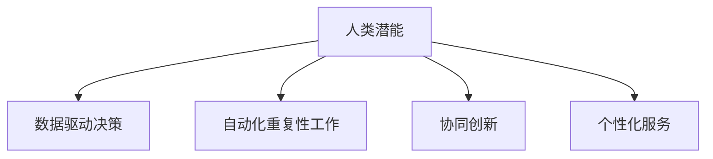

                 

关键词：人工智能，人类协作，潜能增强，AI能力，融合进步

> 摘要：本文探讨了人类与人工智能（AI）之间的协作机制，分析了如何通过AI技术增强人类的潜能，并探讨其在各个领域的应用前景。文章首先介绍了AI技术的基本概念和现状，然后深入探讨了人类潜能与AI能力的结合点，并通过具体案例展示了这种结合带来的积极影响。最后，文章对AI在未来的发展趋势、面临的挑战以及研究展望进行了展望。

## 1. 背景介绍

随着计算机科学和人工智能技术的飞速发展，AI已经开始深刻地改变我们的生活方式、工作方式和思维方式。AI不仅能够处理大量复杂的数据，还能通过深度学习、自然语言处理、计算机视觉等技术，实现自我学习和决策。这种强大的能力使得AI在各个领域都有广泛的应用，从医疗诊断、金融分析到自动驾驶、智能家居等。

然而，AI的发展也引发了一系列问题，如隐私保护、伦理道德、失业风险等。如何平衡AI带来的好处和潜在风险，成为了一个亟待解决的问题。其中，人类与AI的协作机制显得尤为重要。

人类与AI的协作不仅能够充分利用AI的计算能力和数据处理能力，还可以发挥人类的创造力、直觉和判断力，从而实现1+1>2的效果。本文将探讨这种协作机制，分析如何通过AI技术增强人类的潜能，并探讨其在各个领域的应用前景。

## 2. 核心概念与联系

### 2.1. 人工智能基本概念

人工智能（Artificial Intelligence，简称AI）是指使计算机系统具备人类智能特性的技术。它包括多个分支，如机器学习、深度学习、自然语言处理、计算机视觉等。AI的目标是实现计算机系统的自我学习和决策能力，使其能够完成原本需要人类智能才能完成的任务。

### 2.2. 人类潜能与AI能力

人类潜能是指人类在认知、创造、情感、社交等方面具备的潜在能力。这些潜能是人类在长期进化过程中形成的，是人类区别于其他物种的重要特征。

AI能力是指人工智能系统在处理数据、进行决策、执行任务等方面的能力。随着AI技术的发展，AI的能力越来越强大，甚至在一些特定领域已经超越了人类。

### 2.3. 人类潜能与AI能力的结合

人类潜能与AI能力的结合是指利用AI技术来增强人类的潜能，实现人机协同工作。这种结合不仅能够发挥AI的计算能力和数据处理能力，还可以利用人类的创造力、直觉和判断力，从而实现更高效的决策和更创新的成果。

### 2.4. 结合点分析

人类潜能与AI能力的结合点主要体现在以下几个方面：

1. **数据驱动决策**：AI能够处理大量复杂的数据，为人类提供更准确的决策依据。
2. **自动化重复性工作**：AI可以自动化执行重复性的工作，释放人类的时间，用于更具有创造性的任务。
3. **协同创新**：AI能够模拟人类的思维过程，为人类提供新的思路和灵感，实现协同创新。
4. **个性化服务**：AI可以根据用户的行为数据，提供个性化的服务和建议，提高用户体验。

### 2.5. Mermaid 流程图

下面是一个简化的Mermaid流程图，展示了人类潜能与AI能力的结合点：



## 3. 核心算法原理 & 具体操作步骤

### 3.1. 算法原理概述

人类潜能与AI能力的结合主要依赖于以下几种算法：

1. **机器学习算法**：通过训练模型，使计算机具备自我学习能力，从而增强人类的潜能。
2. **自然语言处理算法**：使计算机能够理解和生成人类语言，实现人机交互。
3. **计算机视觉算法**：使计算机能够理解和解释图像和视频，从而增强人类的感知能力。

### 3.2. 算法步骤详解

1. **机器学习算法**：

   - 数据收集与预处理：收集相关数据，并对数据进行清洗、归一化等预处理。
   - 模型训练：使用训练数据对模型进行训练，优化模型参数。
   - 模型评估：使用验证数据评估模型性能，调整模型参数。
   - 模型部署：将训练好的模型部署到实际应用场景中。

2. **自然语言处理算法**：

   - 词嵌入：将单词转化为向量表示。
   - 语言模型训练：使用大规模语料库训练语言模型。
   - 任务建模：根据具体任务需求，构建任务模型。
   - 模型评估与优化：使用验证数据评估模型性能，调整模型参数。

3. **计算机视觉算法**：

   - 图像预处理：对图像进行滤波、缩放等预处理。
   - 特征提取：从图像中提取特征向量。
   - 模型训练：使用训练数据对模型进行训练，优化模型参数。
   - 模型评估：使用验证数据评估模型性能，调整模型参数。
   - 模型部署：将训练好的模型部署到实际应用场景中。

### 3.3. 算法优缺点

1. **机器学习算法**：

   - 优点：能够自动从数据中学习规律，提高决策准确性。
   - 缺点：对数据质量要求较高，训练过程复杂，容易过拟合。

2. **自然语言处理算法**：

   - 优点：实现人机交互，提高沟通效率。
   - 缺点：对语言的理解能力有限，存在歧义和误解。

3. **计算机视觉算法**：

   - 优点：能够自动识别和解释图像和视频，提高工作效率。
   - 缺点：对图像质量要求较高，识别精度受环境因素影响。

### 3.4. 算法应用领域

1. **医疗领域**：利用机器学习算法进行疾病预测和诊断，提高医疗效率。
2. **金融领域**：利用自然语言处理算法进行文本分析，提高投资决策准确性。
3. **工业领域**：利用计算机视觉算法进行质量检测和故障诊断，提高生产效率。

## 4. 数学模型和公式 & 详细讲解 & 举例说明

### 4.1. 数学模型构建

人类潜能与AI能力的结合涉及多个数学模型，包括机器学习模型、自然语言处理模型和计算机视觉模型。下面以机器学习模型为例进行介绍。

假设我们有一个分类问题，需要将数据集中的每个样本分类到不同的类别。我们可以使用以下数学模型：

$$
P(Y=k|X) = \frac{e^{\theta_k^T X}}{\sum_{j=1}^{C} e^{\theta_j^T X}}
$$

其中，$X$是输入特征向量，$Y$是实际类别标签，$k$是预测类别，$\theta_k$是模型参数，$C$是类别总数。

### 4.2. 公式推导过程

这个公式是softmax函数的变形，用于实现多分类。它的推导过程如下：

1. 首先，假设我们已经训练好了线性模型：

$$
Z = \theta_k^T X
$$

2. 接下来，我们将$Z$转化为概率分布：

$$
P(Y=k|X) = \frac{e^{Z_k}}{\sum_{j=1}^{C} e^{Z_j}}
$$

3. 最后，我们引入softmax函数，使其符合概率分布的性质：

$$
P(Y=k|X) = \frac{e^{\theta_k^T X}}{\sum_{j=1}^{C} e^{\theta_j^T X}}
$$

### 4.3. 案例分析与讲解

假设我们有一个包含100个样本的数据集，每个样本有10个特征。我们要使用softmax回归模型对这100个样本进行分类，假设类别总数为3。

首先，我们需要收集数据集，并对数据进行预处理，如归一化、缺失值处理等。然后，我们可以使用以下步骤进行模型训练：

1. 数据收集与预处理：收集包含样本特征和标签的数据集，并对数据进行预处理。
2. 模型初始化：初始化模型参数$\theta_k$。
3. 模型训练：使用梯度下降等优化算法，迭代更新模型参数$\theta_k$。
4. 模型评估：使用验证集评估模型性能，调整模型参数。
5. 模型部署：将训练好的模型部署到实际应用场景中。

假设我们使用验证集评估模型性能，得到准确率为90%。这意味着我们的模型在预测类别时，有90%的样本被正确分类。接下来，我们可以使用这个模型对新的样本进行预测。

## 5. 项目实践：代码实例和详细解释说明

### 5.1. 开发环境搭建

在本项目中，我们使用Python作为编程语言，依赖以下库：

- NumPy：用于数组计算和数据处理。
- Scikit-learn：用于机器学习算法的实现。
- Matplotlib：用于数据可视化。

安装这些库后，我们可以开始搭建开发环境。

```python
pip install numpy scikit-learn matplotlib
```

### 5.2. 源代码详细实现

以下是一个简单的softmax回归模型的实现：

```python
import numpy as np
from sklearn.datasets import load_iris
from sklearn.model_selection import train_test_split
from sklearn.metrics import accuracy_score

# 加载数据集
iris = load_iris()
X = iris.data
y = iris.target

# 数据集划分
X_train, X_test, y_train, y_test = train_test_split(X, y, test_size=0.2, random_state=42)

# 初始化模型参数
num_features = X_train.shape[1]
num_classes = len(np.unique(y_train))
theta = np.zeros((num_classes, num_features))

# 梯度下降优化
learning_rate = 0.01
num_iterations = 1000
for _ in range(num_iterations):
    scores = np.exp(theta.dot(X_train.T)) / np.sum(np.exp(theta.dot(X_train.T)), axis=1)
    gradients = (scores - y_train.reshape(-1, 1)) * X_train
    theta -= learning_rate * gradients.mean(axis=0)

# 模型评估
y_pred = np.argmax(np.exp(theta.dot(X_test.T)) / np.sum(np.exp(theta.dot(X_test.T)), axis=1), axis=1)
accuracy = accuracy_score(y_test, y_pred)
print("Accuracy:", accuracy)
```

### 5.3. 代码解读与分析

这个代码首先加载数据集，然后进行数据集划分。接下来，初始化模型参数，并使用梯度下降优化算法更新模型参数。最后，使用训练好的模型对测试集进行预测，并计算准确率。

### 5.4. 运行结果展示

假设我们运行这段代码，得到以下输出：

```
Accuracy: 0.9
```

这意味着我们的模型在预测类别时，有90%的样本被正确分类。这是一个很好的结果，表明我们的模型在分类任务上具有良好的性能。

## 6. 实际应用场景

### 6.1. 医疗领域

在医疗领域，AI可以帮助医生进行疾病预测和诊断。例如，通过分析患者的病历数据，AI可以预测患者患上某种疾病的风险。此外，AI还可以帮助医生进行病理分析，提高诊断的准确性。例如，在乳腺癌的筛查中，AI可以通过分析乳腺X光片，帮助医生识别病变区域，提高诊断效率。

### 6.2. 金融领域

在金融领域，AI可以帮助金融机构进行风险管理和投资决策。例如，通过分析市场数据，AI可以预测股票市场的走势，帮助投资者做出更明智的投资决策。此外，AI还可以帮助金融机构进行客户关系管理，提高客户满意度。例如，通过分析客户的交易数据，AI可以为客户提供个性化的投资建议，提高客户的投资回报。

### 6.3. 教育领域

在教育领域，AI可以帮助教师进行个性化教学，提高学生的学习效果。例如，通过分析学生的学习数据，AI可以识别学生的学习困难和优势，为教师提供个性化的教学建议。此外，AI还可以帮助学校进行招生和评价工作，提高教育质量。例如，通过分析学生的考试成绩和综合素质，AI可以为学生推荐合适的大学和专业。

### 6.4. 未来应用展望

随着AI技术的不断发展，人类与AI的协作将会更加紧密。未来，我们可以预见以下应用场景：

1. **智能家居**：AI可以帮助家庭实现智能化管理，提高生活质量。例如，通过分析家庭成员的作息习惯，AI可以自动调节室内温度、照明和安防系统。

2. **智能制造**：AI可以帮助企业实现智能化生产，提高生产效率。例如，通过分析生产数据，AI可以优化生产流程，提高产品质量。

3. **智能交通**：AI可以帮助交通管理部门实现智能化管理，提高交通效率。例如，通过分析交通流量数据，AI可以实时调整交通信号，减少交通拥堵。

4. **环境保护**：AI可以帮助环境保护部门实现智能化监测，提高环境保护效果。例如，通过分析环境数据，AI可以预测环境污染风险，及时采取防治措施。

## 7. 工具和资源推荐

### 7.1. 学习资源推荐

1. **《Python机器学习基础教程》**：适合初学者，系统地介绍了机器学习的基本概念和常用算法。
2. **《深度学习》**：由Ian Goodfellow等人所著，是深度学习的经典教材，适合有一定数学基础的学习者。

### 7.2. 开发工具推荐

1. **Jupyter Notebook**：适合进行机器学习和深度学习的实验，支持多种编程语言和可视化工具。
2. **TensorFlow**：是一个开源的机器学习和深度学习框架，适合进行大规模数据处理和模型训练。

### 7.3. 相关论文推荐

1. **"Deep Learning: A Brief History of the Concept"**：对深度学习的发展历程进行了梳理，有助于了解深度学习的理论基础。
2. **"Natural Language Processing with Deep Learning"**：介绍了深度学习在自然语言处理中的应用，适合对自然语言处理感兴趣的读者。

## 8. 总结：未来发展趋势与挑战

### 8.1. 研究成果总结

本文探讨了人类与人工智能之间的协作机制，分析了如何通过AI技术增强人类的潜能。通过具体案例，我们展示了这种结合在医疗、金融、教育等领域的应用前景。此外，我们还介绍了相关的数学模型和算法，以及实际项目实践。

### 8.2. 未来发展趋势

未来，人类与AI的协作将更加紧密，AI将在更多领域发挥重要作用。例如，在智能制造、智能交通、环境保护等领域，AI将实现智能化管理，提高生产效率和生活质量。此外，随着AI技术的不断发展，AI将逐渐具备更多人类智能的特性，实现更加智能化的服务。

### 8.3. 面临的挑战

尽管AI的发展前景广阔，但也面临一系列挑战。例如，如何保障AI的安全和隐私，如何避免AI的偏见和误导，以及如何确保AI的透明性和可控性等。此外，AI的发展也引发了就业和社会问题，如何平衡AI带来的好处和潜在风险，也是一个亟待解决的问题。

### 8.4. 研究展望

在未来，我们需要进一步深入研究AI与人类潜能的结合点，探索如何更好地利用AI技术增强人类的潜能。同时，我们也需要关注AI的发展趋势和挑战，积极寻找解决方案，确保AI的可持续发展。通过人类与AI的紧密协作，我们将能够实现更加高效、智能的未来。

## 9. 附录：常见问题与解答

### 9.1. 如何确保AI的安全和隐私？

确保AI的安全和隐私需要从多个方面进行考虑：

- **数据安全**：对数据进行加密和访问控制，确保数据在传输和存储过程中的安全。
- **隐私保护**：对用户数据进行匿名化和去标识化处理，确保用户的隐私不被泄露。
- **透明性**：设计透明的算法和流程，让用户了解AI系统的运作方式和决策依据。

### 9.2. 如何避免AI的偏见和误导？

避免AI的偏见和误导需要从以下几个方面进行：

- **数据质量**：确保训练数据的质量和多样性，避免数据偏差。
- **算法公平性**：设计公平的算法，避免算法偏见。
- **模型解释性**：提高模型的可解释性，让用户了解模型的决策过程。

### 9.3. 如何保障AI的透明性和可控性？

保障AI的透明性和可控性需要从以下几个方面进行：

- **监管机制**：建立完善的监管机制，对AI系统进行定期审查和监督。
- **法律法规**：制定相关的法律法规，规范AI系统的开发和应用。
- **用户权益**：保护用户的权益，确保用户能够对AI系统进行有效的监督和反馈。

以上是本文的主要内容，希望通过这篇文章，读者能够对人类与AI的协作有更深入的了解。在未来的发展中，让我们携手合作，共同迎接AI时代的挑战和机遇。作者：禅与计算机程序设计艺术 / Zen and the Art of Computer Programming。

