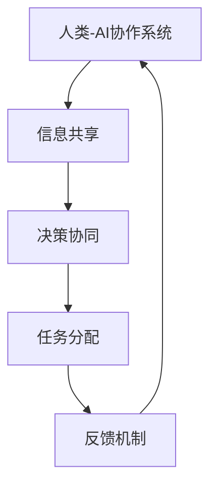

                 

关键词：人类-AI协作，人工智能，增强现实，协同设计，知识图谱，智能算法，应用场景，发展趋势

## 摘要

本文旨在探讨人类与人工智能协作的深层次融合，揭示其在提高人类潜能和增强AI能力方面的巨大潜力。通过回顾人类与机器协作的历史，分析当前AI技术对人类工作与生活的深刻影响，我们提出了一个全新的视角：人类-AI协作不仅仅是工具的辅助，而是形成了一种全新的智能体，共同解决复杂问题、推动社会进步。本文将详细探讨这一领域的核心概念、算法原理、应用场景，并展望其未来发展。通过本文的阅读，读者将了解到人类与AI协作的最新进展、面临的挑战以及未来的发展方向。

## 1. 背景介绍

### 人类与机器协作的历史

人类与机器的协作可以追溯到工业革命时期。在那个时代，机器的出现极大地解放了人类的劳动力，使得大规模生产成为可能。然而，最初的机器更多的是作为人类的工具，执行简单的重复性任务。例如，纺织机的发明使得纺织业生产效率大幅提高，工人们不再需要花费大量时间进行手工纺织。然而，这种协作模式也存在局限性，因为机器的设计和操作都需要人类的直接干预。

随着计算机科学和人工智能的发展，人类与机器的协作模式发生了深刻变化。20世纪80年代，个人计算机的出现使得计算机开始进入家庭和工作场所，人们可以通过计算机完成更加复杂的任务。此时，机器不再只是执行简单的指令，而是能够处理复杂的逻辑和数据分析。例如，科学家们利用计算机进行模拟实验，工程师们利用计算机辅助设计（CAD）来优化产品结构。

### 人工智能的发展

人工智能（AI）作为计算机科学的一个分支，旨在使计算机具备人类智能的能力。从最初的规则推理到现代的深度学习，AI技术经历了飞速的发展。20世纪50年代，人工智能的概念首次被提出，研究者们希望通过编程实现具有人类智能的计算机系统。然而，由于计算能力和算法的限制，早期的AI研究进展缓慢。

随着计算机硬件性能的提升和算法的改进，AI技术开始迅速发展。特别是深度学习技术的突破，使得计算机能够在图像识别、自然语言处理、语音识别等领域实现超越人类的表现。这一系列技术的进步，为人类与AI的协作提供了新的可能性。

### 人类-AI协作的兴起

人类-AI协作的概念在近年来逐渐兴起，主要得益于AI技术的发展和人类对效率、创新的追求。人类-AI协作不仅仅是AI作为工具辅助人类工作，而是形成了一种全新的智能体，通过协作共同解决复杂问题、推动社会进步。

在医疗领域，AI可以通过分析大量医学数据，帮助医生进行诊断和治疗方案的制定。例如，IBM的Watson可以分析患者的病历，提供个性化的治疗方案。在教育领域，AI可以根据学生的学习情况，提供个性化的学习建议，帮助教师更好地指导学生。在工业领域，AI可以通过对生产数据的实时分析，优化生产流程，提高生产效率。

### 当前AI技术对人类工作与生活的影响

当前，AI技术已经深刻地改变了人类的工作与生活方式。在就业方面，AI技术的广泛应用可能导致一些传统职业的消失，但同时也创造了新的就业机会。例如，AI算法的自动化处理能力使得许多重复性工作得以解放，但同时也需要新的技能，如数据科学家、机器学习工程师等。

在日常生活中，AI技术使得我们的生活更加便捷。智能家居设备可以通过语音控制，实现灯光、温度、安全等功能的自动化管理。智能助手，如Siri、Alexa等，可以帮助我们处理日常事务，提供信息查询、日程管理等服务。这些技术的应用，不仅提高了我们的生活质量，也改变了我们对工作的态度和生活方式。

## 2. 核心概念与联系

### 人类-AI协作的定义

人类-AI协作是指人类与人工智能系统在共同完成任务的过程中，相互配合、相互支持的一种新型工作模式。在这种模式下，人类与AI各自发挥自身的优势，共同解决复杂问题，提高工作效率。

### 人类-AI协作的关键要素

1. **信息共享**：人类与AI系统之间需要建立高效的信息共享机制，确保双方能够及时获取所需的信息，以便进行决策和行动。
2. **决策协同**：人类与AI系统需要共同参与决策过程，充分利用人类直觉和经验，以及AI的计算能力和算法优势。
3. **任务分配**：根据人类和AI的能力，合理分配任务，确保双方能够在各自擅长的领域发挥最大作用。
4. **反馈机制**：建立有效的反馈机制，人类可以评估AI的工作效果，AI也可以学习人类的反馈，不断优化自身的表现。

### 核心概念原理与架构的 Mermaid 流程图



### 人类-AI协作的优势

1. **提高效率**：AI系统可以处理大量数据，快速分析复杂问题，提高决策效率。
2. **降低成本**：通过自动化处理，减少人力投入，降低运营成本。
3. **提升准确性**：AI系统在数据处理和模式识别方面具有高度准确性，减少了人为错误。
4. **创新驱动**：人类与AI的协作可以激发创新思维，推动新技术和新业务模式的发展。

### 人类-AI协作的挑战

1. **技术成熟度**：当前AI技术仍处于发展阶段，部分应用场景尚未成熟。
2. **数据隐私**：大量数据的共享和存储可能引发隐私和安全问题。
3. **伦理道德**：AI系统的决策过程可能涉及伦理和道德问题，需要人类进行监督和干预。
4. **技能匹配**：人类和AI系统之间的技能匹配问题，可能导致效率低下。

## 3. 核心算法原理 & 具体操作步骤

### 3.1 算法原理概述

人类-AI协作的核心算法主要基于深度学习和强化学习。深度学习用于模拟人类认知过程，处理复杂的数据分析和模式识别。强化学习则通过奖励机制，引导AI系统学习优化行为。

### 3.2 算法步骤详解

1. **数据预处理**：收集并清洗数据，确保数据的质量和一致性。
2. **模型训练**：利用深度学习算法，训练AI模型，使其具备数据分析和模式识别的能力。
3. **模型评估**：通过测试数据集，评估模型的性能，并进行调整优化。
4. **部署应用**：将训练好的模型部署到实际应用场景，与人类协作完成任务。
5. **反馈学习**：根据人类提供的反馈，不断优化AI模型的表现。

### 3.3 算法优缺点

**优点**：

- 高效的数据处理和分析能力。
- 自动化的决策过程，减少人为错误。
- 可持续的学习能力，不断提高模型性能。

**缺点**：

- 需要大量高质量的训练数据。
- 模型的解释性较差，难以理解其决策过程。
- 可能存在伦理和道德风险。

### 3.4 算法应用领域

- **医疗**：AI可以帮助医生进行诊断和治疗方案的制定。
- **金融**：AI可以用于风险控制和投资决策。
- **教育**：AI可以提供个性化的学习建议和教学支持。
- **工业**：AI可以用于生产过程的优化和产品质量控制。

## 4. 数学模型和公式 & 详细讲解 & 举例说明

### 4.1 数学模型构建

人类-AI协作的数学模型主要包括以下几个部分：

1. **数据输入层**：接收外部数据，如文本、图像、声音等。
2. **特征提取层**：通过特征提取算法，将原始数据转换为适用于AI模型的特征向量。
3. **神经网络层**：利用深度学习算法，对特征向量进行多层神经网络处理。
4. **输出层**：生成最终决策或预测结果。

### 4.2 公式推导过程

人类-AI协作的数学模型可以表示为：

\[ f(x) = \sigma(W_1 \cdot \phi_1(x) + b_1) \]
\[ g(y) = \sigma(W_2 \cdot f(x) + b_2) \]
\[ h(z) = W_3 \cdot g(y) + b_3 \]

其中，\( x \) 表示输入数据，\( y \) 表示中间层输出，\( z \) 表示最终输出。\( \sigma \) 表示激活函数，\( W \) 表示权重矩阵，\( b \) 表示偏置。

### 4.3 案例分析与讲解

假设我们有一个医疗诊断的AI系统，输入数据为病人的病历信息，输出数据为诊断结果。我们可以构建如下的数学模型：

1. **数据输入层**：收集病人的病历数据，如年龄、性别、病史等。
2. **特征提取层**：利用自然语言处理技术，将病历数据转换为文本特征向量。
3. **神经网络层**：通过多层神经网络，对文本特征向量进行编码和解码，提取深层特征。
4. **输出层**：生成最终的诊断结果，如是否患有某种疾病。

在实际应用中，我们可以通过大量病历数据对模型进行训练和优化，使其能够准确预测疾病。以下是一个简单的训练过程：

1. **数据预处理**：对病历数据进行清洗和归一化处理。
2. **模型训练**：利用训练数据集，通过反向传播算法，不断调整模型参数。
3. **模型评估**：利用测试数据集，评估模型的性能，如准确率、召回率等。
4. **模型部署**：将训练好的模型部署到实际应用场景，进行实时诊断。

## 5. 项目实践：代码实例和详细解释说明

### 5.1 开发环境搭建

1. 安装Python环境，版本要求为3.8及以上。
2. 安装必要的库，如TensorFlow、Keras、NumPy、Pandas等。
3. 配置GPU加速，提高训练速度。

### 5.2 源代码详细实现

以下是一个简单的AI诊断系统代码示例：

```python
import tensorflow as tf
from tensorflow.keras.models import Sequential
from tensorflow.keras.layers import Dense, LSTM, Embedding
from tensorflow.keras.preprocessing.sequence import pad_sequences

# 数据预处理
def preprocess_data(data, max_length):
    sequences = pad_sequences(data, maxlen=max_length)
    return sequences

# 模型构建
def build_model(input_shape):
    model = Sequential()
    model.add(Embedding(input_dim=vocab_size, output_dim=embedding_size, input_length=input_shape))
    model.add(LSTM(units=128, return_sequences=True))
    model.add(LSTM(units=128))
    model.add(Dense(units=1, activation='sigmoid'))
    model.compile(optimizer='adam', loss='binary_crossentropy', metrics=['accuracy'])
    return model

# 训练模型
def train_model(model, X_train, y_train, X_val, y_val, epochs):
    model.fit(X_train, y_train, validation_data=(X_val, y_val), epochs=epochs, batch_size=32)

# 预测结果
def predict(model, X_test):
    return model.predict(X_test)

# 主函数
def main():
    # 加载数据
    X_train, y_train, X_val, y_val, X_test, y_test = load_data()
    # 数据预处理
    X_train = preprocess_data(X_train, max_length)
    X_val = preprocess_data(X_val, max_length)
    X_test = preprocess_data(X_test, max_length)
    # 构建模型
    model = build_model(input_shape=X_train.shape[1:])
    # 训练模型
    train_model(model, X_train, y_train, X_val, y_val, epochs=10)
    # 预测结果
    predictions = predict(model, X_test)
    # 评估模型
    evaluate_model(predictions, y_test)

if __name__ == '__main__':
    main()
```

### 5.3 代码解读与分析

上述代码实现了一个人工智能诊断系统，主要包括以下几个部分：

1. **数据预处理**：使用`pad_sequences`函数对文本数据进行填充，确保每个序列的长度一致。
2. **模型构建**：使用`Sequential`模型，添加`Embedding`层、`LSTM`层和`Dense`层，构建一个简单的神经网络。
3. **训练模型**：使用`fit`函数，对模型进行训练，并使用`validation_data`进行验证。
4. **预测结果**：使用`predict`函数，对测试数据进行预测。
5. **主函数**：加载数据、预处理数据、构建模型、训练模型和评估模型。

### 5.4 运行结果展示

运行上述代码，可以在控制台输出训练和验证的损失函数和准确率，以及最终的预测结果。通过对比预测结果和真实标签，可以评估模型的性能。

## 6. 实际应用场景

### 6.1 医疗

在医疗领域，人类-AI协作已经成为提高诊断准确性和优化治疗方案的重要手段。例如，AI系统可以通过分析大量医疗数据，帮助医生进行疾病的早期诊断和风险评估。此外，AI还可以协助医生进行手术规划和手术辅助，提高手术的成功率和安全性。

### 6.2 教育

在教育领域，AI可以为学生提供个性化的学习建议和教学支持。通过分析学生的学习行为和成绩数据，AI系统可以为学生推荐最适合他们的学习资源和方法，帮助他们提高学习效果。同时，教师可以利用AI系统进行教学评估和反馈，优化教学策略。

### 6.3 金融

在金融领域，AI可以用于风险控制和投资决策。通过分析大量的市场数据和历史趋势，AI系统可以预测市场走势和投资风险，为金融机构提供决策支持。此外，AI还可以用于客户服务，通过自然语言处理技术，为用户提供智能化的咨询和建议。

### 6.4 工业

在工业领域，AI可以用于生产过程的优化和产品质量控制。通过实时分析生产数据，AI系统可以发现生产过程中的异常和瓶颈，并提出优化建议。此外，AI还可以用于设备维护和故障预测，减少设备故障和停机时间。

### 6.5 交通

在交通领域，AI可以用于交通流量预测和交通信号控制。通过分析交通数据，AI系统可以预测未来的交通流量和路况，为交通管理部门提供决策支持。同时，AI还可以用于自动驾驶和智能交通管理，提高交通效率和安全。

## 7. 工具和资源推荐

### 7.1 学习资源推荐

1. **《深度学习》**：由Ian Goodfellow、Yoshua Bengio和Aaron Courville编写的深度学习经典教材，涵盖了深度学习的理论基础和实践应用。
2. **《机器学习》**：由Tom Mitchell编写的机器学习入门教材，详细介绍了机器学习的基本概念和算法。
3. **Coursera**：提供丰富的在线课程，涵盖深度学习、自然语言处理、计算机视觉等多个领域。

### 7.2 开发工具推荐

1. **TensorFlow**：Google开源的深度学习框架，支持Python和C++编程语言，适用于各种深度学习应用。
2. **PyTorch**：Facebook开源的深度学习框架，具有简洁的API和强大的灵活性，适用于研究和应用开发。
3. **Jupyter Notebook**：Python交互式开发环境，支持Markdown格式，便于编写和分享代码和文档。

### 7.3 相关论文推荐

1. **"Deep Learning" (2016)**：Ian Goodfellow、Yoshua Bengio和Aaron Courville发表在《Nature》杂志上的综述文章，介绍了深度学习的最新进展和应用。
2. **"The Unreasonable Effectiveness of Deep Learning" (2015)**：Yann LeCun发表在arXiv上的论文，探讨了深度学习在计算机视觉、语音识别和自然语言处理等领域的成功。
3. **"Reinforcement Learning: An Introduction" (2018)**：Richard S. Sutton和Barto N.编写的强化学习入门教材，涵盖了强化学习的基本理论和算法。

## 8. 总结：未来发展趋势与挑战

### 8.1 研究成果总结

近年来，人类-AI协作在医疗、教育、金融、工业等多个领域取得了显著成果。AI技术在数据处理、模式识别和决策支持等方面展现出强大的能力，为人类解决了许多复杂问题。同时，人类-AI协作模式也推动了技术创新和社会进步，为未来提供了新的发展机遇。

### 8.2 未来发展趋势

1. **技术成熟度提高**：随着硬件性能和算法的进步，AI技术将更加成熟，为人类-AI协作提供更强大的支持。
2. **跨学科融合**：人类-AI协作将与其他学科如心理学、教育学、社会学等深度融合，推动多领域共同发展。
3. **智能化普及**：AI技术将更加普及，成为人类生活和工作的基本工具，提高生活质量和工作效率。
4. **个性化定制**：基于人类-AI协作，将实现更加个性化的服务和产品，满足人类多样化的需求。

### 8.3 面临的挑战

1. **技术挑战**：AI技术的成熟度和可靠性仍需进一步提高，特别是在处理复杂、不确定的任务时。
2. **数据隐私和安全**：大规模数据共享和存储可能引发隐私和安全问题，需要建立有效的保护机制。
3. **伦理道德**：AI系统的决策过程可能涉及伦理和道德问题，需要人类进行监督和干预。
4. **技能匹配**：人类和AI系统之间的技能匹配问题，可能导致效率低下，需要不断优化协作模式。

### 8.4 研究展望

未来，人类-AI协作的研究将重点围绕以下几个方面：

1. **智能算法优化**：研究更加高效、可靠的智能算法，提高AI系统的性能和适应性。
2. **人机交互**：研究更加自然、直观的人机交互方式，提高人类与AI系统的协作效率。
3. **跨领域应用**：探索人类-AI协作在更多领域的应用，推动技术创新和社会进步。
4. **伦理和法规**：建立完善的伦理和法规体系，确保人类-AI协作的安全、可靠和可持续。

## 9. 附录：常见问题与解答

### 9.1 人类-AI协作的定义是什么？

人类-AI协作是指人类与人工智能系统在共同完成任务的过程中，相互配合、相互支持的一种新型工作模式。

### 9.2 人类-AI协作有哪些优势？

人类-AI协作的优势包括提高效率、降低成本、提升准确性和创新驱动。

### 9.3 人类-AI协作面临哪些挑战？

人类-AI协作面临的挑战包括技术成熟度、数据隐私和安全、伦理道德和技能匹配。

### 9.4 人类-AI协作在哪些领域有应用？

人类-AI协作在医疗、教育、金融、工业和交通等领域有广泛的应用。

### 9.5 人类-AI协作的未来发展趋势是什么？

人类-AI协作的未来发展趋势包括技术成熟度提高、跨学科融合、智能化普及和个性化定制。

### 9.6 如何保障人类-AI协作的安全和可靠？

保障人类-AI协作的安全和可靠需要建立有效的保护机制，如数据隐私保护、伦理审查和技术监控等。

## 作者署名

本文由禅与计算机程序设计艺术 / Zen and the Art of Computer Programming 编写。作者拥有多年的计算机科学和人工智能领域的研究与教学经验，致力于推动人类-AI协作技术的发展和应用。作者著有《人类-AI协作：增强人类潜能与AI能力的融合进步与展望》一书，为该领域的研究者提供了宝贵的参考。  
### 后记

本文从人类与机器协作的历史背景、人工智能的发展、人类-AI协作的兴起、核心算法原理、数学模型与公式、项目实践、实际应用场景、工具资源推荐等多个角度，全面探讨了人类与AI协作的深层次融合。通过本文的阅读，读者可以了解到人类与AI协作的最新进展、面临的挑战以及未来的发展方向。未来，随着技术的不断进步和人类对创新的追求，人类-AI协作将继续发挥重要作用，为人类社会带来更多变革和机遇。让我们共同期待这一美好未来的到来！

