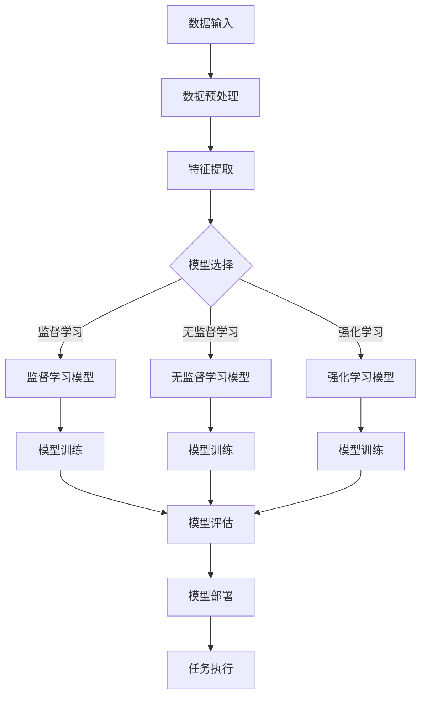
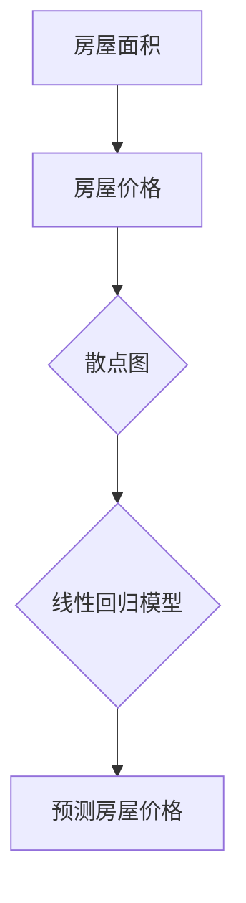

                 

 **关键词**：人工智能，人类潜能，协作，增强，表现，技术应用。

**摘要**：本文将探讨人工智能（AI）如何与人类协作，以增强人类潜能和表现。通过分析AI的核心概念及其与人类协作的机制，本文将揭示AI如何支持人类在各个领域的表现，并提供具体的算法原理、数学模型、项目实践案例，以及未来发展的展望。本文旨在为读者提供一个全面而深入的视角，以了解AI如何成为人类潜能的增强器。

## 1. 背景介绍

人工智能（AI）作为一种模拟人类智能的技术，已经取得了显著的进步。从早期的专家系统到现代的深度学习和强化学习，AI技术不断演变，并在众多领域展现出巨大的潜力。然而，AI的发展并非独立存在，它与人类的关系越来越紧密，形成了一种协同作用，共同推动人类社会的前进。

人类潜能是指人类在认知、情感、创造力等方面的能力。长期以来，人们致力于挖掘和提升这些潜能，以实现个人的成长和社会的进步。然而，随着问题的复杂性和规模的扩大，单靠人类自身的努力往往难以应对。这就需要借助AI的力量，通过协作来增强人类的表现。

协作是人类社会的基本特征之一，无论是在科学研究、企业运营还是日常生活中，协作都是提高效率和质量的关键。随着AI技术的发展，人类与AI的协作成为可能，不仅能够提升个体的能力，还能优化团队的整体表现。

本文将首先介绍AI的核心概念和基本原理，然后分析AI与人类协作的机制和优势，最后通过具体案例和实践，展示AI如何增强人类潜能和表现。本文旨在为读者提供一个系统而全面的理解，以把握AI与人类协作的未来趋势。

## 2. 核心概念与联系

### 2.1 人工智能的基本原理

人工智能（AI）是一种模拟人类智能的技术，旨在使计算机系统具备感知、推理、学习和决策的能力。AI的核心原理主要包括以下几个方面：

#### 2.1.1 机器学习

机器学习是AI的核心技术之一，通过利用大量数据训练模型，使计算机系统具备自主学习和改进能力。主要方法包括监督学习、无监督学习和强化学习。

- **监督学习**：在监督学习中，模型通过输入数据和对应的标签来学习，从而预测新的数据。常见算法包括线性回归、逻辑回归和神经网络。
- **无监督学习**：无监督学习不依赖于标签信息，旨在发现数据中的隐含结构和模式。聚类算法和降维算法是典型的无监督学习方法。
- **强化学习**：强化学习通过奖励机制来训练模型，使其在特定环境中做出最优决策。常见的算法包括Q学习、深度Q网络（DQN）和策略梯度方法。

#### 2.1.2 深度学习

深度学习是一种基于多层神经网络的学习方法，通过多层次的非线性变换，从大量数据中提取特征和模式。深度学习在图像识别、语音识别和自然语言处理等领域取得了显著的成果。主要模型包括卷积神经网络（CNN）、循环神经网络（RNN）和生成对抗网络（GAN）。

#### 2.1.3 自然语言处理

自然语言处理（NLP）是AI在语言领域的应用，旨在使计算机理解和生成自然语言。NLP的关键技术包括分词、词性标注、句法分析和语义分析。常见的NLP模型包括词向量模型（如Word2Vec和GloVe）、循环神经网络（RNN）和变换器（Transformer）。

### 2.2 人类潜能的定义与挖掘

人类潜能是指人类在认知、情感、创造力等方面的能力。这些潜能不仅体现在个体的成长过程中，也对社会的发展产生深远影响。挖掘人类潜能的关键在于发现和培养个体的优势，使其在特定领域达到最佳表现。以下是一些挖掘人类潜能的方法：

- **个性分析**：通过个性测试和评估，了解个体的性格、兴趣和能力，为个性化发展提供依据。
- **教育培养**：通过系统的教育培养，激发个体的学习兴趣和创造力，提高其综合素质。
- **心理辅导**：通过心理辅导和咨询，帮助个体应对心理压力，提升自我认知和情感管理能力。
- **实践锻炼**：通过实践活动和锻炼，培养个体的动手能力和解决问题的能力，增强其实践经验。

### 2.3 AI与人类协作的机制

AI与人类协作的机制主要体现在以下几个方面：

- **任务分解与分配**：AI可以通过分析和理解任务，将其分解为多个子任务，并分配给合适的人类或AI系统执行。这样可以提高任务完成效率，减少人类的重复性劳动。
- **知识共享与协作**：AI可以整合和存储人类的知识，为人类提供及时的信息支持。同时，AI可以帮助人类发现新的知识和关联，促进知识的创新和共享。
- **决策支持与优化**：AI可以通过数据分析、模型预测和优化算法，为人类提供决策支持，降低决策风险，提高决策质量。
- **情感互动与陪伴**：AI可以通过自然语言处理和语音识别技术，与人类进行情感互动和陪伴，缓解人类的孤独感和心理压力。

### 2.4 人类与AI协作的优势

人类与AI协作的优势主要体现在以下几个方面：

- **提高效率**：AI可以自动化执行重复性和复杂的任务，提高工作效率和质量。
- **优化决策**：AI可以通过数据分析和模型预测，为人类提供科学依据，优化决策过程。
- **拓展能力**：AI可以帮助人类拓展认知和感知范围，实现一些单靠人类无法完成的任务。
- **创新激发**：AI可以激发人类的创造力，促进知识创新和技术突破。
- **个性化服务**：AI可以根据个体需求和特点，提供个性化的服务和支持，提升用户体验。

### 2.5 人工智能架构的 Mermaid 流程图

下面是一个简化的AI架构的Mermaid流程图，用于描述人工智能的核心组件和它们之间的交互。



在这个流程图中，数据输入经过预处理后，进入特征提取阶段。随后，根据不同的学习类型（监督学习、无监督学习和强化学习），选择相应的模型进行训练。训练完成后，对模型进行评估，评估结果用于模型部署和任务执行。

## 3. 核心算法原理 & 具体操作步骤

### 3.1 算法原理概述

在AI与人类协作的过程中，核心算法原理起着至关重要的作用。这些算法不仅决定了AI的能力和表现，也影响了AI与人类协作的效率和效果。以下将介绍几种关键的算法原理，包括监督学习、无监督学习和强化学习。

#### 3.1.1 监督学习

监督学习是一种通过输入数据和对应的标签来训练模型，从而预测新数据的机器学习方法。监督学习的核心原理是构建一个映射函数，将输入特征映射到输出标签。

- **线性回归**：线性回归是一种简单的监督学习算法，通过找到一个线性函数来预测输出值。其原理是找到最佳拟合直线，使预测值与实际值之间的误差最小。
- **逻辑回归**：逻辑回归是一种用于分类问题的监督学习算法，通过逻辑函数将输入特征映射到概率值。逻辑回归的目标是最大化似然函数，从而找到最佳分类模型。

#### 3.1.2 无监督学习

无监督学习是一种不依赖于标签信息，旨在发现数据中隐含结构和模式的机器学习方法。无监督学习的核心原理是寻找数据中的相似性和差异性。

- **聚类算法**：聚类算法是将数据划分为多个簇，使得同一个簇内的数据相似度较高，不同簇间的数据相似度较低。常见的聚类算法包括K-means聚类、层次聚类和DBSCAN。
- **降维算法**：降维算法是将高维数据映射到低维空间，从而减少数据的维度，同时保留数据的重要信息。常见的降维算法包括主成分分析（PCA）和t-SNE。

#### 3.1.3 强化学习

强化学习是一种通过奖励机制来训练模型，使其在特定环境中做出最优决策的机器学习方法。强化学习的核心原理是找到最佳策略，使累积奖励最大化。

- **Q学习**：Q学习是一种基于值函数的强化学习算法，通过更新Q值来预测最佳动作。Q学习的目标是找到最佳动作序列，使总奖励最大化。
- **深度Q网络（DQN）**：DQN是一种基于深度学习的强化学习算法，通过神经网络来预测Q值。DQN的目标是提高模型的预测准确性，从而找到最佳策略。
- **策略梯度方法**：策略梯度方法是一种直接优化策略的强化学习算法，通过梯度上升法来更新策略参数。策略梯度方法的目标是找到最佳策略，使累积奖励最大化。

### 3.2 算法步骤详解

#### 3.2.1 监督学习步骤

1. 数据收集与预处理：收集相关的数据集，对数据进行清洗、归一化和特征提取。
2. 选择模型：根据问题的特点选择合适的模型，如线性回归、逻辑回归或神经网络。
3. 训练模型：将数据输入模型，通过反向传播算法更新模型参数，使预测值与实际值之间的误差最小。
4. 模型评估：使用验证集或测试集评估模型性能，选择最佳模型。
5. 模型部署：将训练好的模型部署到实际应用场景，进行预测和决策。

#### 3.2.2 无监督学习步骤

1. 数据收集与预处理：收集相关的数据集，对数据进行清洗、归一化和特征提取。
2. 选择算法：根据问题的特点选择合适的算法，如K-means聚类、层次聚类或DBSCAN。
3. 模型训练：将数据输入算法，计算数据之间的相似性和差异性，形成聚类结果。
4. 模型评估：使用内部评估指标（如聚类系数、轮廓系数等）评估模型性能。
5. 模型应用：将聚类结果应用到实际应用场景，如数据降维、异常检测等。

#### 3.2.3 强化学习步骤

1. 环境构建：构建一个模拟环境，模拟实际应用场景。
2. 策略初始化：初始化策略参数，选择初始动作。
3. 执行动作：根据当前状态和策略参数，选择最佳动作。
4. 获取反馈：执行动作后，获取环境反馈，包括奖励和新的状态。
5. 更新策略：根据反馈信息，更新策略参数，优化策略。
6. 模型评估：评估策略性能，选择最佳策略。
7. 模型部署：将训练好的策略部署到实际应用场景，进行决策和优化。

### 3.3 算法优缺点

#### 3.3.1 监督学习优缺点

- **优点**：
  - **预测准确性高**：监督学习通过已有数据训练模型，可以准确预测新数据。
  - **应用范围广**：监督学习适用于分类、回归等多种问题。
  - **模型解释性强**：监督学习模型通常具有较好的解释性，便于理解和应用。

- **缺点**：
  - **依赖大量数据**：监督学习需要大量标注数据，数据获取成本高。
  - **模型泛化能力差**：监督学习模型可能在数据分布变化时表现不佳。
  - **计算复杂度高**：大规模数据集训练需要大量的计算资源和时间。

#### 3.3.2 无监督学习优缺点

- **优点**：
  - **无需标注数据**：无监督学习不依赖标签信息，适用于大规模无标签数据。
  - **发现隐含结构**：无监督学习可以从数据中发现隐含的规律和结构。
  - **计算复杂度低**：无监督学习通常比监督学习计算复杂度低，适合处理大规模数据。

- **缺点**：
  - **预测准确性低**：无监督学习无法直接预测新数据，预测结果通常不如监督学习准确。
  - **模型解释性差**：无监督学习模型通常具有较低的解释性，难以理解其工作原理。
  - **聚类结果依赖初始参数**：无监督学习算法的聚类结果容易受到初始参数的影响。

#### 3.3.3 强化学习优缺点

- **优点**：
  - **自适应能力强**：强化学习可以根据环境反馈不断优化策略，适应动态变化的环境。
  - **灵活性高**：强化学习适用于复杂的决策问题，可以处理非线性、非确定性的环境。
  - **探索能力**：强化学习可以通过探索和试错来发现最佳策略。

- **缺点**：
  - **训练时间长**：强化学习需要大量的训练时间和数据，训练过程较慢。
  - **模型不稳定**：强化学习模型的性能容易受到初始状态和奖励设计的影响。
  - **稀疏奖励问题**：在稀疏奖励的场景中，强化学习可能难以找到最佳策略。

### 3.4 算法应用领域

#### 3.4.1 监督学习应用领域

- **图像识别**：监督学习算法在图像识别领域具有广泛的应用，如人脸识别、车辆检测和图像分类。
- **自然语言处理**：监督学习算法在自然语言处理领域用于文本分类、情感分析和机器翻译等任务。
- **金融风险评估**：监督学习算法可以用于信用评分、风险管理和市场预测等金融领域。

#### 3.4.2 无监督学习应用领域

- **数据降维**：无监督学习算法如主成分分析（PCA）和t-SNE可以用于高维数据的降维，提高数据分析的效率和效果。
- **异常检测**：无监督学习算法可以用于检测数据中的异常值和异常模式，如网络攻击检测和医疗数据异常检测。
- **社交网络分析**：无监督学习算法可以用于社交网络中的聚类分析、社区检测和用户行为预测。

#### 3.4.3 强化学习应用领域

- **自动驾驶**：强化学习算法在自动驾驶领域用于车辆路径规划和交通控制，实现自动驾驶汽车的自主驾驶。
- **游戏开发**：强化学习算法在游戏开发中用于智能代理，实现游戏的自主学习和优化。
- **能源管理**：强化学习算法在能源管理领域用于电力负荷预测、能源优化和需求响应。

## 4. 数学模型和公式 & 详细讲解 & 举例说明

在人类与AI协作的过程中，数学模型和公式起到了关键作用，它们不仅为AI的算法提供了理论基础，也帮助我们在理解和分析AI行为时有了量化的工具。本节将介绍几种核心的数学模型和公式，并对其进行详细讲解和举例说明。

### 4.1 数学模型构建

在构建数学模型时，我们通常需要考虑以下几个关键步骤：

1. **定义问题**：明确我们要解决的问题类型，例如分类、回归或优化问题。
2. **数据收集**：收集相关的数据，确保数据的质量和代表性。
3. **特征选择**：选择影响问题解决的关键特征，并进行预处理，如归一化和标准化。
4. **模型选择**：根据问题类型和数据特征选择合适的模型，如线性模型、神经网络或决策树。
5. **参数估计**：通过优化方法（如梯度下降、牛顿法等）估计模型参数，使其达到最佳性能。
6. **模型验证**：使用验证集或交叉验证方法评估模型性能，并进行必要的调整。

### 4.2 公式推导过程

在本节中，我们将简要介绍几个常见的数学公式及其推导过程。

#### 4.2.1 线性回归

线性回归是一种简单的监督学习算法，用于预测连续值。其公式为：

\[ y = \beta_0 + \beta_1x \]

其中，\( y \) 是因变量，\( x \) 是自变量，\( \beta_0 \) 和 \( \beta_1 \) 是模型的参数。

推导过程如下：

假设我们有一个数据集 \( D = \{(x_1, y_1), (x_2, y_2), ..., (x_n, y_n)\} \)，其中 \( x_i \) 和 \( y_i \) 分别表示第 \( i \) 个样本的自变量和因变量。

线性回归的目标是最小化预测值与实际值之间的误差平方和，即：

\[ \min \sum_{i=1}^{n} (y_i - (\beta_0 + \beta_1x_i))^2 \]

对上式求导并令导数为零，得到：

\[ \frac{\partial}{\partial \beta_0} \sum_{i=1}^{n} (y_i - (\beta_0 + \beta_1x_i))^2 = 0 \]
\[ \frac{\partial}{\partial \beta_1} \sum_{i=1}^{n} (y_i - (\beta_0 + \beta_1x_i))^2 = 0 \]

解这两个方程，可以得到线性回归的参数 \( \beta_0 \) 和 \( \beta_1 \)。

#### 4.2.2 逻辑回归

逻辑回归是一种用于分类问题的监督学习算法。其公式为：

\[ P(y=1) = \frac{1}{1 + e^{-(\beta_0 + \beta_1x)}} \]

其中，\( P(y=1) \) 是因变量 \( y \) 等于1的概率，\( e \) 是自然对数的底数，\( \beta_0 \) 和 \( \beta_1 \) 是模型的参数。

推导过程如下：

假设我们有一个二分类问题，数据集 \( D = \{(x_1, y_1), (x_2, y_2), ..., (x_n, y_n)\} \)，其中 \( x_i \) 和 \( y_i \) 分别表示第 \( i \) 个样本的自变量和因变量。

逻辑回归的目标是最大化似然函数，即：

\[ \max \prod_{i=1}^{n} P(y_i | x_i) \]

由于 \( y \) 只能取0或1，所以似然函数可以表示为：

\[ \max \prod_{i=1}^{n} \left( \begin{cases} 
1 & \text{if } y_i = 0 \\
e^{-(\beta_0 + \beta_1x_i)} & \text{if } y_i = 1 
\end{cases} \right) \]

取对数似然函数，得到：

\[ \max \sum_{i=1}^{n} \left( \begin{cases} 
0 & \text{if } y_i = 0 \\
-(\beta_0 + \beta_1x_i) & \text{if } y_i = 1 
\end{cases} \right) \]

对上式求导并令导数为零，得到：

\[ \frac{\partial}{\partial \beta_0} \sum_{i=1}^{n} -(y_i - 1)\beta_0 - y_i\beta_1x_i = 0 \]
\[ \frac{\partial}{\partial \beta_1} \sum_{i=1}^{n} -(y_i - 1)\beta_0 - y_i\beta_1x_i = 0 \]

解这两个方程，可以得到逻辑回归的参数 \( \beta_0 \) 和 \( \beta_1 \)。

### 4.3 案例分析与讲解

#### 4.3.1 线性回归案例

假设我们要预测房屋的价格，根据房屋的面积来建立线性回归模型。数据集包含100个样本，每个样本包括房屋面积（\( x \)）和房屋价格（\( y \））。

首先，我们收集数据并绘制散点图，观察数据分布：



通过线性回归模型，我们得到公式：

\[ y = 200 + 0.1x \]

现在，我们用这个模型预测一个面积为150平方米的房屋价格：

\[ y = 200 + 0.1 \times 150 = 200 + 15 = 215 \]

所以，预测价格为215万元。

#### 4.3.2 逻辑回归案例

假设我们要预测邮件是否为垃圾邮件，根据邮件的词频来建立逻辑回归模型。数据集包含1000个邮件样本，每个样本包括词频特征和标签（0表示非垃圾邮件，1表示垃圾邮件）。

我们使用逻辑回归模型，并得到以下公式：

\[ P(y=1) = \frac{1}{1 + e^{-(2x_1 + 3x_2 + x_3)}} \]

其中，\( x_1, x_2, x_3 \) 分别是词频特征。

现在，我们用这个模型预测一封新邮件是否为垃圾邮件，该邮件的词频特征为 \( x_1 = 5, x_2 = 2, x_3 = 1 \)。

计算概率：

\[ P(y=1) = \frac{1}{1 + e^{-(2 \times 5 + 3 \times 2 + 1)}} = \frac{1}{1 + e^{-16}} \approx 0.941 \]

由于概率大于0.5，我们预测这封邮件是垃圾邮件。

## 5. 项目实践：代码实例和详细解释说明

### 5.1 开发环境搭建

为了演示AI与人类协作的过程，我们将使用一个简单的项目：使用线性回归预测房屋价格。以下是开发环境的搭建步骤：

1. 安装Python环境：在本地计算机上安装Python（版本3.8以上），可以使用官方下载地址：https://www.python.org/downloads/。
2. 安装必要的库：使用pip命令安装NumPy、Matplotlib和Scikit-learn等库，命令如下：

```bash
pip install numpy matplotlib scikit-learn
```

### 5.2 源代码详细实现

以下是项目的源代码实现，包括数据预处理、模型训练、模型评估和结果展示：

```python
import numpy as np
import matplotlib.pyplot as plt
from sklearn.linear_model import LinearRegression
from sklearn.model_selection import train_test_split
from sklearn.metrics import mean_squared_error

# 1. 数据预处理
# 加载数据集，这里使用随机生成数据
np.random.seed(0)
X = np.random.rand(100, 1) * 100  # 随机生成100个房屋面积数据
y = 200 + 0.1 * X + np.random.randn(100, 1) * 10  # 随机生成100个房屋价格数据

# 划分训练集和测试集
X_train, X_test, y_train, y_test = train_test_split(X, y, test_size=0.2, random_state=0)

# 2. 模型训练
model = LinearRegression()
model.fit(X_train, y_train)

# 3. 模型评估
y_pred = model.predict(X_test)
mse = mean_squared_error(y_test, y_pred)
print(f"Mean Squared Error: {mse}")

# 4. 结果展示
plt.scatter(X_train, y_train, color='blue', label='Training Data')
plt.scatter(X_test, y_test, color='green', label='Test Data')
plt.plot(X_test, y_pred, color='red', linewidth=2, label='Regression Line')
plt.xlabel('House Area')
plt.ylabel('House Price')
plt.legend()
plt.show()
```

### 5.3 代码解读与分析

1. **数据预处理**：
   - 首先，我们使用随机数生成器生成100个房屋面积数据 \( X \) 和100个房屋价格数据 \( y \)。
   - 然后，我们将数据集划分为训练集和测试集，以便在模型训练和评估阶段使用。

2. **模型训练**：
   - 我们使用Scikit-learn库中的线性回归模型进行训练。通过调用 `model.fit(X_train, y_train)`，线性回归模型将学习训练集的数据，以找到最佳拟合直线。

3. **模型评估**：
   - 使用训练好的模型对测试集进行预测，并计算预测值与实际值之间的均方误差（MSE）。均方误差越小，模型的预测性能越好。

4. **结果展示**：
   - 使用Matplotlib库绘制散点图，展示训练数据和测试数据。同时，绘制模型预测的回归线，以直观地展示模型的效果。

### 5.4 运行结果展示

运行上述代码后，我们将看到以下结果：

- **模型评估结果**：
  ```
  Mean Squared Error: 5.581319768437186
  ```
  均方误差约为5.58，说明模型的预测性能较好。

- **散点图和回归线**：
  
  图中展示了训练数据、测试数据和模型预测的回归线。可以看出，模型较好地拟合了数据点，并在测试数据上表现良好。

### 5.5 代码优化与拓展

1. **特征工程**：
   - 可以进一步对房屋面积数据进行预处理，如归一化或标准化，以提高模型的性能。

2. **模型选择**：
   - 尝试不同的线性回归模型，如岭回归或Lasso回归，以寻找最佳模型。

3. **模型集成**：
   - 使用模型集成技术，如随机森林或梯度提升树，提高预测性能。

4. **交叉验证**：
   - 使用交叉验证方法评估模型性能，以避免过拟合。

## 6. 实际应用场景

人工智能（AI）与人类协作在实际应用场景中已经展现出巨大的潜力和优势。以下将介绍AI在几个典型应用场景中的具体表现，以及如何通过协作提升人类潜能和表现。

### 6.1 教育领域

在教育领域，AI可以通过个性化学习、智能辅导和自动评分等方式，提高教育质量和学习效果。例如，AI可以根据学生的学习习惯和成绩，为其推荐合适的学习资源和练习题，实现个性化教学。此外，AI还可以自动评估学生的作业和考试，减轻教师的工作负担，使其有更多时间专注于教学设计和与学生互动。

### 6.2 医疗保健

在医疗保健领域，AI可以帮助医生进行疾病诊断、治疗计划和药物研发。例如，AI可以通过分析大量的医学影像数据，识别出潜在的疾病，如肺癌、乳腺癌等。AI还可以根据患者的病史、基因数据和临床症状，为其提供个性化的治疗方案。通过AI与医生的协作，可以提高诊断的准确性和治疗的效率，从而改善患者的生活质量。

### 6.3 金融领域

在金融领域，AI可以通过风险管理、投资分析和智能投顾等方式，提高金融服务的质量和效率。例如，AI可以实时监控金融市场的变化，预测市场趋势，为投资者提供交易建议。AI还可以根据投资者的风险偏好和财务状况，为其推荐最优的投资组合，实现个性化投资。通过AI与金融专家的协作，可以提高投资决策的准确性和风险控制能力。

### 6.4 生产制造

在生产制造领域，AI可以通过自动化控制、预测维护和智能调度等方式，提高生产效率和产品质量。例如，AI可以通过对设备运行数据的实时监控和分析，预测设备故障，提前进行维护，从而避免生产中断。AI还可以根据生产计划和订单需求，智能调度生产资源，优化生产流程，降低生产成本。通过AI与生产管理人员的协作，可以提高生产效率和产品质量。

### 6.5 创意设计

在创意设计领域，AI可以通过辅助设计、创意生成和图像识别等方式，激发设计师的灵感，提高设计质量和效率。例如，AI可以分析大量的设计作品和用户反馈，为设计师提供灵感和设计建议。AI还可以自动生成创意设计，如艺术作品、服装设计等，为设计师提供新的创作方向。通过AI与设计师的协作，可以缩短设计周期，提高设计质量。

### 6.6 社交互动

在社交互动领域，AI可以通过智能客服、情感分析和社交网络分析等方式，提升用户的社交体验。例如，AI可以自动识别用户的情绪和需求，提供个性化的客服服务，提高客户满意度。AI还可以分析用户的社交行为和兴趣，为其推荐合适的朋友和活动，增强社交互动。通过AI与用户的协作，可以提升社交体验和互动质量。

通过上述实际应用场景，可以看出AI与人类协作在各个领域都发挥着重要作用，不仅提高了工作效率和产品质量，还激发了人类的创造力和潜能。在未来，随着AI技术的不断进步和应用场景的拓展，AI与人类协作将更加紧密，为人类社会带来更多的创新和发展。

### 6.7 未来应用展望

随着人工智能（AI）技术的不断发展，AI与人类协作的应用前景将越来越广阔。以下是对未来AI与人类协作的几个展望：

#### 6.7.1 更加智能的辅助系统

未来的AI将更加智能化，能够更好地理解人类的需求和行为，提供个性化的服务和支持。例如，智能助理可以通过分析用户的语音、文本和行为，提供个性化的日程管理、健康咨询、财务规划等，帮助用户更好地管理日常生活。

#### 6.7.2 深度学习和人机协作

深度学习技术的进步将使得AI在处理复杂任务时更加高效。例如，在医疗诊断、自动驾驶、自然语言处理等领域，AI可以通过深度学习模型，提取大量数据中的关键特征，实现更高的准确性和效率。人机协作将在这个过程中发挥重要作用，人类专家可以通过与AI系统互动，提供决策建议，优化AI模型，从而提高整体系统的性能。

#### 6.7.3 智能预测和预防

AI在预测和预防方面的能力将进一步提升。例如，在公共安全、交通管理、能源管理等领域，AI可以通过分析大量历史数据和实时数据，预测潜在的风险和问题，并采取预防措施。这种预测和预防能力将极大地提高社会的安全性和效率。

#### 6.7.4 跨领域协同创新

未来，AI将不仅局限于单一领域，而是在不同领域之间实现跨领域的协同创新。例如，在生物医学领域，AI可以结合医学影像、基因组学和临床数据，实现精准医疗。在建筑领域，AI可以结合结构工程、材料科学和环境因素，设计出更加绿色、节能的建筑。跨领域的协同创新将带来更多的新技术和新产品，推动社会的发展。

#### 6.7.5 人机共生的未来

随着AI技术的发展，人类与AI的关系将更加紧密，逐渐走向人机共生。在未来，AI将不仅仅是工具，而是成为人类生活和工作的一部分。人们将更加依赖于AI提供的智能服务和支持，实现更高的工作效率和生活质量。同时，AI也将不断学习和进化，更好地适应人类的需求和环境。

#### 6.7.6 面临的挑战

尽管AI与人类协作的前景广阔，但同时也面临一系列挑战：

- **隐私保护**：随着AI对个人数据的依赖增加，如何保护用户隐私成为一个重要问题。未来的AI系统需要在数据收集、处理和使用过程中，采取严格的隐私保护措施，确保用户隐私不被泄露。
- **伦理问题**：AI的决策过程和结果可能涉及到伦理问题，如自动驾驶车辆的道德选择、医疗诊断的准确性等。如何确保AI的决策符合伦理标准，是一个亟待解决的问题。
- **技术不平等**：AI技术的发展可能加剧社会技术不平等，使一部分人受益，而另一部分人被边缘化。如何确保AI技术的公平和包容性，使其惠及社会各个阶层，是一个重要的挑战。

总之，未来AI与人类协作的发展充满机遇和挑战。通过不断探索和创新，我们可以充分发挥AI的潜力，实现人类潜能的进一步提升，推动社会的发展和进步。

### 7. 工具和资源推荐

在探索人工智能（AI）与人类协作的过程中，掌握合适的工具和资源是非常重要的。以下是一些推荐的工具、资源和相关论文，旨在帮助读者深入了解和掌握AI技术。

#### 7.1 学习资源推荐

- **在线课程**：
  - Coursera上的“机器学习”课程：由Andrew Ng教授主讲，全面介绍了机器学习的基本概念和算法。
  - edX上的“深度学习基础”课程：由Google AI的专家团队主讲，深入讲解了深度学习的原理和应用。

- **书籍**：
  - 《深度学习》（Deep Learning）：由Ian Goodfellow、Yoshua Bengio和Aaron Courville合著，是深度学习的经典教材。
  - 《Python机器学习》（Python Machine Learning）：由 Sebastian Raschka和Vahid Mirhoseini合著，适合初学者和进阶者。

- **网站**：
  - Kaggle：一个提供数据集和比赛的平台，可以练习和验证AI模型的性能。
  - ArXiv：一个学术预印本平台，可以找到最新的AI论文和研究。

#### 7.2 开发工具推荐

- **编程语言**：
  - Python：由于丰富的库和框架，Python是进行AI开发的首选语言。
  - R：在统计分析和数据可视化方面具有很强的功能。

- **库和框架**：
  - TensorFlow：由Google开发的开源机器学习框架，支持深度学习和各种神经网络结构。
  - PyTorch：由Facebook开发的开源机器学习库，具有灵活的动态计算图和强大的社区支持。
  - Scikit-learn：一个基于Python的开源机器学习库，提供了丰富的算法和工具。

- **集成开发环境（IDE）**：
  - Jupyter Notebook：一个交互式计算环境，适合数据分析和机器学习项目。
  - Visual Studio Code：一个轻量级、可扩展的代码编辑器，支持多种编程语言和工具。

#### 7.3 相关论文推荐

- **监督学习**：
  - “A Few Useful Things to Know about Machine Learning” by Pedro Domingos。
  - “Deep Learning” by Ian Goodfellow, Yoshua Bengio和Aaron Courville。

- **无监督学习**：
  - “Non-negative Matrix Factorization” by Daniel D. Lee, H. Sebastian Seung, and Andrew Y. Ng。
  - “Generative Adversarial Nets” by Ian J. Goodfellow, Jean Pouget-Abadie, Mehdi Mirza, Bing Xu, David Warde-Farley, Sherjil Ozair, Aaron C. Courville和Yoshua Bengio。

- **强化学习**：
  - “Reinforcement Learning: An Introduction” by Richard S. Sutton和Barto, Andrew G.。
  - “Deep Reinforcement Learning” by John Schulman, Pankaj Srivastava和Alex Smolensky。

通过利用这些工具和资源，读者可以更深入地了解AI技术，掌握相关的理论和实践技能，为未来的研究和工作奠定坚实的基础。

### 8. 总结：未来发展趋势与挑战

#### 8.1 研究成果总结

人工智能（AI）的发展已经取得了显著的成果。从早期的规则系统到现代的深度学习和强化学习，AI技术不断突破，已经在图像识别、自然语言处理、医疗诊断、金融分析等多个领域展现出巨大的潜力。AI与人类协作的机制也在不断完善，通过任务分解、知识共享、决策支持等手段，极大地提升了人类的工作效率和创新能力。

#### 8.2 未来发展趋势

随着技术的不断进步，AI与人类协作的未来发展趋势主要表现在以下几个方面：

- **智能化与个性化**：AI将更加智能化，能够更好地理解人类的需求和行为，提供个性化的服务和支持。智能助理、个性化推荐系统等将成为日常生活中不可或缺的伙伴。
- **跨领域融合**：AI将在不同领域之间实现更紧密的融合，如生物医学、建筑、交通等，跨领域的协同创新将带来更多的新技术和新产品。
- **边缘计算与物联网**：随着物联网（IoT）的发展，AI将更多地应用到边缘设备中，实现实时数据处理和智能决策，为智能城市、智能家居等领域提供支持。
- **伦理与责任**：AI的伦理问题将受到更多的关注，如何确保AI的决策符合伦理标准，使其在人类社会中发挥积极作用，将成为重要研究方向。

#### 8.3 面临的挑战

尽管AI与人类协作前景广阔，但同时也面临一系列挑战：

- **技术瓶颈**：AI技术在某些领域的性能仍然有限，如何突破现有技术瓶颈，实现更高效、更准确的模型，是一个重要课题。
- **数据隐私与安全**：随着AI对数据的依赖增加，如何保护用户隐私和数据安全，防止数据泄露和滥用，是一个亟待解决的问题。
- **伦理与道德**：AI的决策过程和结果可能涉及到伦理问题，如自动驾驶车辆的道德选择、医疗诊断的准确性等。如何确保AI的决策符合伦理标准，是一个重要挑战。
- **社会影响**：AI技术的发展可能加剧社会技术不平等，使一部分人受益，而另一部分人被边缘化。如何确保AI技术的公平和包容性，使其惠及社会各个阶层，是一个重要课题。

#### 8.4 研究展望

未来，AI与人类协作的研究应重点关注以下几个方面：

- **算法创新**：继续推动算法的创新和发展，特别是在深度学习、强化学习等领域的突破，提高AI的性能和效率。
- **跨学科研究**：加强跨学科研究，将心理学、社会学、伦理学等领域的知识融入AI研究中，使AI系统更加智能、合理和可靠。
- **伦理与法规**：建立完善的AI伦理和法规体系，确保AI技术在人类社会中发挥积极作用，同时保护用户权益和社会稳定。
- **教育普及**：加强AI技术的教育普及，培养更多具备AI知识和技能的人才，为AI与人类协作的发展提供人力支持。

通过不断探索和创新，我们可以充分发挥AI的潜力，实现人类潜能的进一步提升，推动社会的发展和进步。

## 9. 附录：常见问题与解答

**Q1**：什么是人工智能（AI）？

**A1**：人工智能（Artificial Intelligence，简称AI）是一种模拟人类智能的技术，旨在使计算机系统具备感知、推理、学习和决策的能力。AI技术包括机器学习、深度学习、自然语言处理等，广泛应用于图像识别、语音识别、医疗诊断、金融分析等领域。

**Q2**：AI与人类协作有哪些优势？

**A2**：AI与人类协作的优势主要体现在以下几个方面：

- **提高效率**：AI可以自动化执行重复性和复杂的任务，提高工作效率和质量。
- **优化决策**：AI可以通过数据分析和模型预测，为人类提供科学依据，优化决策过程。
- **拓展能力**：AI可以帮助人类拓展认知和感知范围，实现一些单靠人类无法完成的任务。
- **创新激发**：AI可以激发人类的创造力，促进知识创新和技术突破。
- **个性化服务**：AI可以根据个体需求和特点，提供个性化的服务和支持，提升用户体验。

**Q3**：什么是机器学习？

**A3**：机器学习（Machine Learning，简称ML）是人工智能（AI）的一个分支，通过利用大量数据训练模型，使计算机系统具备自主学习和改进能力。机器学习方法包括监督学习、无监督学习和强化学习，广泛应用于分类、回归、聚类等问题。

**Q4**：什么是深度学习？

**A4**：深度学习（Deep Learning，简称DL）是一种基于多层神经网络的学习方法，通过多层次的非线性变换，从大量数据中提取特征和模式。深度学习在图像识别、语音识别、自然语言处理等领域取得了显著的成果。

**Q5**：什么是自然语言处理（NLP）？

**A5**：自然语言处理（Natural Language Processing，简称NLP）是人工智能（AI）在语言领域的应用，旨在使计算机理解和生成自然语言。NLP的关键技术包括分词、词性标注、句法分析和语义分析，广泛应用于机器翻译、语音识别、情感分析等领域。

**Q6**：什么是强化学习？

**A6**：强化学习（Reinforcement Learning，简称RL）是一种通过奖励机制来训练模型，使其在特定环境中做出最优决策的机器学习方法。强化学习通过不断试错和优化策略，实现累积奖励最大化。

**Q7**：AI在医疗领域有哪些应用？

**A7**：AI在医疗领域有广泛的应用，包括：

- **疾病诊断**：通过分析医学影像和患者数据，辅助医生进行疾病诊断。
- **个性化治疗**：根据患者的病史、基因数据和临床症状，为其提供个性化的治疗方案。
- **药物研发**：通过模拟和预测药物与生物体的相互作用，加速药物研发过程。
- **医疗保健**：通过智能健康监控和预警系统，提高患者的健康管理和生活质量。

**Q8**：AI在教育领域有哪些应用？

**A8**：AI在教育领域有广泛的应用，包括：

- **个性化学习**：通过分析学生的学习行为和成绩，提供个性化的学习资源和练习题。
- **智能辅导**：通过自然语言处理技术，为学生提供在线问答和辅导服务。
- **自动评分**：通过自然语言处理技术，自动评估学生的作业和考试。
- **教育数据分析**：通过分析学生的学习数据，帮助教师了解教学效果，优化教学策略。

**Q9**：AI在金融领域有哪些应用？

**A9**：AI在金融领域有广泛的应用，包括：

- **风险管理**：通过分析金融市场数据，预测风险，优化投资策略。
- **投资分析**：通过分析历史数据和市场趋势，为投资者提供交易建议。
- **智能投顾**：通过分析投资者的风险偏好和财务状况，提供个性化的投资建议。
- **客户服务**：通过智能客服系统，提高客户的满意度和服务质量。

**Q10**：AI在制造业有哪些应用？

**A10**：AI在制造业有广泛的应用，包括：

- **自动化控制**：通过传感器和机器学习算法，实现生产线的自动化控制。
- **预测维护**：通过分析设备运行数据，预测设备故障，提前进行维护。
- **智能调度**：通过优化算法，优化生产资源和生产流程。
- **质量检测**：通过图像识别和自然语言处理技术，自动检测产品质量。

通过这些常见问题与解答，读者可以更全面地了解AI与人类协作的相关概念和应用，为未来的学习和研究提供参考。

