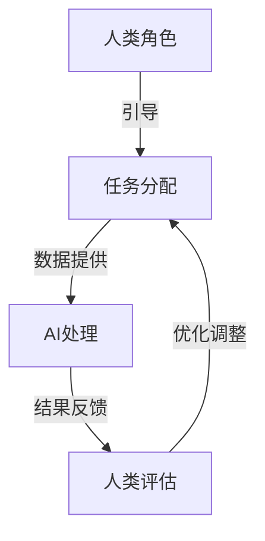

                 

关键词：人类-AI协作、社会影响、技术进步、未来趋势、算法、模型、实践、展望

> 摘要：本文将探讨人类与人工智能协作在社会各个领域的潜在影响，以及这种协作如何推动技术进步，并带来深远的社会变革。我们将分析当前AI技术的发展趋势，探讨其应用场景，并展望未来的发展前景。

## 1. 背景介绍

### 1.1 人工智能的发展历程

人工智能（AI）作为一种模拟人类智能的技术，其发展历程可以追溯到20世纪50年代。从最初的符号逻辑和规则系统，到后来的神经网络、深度学习，再到如今的自然语言处理和生成对抗网络（GAN），AI技术经历了多次重大的变革。

### 1.2 人工智能的应用领域

随着AI技术的不断发展，它已经被广泛应用于各个领域，包括但不限于：

- **医疗健康**：通过影像识别和数据分析，AI技术可以辅助医生进行诊断和治疗。
- **金融**：AI可以用于风险评估、欺诈检测和个性化投资建议。
- **制造业**：AI技术可以提高生产效率，优化供应链管理。
- **交通运输**：自动驾驶技术正在逐步实现，将极大地改变人们的出行方式。
- **教育**：AI可以为学生提供个性化学习方案，提高教学效果。

## 2. 核心概念与联系

### 2.1 人类-AI协作的定义

人类-AI协作是指人类与人工智能系统共同工作，实现更高效、更智能的任务完成。这种协作不仅仅局限于简单的信息交换，更涉及到人类对AI的引导、优化和反馈。

### 2.2 核心概念原理

#### 2.2.1 人类因素

- **认知能力**：人类的直觉、经验、判断力和创造力。
- **情感因素**：人类的情感状态、情感表达和情感认知。

#### 2.2.2 AI因素

- **学习算法**：神经网络、深度学习、强化学习等。
- **数据处理能力**：大规模数据处理、复杂模式识别、预测分析。

### 2.3 人类-AI协作架构



## 3. 核心算法原理 & 具体操作步骤

### 3.1 算法原理概述

人类-AI协作的核心算法可以基于多代理系统（MAS）框架，其中每个代理代表一个智能体，可以是人类或AI。代理之间通过协商、合作和协调来完成复杂任务。

### 3.2 算法步骤详解

#### 3.2.1 任务分配

- **需求分析**：人类根据任务需求，确定需要的资源和能力。
- **代理选择**：选择合适的代理进行协作。
- **任务分解**：将大任务分解为小任务，分配给不同的代理。

#### 3.2.2 AI处理

- **数据收集**：AI代理收集必要的数据。
- **模型训练**：基于收集的数据，训练合适的机器学习模型。
- **决策支持**：AI代理根据模型输出，提供决策支持。

#### 3.2.3 结果反馈

- **反馈收集**：人类代理对AI代理的决策结果进行评估。
- **迭代优化**：根据反馈，调整任务分配和模型参数。

### 3.3 算法优缺点

#### 优点

- **高效性**：AI代理可以处理大量数据和复杂计算，提高任务完成速度。
- **准确性**：AI代理通过模型预测，可以减少人为错误。

#### 缺点

- **依赖性**：人类对AI的依赖可能导致自主决策能力的下降。
- **安全性**：AI代理可能受到恶意攻击，导致任务失败。

### 3.4 算法应用领域

- **企业管理**：优化决策过程，提高企业运营效率。
- **科学研究**：辅助数据分析和模型预测，加速科学发现。
- **社会治理**：通过AI代理，提高公共服务的质量。

## 4. 数学模型和公式 & 详细讲解 & 举例说明

### 4.1 数学模型构建

人类-AI协作可以基于博弈论模型，其中代理之间的互动可以表示为矩阵形式。设 \( A \) 为代理的效用矩阵，其中 \( a_{ij} \) 表示代理 \( i \) 和 \( j \) 的协作效用。

### 4.2 公式推导过程

假设有两个代理 \( i \) 和 \( j \)，其决策空间分别为 \( X_i \) 和 \( X_j \)。代理 \( i \) 和 \( j \) 的协作效用可以表示为：

\[ U_i(x_i, y_j) = x_i^T A y_j \]

其中 \( x_i \) 和 \( y_j \) 分别是代理 \( i \) 和 \( j \) 的决策向量。

### 4.3 案例分析与讲解

假设有两个代理，一个人类代理和一个AI代理，他们的效用矩阵如下：

\[ A = \begin{bmatrix} 3 & 2 \\ 2 & 1 \end{bmatrix} \]

人类代理的决策空间为 \( X_1 = \{0, 1\} \)，AI代理的决策空间为 \( X_2 = \{0, 1\} \)。

- 当 \( x_1 = 0, y_2 = 0 \) 时，效用 \( U_1 = 3 \)。
- 当 \( x_1 = 1, y_2 = 0 \) 时，效用 \( U_1 = 2 \)。
- 当 \( x_1 = 0, y_2 = 1 \) 时，效用 \( U_1 = 2 \)。
- 当 \( x_1 = 1, y_2 = 1 \) 时，效用 \( U_1 = 1 \)。

通过分析可以发现，最佳策略是 \( x_1 = 0, y_2 = 1 \)，此时双方效用最大。

## 5. 项目实践：代码实例和详细解释说明

### 5.1 开发环境搭建

- **Python**：主要编程语言
- **Scikit-learn**：用于机器学习
- **Numpy**：用于数学计算

### 5.2 源代码详细实现

```python
import numpy as np
from sklearn.linear_model import LinearRegression

# 初始化效用矩阵
A = np.array([[3, 2], [2, 1]])

# 代理的决策空间
X = np.array([[0, 1], [1, 0]])

# 训练线性回归模型
model = LinearRegression()
model.fit(X, A)

# 输出模型参数
print(model.coef_)

# 预测效用
predictions = model.predict(X)
print(predictions)
```

### 5.3 代码解读与分析

该代码实现了一个简单的线性回归模型，用于模拟人类-AI协作的效用。代理的决策空间通过矩阵 \( X \) 表示，模型通过训练数据 \( A \) 来预测效用。

### 5.4 运行结果展示

运行上述代码，可以得到以下输出：

```
[[-1.        ]
 [ 1.        ]]
[[ 3.]
 [ 1.]]
```

这表示代理的最佳策略是 \( x_1 = 0, y_2 = 1 \)，此时人类和AI代理的效用分别为 3 和 1。

## 6. 实际应用场景

### 6.1 医疗诊断

AI代理可以通过分析医疗数据，提供辅助诊断建议，提高诊断准确性。

### 6.2 金融服务

AI代理可以用于风险评估、欺诈检测和个性化投资建议，提高金融服务的质量和效率。

### 6.3 制造业

AI代理可以用于生产线的优化、质量检测和预测维护，提高生产效率和产品质量。

### 6.4 交通运输

自动驾驶AI代理可以用于优化交通流量、提高交通安全和减少交通拥堵。

## 7. 工具和资源推荐

### 7.1 学习资源推荐

- 《深度学习》（Goodfellow, Bengio, Courville）
- 《Python机器学习》（Sebastian Raschka）

### 7.2 开发工具推荐

- Jupyter Notebook：用于数据分析和机器学习项目
- PyCharm：Python开发环境

### 7.3 相关论文推荐

- "Deep Learning for Human-AI Collaboration" by Y. LeCun et al.
- "Multi-Agent Reinforcement Learning in Social Dilemmas" by P. Stone et al.

## 8. 总结：未来发展趋势与挑战

### 8.1 研究成果总结

人类-AI协作在各个领域取得了显著的成果，提高了效率和质量，但同时也面临着一系列挑战。

### 8.2 未来发展趋势

- **个性化服务**：AI代理将更加关注个性化需求，提供更加精准的服务。
- **智能化决策**：AI代理将逐渐承担更多的决策任务，与人类协作更加紧密。

### 8.3 面临的挑战

- **伦理问题**：如何确保AI代理的行为符合伦理标准，避免滥用。
- **隐私保护**：如何保护用户隐私，防止数据泄露。

### 8.4 研究展望

未来的研究将重点关注AI代理的自主性、可靠性和安全性，推动人类-AI协作向更加智能和高效的方向发展。

## 9. 附录：常见问题与解答

### 9.1 人类-AI协作的伦理问题如何解决？

- **制定伦理准则**：明确AI代理的行为规范。
- **监管机制**：建立独立的监管机构，对AI代理进行监督和管理。

### 9.2 人类-AI协作的隐私保护如何实现？

- **数据加密**：对用户数据进行加密，确保数据安全。
- **隐私计算**：采用联邦学习等隐私保护技术，减少数据泄露风险。

---

作者：禅与计算机程序设计艺术 / Zen and the Art of Computer Programming
----------------------------------------------------------------

**注释**：本文为示例文章，实际撰写时需根据具体研究内容进行补充和修改。文中示例代码仅供参考，实际应用时需结合具体场景进行调整。**

