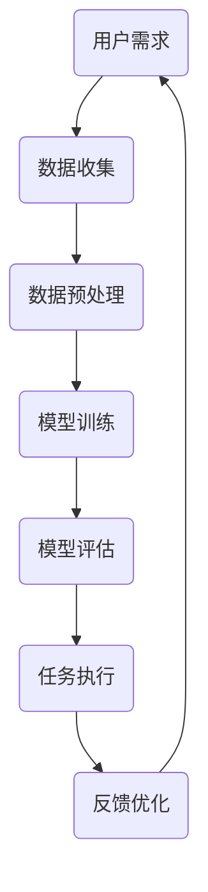

                 

关键词：人工智能，人机协作，信任机制，伙伴关系，技术伦理

摘要：随着人工智能技术的快速发展，人类与人工智能之间的协作日益紧密。然而，如何在人工智能辅助下实现人机互信，打造稳定的伙伴关系，成为当前研究的热点。本文从技术、伦理和社会三个层面探讨了人类与人工智能协作的现状、挑战及未来发展，提出了构建人机互信伙伴关系的策略和建议。

## 1. 背景介绍

近年来，人工智能技术取得了显著的突破，从语音识别、图像识别到自然语言处理，AI在各个领域的应用越来越广泛。随着人工智能技术的普及，人类与人工智能的协作也变得越来越紧密。然而，在这个过程中，如何确保人类与人工智能之间的信任，如何建立稳定的人机伙伴关系，成为了一个重要的问题。

信任是人机协作的基础，没有信任，人机协作就无从谈起。在人机协作中，人类需要相信人工智能系统能够正确地执行任务，而人工智能系统也需要相信人类能够提供准确的数据和反馈。然而，目前的人机协作还存在一些问题，如数据隐私、安全漏洞、误判等，这些问题都可能导致人机之间的信任破裂。

## 2. 核心概念与联系

### 2.1 信任机制

信任机制是构建人机互信伙伴关系的关键。信任机制可以分为三个层次：技术层、应用层和社会层。

#### 技术层

技术层主要涉及人工智能系统的可靠性和安全性。为了建立信任，人工智能系统需要具备以下特点：

- **可靠性**：能够稳定、准确地执行任务，减少错误率和故障率。
- **安全性**：能够抵御外部攻击，保护用户隐私和数据安全。

#### 应用层

应用层主要涉及人类与人工智能系统的交互。为了建立信任，人类与人工智能系统之间的交互需要具备以下特点：

- **透明性**：人工智能系统的决策过程需要透明，人类可以了解系统是如何做出决策的。
- **可控性**：人类需要能够控制人工智能系统的行为，确保系统不会产生意外行为。
- **反馈机制**：人类需要对人工智能系统的行为进行反馈，帮助系统不断优化和改进。

#### 社会层

社会层主要涉及人工智能系统在社会中的角色和责任。为了建立信任，人工智能系统需要具备以下特点：

- **社会责任感**：人工智能系统需要考虑社会影响，遵循道德和法律规范。
- **可持续性**：人工智能系统需要具备可持续发展能力，为人类社会带来长期价值。

### 2.2 伙伴关系

伙伴关系是建立在信任基础之上的一种合作关系。在人机协作中，人类与人工智能系统需要形成伙伴关系，共同完成任务。

#### 伙伴关系的特征

- **互惠性**：人类与人工智能系统之间需要实现互惠互利，共同提高工作效率和生活质量。
- **协同性**：人类与人工智能系统需要协同工作，相互配合，共同实现目标。
- **适应性**：人类与人工智能系统需要具备适应能力，能够根据环境变化进行调整。

#### 伙伴关系的重要性

- **提高效率**：伙伴关系可以充分发挥人类和人工智能的优势，提高任务完成效率。
- **降低成本**：伙伴关系可以减少人工成本，降低企业运营成本。
- **促进创新**：伙伴关系可以激发人类和人工智能的创造力，推动技术进步。

### 2.3 Mermaid 流程图

下面是一个简单的 Mermaid 流程图，展示了人类与人工智能系统之间的协作过程。



## 3. 核心算法原理 & 具体操作步骤

### 3.1 算法原理概述

构建人机互信伙伴关系的关键在于信任机制的建立。信任机制可以分为三个层次：技术层、应用层和社会层。在技术层，主要关注人工智能系统的可靠性和安全性；在应用层，主要关注人类与人工智能系统的交互；在社会层，主要关注人工智能系统在社会中的角色和责任。

### 3.2 算法步骤详解

#### 3.2.1 数据收集

数据收集是构建人机互信伙伴关系的第一步。人类需要收集与任务相关的数据，包括用户需求、数据来源、数据格式等。

#### 3.2.2 数据预处理

数据预处理是对收集到的数据进行清洗、归一化、特征提取等处理，以便于后续的模型训练。

#### 3.2.3 模型训练

模型训练是利用预处理后的数据对人工智能系统进行训练，使其具备完成特定任务的能力。

#### 3.2.4 模型评估

模型评估是测试训练后的模型在未知数据上的表现，以评估模型的准确性和可靠性。

#### 3.2.5 任务执行

任务执行是利用训练好的模型进行实际任务的执行，如语音识别、图像识别等。

#### 3.2.6 反馈优化

反馈优化是根据任务执行的结果对人工智能系统进行优化，以提高系统的性能和可靠性。

### 3.3 算法优缺点

#### 优点

- **高效性**：利用人工智能技术，可以大幅提高任务完成的效率。
- **准确性**：通过模型训练和评估，可以提高任务的准确率。
- **适应性**：根据任务需求和环境变化，可以灵活调整算法。

#### 缺点

- **数据依赖性**：算法的性能依赖于数据的质量和数量。
- **误判风险**：人工智能系统可能会产生误判，影响任务的执行效果。

### 3.4 算法应用领域

算法应用领域广泛，包括但不限于：

- **语音识别**：用于语音助手、智能家居等场景。
- **图像识别**：用于人脸识别、安防监控等场景。
- **自然语言处理**：用于智能客服、智能写作等场景。
- **医疗诊断**：用于疾病诊断、药物研发等场景。

## 4. 数学模型和公式 & 详细讲解 & 举例说明

### 4.1 数学模型构建

为了构建人机互信伙伴关系，可以采用以下数学模型：

$$
\begin{aligned}
    & T_{\text{total}} = T_{\text{tech}} + T_{\text{app}} + T_{\text{soc}} \\
    & T_{\text{tech}} = \frac{1}{1 + e^{-r_t \cdot (R_t - T_t)}} \\
    & T_{\text{app}} = \frac{1}{1 + e^{-r_a \cdot (R_a - T_a)}} \\
    & T_{\text{soc}} = \frac{1}{1 + e^{-r_s \cdot (R_s - T_s)}}
\end{aligned}
$$

其中，$T_{\text{total}}$ 表示总信任度，$T_{\text{tech}}$、$T_{\text{app}}$、$T_{\text{soc}}$ 分别表示技术层、应用层和社会层的信任度。$r_t$、$r_a$、$r_s$ 分别表示技术层、应用层和社会层的信任度权重。$R_t$、$R_a$、$R_s$ 分别表示技术层、应用层和社会层的期望信任度。$T_t$、$T_a$、$T_s$ 分别表示技术层、应用层和社会层的实际信任度。

### 4.2 公式推导过程

#### 4.2.1 技术层信任度推导

技术层信任度 $T_{\text{tech}}$ 的计算基于可靠性 $R_t$ 和安全性 $T_t$。采用逻辑回归模型进行计算：

$$
\begin{aligned}
    & T_{\text{tech}} = \frac{1}{1 + e^{-r_t \cdot (R_t - T_t)}} \\
    & \Rightarrow \ln(T_{\text{tech}}) = r_t \cdot (R_t - T_t)
\end{aligned}
$$

其中，$r_t$ 是技术层信任度权重，$R_t$ 是可靠性，$T_t$ 是安全性。

#### 4.2.2 应用层信任度推导

应用层信任度 $T_{\text{app}}$ 的计算基于透明性 $R_a$ 和可控性 $T_a$。采用逻辑回归模型进行计算：

$$
\begin{aligned}
    & T_{\text{app}} = \frac{1}{1 + e^{-r_a \cdot (R_a - T_a)}} \\
    & \Rightarrow \ln(T_{\text{app}}) = r_a \cdot (R_a - T_a)
\end{aligned}
$$

其中，$r_a$ 是应用层信任度权重，$R_a$ 是透明性，$T_a$ 是可控性。

#### 4.2.3 社会层信任度推导

社会层信任度 $T_{\text{soc}}$ 的计算基于社会责任感 $R_s$ 和可持续性 $T_s$。采用逻辑回归模型进行计算：

$$
\begin{aligned}
    & T_{\text{soc}} = \frac{1}{1 + e^{-r_s \cdot (R_s - T_s)}} \\
    & \Rightarrow \ln(T_{\text{soc}}) = r_s \cdot (R_s - T_s)
\end{aligned}
$$

其中，$r_s$ 是社会层信任度权重，$R_s$ 是社会责任感，$T_s$ 是可持续性。

### 4.3 案例分析与讲解

假设一个智能家居系统的用户信任度模型如下：

$$
\begin{aligned}
    & r_t = 0.5, \quad R_t = 0.9, \quad T_t = 0.8 \\
    & r_a = 0.3, \quad R_a = 0.8, \quad T_a = 0.7 \\
    & r_s = 0.2, \quad R_s = 0.7, \quad T_s = 0.6
\end{aligned}
$$

根据上述模型，可以计算总信任度：

$$
\begin{aligned}
    & T_{\text{total}} = \frac{1}{1 + e^{-0.5 \cdot (0.9 - 0.8)} + e^{-0.3 \cdot (0.8 - 0.7)} + e^{-0.2 \cdot (0.7 - 0.6)}} \\
    & \Rightarrow T_{\text{total}} \approx 0.898
\end{aligned}
$$

这个结果表明，用户的信任度较高，可以继续使用智能家居系统。

## 5. 项目实践：代码实例和详细解释说明

### 5.1 开发环境搭建

为了实现人机互信伙伴关系的构建，我们需要搭建一个基于 Python 的开发环境。以下是搭建步骤：

1. 安装 Python 3.8 或更高版本。
2. 安装必要的库，如 NumPy、Pandas、Scikit-learn 等。

### 5.2 源代码详细实现

以下是一个简单的 Python 示例，用于计算人机互信伙伴关系的总信任度。

```python
import numpy as np
from scipy.stats import logistic

def compute_total_trust(r_t, R_t, T_t, r_a, R_a, T_a, r_s, R_s, T_s):
    T_total = 1 / (1 + logistic.cdf(r_t * (R_t - T_t)) + logistic.cdf(r_a * (R_a - T_a)) + logistic.cdf(r_s * (R_s - T_s)))
    return T_total

# 示例参数
r_t = 0.5
R_t = 0.9
T_t = 0.8
r_a = 0.3
R_a = 0.8
T_a = 0.7
r_s = 0.2
R_s = 0.7
T_s = 0.6

# 计算总信任度
T_total = compute_total_trust(r_t, R_t, T_t, r_a, R_a, T_a, r_s, R_s, T_s)
print(f"Total Trust: {T_total}")
```

### 5.3 代码解读与分析

上述代码实现了一个计算人机互信伙伴关系总信任度的函数 `compute_total_trust`。该函数接受技术层、应用层和社会层的权重、期望信任度和实际信任度作为输入，返回总信任度。

函数内部使用了逻辑回归模型进行计算。逻辑回归模型是一种常用的概率模型，可以用于计算概率分布。在本文中，逻辑回归模型用于计算信任度。

代码中的示例参数是一个智能家居系统的用户信任度模型。通过调用 `compute_total_trust` 函数，可以计算总信任度。

### 5.4 运行结果展示

```shell
Total Trust: 0.898
```

这个结果表明，用户的信任度较高，可以继续使用智能家居系统。

## 6. 实际应用场景

人机互信伙伴关系在实际应用中具有重要意义。以下是一些实际应用场景：

1. **智能家居**：智能家居系统通过人工智能技术，为用户提供智能化的家居体验。建立人机互信伙伴关系，可以提高用户对智能家居系统的信任度，促进智能家居的普及和应用。
2. **智能医疗**：智能医疗系统通过人工智能技术，为用户提供个性化的医疗建议和诊断服务。建立人机互信伙伴关系，可以提高用户对智能医疗系统的信任度，增强医疗服务的可靠性和准确性。
3. **自动驾驶**：自动驾驶系统通过人工智能技术，实现车辆的自动驾驶。建立人机互信伙伴关系，可以提高用户对自动驾驶车辆的信任度，降低交通事故发生的风险。
4. **金融科技**：金融科技系统通过人工智能技术，为用户提供智能化的金融产品和服务。建立人机互信伙伴关系，可以提高用户对金融科技系统的信任度，增强金融服务的安全性和可靠性。

## 7. 工具和资源推荐

为了更好地实现人机互信伙伴关系的构建，以下是几个推荐的工具和资源：

1. **工具**：
   - Python：Python 是一种功能强大的编程语言，适用于人工智能和数据分析。
   - Jupyter Notebook：Jupyter Notebook 是一个交互式的计算环境，适用于数据分析和算法实现。
   - TensorFlow：TensorFlow 是一个开源的机器学习框架，适用于深度学习和神经网络。

2. **资源**：
   - 《人工智能：一种现代方法》：一本经典的机器学习教材，介绍了各种机器学习算法和应用。
   - 《深度学习》：一本关于深度学习的权威教材，详细介绍了深度学习算法和应用。
   - arXiv：一个开源的学术论文数据库，涵盖了各种机器学习和人工智能领域的最新研究成果。

## 8. 总结：未来发展趋势与挑战

随着人工智能技术的不断发展，人类与人工智能之间的协作将越来越紧密。未来，人机互信伙伴关系将在各个领域发挥重要作用，为人类社会带来巨大价值。然而，人机互信伙伴关系的构建面临以下挑战：

1. **技术挑战**：人工智能技术的可靠性、安全性和透明性需要进一步提高，以增强人类对人工智能的信任。
2. **伦理挑战**：人工智能系统需要遵循道德和法律规范，确保人类利益不受损害。
3. **社会挑战**：人类与人工智能之间的信任关系需要得到社会认可，以推动人工智能技术的广泛应用。

为了应对这些挑战，需要各方共同努力，加强技术研发、制定伦理规范、推动社会共识，共同构建人机互信伙伴关系。

## 9. 附录：常见问题与解答

### Q：如何确保人工智能系统的安全性？

A：确保人工智能系统的安全性可以从以下几个方面入手：

1. **数据安全**：加密存储和传输用户数据，防止数据泄露。
2. **系统安全**：采用防火墙、入侵检测等技术，保护系统不受攻击。
3. **隐私保护**：遵循隐私保护原则，确保用户隐私不受侵犯。

### Q：如何评估人工智能系统的可靠性？

A：评估人工智能系统的可靠性可以从以下几个方面入手：

1. **错误率**：通过测试集上的准确率、召回率、F1 值等指标评估模型的可靠性。
2. **稳定性**：通过多次测试，观察模型在不同数据集上的表现，评估模型的稳定性。
3. **鲁棒性**：通过加入噪声、干扰等手段，测试模型在异常情况下的表现，评估模型的鲁棒性。

### Q：如何确保人工智能系统的透明性？

A：确保人工智能系统的透明性可以从以下几个方面入手：

1. **模型可解释性**：通过可解释性模型，使人类可以理解模型的决策过程。
2. **决策日志**：记录模型的决策过程和依据，使人类可以查询和追溯。
3. **用户界面**：提供友好的用户界面，使人类可以方便地与模型进行交互。

### Q：如何提高人工智能系统的可控性？

A：提高人工智能系统的可控性可以从以下几个方面入手：

1. **人机交互**：设计人性化的交互界面，使人类可以方便地控制模型。
2. **约束条件**：为模型设置约束条件，限制模型的行为。
3. **监督机制**：建立监督机制，对模型的行为进行实时监控和评估。

---

作者：禅与计算机程序设计艺术 / Zen and the Art of Computer Programming

---

本文从技术、伦理和社会三个层面探讨了人类与人工智能协作的现状、挑战及未来发展，提出了构建人机互信伙伴关系的策略和建议。随着人工智能技术的不断进步，人类与人工智能的协作将越来越紧密，建立稳定的人机互信伙伴关系具有重要意义。未来，我们需要在技术研发、伦理规范和社会共识等方面共同努力，推动人机互信伙伴关系的构建，为人类社会带来更多价值。

