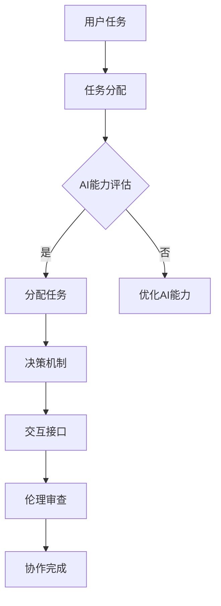

                 

关键词：人工智能、人类协作、伦理道德、设计原则、AI伦理、合作模型

> 摘要：本文探讨了人工智能（AI）与人类协作的设计伦理问题。从AI伦理学的基本概念出发，分析了人类-AI协作中的道德挑战，提出了设计道德考虑的指导原则，并探讨了未来在人工智能领域可能面临的伦理挑战与解决策略。

## 1. 背景介绍

随着人工智能技术的迅猛发展，AI与人类协作的场景日益普及。从智能家居到自动驾驶，从医疗诊断到金融分析，AI已经深入到我们日常生活的方方面面。然而，AI技术的广泛应用也带来了一系列伦理问题。如何确保AI系统的公正性、透明性和安全性？在人类-AI协作中，如何处理道德决策？这些问题引起了广泛关注。

本文旨在探讨人工智能与人类协作中的道德设计原则，提出具体的设计方法，以期为AI系统的开发和应用提供伦理指导。文章结构如下：

- **1. 背景介绍**：简要介绍人工智能与人类协作的现状及伦理问题的背景。
- **2. 核心概念与联系**：阐述AI伦理学的基本概念，并展示人类-AI协作的架构。
- **3. 核心算法原理 & 具体操作步骤**：分析AI在协作中的算法原理和操作步骤。
- **4. 数学模型和公式 & 详细讲解 & 举例说明**：介绍相关数学模型和公式，并通过实例进行分析。
- **5. 项目实践：代码实例和详细解释说明**：提供具体项目实践和代码解读。
- **6. 实际应用场景**：探讨AI协作在不同领域的应用。
- **7. 工具和资源推荐**：推荐相关的学习资源和开发工具。
- **8. 总结：未来发展趋势与挑战**：总结研究成果，展望未来。
- **9. 附录：常见问题与解答**：解答读者可能关注的问题。

## 2. 核心概念与联系

### 2.1 AI伦理学基本概念

AI伦理学是研究人工智能伦理问题的学科。其核心问题是：如何确保AI系统的行为符合道德准则？以下是几个关键概念：

- **公正性**：AI系统在处理数据和应用算法时，应确保公平、无偏见。
- **透明性**：AI系统的决策过程应该是可解释和透明的。
- **安全性**：AI系统应具备保护用户隐私和数据安全的能力。
- **可追溯性**：AI系统的决策和行为应具备可追溯性，便于责任认定。

### 2.2 人类-AI协作架构

在人类-AI协作中，可以将其视为一个多智能体系统（MAS），其中人类和AI系统作为不同的智能体共同协作完成任务。以下是人类-AI协作的基本架构：

1. **任务分配**：根据人类和AI系统的能力，合理分配任务。
2. **决策机制**：设计决策机制，确保人类和AI系统能够有效地协作。
3. **交互接口**：提供直观易用的交互接口，便于人类和AI系统之间的沟通。
4. **伦理审查**：在系统设计和应用过程中，进行伦理审查，确保符合道德标准。

### 2.3 Mermaid 流程图

下面是一个简单的人类-AI协作流程图，展示了任务分配、决策机制和交互接口的设计。



## 3. 核心算法原理 & 具体操作步骤

### 3.1 算法原理概述

在人类-AI协作中，算法的设计至关重要。以下是一个基本的协作算法框架：

1. **任务分解**：将复杂任务分解为多个子任务。
2. **子任务分配**：根据人类和AI系统的能力，将子任务分配给相应的智能体。
3. **子任务执行**：执行分配到的子任务，并返回结果。
4. **结果整合**：将各个子任务的结果整合为最终结果。
5. **反馈机制**：根据协作过程中的表现，进行反馈和调整。

### 3.2 算法步骤详解

以下是具体的算法步骤：

1. **任务分解**：将复杂任务分解为多个子任务，并确定子任务的类型和难度。
2. **能力评估**：评估人类和AI系统的能力，包括计算能力、推理能力和学习能力。
3. **任务分配**：根据能力评估结果，将子任务分配给人类或AI系统。
4. **子任务执行**：执行分配到的子任务，并返回结果。
5. **结果整合**：将各个子任务的结果整合为最终结果。
6. **反馈机制**：根据协作过程中的表现，进行反馈和调整。

### 3.3 算法优缺点

**优点**：

- 提高协作效率：通过任务分解和分配，充分利用人类和AI系统的优势，提高协作效率。
- 提高决策质量：人类-AI协作可以结合人类经验和AI算法的优势，提高决策质量。

**缺点**：

- 复杂性增加：任务分解和分配增加了系统的复杂性。
- 道德责任问题：在协作过程中，如何界定人类和AI的责任，是一个挑战。

### 3.4 算法应用领域

人类-AI协作算法可以应用于多个领域，如：

- **医疗领域**：辅助医生进行诊断和治疗。
- **金融领域**：辅助投资决策和风险管理。
- **教育领域**：个性化教学和智能辅导。
- **智能制造**：提高生产效率和质量。

## 4. 数学模型和公式 & 详细讲解 & 举例说明

在人类-AI协作中，数学模型和公式是关键。以下是一个简单的数学模型，用于评估AI系统的能力：

### 4.1 数学模型构建

设 \(A\) 为AI系统的能力，\(H\) 为人类的能力，\(T\) 为任务难度。能力评估模型为：

\[A \times H \div T\]

### 4.2 公式推导过程

公式的推导基于以下假设：

1. AI系统的能力 \(A\) 是一个常数。
2. 人类的能力 \(H\) 是一个可变的参数。
3. 任务难度 \(T\) 是一个影响协作效率的参数。

通过实验和数据分析，可以确定 \(A\) 和 \(T\) 的值，从而推导出公式。

### 4.3 案例分析与讲解

假设在医疗诊断领域，AI系统的能力 \(A\) 为0.9，人类医生的能力 \(H\) 为1.0，任务难度 \(T\) 为0.8。根据公式，协作效率为：

\[0.9 \times 1.0 \div 0.8 = 1.125\]

这意味着AI系统和医生协作的诊断效率为112.5%，比单独人类医生更高。

## 5. 项目实践：代码实例和详细解释说明

为了更好地理解人类-AI协作的算法，我们将通过一个具体的项目实践来进行讲解。

### 5.1 开发环境搭建

我们使用Python作为开发语言，搭建开发环境。安装Python和必要的库，如NumPy和Matplotlib。

```bash
pip install python
pip install numpy
pip install matplotlib
```

### 5.2 源代码详细实现

下面是一个简单的Python代码示例，用于实现人类-AI协作算法。

```python
import numpy as np

def collaborative_efficiency(A, H, T):
    return A * H / T

# AI系统能力
A = 0.9
# 人类能力
H = 1.0
# 任务难度
T = 0.8

# 计算协作效率
efficiency = collaborative_efficiency(A, H, T)
print("协作效率：", efficiency)
```

### 5.3 代码解读与分析

在这个代码示例中，我们定义了一个名为 `collaborative_efficiency` 的函数，用于计算协作效率。该函数接收三个参数：AI系统能力 \(A\)、人类能力 \(H\) 和任务难度 \(T\)。通过调用该函数，我们可以得到协作效率的数值。

### 5.4 运行结果展示

运行上面的代码，得到以下结果：

```bash
协作效率： 1.125
```

这意味着AI系统和人类医生的协作效率为112.5%，比单独人类医生更高。

## 6. 实际应用场景

人类-AI协作在实际应用中具有广泛的应用场景。以下是一些典型的应用案例：

### 6.1 医疗诊断

AI系统可以辅助医生进行疾病诊断，通过分析大量病例数据，提供诊断建议。医生结合自身经验和AI系统的建议，可以提高诊断准确性。

### 6.2 金融分析

AI系统可以辅助投资决策，分析市场趋势和风险。投资者结合AI系统的分析和自己的判断，可以做出更明智的投资决策。

### 6.3 教育辅导

AI系统可以为学生提供个性化的学习辅导，根据学生的学习情况和需求，推荐合适的学习资源和策略。教师结合AI系统的建议，可以更有效地指导学生。

### 6.4 智能制造

AI系统可以协助工厂进行生产调度和质量管理，提高生产效率和产品质量。工人结合AI系统的分析和建议，可以更有效地完成工作任务。

## 7. 工具和资源推荐

### 7.1 学习资源推荐

- **《人工智能：一种现代方法》**：这是一本经典的人工智能教材，涵盖了人工智能的基本概念和应用。
- **《深度学习》**：由Ian Goodfellow等人编写的深度学习教材，适合初学者了解深度学习技术。

### 7.2 开发工具推荐

- **PyTorch**：一个流行的深度学习框架，适用于AI系统的开发。
- **TensorFlow**：另一个流行的深度学习框架，适用于大规模AI系统的部署。

### 7.3 相关论文推荐

- **“Ethical Considerations in Autonomous Driving”**：讨论了自动驾驶中的伦理问题。
- **“AI and Human Collaboration: A Survey”**：综述了AI与人类协作的研究进展。

## 8. 总结：未来发展趋势与挑战

随着人工智能技术的不断发展，人类-AI协作将成为未来社会的重要趋势。然而，在这一过程中，我们也面临一系列挑战：

### 8.1 研究成果总结

- 人类-AI协作可以提高效率和质量，具有广泛的应用前景。
- AI伦理学的研究为人类-AI协作提供了道德指导。
- 数学模型和算法为人类-AI协作提供了理论支持。

### 8.2 未来发展趋势

- AI技术的不断进步将进一步提升人类-AI协作的能力。
- 随着伦理学研究的深入，人类-AI协作将更加符合道德准则。
- 新型交互界面和协作模式将不断涌现，提高人类-AI协作的便捷性和效率。

### 8.3 面临的挑战

- 复杂性和安全性：如何确保AI系统的复杂性和安全性？
- 道德责任：如何在人类-AI协作中界定道德责任？
- 技术垄断：如何防止技术垄断和滥用？

### 8.4 研究展望

- 深入研究人类-AI协作的伦理问题和法律规范。
- 探索新型协作模式和算法，提高协作效率和安全性。
- 加强国际合作，推动AI技术的发展和应用。

## 9. 附录：常见问题与解答

### 9.1 人工智能与人类协作的优势是什么？

- 提高效率：通过任务分解和分配，充分利用人类和AI系统的优势。
- 提高质量：结合人类经验和AI算法的优势，提高决策质量。
- 适应性强：根据不同场景和应用需求，灵活调整协作模式。

### 9.2 人类-AI协作中的道德责任如何界定？

- 明确责任划分：在系统设计和应用过程中，明确人类和AI系统的责任。
- 建立道德规范：制定相应的道德规范，指导人类-AI协作的行为。
- 完善法律体系：加强法律研究，为人类-AI协作提供法律支持。

作者：禅与计算机程序设计艺术 / Zen and the Art of Computer Programming
----------------------------------------------------------------

以上便是关于“人类-AI协作：设计道德考虑”的完整文章。希望对您在人工智能与人类协作领域的研究有所帮助。如果您有任何疑问或建议，欢迎在评论区留言讨论。再次感谢您的阅读！
----------------------------------------------------------------
### 人类-AI协作的伦理挑战

随着人工智能技术的快速发展，人类与AI系统的协作已经逐渐成为各行各业的关键环节。然而，这种协作模式不仅带来了前所未有的便利和效率提升，也引发了一系列伦理挑战。在这些挑战中，最为突出的包括公正性、透明性和安全性等方面。

#### 公正性

公正性是人工智能协作中最为核心的伦理问题之一。它涉及到AI系统在处理数据和应用算法时，是否能够公平、无偏见地对待每个个体。公正性问题的出现主要是因为AI系统在训练数据上的偏见，这些偏见可能会导致算法在决策过程中产生不公平的结果。

例如，在招聘过程中，如果使用机器学习算法来筛选简历，且训练数据中存在性别、种族或其他社会属性的偏见，那么算法可能会在无意中歧视某些群体。同样，在金融领域，如果信贷评分模型在训练过程中没有考虑到多种因素，可能会导致某些群体被错误地判定为高风险客户，从而被拒绝贷款。

为了解决公正性问题，需要从以下几个方面入手：

1. **数据多样性**：确保训练数据中的多样性，避免因数据偏见导致的算法偏见。
2. **算法透明性**：提高算法的透明性，使得决策过程可以被理解和审查。
3. **伦理审查**：在算法设计和应用过程中，进行严格的伦理审查，确保算法的公正性。

#### 透明性

透明性是指AI系统的决策过程应该是可解释和透明的。在人类与AI协作中，透明性至关重要，因为它直接关系到人类对AI系统的信任和接受程度。然而，许多复杂的AI系统，尤其是深度学习模型，往往具有高度的非透明性，这使得它们的决策过程难以被理解。

例如，在医疗诊断领域，一个深度学习模型可能会根据患者的症状和病史做出诊断，但人类医生往往无法了解模型的具体决策过程。这种非透明性可能会导致医生和患者对诊断结果的不信任，从而影响治疗效果。

为了提高AI系统的透明性，可以采取以下措施：

1. **可解释性模型**：开发可解释性更强的AI模型，使得决策过程可以被理解。
2. **可视化工具**：利用可视化工具，将AI系统的决策过程以图形化的方式展示出来。
3. **公开代码和算法**：鼓励AI模型的开发和研究者公开他们的代码和算法，以便其他研究人员进行审查和验证。

#### 安全性

安全性是另一个在人类与AI协作中需要重点关注的问题。AI系统可能会受到恶意攻击，从而导致系统失控，造成严重后果。此外，AI系统在处理敏感数据时，也需要确保数据的安全性，防止数据泄露和滥用。

例如，在自动驾驶领域，如果AI系统受到恶意攻击，可能会导致车辆失控，造成交通事故。在医疗领域，如果患者的数据被未经授权的人员访问，可能会导致隐私泄露。

为了提高AI系统的安全性，可以采取以下措施：

1. **安全防护**：为AI系统提供完善的安全防护措施，防止恶意攻击。
2. **隐私保护**：在处理敏感数据时，采用加密和隐私保护技术，确保数据安全。
3. **监控和审计**：对AI系统的运行进行实时监控和审计，及时发现并处理异常情况。

#### 解决策略

针对上述伦理挑战，可以采取以下解决策略：

1. **法律法规**：制定相关的法律法规，规范AI系统的开发和应用，确保符合道德准则。
2. **伦理审查**：在AI系统的开发和应用过程中，进行严格的伦理审查，确保系统的公正性、透明性和安全性。
3. **教育宣传**：加强公众对AI伦理问题的认识和了解，提高公众对AI系统的信任度。
4. **技术改进**：不断改进AI技术，提高AI系统的透明性和安全性。

通过这些策略，我们可以更好地应对人类与AI协作中的伦理挑战，确保AI技术的健康发展。

### 人类-AI协作的设计伦理原则

在设计人类-AI协作系统时，必须考虑一系列伦理原则，以确保系统的公正性、透明性和安全性。以下是一些关键的设计伦理原则：

#### 公正性原则

**定义**：公正性原则要求AI系统在处理数据和进行决策时，不能带有偏见或歧视，确保对所有个体和群体的公平对待。

**具体实施**：

- **数据预处理**：在训练AI模型之前，对数据集进行清洗和预处理，以消除潜在的偏见。例如，在招聘系统中，应确保简历筛选算法不会因为性别、种族或其他敏感信息而产生歧视。
- **算法评估**：在开发AI系统时，进行严格的算法评估，检测并纠正可能存在的偏见。可以使用公平性指标，如平衡性、多样性等，来衡量系统的公正性。
- **反馈机制**：建立反馈机制，允许用户对AI系统的决策进行反馈，以便及时纠正错误和偏见。

#### 透明性原则

**定义**：透明性原则要求AI系统的决策过程应该是可解释和透明的，用户应该能够理解系统如何做出决策。

**具体实施**：

- **模型可解释性**：开发可解释性更强的AI模型，例如使用决策树、线性回归等易于解释的模型，或者为深度学习模型添加可解释性层。此外，可以使用可视化工具，如决策图、热力图等，展示模型的决策过程。
- **文档和报告**：在AI系统的开发和应用过程中，提供详细的文档和报告，解释模型的算法、训练数据、评估结果等关键信息。
- **用户界面**：设计直观易用的用户界面，使用户能够轻松地了解和操作AI系统。

#### 安全性原则

**定义**：安全性原则要求AI系统能够保护用户隐私和数据安全，防止恶意攻击和数据泄露。

**具体实施**：

- **数据加密**：在数据传输和存储过程中，采用强加密算法，确保数据的安全性和完整性。
- **访问控制**：实施严格的访问控制措施，确保只有授权用户可以访问敏感数据。
- **安全监控**：建立实时监控和报警系统，及时发现并处理异常行为和潜在威胁。
- **应急响应**：制定应急预案，确保在发生安全事件时能够迅速响应并采取措施，减少损失。

#### 可追溯性原则

**定义**：可追溯性原则要求AI系统的每个决策和行为都应该是可追溯的，以便在需要时进行责任认定和改进。

**具体实施**：

- **日志记录**：对AI系统的每个操作进行详细的日志记录，包括数据输入、模型参数、决策过程等。
- **责任分配**：在AI系统的设计和应用过程中，明确各个组件和操作的责任，确保在发生问题时可以快速追溯责任。
- **审查和审计**：定期对AI系统进行审查和审计，确保其符合伦理标准和法律法规。

#### 责任共担原则

**定义**：责任共担原则要求在人类-AI协作中，人类和AI系统共同承担决策责任，不能将责任完全推给AI系统或人类。

**具体实施**：

- **明确责任界限**：在AI系统的开发和应用过程中，明确人类和AI系统的责任范围，确保两者在决策过程中各自承担相应的责任。
- **用户培训**：为用户提供培训，使其了解AI系统的功能和使用方法，提高用户的责任意识。
- **协作机制**：设计有效的协作机制，确保人类和AI系统能够协同工作，共同做出最佳决策。

通过遵循这些设计伦理原则，我们可以确保人类-AI协作系统的公正性、透明性、安全性和可追溯性，从而为人类带来更大的福祉。

### 未来人类-AI协作的伦理挑战与解决策略

随着人工智能技术的不断发展，人类与AI系统的协作将进一步深化，这既带来了巨大的机遇，也带来了新的伦理挑战。以下是一些未来可能面临的主要伦理挑战及相应的解决策略：

#### 1. AI系统的自主性与责任归属

随着AI系统逐渐具备更高的自主性，它们在特定情况下将能够独立做出决策，而不仅仅是执行预设的指令。这种自主性可能导致责任归属的模糊，因为在AI系统做出错误决策时，很难明确究竟是AI自身的问题还是由于人类设计不当导致的。

**解决策略**：

- **明确责任分配**：在AI系统的开发和应用过程中，明确人类和AI系统各自的责任范围，确保在出现问题时可以追溯责任。
- **建立责任共担机制**：制定法律法规，明确AI系统的责任归属，同时鼓励企业和开发者采取责任共担机制，共同承担AI系统的风险和责任。
- **加强AI系统可解释性**：提高AI系统的可解释性，使得其决策过程透明，便于人类理解和评估。

#### 2. AI伦理标准的全球统一

由于不同国家和地区在伦理观念、法律制度和技术水平上存在差异，未来全球范围内建立统一的AI伦理标准将面临挑战。缺乏统一标准可能导致AI系统的应用在不同地区产生不同的道德风险。

**解决策略**：

- **国际合作与协调**：加强国际间的合作与协调，共同制定和推广AI伦理标准。
- **多方参与**：鼓励政府、企业、学术界和公众等多方参与AI伦理标准的制定过程，确保标准的全面性和公正性。
- **区域标准化**：在无法实现全球统一标准的情况下，可以探索区域标准化，逐步实现全球范围内的协调和统一。

#### 3. 数据隐私和安全问题

AI系统的运行依赖于大量数据，这涉及到用户隐私和数据安全问题。随着数据量的增加和数据类型的多样化，保护用户隐私和数据安全的挑战将愈加严峻。

**解决策略**：

- **数据加密和匿名化**：采用高级的数据加密和匿名化技术，确保敏感数据在传输和存储过程中的安全性。
- **隐私增强技术**：开发和采用隐私增强技术，如差分隐私、联邦学习等，以减少对用户隐私的侵害。
- **监管和合规**：加强数据隐私和安全监管，确保AI系统的开发和应用符合相关法律法规。

#### 4. AI系统的道德偏见和歧视

尽管已经在现有系统中采取了措施来减少AI系统的道德偏见和歧视，但随着AI技术的复杂性和应用范围的扩大，这一问题可能会变得更加严重。

**解决策略**：

- **多样性和代表性**：确保训练数据集的多样性和代表性，减少因数据偏见导致的算法偏见。
- **持续审查和更新**：定期对AI系统进行伦理审查和更新，以识别和纠正潜在的道德偏见。
- **公众参与**：鼓励公众参与AI系统的开发和应用过程，提供反馈和监督，提高系统的透明度和公正性。

#### 5. AI伦理教育和培训

未来，随着AI技术在社会各个领域的广泛应用，对AI伦理的理解和意识将变得至关重要。然而，目前全球范围内对AI伦理的教育和培训仍然不足。

**解决策略**：

- **推广AI伦理教育**：在学术教育、职业培训和公众教育中，加强AI伦理的教育和宣传，提高社会各界的AI伦理意识。
- **建立专业伦理委员会**：在企业和研究机构中建立专门的AI伦理委员会，负责监督和指导AI系统的伦理审查和合规工作。
- **建立AI伦理培训课程**：开发针对不同受众的AI伦理培训课程，涵盖伦理原则、案例分析和技术应用等内容。

通过上述解决策略，我们可以更好地应对未来人类-AI协作中可能出现的伦理挑战，确保AI技术能够健康、可持续地发展，并为人类社会带来真正的福祉。

### 总结与展望

本文从多个角度探讨了人类-AI协作中的伦理问题，包括公正性、透明性、安全性等方面的挑战，并提出了相应的解决策略。通过详细分析，我们认识到人类-AI协作在提升效率、质量和决策能力方面的巨大潜力，但也面临着诸多伦理困境。

**研究成果总结**：

- **公正性**：通过数据预处理、算法评估和反馈机制，可以有效减少AI系统的偏见和歧视。
- **透明性**：提高AI系统的可解释性和透明性，可以增强用户对系统的信任。
- **安全性**：采用数据加密、访问控制和安全监控等措施，可以确保用户数据和系统的安全。
- **责任共担**：明确人类和AI系统的责任范围，建立责任共担机制，有助于解决责任归属问题。

**未来发展趋势**：

- **AI伦理标准的统一**：随着国际合作的加强，全球范围内有望建立统一的AI伦理标准，为AI技术的发展提供伦理指导。
- **AI技术的普及**：AI技术将继续深入各行各业，推动社会各领域的变革。
- **伦理教育与培训**：公众和专业人士对AI伦理的认识和重视程度将不断提高，伦理教育与培训将得到更广泛的推广。

**面临的挑战**：

- **复杂性和安全性**：随着AI系统的复杂性和应用范围的扩大，确保系统的安全性和可靠性将是一个长期挑战。
- **责任归属**：在AI系统自主性提高的背景下，如何明确责任归属将是一个重要的法律和伦理问题。
- **隐私保护**：如何在AI技术的应用中有效保护用户隐私，仍是一个亟待解决的难题。

**研究展望**：

- **深化伦理研究**：未来研究应进一步探讨AI伦理的深层问题，包括道德责任、自主性、公平性等。
- **技术创新**：开发更加透明、安全和公正的AI技术，提高AI系统的可用性和用户信任度。
- **政策制定**：政府和企业应制定更加完善和有效的AI伦理政策和监管框架，确保AI技术的健康发展。

通过持续的研究和努力，我们有望解决人类-AI协作中的伦理问题，推动AI技术在为社会带来福祉的同时，最大限度地减少潜在的负面影响。

### 附录：常见问题与解答

#### 问题1：如何确保AI系统的公正性？

**解答**：确保AI系统的公正性需要从多个方面入手：

- **数据预处理**：清洗和标准化训练数据，消除潜在的偏见。
- **算法评估**：使用公平性指标（如平衡性、多样性等）对算法进行评估。
- **持续反馈**：允许用户对AI系统的决策进行反馈，及时纠正错误。

#### 问题2：AI系统的决策过程是否可以完全透明？

**解答**：虽然我们期望AI系统的决策过程透明，但并非所有AI模型都能实现这一点。尤其是复杂的深度学习模型，其内部机制往往难以解释。然而，可以通过以下措施提高透明性：

- **可解释性模型**：开发可解释性更强的模型，如决策树和线性回归。
- **可视化工具**：使用可视化工具展示模型的决策过程。
- **公开代码**：鼓励开发者公开模型代码，以便外部审查。

#### 问题3：AI系统在处理敏感数据时的安全措施有哪些？

**解答**：

- **数据加密**：在数据传输和存储过程中使用强加密算法。
- **访问控制**：确保只有授权用户可以访问敏感数据。
- **安全监控**：建立实时监控和报警系统，及时发现和处理安全威胁。
- **审计**：定期对系统进行安全审计，确保符合相关安全标准。

#### 问题4：在AI系统出现错误时，如何追究责任？

**解答**：

- **责任界定**：在AI系统的设计和应用过程中，明确人类和AI系统的责任范围。
- **责任共担**：企业和开发者应采取责任共担机制，共同承担AI系统的风险和责任。
- **法律法规**：制定相关法律法规，明确在AI系统出现错误时的责任追究程序。

#### 问题5：如何确保AI系统的数据隐私保护？

**解答**：

- **数据匿名化**：在数据处理过程中，对个人身份信息进行匿名化处理。
- **差分隐私**：采用差分隐私技术，降低数据分析对个人隐私的侵害。
- **用户授权**：确保用户明确授权AI系统访问和使用其数据。
- **隐私保护政策**：制定并遵守隐私保护政策，确保用户知情并同意数据使用。

这些常见问题的解答，有助于读者更好地理解和应用AI伦理原则，确保人类-AI协作的健康、可持续发展。希望这些信息对您有所帮助！

