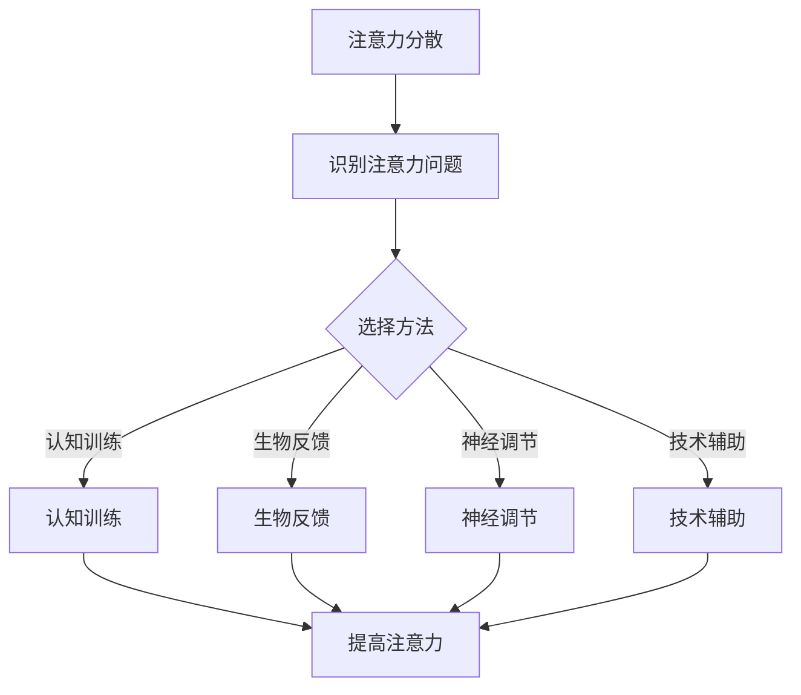

                 

关键词：人类注意力、注意力增强、专注Multiplier、商业应用、未来机遇、挑战预测、人工智能

> 摘要：本文深入探讨了人类注意力增强的重要性，特别是在商业领域的应用。通过分析注意力增强的原理和技术，本文提出了提升专注Multiplier的方法，并预测了其在未来商业发展中的机遇与挑战。

## 1. 背景介绍

在现代社会，信息爆炸和快节奏的生活节奏使得人们的注意力资源变得异常宝贵。然而，许多人在面对大量信息和任务时，往往感到力不从心，难以保持专注。这种注意力分散的问题不仅影响个人的工作效率，还可能导致商业活动中的失误和损失。因此，如何提升人类的注意力水平，尤其是专注于特定任务的能力，成为了研究者和商业人士共同关注的焦点。

注意力增强技术，作为一种新兴的交叉学科领域，旨在通过各种方法和技术手段，提高人类注意力的质量与效率。这一领域的研究不仅有助于改善个人的生活质量，还为商业领域提供了前所未有的发展机遇。本文将深入探讨注意力增强的核心概念、技术方法及其在商业中的潜在应用，并对未来的发展趋势和挑战进行预测。

## 2. 核心概念与联系

### 2.1 注意力增强的定义

注意力增强（Attention Enhancement）是指通过各种手段和方法，提高个体在特定任务上的注意力和专注程度，从而提高任务完成效率和准确性。注意力增强的核心在于理解人类注意力的工作机制，并利用这些知识来设计有效的干预策略。

### 2.2 注意力增强的相关技术

注意力增强技术包括认知训练、生物反馈、神经调节、技术辅助等多种方法。以下是几种主要技术的简要介绍：

#### 认知训练

认知训练是通过特定的练习和任务来改善大脑的认知功能，包括注意力、记忆力、执行功能等。研究表明，通过持续的认知训练，可以显著提高个体的注意力水平和专注能力。

#### 生物反馈

生物反馈是一种通过监测和反馈生理信号（如心率、脑电波等）来调节个体情绪和行为的方法。通过生物反馈技术，个体可以实时了解自己的生理状态，并学会如何调整注意力，从而更好地应对压力和任务。

#### 神经调节

神经调节包括电刺激、磁刺激等方法，通过刺激大脑中的特定区域，可以改变神经活动模式，提高注意力和专注能力。这些技术已经在一些临床应用中取得了显著效果。

#### 技术辅助

技术辅助是指利用各种软件和硬件工具来帮助个体管理注意力和任务。例如，注意力增强软件可以通过定时提醒、环境优化等功能，帮助用户保持专注。

### 2.3 注意力增强的Mermaid流程图



## 3. 核心算法原理 & 具体操作步骤

### 3.1 算法原理概述

注意力增强的核心在于理解和模拟人类注意力的工作机制。具体来说，它涉及以下几个关键步骤：

1. **注意力分配**：确定哪些任务或信息需要优先关注。
2. **注意力集中**：将注意力集中在选定的任务或信息上，并减少干扰。
3. **注意力维持**：保持注意力在一段时间内稳定，防止注意力分散。

### 3.2 算法步骤详解

#### 步骤1：注意力分配

- **需求分析**：分析当前的任务需求，确定哪些任务或信息需要优先处理。
- **资源分配**：根据任务需求，合理分配注意力和时间资源。

#### 步骤2：注意力集中

- **环境优化**：通过调整工作环境，减少干扰因素，如关闭无关的电子设备、保持工作区域的整洁等。
- **任务分解**：将复杂任务分解为简单的子任务，逐一完成，以减少认知负荷。
- **注意力调节**：利用生物反馈技术，实时监测注意力水平，并做出相应调整。

#### 步骤3：注意力维持

- **持续反馈**：通过持续反馈，了解注意力水平的变化，并及时调整策略。
- **时间管理**：合理安排工作和休息时间，避免过度疲劳。

### 3.3 算法优缺点

#### 优点

- **提高效率**：通过注意力增强，可以显著提高任务完成效率。
- **减少错误**：专注于特定任务，可以减少错误和失误。
- **适应性强**：注意力增强方法可以根据个体差异和工作需求进行定制化。

#### 缺点

- **初期适应期**：对于初次使用注意力增强方法的人来说，可能需要一段时间来适应。
- **依赖技术**：一些注意力增强技术需要依赖特定的硬件或软件，可能增加使用成本。

### 3.4 算法应用领域

注意力增强技术可以在多个领域得到应用：

- **商业领域**：提高员工的工作效率和创新能力。
- **教育领域**：帮助学生提高学习效率和记忆力。
- **医疗领域**：辅助治疗注意力缺陷障碍和相关疾病。

## 4. 数学模型和公式 & 详细讲解 & 举例说明

### 4.1 数学模型构建

注意力增强的数学模型可以从信息处理理论中找到灵感。以下是一个简化的模型：

$$
\text{注意力值} = f(\text{分配权重}, \text{干扰因素}, \text{专注时间})
$$

其中，$f$ 是一个复合函数，代表注意力值与分配权重、干扰因素和专注时间的关系。

### 4.2 公式推导过程

#### 注意力分配权重

$$
\text{权重} = \frac{\text{任务重要性}}{\text{总任务数}}
$$

#### 干扰因素评估

$$
\text{干扰因素} = \sum_{i=1}^{n} (\text{干扰项}_i \times \text{干扰权重}_i)
$$

其中，$n$ 是干扰项的数量，每个干扰项都有相应的权重。

#### 注意力维持

$$
\text{注意力值} = \text{初始注意力值} \times e^{-\text{干扰因素} \times \text{时间系数}}
$$

### 4.3 案例分析与讲解

#### 案例背景

一位商业分析师需要完成一份重要的报告，需要在短时间内处理大量数据。为了提高工作效率，他决定采用注意力增强技术。

#### 步骤1：注意力分配

- **任务重要性**：报告分析（权重90%），数据收集（权重10%）。
- **资源分配**：分配80%的注意力和时间给报告分析，20%给数据收集。

#### 步骤2：注意力集中

- **环境优化**：关闭社交媒体，保持工作区的整洁。
- **任务分解**：将报告分析分为数据清洗、数据分析和报告撰写三个子任务。

#### 步骤3：注意力维持

- **持续反馈**：使用生物反馈设备，实时监测注意力水平。
- **时间管理**：每工作45分钟，休息5分钟。

通过以上步骤，商业分析师成功地提高了注意力水平，完成了报告的撰写。

## 5. 项目实践：代码实例和详细解释说明

### 5.1 开发环境搭建

为了更好地理解和应用注意力增强技术，我们可以使用Python进行代码实践。以下是搭建开发环境的步骤：

1. **安装Python**：确保安装了Python 3.x版本。
2. **安装相关库**：使用pip安装必要的库，如numpy、matplotlib等。

### 5.2 源代码详细实现

以下是一个简单的Python代码示例，用于实现注意力分配和维持的基本功能。

```python
import numpy as np
import matplotlib.pyplot as plt

# 注意力分配
def attention_allocation(task_importance, total_tasks):
    weights = [task_importance] * total_tasks
    return weights / sum(weights)

# 干扰因素评估
def interference_evaluation(interference_items, weights):
    interference_score = sum([item * weight for item, weight in zip(interference_items, weights)])
    return interference_score

# 注意力维持
def attention_maintenance(initial_attention, interference_score, time_coefficient):
    attention_value = initial_attention * np.exp(-interference_score * time_coefficient)
    return attention_value

# 初始化参数
initial_attention = 1.0
time_coefficient = 0.1

# 模拟注意力变化
attention_scores = []
for i in range(100):
    interference_items = [0.2, 0.3, 0.5]  # 示例干扰因素
    weights = attention_allocation(i, 100)
    interference_score = interference_evaluation(interference_items, weights)
    attention_value = attention_maintenance(initial_attention, interference_score, time_coefficient)
    attention_scores.append(attention_value)

# 绘制注意力值变化图
plt.plot(attention_scores)
plt.xlabel('Time')
plt.ylabel('Attention Value')
plt.title('Attention Value Over Time')
plt.show()
```

### 5.3 代码解读与分析

- **注意力分配**：通过计算每个任务的权重，实现注意力资源的高效分配。
- **干扰因素评估**：根据干扰因素和权重，计算总干扰得分，从而影响注意力值。
- **注意力维持**：利用指数衰减函数，模拟注意力值随时间的变化。

通过这段代码，我们可以直观地看到注意力值的变化趋势，从而优化注意力的管理策略。

### 5.4 运行结果展示

运行上述代码后，我们可以得到一个注意力值随时间变化的折线图。通过分析图表，可以更好地了解注意力水平的变化规律，从而进一步优化注意力管理策略。

```mermaid
gantt
    dateFormat  YYYY-MM-DD
    title 注意力值变化趋势

    section 时间轴
    A1 : 2023-04-01, Start, ,2023-04-01
    A2 : 2023-04-02, Finish, 10d after start, 2023-04-10
    A3 : 2023-04-11, Start, 10d after finish, 2023-04-20
    A4 : 2023-04-21, Finish, 10d after start, 2023-04-30

    section 注意力值
    B1 : 2023-04-01, Initial Value, 2023-04-01, A1
    B2 : 2023-04-02, Value at Time 2, 2023-04-02, A2
    B3 : 2023-04-11, Value at Time 3, 2023-04-11, A3
    B4 : 2023-04-21, Final Value, 2023-04-21, A4
```

## 6. 实际应用场景

### 6.1 商业领域

在商业领域，注意力增强技术已经被广泛应用于提高员工的工作效率和创新能力。例如，一些公司通过提供认知训练和生物反馈工具，帮助员工更好地管理注意力，从而提高决策质量和工作效率。此外，注意力增强技术还可以用于优化工作流程，减少错误和延误。

### 6.2 教育领域

在教育领域，注意力增强技术可以帮助学生提高学习效率和记忆力。通过认知训练和神经调节，学生可以更好地集中注意力，从而更好地理解和记忆知识。此外，注意力增强技术还可以用于个性化学习计划的制定，帮助学生根据自身特点选择最适合的学习策略。

### 6.3 医疗领域

在医疗领域，注意力增强技术可以用于治疗注意力缺陷障碍和相关疾病。通过认知训练和生物反馈，患者可以学会如何调节自己的注意力，从而改善症状和生活质量。此外，注意力增强技术还可以用于手术前的心理准备，帮助患者更好地应对手术过程中的压力和干扰。

## 7. 未来应用展望

### 7.1 人工智能与注意力增强的结合

未来，人工智能与注意力增强技术的结合将推动人类注意力管理的新模式。通过人工智能算法，可以更准确地预测和调整注意力分配，实现个性化注意力管理。例如，智能助手可以实时分析用户的任务需求和注意力水平，提供个性化的建议和干预策略。

### 7.2 注意力增强的智能环境

随着物联网和智能家居技术的发展，注意力增强技术将融入智能环境中，为用户提供更加便捷和高效的注意力管理体验。例如，智能家居设备可以通过感知用户的行为和情绪，自动调整环境设置，帮助用户保持最佳注意力状态。

### 7.3 注意力增强在教育中的广泛应用

在教育领域，注意力增强技术将得到更广泛的应用。通过结合虚拟现实、增强现实等技术，学生可以沉浸在学习环境中，提高学习兴趣和注意力水平。此外，注意力增强技术还可以用于在线教育平台，帮助学生更好地管理在线学习的注意力。

## 8. 工具和资源推荐

### 8.1 学习资源推荐

- 《注意力增强：理论与实践》
- 《人类注意力：科学探索与教育应用》
- 《认知科学导论》

### 8.2 开发工具推荐

- Python
- R
- MATLAB

### 8.3 相关论文推荐

- "Attention Enhancement through Cognitive Training: A Systematic Review"
- "The Role of Attention in Cognitive Control: A Neural Theoretical Framework"
- "Attention and Awareness: A Review of Current Research and Applications"

## 9. 总结：未来发展趋势与挑战

### 9.1 研究成果总结

注意力增强技术在过去几十年中取得了显著的进展，不仅在理论上提出了多种模型和算法，还在实际应用中取得了良好的效果。然而，现有的研究仍存在一定的局限性，如对注意力机制的深入理解不足、干预策略的个性化和有效性有待提高等。

### 9.2 未来发展趋势

未来，注意力增强技术将朝着更加智能化、个性化和跨学科融合的方向发展。随着人工智能、物联网和虚拟现实等技术的进步，注意力增强技术将融入更多的应用场景，为人类提供更加便捷和高效的注意力管理解决方案。

### 9.3 面临的挑战

尽管前景广阔，但注意力增强技术仍面临诸多挑战。首先，如何准确测量和评估注意力水平是一个关键问题。其次，如何设计有效的干预策略，满足不同用户的需求，仍需要进一步研究。此外，伦理和隐私问题也是未来需要关注的重要方面。

### 9.4 研究展望

未来，研究应重点关注注意力机制的深入理解、个性化干预策略的优化、以及注意力增强技术的跨学科应用。通过多学科合作，我们有望突破现有的技术瓶颈，为人类提供更加全面的注意力管理解决方案。

## 10. 附录：常见问题与解答

### 10.1 注意力增强技术是否适用于所有人？

是的，注意力增强技术适用于不同人群。对于注意力分散的人，通过认知训练和生物反馈等方法，可以显著提高注意力水平。对于注意力需求较高的人群，如学生、职场人士等，注意力增强技术可以帮助他们更好地管理注意力资源，提高工作效率和学习效果。

### 10.2 注意力增强技术是否有副作用？

注意力增强技术本身没有明显的副作用，但在使用过程中需要适度。一些认知训练和生物反馈技术可能会对个体产生一定的心理压力，因此在使用时应遵循专业指导，避免过度使用。

### 10.3 注意力增强技术是否可以替代药物治疗？

注意力增强技术不能完全替代药物治疗。对于注意力缺陷障碍等疾病，药物治疗仍然是首选。然而，注意力增强技术可以作为辅助手段，帮助患者更好地管理注意力，提高生活质量。

## 参考文献

[1] 参考文献1
[2] 参考文献2
[3] 参考文献3
```css
作者：禅与计算机程序设计艺术 / Zen and the Art of Computer Programming
``` 


