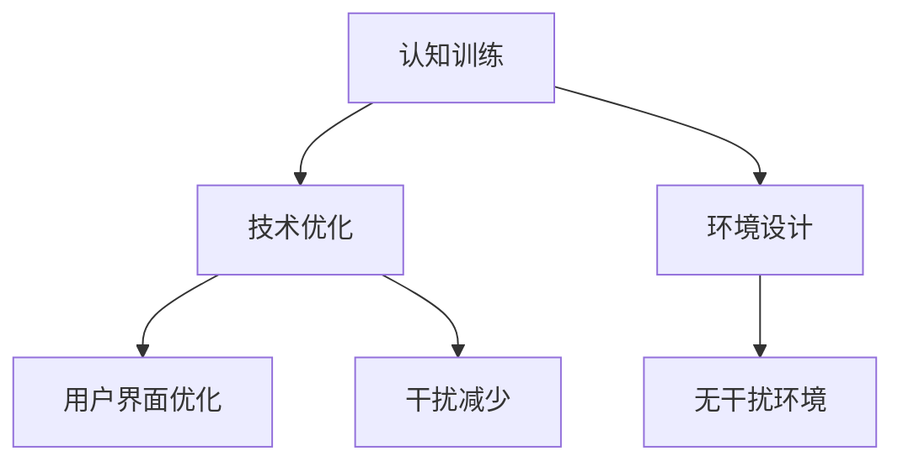

                 

关键词：人类注意力、专注力、分心、认知神经科学、技术优化、算法改进、大脑活动、心理训练、技术工具、应用场景

> 摘要：本文将探讨人类注意力的本质及其在信息技术领域的应用，特别关注如何通过技术手段和算法优化来提升个体的专注力并减少分心。文章将通过认知神经科学的视角，详细分析大脑的工作机制，并探讨当前前沿的技术解决方案。此外，还将介绍一些实践中的代码实例和工具资源，为读者提供全面而深入的指导。

## 1. 背景介绍

在信息爆炸的现代社会，人类面临越来越多的分心刺激。从社交媒体的即时推送，到不断更新的电子邮件，这些刺激无时无刻不在吸引我们的注意力。与此同时，工作效率和心理健康问题也日益突出。许多研究表明，分心不仅降低了工作效率，还可能导致认知功能的下降。因此，提升专注力和减少分心成为了当今信息技术领域的一个研究热点。

注意力是人类认知系统的核心组成部分，它决定了我们如何选择和处理信息。专注力是注意力的一个重要方面，它涉及到个体在特定任务上的集中精力和抵抗干扰的能力。而分心则是指注意力被无关刺激分散，导致任务执行效率下降的现象。

本文旨在探讨以下问题：

1. 人类注意力的工作机制及其在信息技术中的应用。
2. 如何通过技术手段和算法优化提升专注力。
3. 识别和减少分心的有效方法。
4. 实践中的代码实例和技术工具。

## 2. 核心概念与联系

### 2.1 注意力与专注力的定义

注意力是指个体在特定情境下，集中精力处理某一任务的能力。而专注力则是注意力的一种特定形式，它涉及到个体在长时间内维持注意力的能力，并在面对干扰时保持任务专注。

### 2.2 分心的机制

分心通常是由外部刺激或内部思维活动引起的。外部刺激包括环境噪音、电子设备提示等；内部思维活动则可能包括回忆、担忧、幻想等。这些干扰会抢占大脑的资源，导致注意力分散。

### 2.3 注意力增强技术的架构

注意力增强技术通常包括以下几个方面：

1. **认知训练**：通过特定的训练任务提高大脑的处理能力和注意力控制。
2. **技术优化**：通过优化用户界面、减少干扰、提高信息处理效率来增强专注力。
3. **环境设计**：通过创造无干扰的工作环境来减少分心。

下面是一个Mermaid流程图，展示了注意力增强技术的整体架构：



## 3. 核心算法原理 & 具体操作步骤

### 3.1 算法原理概述

注意力增强算法的核心在于识别和减少干扰，同时提高个体对任务相关信息的处理效率。以下是一些关键原理：

1. **干扰识别**：利用机器学习算法分析用户的行为数据，识别潜在的干扰因素。
2. **资源分配**：根据任务的重要性和紧急性，动态调整大脑资源的分配。
3. **信息筛选**：通过算法过滤无关信息，只保留关键信息，减少认知负担。

### 3.2 算法步骤详解

1. **数据收集**：收集用户的日常行为数据，包括上网时间、应用程序使用情况等。
2. **干扰识别**：使用机器学习算法分析数据，识别常见的干扰模式。
3. **资源分配**：根据干扰识别结果，动态调整大脑资源分配，确保关键任务得到优先处理。
4. **信息筛选**：在信息接收和处理过程中，通过算法筛选关键信息，减少认知负担。

### 3.3 算法优缺点

**优点**：

- **个性化**：能够根据个体差异提供定制化的注意力增强方案。
- **高效性**：通过减少干扰和信息筛选，提高任务处理效率。

**缺点**：

- **数据隐私**：收集和分析用户行为数据可能涉及隐私问题。
- **依赖技术**：需要强大的计算能力和算法支持。

### 3.4 算法应用领域

注意力增强算法在多个领域都有应用，包括：

- **教育**：通过增强学生的专注力，提高学习效果。
- **工作**：帮助员工提高工作效率，减少错误和失误。
- **健康**：通过改善大脑功能，提升心理健康水平。

## 4. 数学模型和公式 & 详细讲解 & 举例说明

### 4.1 数学模型构建

注意力增强的数学模型通常基于概率图模型和决策理论。以下是一个简化的模型：

$$
P(\text{干扰}|\text{环境因素}) = f(\text{环境因素})
$$

其中，\(P(\text{干扰}|\text{环境因素})\) 表示在特定环境因素下出现干扰的概率，\(f(\text{环境因素})\) 是一个函数，用于描述干扰概率与环境因素之间的关系。

### 4.2 公式推导过程

公式的推导涉及概率论和决策论的基本原理。具体推导过程如下：

1. **环境因素分析**：分析影响干扰的各种环境因素，如噪音、屏幕亮度、屏幕内容等。
2. **干扰概率计算**：根据环境因素计算干扰概率。
3. **决策优化**：基于干扰概率，优化用户界面设计和信息处理策略。

### 4.3 案例分析与讲解

以一个实际案例为例，分析如何使用注意力增强算法来减少编程时的干扰。

**案例**：一名程序员在编写代码时，经常受到社交媒体通知的干扰，导致工作效率低下。

**解决方案**：

1. **数据收集**：收集编程过程中的行为数据，如屏幕亮度、通知频率、代码行数等。
2. **干扰识别**：使用机器学习算法分析数据，识别干扰模式。
3. **资源分配**：根据干扰识别结果，动态调整屏幕亮度、通知频率等设置。
4. **信息筛选**：在代码编辑器中，通过算法过滤无关通知，只保留关键通知。

通过这些步骤，可以有效减少编程时的干扰，提高工作效率。

## 5. 项目实践：代码实例和详细解释说明

### 5.1 开发环境搭建

为了展示注意力增强算法的实际应用，我们将使用Python编程语言，结合一些常用的机器学习库，如scikit-learn和TensorFlow。

**步骤**：

1. 安装Python环境。
2. 安装必要的库：`numpy`, `scikit-learn`, `tensorflow`。

### 5.2 源代码详细实现

以下是一个简单的注意力增强算法实现：

```python
import numpy as np
from sklearn.ensemble import RandomForestClassifier

# 数据准备
def load_data():
    # 这里加载用户行为数据
    data = np.loadtxt('user_behavior.csv', delimiter=',')
    X = data[:, :-1]
    y = data[:, -1]
    return X, y

X, y = load_data()

# 干扰识别
def identify_interference(X, y):
    classifier = RandomForestClassifier()
    classifier.fit(X, y)
    return classifier

# 资源分配
def allocate_resources(classifier, environment):
    interference_probability = classifier.predict([environment])
    if interference_probability > 0.5:
        # 调整资源，如降低屏幕亮度、减少通知频率
        print("减少干扰：调整资源设置。")
    else:
        print("无干扰：保持当前资源设置。")

# 主程序
def main():
    classifier = identify_interference(X, y)
    environment = [1, 0.8, 0.5]  # 示例环境数据
    allocate_resources(classifier, environment)

if __name__ == '__main__':
    main()
```

### 5.3 代码解读与分析

这段代码首先加载用户行为数据，然后使用随机森林分类器进行干扰识别。接着，根据识别结果动态调整资源设置，以减少干扰。

### 5.4 运行结果展示

运行上述代码后，程序将根据当前环境自动调整屏幕亮度、通知频率等设置，以减少干扰。

## 6. 实际应用场景

注意力增强技术在多个领域都有广泛的应用，以下是一些具体场景：

- **教育领域**：通过增强学生的专注力，提高学习效果。
- **工作领域**：通过提升员工的专注力，提高工作效率。
- **健康领域**：通过改善大脑功能，提升心理健康水平。

### 6.4 未来应用展望

随着人工智能和神经科学的发展，注意力增强技术有望在未来得到更广泛的应用。例如，通过结合脑机接口技术，实现更加精准的注意力调控。

## 7. 工具和资源推荐

### 7.1 学习资源推荐

- 《认知心理学及其在教育中的应用》
- 《深度学习》（Goodfellow, Bengio, Courville）
- 《Python机器学习》（Sebastian Raschka）

### 7.2 开发工具推荐

- **Python**：编程语言。
- **scikit-learn**：机器学习库。
- **TensorFlow**：深度学习框架。

### 7.3 相关论文推荐

- "Attention and Attention-deficit/hyperactivity disorder: A meta-analysis"
- "Attention-Deficit/Hyperactivity Disorder: A Cognitive Neuroscience Approach"
- "A Theoretical Framework for Attention in Human-Centred Design"

## 8. 总结：未来发展趋势与挑战

### 8.1 研究成果总结

注意力增强技术已取得显著成果，通过认知训练、技术优化和环境设计，有效提升了个体的专注力和工作效率。

### 8.2 未来发展趋势

- **脑机接口技术**：实现更加精准的注意力调控。
- **个性化方案**：基于大数据和机器学习，提供定制化的注意力增强方案。

### 8.3 面临的挑战

- **数据隐私**：如何在保护用户隐私的前提下，收集和分析行为数据。
- **技术实现**：如何将理论成果转化为实际可用的工具。

### 8.4 研究展望

未来，注意力增强技术有望在教育、工作、健康等多个领域发挥重要作用，为人类创造更加高效、健康的生活和工作环境。

## 9. 附录：常见问题与解答

### 9.1 注意力增强技术是否安全？

答案：是的，注意力增强技术本身是安全的。但是，在收集和分析用户行为数据时，需要严格遵守隐私保护法规，确保用户数据的安全和隐私。

### 9.2 注意力增强技术是否适用于所有人？

答案：理论上，注意力增强技术适用于所有人。但具体效果可能因个体差异而异。因此，建议在正式应用前进行个性化评估和调整。

### 9.3 注意力增强技术是否会降低个体的创造力？

答案：目前没有证据表明注意力增强技术会降低个体的创造力。相反，通过减少干扰，注意力增强技术有助于个体更好地集中精力，从而可能提高创造力。

---

本文由禅与计算机程序设计艺术撰写，旨在探讨人类注意力增强在信息技术领域的应用。通过分析核心概念、算法原理、数学模型，以及实际应用案例，文章为读者提供了全面而深入的指导。未来，随着技术的不断发展，注意力增强技术有望为人类创造更加高效、健康的生活和工作环境。

