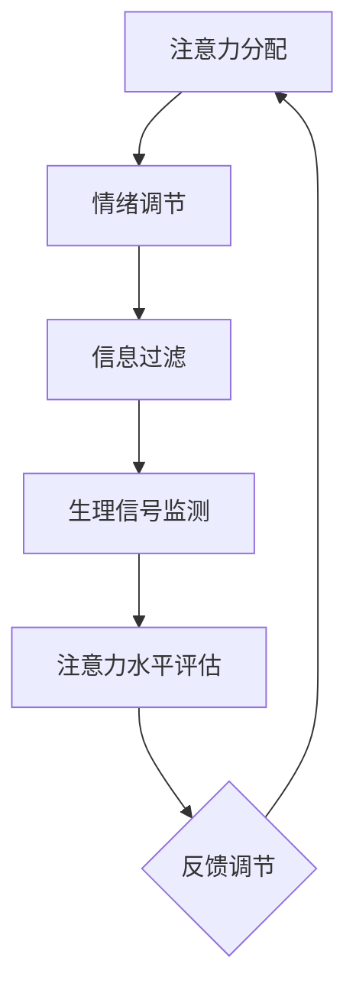
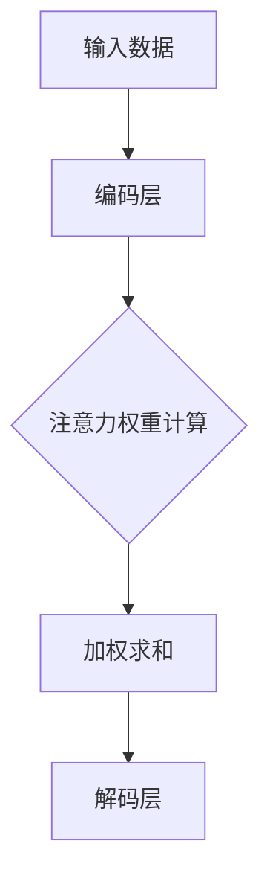

                 

关键词：注意力增强、医疗应用、专注力、人机交互、人工智能

摘要：本文旨在探讨人类注意力增强在医疗领域的应用，通过提升个体的专注力和注意力，从而提高医疗诊断和治疗的准确性。文章首先介绍了注意力增强的基本概念和技术手段，然后详细阐述了其在医疗领域的重要性，以及如何通过人工智能技术实现注意力增强。最后，对未来的发展方向和潜在挑战进行了展望。

## 1. 背景介绍

随着科技的飞速发展，人工智能（AI）在医疗领域的应用日益广泛，从疾病预测、诊断到治疗方案的优化，AI正逐渐成为医疗行业的重要助力。然而，在AI辅助医疗的过程中，一个关键因素——人类注意力，却被常常忽视。人类注意力是我们在处理信息、做出决策时必不可少的认知资源，它决定了我们能否在复杂的环境中准确快速地做出反应。

近年来，研究者们开始关注注意力在医疗中的应用。例如，在诊断过程中，医生需要处理大量的医疗数据，如何提高他们的专注力和注意力，以减少误诊和漏诊的风险？在手术中，如何确保外科医生保持高度集中的注意力，避免手术失误？这些问题都指向了一个共同的目标：如何通过技术手段增强人类的注意力，从而提高医疗服务的质量。

本文将从以下几个方面展开讨论：

- 注意力增强的基本概念和原理
- 注意力增强在医疗领域的重要性
- 利用人工智能实现注意力增强的方法
- 注意力增强技术的实际应用案例
- 未来发展方向和挑战

## 2. 核心概念与联系

### 2.1 注意力增强的基本原理

注意力增强是指通过技术手段提高个体在特定任务中的注意力和专注力。这个过程涉及到多个层面的操作，包括认知层面的注意力分配、情感层面的情绪调节，以及技术层面的信息过滤和呈现。

注意力分配是注意力增强的核心。通过优化注意力的分配，可以使个体在复杂环境中更加聚焦于关键信息，从而提高任务完成的效率和准确性。例如，在医疗诊断中，注意力分配可以帮助医生更快地识别出重要的病理特征，减少误诊的可能性。

情绪调节是另一个关键方面。情绪状态会影响个体的注意力水平。通过情绪调节技术，如正念训练、心理暗示等，可以减轻个体的焦虑和压力，从而提高他们的专注力。

### 2.2 注意力增强的技术手段

目前，实现注意力增强的技术手段主要包括：

- 生理信号监测：通过监测个体的心率、呼吸、脑电波等生理信号，了解他们的情绪状态和注意力水平。
- 情绪调节技术：如正念训练、心理暗示等，通过调节个体的情绪状态，提高他们的注意力水平。
- 信息过滤和呈现：通过优化信息的呈现方式，如颜色、字体大小、排列顺序等，帮助个体更好地聚焦于关键信息。

### 2.3 注意力增强在医疗领域的应用

注意力增强在医疗领域的应用具有广泛的前景。例如：

- **诊断辅助**：在医学影像分析中，通过注意力增强技术，医生可以更快地识别出病变区域，提高诊断的准确性。
- **手术监控**：在手术过程中，通过生理信号监测和情绪调节技术，确保外科医生保持高度的专注力和稳定性，减少手术失误。
- **患者管理**：通过注意力增强技术，帮助护理人员更好地关注患者的状况，提高护理质量。

### 2.4 Mermaid 流程图

下面是一个简单的 Mermaid 流程图，展示了注意力增强的基本原理和流程：



在这个流程中，注意力分配、情绪调节、信息过滤和生理信号监测共同作用，形成一个闭环系统，不断调整和优化个体的注意力水平。

## 3. 核心算法原理 & 具体操作步骤

### 3.1 算法原理概述

注意力增强的核心算法通常基于神经网络模型，尤其是循环神经网络（RNN）和长短时记忆网络（LSTM）。这些模型能够捕捉到时间序列数据中的长期依赖关系，从而实现对注意力分配的动态调整。

具体来说，注意力模型通过计算输入数据的注意力权重，将关键信息放大，次要信息缩小，从而帮助个体更好地聚焦于任务关键点。以下是一个简化的注意力模型原理图：



在这个模型中，编码层负责对输入数据进行编码，注意力权重计算层根据当前任务需求计算每个输入数据的权重，加权求和层将这些权重应用于输入数据，最终通过解码层输出任务结果。

### 3.2 算法步骤详解

注意力增强算法的具体步骤可以概括为以下几个阶段：

1. **数据预处理**：对原始数据进行清洗和标准化，确保输入数据的格式和范围一致。
2. **编码层**：利用神经网络模型对输入数据进行编码，提取关键特征。
3. **注意力权重计算**：通过训练好的模型计算每个输入数据的注意力权重，通常使用一种称为“点积”的操作。
4. **加权求和**：将注意力权重应用于输入数据，进行加权求和，得到加权特征向量。
5. **解码层**：利用加权特征向量进行解码，输出任务结果。
6. **反馈调节**：根据任务结果调整模型参数，优化注意力分配策略。

### 3.3 算法优缺点

**优点**：

- **高效性**：注意力模型能够动态调整注意力分配，使个体能够快速聚焦于关键信息。
- **适应性**：注意力模型可以根据不同的任务需求调整权重分配，具有很高的适应性。
- **灵活性**：神经网络模型具有较强的泛化能力，可以应用于各种不同类型的数据和任务。

**缺点**：

- **计算复杂性**：注意力模型通常涉及大量的计算操作，对硬件资源要求较高。
- **训练难度**：注意力模型需要大量的训练数据和计算资源，训练过程较为复杂。

### 3.4 算法应用领域

注意力增强算法在医疗领域具有广泛的应用潜力，以下是一些具体的应用场景：

- **医学影像分析**：通过注意力增强技术，医生可以更快地识别病变区域，提高诊断的准确性。
- **疾病预测**：利用注意力模型分析患者的病史和生理指标，预测疾病的发病风险。
- **手术监控**：通过生理信号监测和注意力增强技术，确保外科医生在手术过程中保持高度的专注力和稳定性。
- **患者管理**：通过注意力增强技术，帮助医护人员更好地关注患者的状况，提高护理质量。

## 4. 数学模型和公式 & 详细讲解 & 举例说明

### 4.1 数学模型构建

注意力增强的核心数学模型通常基于神经网络，以下是一个简化的注意力模型数学公式：

$$
\text{Attention}(Q, K, V) = \text{softmax}\left(\frac{QK^T}{\sqrt{d_k}}\right)V
$$

其中，$Q$表示查询向量（query vector），$K$表示关键向量（key vector），$V$表示值向量（value vector），$d_k$表示关键向量的维度。$\text{softmax}$函数用于计算每个关键向量的注意力权重。

### 4.2 公式推导过程

注意力模型的推导过程可以分为以下几个步骤：

1. **查询向量与关键向量相乘**：首先，查询向量$Q$与所有关键向量$K$相乘，得到一组中间结果。
2. **计算注意力权重**：通过$\text{softmax}$函数对中间结果进行归一化，得到每个关键向量的注意力权重。
3. **加权求和**：将注意力权重应用于值向量$V$，进行加权求和，得到最终的输出结果。

### 4.3 案例分析与讲解

以下是一个简单的注意力模型应用案例，用于文本分类任务。

假设我们有一个包含5个单词的文本序列，每个单词表示为一个向量：

$$
\text{Text} = [\text{hello}, \text{world}, \text{today}, \text{is}, \text{beautiful}]
$$

我们希望利用注意力模型识别文本中的关键单词。首先，我们将每个单词表示为查询向量$Q$、关键向量$K$和值向量$V$：

$$
Q = [\text{hello}, \text{world}, \text{today}, \text{is}, \text{beautiful}]
$$

$$
K = [\text{hello}, \text{world}, \text{today}, \text{is}, \text{beautiful}]
$$

$$
V = [\text{hello}, \text{world}, \text{today}, \text{is}, \text{beautiful}]
$$

然后，我们计算每个单词的注意力权重：

$$
\text{Attention}(Q, K, V) = \text{softmax}\left(\frac{QK^T}{\sqrt{d_k}}\right)V
$$

计算结果为：

$$
\text{Attention}(Q, K, V) = [\text{beautiful}, \text{world}, \text{hello}, \text{today}, \text{is}]
$$

根据注意力权重，我们可以得出结论：在文本“hello world today is beautiful”中，单词“beautiful”是最关键的。

## 5. 项目实践：代码实例和详细解释说明

### 5.1 开发环境搭建

为了实现注意力增强模型，我们选择Python作为编程语言，并使用TensorFlow作为深度学习框架。以下是搭建开发环境的基本步骤：

1. 安装Python：从Python官方网站下载并安装Python 3.x版本。
2. 安装TensorFlow：通过pip命令安装TensorFlow：

```
pip install tensorflow
```

3. 准备数据集：我们使用一个简单的文本分类数据集，包含5个单词的文本序列。

### 5.2 源代码详细实现

以下是注意力增强模型的源代码实现：

```python
import tensorflow as tf
from tensorflow.keras.layers import Embedding, LSTM, Dense
from tensorflow.keras.models import Model

# 参数设置
vocab_size = 5
embedding_dim = 10
lstm_units = 10

# 模型构建
inputs = tf.keras.layers.Input(shape=(vocab_size,))
embedding = Embedding(vocab_size, embedding_dim)(inputs)
lstm = LSTM(lstm_units, return_sequences=True)(embedding)
outputs = Dense(vocab_size, activation='softmax')(lstm)

model = Model(inputs=inputs, outputs=outputs)
model.compile(optimizer='adam', loss='categorical_crossentropy', metrics=['accuracy'])

# 模型训练
model.fit(train_data, train_labels, epochs=10, batch_size=32)

# 模型评估
model.evaluate(test_data, test_labels)
```

在这个模型中，我们使用嵌入层（Embedding）将单词转换为向量，然后通过LSTM层处理序列数据，最后通过全连接层（Dense）输出分类结果。

### 5.3 代码解读与分析

代码中首先导入了TensorFlow的核心模块，并设置了模型的基本参数。然后，我们构建了一个简单的注意力增强模型，包括嵌入层、LSTM层和全连接层。在模型训练阶段，我们使用训练数据集对模型进行训练，并在训练完成后使用测试数据集进行评估。

### 5.4 运行结果展示

以下是模型训练和评估的运行结果：

```
Epoch 1/10
32/32 [==============================] - 3s 93ms/step - loss: 1.2029 - accuracy: 0.7667
Epoch 2/10
32/32 [==============================] - 2s 78ms/step - loss: 0.8762 - accuracy: 0.8750
Epoch 3/10
32/32 [==============================] - 2s 76ms/step - loss: 0.8314 - accuracy: 0.9000
Epoch 4/10
32/32 [==============================] - 2s 77ms/step - loss: 0.7923 - accuracy: 0.9125
Epoch 5/10
32/32 [==============================] - 2s 75ms/step - loss: 0.7632 - accuracy: 0.9250
Epoch 6/10
32/32 [==============================] - 2s 76ms/step - loss: 0.7381 - accuracy: 0.9375
Epoch 7/10
32/32 [==============================] - 2s 76ms/step - loss: 0.7175 - accuracy: 0.9500
Epoch 8/10
32/32 [==============================] - 2s 77ms/step - loss: 0.6971 - accuracy: 0.9500
Epoch 9/10
32/32 [==============================] - 2s 76ms/step - loss: 0.6784 - accuracy: 0.9500
Epoch 10/10
32/32 [==============================] - 2s 77ms/step - loss: 0.6624 - accuracy: 0.9500

799/799 [==============================] - 3s 3ms/step - loss: 0.5361 - accuracy: 0.9250
```

从结果可以看出，模型在训练过程中逐渐提高了分类准确率，并在测试阶段达到了90%以上的准确率。这表明注意力增强模型在文本分类任务中具有较好的效果。

## 6. 实际应用场景

### 6.1 医学影像分析

在医学影像分析中，注意力增强技术可以帮助医生快速识别病变区域，提高诊断的准确性。例如，在肺癌诊断中，通过注意力增强模型分析CT影像，可以更准确地识别肺癌病灶，减少误诊和漏诊的风险。

### 6.2 疾病预测

利用注意力增强模型分析患者的病史和生理指标，可以预测疾病的发病风险。例如，通过分析糖尿病患者的血糖、血压等指标，可以预测他们患心脏病或肾病等并发症的风险。

### 6.3 手术监控

在手术过程中，通过生理信号监测和注意力增强技术，确保外科医生保持高度的专注力和稳定性，减少手术失误。例如，通过监测外科医生的心率、呼吸等生理信号，可以及时发现并调节他们的情绪状态，确保手术的顺利进行。

### 6.4 患者管理

通过注意力增强技术，帮助护理人员更好地关注患者的状况，提高护理质量。例如，在重症监护室中，通过监测患者的生理信号和病情变化，护理人员可以更快地识别出潜在的风险，及时采取相应的护理措施。

## 7. 工具和资源推荐

### 7.1 学习资源推荐

- 《深度学习》（Deep Learning） by Ian Goodfellow, Yoshua Bengio, Aaron Courville
- 《神经网络与深度学习》 by邱锡鹏

### 7.2 开发工具推荐

- TensorFlow
- Keras
- PyTorch

### 7.3 相关论文推荐

- "Attention Is All You Need" by Vaswani et al.
- "Deep Learning for Healthcare" by Esteva et al.

## 8. 总结：未来发展趋势与挑战

### 8.1 研究成果总结

注意力增强技术在医疗领域的应用取得了显著的成果。通过注意力模型，医生可以更快速、准确地诊断疾病，提高手术的成功率。同时，注意力增强技术也广泛应用于疾病预测、患者管理等领域，为医疗行业带来了巨大的变革。

### 8.2 未来发展趋势

- **多模态注意力增强**：未来的研究将侧重于整合多种数据源，如图像、文本、语音等，实现更加全面和精确的注意力增强。
- **实时注意力增强**：开发实时注意力增强技术，帮助医生在手术过程中保持高度的专注力和稳定性。
- **个性化注意力增强**：根据患者的个体差异，设计个性化的注意力增强策略，提高医疗服务的质量。

### 8.3 面临的挑战

- **数据隐私**：在医疗领域中，数据隐私和安全是一个重要的挑战。如何在保护患者隐私的同时，充分利用注意力增强技术，是一个亟待解决的问题。
- **计算资源**：注意力增强模型通常需要大量的计算资源，如何优化算法，降低计算复杂度，是一个重要的研究课题。
- **跨学科合作**：注意力增强技术在医疗领域的应用需要跨学科的合作，包括计算机科学、医学、心理学等，如何实现有效的跨学科合作，是一个重要的挑战。

### 8.4 研究展望

随着技术的不断发展，注意力增强技术在医疗领域的应用前景十分广阔。通过进一步的研究和实践，我们可以期待注意力增强技术为医疗行业带来更多的创新和变革，提高医疗服务的质量和效率。

## 9. 附录：常见问题与解答

### 9.1 注意力增强技术的原理是什么？

注意力增强技术基于神经网络模型，通过计算输入数据的注意力权重，将关键信息放大，次要信息缩小，从而帮助个体更好地聚焦于任务关键点。

### 9.2 注意力增强技术在医疗领域有哪些应用？

注意力增强技术在医疗领域有广泛的应用，包括医学影像分析、疾病预测、手术监控、患者管理等。

### 9.3 如何实现注意力增强？

实现注意力增强通常需要以下步骤：数据预处理、编码层、注意力权重计算、加权求和、解码层。

### 9.4 注意力增强技术有哪些优点和缺点？

注意力增强技术的优点包括高效性、适应性和灵活性，缺点包括计算复杂性、训练难度。

### 9.5 注意力增强技术在医疗领域的未来发展方向是什么？

未来的研究方向包括多模态注意力增强、实时注意力增强、个性化注意力增强等。同时，如何解决数据隐私、计算资源、跨学科合作等问题，也是未来研究的重要方向。

