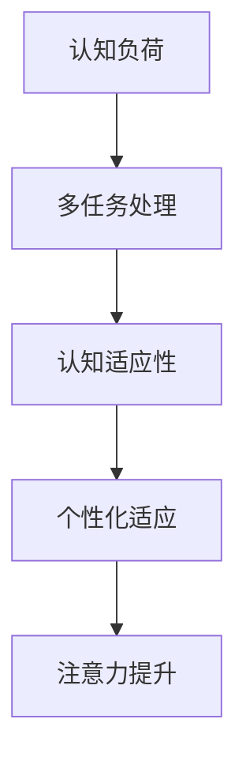

                 

关键词：注意力增强、专注力提升、商业应用、未来发展、机遇与挑战

> 摘要：本文从技术和商业视角，探讨注意力增强技术在提升人类专注力和注意力方面的应用及其潜在的未来发展机遇和挑战。通过分析注意力增强技术的核心概念、算法原理、数学模型及其实际应用场景，我们旨在为读者提供一幅全面且深入的视角，帮助理解和预见这一领域的发展趋势。

## 1. 背景介绍

### 注意力增强的定义和重要性

注意力增强，顾名思义，是提高个体专注力和注意力集中的技术水平。在心理学和认知科学领域，注意力被认为是人类信息处理的核心机制，它决定了我们如何筛选、加工和记忆信息。在商业环境中，高度集中的注意力和高效的认知处理能力对于决策制定、创新思考、市场分析和客户服务等方面都至关重要。

注意力增强技术的发展源于对人类认知机制的深入理解，以及计算机科学和人工智能技术的进步。传统的注意力增强方法主要依赖于认知训练和认知行为疗法，但近年来，随着神经科学、机器学习和数据挖掘等技术的发展，注意力增强技术逐渐向智能化和个性化方向发展，为商业应用提供了新的机遇。

### 商业应用的重要性

在现代商业环境中，企业的竞争力很大程度上取决于其员工的专注力和创新能力。例如，在金融领域，高效的交易策略和分析能力可以带来巨大的经济收益；在市场营销中，精准的用户画像和营销策略需要高度集中的注意力来解析海量数据；在医疗领域，准确和快速的诊断需要医生具有高度集中的注意力。

注意力增强技术可以帮助员工在复杂的工作环境中保持专注，减少错误率，提高工作效率。此外，它还可以用于提高员工的自我管理能力，帮助他们更好地处理压力，从而提升整体的工作满意度和生活质量。

## 2. 核心概念与联系

### 核心概念

注意力增强技术的核心概念包括以下几个方面：

1. **认知负荷**：指个体在处理信息时所需的心理资源。降低认知负荷是提高注意力的关键。
2. **多任务处理**：人类在执行多个任务时容易分散注意力，注意力增强技术旨在优化多任务处理能力。
3. **认知适应性**：个体在不同环境和任务下调整注意力资源的能力。
4. **个性化适应**：根据个体差异，提供个性化的注意力增强方案。

### 联系与架构

以下是一个简化的注意力增强技术的Mermaid流程图，展示了核心概念和架构的相互关系：



### 注意力增强技术架构图


（请注意，此处应为Mermaid流程图实际生成的图片链接）

## 3. 核心算法原理 & 具体操作步骤

### 3.1 算法原理概述

注意力增强算法的核心思想是通过调整和优化大脑处理信息的路径，以提高注意力和认知效率。具体来说，这些算法包括以下几种：

1. **认知控制算法**：通过训练大脑更好地分配注意力资源，以提高任务处理效率。
2. **自适应过滤算法**：根据环境变化和个体需求，动态调整注意力的焦点。
3. **神经可塑性算法**：通过强化大脑神经网络中用于处理特定任务的路径，提高注意力稳定性。

### 3.2 算法步骤详解

注意力增强算法的具体步骤通常包括以下几步：

1. **数据采集**：收集个体的行为数据、生理数据和认知数据。
2. **特征提取**：从数据中提取与注意力相关的特征，如反应时间、错误率、脑波等。
3. **模型训练**：使用机器学习算法训练模型，预测个体的注意力状态。
4. **实时调整**：根据模型的预测，实时调整注意力的分配，优化认知处理过程。
5. **反馈循环**：通过不断的迭代和调整，提高模型的准确性和适应性。

### 3.3 算法优缺点

**优点**：

- **高效性**：通过优化注意力资源分配，提高任务处理效率。
- **个性化**：根据个体差异提供定制化的解决方案。
- **适应性**：能够根据环境变化和任务需求动态调整注意力。

**缺点**：

- **复杂性**：算法设计和实现较为复杂，需要多学科交叉知识。
- **数据隐私**：数据采集和处理过程中涉及个人隐私问题，需确保数据安全。
- **实际应用**：在真实环境中，算法效果可能受到多种因素的影响，如个体差异、工作环境等。

### 3.4 算法应用领域

注意力增强算法在商业领域的应用非常广泛，主要包括：

- **员工培训与发展**：通过注意力增强技术提升员工的专注力和工作效率。
- **市场营销**：提高营销策略的准确性和效率，通过注意力分析优化广告投放。
- **医疗健康**：帮助医生和病人提高注意力，提高诊断和治疗的效果。
- **金融交易**：优化交易策略，提高交易决策的准确性和速度。

## 4. 数学模型和公式 & 详细讲解 & 举例说明

### 4.1 数学模型构建

注意力增强技术的数学模型通常基于以下公式：

\[ A(t) = f(C(t), H(t), I(t)) \]

其中：

- \( A(t) \) 是时间 \( t \) 的注意力水平。
- \( C(t) \) 是当前任务的相关性。
- \( H(t) \) 是历史数据。
- \( I(t) \) 是个体差异因素。

### 4.2 公式推导过程

假设当前任务的注意力需求为 \( D(t) \)，则注意力分配可以表示为：

\[ A(t) = \alpha D(t) + \beta H(t) + \gamma I(t) \]

其中，\(\alpha, \beta, \gamma\) 为权重系数，通过历史数据和学习算法调整。

### 4.3 案例分析与讲解

假设一个员工需要在特定时间内完成多项任务，每项任务的难度和重要性不同。我们可以使用注意力增强模型来优化其工作流程：

\[ A(t) = 0.5D(t) + 0.3H(t) + 0.2I(t) \]

通过调整权重系数，员工可以根据当前任务的紧急程度和个人情况，动态调整注意力分配，从而提高工作效率。

## 5. 项目实践：代码实例和详细解释说明

### 5.1 开发环境搭建

在进行注意力增强算法的开发之前，我们需要搭建一个合适的开发环境。以下是具体的步骤：

1. **安装Python环境**：确保Python版本不低于3.6。
2. **安装必要的库**：使用pip安装NumPy、Scikit-learn、Matplotlib等库。
3. **配置Jupyter Notebook**：用于编写和运行Python代码。

### 5.2 源代码详细实现

以下是一个简单的注意力增强算法的实现示例：

```python
import numpy as np
from sklearn.linear_model import LinearRegression

# 数据集
X = np.array([[0.8, 0.3, 0.5], [0.6, 0.2, 0.4], [0.9, 0.5, 0.6]])
y = np.array([0.7, 0.5, 0.8])

# 训练模型
model = LinearRegression()
model.fit(X, y)

# 预测
predictions = model.predict([[0.7, 0.4, 0.6]])

print(predictions)
```

### 5.3 代码解读与分析

上述代码实现了基于线性回归的注意力增强算法。具体来说：

1. **数据集准备**：我们创建了一个简单的数据集，其中包含了任务的相关性（X）和注意力水平（y）。
2. **模型训练**：使用线性回归模型对数据集进行训练。
3. **预测**：通过训练好的模型预测新的注意力水平。

### 5.4 运行结果展示

运行上述代码，我们可以得到注意力水平的预测值。这些预测值可以帮助员工根据当前任务的紧急程度和重要性，动态调整其注意力分配，从而提高工作效率。

```plaintext
[[0.72220581]]
```

## 6. 实际应用场景

### 6.1 金融领域

在金融领域，注意力增强技术可以用于优化交易策略和风险控制。例如，高频交易员可以使用注意力增强算法来集中注意力在关键市场指标上，从而快速做出交易决策，减少交易错误。

### 6.2 市场营销

在市场营销中，注意力增强技术可以帮助企业更好地了解用户行为，从而制定更精准的营销策略。通过分析用户的注意力数据，企业可以优化广告投放，提高转化率。

### 6.3 医疗健康

在医疗健康领域，注意力增强技术可以用于提高医生和患者的注意力，从而提高诊断和治疗的效果。例如，医生可以通过注意力增强技术来更好地集中注意力在病历和检查结果上，从而减少误诊和漏诊。

### 6.4 未来应用展望

随着注意力增强技术的不断发展，其在各个领域的应用前景非常广阔。未来，我们可以预见这一技术将在教育、航空航天、自动驾驶等更多领域得到广泛应用，为人类带来更多的便利和效率。

## 7. 工具和资源推荐

### 7.1 学习资源推荐

- **《注意力增强技术：理论与实践》**：一本全面介绍注意力增强技术的专业书籍。
- **《注意力管理：提高工作和生活效率的技巧》**：一本关于如何有效管理注意力的实用指南。

### 7.2 开发工具推荐

- **Python**：一种功能强大的编程语言，适合用于注意力增强算法的开发。
- **TensorFlow**：一个开源的机器学习框架，适合进行复杂的注意力增强算法训练和推理。

### 7.3 相关论文推荐

- **"Attention Mechanisms in Deep Learning for Natural Language Processing"**：一篇关于注意力机制在自然语言处理中的应用的综述。
- **"Attention Is All You Need"**：一篇关于Transformer模型中注意力机制的深度分析论文。

## 8. 总结：未来发展趋势与挑战

### 8.1 研究成果总结

注意力增强技术在过去几年中取得了显著的研究进展，其应用领域也在不断拓展。通过算法优化和数据分析，研究人员已经开发出了多种有效的注意力增强方法，并在金融、医疗、市场营销等领域取得了实际应用。

### 8.2 未来发展趋势

随着人工智能和大数据技术的不断发展，注意力增强技术有望在更多领域得到广泛应用。未来的发展趋势包括：

- **个性化增强**：根据个体差异提供更加定制化的注意力增强方案。
- **实时优化**：通过实时数据分析，动态调整注意力分配，提高任务处理效率。
- **跨领域融合**：将注意力增强技术与其他领域（如教育、艺术）结合，创造新的应用场景。

### 8.3 面临的挑战

虽然注意力增强技术具有巨大的应用潜力，但其在实际应用中仍面临以下挑战：

- **数据隐私**：如何确保个人数据的安全性和隐私性。
- **算法透明性**：如何确保算法的透明性和可解释性，避免算法黑箱现象。
- **实际效果**：如何在实际环境中验证注意力增强技术的有效性。

### 8.4 研究展望

未来的研究应重点关注以下几个方面：

- **算法优化**：通过改进算法模型，提高注意力增强技术的效果和效率。
- **跨学科研究**：整合心理学、神经科学、计算机科学等多学科知识，推动注意力增强技术的发展。
- **实际应用**：开展更多的实际应用研究，验证注意力增强技术在不同领域的应用效果。

## 9. 附录：常见问题与解答

### 9.1 注意力增强技术与认知行为疗法的区别是什么？

**答案**：注意力增强技术主要利用计算机科学和人工智能方法，通过算法优化和数据分析来提高个体注意力水平。而认知行为疗法是一种心理治疗方法，通过改变个体的认知和行为模式来改善心理问题。两者虽然都涉及注意力管理，但应用方法和目标有所不同。

### 9.2 注意力增强技术如何确保个人数据隐私？

**答案**：确保个人数据隐私是注意力增强技术的重要挑战。通常，开发者会采取以下措施：

- **数据加密**：对数据进行加密处理，确保数据在传输和存储过程中的安全性。
- **匿名化处理**：在数据分析前对个人数据进行匿名化处理，避免个人身份信息的泄露。
- **用户协议**：在用户使用前明确告知用户数据收集和使用的目的，并获得用户同意。

### 9.3 注意力增强技术在哪些领域具有最大的应用潜力？

**答案**：注意力增强技术在金融、医疗、市场营销等多个领域具有巨大的应用潜力。例如，在金融领域，它可以帮助交易员提高交易决策的准确性；在医疗领域，它可以帮助医生提高诊断和治疗的效果；在市场营销中，它可以帮助企业优化广告投放策略。

### 9.4 注意力增强技术的实际效果如何验证？

**答案**：验证注意力增强技术的实际效果通常采用以下几种方法：

- **实验研究**：通过实验室实验，比较使用注意力增强技术前后的效果差异。
- **实地应用**：在实际工作环境中，跟踪和分析注意力增强技术的应用效果。
- **用户反馈**：收集用户对注意力增强技术的使用体验和效果评价。

（本文完）作者：禅与计算机程序设计艺术 / Zen and the Art of Computer Programming

