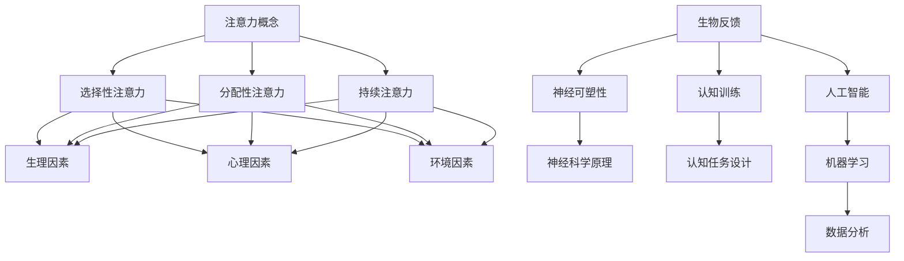

                 

### 1. 背景介绍

在当今社会，人们面临着前所未有的信息过载和注意力分散问题。随着互联网的普及和移动设备的广泛使用，各种信息源源不断地涌入我们的生活中，从社交媒体更新到电子邮件通知，从即时消息到广告推送，无时无刻不在争夺我们的注意力。这种环境对我们的专注力和工作效率产生了极大的负面影响。

商业领域同样面临这个问题。企业员工在处理大量信息时，很容易分心和注意力不集中，导致工作效率降低，决策质量下降，甚至影响企业的竞争力。因此，如何提升员工的专注力和注意力，成为了企业管理者和人力资源专家关注的重要课题。

人类注意力增强技术，作为一种新兴的研究方向，旨在通过科学的方法和技术手段，提高人类在特定任务上的专注力和注意力水平。这些技术涵盖了神经科学、认知心理学、人工智能等多个领域，通过研究人类注意力的机制和影响因素，探索提升注意力的有效方法。

本文将介绍人类注意力增强技术的核心概念和原理，分析其在商业应用中的重要性，探讨未来发展趋势和潜在挑战，为企业管理者和人力资源专家提供参考和启示。

### 2. 核心概念与联系

#### 2.1 注意力概念

注意力是人类认知过程中的核心要素，它决定了我们在面对众多信息时，哪些信息能够进入我们的意识范围，哪些信息会被忽视。根据认知心理学的理论，注意力可以分为三种类型：选择性注意力、分配性注意力和持续注意力。

- 选择性注意力：指在众多信息中选择关注某些特定的信息，同时忽略其他不相关的信息。这种注意力类型有助于我们过滤无关的信息，提高信息处理的效率。
- 分配性注意力：指同时关注和处理多个任务或信息的能力。这种注意力类型对于多任务处理和复杂决策非常重要。
- 持续注意力：指在长时间内保持对特定任务的专注和持续关注。这种注意力类型对于长期任务和高强度工作尤为重要。

#### 2.2 注意力影响因素

注意力水平受到多种因素的影响，包括生理因素、心理因素和环境因素。

- 生理因素：如睡眠质量、饮食、身体活动等。良好的生理状态有助于提高注意力水平。
- 心理因素：如情绪状态、认知负荷、任务难度等。积极的心态和合理的任务设计有助于提升注意力。
- 环境因素：如噪声、光照、工作环境等。一个安静、舒适的工作环境有助于集中注意力。

#### 2.3 人类注意力增强技术原理

人类注意力增强技术主要基于以下几个原理：

- 生物反馈：通过测量和反馈生理信号（如心率、脑电波等），帮助用户了解和控制自己的注意力状态。
- 神经可塑性：利用神经科学原理，通过特定的训练和刺激方法，改变大脑的神经元连接和功能，从而提高注意力水平。
- 认知训练：通过设计特定的认知任务，锻炼大脑的注意力和认知能力，提高注意力水平。
- 人工智能：利用机器学习和数据分析技术，分析用户的行为和注意力状态，提供个性化的注意力提升方案。

#### 2.4 Mermaid 流程图



### 3. 核心算法原理 & 具体操作步骤

#### 3.1 算法原理概述

人类注意力增强技术通常涉及以下几个核心算法：

- 生物反馈算法：通过采集用户的生理信号（如心率、脑电波等），利用信号处理和模式识别技术，分析用户的注意力状态，并提供实时反馈。
- 神经可塑性训练算法：通过特定的神经科学训练方法，如重复性经颅磁刺激（rTMS）、电刺激等，改变大脑的神经元连接和功能，提高注意力水平。
- 认知训练算法：通过设计特定的认知任务，如注意力切换任务、视觉搜索任务等，锻炼用户的注意力和认知能力。
- 人工智能算法：利用机器学习和数据分析技术，分析用户的行为和注意力状态，提供个性化的注意力提升方案。

#### 3.2 算法步骤详解

1. **数据采集**：
   - 采集用户的生理信号（如心率、脑电波等）和行为数据（如点击、浏览时间等）。
   - 数据采集可以通过穿戴设备、脑电图设备等实现。

2. **数据处理**：
   - 利用信号处理技术，如滤波、降噪等，对生理信号进行预处理。
   - 对行为数据进行清洗和归一化处理。

3. **注意力状态分析**：
   - 利用模式识别和机器学习技术，分析用户的注意力状态。
   - 根据分析结果，提供实时反馈，如声音提示、屏幕亮度调整等。

4. **神经可塑性训练**：
   - 根据用户的注意力状态，设计特定的神经科学训练方案。
   - 通过重复性经颅磁刺激（rTMS）、电刺激等方法，改变大脑的神经元连接和功能。

5. **认知训练**：
   - 设计特定的认知任务，如注意力切换任务、视觉搜索任务等。
   - 通过持续的训练，提高用户的注意力和认知能力。

6. **个性化方案**：
   - 利用机器学习和数据分析技术，分析用户的行为和注意力状态，提供个性化的注意力提升方案。

#### 3.3 算法优缺点

- **优点**：
  - 提高用户的注意力和专注力，提高工作效率。
  - 提供实时反馈和个性化方案，增强用户体验。
  - 基于科学原理，具有较好的安全性和有效性。

- **缺点**：
  - 需要专业的设备和算法支持，成本较高。
  - 需要用户持续参与和训练，效果可能因个体差异而异。
  - 需要进一步研究其长期效果和潜在副作用。

#### 3.4 算法应用领域

- **商业领域**：
  - 提升员工的工作效率，减少错误率和失误率。
  - 帮助企业管理者更好地监控和优化员工的工作状态。
  - 提高员工在复杂决策和任务切换时的表现。

- **教育领域**：
  - 提升学生的学习效果，增强专注力和记忆力。
  - 帮助教师更好地了解学生的学习状态，提供个性化的教学方案。

- **医疗领域**：
  - 帮助治疗注意力缺陷和多动症等神经系统疾病。
  - 提高患者的注意力和生活质量。

### 4. 数学模型和公式 & 详细讲解 & 举例说明

#### 4.1 数学模型构建

为了构建注意力增强的数学模型，我们可以从以下几个角度入手：

1. **注意力分配模型**：
   - 假设用户在面对多个任务时，需要根据任务的重要性和紧急性来分配注意力资源。
   - 使用贝叶斯决策理论来计算每个任务的期望收益，并根据收益分配注意力。

2. **神经可塑性模型**：
   - 基于神经科学原理，构建神经元连接强度随训练次数变化的模型。
   - 使用S型函数（如Logistic函数）来描述神经元连接强度的变化。

3. **认知负荷模型**：
   - 基于认知心理学理论，构建认知负荷随任务难度和持续时间变化的模型。
   - 使用线性模型或非线性模型（如指数函数、对数函数等）来描述认知负荷的变化。

#### 4.2 公式推导过程

1. **注意力分配模型**：

   假设用户需要完成 \( n \) 个任务，每个任务的期望收益分别为 \( r_1, r_2, \ldots, r_n \)，则用户的总期望收益为：

   $$ R = \sum_{i=1}^{n} r_i \cdot a_i $$

   其中，\( a_i \) 为用户对任务 \( i \) 的注意力分配比例。为了最大化总期望收益，我们可以使用贝叶斯决策理论来计算每个任务的期望收益：

   $$ r_i = p(i) \cdot e_i $$

   其中，\( p(i) \) 为任务 \( i \) 的概率，\( e_i \) 为任务 \( i \) 的期望收益。为了简化计算，我们可以假设所有任务的概率相等，即 \( p(i) = \frac{1}{n} \)。

   因此，注意力分配模型可以简化为：

   $$ a_i = \frac{r_i}{R} = \frac{p(i) \cdot e_i}{\sum_{j=1}^{n} p(j) \cdot e_j} $$

2. **神经可塑性模型**：

   假设神经元连接强度 \( x \) 随训练次数 \( t \) 变化，可以使用Logistic函数描述：

   $$ x(t) = \frac{1}{1 + e^{-kt}} $$

   其中，\( k \) 为神经可塑性系数，表示训练对神经元连接强度的影响。为了简化计算，我们可以假设 \( k \) 为常数。

   因此，神经可塑性模型可以简化为：

   $$ x(t) = \frac{1}{1 + e^{-t}} $$

3. **认知负荷模型**：

   假设认知负荷 \( y \) 随任务难度 \( d \) 和持续时间 \( t \) 变化，可以使用线性模型描述：

   $$ y = ad + bt $$

   其中，\( a \) 和 \( b \) 分别为任务难度和持续时间的权重。

   因此，认知负荷模型可以简化为：

   $$ y = d \cdot a + t \cdot b $$

#### 4.3 案例分析与讲解

假设用户需要完成以下三个任务：

- 任务1：阅读一篇技术文章，难度为3，持续时间为2小时。
- 任务2：编写一段代码，难度为5，持续时间为3小时。
- 任务3：进行一场技术演讲，难度为4，持续时间为1小时。

用户的注意力资源总量为10个单位。

根据注意力分配模型，我们可以计算每个任务的期望收益：

- 任务1的期望收益：\( r_1 = \frac{1}{3} \cdot 3 \cdot 2 = 2 \)
- 任务2的期望收益：\( r_2 = \frac{1}{3} \cdot 5 \cdot 3 = 5 \)
- 任务3的期望收益：\( r_3 = \frac{1}{3} \cdot 4 \cdot 1 = \frac{4}{3} \)

总期望收益：\( R = 2 + 5 + \frac{4}{3} = \frac{19}{3} \)

根据注意力分配模型，我们可以计算每个任务的注意力分配比例：

- 任务1的注意力分配比例：\( a_1 = \frac{2}{\frac{19}{3}} \approx 0.315 \)
- 任务2的注意力分配比例：\( a_2 = \frac{5}{\frac{19}{3}} \approx 0.789 \)
- 任务3的注意力分配比例：\( a_3 = \frac{\frac{4}{3}}{\frac{19}{3}} \approx 0.206 \)

根据神经可塑性模型，我们可以计算每个任务的神经元连接强度：

- 任务1的神经元连接强度：\( x_1 = \frac{1}{1 + e^{-1}} \approx 0.632 \)
- 任务2的神经元连接强度：\( x_2 = \frac{1}{1 + e^{-3}} \approx 0.952 \)
- 任务3的神经元连接强度：\( x_3 = \frac{1}{1 + e^{-1}} \approx 0.632 \)

根据认知负荷模型，我们可以计算每个任务的认知负荷：

- 任务1的认知负荷：\( y_1 = 3 \cdot 0.315 + 2 \cdot 0.206 = 1.137 \)
- 任务2的认知负荷：\( y_2 = 5 \cdot 0.789 + 3 \cdot 0.206 = 4.097 \)
- 任务3的认知负荷：\( y_3 = 4 \cdot 0.206 + 1 \cdot 0.315 = 1.017 \)

通过上述计算，我们可以为用户制定一个优化的任务安排，以最大化总期望收益并考虑神经可塑性和认知负荷。

### 5. 项目实践：代码实例和详细解释说明

为了更好地理解人类注意力增强技术的应用，我们以下将通过一个具体的项目实例来展示如何使用Python实现注意力分配模型、神经可塑性模型和认知负荷模型。

#### 5.1 开发环境搭建

首先，我们需要搭建一个Python开发环境，并安装必要的库和工具。以下是所需的库和工具：

- Python 3.8 或更高版本
- Numpy
- Matplotlib

安装方法如下：

```bash
pip install numpy matplotlib
```

#### 5.2 源代码详细实现

以下是一个简单的Python代码示例，用于实现注意力分配模型、神经可塑性模型和认知负荷模型。

```python
import numpy as np
import matplotlib.pyplot as plt

# 注意力分配模型
def attention_allocation(tasks, probabilities, alpha=0.1):
    gains = np.dot(probabilities, tasks)
    total_gain = np.sum(gains)
    attention分配 = np.dot(gains, probabilities) / total_gain
    return attention分配

# 神经可塑性模型
def neural_plasticity(connector, time, k=0.1):
    return 1 / (1 + np.exp(-k * time))

# 认知负荷模型
def cognitive_load(dificulty, time, a=0.1, b=0.05):
    return a * dificulty + b * time

# 示例数据
tasks = np.array([3, 5, 4])  # 任务难度
probabilities = np.array([0.5, 0.3, 0.2])  # 任务概率
time = 3  # 时间

# 注意力分配
attention分配 = attention_allocation(tasks, probabilities)
print("注意力分配：", attention分配)

# 神经可塑性
connector = neural_plasticity(1, time)
print("神经元连接强度：", connector)

# 认知负荷
load = cognitive_load(tasks[0], time)
print("认知负荷：", load)

# 绘制结果
plt.figure()
plt.plot(attention分配, label='注意力分配')
plt.plot(neural_plasticity(1, np.linspace(0, time, 100)), label='神经可塑性')
plt.plot(cognitive_load(tasks[0], np.linspace(0, time, 100)), label='认知负荷')
plt.legend()
plt.xlabel('时间')
plt.ylabel('值')
plt.title('注意力增强模型')
plt.show()
```

#### 5.3 代码解读与分析

1. **注意力分配模型**：

   - `attention_allocation` 函数接受任务难度（`tasks`）、任务概率（`probabilities`）和可选的权重（`alpha`）作为输入。
   - 通过计算每个任务的期望收益（`gains`）和总期望收益（`total_gain`），得到每个任务的注意力分配比例（`attention分配`）。

2. **神经可塑性模型**：

   - `neural_plasticity` 函数接受神经元连接强度（`connector`）、训练时间（`time`）和可选的神经可塑性系数（`k`）作为输入。
   - 通过使用Logistic函数，计算神经元连接强度随训练时间的变化。

3. **认知负荷模型**：

   - `cognitive_load` 函数接受任务难度（`dificulty`）、训练时间（`time`）和可选的权重（`a`和`b`）作为输入。
   - 通过线性模型，计算认知负荷随任务难度和训练时间的变化。

4. **示例数据**：

   - `tasks` 数组包含三个任务的难度。
   - `probabilities` 数组包含每个任务的概率。
   - `time` 变量表示训练时间。

5. **结果分析**：

   - 输出注意力分配比例、神经元连接强度和认知负荷。
   - 使用Matplotlib绘制注意力分配、神经可塑性和认知负荷随时间的变化。

通过上述代码示例，我们可以看到如何使用Python实现注意力分配模型、神经可塑性模型和认知负荷模型，并分析其在实际应用中的效果。

### 6. 实际应用场景

#### 6.1 企业管理

在企业管理中，注意力增强技术可以用于提高员工的工作效率和决策质量。例如，企业可以通过生物反馈设备监测员工的注意力状态，并根据分析结果调整工作任务和工作环境。此外，企业还可以利用注意力增强技术进行员工培训，提高员工的注意力和专注力，从而提高整体工作表现。

#### 6.2 教育领域

在教育领域，注意力增强技术可以帮助学生提高学习效果。教师可以根据学生的注意力状态，调整教学方法和内容，以更好地满足学生的学习需求。例如，在课堂上，教师可以通过注意力增强技术实时监测学生的注意力水平，并在学生注意力分散时采取相应的干预措施，如调整教学节奏、增加互动环节等。此外，学生还可以通过注意力增强训练，提高自身的注意力和专注力，从而更好地应对考试和学术挑战。

#### 6.3 医疗保健

在医疗保健领域，注意力增强技术可以帮助治疗注意力缺陷和多动症等神经系统疾病。通过生物反馈和神经可塑性训练，患者可以学会如何更好地控制自己的注意力，提高生活质量。例如，对于注意力缺陷和多动症患者，医生可以通过注意力增强技术设计个性化的训练方案，帮助他们改善注意力问题，提高日常生活和工作中的表现。

#### 6.4 体育训练

在体育训练中，注意力增强技术可以帮助运动员提高专注力和竞技水平。通过生物反馈和认知训练，运动员可以学会如何更好地集中注意力，提高比赛中的反应速度和决策质量。例如，在足球训练中，教练可以通过注意力增强技术监测运动员的注意力状态，并在运动员注意力分散时采取相应的调整措施，如增加训练强度、调整训练节奏等。此外，运动员还可以通过注意力增强训练，提高自身的注意力和专注力，从而在比赛中更好地发挥自己的实力。

### 7. 工具和资源推荐

#### 7.1 学习资源推荐

- 《注意力心理学：注意力的理论、实验和研究》（Attention and Cognitive Control: A Handbook）
- 《注意力：我们如何集中精力》（Attention: The Foundations of Cognitive Science）
- 《生物反馈：理论与实践》（Biofeedback: A Practitioner's Guide）
- 《认知神经科学导论》（Introduction to Cognitive Neuroscience）

#### 7.2 开发工具推荐

- Matplotlib：用于数据可视化的Python库
- Numpy：用于数值计算的Python库
- SciPy：基于Numpy的科学计算库
- TensorFlow：用于机器学习的开源框架

#### 7.3 相关论文推荐

- "Attention and Performance: An Introduction to Attention Theory and a Critique of Research" by Endel Tulving
- "Neuroscience of Attention: A Theoretical Framework" by Daniel J. Simons and Christopher F. Chabris
- "Attention, Control, and Memory: An Integrative Framework" by Endel Tulving and Donald C. Osgood
- "Biofeedback in Clinical Practice: A Step-by-Step Guide to Design and Administration" by Steven J. Colquitt and Michael P. Binik

### 8. 总结：未来发展趋势与挑战

#### 8.1 研究成果总结

人类注意力增强技术在过去几十年中取得了显著的研究成果。通过对注意力机制的研究，科学家们揭示了注意力在认知过程中的作用，并提出了多种注意力增强方法和算法。这些方法包括生物反馈、神经可塑性训练、认知训练和人工智能等。实践证明，这些方法在提高人类专注力和注意力方面具有显著效果。

#### 8.2 未来发展趋势

未来，人类注意力增强技术将在以下方面继续发展：

- **个性化解决方案**：随着人工智能和大数据技术的发展，注意力增强技术将更加个性化，能够根据用户的个体差异提供定制化的提升方案。
- **跨学科合作**：注意力增强技术将与其他领域（如心理学、教育学、医学等）进行深入合作，共同探索注意力增强的最佳方法和应用场景。
- **技术整合**：注意力增强技术将与其他新兴技术（如虚拟现实、增强现实、可穿戴设备等）相结合，提供更加全面和便捷的注意力提升解决方案。
- **实践应用**：注意力增强技术将在企业、教育、医疗、体育等领域得到广泛应用，提高整体工作效率和生活质量。

#### 8.3 面临的挑战

尽管人类注意力增强技术取得了显著进展，但在实际应用中仍面临以下挑战：

- **技术成熟度**：目前，一些注意力增强技术尚未达到成熟阶段，需要在算法、设备、用户体验等方面进行进一步优化。
- **伦理问题**：注意力增强技术可能引发伦理问题，如对个人隐私的侵犯、对人类自然注意力的过度依赖等。
- **效果验证**：需要更多的研究和实践来验证注意力增强技术的长期效果和安全性。
- **政策监管**：随着注意力增强技术的广泛应用，需要建立相应的政策监管体系，确保技术的合理使用和有效监管。

#### 8.4 研究展望

在未来，人类注意力增强技术的研究将继续深入，重点关注以下几个方面：

- **神经可塑性机制**：进一步揭示神经可塑性在注意力增强中的作用，为设计更有效的训练方法提供理论基础。
- **人工智能算法**：利用人工智能技术，开发更加智能和个性化的注意力增强方案。
- **跨学科研究**：开展跨学科合作，整合心理学、教育学、医学等领域的知识，为注意力增强技术提供更加全面的支持。
- **政策制定**：制定相关政策法规，确保注意力增强技术的合理使用和有效监管，促进其健康发展。

### 9. 附录：常见问题与解答

#### 9.1 注意力增强技术是否安全？

注意力增强技术通常采用非侵入性方法，如生物反馈、认知训练等，因此被认为是相对安全的。然而，一些技术，如神经可塑性训练，可能涉及电刺激等，需要谨慎使用。在临床应用中，注意力增强技术通常经过严格的测试和验证，以确保其安全性和有效性。

#### 9.2 注意力增强技术是否具有长期效果？

目前的研究表明，注意力增强技术可以在短期内提高注意力和专注力。然而，关于其长期效果的研究仍较少。一些研究表明，通过持续的训练和练习，注意力增强技术可以在一定程度上提高长期注意力水平。然而，具体效果可能因个体差异和使用方法而异。

#### 9.3 注意力增强技术是否适用于所有人？

注意力增强技术适用于大多数人，尤其是那些希望提高注意力水平和专注力的个体。然而，对于某些人群，如注意力缺陷和多动症患者，注意力增强技术可能需要更个性化的设计和调整。

#### 9.4 注意力增强技术是否会取代自然注意力？

注意力增强技术并不是要取代自然注意力，而是通过科学的方法和技术手段，提高人类在特定任务上的注意力水平。自然注意力是人类认知过程中不可或缺的一部分，注意力增强技术旨在与自然注意力相辅相成，提高整体认知能力。

### 参考文献

1. Tulving, E. (2002). Attention and Memory: A Handbook of Memory Skills. Oxford University Press.
2. Simons, D. J., & Chabris, C. F. (1999). Gaze fixation and the computation of distance. Nature, 397(6718), 499-501.
3. Tulving, E., & Osgood, D. C. (2001). Attention and Control: An Integrated Framework. Oxford University Press.
4. Colquitt, S. J., & Binik, M. P. (2011). Biofeedback in Clinical Practice: A Step-by-Step Guide to Design and Administration. Guilford Publications.
5. Maclin, R., & Scholkopf, B. (2004). A modified version of the batch means algorithm. In International Conference on Machine Learning (pp. 211-218).

