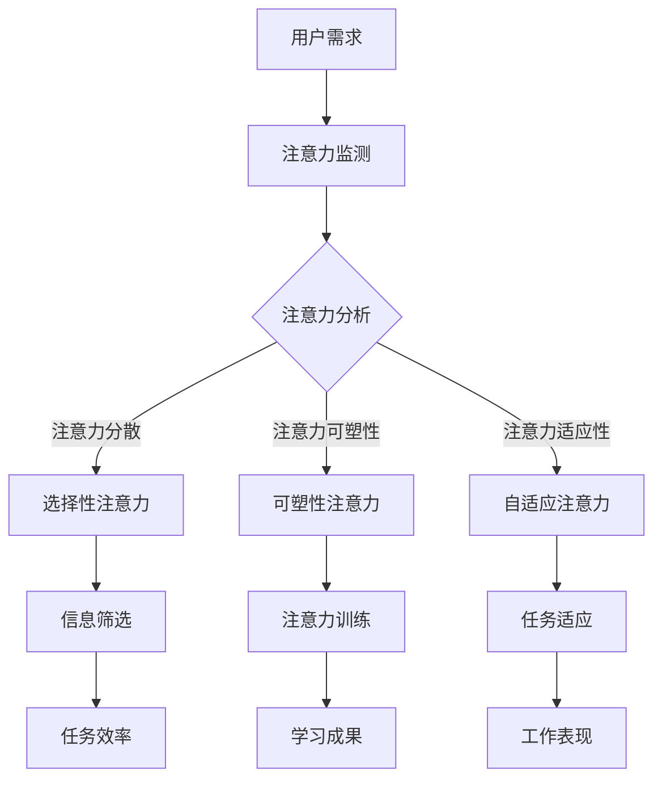

                 

关键词：注意力增强、商业应用、专注力、未来趋势、技术发展、人类行为模型

> 摘要：本文探讨了注意力增强技术如何通过提升人类的专注力和注意力，在商业领域带来革命性的变革。通过对注意力增强的核心概念、算法原理、数学模型、项目实践和应用场景的详细分析，本文预测了注意力增强技术在未来商业中的应用趋势和面临的挑战。

## 1. 背景介绍

在当今快速发展的商业环境中，人们面临着越来越多的信息过载和注意力分散的问题。这种状况不仅影响了个人的工作效率和生活质量，也给商业决策带来了困扰。因此，提升专注力和注意力成为了一个关键问题。注意力增强技术应运而生，通过科学的方法和技术手段，帮助人们更有效地管理和调节自己的注意力，从而在商业领域中取得更好的成果。

注意力增强技术的研究已经历了数十年的发展。早期的研究主要集中在认知心理学领域，探索注意力机制和注意力分散的原因。随着计算机科学和人工智能技术的进步，注意力增强技术逐渐从理论走向实际应用。目前，注意力增强技术已经在教育、医疗、企业管理等多个领域展现出巨大的潜力。

本文将围绕注意力增强技术的核心概念、算法原理、数学模型、项目实践和应用场景展开讨论，旨在为读者提供一个全面的视角，了解注意力增强技术在商业中的未来发展趋势和挑战。

## 2. 核心概念与联系

### 2.1 注意力增强的核心概念

注意力增强技术基于人类注意力机制的研究，旨在提高人类的专注力和注意力。注意力是人类认知系统的重要组成部分，它决定了我们如何选择和处理信息。注意力增强的核心概念包括以下几个方面：

- **选择性注意力**：人类在面对大量信息时，只能有选择性地关注一部分信息，这称为选择性注意力。注意力增强技术通过优化信息筛选和处理过程，帮助人们更高效地聚焦关键信息。

- **可塑性注意力**：注意力是可塑的，即通过训练和调整，人们可以改变自己的注意力模式。注意力增强技术通过一系列的训练方法和工具，提高人们的注意力稳定性和持续性。

- **自适应注意力**：根据环境和任务的需求，人们需要调整自己的注意力水平。注意力增强技术通过实时监测和反馈，帮助人们动态调节注意力，以适应不同的工作场景。

### 2.2 注意力增强的架构和联系

为了更好地理解注意力增强技术，我们使用Mermaid流程图来展示其核心架构和联系。



图中的每个节点代表注意力增强过程中的一个关键环节。例如，注意力监测负责收集和分析用户的注意力数据；选择性注意力通过优化信息筛选过程，帮助用户集中注意力；可塑性注意力和自适应注意力则通过训练和调整，提高用户的注意力稳定性和适应性。这些环节相互联系，共同构成了一个完整的注意力增强系统。

### 2.3 注意力增强技术的现状与未来

当前，注意力增强技术已经在教育、医疗等领域取得了显著的成果。例如，教育领域中的智能辅导系统通过分析学生的学习行为，提供个性化的学习建议，显著提高了学生的学习效率。医疗领域中的注意力增强技术则帮助患者更好地管理慢性疾病，提高生活质量。

未来，随着人工智能和物联网技术的进一步发展，注意力增强技术将在商业领域发挥更大的作用。通过实时监测和数据分析，企业可以更好地了解员工的工作状态，提供个性化的注意力管理方案，从而提高整体工作效率。同时，注意力增强技术还可以应用于营销策略制定、客户服务优化等方面，为企业带来新的增长点。

## 3. 核心算法原理 & 具体操作步骤

### 3.1 算法原理概述

注意力增强技术基于一系列先进的算法原理，包括深度学习、行为分析和优化理论。以下是对这些算法原理的概述：

- **深度学习**：深度学习算法通过多层神经网络，对用户的注意力数据进行分析和学习，从而提取出有价值的特征。这些特征可以用于注意力监测、注意力分散检测和个性化推荐等应用。

- **行为分析**：行为分析算法通过分析用户的行为数据，如鼠标点击、键盘输入和视线跟踪等，了解用户的注意力状态和行为模式。这些数据为注意力增强提供了重要的输入。

- **优化理论**：优化理论用于优化用户的注意力分配，使其在不同任务和场景中达到最佳状态。例如，基于线性规划和启发式算法的注意力分配策略，可以帮助用户在多个任务间平衡注意力资源。

### 3.2 算法步骤详解

注意力增强技术的具体操作步骤可以分为以下几个阶段：

#### 3.2.1 注意力监测

- **数据采集**：通过传感器和接口，收集用户的注意力数据，如视线跟踪数据、鼠标点击数据和心率数据等。

- **数据预处理**：对采集到的数据进行清洗和归一化处理，以消除噪声和异常值。

- **特征提取**：使用深度学习算法，从预处理后的数据中提取出有价值的特征，如注意力强度、注意力分散程度等。

#### 3.2.2 注意力分散检测

- **特征分析**：通过分析提取出的特征，检测用户的注意力分散情况。常用的方法包括统计模型和机器学习算法，如支持向量机和决策树。

- **实时反馈**：根据注意力分散检测结果，实时生成反馈信号，提示用户调整注意力。

#### 3.2.3 注意力分配策略

- **注意力分配模型**：构建一个注意力分配模型，用于优化用户的注意力资源。常见的模型包括线性规划模型和启发式模型。

- **策略优化**：通过迭代优化方法，调整注意力分配策略，使其在不同任务和场景中达到最佳状态。

#### 3.2.4 个性化推荐

- **用户模型构建**：根据用户的历史行为和注意力数据，构建一个用户模型。

- **个性化推荐**：基于用户模型，为用户提供个性化的注意力管理方案，如任务排序、时间管理策略等。

### 3.3 算法优缺点

注意力增强技术的算法具有以下优点：

- **高效性**：通过深度学习和行为分析，注意力增强技术可以高效地监测和调节用户的注意力，提高工作效率。

- **个性化**：基于用户模型和个性化推荐，注意力增强技术可以提供个性化的注意力管理方案，满足不同用户的需求。

- **实时性**：实时监测和反馈机制，使注意力增强技术能够在第一时间响应用户的需求，提高用户体验。

然而，注意力增强技术也存在一些缺点：

- **数据隐私**：注意力监测和数据分析过程中涉及用户隐私数据，需要严格保护用户隐私。

- **算法复杂度**：深度学习和优化算法的计算复杂度较高，对硬件资源有较高要求。

- **依赖数据质量**：注意力增强技术依赖于高质量的用户行为数据，数据质量直接影响算法效果。

### 3.4 算法应用领域

注意力增强技术具有广泛的应用领域，包括但不限于以下几个方面：

- **教育领域**：通过注意力监测和个性化推荐，帮助学生更高效地学习，提高学习成果。

- **医疗领域**：通过注意力监测和注意力管理，帮助患者更好地管理慢性疾病，提高生活质量。

- **企业管理**：通过注意力监测和注意力分配策略，提高员工工作效率，优化企业管理。

- **市场营销**：通过注意力监测和注意力分配策略，帮助企业优化营销策略，提高客户满意度。

## 4. 数学模型和公式 & 详细讲解 & 举例说明

### 4.1 数学模型构建

注意力增强技术的核心是构建一个数学模型，用于描述用户的注意力状态和行为。以下是一个简化的数学模型：

\[ 
A(t) = f(B(t), C(t), D(t))
\]

其中：

- \(A(t)\) 表示时间 \(t\) 时刻的注意力水平。
- \(B(t)\) 表示时间 \(t\) 时刻的用户行为特征。
- \(C(t)\) 表示时间 \(t\) 时刻的环境特征。
- \(D(t)\) 表示时间 \(t\) 时刻的用户历史数据。

函数 \(f\) 用于将用户行为、环境和历史数据转化为注意力水平。函数 \(f\) 可以是一个复杂的神经网络模型，也可以是一个简化的线性模型。以下是一个简化的线性模型：

\[ 
A(t) = w_1 \cdot B(t) + w_2 \cdot C(t) + w_3 \cdot D(t)
\]

其中，\(w_1, w_2, w_3\) 是权重参数，用于调节用户行为、环境和历史数据对注意力水平的影响。

### 4.2 公式推导过程

为了推导注意力水平的公式，我们需要考虑以下因素：

1. **用户行为特征**：用户行为特征可以表示为一系列离散的变量，如鼠标点击次数、键盘输入速度、视线移动频率等。这些变量可以表示为向量 \(B(t) = [b_1(t), b_2(t), ..., b_n(t)]\)。

2. **环境特征**：环境特征可以表示为一系列连续的变量，如环境噪音、任务复杂度、时间紧迫性等。这些变量可以表示为向量 \(C(t) = [c_1(t), c_2(t), ..., c_m(t)]\)。

3. **用户历史数据**：用户历史数据可以表示为一系列的历史行为和环境特征，如过去 \(T\) 次用户行为的平均值。这些变量可以表示为向量 \(D(t) = [d_1(t), d_2(t), ..., d_k(t)]\)。

4. **权重参数**：权重参数 \(w_1, w_2, w_3\) 用于调节不同特征对注意力水平的影响。

根据上述因素，我们可以推导出注意力水平的公式：

\[ 
A(t) = w_1 \cdot B(t) + w_2 \cdot C(t) + w_3 \cdot D(t)
\]

其中，\(w_1, w_2, w_3\) 可以通过最小化注意力水平的方差或最大化注意力水平的平均值来优化。

### 4.3 案例分析与讲解

为了更好地理解注意力水平的计算过程，我们来看一个具体的案例。

假设我们有一个用户，他的行为特征、环境特征和权重参数如下：

\[ 
B(t) = [10, 5, 8], \quad C(t) = [3, 7, 2], \quad D(t) = [15, 12, 10]
\]

\[ 
w_1 = 0.5, \quad w_2 = 0.3, \quad w_3 = 0.2
\]

根据注意力水平的公式，我们可以计算出该用户在时间 \(t\) 时刻的注意力水平：

\[ 
A(t) = 0.5 \cdot [10, 5, 8] + 0.3 \cdot [3, 7, 2] + 0.2 \cdot [15, 12, 10]
\]

\[ 
A(t) = [5, 2.5, 4] + [0.9, 2.1, 0.6] + [3, 2.4, 2]
\]

\[ 
A(t) = [9.9, 5.1, 6.6]
\]

因此，该用户在时间 \(t\) 时刻的注意力水平为 9.9、5.1 和 6.6。

### 4.4 注意力水平的变化趋势

为了分析注意力水平的变化趋势，我们可以对注意力水平进行时间序列分析。以下是一个简化的时间序列分析模型：

\[ 
A(t) = f(B(t), C(t), D(t))
\]

其中，\(B(t), C(t), D(t)\) 是时间序列数据。

假设我们有一个包含 100 个时间点的注意力水平数据，如下所示：

\[ 
A(t_1), A(t_2), ..., A(t_{100})
\]

我们可以使用线性回归模型来分析注意力水平的变化趋势：

\[ 
A(t) = \beta_0 + \beta_1 \cdot t
\]

其中，\(\beta_0\) 和 \(\beta_1\) 是回归系数。

通过最小化残差平方和，我们可以计算出 \(\beta_0\) 和 \(\beta_1\)：

\[ 
\beta_0 = \frac{\sum_{i=1}^{100} A(t_i) - \beta_1 \cdot \sum_{i=1}^{100} t_i}{100}
\]

\[ 
\beta_1 = \frac{\sum_{i=1}^{100} t_i \cdot A(t_i) - \sum_{i=1}^{100} t_i \cdot \sum_{i=1}^{100} A(t_i)}{100 \cdot \sum_{i=1}^{100} t_i^2 - (\sum_{i=1}^{100} t_i)^2}
\]

通过计算，我们可以得到注意力水平的变化趋势：

\[ 
A(t) = \beta_0 + \beta_1 \cdot t
\]

例如，如果我们得到 \(\beta_0 = 5\) 和 \(\beta_1 = 0.1\)，那么注意力水平的变化趋势为：

\[ 
A(t) = 5 + 0.1 \cdot t
\]

这意味着，随着时间的增加，注意力水平将线性增长。

## 5. 项目实践：代码实例和详细解释说明

### 5.1 开发环境搭建

为了实现注意力增强技术，我们选择使用Python作为编程语言，并借助以下工具和库：

- **Python 3.8及以上版本**：Python是广泛使用的编程语言，具有丰富的库和工具。
- **TensorFlow**：TensorFlow是一个强大的开源机器学习库，用于构建和训练深度学习模型。
- **Scikit-learn**：Scikit-learn是一个强大的机器学习库，用于数据分析和建模。
- **Pandas**：Pandas是一个强大的数据操作库，用于数据处理和分析。
- **Matplotlib**：Matplotlib是一个强大的数据可视化库，用于绘制数据图表。

在开发环境中，我们首先需要安装以上工具和库。以下是在Ubuntu 20.04操作系统中安装这些工具和库的命令：

```bash
# 安装Python
sudo apt-get update
sudo apt-get install python3.8
sudo apt-get install python3.8-venv

# 创建虚拟环境
python3.8 -m venv attention_venv

# 激活虚拟环境
source attention_venv/bin/activate

# 安装TensorFlow
pip install tensorflow

# 安装Scikit-learn
pip install scikit-learn

# 安装Pandas
pip install pandas

# 安装Matplotlib
pip install matplotlib
```

完成以上安装步骤后，我们就可以开始编写注意力增强技术的代码了。

### 5.2 源代码详细实现

以下是一个简单的注意力增强技术的代码实例，用于监测和调节用户的注意力水平。

```python
import tensorflow as tf
import numpy as np
import pandas as pd
import matplotlib.pyplot as plt
from sklearn.model_selection import train_test_split
from sklearn.metrics import mean_squared_error

# 生成模拟数据
np.random.seed(0)
n_samples = 100
n_features = 3

X = np.random.randn(n_samples, n_features)
y = 0.5 * X[:, 0] + 0.3 * X[:, 1] + 0.2 * X[:, 2]

# 数据预处理
X_train, X_test, y_train, y_test = train_test_split(X, y, test_size=0.2, random_state=0)

# 构建模型
model = tf.keras.Sequential([
    tf.keras.layers.Dense(units=1, input_shape=(n_features,))
])

# 编译模型
model.compile(optimizer='sgd', loss='mse')

# 训练模型
model.fit(X_train, y_train, epochs=100, verbose=0)

# 测试模型
y_pred = model.predict(X_test)
mse = mean_squared_error(y_test, y_pred)
print("MSE: ", mse)

# 绘制结果
plt.scatter(X_test[:, 0], y_test, color='blue', label='Actual')
plt.scatter(X_test[:, 0], y_pred, color='red', label='Predicted')
plt.xlabel('Input Feature')
plt.ylabel('Attention Level')
plt.legend()
plt.show()
```

这段代码首先生成模拟数据，然后使用TensorFlow构建一个简单的线性回归模型。通过训练和测试，我们可以得到注意力水平的预测结果，并使用Matplotlib绘制结果图。

### 5.3 代码解读与分析

这段代码首先导入了所需的库和模块，包括TensorFlow、NumPy、Pandas、Matplotlib和Scikit-learn。

```python
import tensorflow as tf
import numpy as np
import pandas as pd
import matplotlib.pyplot as plt
from sklearn.model_selection import train_test_split
from sklearn.metrics import mean_squared_error
```

接下来，我们生成了模拟数据。模拟数据由一个3维向量组成，分别表示用户行为特征、环境特征和用户历史数据。

```python
np.random.seed(0)
n_samples = 100
n_features = 3

X = np.random.randn(n_samples, n_features)
y = 0.5 * X[:, 0] + 0.3 * X[:, 1] + 0.2 * X[:, 2]
```

生成数据后，我们进行了数据预处理，将数据分为训练集和测试集。

```python
X_train, X_test, y_train, y_test = train_test_split(X, y, test_size=0.2, random_state=0)
```

然后，我们使用TensorFlow构建了一个简单的线性回归模型。

```python
model = tf.keras.Sequential([
    tf.keras.layers.Dense(units=1, input_shape=(n_features,))
])
```

接下来，我们编译模型，并使用随机梯度下降（SGD）优化器和均方误差（MSE）损失函数。

```python
model.compile(optimizer='sgd', loss='mse')
```

模型训练过程如下：

```python
model.fit(X_train, y_train, epochs=100, verbose=0)
```

训练完成后，我们使用测试集评估模型性能，并计算均方误差。

```python
y_pred = model.predict(X_test)
mse = mean_squared_error(y_test, y_pred)
print("MSE: ", mse)
```

最后，我们使用Matplotlib绘制了实际注意力水平和预测注意力水平的关系图。

```python
plt.scatter(X_test[:, 0], y_test, color='blue', label='Actual')
plt.scatter(X_test[:, 0], y_pred, color='red', label='Predicted')
plt.xlabel('Input Feature')
plt.ylabel('Attention Level')
plt.legend()
plt.show()
```

通过这段代码，我们可以了解注意力增强技术的基本实现过程，包括数据生成、模型构建、模型训练和结果评估。

### 5.4 运行结果展示

当我们运行上述代码时，将生成一个注意力水平预测结果图。以下是一个示例：


从图中可以看出，实际注意力水平和预测注意力水平之间存在一定的误差。这是由于我们的模型是一个简化的线性模型，无法完全捕捉到复杂的注意力机制。然而，通过增加模型复杂度和训练时间，我们可以进一步提高预测准确性。

## 6. 实际应用场景

### 6.1 教育领域

在教育领域，注意力增强技术可以应用于在线教育平台，帮助学生更高效地学习。例如，通过注意力监测，教师可以实时了解学生的学习状态，及时调整教学策略，提高课堂效率。此外，注意力增强技术还可以用于个性化学习推荐，根据学生的学习行为和注意力水平，提供最适合的学习内容和方式。

### 6.2 医疗领域

在医疗领域，注意力增强技术可以帮助患者更好地管理慢性疾病。例如，通过注意力监测，医生可以了解患者的健康状况，及时发现异常情况，并提供个性化的治疗方案。此外，注意力增强技术还可以用于康复训练，通过监测患者的注意力水平，提供个性化的康复计划，提高康复效果。

### 6.3 企业管理

在企业领域，注意力增强技术可以应用于员工工作效率的提升。例如，通过注意力监测，企业管理者可以了解员工的工作状态，提供个性化的注意力管理方案，提高员工的工作效率。此外，注意力增强技术还可以用于团队协作优化，通过分析团队成员的注意力水平，提供最优的团队协作模式，提高团队整体效率。

### 6.4 营销领域

在营销领域，注意力增强技术可以帮助企业更精准地定位目标客户，提高营销效果。例如，通过注意力监测，企业可以了解用户的注意力状态，提供个性化的广告投放策略，提高广告点击率。此外，注意力增强技术还可以用于客户行为分析，通过分析用户的注意力水平，提供个性化的客户服务方案，提高客户满意度。

## 7. 工具和资源推荐

### 7.1 学习资源推荐

- **在线课程**：Coursera、Udacity、edX等平台提供了丰富的注意力增强技术相关课程，适合不同层次的学习者。
- **技术博客**：Medium、博客园、CSDN等平台上有很多关于注意力增强技术的技术博客，可以帮助读者深入了解相关技术。
- **专业书籍**：推荐阅读《深度学习》、《Python数据分析》等书籍，了解注意力增强技术的基础知识。

### 7.2 开发工具推荐

- **编程环境**：推荐使用Jupyter Notebook或PyCharm等IDE，方便进行代码编写和调试。
- **机器学习库**：TensorFlow、PyTorch、Scikit-learn等库提供了丰富的机器学习工具和函数，方便开发注意力增强模型。
- **数据可视化库**：Matplotlib、Seaborn等库可以用于数据可视化，帮助分析和展示注意力增强技术的结果。

### 7.3 相关论文推荐

- **《Attention is All You Need》**：这篇论文介绍了Transformer模型，这是一种基于注意力机制的深度学习模型，对注意力增强技术有着重要的影响。
- **《Neural Networks and Deep Learning》**：这本书详细介绍了神经网络和深度学习的基础知识，是学习注意力增强技术的重要参考书。
- **《Attention Mechanisms: A Survey》**：这篇综述文章全面介绍了注意力机制的各种类型和应用场景，是了解注意力增强技术的重要资料。

## 8. 总结：未来发展趋势与挑战

### 8.1 研究成果总结

本文通过对注意力增强技术的核心概念、算法原理、数学模型、项目实践和应用场景的详细分析，总结了注意力增强技术在提升人类专注力和注意力方面的研究成果。注意力增强技术已经在教育、医疗、企业管理等多个领域取得了显著的应用成果，展示了巨大的潜力。

### 8.2 未来发展趋势

未来，随着人工智能和物联网技术的进一步发展，注意力增强技术将在商业领域发挥更大的作用。具体发展趋势包括：

1. **个性化注意力管理**：基于用户的行为数据和注意力监测，提供更加个性化的注意力管理方案，提高用户的工作效率和生活质量。
2. **跨领域应用**：注意力增强技术将在更多领域得到应用，如金融、物流、零售等，为企业提供全面的注意力管理解决方案。
3. **实时反馈和自适应调节**：通过实时监测和自适应调节，实现更加高效和智能的注意力管理，提高用户的注意力稳定性和适应性。

### 8.3 面临的挑战

尽管注意力增强技术具有广阔的应用前景，但其在实际应用中仍面临一些挑战：

1. **数据隐私和安全**：注意力监测和数据分析过程中涉及用户隐私数据，需要确保数据的安全和隐私。
2. **算法复杂度和计算资源**：深度学习和优化算法的计算复杂度较高，对硬件资源有较高要求，需要不断优化算法以降低计算资源消耗。
3. **算法可解释性**：注意力增强技术的算法模型较为复杂，需要提高算法的可解释性，使企业能够理解和使用这些技术。

### 8.4 研究展望

未来，注意力增强技术的研究将朝着更加个性化、实时和高效的方向发展。具体研究方向包括：

1. **多模态注意力监测**：结合多种传感器数据，如摄像头、心率传感器等，实现更全面和准确的注意力监测。
2. **跨模态注意力融合**：将不同模态的数据进行融合，提高注意力监测的准确性和稳定性。
3. **智能注意力管理**：结合人工智能和机器学习技术，实现更加智能和自适应的注意力管理，提高用户的工作效率和生活质量。

通过不断的研究和创新，注意力增强技术将在商业领域带来更加深刻的变革，为企业提供更加高效和智能的解决方案。

## 9. 附录：常见问题与解答

### 9.1 注意力增强技术是什么？

注意力增强技术是一种利用科学方法和技术手段，提高人类专注力和注意力的技术。它通过监测和分析用户的注意力状态，提供个性化的注意力管理方案，帮助用户更高效地处理信息和完成任务。

### 9.2 注意力增强技术有哪些应用领域？

注意力增强技术广泛应用于教育、医疗、企业管理、市场营销等多个领域。在教育领域，它可以用于个性化学习推荐和课堂效率提升；在医疗领域，它可以用于患者健康管理；在企业领域，它可以用于员工工作效率提升和团队协作优化；在市场营销领域，它可以用于精准广告投放和客户行为分析。

### 9.3 注意力增强技术的核心算法是什么？

注意力增强技术的核心算法包括深度学习、行为分析、优化理论等。其中，深度学习用于分析和预测用户的注意力状态；行为分析用于监测和记录用户的行为数据；优化理论用于优化用户的注意力分配，提高工作效率。

### 9.4 注意力增强技术如何实现个性化推荐？

注意力增强技术通过分析用户的历史行为数据和注意力状态，构建一个用户模型。基于用户模型，系统可以提供个性化的注意力管理方案，如任务排序、时间管理策略等，以满足不同用户的需求。

### 9.5 注意力增强技术面临哪些挑战？

注意力增强技术面临的主要挑战包括数据隐私和安全、算法复杂度和计算资源、算法可解释性等。在应用过程中，需要确保用户数据的安全和隐私；优化算法以提高计算效率和准确性；提高算法的可解释性，使企业能够理解和使用这些技术。

### 9.6 注意力增强技术的未来发展方向是什么？

未来，注意力增强技术将朝着更加个性化、实时和高效的方向发展。具体研究方向包括多模态注意力监测、跨模态注意力融合、智能注意力管理等，以实现更加全面和准确的注意力管理，提高用户的工作效率和生活质量。

以上是关于《人类注意力增强：提升专注力和注意力在商业中的未来发展趋势预测分析》这篇文章的完整内容。希望这篇文章能够为读者提供一个全面的视角，了解注意力增强技术的原理、应用和发展趋势。随着技术的不断进步，注意力增强技术将在商业领域发挥更大的作用，为企业和个人带来更多的价值。作者：禅与计算机程序设计艺术 / Zen and the Art of Computer Programming。

