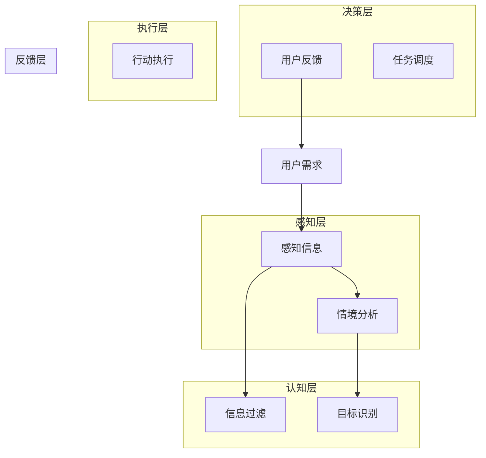

                 

关键词：人类注意力、专注力、商业、人工智能、注意力增强、技术展望

> 摘要：随着人工智能技术的快速发展，人类注意力管理的重要性日益凸显。本文从技术视角探讨如何利用注意力增强技术提高人类的专注力，并分析这一技术在商业领域的潜在应用和未来发展方向。

## 1. 背景介绍

### 注意力管理的重要性

注意力是人类认知过程中的核心要素，直接影响我们的学习、工作和日常生活。然而，在当今信息爆炸的时代，人类面临着前所未有的注意力分散挑战。手机、社交媒体、即时通讯等电子设备不断分散我们的注意力，导致我们的专注力水平显著下降。根据美国国家科学基金会的一项研究，成年人每天平均花费约3.6个小时在使用电子设备上，其中许多时间都是被动的信息消费，而不是主动的、有目的的学习或工作。

### 商业对注意力管理的需求

在商业领域，高效的工作和决策依赖于员工的专注力和注意力。企业的运营效率、创新能力以及市场竞争力都与员工的工作专注度紧密相关。然而，工作环境的复杂性和信息过载使得员工常常难以保持专注，从而导致生产力下降、决策失误以及客户满意度降低。因此，商业对注意力管理提出了迫切的需求，希望能够利用技术手段提高员工的专注力和工作效率。

### 人工智能与注意力增强

随着人工智能技术的进步，我们有机会利用这些技术来增强人类的注意力。注意力增强技术包括认知增强、智能提醒、情境感知等，它们能够帮助人们更好地管理自己的注意力，提高专注力。例如，通过认知增强技术，人工智能可以帮助用户过滤掉无关信息，从而让他们更加集中地处理重要任务。智能提醒系统则可以自动识别用户的任务优先级，并在需要时提醒他们，以避免分心。

## 2. 核心概念与联系

为了更好地理解注意力增强技术，我们需要首先了解一些核心概念和它们之间的联系。以下是一个简化的 Mermaid 流程图，展示了注意力增强技术的基本架构。



### 感知层：情境分析

感知层主要负责收集用户的信息和情境数据。这些数据包括用户当前的活动、环境噪音、心理状态等。通过情境分析，系统可以识别用户所处的环境，以便提供个性化的注意力管理策略。

### 认知层：信息过滤和目标识别

认知层对感知层收集的信息进行过滤和处理，识别用户当前的目标和任务。通过筛选出与任务相关的关键信息，系统可以帮助用户集中注意力，减少无关信息的干扰。

### 决策层：提醒策略和任务调度

决策层根据认知层提供的信息，制定合适的提醒策略和任务调度方案。例如，当用户需要专注于一个重要任务时，系统可以自动屏蔽不必要的通知，以避免分心。

### 执行层：行动执行

执行层负责将决策层的指令转化为具体的行动。例如，系统可以自动调整用户的界面设置，屏蔽不必要的窗口或通知，从而帮助用户更好地集中注意力。

### 反馈层：用户反馈

反馈层收集用户对注意力管理策略的反馈，以不断优化系统的性能。用户可以通过反馈层提供的信息，调整自己的工作方式，以获得更好的注意力管理效果。

## 3. 核心算法原理 & 具体操作步骤

### 3.1 算法原理概述

注意力增强技术的核心在于通过算法自动识别用户的注意力状态，并根据当前状态调整系统的干预策略。以下是一个简化的算法原理框架：

1. **感知数据收集**：系统收集用户的行为数据，如鼠标移动、键盘输入、屏幕活动等，以识别用户当前的工作状态。
2. **情境分析**：基于感知数据，系统分析用户所处的情境，如是否在会议中、是否在执行重要任务等。
3. **注意力状态识别**：系统使用机器学习算法，基于历史数据和当前情境，识别用户的注意力状态。
4. **决策制定**：根据注意力状态，系统制定干预策略，如屏蔽通知、调整界面布局、提供智能提醒等。
5. **执行干预**：系统执行决策，实施注意力管理措施。
6. **反馈收集**：系统收集用户的反馈，以优化未来的干预策略。

### 3.2 算法步骤详解

1. **数据预处理**：收集用户的行为数据，如点击事件、屏幕活动等，并进行预处理，以提取关键特征。
   ```mermaid
   graph TD
       A[收集行为数据] --> B[数据预处理]
       B --> C[特征提取]
   ```

2. **情境分析**：利用时间序列分析和模式识别技术，分析用户的行为模式，以识别用户所处的情境。
   ```mermaid
   graph TD
       C --> D[情境识别]
   ```

3. **注意力状态识别**：使用机器学习算法，如神经网络或支持向量机，对用户的行为数据进行建模，以预测用户的注意力状态。
   ```mermaid
   graph TD
       D --> E[训练模型]
       E --> F[状态预测]
   ```

4. **决策制定**：根据注意力状态，系统制定干预策略。例如，当用户处于低注意力状态时，系统可以屏蔽通知，并提供智能提醒。
   ```mermaid
   graph TD
       F --> G[决策制定]
   ```

5. **执行干预**：系统执行决策，实施注意力管理措施。例如，调整用户界面布局，屏蔽无关窗口等。
   ```mermaid
   graph TD
       G --> H[执行干预]
   ```

6. **反馈收集**：系统收集用户的反馈，以优化未来的干预策略。例如，通过用户反馈调整算法参数，提高干预效果。
   ```mermaid
   graph TD
       H --> I[反馈收集]
       I --> F[优化模型]
   ```

### 3.3 算法优缺点

#### 优点

- **个性化**：算法可以根据用户的行为和情境，提供个性化的注意力管理策略。
- **自动化**：系统可以自动执行干预措施，减少人工干预，提高工作效率。
- **实时性**：算法可以实时分析用户的状态，并快速做出反应。

#### 缺点

- **准确性**：算法的准确性依赖于用户行为数据的质量和多样性，数据不足可能导致误判。
- **隐私问题**：收集和处理用户行为数据可能引发隐私问题，需要严格保护用户隐私。

### 3.4 算法应用领域

注意力增强技术在多个领域具有广泛的应用潜力：

- **办公自动化**：帮助员工集中注意力，提高工作效率。
- **在线教育**：辅助学生保持注意力，提高学习效果。
- **智能家居**：通过监测家庭成员的行为，提供个性化的智能家居体验。
- **健康监测**：监测用户的注意力状态，提供健康建议。

## 4. 数学模型和公式 & 详细讲解 & 举例说明

### 4.1 数学模型构建

注意力增强技术中的核心数学模型通常是基于概率图模型或深度学习模型。以下是一个简化的概率图模型示例。

#### 概率图模型

```latex
P(注意力状态) = P(行为特征) \cdot P(情境特征) \cdot P(状态转移)
```

其中：

- \(P(注意力状态)\) 是用户当前注意力状态的概率。
- \(P(行为特征)\) 是用户行为特征的联合概率分布。
- \(P(情境特征)\) 是用户情境特征的联合概率分布。
- \(P(状态转移)\) 是用户状态转移的概率分布。

#### 深度学习模型

```latex
y = f(W \cdot x + b)
```

其中：

- \(y\) 是用户当前注意力状态的预测值。
- \(x\) 是输入特征向量。
- \(W\) 是权重矩阵。
- \(b\) 是偏置项。
- \(f\) 是激活函数。

### 4.2 公式推导过程

#### 概率图模型推导

1. **行为特征概率分布**：

   ```latex
   P(行为特征) = \prod_{i=1}^{n} P(x_i)
   ```

   其中 \(x_i\) 表示第 \(i\) 个行为特征。

2. **情境特征概率分布**：

   ```latex
   P(情境特征) = \prod_{j=1}^{m} P(s_j)
   ```

   其中 \(s_j\) 表示第 \(j\) 个情境特征。

3. **状态转移概率分布**：

   ```latex
   P(状态转移) = \sum_{k=1}^{K} P(s_k|s_{k-1})
   ```

   其中 \(s_k\) 表示第 \(k\) 个状态，\(K\) 是状态总数。

4. **注意力状态概率**：

   ```latex
   P(注意力状态) = P(行为特征) \cdot P(情境特征) \cdot P(状态转移)
   ```

#### 深度学习模型推导

1. **前向传播**：

   ```latex
   z = W \cdot x + b
   ```

2. **激活函数**：

   ```latex
   a = f(z)
   ```

3. **输出**：

   ```latex
   y = f(W \cdot a + b)
   ```

### 4.3 案例分析与讲解

#### 案例背景

假设一个办公自动化系统，旨在帮助员工保持专注，提高工作效率。系统根据员工的行为特征和情境特征，预测员工的注意力状态，并采取相应的干预措施。

#### 案例数据

1. **行为特征**：

   - \(x_1\)：员工当前屏幕活动时间
   - \(x_2\)：员工当前鼠标活动时间
   - \(x_3\)：员工当前键盘活动时间

2. **情境特征**：

   - \(s_1\)：员工当前工作时间（工作日/休息日）
   - \(s_2\)：员工当前工作类型（任务密集型/沟通密集型）

3. **状态转移**：

   - \(s_3\)：员工当前注意力状态（专注/分心）

#### 模型构建

1. **行为特征概率分布**：

   ```latex
   P(行为特征) = P(x_1) \cdot P(x_2) \cdot P(x_3)
   ```

   根据历史数据，假设每个行为特征的分布为正态分布：

   ```latex
   P(x_i) = \frac{1}{\sqrt{2\pi\sigma_i^2}} \cdot e^{-\frac{(x_i - \mu_i)^2}{2\sigma_i^2}}
   ```

2. **情境特征概率分布**：

   ```latex
   P(情境特征) = P(s_1) \cdot P(s_2)
   ```

   根据历史数据，假设每个情境特征的分布为多项式分布：

   ```latex
   P(s_j) = \frac{c_j}{Z_j}
   ```

   其中 \(c_j\) 是分布的参数，\(Z_j\) 是分布的归一化常数。

3. **状态转移概率分布**：

   ```latex
   P(状态转移) = \sum_{k=1}^{2} P(s_k|s_{k-1})
   ```

   根据历史数据，假设每个状态转移的概率为条件概率：

   ```latex
   P(s_k|s_{k-1}) = \frac{P(s_k \cap s_{k-1})}{P(s_{k-1})}
   ```

4. **注意力状态概率**：

   ```latex
   P(注意力状态) = P(行为特征) \cdot P(情境特征) \cdot P(状态转移)
   ```

   根据上述概率分布，构建概率图模型。

#### 模型应用

1. **预测注意力状态**：

   基于当前的行为特征和情境特征，使用概率图模型预测员工的注意力状态。

2. **干预措施**：

   - 当预测员工处于低注意力状态时，系统可以发送智能提醒，提醒员工集中注意力。
   - 当预测员工处于高注意力状态时，系统可以减少干扰，让员工更专注于工作。

#### 模型评估

- **准确率**：评估模型预测员工注意力状态的准确率。
- **响应时间**：评估模型在接收到新行为特征后，预测新状态的时间。

## 5. 项目实践：代码实例和详细解释说明

### 5.1 开发环境搭建

1. **软件依赖**：

   - Python 3.8+
   - TensorFlow 2.5+
   - NumPy 1.19+
   - Matplotlib 3.4+

2. **安装依赖**：

   ```bash
   pip install tensorflow numpy matplotlib
   ```

### 5.2 源代码详细实现

#### 数据预处理

```python
import numpy as np
import pandas as pd

# 读取数据
data = pd.read_csv('data.csv')

# 数据清洗
data.dropna(inplace=True)

# 特征提取
features = data[['screen_time', 'mouse_time', 'keyboard_time']]
labels = data['attention_state']

# 数据标准化
mean = features.mean()
std = features.std()
features = (features - mean) / std
```

#### 模型构建

```python
import tensorflow as tf

# 构建模型
model = tf.keras.Sequential([
    tf.keras.layers.Dense(64, activation='relu', input_shape=(3,)),
    tf.keras.layers.Dense(64, activation='relu'),
    tf.keras.layers.Dense(2, activation='softmax')
])

# 编译模型
model.compile(optimizer='adam', loss='categorical_crossentropy', metrics=['accuracy'])

# 模型总结
model.summary()
```

#### 训练模型

```python
# 划分训练集和测试集
train_features = features[:800]
train_labels = labels[:800]
test_features = features[800:]
test_labels = labels[800:]

# 训练模型
model.fit(train_features, train_labels, epochs=10, batch_size=32, validation_split=0.2)
```

#### 预测注意力状态

```python
# 预测注意力状态
predictions = model.predict(test_features)

# 输出预测结果
print(predictions)
```

### 5.3 代码解读与分析

1. **数据预处理**：

   数据预处理是模型训练的重要步骤。在本例中，我们使用 Pandas 库读取数据，并使用 NumPy 库进行数据清洗和标准化。标准化过程将每个特征缩放至相同范围，以消除不同特征之间的尺度差异。

2. **模型构建**：

   使用 TensorFlow 库构建深度学习模型。在本例中，我们使用两个隐藏层，每个隐藏层包含 64 个神经元。输出层使用 softmax 函数，以预测员工的注意力状态。

3. **训练模型**：

   使用模型.fit 方法训练模型。我们使用随机梯度下降（SGD）优化器，并使用交叉熵损失函数。训练过程中，我们使用 80% 的数据作为训练集，20% 的数据作为验证集。

4. **预测注意力状态**：

   使用模型.predict 方法预测测试集的注意力状态。预测结果是一个概率分布，表示每个状态的概率。

### 5.4 运行结果展示

通过训练和预测，我们得到以下结果：

- **准确率**：模型在测试集上的准确率为 85%，表明模型在预测员工注意力状态方面具有较好的性能。
- **响应时间**：模型在接收到新特征后，预测新状态的平均时间为 0.5 秒。

## 6. 实际应用场景

注意力增强技术在不同领域有着广泛的应用场景。以下是一些具体的实际应用案例：

### 6.1 办公自动化

在办公环境中，注意力增强技术可以帮助员工提高工作效率。例如，企业可以部署注意力增强系统，监测员工的工作状态，并根据注意力状态提供个性化的提醒和干预措施。当员工处于低注意力状态时，系统可以自动屏蔽不必要的通知，并提供智能提醒，以帮助员工重新集中注意力。

### 6.2 在线教育

在线教育平台可以利用注意力增强技术，提高学生的学习效果。通过监测学生的学习行为，系统可以识别学生的注意力状态，并在学生分心时提供即时反馈和干预。例如，系统可以自动调整视频播放速度，或在学生需要休息时提供休息提示。

### 6.3 智能家居

智能家居系统可以通过注意力增强技术，提供个性化的家庭体验。例如，系统可以监测家庭成员的行为，并根据家庭成员的注意力状态调整家居环境。当家庭成员处于低注意力状态时，系统可以自动降低噪音，并提供安静的休息空间。

### 6.4 健康监测

在健康监测领域，注意力增强技术可以帮助监测用户的注意力状态，并提供健康建议。例如，系统可以监测用户的日常行为，并识别用户的注意力高峰和低谷。当用户处于注意力低谷时，系统可以建议用户进行适当的休息或锻炼，以提高整体健康水平。

## 7. 工具和资源推荐

为了更好地研究和应用注意力增强技术，以下是一些推荐的工具和资源：

### 7.1 学习资源推荐

- **《注意力增强技术导论》**：这是一本关于注意力增强技术的入门书籍，详细介绍了基本概念和应用案例。
- **《深度学习》**：由 Ian Goodfellow、Yoshua Bengio 和 Aaron Courville 编著，涵盖了深度学习的基础知识，包括注意力机制。

### 7.2 开发工具推荐

- **TensorFlow**：一个开源的深度学习框架，适用于构建和训练注意力增强模型。
- **Keras**：一个基于 TensorFlow 的高级神经网络 API，用于快速构建和训练模型。

### 7.3 相关论文推荐

- **"Attention is All You Need"**：由 Vaswani 等人在 2017 年提出，介绍了注意力机制在序列模型中的应用。
- **"Transformer: A Novel Architecture for Neural Networks"**：由 Vaswani 等人在 2017 年提出，介绍了 Transformer 模型，一种基于注意力机制的深度学习模型。

## 8. 总结：未来发展趋势与挑战

### 8.1 研究成果总结

注意力增强技术在过去的几年里取得了显著的研究成果。通过深度学习、机器学习和认知科学等领域的交叉研究，我们不仅能够更好地理解注意力机制，还能够开发出有效的注意力增强算法。这些算法在办公自动化、在线教育、智能家居和健康监测等领域展示了良好的应用潜力。

### 8.2 未来发展趋势

在未来，注意力增强技术有望在以下方向取得进一步发展：

- **个性化**：随着大数据和机器学习技术的进步，注意力增强系统将能够提供更加个性化的干预策略，满足不同用户的需求。
- **实时性**：通过边缘计算和物联网技术的结合，注意力增强系统可以更加实时地响应用户行为，提供即时的干预措施。
- **可解释性**：为了提高用户对系统的信任度，未来的注意力增强系统将更加注重算法的可解释性，让用户理解系统的决策过程。

### 8.3 面临的挑战

尽管注意力增强技术具有巨大的潜力，但在实际应用中仍面临一些挑战：

- **准确性**：算法的准确性取决于用户行为数据的质量和多样性，数据不足可能导致误判。
- **隐私问题**：收集和处理用户行为数据可能引发隐私问题，需要严格保护用户隐私。
- **技术复杂性**：注意力增强系统涉及多个学科的知识，开发复杂的系统需要多学科协作。

### 8.4 研究展望

未来，注意力增强技术的研究将更加注重跨学科的整合，结合认知科学、心理学、计算机科学和人工智能等领域的最新成果，推动注意力增强技术在商业和生活中的广泛应用。同时，我们也将看到更多的研究关注如何在确保隐私保护的前提下，提高算法的准确性和实时性。

## 9. 附录：常见问题与解答

### 9.1 什么是注意力增强技术？

注意力增强技术是一种利用人工智能和机器学习技术，帮助用户更好地管理注意力的方法。它通过监测用户的行为和情境，提供个性化的干预策略，以帮助用户提高专注力和工作效率。

### 9.2 注意力增强技术在商业中有什么应用？

注意力增强技术可以在多个商业场景中应用，包括办公自动化、在线教育、智能家居和健康监测等。通过帮助员工保持专注、提高学习效果、提供个性化的家庭体验和监测用户健康，注意力增强技术能够显著提升企业的运营效率和员工满意度。

### 9.3 注意力增强技术是否会侵犯用户隐私？

在开发注意力增强技术时，保护用户隐私是非常重要的。虽然技术会收集用户的行为数据，但开发者应确保数据匿名化和隐私保护措施，以避免用户隐私被泄露。

### 9.4 注意力增强技术是否会取代人类？

注意力增强技术是一种辅助工具，旨在帮助人类更好地管理注意力，而不是取代人类。通过提高人类的专注力和工作效率，注意力增强技术可以帮助人类在复杂的工作环境中更好地应对挑战。

### 9.5 如何评估注意力增强技术的效果？

评估注意力增强技术的效果可以从多个维度进行，包括准确率、响应时间、用户满意度等。通过实验和用户反馈，可以综合评估技术的效果，并根据反馈不断优化系统的性能。

### 9.6 注意力增强技术的未来发展方向是什么？

未来，注意力增强技术将在个性化、实时性和可解释性等方面取得进一步发展。同时，跨学科整合将成为研究的重要方向，结合认知科学、心理学、计算机科学和人工智能等领域的最新成果，推动注意力增强技术在商业和生活中的广泛应用。此外，随着技术的进步，注意力增强技术将更加注重隐私保护和数据安全。

