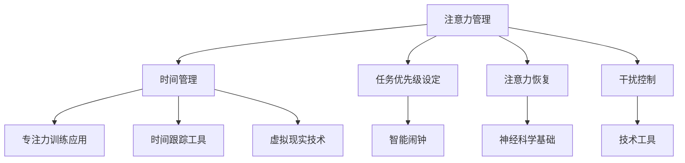

                 

关键词：人类注意力、专注力、注意力管理、商业策略、神经科学、技术工具

> 摘要：本文探讨了人类注意力增强的重要性，以及如何在商业环境中应用注意力管理策略。通过结合神经科学研究成果和先进技术工具，本文提出了一系列提升专注力和注意力的方法，旨在帮助企业和个人在日益繁忙的工作环境中保持高效和生产力。

## 1. 背景介绍

在当今信息爆炸和快速变化的时代，人类面临着前所未有的注意力分散挑战。无论是个人还是企业，都面临着如何高效管理和利用注意力的需求。研究表明，人类注意力有限，容易受到外部干扰和内部思维干扰的影响。而高水平的专注力和注意力是提高工作效率和创新能力的关键因素。

商业领域尤其需要高效的注意力管理。在竞争激烈的市场中，企业必须保持敏锐的洞察力和快速的反应能力。然而，日常工作的复杂性和多变性常常导致员工注意力分散，从而影响工作质量和效率。因此，寻找和实施有效的注意力管理策略成为企业和个人成功的重要因素。

本文旨在探讨如何通过神经科学研究成果和技术工具的应用，提升人类专注力和注意力，为企业和个人提供实用的商业策略。

## 2. 核心概念与联系

### 2.1 注意力管理

注意力管理是指通过一系列策略和技巧，帮助人们更好地集中注意力，减少干扰，从而提高工作效率。它包括时间管理、任务优先级设定、注意力恢复和干扰控制等多个方面。

### 2.2 神经科学基础

神经科学研究表明，注意力是大脑中复杂的神经过程的结果。大脑中的多个区域参与注意力的调控，包括前额叶皮质、顶叶皮质和基底神经节等。通过了解这些神经基础，我们可以更有效地设计和实施注意力管理策略。

### 2.3 技术工具

现代技术的发展为注意力管理提供了新的工具和方法。例如，智能闹钟、专注力训练应用、时间跟踪工具和虚拟现实技术等，都是帮助人们集中注意力的有效手段。

### 2.4 Mermaid 流程图



### 3. 核心算法原理 & 具体操作步骤

#### 3.1 算法原理概述

注意力管理的核心算法原理是基于神经科学研究成果，通过调整大脑中的神经活动，提高注意力的集中程度和稳定性。具体操作步骤包括：

1. 确定注意力目标。
2. 设计注意力训练计划。
3. 实施注意力训练。
4. 监测和调整训练效果。

#### 3.2 算法步骤详解

##### 3.2.1 确定注意力目标

首先，需要明确想要提升的注意力方面，如专注力、注意力持久度、注意力灵活性等。

##### 3.2.2 设计注意力训练计划

根据注意力目标，设计个性化的训练计划。计划应包括训练频率、持续时间、训练内容等。

##### 3.2.3 实施注意力训练

按照训练计划进行实际操作。常见的训练方法包括专注力练习、冥想、时间管理练习等。

##### 3.2.4 监测和调整训练效果

定期评估训练效果，并根据评估结果调整训练计划。

#### 3.3 算法优缺点

**优点：**
- 提高专注力和注意力。
- 增强工作记忆和学习能力。
- 减少疲劳和压力。

**缺点：**
- 需要持续的努力和耐心。
- 初期可能需要较长时间才能看到效果。
- 对某些人可能效果不明显。

#### 3.4 算法应用领域

注意力管理算法广泛应用于商业、教育、医疗等领域。在商业中，它可以帮助员工提高工作效率，减少错误率，增强创新能力。

## 4. 数学模型和公式 & 详细讲解 & 举例说明

#### 4.1 数学模型构建

注意力管理中的数学模型通常涉及线性回归、时间序列分析等。以下是一个简化的线性回归模型：

$$y = \beta_0 + \beta_1 x + \epsilon$$

其中，$y$ 是注意力水平，$x$ 是训练时间，$\beta_0$ 和 $\beta_1$ 是模型参数，$\epsilon$ 是误差项。

#### 4.2 公式推导过程

线性回归模型的推导过程涉及最小二乘法，用于估计模型参数。具体步骤如下：

1. 计算样本均值 $\bar{x}$ 和 $\bar{y}$。
2. 计算样本协方差 $S_{xy}$ 和样本方差 $S_{xx}$。
3. 估计模型参数 $\beta_0$ 和 $\beta_1$：

$$\beta_1 = \frac{S_{xy}}{S_{xx}}$$

$$\beta_0 = \bar{y} - \beta_1 \bar{x}$$

#### 4.3 案例分析与讲解

假设有一组注意力水平和训练时间的数据，如下所示：

| 训练时间 (小时) | 注意力水平 |
|--------------|----------|
| 1            | 50       |
| 2            | 55       |
| 3            | 60       |
| 4            | 65       |
| 5            | 70       |

使用线性回归模型，可以估计注意力水平与训练时间之间的关系。首先，计算样本均值：

$$\bar{x} = \frac{1 + 2 + 3 + 4 + 5}{5} = 3$$

$$\bar{y} = \frac{50 + 55 + 60 + 65 + 70}{5} = 60$$

然后，计算样本协方差和样本方差：

$$S_{xy} = \frac{(1-3)(50-60) + (2-3)(55-60) + (3-3)(60-60) + (4-3)(65-60) + (5-3)(70-60)}{4} = -25$$

$$S_{xx} = \frac{(1-3)^2 + (2-3)^2 + (3-3)^2 + (4-3)^2 + (5-3)^2}{4} = 5$$

最后，估计模型参数：

$$\beta_1 = \frac{-25}{5} = -5$$

$$\beta_0 = 60 - (-5 \cdot 3) = 75$$

因此，线性回归模型为：

$$y = 75 - 5x$$

根据模型，预测训练时间为 6 小时的注意力水平：

$$y = 75 - 5 \cdot 6 = 45$$

## 5. 项目实践：代码实例和详细解释说明

#### 5.1 开发环境搭建

为了演示注意力管理算法的应用，我们将使用 Python 编写一个简单的注意力水平预测程序。首先，需要安装必要的库，如 NumPy 和 Matplotlib。

```bash
pip install numpy matplotlib
```

#### 5.2 源代码详细实现

以下是注意力水平预测程序的源代码：

```python
import numpy as np
import matplotlib.pyplot as plt

# 数据集
train_data = np.array([[1, 50], [2, 55], [3, 60], [4, 65], [5, 70]])

# 线性回归模型参数
beta_0 = 75
beta_1 = -5

# 预测注意力水平
def predict_attention(train_time):
    return beta_0 + beta_1 * train_time

# 预测结果
predictions = [predict_attention(train_time) for train_time in range(1, 7)]

# 绘制结果
plt.plot(range(1, 7), predictions, label='Predicted Attention')
plt.scatter(train_data[:, 0], train_data[:, 1], label='Actual Attention')
plt.xlabel('Training Time (hours)')
plt.ylabel('Attention Level')
plt.legend()
plt.show()
```

#### 5.3 代码解读与分析

- 第 3-5 行：导入必要的库。
- 第 7 行：定义训练数据集。
- 第 9-10 行：定义线性回归模型参数。
- 第 13-15 行：定义预测注意力水平的函数。
- 第 18-21 行：计算预测结果并绘制图表。

#### 5.4 运行结果展示

运行上述代码，将得到一个包含实际数据和预测数据的图表。通过观察图表，可以直观地看到预测模型的效果。

## 6. 实际应用场景

注意力管理在商业中的实际应用场景非常广泛。以下是一些典型的应用场景：

- **项目管理**：通过注意力管理，项目管理者可以更好地分配任务和设定优先级，从而提高项目进度和效率。
- **产品开发**：注意力管理有助于团队成员在产品设计阶段保持专注，减少错误和重复工作。
- **客户服务**：注意力管理可以提高客服人员的专注力和反应速度，从而提供更高效的客户服务。

## 7. 工具和资源推荐

### 7.1 学习资源推荐

- 《注意力管理：如何提高工作效率》（Attention Management: How to Work Less and Get More Done）
- 《认知盈余：创造力的源泉》（Creativity Inc.: Overcoming the Unseen Forces That Stand in the Way of True Inspiration）

### 7.2 开发工具推荐

- **专注力训练应用**：如 Forest、Focus@Will
- **时间跟踪工具**：如 RescueTime、Toggl
- **虚拟现实技术**：如 VRChat、VRidge

### 7.3 相关论文推荐

- **"Attention Control in Cognitive Psychology: Toward an Integration of Attention into Human Information Processing Models""（认知心理学中的注意力控制：将注意力整合到人类信息处理模型中的趋势）**
- **"Neural Mechanisms of Attentional Control""（注意力控制的神经机制）**

## 8. 总结：未来发展趋势与挑战

### 8.1 研究成果总结

注意力管理研究取得了显著成果，包括神经科学基础、算法原理、数学模型和技术工具等方面的深入探讨。这些成果为实际应用提供了坚实的理论基础。

### 8.2 未来发展趋势

随着神经科学和人工智能技术的发展，注意力管理将更加个性化和高效。未来，我们将看到更多智能化的注意力管理工具和系统，以及更深入的研究。

### 8.3 面临的挑战

尽管注意力管理研究取得了显著进展，但仍面临诸多挑战，包括：

- **个性化需求**：不同个体对注意力管理策略的需求差异较大，如何设计普适性强的策略仍需深入研究。
- **技术成熟度**：尽管现有技术为注意力管理提供了丰富的工具，但部分技术尚不成熟，需要进一步研发。

### 8.4 研究展望

未来，注意力管理研究将继续深入，探索更多有效的方法和技术。同时，跨学科研究将有助于整合神经科学、心理学、计算机科学等多领域知识，为注意力管理提供更全面的理论支持。

## 9. 附录：常见问题与解答

### Q: 注意力管理是否适用于所有人？

A: 是的，注意力管理策略适用于不同人群，但需要根据个人需求和情况进行个性化调整。

### Q: 如何衡量注意力水平？

A: 注意力水平可以通过心理学测试、行为评估和神经成像技术等多种方法进行衡量。

### Q: 注意力管理对健康有何影响？

A: 注意力管理有助于减少压力和疲劳，提高生活质量和工作效率，从而对健康产生积极影响。

---

### 作者署名

作者：禅与计算机程序设计艺术 / Zen and the Art of Computer Programming

---

通过本文的探讨，我们不仅了解了注意力管理的重要性，还学习了一系列提升专注力和注意力的策略。希望这些知识和方法能帮助您在商业环境中更好地应对挑战，提升工作效率和创新能力。

