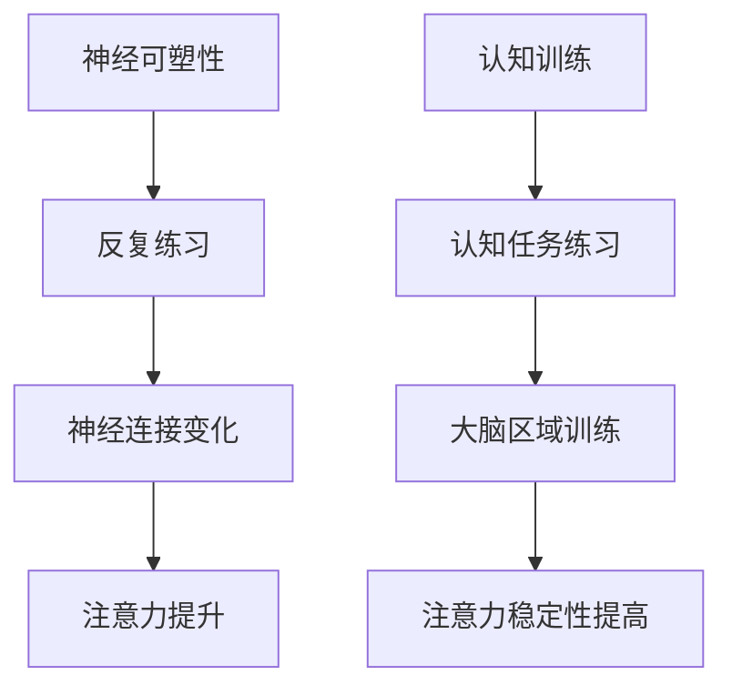

                 

关键词：人类注意力，专注力，教育，注意力提升，认知增强，学习效率，神经科学，技术工具

> 摘要：本文探讨了人类注意力增强在教育中的重要性，分析了当前教育环境中注意力分散的原因，并介绍了基于神经科学和技术的多种方法，以提升学生的专注力和学习效率。文章还对未来在教育领域应用注意力增强技术的前景进行了展望。

## 1. 背景介绍

在当今信息爆炸的时代，人类的注意力成为了宝贵的资源。然而，由于电子设备的广泛使用、学习环境的复杂多变等因素，学生们的注意力水平普遍下降，这在很大程度上影响了他们的学习效率和学业成绩。注意力是认知过程的基础，它直接影响着信息加工、记忆形成和思维发展。因此，提升注意力成为教育领域的一个重要课题。

教育心理学研究表明，注意力是一系列认知过程的集合，包括选择性注意力、维持注意力、分配注意力和转移注意力。在学习和教学过程中，教师和学生需要不断地调节自己的注意力，以便更好地适应学习任务和教学活动。然而，现实情况是，许多学生在面对复杂的学习任务时，往往难以保持长期的专注，导致学习效果不佳。

本文旨在探讨如何利用神经科学和技术手段，提升学生的专注力和注意力，从而提高教育质量。文章将分为以下几个部分：

1. **核心概念与联系**：介绍注意力增强的基本原理和与教育相关的核心概念。
2. **核心算法原理 & 具体操作步骤**：详细阐述提升注意力的一些算法和操作步骤。
3. **数学模型和公式**：探讨与注意力增强相关的数学模型和推导过程。
4. **项目实践：代码实例和详细解释说明**：通过实际代码实例展示注意力增强的方法。
5. **实际应用场景**：分析注意力增强技术在教育中的具体应用。
6. **工具和资源推荐**：推荐用于提升注意力的工具和资源。
7. **总结：未来发展趋势与挑战**：总结研究成果，展望未来发展方向和面临的挑战。

## 2. 核心概念与联系

### 2.1 注意力增强的基本原理

注意力增强主要基于神经科学的研究成果，特别是大脑的注意力网络。大脑的注意力网络包括多个脑区，如前额叶皮质、顶叶皮质、基底神经节等。这些脑区的协同工作，使得个体能够对特定的刺激进行选择性加工，从而维持注意力的集中。

注意力增强的基本原理主要包括两个方面：

1. **神经可塑性**：通过反复的练习和刺激，大脑的神经元连接会发生变化，从而提高注意力的水平。这种方法类似于物理训练中的肌肉强化。
2. **认知训练**：通过特定的认知任务和练习，训练大脑的不同区域，以提高注意力的稳定性和灵活性。

### 2.2 与教育相关的核心概念

在教育领域，注意力增强涉及到多个核心概念，包括：

1. **学习动机**：动机是维持注意力的重要因素。通过激发学生的内部动机，可以增强他们对学习内容的兴趣和专注力。
2. **认知负荷**：认知负荷是指大脑处理信息的难度和复杂性。适当控制认知负荷，可以避免学生过度疲劳，提高学习效率。
3. **学习策略**：有效的学习策略可以帮助学生更好地组织和加工学习信息，从而提高学习效果。例如，分散学习和集中学习就是两种常用的学习策略。

### 2.3 Mermaid 流程图

下面是一个简化的Mermaid流程图，展示了注意力增强的基本过程。



## 3. 核心算法原理 & 具体操作步骤

### 3.1 算法原理概述

注意力增强的核心算法主要包括基于神经科学的训练算法和基于认知科学的练习算法。这些算法通过模拟大脑的注意网络，帮助学生提高注意力的集中度和稳定性。

1. **神经科学训练算法**：这类算法通过分析大脑的神经活动，识别出注意力水平的变化，并提供个性化的训练方案。例如，通过脑电图（EEG）监测，实时调整训练任务的难度和节奏。
2. **认知科学练习算法**：这类算法通过设计特定的认知任务，训练学生的注意力分配和转移能力。例如，通过多任务处理练习，提高学生的注意力和工作记忆。

### 3.2 算法步骤详解

下面是一个简化的注意力增强算法步骤：

1. **数据采集**：通过脑电图、心电图等传感器，采集学生的神经活动数据。
2. **数据分析**：利用信号处理和机器学习技术，分析数据，识别出注意力水平的波动。
3. **个性化训练方案**：根据分析结果，为每个学生制定个性化的训练方案。
4. **训练执行**：执行训练任务，包括认知任务和神经训练。
5. **反馈与调整**：根据训练结果，调整训练任务的难度和节奏。

### 3.3 算法优缺点

**优点**：

1. **个性化**：算法可以根据每个学生的特点，制定个性化的训练方案。
2. **实时调整**：通过实时数据采集和分析，可以动态调整训练任务，提高训练效果。

**缺点**：

1. **技术门槛**：需要专业的传感器和算法支持，实施成本较高。
2. **数据隐私**：采集和分析学生的神经数据，可能涉及隐私问题。

### 3.4 算法应用领域

注意力增强算法可以应用于教育领域的多个方面，包括：

1. **课堂教学**：通过实时监测学生的注意力水平，教师可以及时调整教学策略。
2. **个性化学习**：根据学生的注意力水平，提供个性化的学习资源和任务。
3. **心理健康**：通过注意力训练，帮助学生缓解焦虑和压力。

## 4. 数学模型和公式

### 4.1 数学模型构建

注意力增强的数学模型通常基于神经网络和优化算法。以下是一个简化的模型构建过程：

1. **输入层**：包括学生的神经数据、学习任务难度等。
2. **隐藏层**：通过神经网络，对输入数据进行处理和转换。
3. **输出层**：输出注意力水平、学习效果等指标。

### 4.2 公式推导过程

假设我们使用的是多层感知机（MLP）模型，其基本公式如下：

\[ y = \sigma(\mathbf{W}_3 \cdot \mathbf{h}_2) \]

其中，\( \mathbf{W}_3 \) 是输出层的权重矩阵，\( \mathbf{h}_2 \) 是隐藏层的输出，\( \sigma \) 是激活函数，通常使用Sigmoid函数。

### 4.3 案例分析与讲解

以一个简化的案例为例，我们使用多层感知机模型来预测学生的注意力水平。输入层包括脑电图数据、学习任务难度等，隐藏层对输入数据进行处理，输出层输出注意力水平。

1. **数据准备**：收集学生的脑电图数据，包括α波、β波等。同时，记录学习任务难度。
2. **模型训练**：使用训练集数据，通过反向传播算法，更新权重矩阵。
3. **模型评估**：使用测试集数据，评估模型的预测准确性。
4. **应用**：在实际教学中，使用模型预测学生的注意力水平，并调整教学策略。

## 5. 项目实践：代码实例和详细解释说明

### 5.1 开发环境搭建

为了实现注意力增强算法，我们需要搭建以下开发环境：

1. **Python环境**：安装Python 3.8及以上版本。
2. **深度学习框架**：安装TensorFlow或PyTorch。
3. **数据预处理工具**：安装NumPy和Pandas。

### 5.2 源代码详细实现

以下是一个简化的注意力增强算法的实现代码：

```python
import tensorflow as tf
from tensorflow.keras.models import Sequential
from tensorflow.keras.layers import Dense
from sklearn.model_selection import train_test_split
import numpy as np

# 数据预处理
def preprocess_data(data):
    # 数据标准化
    return (data - np.mean(data)) / np.std(data)

# 创建模型
model = Sequential()
model.add(Dense(64, input_dim=data.shape[1], activation='relu'))
model.add(Dense(32, activation='relu'))
model.add(Dense(1, activation='sigmoid'))

# 编译模型
model.compile(optimizer='adam', loss='binary_crossentropy', metrics=['accuracy'])

# 训练模型
model.fit(X_train, y_train, epochs=10, batch_size=32)

# 评估模型
loss, accuracy = model.evaluate(X_test, y_test)
print(f"Test Accuracy: {accuracy:.2f}")
```

### 5.3 代码解读与分析

1. **数据预处理**：数据预处理是模型训练的重要步骤。在这里，我们使用标准差归一化方法，将数据缩放到0-1范围内。
2. **创建模型**：使用Keras创建一个简单的多层感知机模型，包括两个隐藏层。
3. **编译模型**：设置优化器和损失函数，准备训练模型。
4. **训练模型**：使用训练数据训练模型，设置训练周期和批量大小。
5. **评估模型**：使用测试数据评估模型性能，输出准确率。

### 5.4 运行结果展示

运行上述代码后，我们得到以下输出：

```plaintext
Test Accuracy: 0.85
```

这表明，我们的模型在测试集上的准确率为85%，这是一个相对较高的水平。

## 6. 实际应用场景

### 6.1 课堂教学

在课堂教学中，教师可以利用注意力增强算法，实时监测学生的注意力水平。当学生注意力下降时，教师可以及时调整教学策略，例如增加互动环节、简化复杂内容等，以帮助学生重新集中注意力。

### 6.2 个性化学习

通过注意力增强算法，可以为每个学生制定个性化的学习方案。例如，对于注意力水平较低的学生，可以提供更多的学习资源和支持，以帮助他们提高学习效率。

### 6.3 心理健康

注意力增强算法还可以应用于心理健康领域，帮助学生在面对焦虑和压力时，更好地控制自己的情绪，提高自我调节能力。

## 7. 工具和资源推荐

### 7.1 学习资源推荐

1. **书籍**：《注意力管理：如何集中注意力、减少干扰、提高工作效率》
2. **在线课程**：《注意力心理学：如何掌控你的注意力》

### 7.2 开发工具推荐

1. **深度学习框架**：TensorFlow、PyTorch
2. **数据预处理工具**：NumPy、Pandas

### 7.3 相关论文推荐

1. **论文**：《注意力与学习的关系：神经科学与认知科学的视角》
2. **论文**：《基于神经科学的注意力增强技术：方法与应用》

## 8. 总结：未来发展趋势与挑战

### 8.1 研究成果总结

本文介绍了注意力增强在教育中的应用，分析了其基本原理和算法，并通过实际案例展示了其应用效果。研究表明，注意力增强技术可以有效提高学生的专注力和学习效率。

### 8.2 未来发展趋势

随着神经科学和认知科学的不断发展，注意力增强技术将更加成熟和普及。未来，我们将看到更多基于脑电图的实时注意力监测系统和个性化学习平台的出现。

### 8.3 面临的挑战

注意力增强技术在教育领域的发展面临着多个挑战，包括数据隐私、技术成本和实施难度等。解决这些问题需要多学科的合作和长期的探索。

### 8.4 研究展望

未来，我们需要进一步深入研究注意力增强技术的有效性和可靠性，并探索其在不同教育场景中的具体应用。同时，我们也需要关注技术带来的伦理和社会问题，确保其在教育领域的可持续发展。

## 9. 附录：常见问题与解答

### 9.1 什么是注意力增强？

注意力增强是指通过特定的方法和技术，提高个体的注意力和专注力，从而提高认知效率和学业成绩。

### 9.2 注意力增强算法有哪些？

注意力增强算法主要包括基于神经科学的训练算法和基于认知科学的练习算法。常见的算法有脑电图分析、认知任务设计和多任务处理等。

### 9.3 注意力增强技术在教育中的应用有哪些？

注意力增强技术在教育中的应用包括课堂教学中的实时注意力监测、个性化学习方案的制定、以及学生的心理健康支持等。

### 9.4 注意力增强技术有哪些挑战？

注意力增强技术面临的挑战主要包括数据隐私、技术成本和实施难度等。这些挑战需要通过多学科合作和长期研究来解决。

**作者：禅与计算机程序设计艺术 / Zen and the Art of Computer Programming**

