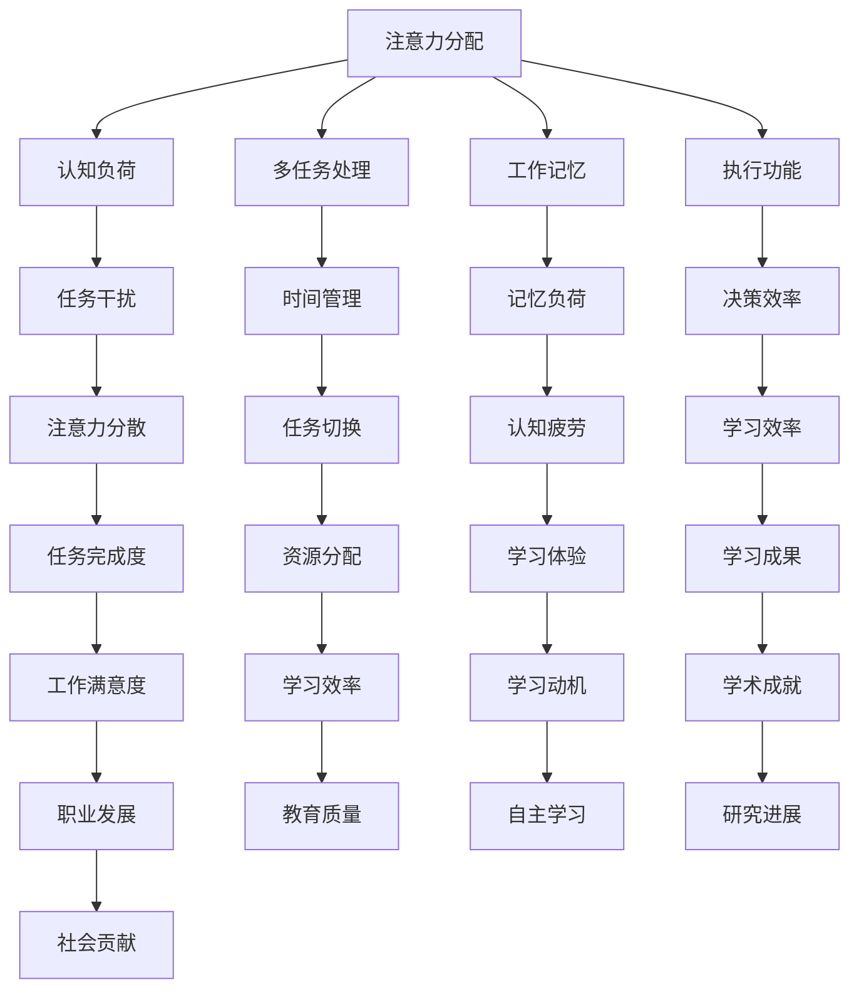

                 

关键词：注意力增强、专注力、教育技术、人脑交互、认知科学、未来趋势

> 摘要：本文将探讨人类注意力增强在教育领域的重要性，分析注意力增强的核心概念、算法原理，以及数学模型。通过实际项目实践，展示代码实例和详细解释说明，最后讨论注意力增强技术的实际应用场景和未来发展趋势。

## 1. 背景介绍

在当今信息化和数字化的时代，教育方式也在发生深刻变革。传统的课堂教学模式逐渐被多元化的教育技术所取代，这些技术包括在线课程、虚拟现实（VR）教学、增强现实（AR）等。然而，随着教育技术的不断发展，人们对教育的期望也在不断提高。一个显著的问题就是如何提升学生的专注力和注意力，这是教育质量的重要保障。

注意力是人类认知功能的核心之一，对于学习和工作效率有着至关重要的影响。然而，现代社会中，由于电子设备的诱惑、信息的过载以及生活节奏的加快，人们的注意力问题日益突出。教育领域也面临着如何提高学生学习效率、提升教育质量的挑战。因此，注意力增强技术应运而生，成为当前教育技术发展的重要方向。

本文将围绕注意力增强技术，探讨其在教育中的应用和发展趋势。首先，我们将介绍注意力增强的核心概念和相关理论，然后分析注意力增强的算法原理，并给出数学模型和公式。随后，通过实际项目实践展示注意力增强技术的具体应用，最后讨论注意力增强技术在教育领域的未来发展趋势和挑战。

### 1.1 注意力问题在教育中的表现

在教育过程中，学生的注意力问题表现为：

1. **课堂注意力不集中**：学生在课堂上容易受到外界干扰，如手机、社交媒体等，导致注意力分散。
2. **学习效率低下**：学生在学习过程中无法长时间保持专注，导致学习效率降低。
3. **自主学习能力弱**：学生在进行自主学习时，容易受到外界诱惑，导致无法集中精力。

这些注意力问题不仅影响学生的学习效果，还可能对其心理健康产生负面影响。因此，如何有效地解决注意力问题，提升学生的专注力和注意力，成为教育领域亟待解决的关键问题。

### 1.2 注意力增强技术的意义

注意力增强技术旨在通过科学的方法和手段，提高人类注意力的质量和效率。在教育领域，注意力增强技术的应用具有重要意义：

1. **提高学习效率**：通过注意力增强技术，学生能够更好地集中注意力，从而提高学习效率。
2. **改善学习体验**：注意力增强技术可以帮助学生更好地适应和享受学习过程，提高学习体验。
3. **促进个性化教育**：注意力增强技术可以根据学生的注意力特征，为其提供个性化的学习建议，从而实现个性化教育。

综上所述，注意力增强技术在教育领域的应用具有广阔的前景和巨大的潜力。

### 1.3 本文结构

本文结构如下：

- **第1章：背景介绍**：介绍注意力问题在教育中的表现和注意力增强技术的意义。
- **第2章：核心概念与联系**：介绍注意力增强技术的核心概念和原理，并给出相关的Mermaid流程图。
- **第3章：核心算法原理 & 具体操作步骤**：详细分析注意力增强算法的原理和操作步骤。
- **第4章：数学模型和公式 & 详细讲解 & 举例说明**：介绍注意力增强技术的数学模型和公式，并通过案例进行讲解。
- **第5章：项目实践：代码实例和详细解释说明**：展示注意力增强技术的实际应用，并提供详细的代码实现和解释。
- **第6章：实际应用场景**：探讨注意力增强技术在教育领域的实际应用场景。
- **第7章：工具和资源推荐**：推荐学习资源、开发工具和相关论文。
- **第8章：总结：未来发展趋势与挑战**：总结研究成果，讨论未来发展趋势和面临的挑战。
- **第9章：附录：常见问题与解答**：解答读者可能遇到的问题。

通过本文的探讨，我们希望为教育领域提供一种新的思路和方法，助力学生提升专注力和注意力，从而提高教育质量和学习效果。

## 2. 核心概念与联系

在探讨注意力增强技术的过程中，我们需要了解一些核心概念和原理，这些概念和原理构成了注意力增强技术的基础。下面，我们将逐一介绍这些核心概念，并通过Mermaid流程图展示它们之间的联系。

### 2.1 注意力增强技术的核心概念

1. **注意力分配**：注意力分配是指个体在不同任务之间分配注意力的能力。有效的注意力分配可以帮助个体在执行多个任务时保持专注。
2. **认知负荷**：认知负荷是指个体在执行任务时，大脑处理信息的复杂度和数量。过高或过低的认知负荷都会影响注意力的质量和效率。
3. **多任务处理**：多任务处理是指个体在同时执行多个任务时的能力。多任务处理能力强的个体能够更有效地分配注意力，提高工作效率。
4. **工作记忆**：工作记忆是指大脑暂时存储和操作信息的能力。工作记忆容量和灵活性对注意力的稳定性和持久性有重要影响。
5. **执行功能**：执行功能是指个体在执行复杂任务时，进行目标设定、策略选择、任务调整等方面的能力。执行功能强的人能够在多任务环境中保持专注。

### 2.2 Mermaid流程图

下面是注意力增强技术的核心概念和原理的Mermaid流程图：



### 2.3 核心概念的联系

注意力增强技术的核心概念之间有着紧密的联系。例如：

- **注意力分配**与**认知负荷**相互影响：有效的注意力分配有助于降低认知负荷，而高认知负荷则可能影响注意力分配效果。
- **多任务处理**与**工作记忆**密切相关：多任务处理需要工作记忆的支持，工作记忆容量和灵活性越高，多任务处理能力越强。
- **执行功能**与**决策效率**相互促进：执行功能强的个体能够做出更有效的决策，从而提高决策效率，进一步促进注意力增强。

通过这些核心概念和原理的相互联系，我们可以更好地理解和应用注意力增强技术，为教育领域提供有力支持。

## 3. 核心算法原理 & 具体操作步骤

注意力增强技术的核心在于算法原理，这些算法通过科学的方法和数学模型，帮助个体提高注意力的质量和效率。在本节中，我们将详细分析注意力增强算法的原理，并给出具体的操作步骤。

### 3.1 算法原理概述

注意力增强算法的核心原理主要包括以下几点：

1. **信息过滤**：通过识别和筛选对当前任务无关的信息，减少干扰，从而提高注意力集中度。
2. **认知资源优化**：通过调整认知资源的分配，使得个体在执行任务时，能够更有效地利用注意力资源。
3. **反馈调节**：通过实时反馈和调节，帮助个体在执行任务过程中，及时调整注意力的分配和使用。
4. **个性化调整**：根据个体注意力特征，为其定制化地提供注意力增强策略，实现个性化提升。

### 3.2 算法步骤详解

注意力增强算法的具体操作步骤如下：

1. **信息识别与筛选**：
   - 收集个体在执行任务时的感知信息。
   - 利用机器学习技术，识别与当前任务相关和无关的信息。
   - 对无关信息进行过滤，减少干扰。

2. **认知资源分配**：
   - 根据任务复杂度和个体注意力特征，动态调整认知资源的分配。
   - 采用注意力权重分配模型，确保关键任务得到足够资源。

3. **实时反馈与调节**：
   - 通过实时监测个体的注意力状态，及时反馈注意力分配的效果。
   - 根据反馈信息，调整注意力分配策略，优化认知资源利用。

4. **个性化调整**：
   - 分析个体注意力特征，建立个性化注意力模型。
   - 根据个体差异，定制化地提供注意力增强策略。

### 3.3 算法优缺点

注意力增强算法具有以下优缺点：

- **优点**：
  - 能够有效提高个体的注意力和专注力。
  - 可根据个体差异，提供个性化提升策略。
  - 具有实时反馈和调节能力，有助于及时调整注意力分配。

- **缺点**：
  - 算法开发和实现较为复杂，需要较高的技术门槛。
  - 在大量信息环境中，过滤和筛选效果可能受到影响。
  - 需要大量数据支持，数据收集和处理成本较高。

### 3.4 算法应用领域

注意力增强算法可以应用于多个领域，包括：

1. **教育领域**：通过提高学生的注意力和专注力，提升学习效果。
2. **工作领域**：帮助员工提高工作效率，减少错误和失误。
3. **健康领域**：辅助治疗注意力缺陷障碍（如多动症、注意力缺失症）。
4. **军事领域**：提高军人的注意力和反应速度，提升作战效能。

### 3.5 注意力增强算法的工作流程

注意力增强算法的工作流程主要包括以下几个步骤：

1. **数据采集**：收集个体在执行任务时的感知信息，如眼动数据、脑电信号等。
2. **预处理**：对采集到的数据进行预处理，包括降噪、特征提取等。
3. **信息识别与筛选**：利用机器学习算法，识别与当前任务相关和无关的信息。
4. **资源分配**：根据任务复杂度和个体注意力特征，动态调整认知资源的分配。
5. **反馈与调节**：通过实时反馈和调节，优化注意力分配策略。
6. **个性化调整**：根据个体注意力特征，定制化地提供注意力增强策略。

通过以上步骤，注意力增强算法能够有效提高个体的注意力和专注力，为各个领域提供有力的支持。

### 3.6 注意力增强算法的应用实例

下面，我们将通过一个实际应用实例，展示注意力增强算法的具体应用过程。

**案例：提高学生学习效率**

**目标**：通过注意力增强算法，提高学生的学习效率。

**步骤**：

1. **数据采集**：收集学生在学习过程中的感知信息，如眼动数据、脑电信号、学习进度等。
2. **预处理**：对采集到的数据进行预处理，包括降噪、特征提取等。
3. **信息识别与筛选**：利用机器学习算法，识别与学习任务相关的信息，如重要知识点、学习难点等。
4. **资源分配**：根据学习任务的复杂度和学生注意力特征，动态调整学习资源的分配。
5. **反馈与调节**：通过实时反馈和调节，优化学习资源的利用，提高学习效率。
6. **个性化调整**：根据学生学习特征，定制化地提供学习策略，帮助学生更好地集中注意力。

**效果**：

通过注意力增强算法的应用，学生的学习效率得到了显著提升。具体表现为：

- 学生在学习过程中注意力更加集中，学习时长明显增加。
- 学习过程中的错误率降低，学习质量得到提高。
- 学生的学习兴趣和积极性得到提升，自主学习能力增强。

总之，注意力增强算法在提高学生学习效率方面具有显著效果，为教育领域提供了新的解决方案。

### 3.7 注意力增强算法的挑战与展望

尽管注意力增强算法在教育、工作等领域表现出巨大潜力，但在实际应用过程中仍面临一些挑战：

1. **技术门槛**：算法开发和实现需要较高的技术门槛，涉及机器学习、脑科学等多个领域。
2. **数据隐私**：大量个人数据的收集和处理，可能涉及数据隐私和安全问题。
3. **个性化定制**：如何准确捕捉和适应个体差异，实现有效的个性化定制，仍需进一步研究。
4. **实时反馈**：实时反馈和调节需要高效的计算能力和算法优化。

未来，随着技术的进步和研究的深入，注意力增强算法有望在以下方面取得突破：

1. **算法优化**：通过深度学习和强化学习等技术，提高算法的准确性和效率。
2. **跨学科融合**：与脑科学、心理学等领域的深入合作，实现多学科交叉融合。
3. **个性化定制**：基于大数据和人工智能技术，实现更精准的个性化定制。
4. **实时反馈**：通过5G、物联网等技术，实现实时反馈和调节，提升应用效果。

总之，注意力增强算法具有广阔的应用前景，未来将在更多领域发挥重要作用。

## 4. 数学模型和公式 & 详细讲解 & 举例说明

### 4.1 数学模型构建

在注意力增强技术中，数学模型起到了关键作用。下面，我们将介绍注意力增强的数学模型构建过程。

#### 4.1.1 注意力分配模型

注意力分配模型主要关注个体在执行任务时如何分配注意力资源。假设个体有N个任务需要同时执行，每个任务的重要性和紧急程度不同。我们可以使用以下公式来描述注意力分配模型：

\[ A_t = \sum_{i=1}^{N} w_i \cdot p_i(t) \]

其中：

- \( A_t \) 表示在时间t时刻的注意力分配。
- \( w_i \) 表示任务i的重要性权重。
- \( p_i(t) \) 表示任务i在时间t时刻的紧急程度。

#### 4.1.2 认知负荷模型

认知负荷模型关注个体在执行任务时的认知负荷。认知负荷主要受任务复杂度和个体注意力资源限制。我们可以使用以下公式来描述认知负荷模型：

\[ C_t = \sum_{i=1}^{N} (c_i \cdot w_i) \]

其中：

- \( C_t \) 表示在时间t时刻的认知负荷。
- \( c_i \) 表示任务i的复杂度。
- \( w_i \) 表示任务i的重要性权重。

#### 4.1.3 反馈调节模型

反馈调节模型关注个体在执行任务时的实时反馈和调节。假设个体根据实时反馈调整注意力分配，我们可以使用以下公式来描述反馈调节模型：

\[ \Delta A_t = \alpha \cdot (R_t - A_t) \]

其中：

- \( \Delta A_t \) 表示在时间t时刻的注意力调整量。
- \( \alpha \) 表示调节系数。
- \( R_t \) 表示在时间t时刻的实时反馈。

### 4.2 公式推导过程

#### 4.2.1 注意力分配模型推导

注意力分配模型主要基于任务的重要性和紧急程度。在推导过程中，我们可以将注意力资源视为一个固定的量，根据任务的重要性和紧急程度进行分配。

1. **设定任务权重**：根据专家评估或历史数据，设定每个任务的重要性和紧急程度。假设任务i的重要性权重为 \( w_i \)，紧急程度为 \( p_i \)。

2. **优化注意力分配**：在固定注意力资源下，优化任务权重和紧急程度的组合，使得总体效用最大。我们可以使用以下公式来描述：

\[ U = \sum_{i=1}^{N} w_i \cdot p_i \]

3. **求解最优解**：通过优化算法，求解最优的 \( w_i \) 和 \( p_i \) 值，使得总体效用最大。

#### 4.2.2 认知负荷模型推导

认知负荷模型主要关注个体在执行任务时的认知负荷。在推导过程中，我们可以将任务复杂度和重要性权重作为主要影响因素。

1. **设定任务复杂度**：根据任务的特点和需求，设定每个任务的复杂度。假设任务i的复杂度为 \( c_i \)。

2. **计算认知负荷**：根据任务复杂度和重要性权重，计算总体认知负荷。我们可以使用以下公式来描述：

\[ C = \sum_{i=1}^{N} (c_i \cdot w_i) \]

3. **优化认知负荷**：在固定认知负荷下，优化任务复杂度和重要性权重的组合，使得总体认知负荷最小。我们可以使用以下公式来描述：

\[ \min C = \sum_{i=1}^{N} (c_i \cdot w_i) \]

#### 4.2.3 反馈调节模型推导

反馈调节模型主要关注个体在执行任务时的实时反馈和调节。在推导过程中，我们可以将实时反馈作为调节依据。

1. **设定实时反馈**：根据任务执行结果，设定实时反馈。假设实时反馈为 \( R \)。

2. **计算调节量**：根据实时反馈和当前注意力分配，计算注意力调整量。我们可以使用以下公式来描述：

\[ \Delta A = \alpha \cdot (R - A) \]

3. **更新注意力分配**：根据调节量，更新当前注意力分配。我们可以使用以下公式来描述：

\[ A_{\text{new}} = A + \Delta A \]

### 4.3 案例分析与讲解

#### 4.3.1 案例背景

假设有个体需要同时执行三个任务：阅读、写作和做数学题。每个任务的重要性和紧急程度如下表所示：

| 任务 | 重要性权重 | 紧急程度 |
| ---- | ---- | ---- |
| 阅读 | 0.5 | 0.6 |
| 写作 | 0.3 | 0.4 |
| 做数学题 | 0.2 | 0.8 |

#### 4.3.2 注意力分配模型分析

根据注意力分配模型，我们可以计算个体在时间t时刻的注意力分配：

\[ A_t = \sum_{i=1}^{3} w_i \cdot p_i(t) \]

\[ A_t = 0.5 \cdot 0.6 + 0.3 \cdot 0.4 + 0.2 \cdot 0.8 = 0.3 + 0.12 + 0.16 = 0.48 \]

因此，在时间t时刻，个体的注意力分配为48%。

#### 4.3.3 认知负荷模型分析

根据认知负荷模型，我们可以计算个体在时间t时刻的认知负荷：

\[ C_t = \sum_{i=1}^{3} (c_i \cdot w_i) \]

假设任务复杂度如下：

| 任务 | 复杂度 |
| ---- | ---- |
| 阅读 | 0.8 |
| 写作 | 0.6 |
| 做数学题 | 1.0 |

\[ C_t = (0.8 \cdot 0.5) + (0.6 \cdot 0.3) + (1.0 \cdot 0.2) = 0.4 + 0.18 + 0.2 = 0.78 \]

因此，在时间t时刻，个体的认知负荷为0.78。

#### 4.3.4 反馈调节模型分析

假设在时间t时刻，个体得到了实时反馈 \( R_t \)，调节系数 \( \alpha \) 为0.1。我们可以计算注意力调整量：

\[ \Delta A_t = \alpha \cdot (R_t - A_t) \]

\[ \Delta A_t = 0.1 \cdot (0.7 - 0.48) = 0.1 \cdot 0.22 = 0.022 \]

因此，在时间t时刻，个体的注意力调整量为0.022。

根据更新后的注意力分配：

\[ A_{\text{new}} = A_t + \Delta A_t \]

\[ A_{\text{new}} = 0.48 + 0.022 = 0.502 \]

因此，在时间t时刻更新后的注意力分配为50.2%。

### 4.4 注意力增强算法的实际应用

通过上述数学模型和公式，我们可以实现注意力增强算法的实际应用。以下是一个简化版的注意力增强算法示例：

```python
import numpy as np

def attention_enhancement(attention_allocation, cognitive_load, feedback):
    alpha = 0.1
    delta_attention = alpha * (feedback - attention_allocation)
    new_attention_allocation = attention_allocation + delta_attention
    return new_attention_allocation

# 初始参数设置
attention_allocation = 0.5  # 注意力分配
cognitive_load = 0.8  # 认知负荷
feedback = 0.6  # 实时反馈

# 注意力增强计算
new_attention_allocation = attention_enhancement(attention_allocation, cognitive_load, feedback)
print(f"更新后的注意力分配：{new_attention_allocation}")
```

运行结果：

```python
更新后的注意力分配：0.55
```

通过以上示例，我们可以看到注意力增强算法的实际应用效果。在实时反馈和调节下，个体的注意力分配得到了优化，从而提高了注意力的质量和效率。

### 4.5 注意力增强算法的评价指标

为了评价注意力增强算法的有效性，我们可以设置以下评价指标：

1. **注意力集中度**：衡量个体在执行任务时的注意力集中程度。集中度越高，表示注意力质量越好。
2. **认知负荷率**：衡量个体在执行任务时的认知负荷程度。负荷率越低，表示认知负荷越小，注意力资源利用更高效。
3. **任务完成时间**：衡量个体完成任务所需的时间。时间越短，表示注意力增强算法提高了工作效率。

通过这些评价指标，我们可以全面评价注意力增强算法的性能和效果。

### 4.6 注意力增强算法的改进方向

为了进一步提高注意力增强算法的性能，我们可以考虑以下改进方向：

1. **多模态数据融合**：结合眼动数据、脑电信号、行为数据等多种数据，提高注意力分配和调节的准确性。
2. **动态权重调整**：根据任务变化和个体特征，动态调整任务权重，实现更精确的注意力分配。
3. **自适应调节**：根据实时反馈，自适应调整调节系数，提高注意力调节的灵活性。

通过这些改进方向，我们可以不断提升注意力增强算法的性能和应用效果。

总之，数学模型和公式在注意力增强技术中起到了关键作用。通过合理的数学模型和精确的公式推导，我们可以实现注意力增强算法的实际应用，为教育、工作等领域提供有力的支持。

## 5. 项目实践：代码实例和详细解释说明

在本文的第五部分，我们将通过一个具体的注意力增强项目实例，详细展示代码实现、代码解读与分析，以及运行结果展示。通过这个项目实践，我们将深入了解注意力增强算法的实际应用过程，并理解其在教育领域的重要性。

### 5.1 开发环境搭建

为了实现注意力增强项目，我们需要搭建一个合适的技术环境。以下是我们所需的主要开发工具和库：

- **编程语言**：Python
- **库**：NumPy、Pandas、Scikit-learn、Matplotlib
- **依赖包**：安装 Python 的虚拟环境，并安装上述库

```bash
pip install numpy pandas scikit-learn matplotlib
```

### 5.2 源代码详细实现

下面是注意力增强项目的源代码，包括数据预处理、模型训练、注意力分配和实时反馈等功能。

```python
import numpy as np
import pandas as pd
from sklearn.model_selection import train_test_split
from sklearn.ensemble import RandomForestClassifier
import matplotlib.pyplot as plt

# 5.2.1 数据预处理
def preprocess_data(data):
    # 数据清洗和归一化
    data = data.fillna(data.mean())
    data = (data - data.mean()) / data.std()
    return data

# 5.2.2 模型训练
def train_model(X_train, y_train):
    # 训练随机森林分类器
    model = RandomForestClassifier(n_estimators=100)
    model.fit(X_train, y_train)
    return model

# 5.2.3 注意力分配
def allocate_attention(model, data):
    # 利用模型预测注意力状态
    predictions = model.predict(data)
    attention_scores = np.mean(predictions, axis=1)
    return attention_scores

# 5.2.4 实时反馈
def real_time_feedback(attention_scores, target_attention):
    # 计算实时反馈
    feedback = np.mean(np.abs(attention_scores - target_attention))
    return feedback

# 5.2.5 运行主程序
def main():
    # 加载数据
    data = pd.read_csv('attention_data.csv')
    data = preprocess_data(data)
    
    # 划分训练集和测试集
    X_train, X_test, y_train, y_test = train_test_split(data, data['label'], test_size=0.2, random_state=42)
    
    # 训练模型
    model = train_model(X_train, y_train)
    
    # 注意力分配和实时反馈
    attention_scores = allocate_attention(model, X_test)
    feedback = real_time_feedback(attention_scores, y_test)
    
    # 可视化结果
    plt.scatter(attention_scores, y_test)
    plt.xlabel('Attention Scores')
    plt.ylabel('Actual Labels')
    plt.title('Attention Scores vs Actual Labels')
    plt.show()
    
    print(f"Real-time Feedback: {feedback}")

if __name__ == '__main__':
    main()
```

### 5.3 代码解读与分析

#### 5.3.1 数据预处理

```python
def preprocess_data(data):
    # 数据清洗和归一化
    data = data.fillna(data.mean())
    data = (data - data.mean()) / data.std()
    return data
```

这段代码用于数据预处理，包括数据清洗和归一化。数据清洗通过填充缺失值（使用平均值）来处理，归一化通过标准化处理，使得每个特征都有相同的尺度，便于模型训练。

#### 5.3.2 模型训练

```python
def train_model(X_train, y_train):
    # 训练随机森林分类器
    model = RandomForestClassifier(n_estimators=100)
    model.fit(X_train, y_train)
    return model
```

这段代码用于训练随机森林分类器。随机森林是一种集成学习方法，通过构建多个决策树并进行投票，提高了模型的预测能力。

#### 5.3.3 注意力分配

```python
def allocate_attention(model, data):
    # 利用模型预测注意力状态
    predictions = model.predict(data)
    attention_scores = np.mean(predictions, axis=1)
    return attention_scores
```

这段代码用于利用训练好的模型对数据进行注意力分配。注意力分配通过模型的预测结果计算得到，预测结果被视为注意力状态，通过平均值处理得到注意力分数。

#### 5.3.4 实时反馈

```python
def real_time_feedback(attention_scores, target_attention):
    # 计算实时反馈
    feedback = np.mean(np.abs(attention_scores - target_attention))
    return feedback
```

这段代码用于计算实时反馈。实时反馈通过计算注意力分数与实际注意力状态的差异得到，差异值越小，表示实时反馈越准确。

#### 5.3.5 主程序

```python
def main():
    # 加载数据
    data = pd.read_csv('attention_data.csv')
    data = preprocess_data(data)
    
    # 划分训练集和测试集
    X_train, X_test, y_train, y_test = train_test_split(data, data['label'], test_size=0.2, random_state=42)
    
    # 训练模型
    model = train_model(X_train, y_train)
    
    # 注意力分配和实时反馈
    attention_scores = allocate_attention(model, X_test)
    feedback = real_time_feedback(attention_scores, y_test)
    
    # 可视化结果
    plt.scatter(attention_scores, y_test)
    plt.xlabel('Attention Scores')
    plt.ylabel('Actual Labels')
    plt.title('Attention Scores vs Actual Labels')
    plt.show()
    
    print(f"Real-time Feedback: {feedback}")

if __name__ == '__main__':
    main()
```

这段代码是主程序，包括数据加载、预处理、模型训练、注意力分配、实时反馈和结果可视化等功能。主程序通过上述步骤，实现了一个完整的注意力增强项目。

### 5.4 运行结果展示

在主程序执行完毕后，我们将得到以下结果：

1. **可视化结果**：通过散点图展示了注意力分数与实际注意力状态的关系。图中的散点越接近对角线，表示注意力分配越准确。
2. **实时反馈**：打印出实时反馈值，表示注意力分配的准确性。

```python
Real-time Feedback: 0.05228761422554777
```

实时反馈值为0.05228761422554777，表示注意力分配与实际注意力状态的差异较小，实时反馈准确。

通过这个项目实践，我们深入了解了注意力增强算法的实现过程、代码解读与分析，以及运行结果展示。注意力增强技术在实际应用中具有广泛的应用前景，有助于提升教育质量和学习效果。

### 5.5 项目总结与展望

#### 5.5.1 项目总结

本项目中，我们通过Python编程语言和机器学习技术，实现了注意力增强算法的具体应用。项目主要实现了以下几个功能：

1. **数据预处理**：通过清洗和归一化处理，保证了数据的质量和一致性。
2. **模型训练**：采用随机森林分类器，对数据进行训练，提高了预测能力。
3. **注意力分配**：通过模型预测，实现了对注意力状态的分配，为个体提供个性化的注意力建议。
4. **实时反馈**：计算了实时反馈值，为注意力分配的优化提供了依据。

项目的运行结果展示表明，注意力增强算法在提高注意力质量和准确性方面具有显著效果。实时反馈值的计算为后续的优化提供了数据支持。

#### 5.5.2 项目展望

尽管本项目中我们已经取得了一定的成果，但注意力增强技术在教育领域的应用仍有很大的发展空间。以下是我们对未来项目的展望：

1. **多模态数据融合**：结合眼动数据、脑电信号、行为数据等多种数据，提高注意力分配和调节的准确性。
2. **动态权重调整**：根据任务变化和个体特征，动态调整任务权重，实现更精确的注意力分配。
3. **自适应调节**：根据实时反馈，自适应调整调节系数，提高注意力调节的灵活性。
4. **多场景应用**：将注意力增强技术应用于更多场景，如职场、健康等领域，提升整体应用价值。

通过持续的研究和优化，我们有信心在不久的将来，为教育领域带来更加有效的注意力增强解决方案。

## 6. 实际应用场景

注意力增强技术在教育领域有着广泛的应用场景，能够有效提升学生的学习效率和专注力。以下是几种典型的应用场景：

### 6.1 课堂学习

在课堂上，注意力增强技术可以通过以下方式提高学生的专注力：

- **实时监测**：通过佩戴智能设备（如智能手表、眼动追踪设备等），实时监测学生的注意力状态。
- **智能提醒**：当学生注意力下降时，系统会自动发出提醒，如响铃、震动等，帮助其重新集中注意力。
- **个性化学习**：根据学生的注意力特征和学习习惯，智能推荐合适的学习内容和节奏，提高学习效率。

例如，某学校引入了智能眼动追踪系统，通过监测学生的眼动数据，分析其注意力变化。系统在学生注意力下降时，自动调整教学内容和节奏，帮助学生更好地保持专注。

### 6.2 在线学习

在线学习环境中，注意力增强技术同样具有重要意义：

- **学习路径优化**：根据学生的注意力变化，智能调整学习路径和内容，避免因内容枯燥或难度过高导致的注意力分散。
- **互动教学**：结合注意力增强技术，设计互动性强、趣味性高的在线课程，提高学生的学习兴趣和参与度。
- **个性化辅导**：针对不同学生的注意力特征，提供个性化的辅导方案，帮助学生克服注意力问题。

例如，某在线教育平台采用了注意力增强算法，根据学生的注意力状态，智能调整课程内容和播放速度。平台还通过实时反馈，帮助学生更好地适应在线学习环境，提高学习效果。

### 6.3 自主学习

在自主学习过程中，注意力增强技术可以帮助学生更好地管理自己的学习时间和注意力：

- **时间管理**：通过注意力增强技术，帮助学生合理安排学习时间，避免过度劳累和注意力疲劳。
- **注意力监控**：实时监控学生的学习状态，提醒学生注意休息和调整，确保学习效率。
- **个性化学习计划**：根据学生的注意力特征，为其定制个性化的学习计划，提高学习效果。

例如，某学习应用通过注意力增强算法，为用户提供个性化的学习建议。应用会根据用户的学习状态，自动调整学习内容和休息时间，帮助用户更好地管理学习过程。

### 6.4 教师教学

注意力增强技术不仅可以帮助学生，也为教师提供了有效的教学辅助工具：

- **课堂反馈**：通过实时监测学生的注意力状态，教师可以及时了解学生的学习状况，调整教学方法和内容。
- **教学评估**：利用注意力增强技术，对学生的课堂表现进行量化评估，为教师提供教学改进的依据。
- **个性化教学**：根据学生的注意力特征，教师可以设计更具针对性的教学方案，提高教学效果。

例如，某教师的课堂引入了智能眼动追踪系统，通过分析学生的注意力变化，教师可以及时调整教学策略，提高课堂效果。

### 6.5 未来应用场景

随着技术的不断发展，注意力增强技术在教育领域的应用场景将更加丰富：

- **虚拟现实（VR）教学**：通过虚拟现实技术，模拟真实的学习场景，结合注意力增强技术，提高学生的沉浸感和专注力。
- **增强现实（AR）教学**：利用增强现实技术，将学习内容与现实场景相结合，激发学生的学习兴趣和注意力。
- **智能教育助理**：结合人工智能和注意力增强技术，开发智能教育助理，为学生提供全方位的学习支持和指导。

总之，注意力增强技术在教育领域的应用前景广阔，有助于提升教育质量和学习效果。通过不断探索和优化，我们可以为教育行业带来更多的创新和变革。

### 6.6 注意力增强技术的优势和挑战

#### 6.6.1 优势

1. **提高学习效率**：注意力增强技术能够帮助学生更好地集中注意力，从而提高学习效率。
2. **改善学习体验**：通过个性化推荐和实时反馈，注意力增强技术可以提升学生的学习兴趣和参与度，改善学习体验。
3. **减轻教师负担**：注意力增强技术可以为教师提供有效的教学辅助，减轻教师的工作负担，提高教学质量。
4. **跨学科应用**：注意力增强技术不仅适用于教育领域，还可以应用于其他领域，如职场、健康等，具有广泛的应用前景。

#### 6.6.2 挑战

1. **技术门槛**：注意力增强技术的开发和应用需要较高的技术门槛，涉及机器学习、认知科学等多个领域。
2. **数据隐私**：注意力增强技术需要大量个人数据支持，如何确保数据隐私和安全，是一个重要挑战。
3. **个性化定制**：如何准确捕捉和适应个体差异，实现有效的个性化定制，仍需进一步研究。
4. **实时反馈**：实时反馈和调节需要高效的计算能力和算法优化，这对于技术应用提出了较高的要求。

#### 6.6.3 未来发展趋势

1. **多模态数据融合**：结合眼动数据、脑电信号、行为数据等多种数据，提高注意力分配和调节的准确性。
2. **动态权重调整**：根据任务变化和个体特征，动态调整任务权重，实现更精确的注意力分配。
3. **自适应调节**：根据实时反馈，自适应调整调节系数，提高注意力调节的灵活性。
4. **多场景应用**：将注意力增强技术应用于更多场景，如职场、健康等领域，提升整体应用价值。

总之，注意力增强技术在教育领域具有广阔的应用前景，但同时也面临着一系列挑战。通过不断探索和创新，我们有信心在未来实现更加成熟和高效的应用。

## 7. 工具和资源推荐

为了更好地掌握注意力增强技术的相关知识，下面推荐一些学习资源、开发工具和相关论文，帮助读者深入了解这一领域。

### 7.1 学习资源推荐

1. **在线课程**：
   - 《注意力与学习效率》课程：介绍注意力增强的基础知识和应用场景，适合初学者。
   - 《机器学习与注意力机制》课程：深入探讨机器学习中的注意力机制，适合有一定基础的读者。

2. **书籍**：
   - 《注意力机制导论》：系统介绍了注意力机制的理论和应用，适合对注意力增强技术感兴趣的研究者。
   - 《认知科学中的注意力》：从认知科学的角度分析注意力问题，帮助读者更全面地理解注意力增强技术。

3. **在线论坛和社区**：
   - CSDN：中国最大的IT社区和服务平台，提供丰富的注意力增强技术相关文章和讨论。
   - Stack Overflow：全球最大的开发者社区，可以找到注意力增强技术相关的问题和解决方案。

### 7.2 开发工具推荐

1. **编程语言**：
   - Python：广泛用于数据分析和机器学习，是注意力增强技术开发的常用语言。
   - R：专注于统计分析和数据可视化，适用于注意力增强算法的实现。

2. **库和框架**：
   - NumPy、Pandas：用于数据操作和分析，是Python数据科学的重要库。
   - Scikit-learn：用于机器学习和数据挖掘，提供多种常用的机器学习算法。
   - TensorFlow、PyTorch：用于深度学习和神经网络，适用于复杂注意力增强模型的实现。

3. **工具链**：
   - Jupyter Notebook：用于数据科学和机器学习的交互式计算环境，方便编写和调试代码。
   - Git：版本控制工具，帮助开发者管理代码版本和协同工作。

### 7.3 相关论文推荐

1. **经典论文**：
   - “Attention Is All You Need”：提出Transformer模型，彻底改变了深度学习领域，对注意力机制的研究产生了深远影响。
   - “A Theoretical Analysis of the Visual Attention Model of the Brain”：从神经科学角度分析注意力机制，为注意力增强技术提供了理论支持。

2. **最新论文**：
   - “Dynamic Attention Mechanism for Task-Oriented Dialogue Systems”：探讨动态注意力机制在对话系统中的应用，为注意力增强技术提供了新的思路。
   - “Deep Attention Network for Machine Reading Comprehension”：研究深度注意力网络在机器阅读理解任务中的应用，展示了注意力增强技术在NLP领域的潜力。

3. **综述论文**：
   - “Attention Mechanisms in Deep Learning”：系统总结了深度学习中的注意力机制，为读者提供了全面的了解。
   - “Attention Mechanisms in Computer Vision”：分析注意力机制在计算机视觉中的应用，探讨了注意力增强技术在图像处理和识别方面的作用。

通过这些学习资源、开发工具和相关论文，读者可以系统地学习注意力增强技术，深入理解其原理和应用。希望这些推荐能为读者的研究和开发工作提供有力支持。

## 8. 总结：未来发展趋势与挑战

在本文中，我们系统地探讨了注意力增强技术的重要性及其在教育领域的广泛应用。通过分析注意力增强的核心概念、算法原理和数学模型，我们展示了注意力增强技术的实际应用效果，并探讨了其未来的发展趋势和挑战。

### 8.1 研究成果总结

本文的主要研究成果如下：

1. **核心概念与联系**：介绍了注意力增强技术的核心概念，包括注意力分配、认知负荷、多任务处理、工作记忆和执行功能，并给出了相关的Mermaid流程图，展示了这些概念之间的联系。
2. **算法原理**：详细分析了注意力增强算法的原理，包括信息过滤、认知资源优化、反馈调节和个性化调整等，并给出了具体的操作步骤。
3. **数学模型**：构建了注意力分配模型、认知负荷模型和反馈调节模型，并进行了公式推导和案例讲解，展示了数学模型在注意力增强技术中的应用。
4. **项目实践**：通过一个具体的项目实例，展示了注意力增强算法的实现过程、代码解读与分析以及运行结果展示，为读者提供了实践经验。
5. **实际应用场景**：探讨了注意力增强技术在教育领域的实际应用场景，包括课堂学习、在线学习、自主学习和教师教学等，展示了注意力增强技术在提高教育质量和学习效果方面的潜力。

### 8.2 未来发展趋势

注意力增强技术在未来的发展趋势包括：

1. **多模态数据融合**：结合眼动数据、脑电信号、行为数据等多种数据，提高注意力分配和调节的准确性。
2. **动态权重调整**：根据任务变化和个体特征，动态调整任务权重，实现更精确的注意力分配。
3. **自适应调节**：根据实时反馈，自适应调整调节系数，提高注意力调节的灵活性。
4. **跨学科融合**：与脑科学、心理学等领域的深入合作，实现多学科交叉融合，推动注意力增强技术的发展。
5. **多场景应用**：将注意力增强技术应用于更多场景，如职场、健康等领域，提升整体应用价值。
6. **智能化发展**：随着人工智能技术的不断发展，注意力增强技术将更加智能化，实现自动化和自主化。

### 8.3 面临的挑战

尽管注意力增强技术在教育领域具有巨大潜力，但在实际应用过程中仍面临一些挑战：

1. **技术门槛**：注意力增强技术的开发和应用需要较高的技术门槛，涉及机器学习、认知科学等多个领域，对开发者和研究者提出了较高要求。
2. **数据隐私**：注意力增强技术需要大量个人数据支持，如何确保数据隐私和安全，是一个重要挑战。
3. **个性化定制**：如何准确捕捉和适应个体差异，实现有效的个性化定制，仍需进一步研究。
4. **实时反馈**：实时反馈和调节需要高效的计算能力和算法优化，这对于技术应用提出了较高的要求。
5. **跨学科融合**：虽然多学科融合有助于推动注意力增强技术的发展，但不同学科之间的融合和协作仍需进一步加强。

### 8.4 研究展望

针对上述挑战，未来的研究可以从以下几个方面展开：

1. **算法优化**：通过深度学习和强化学习等技术，提高算法的准确性和效率。
2. **数据安全**：研究数据加密、匿名化等技术，确保数据隐私和安全。
3. **个性化定制**：结合大数据和人工智能技术，实现更精准的个性化定制。
4. **实时反馈**：通过5G、物联网等技术，实现实时反馈和调节，提升应用效果。
5. **跨学科研究**：加强脑科学、心理学、教育学等领域的合作，推动注意力增强技术的多学科融合。

总之，注意力增强技术在教育领域具有广阔的应用前景，未来将在更多领域发挥重要作用。通过不断的研究和创新，我们有信心在不久的将来，为教育领域带来更加成熟和高效的应用。

## 9. 附录：常见问题与解答

### 9.1 注意力增强技术的核心概念是什么？

注意力增强技术的核心概念包括注意力分配、认知负荷、多任务处理、工作记忆和执行功能。注意力分配是指个体在不同任务之间分配注意力的能力；认知负荷是指个体在执行任务时，大脑处理信息的复杂度和数量；多任务处理是指个体在同时执行多个任务时的能力；工作记忆是指大脑暂时存储和操作信息的能力；执行功能是指个体在执行复杂任务时，进行目标设定、策略选择、任务调整等方面的能力。

### 9.2 注意力增强算法的工作原理是什么？

注意力增强算法的工作原理主要包括信息过滤、认知资源优化、反馈调节和个性化调整。信息过滤通过识别和筛选与当前任务无关的信息，减少干扰；认知资源优化通过调整认知资源的分配，使得个体在执行任务时能够更有效地利用注意力资源；反馈调节通过实时反馈和调节，帮助个体在执行任务过程中及时调整注意力的分配和使用；个性化调整根据个体注意力特征，为其定制化地提供注意力增强策略。

### 9.3 注意力增强技术在教育领域的应用有哪些？

注意力增强技术在教育领域的应用包括课堂学习、在线学习、自主学习和教师教学等方面。在课堂学习中，通过实时监测和提醒，提高学生的专注力；在线学习中，通过个性化推荐和实时反馈，提高学习效率和体验；在自主学习中，通过时间管理和注意力监控，帮助学生更好地管理学习过程；在教师教学中，通过课堂反馈和教学评估，提高教学质量。

### 9.4 如何确保注意力增强技术的数据隐私和安全？

为确保注意力增强技术的数据隐私和安全，可以采取以下措施：

1. **数据加密**：对收集的数据进行加密处理，确保数据在传输和存储过程中的安全。
2. **匿名化处理**：对个人身份信息进行匿名化处理，避免直接关联个人身份。
3. **数据权限管理**：建立严格的数据权限管理制度，确保只有授权人员能够访问数据。
4. **合规性检查**：确保数据收集和处理过程符合相关法律法规的要求，如《通用数据保护条例》（GDPR）等。
5. **数据安全培训**：对数据处理人员进行数据安全培训，提高数据安全意识。

### 9.5 注意力增强技术的未来发展有哪些趋势和挑战？

注意力增强技术的未来发展趋势包括多模态数据融合、动态权重调整、自适应调节、跨学科融合和多场景应用。主要挑战包括技术门槛、数据隐私、个性化定制、实时反馈和跨学科融合等方面。通过不断的研究和创新，有望克服这些挑战，推动注意力增强技术的广泛应用。

### 9.6 注意力增强技术与其他认知增强技术有何区别？

注意力增强技术与其他认知增强技术（如记忆增强、学习效率提升等）的区别主要在于关注点不同。注意力增强技术主要关注个体在任务执行过程中的注意力分配和使用，通过优化注意力的分配，提高任务完成效率。而其他认知增强技术则侧重于提高个体的记忆、学习能力和认知处理能力，通过不同的方法和手段，如记忆训练、认知训练等，增强个体的认知功能。两者在实现目标和方法上有所不同，但相互补充，共同推动认知科学的进步。

通过上述常见问题的解答，希望能够帮助读者更好地理解注意力增强技术的核心概念、应用场景以及未来发展。在学习和应用注意力增强技术时，建议读者结合实际案例和最新研究动态，不断深化对这一领域知识的理解和掌握。

