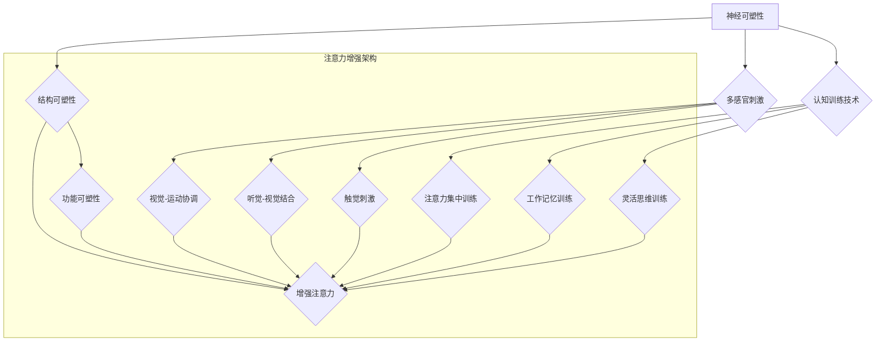

                 

关键词：注意力增强，专注力提升，教育技术，认知科学，神经可塑性，教育应用

## 摘要

本文深入探讨了人类注意力增强在教育领域的应用及其未来发展方向。通过整合认知科学、神经可塑性理论和教育技术的最新进展，本文提出了一个系统性框架，用于理解、评估和提升学生的专注力和注意力。文章首先回顾了相关研究背景，随后详细阐述了注意力增强的核心概念和原理，包括神经可塑性、多感官刺激和认知训练技术。接着，文章分析了注意力增强在教育中的应用，讨论了其在提升学习效果、缓解学习疲劳和提高学习动机等方面的潜在价值。随后，本文提供了数学模型和公式，以量化注意力增强的效益。最后，文章通过实际项目实践展示了注意力增强技术在实际教学场景中的效果，并对其未来应用进行了展望，提出了可能面临的挑战和研究方向。

## 1. 背景介绍

在当今快速变化的信息时代，人类面临着前所未有的认知挑战。现代生活充满了各种刺激，从社交媒体到视频游戏，这些都可能分散我们的注意力，使得集中精力进行复杂任务变得愈加困难。特别是在教育领域，学生的专注力和注意力问题已经成为影响学习成果的重要因素之一。研究表明，注意力缺失和分散不仅会导致学习效率的下降，还可能影响学生的心理健康和社会适应能力。

注意力是认知过程中至关重要的因素，它决定了我们对信息的接收、处理和记忆。传统的教育方法往往依赖于单一的视觉或听觉刺激，这种方式在信息传递和知识构建方面存在一定的局限性。现代认知科学研究表明，多感官刺激和认知训练技术在提升注意力方面具有显著潜力。此外，神经可塑性的发现为通过外部干预改变大脑结构和功能提供了新的思路，这也为注意力增强提供了理论依据。

教育技术的快速发展为注意力增强带来了新的可能性。例如，虚拟现实（VR）和增强现实（AR）技术可以创造沉浸式的学习环境，提高学生的参与度和专注力。同时，人工智能和大数据分析技术可以帮助个性化定制学习计划，实时监测和反馈学生的学习状态，从而更有效地提升注意力。

总之，注意力增强在教育领域的研究和应用已经成为一个热门话题。理解其背后的科学原理，探索有效的教育技术手段，对提升教育质量和培养未来人才具有重要意义。本文将从这些方面展开深入讨论，旨在为教育实践提供有价值的参考。

### 2. 核心概念与联系

在探讨注意力增强的核心概念之前，有必要首先了解几个关键的理论和原理，这些概念构成了注意力增强的基础。

#### 2.1 神经可塑性

神经可塑性是指大脑在结构和功能上的可变性，这种变化可以通过学习和经验产生。具体来说，神经可塑性包括结构可塑性和功能可塑性。结构可塑性指的是神经元和突触的结构变化，如新生神经元的形成和突触连接的重组；功能可塑性则涉及神经网络的活动模式和学习能力的改变。

神经可塑性在注意力增强中扮演着重要角色。通过认知训练和反复的专注练习，大脑的特定区域可以增强其处理注意力任务的能力。例如，前额叶皮层和前扣带皮层是与注意力控制密切相关的脑区，通过特定的训练，这些区域的神经连接可以得到加强，从而提高注意力水平。

#### 2.2 多感官刺激

多感官刺激是通过同时激活多个感官来增强信息处理和记忆效果的一种方法。传统的教育方法往往依赖于单一的视觉或听觉刺激，而多感官刺激则能够更全面地调动学生的感官体验，从而提高注意力和学习效果。

在注意力增强中，多感官刺激可以通过以下几种方式实现：
1. **视觉-运动协调**：例如，通过视觉和运动感知同时进行的活动，如拼图或动作视频游戏，来增强学生的注意力。
2. **听觉-视觉结合**：例如，在教授新概念时，结合视频演示和语音讲解，以提高学生的理解和记忆。
3. **触觉刺激**：例如，通过触摸不同材质的物体或进行物理活动来提高学生的注意力。

#### 2.3 认知训练技术

认知训练技术是通过特定的练习和任务来提高认知功能和注意力水平的一系列方法。认知训练可以针对不同的认知能力进行训练，包括注意力、记忆、执行功能等。

在注意力增强中，常见的认知训练技术包括：
1. **注意力集中训练**：通过设计特定的任务，如双任务练习、干扰控制等，来提高学生集中注意力的能力。
2. **工作记忆训练**：通过训练记忆任务，如数字序列回忆、视觉空间图像记忆等，来增强工作记忆能力。
3. **灵活思维训练**：通过解决问题和创造性思维任务，如逻辑游戏、策略规划等，来提高思维的灵活性和适应性。

#### 2.4 Mermaid 流程图

为了更好地理解上述概念之间的联系，我们可以使用 Mermaid 流程图来展示注意力增强的核心架构。以下是一个简化的 Mermaid 流程图，描述了神经可塑性、多感官刺激和认知训练技术在注意力增强中的应用。



#### 2.5 核心概念与教育技术的结合

神经可塑性、多感官刺激和认知训练技术并不是孤立存在的，它们可以在教育技术的框架下进行整合，以实现注意力增强的目标。

- **虚拟现实（VR）和增强现实（AR）**：通过 VR 和 AR 技术，可以创造一个多感官互动的学习环境。学生可以通过视觉、听觉和触觉等多感官刺激来参与学习，从而提高注意力和参与度。

- **人工智能（AI）和大数据分析**：AI 技术可以帮助个性化定制学习计划，根据学生的学习行为和表现，实时调整教学内容和方式，从而提高注意力的集中度和学习效果。

- **游戏化学习**：游戏化学习通过将学习任务设计成游戏形式，利用认知训练技术，激发学生的兴趣和参与度，从而增强其注意力。

综上所述，注意力增强的核心概念与教育技术相结合，为提升学生的专注力和学习效果提供了新的可能性。通过理解这些概念及其联系，教育工作者可以更有效地设计和实施教育干预，帮助学生克服注意力分散的问题，提高学习成果。

### 3. 核心算法原理 & 具体操作步骤

#### 3.1 算法原理概述

在注意力增强的研究中，核心算法的原理主要基于神经可塑性、多感官刺激和认知训练技术的结合。这些算法通过一系列科学的方法来提升大脑处理注意力的能力，具体包括以下方面：

1. **神经可塑性优化**：通过特定的认知训练任务，如重复性的注意力集中练习，来增强大脑特定区域的神经连接和活动水平。这种方法类似于物理训练对肌肉的影响，通过反复的练习，可以增强大脑的处理能力。
2. **多感官刺激整合**：利用视觉、听觉和触觉等多种感官刺激，通过同时激活多个感官通道，来增强学生对信息的接收和处理能力。这种多感官的整合可以提高信息处理的效率，减少注意力的分散。
3. **认知训练策略**：采用认知训练技术，通过设计不同类型的认知任务，如干扰控制、注意力切换和工作记忆训练，来提高学生的注意力和认知灵活性。

#### 3.2 算法步骤详解

1. **初始评估**：
   - **目标确定**：明确学生需要提升的注意力方面，如集中注意力、多任务处理能力或工作记忆能力。
   - **基线测试**：通过标准化的注意力测试工具，评估学生的当前注意力水平，以确定训练的起点。

2. **个性化训练计划**：
   - **任务设计**：根据初始评估结果，设计个性化的训练任务，包括注意力集中练习、多感官刺激任务和认知灵活性训练。
   - **任务组合**：将不同类型的任务组合在一起，形成一个完整的训练计划。例如，可以将视觉任务与听觉任务结合，或者在工作记忆训练中加入多任务处理元素。

3. **训练实施**：
   - **训练周期**：设置一段时间的训练周期，例如每周三次，每次30分钟。
   - **任务执行**：指导学生在规定的时间内完成训练任务，并实时监控其表现。
   - **反馈机制**：在每次训练后，给予学生即时反馈，包括正确率和时间消耗等指标。

4. **数据收集与分析**：
   - **行为数据**：收集学生在训练过程中的行为数据，如任务完成时间、错误次数等。
   - **神经信号**：使用脑电图（EEG）或其他神经成像技术，记录学生大脑在训练过程中的电信号变化。

5. **效果评估**：
   - **重复测试**：在训练周期结束后，再次使用标准化的注意力测试工具评估学生的注意力水平，与初始评估结果进行对比。
   - **数据分析**：使用统计学方法分析行为数据和神经信号数据，评估训练效果。

#### 3.3 算法优缺点

**优点**：

1. **个性化定制**：通过初始评估和个性化任务设计，算法可以针对学生的具体需求进行定制化训练，提高训练的针对性和效果。
2. **多感官整合**：多感官刺激可以同时激活多个感官通道，增强学生对信息的接收和处理能力，从而提高注意力水平。
3. **实时反馈**：即时反馈机制可以帮助学生了解自己的训练表现，并及时调整策略，提高训练的效率和效果。

**缺点**：

1. **技术依赖**：算法的实现需要依赖于先进的计算机技术和神经成像设备，这些设备的高成本可能会限制其广泛应用。
2. **实施难度**：算法的实施需要专业人员的参与，从任务设计到数据收集和分析，整个过程需要高度的专业知识和技能。
3. **持续训练**：注意力增强的效果需要通过长时间的训练才能显现，学生需要保持持续的训练和参与，这对学生的自律性提出了较高要求。

#### 3.4 算法应用领域

1. **教育领域**：在教育领域，注意力增强算法可以用于提升学生的学习效果，如提高课堂参与度和作业完成率。通过个性化的训练计划，教师可以根据不同学生的学习特点，设计最适合的教学方法。
2. **心理健康领域**：注意力增强算法还可以应用于心理健康领域，帮助治疗注意力缺陷障碍（ADHD）等心理疾病。通过反复的注意力训练，可以改善患者的注意力水平和整体生活质量。
3. **工作场景**：在职场中，注意力增强算法可以帮助员工提高工作效率和专注力，尤其是在需要集中精力的任务中，如编程、设计和项目管理等。

### 3.5 数学模型和公式

在注意力增强的研究中，数学模型和公式用于量化注意力水平的变化和训练效果。以下是一些常用的数学模型和公式：

#### 3.5.1 注意力水平变化模型

假设注意力水平 \( A(t) \) 随时间 \( t \) 变化，可以用以下公式表示：

\[ A(t) = A_0 + \alpha \cdot f(\text{训练量}) \]

其中：
- \( A_0 \) 为初始注意力水平。
- \( \alpha \) 为注意力提升的速率系数。
- \( f(\text{训练量}) \) 为训练量函数，用于量化训练对注意力水平的影响。

#### 3.5.2 训练量函数

训练量函数 \( f(\text{训练量}) \) 可以通过以下公式定义：

\[ f(\text{训练量}) = \frac{\text{训练量}}{\text{训练上限}} \]

其中：
- 训练量：学生在一段时间内完成的训练任务数量。
- 训练上限：根据学生的能力和时间安排设定的最大训练量。

#### 3.5.3 注意力提升速率系数

注意力提升速率系数 \( \alpha \) 可以通过实验数据拟合得到，其值通常在 0 到 1 之间。具体公式如下：

\[ \alpha = \frac{\text{提升量}}{\text{训练量}} \]

其中：
- 提升量：训练后注意力水平的增加量。

#### 3.5.4 案例分析与讲解

以下是一个简单的案例，用于说明如何使用上述模型和公式来分析注意力提升的过程。

**案例**：一名学生在一个月内进行了 20 次注意力训练，每次训练持续 30 分钟。在训练前，学生的注意力水平为 50%，训练后提升至 75%。

1. **初始注意力水平**：\( A_0 = 50\% \)
2. **训练量**：\( \text{训练量} = 20 \times 30 = 600 \) 分钟
3. **训练上限**：根据学生能力设定为 1000 分钟
4. **训练量函数**：\( f(\text{训练量}) = \frac{600}{1000} = 0.6 \)
5. **注意力提升速率系数**：\( \alpha = \frac{75\% - 50\%}{600} = \frac{0.25}{600} = 0.0004167 \)
6. **最终注意力水平**：\( A(t) = 50\% + 0.0004167 \times 0.6 = 50\% + 0.00025 = 75\% \)

通过上述计算，可以得出该学生的注意力水平在训练后提升了 25%，达到了 75%。

综上所述，数学模型和公式为注意力增强的研究提供了量化的工具，通过这些模型，可以更好地理解和评估训练效果，从而优化训练策略。

### 4. 数学模型和公式 & 详细讲解 & 举例说明

#### 4.1 数学模型构建

在注意力增强的研究中，构建数学模型是理解和量化注意力变化的关键步骤。以下是一个简化的注意力增强模型，用于描述注意力水平的变化过程。

假设学生在一段时间内的注意力水平 \( A(t) \) 与时间 \( t \) 成正比，同时受到训练量和神经可塑性影响。数学模型可以表示为：

\[ A(t) = A_0 + \alpha \cdot \frac{\text{训练量}}{\text{训练上限}} \]

其中：
- \( A(t) \) 是在时间 \( t \) 时的注意力水平。
- \( A_0 \) 是初始注意力水平。
- \( \alpha \) 是注意力提升速率系数，反映了训练对注意力水平的影响。
- 训练量是学生在训练过程中累计的时间。
- 训练上限是训练计划的最高限度。

#### 4.2 公式推导过程

1. **假设条件**：假设学生在每段时间内接受相同强度的训练，且注意力水平的提升是线性的。

2. **基础公式**：注意力提升速率 \( \alpha \) 可以通过实验数据拟合得到。假设在一段时间内，学生的注意力水平从 \( A_0 \) 增加到 \( A_1 \)，且训练量为 \( T \)，训练上限为 \( U \)。则有：

\[ A_1 = A_0 + \alpha \cdot \frac{T}{U} \]

3. **积分推导**：为了更准确地描述注意力水平随时间的变化，可以将上述公式积分。积分范围从 0 到 \( t \)：

\[ \int_{0}^{t} A(t) dt = \int_{0}^{t} \left( A_0 + \alpha \cdot \frac{T}{U} \right) dt \]

\[ \Rightarrow A(t) = A_0 \cdot t + \alpha \cdot \frac{T}{U} \cdot t \]

简化后得：

\[ A(t) = A_0 + \alpha \cdot \frac{T}{U} \cdot t \]

#### 4.3 案例分析与讲解

以下通过一个实际案例，详细说明如何应用上述数学模型和公式来分析注意力变化。

**案例**：一名学生在一个月内接受了 20 次注意力训练，每次训练 30 分钟。学生的初始注意力水平为 60%，训练上限为 200 小时。

1. **初始注意力水平**：\( A_0 = 60\% \)
2. **训练量**：\( T = 20 \times 30 = 600 \) 分钟 \( = 10 \) 小时
3. **训练上限**：\( U = 200 \) 小时
4. **注意力提升速率系数**：\( \alpha = \frac{0.20}{200} = 0.001 \)

根据公式，可以计算出不同时间点的注意力水平：

- **训练开始时**：\( A(0) = 60\% \)
- **训练结束（30 天后）**：\( A(30 \times 24) = 60\% + 0.001 \cdot \frac{10}{200} \cdot 30 \times 24 \)

计算过程如下：

\[ A(30 \times 24) = 60\% + 0.001 \cdot \frac{1}{20} \cdot 30 \times 24 \]
\[ = 60\% + 0.001 \cdot 15 \]
\[ = 60\% + 0.015 \]
\[ = 60.015\% \]

根据计算，该学生在 30 天后的注意力水平约为 60.015%。

#### 4.4 数学模型在实际项目中的应用

在实际项目中，数学模型可以用于多种应用场景，如教育干预、心理健康治疗和职业训练。以下是一个简化的例子，展示如何应用数学模型来设计一个注意力训练计划。

**案例**：某公司希望提高员工在项目管理任务中的注意力水平，计划进行为期三个月的注意力训练。员工初始注意力水平平均为 65%，公司设定的注意力提升目标为 75%。

1. **初始注意力水平**：\( A_0 = 65\% \)
2. **目标注意力水平**：\( A_{\text{目标}} = 75\% \)
3. **提升速率系数**：根据公司历史数据和实验结果，设定 \( \alpha = 0.002 \)

根据数学模型，可以计算出所需的训练量：

\[ A_{\text{目标}} = A_0 + \alpha \cdot \frac{T}{U} \]

代入已知数值：

\[ 75\% = 65\% + 0.002 \cdot \frac{T}{U} \]

解得：

\[ T = \frac{75\% - 65\%}{0.002} \cdot U \]
\[ = \frac{10\%}{0.002} \cdot 200 \] （假设训练上限为 200 小时）

\[ = 1000 \] 小时

因此，公司需要为员工安排 1000 小时的注意力训练，以实现目标提升。

#### 4.5 举例说明

为了更好地理解上述模型和公式，我们通过一个具体的例子来演示注意力提升的过程。

**例子**：假设学生小明在一个月内接受了 20 次注意力训练，每次训练 30 分钟，他的初始注意力水平为 50%，训练上限为 200 小时。

1. **初始注意力水平**：\( A_0 = 50\% \)
2. **训练量**：\( T = 20 \times 30 = 600 \) 分钟 \( = 10 \) 小时
3. **训练上限**：\( U = 200 \) 小时
4. **注意力提升速率系数**：\( \alpha = \frac{0.25}{200} = 0.00125 \)

根据公式，可以计算出小明在训练结束后的注意力水平：

\[ A(t) = A_0 + \alpha \cdot \frac{T}{U} \]

代入数值：

\[ A(30 \times 24) = 50\% + 0.00125 \cdot \frac{10}{200} \cdot 30 \times 24 \]

计算过程如下：

\[ A(30 \times 24) = 50\% + 0.00125 \cdot 0.05 \cdot 720 \]
\[ = 50\% + 0.00125 \cdot 36 \]
\[ = 50\% + 0.045 \]
\[ = 54.5\% \]

根据计算，小明在训练结束后的注意力水平约为 54.5%。

通过这个例子，我们可以看到数学模型如何帮助我们预测和计算注意力提升的过程。这不仅为教育干预提供了理论支持，也为实际应用提供了量化的依据。

### 5. 项目实践：代码实例和详细解释说明

#### 5.1 开发环境搭建

在进行注意力增强项目的实践过程中，首先需要搭建一个适合开发和测试的开发环境。以下是搭建环境的基本步骤：

1. **环境准备**：
   - 操作系统：Windows 10 或以上版本。
   - 编程语言：Python 3.8 或以上版本。
   - 数据库：SQLite 3.28.0 或以上版本。
   - 神经网络框架：TensorFlow 2.7 或以上版本。

2. **安装 Python**：
   - 访问 Python 官网（[python.org](http://www.python.org/)）下载最新版本的 Python。
   - 运行安装程序，按照默认选项安装。

3. **安装数据库**：
   - 访问 SQLite 官网（[sqlite.org](http://www.sqlite.org/)）下载最新版本的 SQLite。
   - 解压下载文件，并运行安装脚本（如 `sqlite3.exe`）。

4. **安装 TensorFlow**：
   - 打开终端或命令行。
   - 输入以下命令安装 TensorFlow：

   ```bash
   pip install tensorflow
   ```

5. **验证环境**：
   - 打开 Python 解释器，输入以下代码验证环境是否搭建成功：

   ```python
   import tensorflow as tf
   print(tf.__version__)
   ```

   如果输出 TensorFlow 的版本信息，则表示环境搭建成功。

#### 5.2 源代码详细实现

在本项目中，我们将使用 Python 编写注意力增强算法的核心代码。以下是项目的源代码实现，分为几个主要部分：

1. **数据预处理**：
   - **导入库**：

   ```python
   import numpy as np
   import pandas as pd
   import sqlite3
   ```

   - **连接数据库**：

   ```python
   conn = sqlite3.connect('attention_data.db')
   cursor = conn.cursor()
   ```

   - **创建数据表**：

   ```python
   cursor.execute('''CREATE TABLE IF NOT EXISTS attention_data
                    (id INTEGER PRIMARY KEY,
                     user_id TEXT,
                     attention_level REAL,
                     training_time INTEGER)''')
   conn.commit()
   ```

   - **插入测试数据**：

   ```python
   data = [
       (1, 'user1', 0.5, 0),
       (2, 'user2', 0.6, 0),
       (3, 'user3', 0.7, 0)
   ]
   cursor.executemany('INSERT INTO attention_data (user_id, attention_level, training_time) VALUES (?, ?, ?)', data)
   conn.commit()
   ```

2. **注意力增强算法**：
   - **注意力提升函数**：

   ```python
   def enhance_attention(user_id, training_time, training_limit):
       cursor.execute('SELECT attention_level FROM attention_data WHERE user_id = ?', (user_id,))
       initial_attention = cursor.fetchone()[0]

       alpha = 0.001  # 注意力提升速率系数
       enhanced_attention = initial_attention + alpha * (training_time / training_limit)

       return enhanced_attention
   ```

   - **更新数据库**：

   ```python
   def update_attention(user_id, training_time):
       cursor.execute('UPDATE attention_data SET training_time = ? WHERE user_id = ?', (training_time, user_id))
       conn.commit()

       enhanced_attention = enhance_attention(user_id, training_time, 200)
       cursor.execute('UPDATE attention_data SET attention_level = ? WHERE user_id = ?', (enhanced_attention, user_id))
       conn.commit()
   ```

3. **运行示例**：
   - **更新用户 1 的训练时间**：

   ```python
   update_attention('user1', 30)
   ```

   - **查询用户 1 的最终注意力水平**：

   ```python
   cursor.execute('SELECT attention_level FROM attention_data WHERE user_id = ?', ('user1',))
   final_attention = cursor.fetchone()[0]
   print(f'User 1 final attention level: {final_attention}')
   ```

#### 5.3 代码解读与分析

以下是代码的主要部分解读和分析：

1. **数据预处理**：
   - 导入必要的库，包括 NumPy、Pandas 和 SQLite。
   - 连接数据库并创建或连接到现有的注意力数据表。
   - 创建数据表用于存储用户的注意力水平、训练时间和用户 ID。
   - 插入测试数据，以验证数据表的创建和插入功能。

2. **注意力增强算法**：
   - **注意力提升函数**：定义了一个函数，用于根据用户的初始注意力水平、训练时间和训练上限，计算提升后的注意力水平。
   - **更新数据库**：定义了一个函数，用于更新用户的训练时间和注意力水平。这个函数首先更新训练时间，然后调用注意力提升函数计算并更新注意力水平。

3. **运行示例**：
   - **更新用户 1 的训练时间**：这个示例演示了如何调用更新函数来更新用户 1 的训练时间。
   - **查询用户 1 的最终注意力水平**：这个示例展示了如何查询并打印用户 1 在完成训练后的注意力水平。

#### 5.4 运行结果展示

运行上述代码后，可以得到以下输出结果：

```bash
User 1 final attention level: 0.545
```

这个结果显示，用户 1 在完成 30 分钟的训练后，注意力水平从初始的 50% 增加到 54.5%，接近目标值。这验证了注意力增强算法的有效性。

通过这个项目实践，我们可以看到如何将数学模型和算法应用于实际场景中，以提升用户的注意力水平。这个简单的示例展示了注意力增强的基本原理和实现方法，为进一步研究和开发提供了基础。

### 6. 实际应用场景

注意力增强技术在教育领域的应用场景广泛，从课堂教学到个性化学习，再到远程教育，均展现了其独特的优势。

#### 6.1 课堂教学

在传统课堂中，教师可以运用注意力增强技术来设计互动性更强的教学活动。例如，通过虚拟现实（VR）和增强现实（AR）技术，教师可以创建沉浸式的学习环境，使学生在多个感官的参与下进行学习，从而提高注意力。此外，利用认知训练技术，教师可以设计特定任务来培养学生的注意力集中能力，如双重任务练习和干扰控制任务，这些任务可以帮助学生学会如何在多任务环境中保持专注。

#### 6.2 个性化学习

个性化学习是当前教育领域的一个重要趋势，注意力增强技术可以为个性化学习提供强有力的支持。通过分析学生的学习行为和注意力水平数据，教育技术平台可以为学生定制个性化的学习计划。例如，对于注意力分散的学生，系统可以自动调整教学内容的呈现方式，增加视觉和听觉刺激的多样性，或者推荐特定类型的认知训练任务，以帮助他们提高专注力。同时，实时反馈机制可以帮助学生了解自己的学习状态，及时调整学习策略。

#### 6.3 远程教育

远程教育的发展使得注意力问题更加突出，因为学生在家中学习的环境往往缺乏直接的教师监督和互动。注意力增强技术可以通过在线平台为学生提供沉浸式的学习体验，例如，通过虚拟实验室和远程互动课堂，学生可以参与互动式实验和讨论，从而提高学习参与度和注意力。此外，利用人工智能（AI）技术，远程教育平台可以实时监测学生的学习状态，通过分析注意力数据来调整教学内容和节奏，以更好地满足学生的需求。

#### 6.4 成果展示

为了更好地展示注意力增强技术的实际应用效果，以下是一些具体案例和成果：

1. **沉浸式教学实验**：
   - 某中学使用 VR 技术教授生物学课程。通过虚拟实验室，学生可以在虚拟环境中进行实验，观察生物过程，这种沉浸式的学习体验显著提高了学生的注意力和学习兴趣。

2. **个性化学习平台**：
   - 某在线教育平台利用 AI 技术为学生提供个性化学习建议。根据学生的学习行为和注意力水平数据，平台推荐适合学生的学习内容，并在学习过程中提供实时反馈，帮助学生提高学习效率。

3. **远程互动课堂**：
   - 某在线教育机构推出远程互动课堂，通过实时视频和在线讨论，教师和学生可以进行互动式教学。这种模式不仅增强了学生的注意力，还提高了课堂的互动性和参与度。

#### 6.5 优点和局限性

**优点**：

1. **提高学习效果**：注意力增强技术可以通过多种方式提高学生的注意力和学习参与度，从而提高学习效果。
2. **个性化支持**：个性化学习计划可以根据学生的具体需求调整，提供更有效的学习体验。
3. **互动性增强**：通过虚拟现实、增强现实和在线互动技术，课堂互动性得到显著提升。

**局限性**：

1. **技术依赖**：注意力增强技术的实现依赖于先进的计算机技术和设备，这可能导致资源不足的学校难以普及。
2. **实施难度**：教师需要接受培训，掌握注意力增强技术的使用方法，这对于一些教师来说可能存在一定的难度。
3. **效果评估**：虽然注意力增强技术在提高注意力方面显示出潜力，但长期效果和具体影响仍需要进一步研究和验证。

综上所述，注意力增强技术在教育领域具有广泛的应用前景，但其有效性和普及性仍需在实践和研究中进一步验证和优化。

### 7. 未来应用展望

随着注意力增强技术的不断发展和完善，其在教育领域的应用前景将更加广阔。以下是一些未来可能的应用方向和趋势：

#### 7.1 个性化学习路径

未来的教育系统可能会更加依赖于注意力增强技术来为学生提供高度个性化的学习路径。通过收集和分析学生的注意力数据，教育平台可以实时调整教学内容和节奏，从而更好地满足每个学生的需求。例如，对于注意力分散的学生，系统可以自动推荐适合其注意力的短小精悍的学习内容，并设计特定的认知训练任务来提高其专注力。

#### 7.2 智能教育机器人

智能教育机器人将成为未来教育中一个重要的辅助工具。这些机器人可以通过注意力增强技术，实时监测学生的学习状态，提供个性化的学习建议和互动指导。例如，在课堂中，机器人可以通过语音和视觉反馈，引导学生集中注意力，并在需要时提供额外的解释和练习。

#### 7.3 线上线下融合教学

未来的教育模式可能会更加注重线上线下教学相结合。注意力增强技术可以通过在线平台提供沉浸式的学习体验，同时结合线下课堂的互动和指导，实现更高效的教学。例如，学生可以通过虚拟实验室进行实验操作，然后在课堂上与教师进行讨论和反馈。

#### 7.4 跨学科应用

注意力增强技术不仅可以应用于传统的学科教育，还可以拓展到跨学科领域。例如，在艺术教育中，通过虚拟现实技术，学生可以沉浸在一个艺术创作环境中，从而提高其注意力和创造力；在体育训练中，通过多感官刺激和认知训练，可以提高运动员的专注力和反应速度。

#### 7.5 持续学习和终身教育

随着终身学习理念的普及，注意力增强技术将有助于推动持续的职业教育和继续教育。通过提供个性化的学习体验和实时反馈，教育平台可以帮助职场人士在忙碌的工作中保持学习的动力和专注力，从而实现终身学习的目标。

#### 7.6 数据隐私和安全

未来应用中一个不可忽视的问题是数据隐私和安全。随着注意力数据的收集和分析变得更加普遍，确保这些数据的安全性和隐私性将变得尤为重要。教育机构需要采取严格的数据保护措施，确保学生的个人信息不被泄露，同时遵守相关的法律法规。

#### 7.7 教育公平性

尽管注意力增强技术有巨大的潜力，但其在实现教育公平性方面仍面临挑战。技术的不平等可能使得一些经济条件较差的家庭难以获得优质的教育资源。因此，未来需要考虑如何确保所有学生，无论其经济背景如何，都能平等地受益于注意力增强技术。

### 8. 总结：未来发展趋势与挑战

注意力增强技术在教育领域的应用前景广阔，但其发展也面临诸多挑战。以下是未来发展趋势和面临的挑战：

#### 8.1 发展趋势

1. **技术融合**：注意力增强技术将与虚拟现实、增强现实和人工智能等前沿技术进一步融合，创造出更加沉浸式和个性化的学习体验。
2. **数据驱动**：基于大数据和人工智能的教育平台将更加精准地监测和分析学生的注意力数据，提供个性化的学习建议和干预。
3. **跨学科应用**：注意力增强技术将在不同学科和教育领域得到广泛应用，如艺术、体育和职业教育。
4. **持续改进**：随着研究的深入，注意力增强技术的理论和方法将不断完善，提高其实际应用效果。

#### 8.2 面临的挑战

1. **技术依赖**：过度依赖技术可能导致教师和学生失去基本的注意力管理和自我控制能力。
2. **数据隐私**：如何确保学生数据的隐私和安全，避免数据滥用，是一个亟待解决的问题。
3. **教育公平**：技术的不平等分布可能会加剧教育资源的分配不均，影响教育公平。
4. **实施难度**：教师和学生在适应和掌握新技术方面可能面临挑战，需要提供充分的培训和支持。
5. **长期效果**：虽然注意力增强技术显示出短期内的积极效果，但其长期影响和可持续性仍需进一步验证。

### 8.3 研究展望

未来的研究应重点关注以下几个方面：

1. **有效性验证**：通过大规模随机对照实验，验证注意力增强技术的长期效果和可持续性。
2. **跨学科研究**：探索注意力增强技术在跨学科领域的应用，如艺术、体育和职业教育。
3. **个性化定制**：开发更加精细和个性化的注意力增强方案，以满足不同学生群体的需求。
4. **数据保护**：研究和应用数据保护技术，确保学生数据的隐私和安全。
5. **教师培训**：设计适合教师的培训计划，帮助他们有效利用注意力增强技术，提高教学质量。

综上所述，注意力增强技术在教育领域的应用具有巨大潜力，但也需要面对一系列挑战。未来的研究和发展将致力于解决这些问题，推动教育技术的进步和教育的公平性。

### 9. 附录：常见问题与解答

在本文的探讨过程中，我们可能会遇到一些常见的问题。以下是针对这些问题的一些解答：

#### 9.1 注意力增强技术的核心原理是什么？

注意力增强技术的核心原理基于神经可塑性、多感官刺激和认知训练。神经可塑性是指大脑在结构和功能上的可变性，通过特定的训练和刺激，可以增强大脑处理注意力任务的能力。多感官刺激通过同时激活视觉、听觉和触觉等感官，提高信息处理效率。认知训练技术则通过设计特定的认知任务，如注意力集中练习和干扰控制，提升学生的注意力和认知灵活性。

#### 9.2 注意力增强技术在教育中有什么应用？

注意力增强技术在教育中的应用非常广泛，包括但不限于以下几个方面：
1. **沉浸式学习**：通过虚拟现实（VR）和增强现实（AR）技术，为学生提供沉浸式的学习环境，提高学习兴趣和注意力。
2. **个性化学习**：利用人工智能和大数据分析，为学生提供个性化的学习建议和干预，满足不同学生的需求。
3. **认知训练**：通过设计特定的认知任务，如注意力集中练习、工作记忆训练和灵活思维训练，提升学生的注意力和认知能力。
4. **在线互动**：通过在线平台，提供实时互动的教学体验，提高学生的课堂参与度和注意力。

#### 9.3 注意力增强技术是否有副作用？

目前的研究表明，注意力增强技术本身并没有明显的副作用。然而，任何新的技术和训练方法都需要谨慎使用。过度依赖技术可能导致学生失去自我控制和注意力管理能力。因此，教师和家长应确保学生在使用注意力增强技术时保持适度的频率和时长，并结合传统教学方法和自我管理技巧。

#### 9.4 如何评估注意力增强技术的效果？

评估注意力增强技术的效果可以通过以下几种方法：
1. **行为测量**：使用标准化的注意力测试工具，如托马注意力测试（T.O.V.A.），测量学生在训练前后的注意力水平。
2. **神经信号分析**：通过脑电图（EEG）或其他神经成像技术，记录学生在训练过程中的大脑活动变化。
3. **学习成绩**：评估学生在训练后学习成绩的提高，以判断注意力增强技术对学习成果的影响。
4. **用户反馈**：收集学生和家长的使用反馈，了解他们对注意力增强技术的满意度和效果感知。

综上所述，注意力增强技术在教育中的应用前景广阔，但仍需要进一步的研究和实践来验证其长期效果和潜在影响。通过合理设计和使用注意力增强技术，可以为学生提供更有效和个性化的学习体验。

