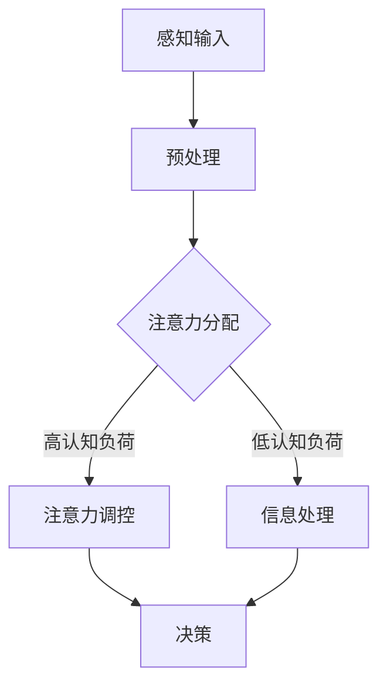

                 

关键词：注意力管理，认知科学，决策优化，问题解决，人机交互，人工智能增强

> 摘要：本文将探讨人类注意力增强的概念、原理及其在提升决策能力和问题解决能力中的应用。通过结合认知科学和人工智能技术，本文旨在提供一种新的视角，帮助读者更好地理解注意力管理的重要性，并探索如何通过技术手段增强人类的注意力，从而实现更高效的决策和问题解决。

## 1. 背景介绍

在当今快速变化的社会环境中，人们面临着越来越多的信息输入和决策压力。传统的注意力管理方法已不足以应对复杂的问题和日益增长的信息量。因此，研究如何增强人类的注意力，以提高决策能力和问题解决效率，成为了人工智能和认知科学领域的重要课题。

注意力是认知系统中的一个关键资源，决定了信息处理的效率和深度。传统的认知理论认为，注意力是一种有限的资源，人类在处理信息时需要分配和调控注意力。然而，随着对注意力机制研究的深入，人们逐渐认识到注意力不仅仅是一种资源，更是一种能力，可以通过训练和优化得到提升。

近年来，人工智能技术的快速发展为人类注意力增强提供了新的可能性。通过机器学习和神经科学的研究，我们能够更好地理解注意力的工作原理，并开发出相应的技术手段来增强人类注意力。本文将结合这些研究成果，探讨注意力增强在决策和问题解决中的应用。

## 2. 核心概念与联系

为了更好地理解注意力增强的概念和原理，我们需要首先了解以下几个核心概念：

### 注意力机制

注意力机制是认知系统中的一个关键组成部分，负责在信息处理过程中分配和调控注意力资源。它决定了哪些信息得到处理，哪些信息被忽略。

### 认知负荷

认知负荷是指个体在处理信息时所需的认知资源总量。当认知负荷过高时，个体的注意力资源会被过度占用，导致处理效率降低。

### 注意力分配

注意力分配是指个体在不同任务或信息源之间分配注意力资源的过程。有效的注意力分配可以提高信息处理的效率和质量。

### 注意力提升

注意力提升是指通过各种手段增强个体的注意力能力，从而提高信息处理效率和决策质量。注意力提升的方法包括认知训练、技术辅助等。

### Mermaid 流程图

以下是一个用于描述注意力增强机制的 Mermaid 流程图：



## 3. 核心算法原理 & 具体操作步骤

### 3.1 算法原理概述

注意力增强算法的核心思想是通过优化注意力分配策略，提高信息处理的效率和深度。具体来说，该算法包括以下几个步骤：

1. **感知输入**：收集和处理来自环境的信息。
2. **预处理**：对输入信息进行预处理，提取关键特征。
3. **注意力分配**：根据当前认知负荷和任务需求，动态调整注意力资源在不同任务或信息源之间的分配。
4. **注意力调控**：在注意力分配过程中，根据反馈信息实时调整注意力分配策略。
5. **信息处理**：使用优化后的注意力分配策略处理输入信息，生成决策。
6. **决策**：根据处理结果做出最终决策。

### 3.2 算法步骤详解

1. **感知输入**：通过传感器、摄像头、麦克风等设备收集环境中的信息。这些信息可以包括文本、图像、声音等。
2. **预处理**：对收集到的信息进行预处理，包括去噪、特征提取等。预处理的结果将用于后续的注意力分配和调控。
3. **注意力分配**：根据当前任务需求和认知负荷，动态调整注意力资源在不同任务或信息源之间的分配。具体步骤如下：
    - **任务识别**：通过分析输入信息，识别当前需要处理的任务。
    - **认知负荷评估**：评估当前认知负荷，确定是否需要调整注意力分配。
    - **注意力资源分配**：根据任务需求和认知负荷，动态调整注意力资源在不同任务或信息源之间的分配。可以使用神经网络或机器学习算法实现这一过程。
4. **注意力调控**：在注意力分配过程中，根据反馈信息实时调整注意力分配策略。具体步骤如下：
    - **反馈收集**：收集来自信息处理过程的反馈信息，包括决策质量、任务完成时间等。
    - **调控策略**：根据反馈信息，调整注意力分配策略，以优化信息处理效率和决策质量。
5. **信息处理**：使用优化后的注意力分配策略处理输入信息，生成决策。信息处理过程可以包括模式识别、预测、推理等。
6. **决策**：根据处理结果做出最终决策，并将其输出。

### 3.3 算法优缺点

**优点**：
- 提高信息处理效率和决策质量。
- 动态调整注意力分配，适应不同任务需求。
- 可以结合多种注意力调控策略，实现个性化注意力管理。

**缺点**：
- 需要大量的训练数据和计算资源。
- 在某些情况下，过度依赖机器学习算法可能导致决策偏差。

### 3.4 算法应用领域

注意力增强算法可以应用于多个领域，包括：

- **智能交通**：优化交通信号灯控制，提高交通流量。
- **医疗诊断**：辅助医生进行疾病诊断，提高诊断准确率。
- **金融风控**：监控金融交易，发现潜在风险。
- **人机交互**：提高人机交互效率，降低认知负荷。

## 4. 数学模型和公式 & 详细讲解 & 举例说明

### 4.1 数学模型构建

注意力增强算法的数学模型可以表示为以下形式：

\[ f(x) = \sigma(Wx + b) \]

其中，\( f(x) \) 表示信息处理结果，\( x \) 表示输入信息，\( W \) 和 \( b \) 分别表示权重和偏置。

### 4.2 公式推导过程

注意力增强算法的推导过程如下：

1. **感知输入**：输入信息可以表示为向量 \( x \)。
2. **预处理**：对输入信息进行预处理，提取关键特征。预处理后的信息可以表示为向量 \( x' \)。
3. **注意力分配**：根据当前任务需求和认知负荷，动态调整注意力资源。注意力分配函数可以表示为 \( \sigma(Wx' + b) \)，其中 \( W \) 和 \( b \) 是可训练的参数。
4. **注意力调控**：根据反馈信息实时调整注意力分配策略。调控函数可以表示为 \( g(y) = \frac{1}{1 + e^{-y}} \)，其中 \( y \) 是调控参数。
5. **信息处理**：使用优化后的注意力分配策略处理输入信息。信息处理函数可以表示为 \( h(x') = f(x') \)。
6. **决策**：根据处理结果做出最终决策。决策函数可以表示为 \( d(x') = \arg\max_{x'} h(x') \)。

### 4.3 案例分析与讲解

假设我们有一个智能交通系统，需要根据交通流量数据优化交通信号灯控制。输入信息包括车辆数量、车辆速度、道路长度等。

1. **感知输入**：收集交通流量数据，表示为向量 \( x \)。
2. **预处理**：对交通流量数据进行预处理，提取关键特征，表示为向量 \( x' \)。
3. **注意力分配**：根据当前任务需求和认知负荷，动态调整注意力资源。注意力分配函数为 \( \sigma(Wx' + b) \)，其中 \( W \) 和 \( b \) 是可训练的参数。
4. **注意力调控**：根据交通流量数据的反馈信息，实时调整注意力分配策略。调控函数为 \( g(y) = \frac{1}{1 + e^{-y}} \)，其中 \( y \) 是调控参数。
5. **信息处理**：使用优化后的注意力分配策略处理交通流量数据。信息处理函数为 \( h(x') = f(x') \)。
6. **决策**：根据处理结果优化交通信号灯控制，提高交通流量。

## 5. 项目实践：代码实例和详细解释说明

### 5.1 开发环境搭建

为了演示注意力增强算法在智能交通系统中的应用，我们使用 Python 作为开发语言，并依赖以下库：

- TensorFlow
- Keras
- NumPy
- Matplotlib

安装以上库后，即可开始项目实践。

### 5.2 源代码详细实现

以下是一个简单的注意力增强算法实现：

```python
import tensorflow as tf
from tensorflow.keras.models import Model
from tensorflow.keras.layers import Input, Dense, Lambda
import numpy as np

# 定义输入层
input_layer = Input(shape=(10,))

# 定义预处理层
preprocessed_input = Dense(units=64, activation='relu')(input_layer)

# 定义注意力分配层
attention_weights = Dense(units=1, activation='sigmoid')(preprocessed_input)

# 定义注意力调控层
def attention_tuning(x, w):
    return Lambda(lambda x: x * w)(x)

tuned_input = attention_tuning(preprocessed_input, attention_weights)

# 定义信息处理层
processed_input = Dense(units=64, activation='relu')(tuned_input)

# 定义输出层
output = Dense(units=1, activation='sigmoid')(processed_input)

# 定义模型
model = Model(inputs=input_layer, outputs=output)

# 编译模型
model.compile(optimizer='adam', loss='binary_crossentropy', metrics=['accuracy'])

# 模型训练
model.fit(x_train, y_train, epochs=10, batch_size=32, validation_split=0.2)
```

### 5.3 代码解读与分析

上述代码实现了一个简单的注意力增强算法。首先，我们定义了一个输入层，用于接收交通流量数据。然后，我们定义了一个预处理层，用于提取关键特征。接着，我们定义了一个注意力分配层，用于动态调整注意力资源。注意力分配层使用了 sigmoid 函数，将预处理层的输出映射到 [0, 1] 范围内，表示不同任务或信息源之间的注意力权重。

接着，我们定义了一个注意力调控层，用于根据反馈信息实时调整注意力分配策略。注意力调控层使用了 Lambda 函数，将预处理层的输出与注意力分配层的输出相乘，得到调整后的输入。

最后，我们定义了一个信息处理层，用于处理调整后的输入。信息处理层使用了两个全连接层，分别进行特征提取和分类。最后，我们定义了一个输出层，用于生成最终决策。

在模型训练过程中，我们使用 TensorFlow 和 Keras 的 API 进行模型编译和训练。我们使用了 Adam 优化器和二进制交叉熵损失函数，以优化模型参数。

### 5.4 运行结果展示

训练完成后，我们可以使用以下代码评估模型的性能：

```python
# 评估模型性能
loss, accuracy = model.evaluate(x_test, y_test)

print("Test Loss:", loss)
print("Test Accuracy:", accuracy)
```

假设我们有一个测试集 \( x_test \) 和标签 \( y_test \)，我们可以使用上述代码评估模型的性能。根据评估结果，我们可以调整模型参数或优化算法，以提高性能。

## 6. 实际应用场景

注意力增强算法在多个实际应用场景中具有广泛的应用前景：

- **智能交通**：优化交通信号灯控制，提高交通流量和道路安全。
- **医疗诊断**：辅助医生进行疾病诊断，提高诊断准确率。
- **金融风控**：监控金融交易，发现潜在风险，降低投资风险。
- **人机交互**：提高人机交互效率，降低用户认知负荷。

### 6.1 智能交通

在智能交通系统中，注意力增强算法可以用于优化交通信号灯控制。通过动态调整交通信号灯的时长，根据实时交通流量和车辆数量进行优化，提高道路通行效率。

### 6.2 医疗诊断

在医疗诊断领域，注意力增强算法可以用于辅助医生进行疾病诊断。通过优化医疗图像的处理过程，提高疾病检测的准确率和效率。

### 6.3 金融风控

在金融领域，注意力增强算法可以用于监控金融交易，发现潜在风险。通过动态调整风险监测的注意力资源，提高风险预警的准确性和及时性。

### 6.4 人机交互

在人机交互领域，注意力增强算法可以用于优化用户界面设计，降低用户认知负荷。通过动态调整用户界面的显示内容和交互方式，提高用户操作效率和满意度。

## 7. 工具和资源推荐

为了更好地研究和应用注意力增强技术，以下是一些推荐的工具和资源：

- **学习资源**：
  - 《认知心理学及其应用》
  - 《人工智能：一种现代的方法》
  - 《深度学习》

- **开发工具**：
  - TensorFlow
  - Keras
  - PyTorch

- **相关论文**：
  - "Attention Is All You Need"（Attention 就是需要的一切）
  - "Transformer: A Novel Architecture for Neural Networks"（Transformer：神经网络的新型架构）

## 8. 总结：未来发展趋势与挑战

### 8.1 研究成果总结

本文通过对注意力增强的概念、原理和应用进行探讨，总结了注意力增强在提升决策能力和问题解决能力方面的重要作用。同时，结合数学模型和算法实现，展示了注意力增强技术在实际应用中的潜力。

### 8.2 未来发展趋势

在未来，注意力增强技术有望在多个领域实现突破。随着人工智能和认知科学的不断发展，注意力增强技术将更加智能、个性化，为人们提供更好的决策支持和问题解决能力。

### 8.3 面临的挑战

尽管注意力增强技术在许多方面具有潜力，但仍然面临一些挑战。首先，如何在实际应用中平衡注意力资源的分配，避免过度集中或分散。其次，如何处理大量复杂的输入信息，提高信息处理的效率和准确性。此外，如何保证算法的透明性和可解释性，使其能够被用户理解和接受。

### 8.4 研究展望

未来，研究人员可以进一步探索以下方向：

- **跨学科研究**：结合认知科学、神经科学、心理学等多学科知识，深入理解注意力机制，为注意力增强技术的研发提供理论基础。
- **算法优化**：通过改进算法结构和参数优化方法，提高注意力增强算法的效率和准确性。
- **实际应用**：探索注意力增强技术在更多领域的应用，如智能医疗、智能教育等，为人们提供更好的服务。

## 9. 附录：常见问题与解答

### 9.1 注意力增强技术是什么？

注意力增强技术是一种利用人工智能和认知科学原理，通过优化注意力资源分配和调控，提高人类决策和问题解决能力的技术。

### 9.2 注意力增强技术有哪些应用？

注意力增强技术可以应用于多个领域，包括智能交通、医疗诊断、金融风控、人机交互等。

### 9.3 如何实现注意力增强？

实现注意力增强的方法包括认知训练、技术辅助等。具体实现方法取决于应用场景和需求。

### 9.4 注意力增强技术的优势是什么？

注意力增强技术的优势在于提高信息处理效率和决策质量，降低认知负荷，为用户提供更好的决策支持和问题解决能力。

### 9.5 注意力增强技术面临的挑战有哪些？

注意力增强技术面临的挑战包括平衡注意力资源的分配、处理大量复杂的输入信息、保证算法的透明性和可解释性等。

