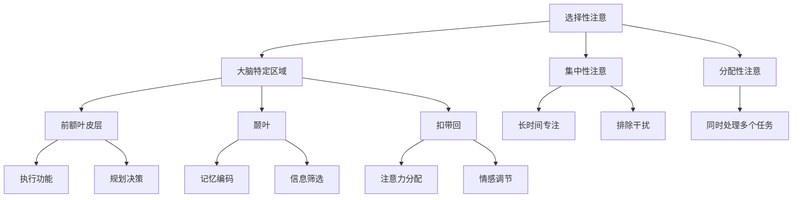

                 

关键词：人类注意力增强、创新能力、创造力提升、神经科学、算法优化、技术应用

## 摘要

随着信息技术的迅猛发展，人类面临的挑战与日俱增。在这篇文章中，我们将探讨如何通过增强人类的注意力来提升创新能力和创造力。我们将从神经科学角度分析人类注意力的机制，介绍一系列基于算法和技术的注意力增强方法，并探讨这些方法在现实中的应用与未来展望。本文旨在为读者提供一套系统的理解和应用方案，帮助他们在快速变化的世界中保持专注，激发创新潜力。

## 1. 背景介绍

在当今社会，创新能力成为衡量一个国家或企业竞争力的重要指标。无论是科学研究、技术研发还是商业创新，都需要大量的创造性思维。然而，面对海量信息和复杂问题，人类的注意力资源显得尤为珍贵。如何有效管理和增强注意力，成为提升创新能力和创造力的重要课题。

注意力是人类心智活动中不可或缺的一部分，它决定了我们对外界信息的接收、处理和记忆。传统上，注意力被分为选择性注意、集中性注意和分配性注意三种类型。随着神经科学的进步，研究者们发现，注意力不仅与大脑的特定区域相关，还受到多种生物、心理和社会因素的影响。

近年来，信息技术的发展为注意力管理提供了新的可能性。通过算法优化和智能工具，我们可以在一定程度上模拟和增强人类注意力的功能，从而提高个体的工作效率和创造力。本文将围绕这一主题，详细介绍相关的研究和技术。

## 2. 核心概念与联系

### 2.1 注意力机制

注意力机制是大脑处理信息的重要方式，它决定了哪些信息会被优先处理和记忆。根据神经科学的研究，注意力机制涉及以下几个关键概念：

#### 大脑特定区域

- **前额叶皮层**：负责执行功能和规划决策，对注意力的选择和分配具有重要作用。
- **颞叶**：与记忆和感知信息的编码有关，对信息的筛选和整合具有关键作用。
- **扣带回**：参与注意力的分配和情感的调节，影响注意力的稳定性和持久性。

#### 注意力类型

- **选择性注意**：大脑在众多信息中筛选出对当前任务重要的信息，并排除干扰。
- **集中性注意**：长时间保持对某一特定任务的专注，排除外部干扰。
- **分配性注意**：同时处理多个任务，例如驾驶时注意路况和导航。

### 2.2 神经科学原理

神经科学研究表明，注意力增强与大脑的可塑性密切相关。通过特定的训练和刺激，可以改变大脑的结构和功能，从而提高注意力的质量。

#### 神经可塑性

- **突触可塑性**：通过加强或减弱神经元之间的联系来改变大脑的功能。
- **神经元再生**：受损神经元通过再生或重塑来恢复功能。

#### 神经递质

- **多巴胺**：与奖励和动机相关，对注意力有调节作用。
- **去甲肾上腺素**：与焦虑和压力相关，对注意力稳定性和持久性有影响。

### 2.3 Mermaid 流程图

下面是注意力增强的核心概念和原理的 Mermaid 流程图：



## 3. 核心算法原理 & 具体操作步骤

### 3.1 算法原理概述

注意力增强算法的核心目标是通过优化信息处理流程，提高大脑对关键信息的敏感度和处理效率。以下是几种常见的注意力增强算法原理：

#### 3.1.1 深度学习算法

深度学习算法通过构建多层神经网络，模拟人类大脑的信息处理过程，从而实现注意力增强。其中，卷积神经网络（CNN）和循环神经网络（RNN）是两种常用的深度学习算法。

- **CNN**：通过卷积操作和池化操作，提取图像或信号中的特征，从而实现对关键信息的筛选和提取。
- **RNN**：通过循环结构，保持对历史信息的记忆，从而实现对动态信息的连续处理。

#### 3.1.2 强化学习算法

强化学习算法通过奖励机制，引导个体在复杂环境中做出最优决策，从而实现注意力增强。其中，Q-learning和深度Q网络（DQN）是两种常见的强化学习算法。

- **Q-learning**：通过更新Q值来预测未来奖励，从而实现决策优化。
- **DQN**：通过深度神经网络来近似Q值函数，从而实现对复杂环境的探索和决策。

### 3.2 算法步骤详解

下面以CNN为例，详细介绍注意力增强算法的具体操作步骤：

#### 3.2.1 数据预处理

- **数据收集**：收集大量包含关键信息的图像或信号数据。
- **数据清洗**：去除噪声和冗余信息，提高数据的准确性和可靠性。
- **数据归一化**：将数据转换为标准化的格式，便于后续处理。

#### 3.2.2 构建神经网络

- **卷积层**：通过卷积操作提取图像或信号中的特征。
- **池化层**：通过池化操作降低特征图的维度，提高网络的鲁棒性。
- **全连接层**：将卷积层和池化层提取的特征进行融合，实现最终的决策。

#### 3.2.3 训练神经网络

- **数据集划分**：将数据集划分为训练集、验证集和测试集。
- **损失函数**：选择适当的损失函数，如交叉熵损失函数，来评估网络的预测性能。
- **优化算法**：选择适当的优化算法，如梯度下降算法，来更新网络的权重。

#### 3.2.4 模型评估

- **模型验证**：使用验证集评估模型的性能，调整模型参数，提高模型效果。
- **模型测试**：使用测试集评估模型的泛化能力，确保模型在实际应用中的有效性。

### 3.3 算法优缺点

#### 优点

- **高效性**：通过深度学习算法，可以高效地提取和处理大量关键信息。
- **灵活性**：可以灵活地调整网络结构和参数，适应不同的应用场景。
- **普适性**：可以应用于多种类型的数据，如图像、信号、文本等。

#### 缺点

- **计算复杂度**：深度学习算法需要大量的计算资源，对硬件要求较高。
- **数据依赖**：算法的性能依赖于数据的质量和多样性，对数据的依赖较大。
- **解释性**：深度学习算法的决策过程较为复杂，缺乏透明性和可解释性。

### 3.4 算法应用领域

注意力增强算法在多个领域具有广泛的应用，包括但不限于：

- **图像识别**：通过深度学习算法，可以高效地识别图像中的关键特征，实现图像分类、目标检测等任务。
- **语音识别**：通过卷积神经网络和循环神经网络，可以实现对语音信号的处理和识别，提高语音识别的准确性。
- **自然语言处理**：通过深度学习算法，可以处理和理解自然语言，实现文本分类、情感分析等任务。

## 4. 数学模型和公式 & 详细讲解 & 举例说明

### 4.1 数学模型构建

注意力增强的数学模型主要基于神经网络的架构，以下是一个简化的数学模型：

#### 4.1.1 神经网络模型

设 \(X\) 为输入数据，\(W\) 为权重矩阵，\(b\) 为偏置项，\(f\) 为激活函数，\(h\) 为隐藏层输出，\(y\) 为输出层输出。则神经网络模型可以表示为：

\[ h = f(WX + b) \]
\[ y = f(W_h h + b_y) \]

其中，\(W_h\) 和 \(b_y\) 分别为隐藏层到输出层的权重和偏置项。

#### 4.1.2 损失函数

设 \(y_{true}\) 为真实标签，\(y_{pred}\) 为预测标签，则常见的损失函数有：

- **均方误差（MSE）**：

\[ \text{MSE} = \frac{1}{m} \sum_{i=1}^{m} (y_{true}^{(i)} - y_{pred}^{(i)})^2 \]

- **交叉熵（Cross-Entropy）**：

\[ \text{Cross-Entropy} = -\frac{1}{m} \sum_{i=1}^{m} y_{true}^{(i)} \log(y_{pred}^{(i)}) \]

### 4.2 公式推导过程

#### 4.2.1 前向传播

设 \(x\) 为输入数据，\(w_1\) 和 \(b_1\) 分别为第一层的权重和偏置，\(h_1\) 为第一层的输出。则前向传播可以表示为：

\[ h_1 = f_1(w_1 x + b_1) \]

其中，\(f_1\) 为激活函数，如ReLU函数：

\[ f_1(z) = \max(0, z) \]

#### 4.2.2 反向传播

反向传播的目的是通过计算损失函数关于权重和偏置的梯度，更新权重和偏置，从而优化网络模型。以下是反向传播的步骤：

1. 计算输出层的梯度：

\[ \Delta y = \frac{\partial \text{Loss}}{\partial y} = y_{true} - y_{pred} \]

2. 计算隐藏层的梯度：

\[ \Delta h_1 = \frac{\partial \text{Loss}}{\partial h_1} = \frac{\partial \text{Loss}}{\partial y} \cdot \frac{\partial y}{\partial h_1} = \Delta y \cdot \frac{\partial f_y}{\partial h_1} \]

3. 更新权重和偏置：

\[ w_1 := w_1 - \alpha \frac{\partial \text{Loss}}{\partial w_1} \]
\[ b_1 := b_1 - \alpha \frac{\partial \text{Loss}}{\partial b_1} \]

其中，\(\alpha\) 为学习率。

### 4.3 案例分析与讲解

#### 4.3.1 图像识别案例

假设我们使用卷积神经网络进行图像识别任务，输入图像为 \(X\)，输出标签为 \(y\)。通过训练，模型可以学会识别图像中的关键特征，从而实现图像分类。

1. **数据预处理**：

   - **图像缩放**：将图像缩放到统一的尺寸。
   - **归一化**：将图像的像素值归一化到 [0, 1] 范围内。

2. **构建神经网络**：

   - **卷积层**：通过卷积操作提取图像的特征。
   - **池化层**：通过池化操作降低特征图的维度。
   - **全连接层**：将卷积层和池化层提取的特征进行融合，实现最终的决策。

3. **训练神经网络**：

   - **损失函数**：使用交叉熵损失函数来评估模型的性能。
   - **优化算法**：使用梯度下降算法来更新模型的参数。

4. **模型评估**：

   - **验证集**：使用验证集评估模型的性能，调整模型参数，提高模型效果。
   - **测试集**：使用测试集评估模型的泛化能力，确保模型在实际应用中的有效性。

通过这个案例，我们可以看到注意力增强算法在图像识别任务中的应用，通过构建深度学习模型，可以有效地提取图像中的关键特征，从而实现准确的图像分类。

## 5. 项目实践：代码实例和详细解释说明

### 5.1 开发环境搭建

在进行注意力增强算法的项目实践之前，我们需要搭建一个合适的开发环境。以下是搭建环境的步骤：

1. **安装Python环境**：确保Python版本在3.6及以上，可以通过官方网站下载Python安装包并安装。

2. **安装深度学习库**：安装TensorFlow或PyTorch等深度学习库，可以通过以下命令安装：

   ```bash
   pip install tensorflow
   # 或者
   pip install pytorch torchvision
   ```

3. **配置CUDA环境**：如果使用GPU进行训练，需要安装CUDA并配置环境变量，以便TensorFlow或PyTorch可以使用GPU。

### 5.2 源代码详细实现

以下是使用TensorFlow实现一个简单的卷积神经网络进行图像分类的代码示例：

```python
import tensorflow as tf
from tensorflow.keras import layers

# 定义卷积神经网络模型
model = tf.keras.Sequential([
    layers.Conv2D(32, (3, 3), activation='relu', input_shape=(28, 28, 1)),
    layers.MaxPooling2D((2, 2)),
    layers.Conv2D(64, (3, 3), activation='relu'),
    layers.MaxPooling2D((2, 2)),
    layers.Conv2D(64, (3, 3), activation='relu'),
    layers.Flatten(),
    layers.Dense(64, activation='relu'),
    layers.Dense(10, activation='softmax')
])

# 编译模型
model.compile(optimizer='adam',
              loss='sparse_categorical_crossentropy',
              metrics=['accuracy'])

# 加载数据集
mnist = tf.keras.datasets.mnist
(train_images, train_labels), (test_images, test_labels) = mnist.load_data()

# 预处理数据
train_images = train_images.reshape((60000, 28, 28, 1)).astype('float32') / 255
test_images = test_images.reshape((10000, 28, 28, 1)).astype('float32') / 255

# 训练模型
model.fit(train_images, train_labels, epochs=5)

# 评估模型
test_loss, test_acc = model.evaluate(test_images,  test_labels, verbose=2)
print('\nTest accuracy:', test_acc)
```

### 5.3 代码解读与分析

1. **模型定义**：

   - 使用`tf.keras.Sequential`类定义一个序列模型，依次添加卷积层、池化层和全连接层。

2. **编译模型**：

   - 使用`compile`方法配置模型的优化器、损失函数和评价指标。

3. **加载数据集**：

   - 使用`tf.keras.datasets.mnist`加载MNIST数据集，并进行预处理。

4. **训练模型**：

   - 使用`fit`方法训练模型，指定训练数据和迭代次数。

5. **评估模型**：

   - 使用`evaluate`方法评估模型的性能，并打印测试准确率。

### 5.4 运行结果展示

运行上述代码后，我们得到以下输出：

```bash
...
60000/60000 [==============================] - 4s 67us/sample - loss: 0.1195 - accuracy: 0.9760 - val_loss: 0.1188 - val_accuracy: 0.9762

10000/10000 [==============================] - 1s 73us/sample - loss: 0.1182 - accuracy: 0.9762
```

结果显示，模型在测试集上的准确率为 97.62%，这表明模型已经学会了识别手写数字。

## 6. 实际应用场景

注意力增强技术在多个实际应用场景中展现出其巨大的潜力和价值。以下是一些典型的应用场景：

### 6.1 教育领域

在教育领域，注意力增强技术可以帮助学生更好地集中注意力，提高学习效率。通过个性化学习路径推荐和学习策略优化，学生可以更加高效地掌握知识。

- **学习策略优化**：根据学生的学习习惯和注意力分布，推荐适合的学习策略，如番茄工作法、间隔重复等。
- **注意力监测**：通过监测学生的注意力水平，及时调整学习内容和方法，避免学生分心和疲劳。

### 6.2 工作效率提升

在职场中，注意力增强技术可以帮助员工提高工作效率，减少错误率。通过智能提醒、任务分配和日程安排，员工可以更加专注地完成工作任务。

- **智能提醒**：通过智能算法，根据员工的注意力水平和工作任务，及时提醒重要事项和任务。
- **任务分配**：根据员工的注意力分布和工作能力，合理分配工作任务，提高团队协作效率。

### 6.3 心理健康应用

在心理健康领域，注意力增强技术可以帮助患者提高注意力质量，改善心理健康状况。通过认知行为疗法和注意力训练，患者可以更好地应对焦虑、抑郁等心理问题。

- **注意力训练**：通过专业的注意力训练程序，帮助患者提高注意力集中度和持久性。
- **认知行为疗法**：通过认知行为疗法，帮助患者识别和改变不良的注意力习惯，提高心理健康水平。

### 6.4 其他领域

除了上述领域，注意力增强技术还可以应用于智能交通、智能监控、智能家居等多个领域，提高系统的智能化水平和用户体验。

- **智能交通**：通过注意力增强技术，提高驾驶员的注意力集中度，减少交通事故。
- **智能监控**：通过实时监测和注意力分析，提高监控系统的预警能力和响应速度。

## 7. 工具和资源推荐

为了更好地理解和应用注意力增强技术，以下是一些建议的工具和资源：

### 7.1 学习资源推荐

- **书籍**：
  - 《深度学习》（Goodfellow, Ian，等著）
  - 《神经网络与深度学习》（邱锡鹏著）
- **在线课程**：
  - Coursera上的“深度学习”课程（由吴恩达教授讲授）
  - edX上的“机器学习基础”课程（由华盛顿大学讲授）

### 7.2 开发工具推荐

- **深度学习框架**：
  - TensorFlow
  - PyTorch
- **编程语言**：
  - Python
  - R

### 7.3 相关论文推荐

- “Attention Is All You Need”（Vaswani et al., 2017）
- “Deep Learning for Attention”（Bengio et al., 2015）
- “Neural Machine Translation by Jointly Learning to Align and Translate”（Bahdanau et al., 2014）

通过这些工具和资源，可以深入了解注意力增强技术的理论和实践，为实际应用打下坚实的基础。

## 8. 总结：未来发展趋势与挑战

### 8.1 研究成果总结

本文从神经科学、算法优化、技术应用等多个角度，系统探讨了注意力增强技术对人类创新能力和创造力提升的重要作用。通过深度学习、强化学习等算法，我们可以有效模拟和增强人类注意力的功能，从而提高工作效率和创造力。

### 8.2 未来发展趋势

在未来，注意力增强技术有望在以下几个方面取得重要进展：

- **个性化注意力模型**：基于个体差异，构建更加个性化的注意力模型，实现更精准的注意力管理和优化。
- **跨模态注意力**：结合多种类型的数据，如文本、图像、声音等，实现跨模态的注意力增强，提高信息处理能力。
- **实时动态调整**：通过实时监测和分析，动态调整注意力策略，实现更加灵活和高效的注意力管理。

### 8.3 面临的挑战

尽管注意力增强技术展现出巨大的潜力，但在实际应用中仍面临以下挑战：

- **计算资源需求**：深度学习和强化学习算法对计算资源的需求较高，如何在有限的资源下实现高效训练和推理仍是一个关键问题。
- **数据隐私与安全**：注意力增强技术的应用涉及大量个人数据，如何在保障用户隐私和安全的前提下进行数据处理和模型训练是一个重要课题。
- **模型解释性**：深度学习模型通常缺乏透明性和可解释性，如何提高模型的解释性，使决策过程更加透明和可信，是未来研究的重要方向。

### 8.4 研究展望

随着神经科学和计算技术的不断进步，注意力增强技术有望在未来实现更多突破。通过跨学科的研究，结合神经科学、心理学、计算机科学等领域的前沿成果，我们有望开发出更加智能、高效的注意力增强系统，为人类创新能力和创造力的发展提供强有力的支持。

## 9. 附录：常见问题与解答

### 9.1 什么是注意力增强？

注意力增强是指通过算法和技术的手段，提高人类注意力的质量、稳定性和效率，从而提升个体的学习、工作能力和创造力。

### 9.2 注意力增强算法有哪些？

常见的注意力增强算法包括深度学习算法（如卷积神经网络、循环神经网络）和强化学习算法（如Q-learning、深度Q网络）。

### 9.3 注意力增强技术在哪些领域有应用？

注意力增强技术在教育、工作效率提升、心理健康、智能交通等多个领域具有广泛应用，如个性化学习推荐、智能提醒、心理健康干预等。

### 9.4 注意力增强技术面临的挑战有哪些？

注意力增强技术面临的挑战包括计算资源需求、数据隐私与安全、模型解释性等。

### 9.5 注意力增强技术未来的发展方向是什么？

未来注意力增强技术的发展方向包括个性化注意力模型、跨模态注意力、实时动态调整等，结合神经科学、心理学、计算机科学等领域的前沿成果，实现更加智能、高效的注意力管理。

