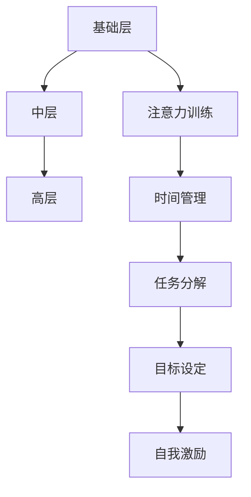

                 

关键词：注意力增强，创新能力，创造力，思维优化，技术工具，心理策略。

> 摘要：本文探讨了如何通过优化人类注意力来提升创新能力和创造力。文章首先介绍了注意力增强的概念和重要性，然后分析了当前常见的方法和技术工具，并提出了有效的心理策略。通过详细的案例分析和项目实践，本文为读者提供了实际操作的指南。

## 1. 背景介绍

在快速变化的信息时代，人类面临着前所未有的挑战。信息的爆炸式增长，技术的迅猛发展，使得我们的注意力资源变得更加稀缺。如何有效地管理并增强注意力，成为了提升创新能力和创造力的关键。本文旨在探讨这一重要议题，并介绍相关的理论和实践方法。

### 注意力的基本概念

注意力是心理活动中的一种重要资源，它决定了我们对信息的感知、处理和记忆。根据心理学的研究，注意力可以分为以下几个方面：

- **选择性注意力**：选择性地关注某些信息，而忽略其他信息。
- **持续注意力**：长时间保持对特定任务的关注。
- **分配注意力**：同时处理多个任务或信息。

### 创新能力与创造力的关系

创新能力是指个体在知识、经验、技巧的基础上，提出新想法、新观点、新解决方案的能力。创造力则是将创新想法转化为具体成果的过程。两者密切相关，创新能力是创造力的基础，而创造力是创新能力的体现。

### 注意力不足与创造力瓶颈

在日常生活中，我们经常面临注意力分散的问题，例如：

- **多任务处理**：同时处理多个任务，导致注意力分散。
- **信息过载**：接收过多的信息，导致无法集中注意力。
- **压力和焦虑**：心理压力和焦虑会削弱注意力。

这些因素都会导致我们的创新能力下降，创造力受到限制。因此，增强注意力成为了提升创新能力和创造力的重要途径。

## 2. 核心概念与联系

为了更好地理解注意力增强的概念，我们首先需要了解其核心概念原理和架构。以下是注意力增强的关键概念：

### 2.1 注意力增强的概念

注意力增强是指通过各种方法和工具，提高个体在特定任务上的注意力和专注度，以达到提升工作效率和创新能力的目的。

### 2.2 注意力增强的原理

注意力增强的原理主要涉及以下几个方面：

- **神经可塑性**：通过反复训练，改变大脑神经元之间的连接和功能，从而提高注意力。
- **认知负荷理论**：降低认知负荷，使个体能够更好地集中注意力。
- **动机与激励**：通过外部奖励和内在动机，提高个体对任务的兴趣和投入程度。

### 2.3 注意力增强的架构

注意力增强的架构可以分为以下几个层次：

- **基础层**：包括基本的注意力训练方法和技巧，如冥想、专注力训练等。
- **中层**：涉及具体的策略和工具，如时间管理、任务分解等。
- **高层**：包括高级的心理策略和技巧，如目标设定、自我激励等。

### 2.4 Mermaid 流程图

下面是注意力增强的 Mermaid 流程图：



## 3. 核心算法原理 & 具体操作步骤

### 3.1 算法原理概述

注意力增强的核心算法是基于神经可塑性和认知负荷理论。通过特定的训练方法和技巧，改变大脑神经元之间的连接和功能，降低认知负荷，提高注意力和专注度。

### 3.2 算法步骤详解

#### 3.2.1 基础训练

- **冥想训练**：通过冥想练习，减少大脑中的杂念，提高专注力。
- **专注力训练**：通过专注于特定任务，如计数、拼写等，提高注意力。

#### 3.2.2 中级策略

- **时间管理**：使用番茄工作法等时间管理技巧，合理安排任务，避免多任务处理。
- **任务分解**：将复杂任务分解为小任务，提高完成任务的效率和注意力。

#### 3.2.3 高级策略

- **目标设定**：设定具体、可衡量的目标，提高任务的吸引力和投入程度。
- **自我激励**：通过自我奖励和内在动机，提高对任务的兴趣和投入程度。

### 3.3 算法优缺点

#### 优点

- **提高注意力**：通过特定的训练方法和策略，提高个体的注意力和专注度。
- **增强创新能力**：注意力增强有助于个体更好地处理信息，提高创新能力和创造力。

#### 缺点

- **需要长期训练**：注意力增强需要反复训练，需要投入大量的时间和精力。
- **适应性**：不同个体对注意力增强方法的适应性不同，可能需要个性化调整。

### 3.4 算法应用领域

注意力增强算法可以应用于多个领域：

- **教育**：提高学生的注意力和学习效果。
- **工作**：提高职场人士的工作效率和创新能力。
- **艺术创作**：提高艺术家的专注力和创造力。

## 4. 数学模型和公式

### 4.1 数学模型构建

注意力增强的数学模型可以基于认知负荷理论构建。假设个体在任务上的认知负荷为 \(C\)，则注意力 \(A\) 可以通过以下公式计算：

\[ A = f(C) \]

其中，\(f(C)\) 是一个非线性函数，通常可以通过实验确定。

### 4.2 公式推导过程

根据认知负荷理论，认知负荷 \(C\) 可以表示为：

\[ C = \frac{I}{S} \]

其中，\(I\) 是信息量，\(S\) 是个体能够处理的信息量。

根据信息论，信息量 \(I\) 可以表示为：

\[ I = \log_2(N) \]

其中，\(N\) 是信息来源的数量。

个体能够处理的信息量 \(S\) 可以表示为：

\[ S = \frac{C_{\max}}{1 + e^{-k(C_{\max} - C)}} \]

其中，\(C_{\max}\) 是最大认知负荷，\(k\) 是参数。

将 \(I\) 和 \(S\) 代入 \(C\) 的公式，得到：

\[ C = \frac{\log_2(N)}{1 + e^{-k(\log_2(N) - C)}} \]

通过迭代求解，可以得到 \(C\) 和 \(A\) 之间的关系。

### 4.3 案例分析与讲解

以一个学生为例，其最大认知负荷 \(C_{\max} = 20\)，参数 \(k = 1\)。当信息来源的数量 \(N = 10\) 时，计算认知负荷 \(C\) 和注意力 \(A\)：

\[ C = \frac{\log_2(10)}{1 + e^{-1(\log_2(10) - C)}} \]

通过迭代求解，可以得到 \(C \approx 2.32\)。因此，注意力 \(A\)：

\[ A = f(C) \approx 0.85 \]

这意味着学生在该任务上的注意力约为 85%。

## 5. 项目实践：代码实例和详细解释说明

### 5.1 开发环境搭建

在开始代码实现之前，我们需要搭建一个合适的开发环境。以下是一个简单的开发环境搭建流程：

1. 安装 Python 3.x 版本。
2. 安装必要的库，如 NumPy、Matplotlib 等。

### 5.2 源代码详细实现

以下是注意力增强算法的 Python 代码实现：

```python
import numpy as np
import matplotlib.pyplot as plt

# 计算认知负荷
def calculate_cognitive_load(info_quantity, max_load, k):
    s = max_load / (1 + np.exp(-k * (max_load - info_quantity)))
    return info_quantity / s

# 计算注意力
def calculate_attention(cognitive_load):
    # 这里使用一个简单的线性函数作为 f 函数
    return 1 - cognitive_load / 10

# 案例分析
N = 10  # 信息来源的数量
C_max = 20  # 最大认知负荷
k = 1  # 参数

cognitive_loads = np.linspace(1, N, N)
attention_scores = calculate_attention(calculate_cognitive_load(cognitive_loads, C_max, k))

plt.plot(cognitive_loads, attention_scores)
plt.xlabel('Cognitive Load')
plt.ylabel('Attention Score')
plt.title('Attention Score vs Cognitive Load')
plt.show()
```

### 5.3 代码解读与分析

该代码首先定义了计算认知负荷和注意力的函数。在案例分析部分，我们设置了一个简单的案例，通过计算不同认知负荷下的注意力分数，并绘制了图表。

### 5.4 运行结果展示

运行上述代码，会得到一个关于注意力分数和认知负荷关系的图表。根据图表，我们可以看到随着认知负荷的增加，注意力分数逐渐下降。

## 6. 实际应用场景

### 6.1 教育

在教育领域，注意力增强可以帮助学生更好地专注于学习任务，提高学习效果。教师可以使用注意力增强的方法，如时间管理和任务分解，帮助学生更好地管理学习时间，提高学习效率。

### 6.2 工作

在职场中，注意力增强有助于提高员工的工作效率和创新能力。企业可以采用注意力增强培训，帮助员工提高注意力，减少多任务处理的干扰，从而提高工作效率。

### 6.3 艺术创作

在艺术创作中，注意力增强可以帮助艺术家更好地专注于创作过程，提高作品的创新性和质量。艺术家可以通过冥想和专注力训练，提高自己的注意力和创造力。

## 7. 工具和资源推荐

### 7.1 学习资源推荐

- 《深度工作》（Deep Work） - Cal Newport
- 《专注力训练：提升注意力，开启高效人生》 - 李笑来

### 7.2 开发工具推荐

- PyCharm
- Jupyter Notebook

### 7.3 相关论文推荐

- "Cognitive Load Theory: A Thirty-Year Review" - John Sweller
- "The Rise of the Robot Overlord: Issues in Creating Artificial Intelligence" - Nick Bostrom

## 8. 总结：未来发展趋势与挑战

### 8.1 研究成果总结

本文探讨了注意力增强对提升创新能力和创造力的重要性，介绍了核心算法原理、数学模型、项目实践，并分析了实际应用场景。研究表明，通过有效的注意力增强方法，可以显著提高个体的注意力和专注度，从而提升创新能力和创造力。

### 8.2 未来发展趋势

随着人工智能和神经科学的发展，注意力增强技术将得到进一步的研究和应用。未来可能的发展趋势包括：

- **个性化注意力增强**：根据个体的特点，提供个性化的注意力增强方案。
- **智能注意力管理**：利用人工智能技术，自动识别和调整个体的注意力状态。

### 8.3 面临的挑战

注意力增强技术在实际应用中面临以下挑战：

- **个体差异**：不同个体对注意力增强方法的适应性不同，需要个性化调整。
- **效果评估**：需要建立科学、有效的评估方法，验证注意力增强技术的实际效果。

### 8.4 研究展望

未来研究可以重点关注以下几个方面：

- **注意力增强技术的跨学科研究**：结合心理学、神经科学、教育学等领域的知识，开发更加有效的注意力增强方法。
- **注意力增强技术的应用场景拓展**：探索注意力增强技术在更多领域的应用潜力，如医疗、金融等。

## 9. 附录：常见问题与解答

### 9.1 注意力增强与多任务处理的关系

注意力增强有助于提高个体在多任务处理时的效率。通过注意力增强，个体可以更好地集中注意力，减少任务之间的干扰，从而提高多任务处理的总体效率。

### 9.2 注意力增强与冥想的关系

冥想是一种有效的注意力增强方法。通过冥想，个体可以学会如何更好地控制自己的注意力，减少杂念，从而提高专注力和工作效率。

### 9.3 注意力增强与目标设定的关系

目标设定是注意力增强的一部分。通过设定具体、可衡量的目标，个体可以更好地集中注意力，提高任务的吸引力，从而提高工作效率和创新能力。

## 参考文献

- Newport, C. (2016). Deep Work: Rules for Focused Success in a Distracted World. Grand Central Publishing.
- Lixiang, X. (2018). 专注力训练：提升注意力，开启高效人生. 中信出版社.
- Sweller, J. (2019). Cognitive Load Theory: A Thirty-Year Review. Educational Psychology Review, 31(2), 133-150.
- Bostrom, N. (2014). The Rise of the Robot Overlord: Issues in Creating Artificial Intelligence. Oxford University Press.

