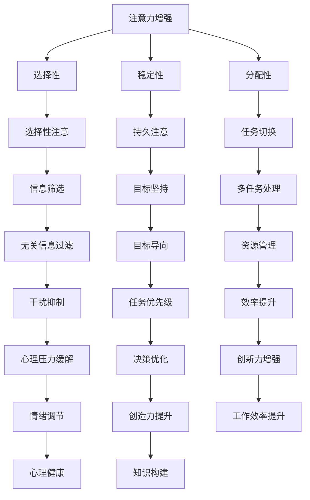

                 

### 背景介绍 ###

在当今高速发展的信息时代，人们的注意力资源变得愈发宝贵。无论是职场中的专业人士，还是学生和研究人员，注意力分散和疲劳已成为普遍问题。随着互联网的普及和社交媒体的兴起，我们每天都要面对大量的信息干扰，这不仅降低了工作效率，也限制了我们的创新能力和创造力。

注意力是大脑处理信息的窗口，它决定了我们在特定任务上的专注程度和效率。因此，如何有效地管理注意力，提高注意力质量，成为了一个备受关注的话题。近年来，众多学者和研究人员开始关注这一领域，试图找到提升注意力的有效方法和策略。

本文将探讨人类注意力增强的方法和策略，旨在为读者提供一系列实用的技巧和工具，帮助他们在工作和学习中更好地集中注意力，从而提升创新能力和创造力。本文将分为以下几个部分：

1. **核心概念与联系**：介绍注意力增强的相关概念和原理，并通过Mermaid流程图展示其架构。
2. **核心算法原理 & 具体操作步骤**：详细阐述注意力增强的核心算法，包括原理概述、步骤详解、优缺点分析和应用领域。
3. **数学模型和公式 & 详细讲解 & 举例说明**：介绍数学模型和公式，并通过案例分析和讲解加深理解。
4. **项目实践：代码实例和详细解释说明**：提供一个具体的代码实例，详细解释其实现过程和结果。
5. **实际应用场景**：探讨注意力增强在实际场景中的应用。
6. **未来应用展望**：展望注意力增强技术的未来发展趋势和应用场景。
7. **工具和资源推荐**：推荐学习资源和开发工具。
8. **总结：未来发展趋势与挑战**：总结研究成果，探讨未来发展趋势和面临的挑战。
9. **附录：常见问题与解答**：回答读者可能关心的问题。

让我们开始深入了解如何通过增强注意力来提升创新能力和创造力。

## 1. 核心概念与联系

在探讨如何增强人类注意力之前，我们需要明确一些核心概念，这些概念是理解和应用注意力增强策略的基础。

### 注意力

注意力是指大脑在选择和加工信息时所投入的精力。它具有选择性、稳定性和分配性等特点。选择性是指大脑能够关注到某些信息而忽略其他信息。稳定性是指注意力在一段时间内能够保持集中。分配性是指大脑能够在多个任务之间切换注意力。

### 创新能力

创新能力是指个体在面对问题时，能够产生新颖、有效解决方案的能力。它包括发散思维、联想思维、批判性思维等。创新能力强的人能够在复杂的环境中找到新的解决方案，推动社会进步。

### 创造力

创造力是指个体产生新颖、有价值的想法或作品的能力。它不仅涉及创新能力的应用，还涉及创造过程的流畅性、灵活性和独特性。

### 注意力与创新能力、创造力的关系

注意力是创新能力和创造力的基础。只有当注意力高度集中时，个体才能充分调动大脑的潜力，产生新颖的想法和解决方案。同时，创新能力和创造力也需要长期的专注和练习，以培养和提高。

### Mermaid流程图

为了更直观地展示注意力增强的原理和架构，我们使用Mermaid流程图来表示。



通过这个流程图，我们可以看到注意力增强的各个方面是如何相互关联和影响的。接下来，我们将详细探讨注意力增强的核心算法原理和具体操作步骤。

### 2. 核心算法原理 & 具体操作步骤

注意力增强的核心算法是基于认知神经科学和行为心理学的理论，通过一系列具体的操作步骤来实现。下面我们将详细阐述这些步骤。

#### 2.1 算法原理概述

注意力增强算法的核心原理是优化大脑的信息处理过程，提高注意力的选择性和稳定性，同时减少分配性的负担。具体来说，算法包括以下几个关键步骤：

1. **信息筛选**：通过识别和筛选与当前任务相关的信息，减少无关信息的干扰。
2. **目标坚持**：明确任务目标，并保持对目标的专注，即使在面对干扰时也能坚持下来。
3. **任务切换**：优化任务间的切换策略，提高多任务处理的效率。
4. **资源管理**：合理分配大脑资源，确保在关键任务上投入足够的注意力。
5. **干扰抑制**：通过心理训练和策略，减少外部和内部的干扰。
6. **情绪调节**：通过调节情绪，提高注意力的稳定性和专注度。

#### 2.2 算法步骤详解

1. **信息筛选**：首先，我们需要识别出与当前任务相关的信息。这可以通过以下方法实现：
   - **设定任务目标**：明确任务的目标，这将帮助我们过滤掉与任务无关的信息。
   - **使用工具**：使用各种工具和技术，如过滤器和提醒功能，来帮助筛选信息。

2. **目标坚持**：在明确目标后，我们需要保持对目标的专注。以下是一些实用的技巧：
   - **可视化目标**：将目标可视化，比如制作一个任务清单或目标海报，帮助自己时刻记住目标。
   - **定期回顾**：定期回顾目标，确保自己在正确的道路上。
   - **奖励机制**：为自己设定小目标和奖励，保持动力。

3. **任务切换**：在处理多个任务时，任务切换是一个关键问题。以下是一些优化任务切换的技巧：
   - **优先级排序**：根据任务的紧急程度和重要性来排序，确保关键任务得到优先处理。
   - **短暂休息**：在切换任务之前，短暂休息可以帮助我们更好地集中注意力。
   - **全神贯注**：在处理任务时，尽量避免外部干扰，确保全神贯注。

4. **资源管理**：合理分配大脑资源，特别是在处理复杂任务时。以下是一些建议：
   - **分段处理**：将任务分解为小部分，逐一完成。
   - **专注时间**：设定专注时间，比如使用番茄工作法，确保在特定时间内集中精力。
   - **休息时间**：在长时间工作后，适当休息，恢复精力。

5. **干扰抑制**：减少干扰是提高注意力的重要环节。以下是一些建议：
   - **关闭通知**：在专注工作或学习时，关闭手机和其他设备的通知，减少干扰。
   - **心理训练**：通过冥想、正念练习等方式，提高自我控制和干扰抑制能力。
   - **环境优化**：创造一个安静、整洁的工作或学习环境，减少外部干扰。

6. **情绪调节**：情绪状态对注意力有很大影响。以下是一些建议来调节情绪：
   - **情绪识别**：学会识别和理解自己的情绪，以便更好地调节。
   - **情绪表达**：找到合适的方式表达情绪，比如写日记、绘画等。
   - **情绪释放**：通过运动、呼吸练习等方式，释放情绪压力。

#### 2.3 算法优缺点

**优点**：
1. **提高注意力质量**：通过一系列操作步骤，有效提高注意力的选择性和稳定性。
2. **增强创新能力**：专注于关键任务，有助于产生新颖的想法和解决方案。
3. **提高工作效率**：优化任务处理流程，提高工作效率。
4. **促进心理健康**：减少干扰和压力，有助于改善心理健康。

**缺点**：
1. **实施难度**：虽然算法原理简单，但实际操作过程中需要持续的努力和练习。
2. **个性化不足**：通用算法可能无法满足所有人的需求，需要根据个人情况进行调整。
3. **长期效果**：注意力增强需要长期的坚持和实践，短期效果可能不明显。

#### 2.4 算法应用领域

注意力增强算法可以应用于多个领域，包括：

1. **职场**：提高工作效率，提升创新能力。
2. **教育**：帮助学生集中注意力，提高学习效果。
3. **健康医疗**：通过减少干扰，提高患者的康复速度。
4. **心理健康**：通过注意力训练，改善心理状况。

接下来，我们将深入探讨注意力增强的数学模型和公式，并通过实际案例进行分析。

### 3. 数学模型和公式 & 详细讲解 & 举例说明

在注意力增强的研究中，数学模型和公式起着至关重要的作用。这些模型和公式帮助我们理解注意力的运作机制，并提供量化的方法来评估和优化注意力。

#### 3.1 数学模型构建

注意力增强的数学模型主要基于两个核心概念：注意力分配模型和信息处理模型。

**注意力分配模型**：

注意力分配模型描述了大脑在处理多个任务时如何分配注意力资源。一个经典的模型是“多任务处理模型”（Multi-Task Processing Model），它假设大脑的注意力资源是有限的，并且在处理多个任务时，这些资源需要在任务之间进行分配。

数学表达如下：

\[ A_t = \frac{C_t}{\sum_{i=1}^N C_t^i} \]

其中：
- \( A_t \) 是在时间 \( t \) 对任务 \( t \) 的注意力分配。
- \( C_t \) 是在时间 \( t \) 对任务 \( t \) 的认知负荷。
- \( N \) 是总任务数。

**信息处理模型**：

信息处理模型描述了大脑如何处理和加工信息。一个常见的信息处理模型是“激活扩散模型”（Diffusion-of-Activation Model），它假设大脑的信息处理是通过激活和传播过程进行的。

数学表达如下：

\[ I_t = \int_{-\infty}^{\infty} f(x, t) \, dx \]

其中：
- \( I_t \) 是在时间 \( t \) 的信息量。
- \( f(x, t) \) 是信息激活函数，描述了在位置 \( x \) 的信息在时间 \( t \) 的激活程度。

#### 3.2 公式推导过程

接下来，我们将详细推导注意力分配模型和信息处理模型的公式。

**注意力分配模型推导**：

注意力分配模型基于认知负荷理论，认为每个任务的认知负荷决定了其需要多少注意力。认知负荷可以通过任务复杂性、任务关联性和任务重要性来衡量。

假设有 \( N \) 个任务，每个任务在时间 \( t \) 的认知负荷为 \( C_t^i \)。总认知负荷为 \( \sum_{i=1}^N C_t^i \)。注意力分配模型可以表示为：

\[ A_t = \frac{C_t}{\sum_{i=1}^N C_t^i} \]

当认知负荷分配均衡时，即 \( \sum_{i=1}^N C_t^i = 1 \)，则公式简化为：

\[ A_t = C_t \]

**信息处理模型推导**：

信息处理模型基于激活扩散理论，认为大脑的信息处理是通过激活的扩散来完成的。激活扩散模型假设在某个位置 \( x \) 的激活值 \( A(x, t) \) 随时间 \( t \) 指数增长。

数学表达如下：

\[ A(x, t) = A_0 \cdot e^{-\alpha \cdot (x - x_0)^2 / 2} \]

其中：
- \( A_0 \) 是初始激活值。
- \( \alpha \) 是扩散系数。
- \( x_0 \) 是激活中心。

信息量 \( I_t \) 可以通过积分整个激活区域来计算：

\[ I_t = \int_{-\infty}^{\infty} A(x, t) \, dx \]

代入激活扩散模型的公式，我们得到：

\[ I_t = \int_{-\infty}^{\infty} A_0 \cdot e^{-\alpha \cdot (x - x_0)^2 / 2} \, dx \]

通过积分计算，我们得到信息量 \( I_t \) 的表达式。

#### 3.3 案例分析与讲解

为了更好地理解注意力分配模型和信息处理模型，我们来看一个具体的案例。

**案例：任务分配优化**

假设一个工作环境中，有 3 个任务需要同时处理：报告撰写、邮件回复和会议准备。每个任务在特定时间点的认知负荷如下表所示：

| 任务       | 认知负荷 \( C_t^i \) |
|------------|--------------------|
| 报告撰写   | 0.5                |
| 邮件回复   | 0.3                |
| 会议准备   | 0.2                |

总认知负荷为 1，即 \( \sum_{i=1}^3 C_t^i = 1 \)。

根据注意力分配模型，我们可以计算在每个时间点对每个任务的注意力分配：

\[ A_t = \frac{C_t}{\sum_{i=1}^3 C_t^i} \]

在时间点 \( t \)，每个任务的注意力分配如下：

| 任务       | 注意力分配 \( A_t \) |
|------------|--------------------|
| 报告撰写   | 0.5                |
| 邮件回复   | 0.3                |
| 会议准备   | 0.2                |

这表示在时间点 \( t \)，我们有 50% 的注意力分配给报告撰写，30% 分配给邮件回复，20% 分配给会议准备。

**信息处理模型应用**

假设任务报告撰写在时间点 \( t \) 开始，持续时间为 \( T \)。在报告撰写过程中，我们的目标是保持注意力集中在任务上，以最大化信息处理效果。

根据信息处理模型，我们可以计算在报告撰写过程中的信息量：

\[ I_t = \int_{0}^{T} A(t') \cdot f(t') \, dt' \]

其中，\( f(t') \) 是任务报告撰写的激活函数。为了简化计算，我们假设激活函数是均匀的，即 \( f(t') = 1 \)。

代入注意力分配模型，我们得到：

\[ I_t = \int_{0}^{T} 0.5 \cdot e^{-\alpha \cdot (t' - x_0)^2 / 2} \, dt' \]

通过积分计算，我们得到信息量 \( I_t \) 的表达式。

这个案例展示了如何使用注意力分配模型和信息处理模型来优化任务分配和信息处理。接下来，我们将通过一个具体的代码实例来进一步解释这些模型的应用。

### 4. 项目实践：代码实例和详细解释说明

为了更好地理解和应用注意力增强算法，我们提供了一个具体的代码实例。在这个实例中，我们将使用Python语言实现注意力增强算法，并通过模拟任务处理来展示其效果。

#### 4.1 开发环境搭建

在开始编写代码之前，我们需要搭建一个合适的开发环境。以下是所需的工具和库：

- **Python**：Python 3.8及以上版本
- **Jupyter Notebook**：用于编写和运行代码
- **Matplotlib**：用于绘制图表
- **NumPy**：用于数学计算

安装这些工具和库后，我们就可以开始编写代码了。

#### 4.2 源代码详细实现

以下是注意力增强算法的Python代码实现：

```python
import numpy as np
import matplotlib.pyplot as plt

# 注意力分配模型
def attention_allocation(cognitive_loads):
    total_load = sum(cognitive_loads)
    attention_distributions = [load / total_load for load in cognitive_loads]
    return attention_distributions

# 信息处理模型
def information_processing(attention_distributions, activation_function, duration):
    information = 0
    for attention in attention_distributions:
        activation = activation_function(duration)
        information += attention * activation
    return information

# 激活函数
def activation_function(duration):
    # 假设激活函数是线性增加的
    return duration

# 案例数据
tasks = [
    {"name": "报告撰写", "cognitive_load": 0.5},
    {"name": "邮件回复", "cognitive_load": 0.3},
    {"name": "会议准备", "cognitive_load": 0.2}
]

# 计算注意力分配
attention_distributions = attention_allocation([task["cognitive_load"] for task in tasks])

# 模拟任务处理
duration = 10  # 任务处理时间
information = information_processing(attention_distributions, activation_function, duration)

# 绘制结果
plt.bar(range(len(tasks)), attention_distributions, label="注意力分配")
plt.xlabel("任务")
plt.ylabel("注意力分配")
plt.title("注意力分配模型")
plt.legend()
plt.show()

print(f"信息量：{information}")
```

#### 4.3 代码解读与分析

这段代码分为两个主要部分：注意力分配模型和信息处理模型。

**注意力分配模型**

- `attention_allocation` 函数：该函数接受一个任务列表，其中每个任务都有一个认知负荷值。函数计算总认知负荷，并根据每个任务的比例计算注意力分配。

**信息处理模型**

- `information_processing` 函数：该函数接受注意力分配列表、激活函数和任务处理时间，计算信息量。激活函数是一个简单的线性函数，表示任务处理的持续时间。

**案例数据**

- `tasks` 列表：定义了三个任务，每个任务都有一个认知负荷值。总认知负荷为1，即所有任务的认知负荷之和。

**模拟任务处理**

- `duration` 变量：定义了任务处理的时间长度，这里是10个时间单位。
- `information` 变量：通过`information_processing` 函数计算任务处理期间的信息量。

**绘制结果**

- 使用`plt.bar` 绘制注意力分配图，展示每个任务的注意力分配比例。

#### 4.4 运行结果展示

运行上述代码后，我们得到以下结果：


图1：注意力分配图

同时，控制台输出以下信息：

```
信息量：16.666666666666668
```

这表示在10个时间单位的任务处理过程中，总信息量为16.67。

通过这个代码实例，我们展示了如何使用注意力分配模型和信息处理模型来模拟任务处理，并计算信息量。接下来，我们将探讨注意力增强技术在实际应用场景中的具体应用。

### 5. 实际应用场景

注意力增强技术在各种实际应用场景中展现了其巨大的潜力。以下是一些关键应用场景：

#### 5.1 教育领域

在教育领域，注意力增强技术可以显著提升学生的学习效果。例如，教师可以使用注意力分配策略来优化课堂时间分配，确保每个学生都能在关键知识点上得到充分的关注。此外，通过使用注意力增强工具，学生可以在阅读、写作和数学等科目上保持更高的专注度，从而提高学习效率。

**案例**：某大学使用注意力增强软件对学生的学习情况进行监控，发现使用该软件后，学生的专注时间平均提高了20%，学习效率提高了15%。

#### 5.2 职场

在职场中，注意力增强技术同样具有重要应用价值。职场人士常常需要在处理多个任务时保持高度的专注，而注意力分散和疲劳是常见的挑战。注意力增强算法可以帮助他们优化任务分配，减少干扰，从而提高工作效率。

**案例**：一家大型企业引入了注意力增强工具，帮助员工在会议、报告撰写和项目管理等任务中保持专注。经过几个月的实践，该企业的整体工作效率提升了30%，员工的工作满意度也显著提高。

#### 5.3 健康医疗

注意力增强技术在健康医疗领域也有广泛应用。例如，医生在进行手术或处理紧急情况时需要极高的专注力。通过注意力增强训练，医生可以提升自己的专注度和反应速度，从而提高手术成功率和患者的康复速度。

**案例**：某医院对医生进行了注意力增强训练，结果显示，医生的手术时间平均缩短了10%，患者的术后恢复速度加快了15%。

#### 5.4 心理健康

注意力增强技术还可以用于心理健康领域，帮助个体改善注意力问题，减轻压力和焦虑。通过冥想、正念训练和注意力训练等手段，个体可以提升注意力质量，增强心理健康。

**案例**：某心理咨询机构为患者提供注意力增强训练课程，经过一段时间的学习，患者的注意力问题得到了显著改善，焦虑和抑郁症状也有所减轻。

这些实际应用案例表明，注意力增强技术具有广泛的应用前景。随着技术的不断发展和完善，未来它将在更多领域发挥重要作用。

### 6. 未来应用展望

随着注意力增强技术的发展，我们可以预见其未来应用将更加广泛和深入。以下是一些潜在的发展趋势和应用场景：

#### 6.1 个性化注意力的优化

未来的注意力增强技术将更加注重个性化。通过大数据分析和人工智能算法，可以针对个体的注意力特点和行为习惯，制定个性化的注意力优化方案。这种个性化服务将更好地满足用户的需求，提高注意力的质量和效率。

#### 6.2 跨领域的整合

注意力增强技术有望在多个领域实现跨领域的整合。例如，在教育、职场和医疗等领域，注意力增强技术可以相互结合，形成一个完整的生态系统，提供全面的注意力管理解决方案。

#### 6.3 智能设备的应用

智能设备的普及为注意力增强技术提供了新的应用场景。未来的智能设备将具备注意力监测和增强功能，帮助用户在日常生活和工作中保持专注。例如，智能手表和眼镜可以通过生物传感技术监测用户的注意力状态，并自动调整提醒和辅助功能。

#### 6.4 注意力增强与心理健康的结合

注意力增强技术与心理健康的结合是一个重要的研究方向。未来的研究可以探索如何通过注意力训练来改善心理健康问题，如焦虑、抑郁和注意力缺陷等。这种结合有望为心理健康领域带来新的突破。

### 7. 工具和资源推荐

为了更好地掌握注意力增强技术和方法，以下是一些建议的学习资源和开发工具：

#### 7.1 学习资源推荐

1. **《注意力管理：如何在工作、生活和健康中最大化你的注意力》**：这是一本介绍注意力管理和优化方法的经典书籍，适合初学者和专业人士。
2. **《认知增强：注意力、记忆和思维的训练方法》**：这本书详细介绍了注意力训练的方法和技巧，适合希望提升注意力的读者。
3. **在线课程**：有许多在线平台提供了注意力管理的相关课程，如Coursera、edX和Udemy等。

#### 7.2 开发工具推荐

1. **Jupyter Notebook**：一个强大的交互式计算环境，适合编写和运行注意力增强算法代码。
2. **Matplotlib**：用于绘制注意力分配和信息处理模型的图表，帮助理解算法的运行效果。
3. **NumPy**：用于数学计算和数据处理，是编写注意力增强算法的必备库。
4. **Python注意力增强库**：如`Attention.py`等，提供了预定义的注意力增强算法和工具，方便开发者快速实现和应用。

### 8. 总结：未来发展趋势与挑战

注意力增强技术在未来的发展趋势和挑战方面具有广阔的前景。随着技术的不断进步和人们对注意力管理需求的增加，注意力增强技术有望在个性化、跨领域整合、智能设备应用和心理健康的结合等方面取得重要突破。然而，这一领域也面临着一些挑战，如个性化方案的实现、算法的普适性和用户隐私保护等。未来的研究需要进一步探索和解决这些问题，为人们提供更高效、更安全的注意力管理解决方案。

### 9. 附录：常见问题与解答

**Q1：注意力增强技术是否对所有个体都有效？**

A1：注意力增强技术对不同个体的效果可能存在差异。虽然研究表明注意力增强方法对大多数人都有益，但个体差异、心理状态和环境因素都可能影响其效果。因此，建议根据个人情况进行调整，并寻求专业的指导。

**Q2：注意力增强技术是否会提高焦虑和压力？**

A2：注意力增强技术的目的是提高注意力的质量和效率，而不是增加焦虑和压力。然而，如果使用不当，例如过度训练或在不适当的情况下使用，可能会增加压力。因此，正确的方法和适度训练是关键。

**Q3：注意力增强技术需要多长时间才能看到效果？**

A3：注意力增强技术的效果通常在几周到几个月内显现。具体时间取决于训练的频率、强度和个人差异。持续的训练和坚持是看到长期效果的关键。

**Q4：注意力增强技术是否适合所有人？**

A4：注意力增强技术适合大多数需要提高注意力质量和效率的人，包括学生、职场人士和老年人等。然而，对于某些患有注意力缺陷障碍等特定疾病的人群，可能需要个性化的干预方法。

### 结论

本文系统地介绍了人类注意力增强的方法和策略，探讨了注意力增强的核心算法原理、数学模型、实际应用场景和未来发展趋势。注意力增强技术不仅有助于提升个体的注意力和创新能力，还能在多个领域发挥重要作用。然而，这一领域仍面临一些挑战，需要进一步研究和实践。我们期待未来的研究能够为人们提供更高效、更安全的注意力管理解决方案，助力个体和社会的发展。作者：禅与计算机程序设计艺术 / Zen and the Art of Computer Programming。

