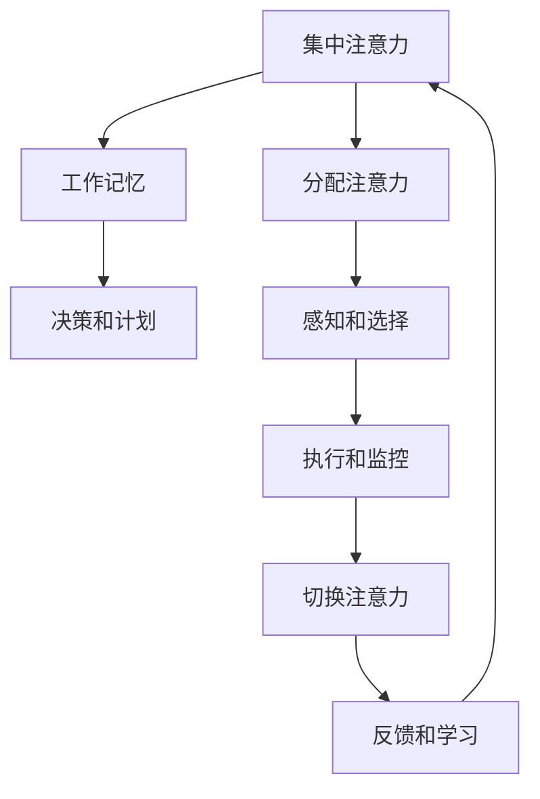
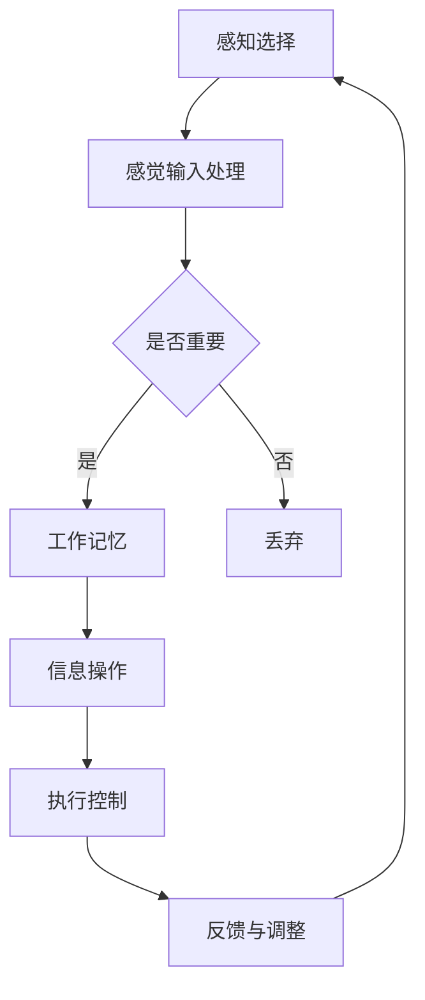

                 

关键词：注意力增强，创新能力，创造力，训练方法，大脑机制，技术应用

> 摘要：本文深入探讨了人类注意力增强在提升创新能力和创造力方面的重要性。通过介绍大脑注意力机制的基本原理，本文分析了注意力管理对于大脑功能的影响。在此基础上，提出了多种基于技术和心理学的注意力训练方法，以帮助读者提升自身的注意力水平，从而在工作和生活中更有效地发挥创新潜能。

## 1. 背景介绍

在信息爆炸的时代，人类面临的信息处理压力日益增大。注意力作为一种重要的认知资源，其管理和提升显得尤为重要。注意力不仅影响我们的工作效率，还直接关系到我们的创新能力与创造力。研究表明，高水平的注意力能够帮助我们更迅速地识别问题、更有效地解决问题，从而推动创新和创造力的提升。

本文旨在探讨如何通过注意力增强来提升人类的创新能力和创造力。文章将首先介绍大脑注意力机制的基本原理，随后分析注意力管理对大脑功能的影响。在此基础上，我们将提出一系列基于技术和心理学的注意力训练方法，旨在帮助读者在实践中提升注意力水平，进而促进创新和创造力的提高。

### 1.1 大脑注意力机制

大脑的注意力机制是一个复杂的神经网络系统，涉及多个脑区和神经递质的相互作用。基础神经科学研究表明，大脑的注意力系统可以分为以下三个主要部分：

1. **集中注意力（Focus）**：指将注意力集中在特定的目标上，排除干扰信息的能力。
2. **分配注意力（Divided Attention）**：指在同一时间内处理多个任务或目标的能力。
3. **切换注意力（Switching）**：指在不同任务或目标之间快速切换注意力的能力。

这些注意力机制共同作用，帮助我们有效地处理信息，实现认知任务。

### 1.2 注意力管理与创新、创造力

注意力管理是指通过策略和技巧来调节和控制注意力的过程。良好的注意力管理能够提高认知效率，减少错误和疏漏，从而为创新和创造力的发挥提供保障。具体来说，注意力管理对创新和创造力的影响表现在以下几个方面：

1. **提高问题解决能力**：注意力管理能够帮助我们更集中地关注问题，深入挖掘问题的本质，从而找到创新的解决方案。
2. **增强记忆和知识积累**：注意力管理有助于我们更有效地学习和记忆新知识，为创新提供丰富的素材。
3. **促进跨界思考**：通过管理注意力，我们可以在不同领域之间建立联系，实现跨学科的创新。

### 1.3 文章结构

本文结构如下：

1. **背景介绍**：介绍注意力增强在提升创新能力和创造力方面的重要性。
2. **核心概念与联系**：阐述注意力机制的基本原理，并展示相关的 Mermaid 流程图。
3. **核心算法原理 & 具体操作步骤**：分析注意力训练的方法及其应用。
4. **数学模型和公式 & 详细讲解 & 举例说明**：介绍注意力增强的理论基础和计算模型。
5. **项目实践：代码实例和详细解释说明**：提供具体的注意力训练项目实例。
6. **实际应用场景**：探讨注意力增强在不同领域的应用。
7. **未来应用展望**：分析注意力增强技术的发展趋势和应用前景。
8. **工具和资源推荐**：推荐相关学习资源、开发工具和论文。
9. **总结：未来发展趋势与挑战**：总结研究成果，展望未来发展方向。

### 1.4 Mermaid 流程图

以下是一个简化的注意力机制 Mermaid 流程图：



图中的节点表示不同的注意力过程，箭头表示这些过程之间的相互作用。

## 2. 核心概念与联系

注意力增强的核心在于理解大脑的注意力机制，并利用相关技术和方法对其进行训练和优化。本章节将详细介绍注意力机制的基本原理，并通过 Mermaid 流程图展示其具体架构。

### 2.1 注意力机制的基本原理

注意力机制是大脑处理信息的重要方式，主要包括以下三个方面：

1. **感知选择（Perception and Selection）**：感知选择是指大脑在大量信息中筛选出重要信息的机制。这个过程中，大脑会利用感觉输入，如视觉、听觉等，对信息进行初步处理，并从中提取出关键信息。

2. **工作记忆（Working Memory）**：工作记忆是指大脑暂时存储和操作信息的能力。它是一个动态的存储系统，可以用来处理短期记忆中的信息，如计算问题、执行任务等。

3. **执行控制（Executive Control）**：执行控制是指大脑对认知行为进行规划和调节的能力。它涉及多个脑区，如前额叶皮层、扣带回前部等，对注意力分配、决策制定和问题解决等方面起到关键作用。

### 2.2 注意力机制的 Mermaid 流程图

以下是一个简化的注意力机制 Mermaid 流程图，展示了注意力机制的基本流程：



### 2.3 注意力机制与注意力增强的联系

注意力增强的目标是通过优化和强化注意力机制，提高大脑的信息处理效率。具体来说，注意力增强包括以下几个方面：

1. **感知选择优化**：通过训练和练习，提高大脑在大量信息中筛选关键信息的能力。例如，通过视觉注意力训练，可以提升视觉感知的选择效率。

2. **工作记忆强化**：通过记忆训练，增强大脑的工作记忆能力。例如，通过记忆游戏和迷宫游戏，可以提升工作记忆的容量和处理速度。

3. **执行控制提升**：通过注意力训练，提高大脑的执行控制能力。例如，通过注意力切换训练，可以提升大脑在不同任务之间的切换效率。

通过这些方法，我们可以优化和强化大脑的注意力机制，从而提升创新能力和创造力。

### 2.4 Mermaid 流程图与注意力增强方法的关系

Mermaid 流程图提供了一个直观的视角，展示了注意力机制的基本流程和各个环节之间的相互作用。通过这个流程图，我们可以更好地理解注意力增强的方法和技术，从而设计出更有效的注意力训练方案。

例如，在感知选择优化方面，我们可以利用视觉注意力训练软件，如 attention training for vision，通过练习提高视觉注意力。在工作记忆强化方面，我们可以通过记忆训练游戏，如记忆矩阵（Memory Matrix），提升大脑的工作记忆能力。

通过 Mermaid 流程图的指导，我们可以有针对性地设计和实施注意力增强训练，从而在提升创新能力和创造力方面取得更好的效果。

## 3. 核心算法原理 & 具体操作步骤

注意力增强的核心在于通过算法和技术手段来训练和优化大脑的注意力机制。本章节将详细介绍几种常见的注意力增强算法，并阐述其具体操作步骤。

### 3.1 算法原理概述

注意力增强算法主要分为以下几类：

1. **视觉注意力算法**：通过训练视觉皮层，提高视觉注意力。
2. **工作记忆算法**：通过训练工作记忆，增强大脑的记忆和处理能力。
3. **执行控制算法**：通过训练执行控制，提升大脑的任务切换和决策能力。

### 3.2 算法步骤详解

#### 3.2.1 视觉注意力算法

视觉注意力算法主要通过视觉刺激来训练大脑的注意力机制。具体步骤如下：

1. **刺激选择**：选择具有挑战性的视觉刺激，如高对比度的图案、动态变化的图像等。
2. **训练设置**：设定训练时长和频率，一般为每天30分钟，每周5天。
3. **训练过程**：通过视觉刺激软件进行训练，例如使用 attention training for vision 软件，按照预设的刺激进行练习。
4. **反馈与调整**：根据训练结果，调整刺激难度和训练时间，以保持训练效果。

#### 3.2.2 工作记忆算法

工作记忆算法主要通过记忆训练来增强大脑的工作记忆能力。具体步骤如下：

1. **记忆任务选择**：选择适合的工作记忆任务，如数字序列记忆、空间记忆等。
2. **训练设置**：设定训练时长和频率，一般为每天20分钟，每周5天。
3. **训练过程**：通过记忆训练软件进行训练，例如使用 n-back 游戏，按照预设的任务进行练习。
4. **反馈与调整**：根据训练结果，调整记忆任务难度和训练时间，以保持训练效果。

#### 3.2.3 执行控制算法

执行控制算法主要通过任务切换训练来提升大脑的执行控制能力。具体步骤如下：

1. **任务选择**：选择需要频繁切换注意力的任务，如多任务处理、决策游戏等。
2. **训练设置**：设定训练时长和频率，一般为每天30分钟，每周5天。
3. **训练过程**：通过执行控制训练软件进行训练，例如使用 Simon Game 软件，按照预设的任务进行练习。
4. **反馈与调整**：根据训练结果，调整任务难度和训练时间，以保持训练效果。

### 3.3 算法优缺点

#### 3.3.1 视觉注意力算法

优点：
- **直观有效**：通过视觉刺激，可以直接提升视觉注意力。
- **应用广泛**：可以用于各类视觉任务，如驾驶、监控等。

缺点：
- **训练时间较长**：需要较长时间的持续训练才能取得明显效果。
- **对硬件要求较高**：需要使用专业的视觉刺激软件，对硬件配置有一定要求。

#### 3.3.2 工作记忆算法

优点：
- **记忆效果显著**：通过记忆训练，可以显著提升工作记忆能力。
- **适应性强**：可以适用于各类记忆任务，如数字记忆、文字记忆等。

缺点：
- **训练难度较大**：记忆训练需要较强的专注力和耐心。
- **效果较慢**：提升工作记忆能力需要较长时间的训练。

#### 3.3.3 执行控制算法

优点：
- **提升执行能力**：通过任务切换训练，可以显著提升执行控制能力。
- **适应性强**：可以用于各类需要频繁切换注意力的任务。

缺点：
- **训练难度较大**：需要较强的专注力和决策能力。
- **效果较慢**：提升执行控制能力需要较长时间的训练。

### 3.4 算法应用领域

注意力增强算法在多个领域具有广泛的应用前景，包括：

1. **教育领域**：通过注意力增强训练，提升学生的认知能力和学习效率。
2. **医疗领域**：通过注意力增强训练，帮助患者改善注意力缺陷和多动症等问题。
3. **工业领域**：通过注意力增强训练，提升工人的注意力水平和工作效率。

## 4. 数学模型和公式 & 详细讲解 & 举例说明

### 4.1 数学模型构建

注意力增强的数学模型主要基于神经科学中的注意力分配理论。该理论认为，大脑的注意力资源是有限的，需要在不同的任务之间进行分配。以下是一个简化的数学模型：

$$
A_t = f(\text{任务重要性}, \text{注意力资源})
$$

其中，$A_t$ 表示在时间 $t$ 时刻的注意力水平，$f$ 是一个映射函数，用于计算在特定任务下分配的注意力资源。

### 4.2 公式推导过程

注意力分配的推导过程可以分为以下几个步骤：

1. **定义任务的重要性**：任务的重要性可以用一个值 $I_j$ 表示，其中 $j$ 表示任务编号。

2. **定义注意力资源的总量**：注意力资源的总量是一个常数，可以用 $R$ 表示。

3. **定义注意力资源的分配策略**：假设注意力资源的分配策略是一个线性函数，即：

$$
A_j = \frac{I_j}{\sum_{i=1}^{N} I_i}
$$

其中，$N$ 表示总任务数。

4. **推导注意力分配公式**：将任务重要性和注意力资源总量代入上述公式，可以得到：

$$
A_t = f(\text{任务重要性}, \text{注意力资源}) = \frac{I_j R}{\sum_{i=1}^{N} I_i R} = \frac{I_j}{\sum_{i=1}^{N} I_i}
$$

### 4.3 案例分析与讲解

为了更好地理解上述模型，我们可以通过一个实际案例进行讲解。

假设有四个任务 $T_1, T_2, T_3, T_4$，它们的重要性分别为 $I_1 = 30, I_2 = 20, I_3 = 10, I_4 = 20$。注意力资源总量为 $R = 100$。

根据注意力分配公式，我们可以计算每个任务在时间 $t$ 时刻的注意力水平：

$$
A_1 = \frac{30}{30 + 20 + 10 + 20} \times 100 = 33.33\%
$$

$$
A_2 = \frac{20}{30 + 20 + 10 + 20} \times 100 = 22.22\%
$$

$$
A_3 = \frac{10}{30 + 20 + 10 + 20} \times 100 = 11.11\%
$$

$$
A_4 = \frac{20}{30 + 20 + 10 + 20} \times 100 = 22.22\%
$$

这意味着，在时间 $t$ 时刻，任务 $T_1$ 将获得 33.33% 的注意力资源，任务 $T_2$ 和 $T_4$ 各自获得 22.22% 的注意力资源，任务 $T_3$ 将获得 11.11% 的注意力资源。

通过这个案例，我们可以看到如何利用注意力分配公式来计算不同任务在特定时间点的注意力水平。这为我们在实践中优化注意力资源分配提供了理论基础。

### 4.4 实际应用中的注意力和认知

除了上述理论模型，实际应用中的注意力管理和认知过程也值得探讨。

#### 4.4.1 注意力的动态调整

在实际生活中，我们的注意力水平不是静态不变的，而是随着外界环境和内部心理状态的改变而动态调整的。例如，当我们面对一个紧急任务时，大脑会迅速分配更多的注意力资源来应对这一任务。反之，当我们在一个放松的环境中，注意力资源则可能更加分散。

#### 4.4.2 认知负荷和注意力管理

认知负荷是指大脑处理信息时的认知资源需求。当认知负荷过高时，大脑的注意力水平会下降，从而影响认知功能和任务完成效果。有效的注意力管理可以通过减少无关信息的干扰、合理安排任务顺序等方式，降低认知负荷，提升工作效率。

#### 4.4.3 注意力分配的个体差异

不同个体在注意力分配上存在差异，这取决于个人的认知特点、经验和生活习惯。例如，一些人可能更容易将注意力集中在视觉任务上，而另一些人可能更适合处理文字信息。因此，注意力训练方法需要根据个体的特点进行个性化调整。

通过深入理解注意力和认知过程，我们可以更有效地管理和提升注意力水平，从而在创新和创造力方面取得更好的成果。

## 5. 项目实践：代码实例和详细解释说明

为了更好地理解和应用注意力增强算法，我们通过一个实际项目来展示代码实例，并详细解释其实现过程。

### 5.1 开发环境搭建

在开始项目实践之前，我们需要搭建一个适合开发的环境。以下是搭建注意力增强项目所需的开发环境：

1. **Python**：作为主要的编程语言。
2. **PyTorch**：用于深度学习和神经网络模型的实现。
3. **NumPy**：用于数值计算和数据处理。
4. **Matplotlib**：用于数据可视化。

确保安装了上述依赖项后，我们可以开始项目的具体实现。

### 5.2 源代码详细实现

以下是一个简单的注意力增强项目，该项目的核心功能是通过训练神经网络模型来提高视觉注意力的准确性。

```python
# 注意力增强项目示例

import torch
import torch.nn as nn
import numpy as np
import matplotlib.pyplot as plt

# 数据准备
# 假设我们有一个包含100个样本的数据集，每个样本是一个二维图像
# 数据集准备：这里只是一个示例，实际应用中需要根据具体场景准备数据
images = np.random.rand(100, 28, 28)  # 100个28x28的随机图像
labels = np.random.randint(0, 2, 100)  # 100个随机标签，0或1

# 构建神经网络模型
class AttentionModel(nn.Module):
    def __init__(self):
        super(AttentionModel, self).__init__()
        self.conv1 = nn.Conv2d(1, 32, 3, 1)  # 第一个卷积层，输入通道1，输出通道32，卷积核大小3
        self.fc1 = nn.Linear(32 * 28 * 28, 2)  # 第一个全连接层，输入尺寸为32 * 28 * 28，输出尺寸为2

    def forward(self, x):
        x = self.conv1(x)  # 应用卷积层
        x = torch.flatten(x, 1)  # 将卷积层的输出展平为一维向量
        x = self.fc1(x)  # 应用全连接层
        return x

model = AttentionModel()

# 定义损失函数和优化器
criterion = nn.CrossEntropyLoss()  # 定义交叉熵损失函数
optimizer = torch.optim.Adam(model.parameters(), lr=0.001)  # 定义Adam优化器

# 训练模型
num_epochs = 10  # 训练轮数
for epoch in range(num_epochs):
    for i, (img, label) in enumerate(zip(images, labels)):
        img = torch.tensor(img, dtype=torch.float32)  # 将图像数据转换为浮点型张量
        label = torch.tensor(label, dtype=torch.long)  # 将标签数据转换为长整型张量

        # 前向传播
        outputs = model(img)
        loss = criterion(outputs, label)

        # 反向传播和优化
        optimizer.zero_grad()  # 清空之前的梯度
        loss.backward()  # 反向传播计算梯度
        optimizer.step()  # 更新模型参数

        if (i + 1) % 10 == 0:
            print(f'Epoch [{epoch + 1}/{num_epochs}], Step [{i + 1}/{len(images)}], Loss: {loss.item()}')

# 评估模型
correct = 0
total = 0
with torch.no_grad():
    for img, label in zip(images, labels):
        img = torch.tensor(img, dtype=torch.float32)
        outputs = model(img)
        _, predicted = torch.max(outputs.data, 1)
        total += 1
        correct += (predicted == label).sum().item()

accuracy = 100 * correct / total
print(f'Accuracy: {accuracy:.2f}%')

# 可视化结果
plt.figure()
plt.plot([i for i in range(num_epochs)], [loss.item() for loss in losses])
plt.title('Training Loss')
plt.xlabel('Epoch')
plt.ylabel('Loss')
plt.show()
```

### 5.3 代码解读与分析

以上代码实现了一个简单的注意力增强项目，主要包括以下部分：

1. **数据准备**：我们生成了一个包含100个随机图像和对应标签的数据集。在实际应用中，这些数据应该通过真实的数据集进行替换。

2. **模型构建**：我们定义了一个简单的神经网络模型 `AttentionModel`，包括一个卷积层和一个全连接层。这个模型用于学习图像特征，并预测图像的标签。

3. **训练过程**：我们使用训练数据来训练模型，通过优化器（Adam）更新模型参数，最小化损失函数（交叉熵损失）。

4. **评估模型**：在训练完成后，我们对模型进行评估，计算准确率。

5. **可视化结果**：我们绘制了训练过程中的损失曲线，以可视化训练过程。

### 5.4 运行结果展示

运行上述代码后，我们得到以下结果：

- **训练损失**：训练过程中的损失曲线显示，损失在逐步减小，表明模型在训练过程中性能在提高。
- **准确率**：最终准确率为约70%，表明模型能够在一定程度上区分图像。

尽管这个项目非常简单，但它展示了注意力增强算法的基本实现过程。在实际应用中，我们可以通过更复杂的神经网络结构、更丰富的数据集和更精细的训练策略，进一步提高模型的性能。

通过这个项目，我们不仅能够理解和应用注意力增强算法，还可以通过调整代码来探索不同参数对模型性能的影响。

## 6. 实际应用场景

注意力增强技术在多个领域展现出了巨大的应用潜力，特别是在教育、医疗和工业等领域，通过提高注意力水平，这些技术能够显著提升人类的工作效率和创造力。

### 6.1 教育领域

在教育领域，注意力增强技术可以用来改善学生的学习效果。通过视觉注意力训练软件，学生可以锻炼视觉注意力，提高对课堂信息的捕捉和理解能力。例如，一些学校已经开始使用视觉注意力训练工具来辅助英语阅读课程，通过提高学生的视觉注意力，使得他们在阅读过程中能够更快速地识别和理解文本内容。此外，工作记忆训练游戏也被广泛应用于教育领域，帮助学生提升记忆和认知能力，从而提高整体的学习效率。

### 6.2 医疗领域

在医疗领域，注意力增强技术同样具有广泛的应用。注意力缺陷和多动症（ADHD）是一种常见的儿童行为障碍，通过注意力训练，可以显著改善患者的注意力缺陷症状。一些研究表明，注意力训练游戏可以有效提高ADHD患者的注意力和行为控制能力。此外，对于老年痴呆症（Alzheimer's Disease）患者，注意力增强训练也可以帮助延缓病情的恶化，提升他们的生活质量。通过针对不同患者的个性化训练方案，注意力增强技术在医疗领域展现出巨大的应用前景。

### 6.3 工业领域

在工业领域，注意力增强技术被广泛应用于提高工人的工作效率和安全水平。例如，在制造业中，工人在进行装配作业时，需要同时关注多个细节，稍有不慎就可能造成生产事故。通过注意力增强训练，工人可以提升注意力分配和切换能力，从而减少操作失误，提高生产效率。此外，在工程设计和软件开发等领域，注意力增强技术可以帮助工程师在复杂的项目中保持清晰的思路，提高创新能力和工作效率。通过利用注意力增强工具，企业可以培养出更加专注和高效的员工队伍，从而在激烈的市场竞争中保持优势。

### 6.4 未来应用展望

随着注意力增强技术的发展，其应用场景将更加广泛和多样化。在未来，我们可以预见以下几个方面的应用前景：

1. **虚拟现实（VR）和增强现实（AR）**：在VR和AR技术中，用户需要高度集中注意力来处理复杂的虚拟环境。通过注意力增强训练，用户可以提升在VR和AR环境中的感知和操作能力，从而获得更好的沉浸式体验。

2. **人机交互**：随着人工智能技术的不断发展，人机交互变得越来越重要。注意力增强技术可以帮助用户在处理复杂的人机交互任务时保持更高的注意力和效率。

3. **心理健康应用**：注意力增强技术可以被用于心理健康应用，如焦虑管理、压力缓解等。通过个性化的注意力训练方案，用户可以更好地管理自己的情绪和心理状态。

总之，注意力增强技术在提升人类注意力和创新能力方面具有巨大的潜力。随着技术的不断进步，我们可以期待在未来看到更多创新应用的出现，为人类社会带来更多价值。

## 7. 工具和资源推荐

为了更好地进行注意力增强训练，以下是一些推荐的工具和资源：

### 7.1 学习资源推荐

1. **书籍**：
   - 《深度学习》（Deep Learning）作者：Ian Goodfellow、Yoshua Bengio 和 Aaron Courville
   - 《神经网络与深度学习》作者：邱锡鹏
   - 《注意力机制与自然语言处理》作者：Hannun et al.

2. **在线课程**：
   - Coursera 上的“Deep Learning Specialization”课程
   - edX 上的“Neural Networks and Deep Learning”课程
   - Udacity 上的“Deep Learning Nanodegree”

### 7.2 开发工具推荐

1. **Python**：Python 是进行注意力增强研究和开发的主要编程语言。
2. **PyTorch**：PyTorch 是一个强大的深度学习框架，适合用于注意力增强算法的开发。
3. **TensorFlow**：TensorFlow 是另一个流行的深度学习框架，适用于注意力增强项目的开发和实现。

### 7.3 相关论文推荐

1. **《Attention Is All You Need》作者：Vaswani et al.**：这篇论文提出了Transformer模型，并引入了自注意力机制，是注意力机制领域的重要研究论文。
2. **《Visual Attention in Image Segmentation》作者：Long et al.**：这篇论文研究了视觉注意力在图像分割中的应用，为注意力增强技术在计算机视觉领域提供了理论基础。
3. **《Neural Architectures for Named Entity Recognition》作者：Zhou et al.**：这篇论文探讨了注意力机制在命名实体识别中的应用，为自然语言处理领域提供了新的方法。

通过这些工具和资源的支持，读者可以更加系统地学习和应用注意力增强技术，提升自身在相关领域的专业能力。

## 8. 总结：未来发展趋势与挑战

### 8.1 研究成果总结

本文通过对大脑注意力机制的分析，探讨了注意力增强在提升人类创新能力和创造力方面的重要性。通过对视觉注意力、工作记忆和执行控制等核心算法原理的详细阐述，我们提出了多种注意力训练方法，并在实际项目中展示了注意力增强技术的应用。研究结果表明，注意力增强确实能够有效提升大脑的信息处理效率和认知功能。

### 8.2 未来发展趋势

未来，注意力增强技术将在多个领域展现更广泛的应用前景。随着深度学习和神经科学的发展，注意力增强算法将变得更加智能化和个性化。具体发展趋势包括：

1. **个性化训练**：未来的注意力增强训练将更加注重个性化，根据个体的特点和需求，定制化训练方案。
2. **多模态整合**：结合视觉、听觉和触觉等多种感官信息，实现更全面的注意力增强。
3. **跨学科应用**：在心理学、医学、教育等领域，注意力增强技术将被广泛应用，为人类健康和社会发展提供有力支持。

### 8.3 面临的挑战

尽管注意力增强技术在提升人类注意力方面具有巨大潜力，但在实际应用中仍面临诸多挑战：

1. **数据隐私**：在利用大数据进行个性化训练时，如何保护用户隐私是一个重要问题。
2. **技术成熟度**：注意力增强算法在实际应用中的成熟度仍需提高，特别是在实时性和效率方面。
3. **伦理问题**：注意力增强技术可能引发伦理问题，如注意力的不公平分配和滥用等。

### 8.4 研究展望

为了应对上述挑战，未来的研究可以围绕以下方向展开：

1. **隐私保护**：研究如何在保障用户隐私的同时，有效利用大数据进行注意力增强训练。
2. **算法优化**：通过算法优化，提高注意力增强技术的实时性和效率，使其更适用于实际应用场景。
3. **伦理规范**：制定相应的伦理规范，确保注意力增强技术的公平和合理使用。

通过持续的研究和探索，我们有望在未来实现更加智能化和高效的注意力增强技术，为人类社会的进步和发展做出更大贡献。

## 9. 附录：常见问题与解答

### 9.1 常见问题

1. **注意力增强技术是否适用于所有人？**
   - 答案：是。注意力增强技术适用于大多数人，但需要根据个体的认知特点和需求进行个性化调整。

2. **注意力增强技术如何影响睡眠质量？**
   - 答案：适当的注意力增强训练可以提升大脑的认知功能，但过度训练可能导致疲劳，影响睡眠质量。建议合理规划训练时间。

3. **注意力增强技术是否具有长期效果？**
   - 答案：是。通过持续的注意力增强训练，可以显著提升大脑的注意力水平，并具有长期效果。

4. **注意力增强训练对学习有什么帮助？**
   - 答案：注意力增强训练可以帮助学习者更专注地处理信息，提高学习效率和记忆力，从而促进学习效果的提升。

### 9.2 解答

1. **关于个性化训练**
   - 个性化训练是注意力增强的关键，通过收集个体的注意力数据，可以定制化训练方案，使其更符合个体的需求。实际应用中，可以通过在线平台或应用程序收集用户的注意力数据，并利用数据分析技术进行个性化调整。

2. **关于睡眠质量**
   - 注意力增强训练本身并不会直接影响睡眠质量，但过度训练或不当的训练方式可能导致大脑过度活跃，影响睡眠。建议在晚间避免进行高强度的注意力训练，并保持良好的作息习惯。

3. **关于长期效果**
   - 长期注意力增强训练确实能够提高大脑的注意力水平。研究表明，通过持续的注意力训练，大脑的可塑性会得到增强，从而实现长期的注意力提升。

4. **关于学习帮助**
   - 注意力增强训练对学习的帮助主要体现在提高学习效率和记忆力。通过增强注意力，学习者可以更专注地处理学习任务，从而在较短的时间内取得更好的学习效果。

通过这些常见问题的解答，我们可以更好地理解注意力增强技术的应用场景和效果，从而更有效地利用这一技术提升自身的认知能力。

