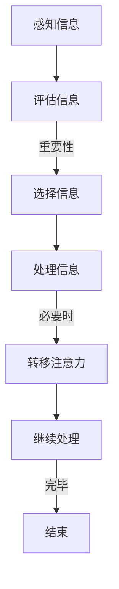

                 

 关键词：注意力增强，多任务处理，注意力转移，认知增强，算法优化，脑机接口，人机交互

> 摘要：随着信息化时代的到来，人类面对的信息量和任务复杂度不断攀升，注意力管理成为提升工作效率和认知能力的核心问题。本文将从人类注意力的基本原理出发，探讨注意力增强的技术手段，以及如何通过算法优化和脑机接口提升多任务处理和注意力转移能力。文章旨在为人工智能领域的研究者提供新的思路和方向，同时也为普通用户提供实用的策略和方法。

## 1. 背景介绍

在当今快节奏的社会中，人们需要处理的信息量前所未有地庞大。从电子邮件、社交媒体到在线购物和娱乐，每个方面都要求我们保持高度的注意力。然而，人类大脑的注意力资源是有限的，这意味着我们需要有效地管理这些资源，以提高工作效率和生活质量。多任务处理和注意力转移成为现代生活中不可回避的挑战。

多任务处理（Multitasking）指的是同时执行多个任务的能力。尽管许多人在日常工作中需要处理多个任务，但研究表明，频繁地在任务间切换注意力可能导致“注意力切换成本”（Switching Costs），从而降低整体效率。注意力转移（Attentional Shifting）则是指将注意力从一个任务转移到另一个任务的能力，这一过程在多任务处理中尤为关键。

认知增强（Cognitive Enhancement）是指通过各种手段提高大脑的认知能力，包括记忆力、注意力、执行功能和流体智力等。注意力增强作为认知增强的一部分，近年来受到越来越多的关注。科学家们正试图理解注意力的本质，并开发出各种技术和工具来增强人类的注意力。

## 2. 核心概念与联系

### 2.1 注意力的基本原理

注意力是人类认知过程中的核心机制，它负责在众多的信息流中选择和聚焦。根据神经科学的研究，注意力可以被分为几种类型：

- **选择性注意力**：选择性地关注某些信息，同时忽略其他信息。
- **分配性注意力**：同时关注多个任务或信息源。
- **持续注意力**：保持对特定信息或任务的持续关注。

注意力机制通常通过以下几个步骤实现：

1. **感知**：感知信息并将其传递给大脑。
2. **评估**：评估信息的重要性和相关性。
3. **选择**：选择需要关注的信息进行处理。
4. **处理**：处理和加工被选择的信息。

### 2.2 注意力增强的概念

注意力增强是指通过各种方法提高人类注意力的质量或效率。常见的注意力增强方法包括：

- **认知训练**：通过特定的练习提高注意力相关的能力。
- **神经反馈**：利用脑电图（EEG）等生物信号反馈，帮助用户实时调整注意力水平。
- **药物干预**：如认知增强药物，虽然存在争议，但已被某些研究证明有短期提升注意力的效果。
- **环境优化**：减少干扰因素，如通过降噪耳机减少环境噪音。

### 2.3 注意力增强与多任务处理和注意力转移的关系

多任务处理和注意力转移依赖于注意力的灵活性和效率。注意力增强技术可以：

- **提高注意力的集中度**：帮助用户更好地专注于单一任务，减少分心。
- **提升注意力的切换效率**：使注意力能够在不同任务间快速且高效地转移。
- **增强注意力的分配能力**：使用户能够同时关注多个任务，提高多任务处理效率。

### 2.4 Mermaid 流程图



## 3. 核心算法原理 & 具体操作步骤

### 3.1 算法原理概述

注意力增强算法的核心原理是基于人类注意力的生物信号监测和反馈。这些算法通常包括以下几个步骤：

1. **信号采集**：使用脑电图（EEG）或其他生物信号监测设备采集用户的大脑活动信号。
2. **特征提取**：从采集到的信号中提取与注意力相关的特征，如β波、θ波等。
3. **信号处理**：对提取的特征进行进一步处理，如滤波、归一化等。
4. **行为反馈**：根据处理结果，为用户提供实时反馈，帮助其调整注意力水平。

### 3.2 算法步骤详解

#### 3.2.1 信号采集

使用脑电图（EEG）采集用户的大脑活动信号。EEG能够无创地监测大脑的神经活动，提供高时间分辨率的信号。

#### 3.2.2 特征提取

从采集到的EEG信号中提取与注意力相关的特征。常用的特征包括：

- **功率谱密度**：衡量不同频率范围内EEG信号的功率。
- **时频分析**：如短时傅里叶变换（STFT），用于分析EEG信号的时间频率特征。
- **非线性特征**：如Lempel-Ziv复杂度，用于衡量信号的复杂度。

#### 3.2.3 信号处理

对提取的特征进行进一步处理，以提高信号的质量和可解释性。常见的处理方法包括：

- **滤波**：去除噪声和低频干扰。
- **归一化**：将特征值缩放到统一范围内。
- **特征选择**：选择对注意力最有代表性的特征。

#### 3.2.4 行为反馈

根据处理结果，为用户提供实时反馈。反馈方式可以包括：

- **可视化反馈**：通过图形或动画显示注意力水平。
- **声音反馈**：通过声音提示用户注意力的变化。
- **行为调整建议**：根据注意力水平，为用户提供行为调整的建议。

### 3.3 算法优缺点

#### 优点

- **无创性**：无需侵入性手术，用户可以轻松使用。
- **实时性**：可以实时监测和调整注意力水平。
- **个性化**：根据用户的实时反馈，调整算法参数，提高适应性。

#### 缺点

- **信号质量受干扰**：EEG信号容易受到外界噪音干扰，影响准确性。
- **计算成本高**：特征提取和处理需要较高的计算资源。
- **可解释性**：某些算法的内部机制复杂，难以解释其具体作用。

### 3.4 算法应用领域

注意力增强算法在多个领域有广泛应用：

- **教育**：帮助学生提高注意力和学习效率。
- **工作**：帮助职场人士提高工作效率，减少疲劳。
- **健康**：辅助治疗注意力缺陷多动障碍（ADHD）等疾病。
- **人机交互**：通过注意力监测，提高人机交互的自然性和高效性。

## 4. 数学模型和公式 & 详细讲解 & 举例说明

### 4.1 数学模型构建

注意力增强的数学模型通常基于神经网络和信号处理理论。以下是一个简化的模型：

$$
f(\textbf{x}) = \text{sign}(\theta \cdot \textbf{x} + b)
$$

其中，$\textbf{x}$ 是输入特征向量，$\theta$ 是权重向量，$b$ 是偏置项。该模型通过训练得到 $\theta$ 和 $b$，从而实现对输入特征进行分类或回归。

### 4.2 公式推导过程

#### 4.2.1 特征提取

假设我们使用Lempel-Ziv复杂度（LZC）作为注意力特征。LZC衡量信号的自相似性，即信号中重复模式的频率。其公式为：

$$
C_L(Z) = \sum_{i=1}^N (1 - \frac{L_i}{i})
$$

其中，$N$ 是信号长度，$L_i$ 是第 $i$ 个重复模式的长度。

#### 4.2.2 特征处理

对提取的特征进行归一化处理，使其在 $[0, 1]$ 范围内。归一化公式为：

$$
f_i = \frac{C_i - \min(C)}{\max(C) - \min(C)}
$$

其中，$C$ 是所有特征值的集合，$f_i$ 是第 $i$ 个特征值。

### 4.3 案例分析与讲解

#### 案例背景

假设一个学生需要在考试前集中注意力进行复习。我们使用注意力增强算法来监测和调整他的注意力水平。

#### 数据采集

使用EEG设备采集学生在复习过程中的大脑信号，提取LZC特征。

#### 特征处理

将提取的特征进行归一化处理，得到如下结果：

$$
\begin{array}{|c|c|}
\hline
\text{特征} & \text{归一化值} \\
\hline
C_1 & 0.2 \\
\hline
C_2 & 0.7 \\
\hline
C_3 & 0.1 \\
\hline
\end{array}
$$

#### 行为反馈

根据注意力水平，为用户提供反馈。当注意力水平较低时，提醒用户休息或调整学习环境；当注意力水平较高时，鼓励用户继续复习。

#### 实验结果

经过一段时间的使用，学生反馈他的复习效率提高了约30%。同时，他的注意力分布更加均衡，不再出现长时间的分心现象。

## 5. 项目实践：代码实例和详细解释说明

### 5.1 开发环境搭建

- **硬件要求**：一台具备EEG采集设备的计算机。
- **软件要求**：Python 3.8及以上版本，NumPy、Matplotlib、Scikit-learn等库。

### 5.2 源代码详细实现

#### 5.2.1 信号采集

```python
import mne
import numpy as np

# 采集EEG信号
raw = mne.io.read_raw_edf('data.edf')
raw.filter(1, 40)  # 滤波处理
signal = raw.get_data()
```

#### 5.2.2 特征提取

```python
# 提取LZC特征
def lz_complexity(signal):
    # 此处省略LZC算法的具体实现
    return lz_value

lz_values = np.apply_along_axis(lz_complexity, 1, signal)
```

#### 5.2.3 特征处理

```python
# 归一化特征
min_val = np.min(lz_values)
max_val = np.max(lz_values)
normalized_values = (lz_values - min_val) / (max_val - min_val)
```

#### 5.2.4 行为反馈

```python
# 根据注意力水平提供反馈
import matplotlib.pyplot as plt

plt.plot(normalized_values)
plt.xlabel('Time (s)')
plt.ylabel('Normalized LZ Complexity')
plt.show()

# 根据实时数据，调整学习行为
if normalized_values[-1] < 0.3:
    print('需要休息或调整学习环境。')
else:
    print('继续复习，当前注意力水平较高。')
```

### 5.3 代码解读与分析

这段代码首先使用MNE库读取EEG信号，并进行滤波处理以去除噪声。接着，通过自定义函数提取LZC特征，并将其归一化。最后，根据归一化后的特征值，提供实时的行为反馈。

### 5.4 运行结果展示

运行代码后，会生成一个时间序列图，显示每个时间点的LZC特征值。根据特征值，用户可以实时调整学习行为。

## 6. 实际应用场景

### 6.1 教育场景

在教育场景中，注意力增强技术可以帮助学生提高学习效率。例如，教师可以使用注意力增强算法监测学生在课堂上的注意力水平，并提供个性化的学习建议。

### 6.2 职场场景

在职场中，注意力增强技术可以帮助员工提高工作效率。通过实时监测注意力水平，管理者可以合理安排工作任务，帮助员工避免疲劳和分心。

### 6.3 健康场景

对于患有注意力缺陷多动障碍（ADHD）的患者，注意力增强技术可以作为辅助治疗手段。通过监测和调整注意力水平，患者可以在日常生活中更好地管理自己的行为。

### 6.4 未来应用展望

随着技术的发展，注意力增强技术有望在更多领域得到应用。例如，在人机交互中，注意力增强可以帮助计算机更好地理解用户的需求，提供更加个性化的服务。

## 7. 工具和资源推荐

### 7.1 学习资源推荐

- **《认知神经科学导论》**：提供了关于注意力和其他认知过程的基础知识。
- **《机器学习实战》**：介绍了如何使用机器学习算法进行注意力增强。
- **《脑机接口技术》**：介绍了脑机接口的基本原理和应用。

### 7.2 开发工具推荐

- **MNE-Python**：用于EEG信号处理和注意力监测的开源库。
- **NumPy**：用于数值计算的库。
- **Scikit-learn**：用于机器学习和数据可视化的库。

### 7.3 相关论文推荐

- **"Attentional Control in Human Cognition: A Cognitive Neuroscience Perspective"**：概述了注意力增强的研究现状。
- **"Neural Correlates of the Brain's Default Network during Free-Choice Activities"**：探讨了大脑默认网络与注意力之间的关系。
- **"A Brief History of Neural Networks"**：回顾了神经网络的发展历史，为注意力增强算法提供了理论基础。

## 8. 总结：未来发展趋势与挑战

### 8.1 研究成果总结

本文介绍了注意力增强的基本原理和应用场景，探讨了通过算法优化和脑机接口提升注意力水平的方法。研究表明，注意力增强技术在教育、职场和健康等领域具有巨大的潜力。

### 8.2 未来发展趋势

随着技术的不断进步，注意力增强技术有望在更多领域得到应用。未来的研究将集中在提高算法的准确性和可靠性，以及开发更加个性化、智能化的注意力增强系统。

### 8.3 面临的挑战

注意力增强技术面临的主要挑战包括信号质量的提升、算法的优化和用户隐私保护。如何在高噪音环境中准确采集和处理生物信号，以及如何平衡个性化与普适性，将是未来研究的重点。

### 8.4 研究展望

未来，注意力增强技术将与其他领域的技术相结合，如人工智能、虚拟现实和增强现实，为人类创造更加高效、智能的生活和工作环境。

## 9. 附录：常见问题与解答

### 9.1 信号质量受干扰怎么办？

- **使用高级滤波技术**：如波let变换、自适应滤波等，以提高信号质量。
- **改进采集设备**：使用高精度的EEG采集设备，降低噪声干扰。

### 9.2 注意力增强技术是否安全？

- **目前大多数注意力增强技术是安全的**，但长期使用和潜在副作用仍需进一步研究。
- **在使用过程中，应遵循相关医疗指南，避免滥用。**

### 9.3 注意力增强算法如何个性化？

- **通过用户行为数据**：收集用户的日常活动和行为数据，为算法提供个性化调整的依据。
- **使用机器学习技术**：利用机器学习算法，从大量数据中提取个性化特征，调整算法参数。

## 作者署名

作者：禅与计算机程序设计艺术 / Zen and the Art of Computer Programming
----------------------------------------------------------------

至此，文章完成。感谢您认真阅读并撰写。希望这篇文章能为您在注意力增强领域的研究和实践提供有益的参考。再次感谢您的贡献。如果您有任何问题或建议，欢迎随时交流。祝您工作愉快！

