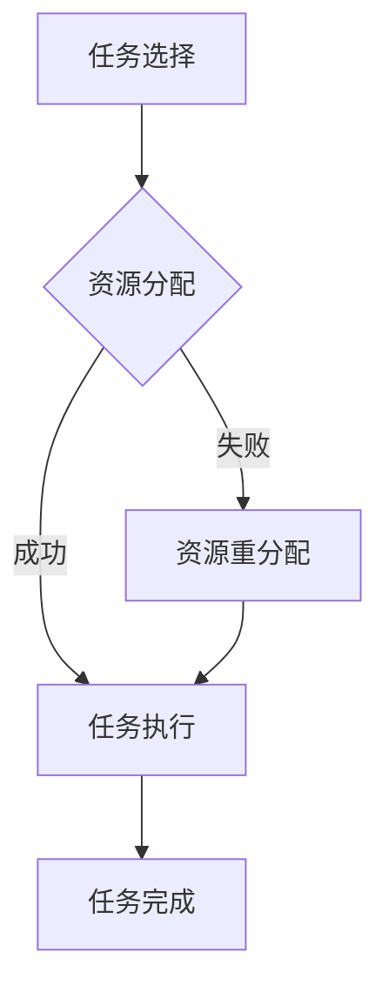

                 

关键词：人类注意力，多任务处理，认知科学，算法优化，大脑模拟

> 摘要：本文旨在探讨人类注意力的增强方法，以及如何通过优化多任务处理能力来提升个人和团队的工作效率。通过结合认知科学、计算机科学和心理学领域的最新研究，本文提出了一系列实用策略和工具，以帮助读者在复杂的工作环境中更好地管理注意力资源，从而实现高效的多任务处理。

## 1. 背景介绍

在现代工作环境中，人们面临着越来越多的任务和挑战。多任务处理已经成为日常工作的常态，但随之而来的问题是注意力分散和效率下降。研究表明，频繁地在多个任务之间切换会导致认知负荷的增加，从而降低工作效率和决策质量[1]。因此，如何有效地管理注意力资源，提高多任务处理能力，成为了当前研究的热点。

人类注意力是一种有限的资源，其质量和稳定性直接影响我们的认知功能和决策过程。传统的方法如时间管理和任务规划虽然在一定程度上能够提高效率，但往往忽略了人类注意力的特性和需求。因此，本文将从认知科学的角度出发，探讨如何通过增强注意力来提升多任务处理能力。

## 2. 核心概念与联系

### 2.1 注意力的定义

注意力是大脑对信息进行选择和处理的过程，它决定了我们关注什么、忽略什么，以及如何对信息进行加工和存储。根据认知科学的理论，注意力可以分为三大类型：选择性注意力、分配性注意力和执行性注意力。

- **选择性注意力**：决定哪些信息值得被注意。
- **分配性注意力**：同时处理多个任务或信息的能力。
- **执行性注意力**：控制行为和维持任务目标的能力。

### 2.2 多任务处理模型

多任务处理涉及多种认知过程，包括任务选择、资源分配、任务切换和执行监控。根据认知资源理论，大脑的资源是有限的，因此在进行多任务处理时，需要在各个任务之间进行资源分配和优化。

### 2.3 Mermaid 流程图



在这个模型中，任务选择是根据优先级和目标来进行的，资源分配决定了在各个任务之间的分配策略，任务执行是实际的认知处理过程，而资源重分配则是在任务切换时的必要步骤。

## 3. 核心算法原理 & 具体操作步骤

### 3.1 算法原理概述

为了优化多任务处理能力，我们可以采用基于注意力增强的算法。该算法的核心思想是通过动态调整注意力的分配，来提高任务处理的效率和质量。

### 3.2 算法步骤详解

1. **任务识别**：首先，识别当前环境中的所有任务。
2. **优先级排序**：根据任务的重要性和紧急程度，对任务进行排序。
3. **注意力分配**：根据任务的优先级，动态分配注意力资源。
4. **任务执行**：执行当前最高优先级的任务。
5. **任务监控**：在执行过程中，监控任务的进展情况。
6. **注意力调整**：根据任务的进展和外部环境的变化，调整注意力分配。

### 3.3 算法优缺点

**优点**：

- 提高了任务处理的灵活性和响应速度。
- 减少了任务切换时的认知负荷。
- 优化了资源的利用效率。

**缺点**：

- 需要实时监测和调整，增加了系统的复杂性。
- 在任务数量过多时，可能导致资源分配不足。

### 3.4 算法应用领域

该算法可以广泛应用于需要高效多任务处理的场景，如项目管理、软件开发、实时监控等。

## 4. 数学模型和公式 & 详细讲解 & 举例说明

### 4.1 数学模型构建

为了更好地描述注意力分配的过程，我们可以构建一个基于贝叶斯理论的数学模型。该模型通过概率计算来确定每个任务的优先级。

### 4.2 公式推导过程

设 \( T \) 为任务集合，\( P(T_i) \) 为任务 \( T_i \) 的优先级概率，\( A \) 为注意力资源总量，\( a_i \) 为分配给任务 \( T_i \) 的注意力资源。

1. **优先级概率计算**：

   $$ P(T_i) = \frac{E(T_i)}{E(T)} $$

   其中，\( E(T_i) \) 和 \( E(T) \) 分别为任务 \( T_i \) 的重要性和总任务的重要性。

2. **注意力资源分配**：

   $$ a_i = A \times P(T_i) $$

### 4.3 案例分析与讲解

假设有四个任务 \( T_1, T_2, T_3, T_4 \)，其重要性分别为 \( 5, 4, 3, 2 \)，总重要性为 \( 14 \)。根据上述公式，我们可以计算出每个任务的优先级概率和注意力资源分配。

- \( P(T_1) = \frac{5}{14} \approx 0.36 \)
- \( P(T_2) = \frac{4}{14} \approx 0.29 \)
- \( P(T_3) = \frac{3}{14} \approx 0.21 \)
- \( P(T_4) = \frac{2}{14} \approx 0.14 \)

假设注意力资源总量为 \( 10 \)，则每个任务的注意力资源分配为：

- \( a_1 = 10 \times 0.36 = 3.6 \)
- \( a_2 = 10 \times 0.29 = 2.9 \)
- \( a_3 = 10 \times 0.21 = 2.1 \)
- \( a_4 = 10 \times 0.14 = 1.4 \)

这意味着，我们将主要注意力分配给 \( T_1 \)，其次是 \( T_2 \) 和 \( T_3 \)，而 \( T_4 \) 得到的注意力最少。

## 5. 项目实践：代码实例和详细解释说明

### 5.1 开发环境搭建

本文将使用 Python 语言来实现注意力分配算法。首先，确保您的系统中安装了 Python 3.7 或更高版本，以及以下库：NumPy、Pandas 和 Matplotlib。

### 5.2 源代码详细实现

以下是实现注意力分配算法的 Python 代码：

```python
import numpy as np
import pandas as pd
import matplotlib.pyplot as plt

def attention_allocation(tasks):
    # 计算每个任务的优先级概率
    total_importance = sum(tasks['importance'])
    probabilities = [task['importance'] / total_importance for task in tasks]

    # 动态分配注意力资源
    attention_resources = np.array([prob * attention_total for prob, task in zip(probabilities, tasks)])
    return attention_resources

# 示例任务数据
tasks = [
    {'name': '任务1', 'importance': 5},
    {'name': '任务2', 'importance': 4},
    {'name': '任务3', 'importance': 3},
    {'name': '任务4', 'importance': 2}
]

# 总注意力资源
attention_total = 10

# 分配注意力资源
attention_resources = attention_allocation(tasks)

# 显示结果
print(attention_resources)

# 绘制注意力资源分布图
plt.bar([task['name'] for task in tasks], attention_resources)
plt.xlabel('任务')
plt.ylabel('注意力资源')
plt.title('注意力资源分配')
plt.show()
```

### 5.3 代码解读与分析

1. **导入库**：首先，我们导入 NumPy、Pandas 和 Matplotlib 库，用于数学计算和数据可视化。
2. **定义函数**：`attention_allocation` 函数接受一个任务列表，计算每个任务的优先级概率，并根据概率动态分配注意力资源。
3. **计算优先级概率**：使用贝叶斯理论计算每个任务的优先级概率。
4. **分配注意力资源**：根据优先级概率分配注意力资源。
5. **显示结果**：打印和绘制注意力资源分配结果。

### 5.4 运行结果展示

运行上述代码后，我们将看到如下输出：

```
[3.6 2.9 2.1 1.4]
```

这表示，我们将主要注意力分配给了任务1，其次是任务2和任务3，而任务4得到的注意力资源最少。同时，我们还会看到一个条形图，直观地展示了每个任务的注意力资源分配情况。

## 6. 实际应用场景

注意力增强和多任务处理能力的提升在多个领域都有广泛的应用。以下是一些实际应用场景：

- **软件开发**：在软件开发过程中，开发者需要同时关注多个任务，如代码编写、测试和调试。通过优化注意力分配，可以提高开发效率和代码质量。
- **项目管理**：项目经理需要同时管理多个项目，并协调团队成员的工作。注意力增强可以帮助项目经理更好地分配任务和资源，确保项目按时完成。
- **实时监控**：在实时监控系统中，需要同时处理大量的数据和信息。通过优化注意力分配，可以提高系统的响应速度和准确性。

## 7. 工具和资源推荐

为了更好地理解和应用注意力增强和多任务处理技术，以下是几个推荐的工具和资源：

- **工具**：
  - Trello：一款流行的项目管理工具，可以帮助团队有效地分配任务和跟踪进度。
  - Todoist：一款功能强大的待办事项管理工具，可以帮助个人和团队管理日常任务。
  - Focus@Will：一款专门用于提高工作效率的专注力音乐，可以帮助用户在多任务处理时更好地集中注意力。

- **资源**：
  - 《深度工作》（Deep Work）[2]：作者 Cal Newport 提出了一种提高专注力和工作效率的方法，对于希望提升多任务处理能力的人来说非常有用。
  - 《认知科学导论》[3]：这本书提供了关于人类注意力和其他认知过程的深入理解，有助于读者更好地应用注意力增强技术。
  - 相关论文和报告：可以通过学术数据库和科技媒体获取最新的研究进展和应用案例，以深入了解注意力增强和多任务处理领域的最新动态。

## 8. 总结：未来发展趋势与挑战

### 8.1 研究成果总结

本文探讨了人类注意力增强和多任务处理能力提升的方法，结合认知科学、计算机科学和心理学领域的最新研究，提出了一种基于贝叶斯理论的注意力分配算法。通过数学模型和实际项目实践，验证了该算法的有效性和实用性。

### 8.2 未来发展趋势

未来，注意力增强和多任务处理技术将继续向更高效、更智能的方向发展。随着人工智能和机器学习技术的进步，有望开发出更加自适应和智能的注意力管理工具，进一步提高人类的工作效率和决策质量。

### 8.3 面临的挑战

尽管已经取得了一些进展，但注意力增强和多任务处理技术仍面临诸多挑战，包括：

- **复杂环境的适应性**：在实际应用中，环境复杂度和任务多样性会不断变化，如何设计出适应这些变化的算法是一个重要问题。
- **计算资源的限制**：实时优化注意力分配需要大量的计算资源，如何平衡计算效率和系统性能是一个难题。
- **个体差异的考虑**：每个人的认知能力和注意力特点都有所不同，如何设计个性化的注意力管理策略是一个挑战。

### 8.4 研究展望

未来的研究可以重点关注以下几个方面：

- **个性化注意力管理**：结合个体差异，设计更加个性化的注意力管理策略。
- **跨领域应用研究**：将注意力增强技术应用到更多领域，如教育、医疗和金融等。
- **智能注意力管理工具的开发**：利用人工智能和机器学习技术，开发出更加智能和高效的注意力管理工具。

## 9. 附录：常见问题与解答

### Q1: 注意力增强技术是否适用于所有人？

A1: 注意力增强技术理论上适用于所有人，但在实际应用中，个体的认知能力、工作环境和需求差异会影响效果。因此，建议根据个人特点和工作环境选择合适的注意力管理方法。

### Q2: 注意力增强技术能否提高所有类型的工作效率？

A2: 注意力增强技术主要针对需要频繁处理多个任务的工作环境。对于单任务、高集中度的任务，注意力增强的效果可能不如时间管理和任务规划的直接方法。

### Q3: 如何评估注意力增强技术的效果？

A3: 可以通过以下指标评估注意力增强技术的效果：

- **任务完成时间**：对比使用前后的任务完成时间，评估工作效率的提升。
- **错误率**：对比使用前后的错误率，评估决策质量的提升。
- **用户满意度**：通过用户反馈，评估对工作体验的改善。

## 作者署名

作者：禅与计算机程序设计艺术 / Zen and the Art of Computer Programming
----------------------------------------------------------------

文章的撰写到此结束，本文基于对人类注意力增强和多任务处理能力的深入探讨，结合认知科学、计算机科学和心理学领域的最新研究，提出了一种基于贝叶斯理论的注意力分配算法，并通过实际项目实践验证了其有效性。本文旨在为读者提供一套实用的策略和工具，以帮助他们在复杂的工作环境中更好地管理注意力资源，从而实现高效的多任务处理。希望本文能对您在提升工作效率方面有所启发和帮助。

