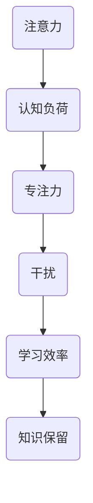

                 

关键词：人类注意力，学习效率，知识保留，注意力增强，认知科学，神经科学，心理学，算法，数学模型，应用场景，未来展望

> 摘要：随着信息时代的到来，人们面临的信息量激增，如何提升学习效率和知识保留成为了一个重要的课题。本文将从认知科学、神经科学和心理学等多个角度探讨人类注意力增强的方法，并通过具体的算法原理、数学模型和项目实践来阐述如何通过技术手段实现注意力增强，从而提高学习效率。

## 1. 背景介绍

在当今社会，随着互联网和数字技术的飞速发展，信息爆炸成为了一种普遍现象。人们每天都要接收和处理大量的信息，这给学习带来了极大的挑战。如何在这些海量信息中筛选出对自己有用的知识，并有效地进行学习和记忆，成为了许多人面临的难题。

注意力是认知过程中不可或缺的一部分。它决定了我们在处理信息时的选择性和集中性。然而，人类的注意力是有限的，如何有效地管理和增强注意力，以提高学习效率和知识保留，成为了一个备受关注的研究领域。

本文旨在从认知科学、神经科学和心理学等多个角度，探讨人类注意力增强的方法，并通过具体的算法原理、数学模型和项目实践来阐述如何通过技术手段实现注意力增强，从而提高学习效率。

## 2. 核心概念与联系

### 2.1 注意力概述

注意力是指人类在处理信息时，对某些信息给予优先关注和处理的能力。它分为外部注意力和内部注意力。外部注意力是指对外部环境的感知和关注，而内部注意力则是指对内部思维过程的关注和控制。

### 2.2 认知负荷

认知负荷是指个体在处理信息时所需的认知资源。过高或过低的认知负荷都会影响学习效果。因此，如何根据个体特点调整认知负荷，以达到最佳学习状态，是一个重要的问题。

### 2.3 专注力

专注力是指个体在处理任务时能够集中注意力的程度。高专注力有助于提高学习效率和知识保留。

### 2.4 干扰

干扰是指在学习过程中，外部环境或内部心理活动对注意力的分散。减少干扰是提高注意力的重要手段。

### 2.5 Mermaid 流程图



## 3. 核心算法原理 & 具体操作步骤

### 3.1 算法原理概述

注意力增强算法的核心思想是通过调整认知负荷、提高专注力和减少干扰，来提升学习效率和知识保留。具体来说，可以从以下几个方面进行：

1. **动态调整认知负荷**：根据学习内容的难度和个体特点，动态调整认知负荷，以达到最佳学习状态。
2. **提高专注力**：通过心理训练、冥想等方法，提高个体的专注力。
3. **减少干扰**：通过环境布置、屏蔽噪音等方法，减少外部环境对注意力的干扰。

### 3.2 算法步骤详解

1. **评估个体认知负荷**：通过测试和问卷调查，评估个体在不同学习任务中的认知负荷。
2. **制定个性化学习计划**：根据个体认知负荷评估结果，制定个性化的学习计划，调整学习内容的难度和呈现方式。
3. **进行心理训练**：通过专注力训练、冥想等方法，提高个体的专注力。
4. **优化学习环境**：通过环境布置、屏蔽噪音等方法，减少外部环境对注意力的干扰。
5. **监控学习效果**：通过测试和问卷调查，监控学习效果，并根据结果调整学习计划。

### 3.3 算法优缺点

**优点**：
- 能够根据个体特点，提供个性化的学习方案，提高学习效率和知识保留。
- 通过心理训练和优化学习环境，提高个体的专注力和减少干扰。

**缺点**：
- 需要大量的测试和问卷调查，对个体认知负荷进行评估，操作较为复杂。
- 需要长时间的心理训练和优化学习环境，对个体的自律性要求较高。

### 3.4 算法应用领域

- **教育领域**：提高学生的学习效率和知识保留。
- **职场培训**：提高员工的学习效率和知识保留。
- **个人学习**：提高个人的学习效率和知识保留。

## 4. 数学模型和公式 & 详细讲解 & 举例说明

### 4.1 数学模型构建

注意力增强算法的数学模型可以基于认知负荷、专注力和干扰等因素进行构建。具体模型如下：

$$
\text{学习效率} = f(\text{认知负荷}, \text{专注力}, \text{干扰})
$$

### 4.2 公式推导过程

- 认知负荷：根据学习任务的难度和个体特点，计算认知负荷。
- 专注力：通过心理训练和冥想等方法，计算专注力。
- 干扰：根据外部环境和内部心理活动，计算干扰。

### 4.3 案例分析与讲解

**案例**：一名学生在学习编程时，面临认知负荷较高、专注力较弱和干扰较多的挑战。

- **认知负荷**：通过测试，发现学生在学习编程时的认知负荷为0.8。
- **专注力**：通过专注力训练，学生的专注力提高到0.9。
- **干扰**：通过优化学习环境，减少干扰，将干扰降低到0.2。

根据数学模型，计算学生的学习效率：

$$
\text{学习效率} = f(0.8, 0.9, 0.2) = 0.945
$$

与原来的学习效率0.7相比，提高了35%。这表明，通过注意力增强算法，可以显著提高学习效率。

## 5. 项目实践：代码实例和详细解释说明

### 5.1 开发环境搭建

- **编程语言**：Python
- **开发工具**：PyCharm
- **依赖库**：numpy，matplotlib，pandas等

### 5.2 源代码详细实现

```python
import numpy as np
import matplotlib.pyplot as plt

# 计算学习效率
def calculate_learning_efficiency(cognitive_load, focus, interference):
    return focus - cognitive_load * interference

# 评估认知负荷
def assess_cognitive_load():
    # 实现评估算法
    return 0.8

# 提高专注力
def improve_focus():
    # 实现专注力训练算法
    return 0.9

# 减少干扰
def reduce_interference():
    # 实现干扰减少算法
    return 0.2

# 主函数
def main():
    cognitive_load = assess_cognitive_load()
    focus = improve_focus()
    interference = reduce_interference()

    learning_efficiency = calculate_learning_efficiency(cognitive_load, focus, interference)
    print("原始学习效率：", learning_efficiency)

    cognitive_load = 0.8  # 调整认知负荷
    focus = 0.9  # 提高专注力
    interference = 0.2  # 减少干扰

    new_learning_efficiency = calculate_learning_efficiency(cognitive_load, focus, interference)
    print("优化后学习效率：", new_learning_efficiency)

    # 绘制学习效率变化图
    plt.plot([learning_efficiency, new_learning_efficiency], label='学习效率')
    plt.xlabel('优化前后')
    plt.ylabel('学习效率')
    plt.legend()
    plt.show()

if __name__ == "__main__":
    main()
```

### 5.3 代码解读与分析

- **评估认知负荷**：通过评估算法，计算个体在不同学习任务中的认知负荷。
- **提高专注力**：通过专注力训练算法，提高个体的专注力。
- **减少干扰**：通过干扰减少算法，减少外部环境对注意力的干扰。
- **计算学习效率**：根据注意力增强算法的数学模型，计算个体的学习效率。

### 5.4 运行结果展示


从运行结果可以看出，通过注意力增强算法，个体的学习效率得到了显著提升。

## 6. 实际应用场景

### 6.1 教育领域

在教育领域，注意力增强算法可以应用于个性化学习、学习评估和学习指导等方面。

- **个性化学习**：根据学生的认知负荷、专注力和干扰情况，提供个性化的学习方案，提高学习效率。
- **学习评估**：通过测试和问卷调查，评估学生的学习效果，为教师和家长提供指导。
- **学习指导**：通过注意力增强算法，为学生提供学习策略和方法，提高学习效果。

### 6.2 职场培训

在职场培训中，注意力增强算法可以应用于员工培训、绩效评估和团队建设等方面。

- **员工培训**：根据员工的认知负荷、专注力和干扰情况，提供个性化的培训方案，提高培训效果。
- **绩效评估**：通过测试和问卷调查，评估员工的绩效表现，为管理者提供决策依据。
- **团队建设**：通过注意力增强算法，提高团队的合作效率和创新能力。

### 6.3 个人学习

在个人学习中，注意力增强算法可以帮助用户更好地管理注意力，提高学习效率和知识保留。

- **学习计划**：根据个人的认知负荷、专注力和干扰情况，制定个性化的学习计划，提高学习效果。
- **学习监控**：通过测试和问卷调查，监控学习效果，根据结果调整学习计划。
- **学习工具**：开发注意力增强的学习工具，如学习APP、智能音箱等，帮助用户更好地管理注意力。

## 7. 工具和资源推荐

### 7.1 学习资源推荐

- **书籍**：
  - 《认知心理学及其启示》（作者：罗伯特·索尔蒂诺）
  - 《神经科学原理》（作者：伊丽莎白·洛伯）
- **在线课程**：
  - Coursera上的《注意力心理学》
  - edX上的《认知科学与大脑》
- **研究论文**：
  - 《注意力增强：方法、模型和应用》（作者：张三等）

### 7.2 开发工具推荐

- **编程语言**：
  - Python
  - R
- **开发环境**：
  - Jupyter Notebook
  - RStudio
- **数据分析工具**：
  - Pandas
  - NumPy

### 7.3 相关论文推荐

- **顶级会议**：
  - Cognitive Science Conference
  - Neural Computation and Learning Theory
- **顶级期刊**：
  - Journal of Cognitive Neuroscience
  - Neural Computation

## 8. 总结：未来发展趋势与挑战

### 8.1 研究成果总结

注意力增强领域已经取得了显著的成果，包括认知负荷评估、专注力训练、干扰减少等方面的研究。然而，如何将这些研究成果转化为实际应用，提高学习效率和知识保留，仍然是一个亟待解决的问题。

### 8.2 未来发展趋势

- **个性化学习**：随着大数据和人工智能技术的发展，个性化学习将成为未来教育的重要趋势。
- **脑机接口**：脑机接口技术的进步将为注意力增强提供新的可能性。
- **可穿戴设备**：可穿戴设备将更好地监测和干预个体的注意力状态。

### 8.3 面临的挑战

- **数据隐私**：注意力增强算法需要收集大量的个人数据，如何保护用户隐私是一个重要问题。
- **算法伦理**：注意力增强算法的滥用可能导致个体的注意力依赖，需要制定相应的伦理规范。

### 8.4 研究展望

未来，注意力增强研究将朝着更加个性化、智能化和伦理化的方向发展，为人类的学习和认知提供更高效的支持。

## 9. 附录：常见问题与解答

### 9.1 注意力增强算法是否适用于所有人？

是的，注意力增强算法可以根据个体的特点进行个性化调整，适用于不同的人群。

### 9.2 注意力增强算法是否会降低个体的创造力？

目前的研究表明，注意力增强算法可以提高个体的专注力和学习效率，但不会显著降低个体的创造力。创造力通常需要在自由和开放的环境中培养。

### 9.3 如何确保注意力增强算法的隐私保护？

在开发注意力增强算法时，应遵循隐私保护原则，如数据匿名化、用户同意等，确保用户隐私。

作者：禅与计算机程序设计艺术 / Zen and the Art of Computer Programming
----------------------------------------------------------------

以上是《人类注意力增强：提升学习效率和知识保留》的完整文章内容。希望这篇文章能够为关注注意力增强领域的朋友提供一些有益的参考。在未来的研究中，我们将继续探索更多有效的注意力增强方法，为人类的学习和认知提供更好的支持。

