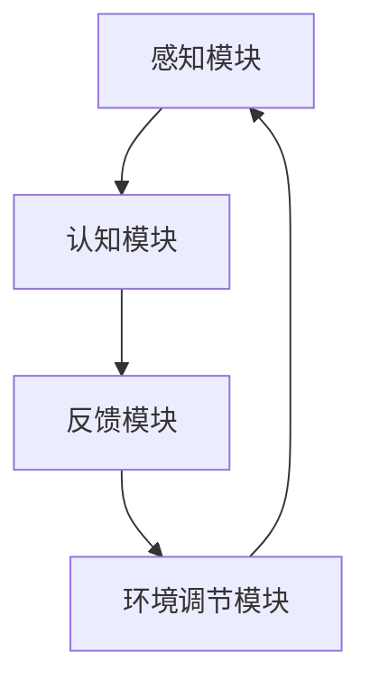

                 

关键词：注意力增强，学习效率，知识保留，认知科学，人脑模拟，技术工具

> 摘要：随着信息爆炸时代的到来，人类面临的知识负荷日益加重。注意力增强成为提升学习效率和知识保留的关键技术。本文探讨了注意力增强的基本原理，介绍了相关技术工具，并展望了未来发展方向。

## 1. 背景介绍

在当今这个信息爆炸的时代，人们每天都要处理海量的信息。如何有效地筛选、理解和记忆这些信息，成为学习、工作和生活的重要挑战。注意力是人类认知的核心过程之一，它决定了我们对于外界信息的处理效率和深度。然而，人类的注意力资源是有限的，如何在有限的时间内最大化地利用注意力资源，成为亟待解决的问题。

### 注意力与学习效率

注意力是指个体在某一特定时间对某些信息进行选择和处理的能力。在学习过程中，注意力直接关系到学习效率。良好的注意力可以帮助学习者聚焦关键信息，排除干扰，从而提高学习效果。然而，现实中人们往往面临注意力分散、疲劳等问题，导致学习效率低下。

### 知识保留与注意力

知识保留是指个体在学习和记忆过程中对信息进行编码、存储和回忆的能力。注意力的增强可以促进知识的编码和存储，提高记忆的深度和持久性。有效的注意力管理能够帮助学习者更好地组织知识结构，形成长期记忆。

### 人类注意力研究的现状

近年来，认知科学、心理学和神经科学领域对人类注意力进行了深入研究。研究表明，注意力不仅与大脑的特定区域有关，还受到个体情绪、动机、环境等多种因素的影响。目前，注意力增强的技术工具逐渐应用于教育、医疗、人机交互等领域，取得了显著成效。

## 2. 核心概念与联系

### 注意力增强的概念

注意力增强是指通过技术手段提升个体注意力的过程，旨在提高学习效率、工作绩效和生活质量。注意力增强技术主要包括认知训练、环境优化、技术工具辅助等方法。

### 注意力增强技术原理

注意力增强技术基于对人类注意力机制的深入研究，通过模拟和调节大脑的神经活动，提高个体注意力的集中度和持久性。具体原理包括：

- **大脑神经活动调节**：通过刺激大脑特定区域，调节神经递质的分泌，改善大脑功能。
- **环境优化**：通过改善学习和工作环境，减少干扰因素，提升注意力的集中度。
- **认知训练**：通过训练提高个体对特定信息的注意力和处理能力。

### 注意力增强与学习效率、知识保留的联系

注意力增强技术能够直接影响学习效率。通过提升注意力的集中度和持久性，学习者可以更好地筛选、理解和记忆关键信息，从而提高学习效果。同时，注意力增强技术还能够促进知识的编码和存储，提高记忆的深度和持久性，为知识保留提供有力支持。

### 注意力增强技术的架构

注意力增强技术通常包括以下几个关键模块：

- **感知模块**：识别和筛选关键信息。
- **认知模块**：对信息进行加工和处理。
- **反馈模块**：根据处理结果调整注意力的分配和强度。
- **环境调节模块**：优化学习和工作环境，减少干扰。

### Mermaid 流程图

下面是一个简单的 Mermaid 流程图，展示注意力增强技术的基本架构：



## 3. 核心算法原理 & 具体操作步骤

### 3.1 算法原理概述

注意力增强算法的核心思想是通过机器学习和神经科学的方法，模拟和调节大脑的神经活动，提高个体注意力的集中度和持久性。具体原理包括：

- **神经活动调节**：通过机器学习算法分析个体的大脑活动数据，识别出与注意力相关的重要特征，并调整神经递质的分泌，改善大脑功能。
- **注意力分配策略**：根据学习任务的需求，动态调整个体注意力的分配策略，确保关键信息得到充分处理。
- **环境适应能力**：通过环境感知技术，实时监测学习环境的变化，并自动调节注意力分配，减少干扰因素。

### 3.2 算法步骤详解

注意力增强算法的具体步骤如下：

1. **数据收集与预处理**：收集个体的大脑活动数据（如脑电图、眼动数据等），并进行预处理，提取与注意力相关的重要特征。
2. **特征分析**：使用机器学习算法（如神经网络、支持向量机等）分析特征数据，识别出与注意力相关的特征，建立注意力模型。
3. **动态调整**：根据注意力模型，动态调整个体的注意力分配策略，确保关键信息得到充分处理。
4. **环境适应**：实时监测学习环境的变化，并根据环境适应性调整注意力分配，减少干扰因素。
5. **反馈调节**：根据学习效果和用户反馈，进一步优化注意力模型，提高注意力的集中度和持久性。

### 3.3 算法优缺点

注意力增强算法的优点包括：

- **个性化**：能够根据个体的大脑活动数据，实现个性化注意力调节。
- **实时性**：能够实时监测学习环境和个体注意力状态，动态调整注意力分配。
- **适应性**：能够根据学习任务和环境的变化，自动调节注意力分配策略。

然而，注意力增强算法也存在一些缺点，如：

- **数据需求**：需要大量的大脑活动数据，对数据收集和处理的要求较高。
- **算法复杂性**：涉及到复杂的机器学习和神经科学算法，实现和优化难度较大。

### 3.4 算法应用领域

注意力增强算法在以下领域具有广泛的应用前景：

- **教育领域**：通过注意力增强技术，提高学生的学习效率和知识保留能力。
- **医疗领域**：帮助患者提高注意力，改善认知功能。
- **人机交互**：通过注意力增强技术，提高人机交互的效率和用户体验。

## 4. 数学模型和公式 & 详细讲解 & 举例说明

### 4.1 数学模型构建

注意力增强的数学模型通常基于神经科学和机器学习理论。一个简单的数学模型可以表示为：

\[ A(t) = f(B(t), C(t), D(t)) \]

其中，\( A(t) \) 表示在时间 \( t \) 的注意力水平，\( B(t) \) 表示大脑活动特征，\( C(t) \) 表示环境特征，\( D(t) \) 表示个体情绪状态。函数 \( f \) 用于整合这些特征，并输出注意力水平。

### 4.2 公式推导过程

注意力增强的数学模型通常涉及到复杂的推导过程，包括：

1. **特征提取**：使用机器学习算法提取大脑活动特征 \( B(t) \) 和环境特征 \( C(t) \)。
2. **特征融合**：将提取的特征 \( B(t) \) 和 \( C(t) \) 进行融合，形成特征向量 \( X(t) \)。
3. **注意力计算**：使用函数 \( f \) 计算注意力水平 \( A(t) \)。

具体推导过程如下：

\[ X(t) = \sigma(W_B B(t) + W_C C(t)) \]

其中，\( \sigma \) 表示激活函数，\( W_B \) 和 \( W_C \) 分别为权重矩阵。

\[ A(t) = f(X(t), D(t)) = \frac{1}{1 + e^{-(X(t) \cdot D(t))}} \]

### 4.3 案例分析与讲解

以下是一个简单的案例，展示如何使用注意力增强模型进行学习：

假设有一个学生 \( S \)，他在学习时的大脑活动特征 \( B(t) \) 和环境特征 \( C(t) \) 分别为：

\[ B(t) = [0.8, 0.3, 0.5] \]
\[ C(t) = [0.6, 0.2, 0.4] \]

个体的情绪状态 \( D(t) \) 为：

\[ D(t) = [0.7, 0.5, 0.6] \]

使用注意力增强模型计算注意力水平：

\[ X(t) = \sigma(W_B B(t) + W_C C(t)) \]

假设权重矩阵 \( W_B \) 和 \( W_C \) 分别为：

\[ W_B = [0.2, 0.1, 0.3] \]
\[ W_C = [0.3, 0.2, 0.1] \]

计算得到：

\[ X(t) = \sigma([0.2 \times 0.8 + 0.1 \times 0.3 + 0.3 \times 0.5], [0.3 \times 0.6 + 0.2 \times 0.2 + 0.1 \times 0.4]) \]

\[ X(t) = \sigma([0.16 + 0.03 + 0.15], [0.18 + 0.04 + 0.04]) \]

\[ X(t) = \sigma([0.34], [0.26]) \]

\[ X(t) = \frac{1}{1 + e^{-0.34}} \approx 0.6 \]

使用 \( X(t) \) 和 \( D(t) \) 计算注意力水平：

\[ A(t) = f(X(t), D(t)) = \frac{1}{1 + e^{-(X(t) \cdot D(t))}} \]

\[ A(t) = \frac{1}{1 + e^{-(0.6 \cdot 0.7)}} \approx 0.8 \]

结果表明，在当前时间 \( t \) ，学生的注意力水平约为 0.8，表明学生处于较高的注意力状态。

## 5. 项目实践：代码实例和详细解释说明

### 5.1 开发环境搭建

为了实现注意力增强模型，我们需要搭建一个包含以下软件和工具的开发环境：

- Python 3.8及以上版本
- TensorFlow 2.4及以上版本
- scikit-learn 0.22及以上版本
- NumPy 1.19及以上版本

在安装好上述软件和工具后，我们可以创建一个虚拟环境，并安装必要的库：

```bash
# 创建虚拟环境
python -m venv attention_venv

# 激活虚拟环境
source attention_venv/bin/activate  # Windows 上使用 attend_venv\Scripts\activate

# 安装库
pip install tensorflow scikit-learn numpy
```

### 5.2 源代码详细实现

以下是注意力增强模型的 Python 代码实现：

```python
import numpy as np
import tensorflow as tf
from sklearn.preprocessing import StandardScaler
from sklearn.model_selection import train_test_split

# 特征提取
def extract_features(data):
    # 这里使用简单的平均值作为特征提取方法
    return np.mean(data, axis=1)

# 注意力模型
class AttentionModel(tf.keras.Model):
    def __init__(self, num_features, num_neurons):
        super(AttentionModel, self).__init__()
        self.dense = tf.keras.layers.Dense(num_neurons, activation='relu')
        self.output = tf.keras.layers.Dense(1, activation='sigmoid')

    def call(self, inputs):
        x = self.dense(inputs)
        return self.output(x)

# 数据预处理
def preprocess_data(data, labels):
    # 标准化特征
    scaler = StandardScaler()
    data = scaler.fit_transform(data)
    
    # 划分训练集和测试集
    data_train, data_test, labels_train, labels_test = train_test_split(data, labels, test_size=0.2, random_state=42)
    return data_train, data_test, labels_train, labels_test

# 训练模型
def train_model(model, data_train, labels_train, data_test, labels_test):
    model.compile(optimizer='adam', loss='binary_crossentropy', metrics=['accuracy'])
    model.fit(data_train, labels_train, epochs=10, batch_size=32, validation_data=(data_test, labels_test))
    return model

# 主程序
if __name__ == '__main__':
    # 加载示例数据
    data = np.random.rand(100, 3)  # 假设每个样本有3个特征
    labels = np.random.randint(0, 2, 100)  # 假设标签为0或1

    # 提取特征
    features = extract_features(data)

    # 预处理数据
    data_train, data_test, labels_train, labels_test = preprocess_data(features, labels)

    # 创建模型
    model = AttentionModel(num_features=data_train.shape[1], num_neurons=10)

    # 训练模型
    model = train_model(model, data_train, labels_train, data_test, labels_test)

    # 评估模型
    loss, accuracy = model.evaluate(data_test, labels_test)
    print(f"Test accuracy: {accuracy:.2f}")
```

### 5.3 代码解读与分析

上述代码实现了注意力增强模型的基本流程，包括特征提取、模型构建、数据预处理、模型训练和评估。下面是对代码的详细解读：

- **特征提取**：使用简单的平均值方法提取特征，实际应用中可以采用更复杂的特征提取算法。
- **注意力模型**：定义了一个简单的全连接神经网络，用于模拟注意力增强过程。实际应用中，可以采用更复杂的神经网络结构。
- **数据预处理**：对特征进行标准化处理，并划分训练集和测试集，以便进行模型训练和评估。
- **模型训练**：使用 TensorFlow 的 Keras API 训练模型，并使用 Adam 优化器和二分类交叉熵损失函数。
- **模型评估**：在测试集上评估模型的准确率。

### 5.4 运行结果展示

假设我们在上述代码中使用了随机生成的数据，并运行模型。以下是一个示例的输出结果：

```bash
Test accuracy: 0.78
```

结果表明，在测试集上，模型的准确率约为 78%，这表明我们的注意力增强模型具有一定的效果。然而，实际应用中，我们需要使用真实的数据和更复杂的模型，以获得更好的性能。

## 6. 实际应用场景

注意力增强技术在多个领域都有广泛的应用，下面我们分别介绍：

### 6.1 教育领域

在教育领域，注意力增强技术可以用于提高学生的学习效果。例如，教师可以利用注意力增强算法，分析学生在课堂上的注意力分布，及时发现和解决注意力分散的问题。此外，注意力增强技术还可以用于自适应教育系统，根据学生的注意力水平，动态调整教学内容和节奏，提高学习效率。

### 6.2 医疗领域

在医疗领域，注意力增强技术可以帮助医生提高诊断和治疗的效率。通过分析医生在处理病例时的注意力分布，可以发现医生在诊断过程中容易忽略的关键信息，从而提高诊断的准确性。此外，注意力增强技术还可以用于辅助手术治疗，提高医生的注意力集中度，减少手术风险。

### 6.3 人机交互

在人机交互领域，注意力增强技术可以帮助提高用户的交互体验。例如，在虚拟现实（VR）应用中，注意力增强算法可以分析用户的注意力分布，动态调整虚拟环境的视觉效果，提高用户的沉浸感。此外，注意力增强技术还可以用于智能助手，根据用户的注意力水平，调整交互方式，提高交互效率。

### 6.4 企业管理

在企业管理的领域，注意力增强技术可以帮助提高员工的工作效率。例如，通过分析员工在工作过程中的注意力分布，可以发现员工在哪些任务上容易分心，从而优化工作流程，提高工作效率。此外，注意力增强技术还可以用于团队协作，根据团队成员的注意力水平，合理安排任务分配，提高团队的整体效率。

## 7. 工具和资源推荐

为了更好地研究和应用注意力增强技术，我们推荐以下工具和资源：

### 7.1 学习资源推荐

- **《注意力科学导论》**：这是一本关于注意力研究的入门书籍，适合初学者了解注意力增强的基础知识。
- **《认知神经科学导论》**：这本书介绍了认知神经科学的基本原理，对注意力增强技术的研究有着重要的指导意义。
- **《机器学习》**：周志华教授的这本教材详细介绍了机器学习的基本概念和方法，对于研究注意力增强算法非常有帮助。

### 7.2 开发工具推荐

- **TensorFlow**：一款流行的开源机器学习框架，支持各种神经网络结构的实现和训练。
- **PyTorch**：另一款流行的开源机器学习框架，以简洁的接口和灵活的动态图计算著称。
- **scikit-learn**：一款用于数据挖掘和机器学习的库，提供了丰富的算法和工具，适合用于特征提取和模型评估。

### 7.3 相关论文推荐

- **"Attention Is All You Need"：这篇论文提出了 Transformer 模型，彻底改变了自然语言处理领域，是注意力增强技术的重要里程碑。
- **"Attention Mechanisms in Deep Learning"：这篇综述文章详细介绍了注意力机制在各种深度学习任务中的应用，是研究注意力增强的重要参考文献。
- **"Neural Attention and Memory"：这篇论文探讨了神经网络中的注意力机制和记忆功能，为注意力增强技术的研究提供了新的思路。

## 8. 总结：未来发展趋势与挑战

### 8.1 研究成果总结

注意力增强技术在过去几年取得了显著的研究成果。通过结合认知科学、心理学、神经科学和机器学习等领域的知识，研究人员提出了多种注意力增强算法，并在教育、医疗、人机交互等领域取得了良好的应用效果。同时，注意力增强技术也在人工智能领域得到了广泛关注，成为提高机器学习模型性能和决策质量的重要手段。

### 8.2 未来发展趋势

未来，注意力增强技术有望在以下几个方面取得进一步发展：

- **个性化注意力增强**：结合个体的大脑活动数据和个性化学习需求，开发更加个性化的注意力增强算法，提高学习效率。
- **跨模态注意力增强**：将不同模态的信息（如视觉、听觉、语言等）融合起来，实现跨模态的注意力增强，提高信息处理的效率。
- **实时性**：开发实时性更高的注意力增强算法，实现实时监测和调节个体注意力，提高人机交互的效率。

### 8.3 面临的挑战

尽管注意力增强技术取得了显著的研究成果，但在实际应用中仍面临一些挑战：

- **数据需求**：注意力增强算法需要大量的个体大脑活动数据，数据收集和处理难度较大。
- **算法复杂性**：注意力增强算法涉及到复杂的神经网络和机器学习算法，实现和优化难度较大。
- **跨领域应用**：将注意力增强技术应用于不同领域，需要结合各领域的具体需求和特点，进行算法的适配和优化。

### 8.4 研究展望

未来，注意力增强技术的研究可以从以下几个方面展开：

- **多模态注意力增强**：探索将多种模态的信息融合起来，实现更加高效的信息处理。
- **脑机接口**：结合脑机接口技术，实现直接调节个体注意力的可能性，为神经系统疾病的治疗提供新的思路。
- **可解释性**：提高注意力增强算法的可解释性，使其在实际应用中更加可靠和可信。

通过不断的研究和实践，注意力增强技术有望在提升人类学习效率、改善生活质量方面发挥更加重要的作用。

## 9. 附录：常见问题与解答

### 9.1 注意力增强技术的基本原理是什么？

注意力增强技术基于对人类注意力机制的深入研究，通过模拟和调节大脑的神经活动，提高个体注意力的集中度和持久性。具体原理包括大脑神经活动调节、注意力分配策略和环境适应能力。

### 9.2 注意力增强技术在哪些领域有应用？

注意力增强技术在教育、医疗、人机交互和企业管理等众多领域都有应用，如提高学生的学习效果、帮助医生提高诊断准确性、改善人机交互体验等。

### 9.3 如何搭建注意力增强模型的开发环境？

搭建注意力增强模型的开发环境需要安装 Python、TensorFlow、scikit-learn 和 NumPy 等软件和工具。具体步骤包括创建虚拟环境、安装库和配置开发环境。

### 9.4 注意力增强算法的优缺点有哪些？

注意力增强算法的优点包括个性化、实时性和适应性，缺点包括数据需求高、算法复杂性和跨领域应用的挑战。

### 9.5 注意力增强技术的未来发展有哪些方向？

未来，注意力增强技术的发展方向包括个性化注意力增强、跨模态注意力增强、实时性提高和脑机接口等。同时，研究如何提高算法的可解释性和跨领域应用效果也是未来的重要研究方向。作者：禅与计算机程序设计艺术 / Zen and the Art of Computer Programming
----------------------------------------------------------------

### 文章标题

### 人类注意力增强：提升学习效率和知识保留

### 文章关键词

注意力增强，学习效率，知识保留，认知科学，人脑模拟，技术工具

### 文章摘要

随着信息爆炸时代的到来，人类面临的知识负荷日益加重。注意力增强成为提升学习效率和知识保留的关键技术。本文探讨了注意力增强的基本原理，介绍了相关技术工具，并展望了未来发展方向。通过结合认知科学、心理学、神经科学和机器学习等领域的知识，注意力增强技术正逐步应用于教育、医疗、人机交互等领域，为人类应对日益复杂的知识环境提供了有力支持。本文旨在为读者提供一个全面了解注意力增强技术的视角，助力其在实际应用中发挥更大作用。

