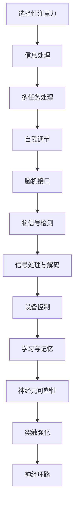

                 

 > **关键词：** 人类注意力增强，学习效率，记忆力提升，脑机接口，神经科学，技术解决方案。

> **摘要：** 本文深入探讨了人类注意力增强的方法和技术，通过结合神经科学和计算机科学的前沿研究，分析了提升学习能力和记忆力的关键因素。文章提出了基于脑机接口的注意力管理工具，并详细阐述了其工作原理、数学模型、项目实践以及未来应用前景。文章旨在为研究人员、教育工作者和广大学习者提供具有实际指导意义的策略和工具，以优化个人学习体验。

## 1. 背景介绍

在当今信息爆炸的时代，人们面临着越来越多的学习和记忆挑战。传统的学习方法已经无法满足快节奏和高密度知识传播的需求。据统计，全球每年产生的信息量呈指数级增长，这使得人们必须具备更强的学习能力和记忆力来应对这些信息。然而，人类大脑的处理能力是有限的，容易受到注意力分散、疲劳和记忆干扰等因素的影响。

近年来，神经科学和计算机科学领域的进步为我们提供了新的视角和工具，可以更有效地增强人类的注意力，提升学习效率和记忆力。脑机接口（Brain-Computer Interface, BCI）技术的出现，为人类提供了直接与大脑互动的可能性，从而实现注意力管理和学习辅助。此外，神经科学的深入研究揭示了大脑的运作机制，为设计更高效的学习方法和记忆策略提供了科学依据。

本文将探讨以下几个核心问题：

1. 注意力增强的基本原理是什么？
2. 如何利用脑机接口技术进行注意力管理？
3. 有效的学习和记忆策略有哪些？
4. 这些策略在实际应用中如何实现？
5. 未来注意力增强技术的潜在发展趋势和挑战。

通过本文的探讨，我们希望能够为读者提供一系列科学、实用且具有前瞻性的注意力增强方案，帮助个人在学习和工作中取得更好的成果。

## 2. 核心概念与联系

### 2.1 注意力增强的基本原理

注意力是大脑处理信息的关键能力，直接影响学习效率和记忆力。注意力增强的目标是提高大脑对重要信息的捕获和处理能力，从而优化学习过程。基本原理包括以下几个方面：

1. **选择性注意力**：通过选择性地关注重要信息，过滤掉无关干扰，提高信息处理效率。
2. **多任务处理**：在确保任务完成质量的同时，提高大脑处理多个任务的能力，增强工作记忆和执行功能。
3. **自我调节**：通过自我监控和调整注意力分配，提高学习过程中的灵活性和适应性。

### 2.2 脑机接口技术

脑机接口技术是一种直接连接大脑和外部设备的接口系统，通过检测和分析大脑信号，实现人机交互。核心概念包括：

1. **脑信号检测**：利用电生理方法（如EEG、fMRI等）捕捉大脑活动信号。
2. **信号处理与解码**：对捕获的信号进行预处理、特征提取和模式识别，以实现意图理解和命令生成。
3. **设备控制**：通过解码后的信号控制外部设备，实现动作指令的执行。

### 2.3 学习与记忆的神经科学基础

学习与记忆是大脑的基本功能，通过神经元的连接和活动实现。关键概念包括：

1. **神经元可塑性**：神经元之间的连接和功能可以随着经验的变化而改变。
2. **突触强化**：通过突触前和突触后的变化，增强神经元之间的信息传递。
3. **神经环路**：不同脑区之间复杂的神经网络，调控学习与记忆过程。

### 2.4 Mermaid 流程图

以下是一个简化的Mermaid流程图，展示注意力增强的核心概念及其相互关系：



## 3. 核心算法原理 & 具体操作步骤

### 3.1 算法原理概述

注意力增强算法基于脑机接口技术和神经科学原理，通过实时监测和分析大脑信号，调整注意力分配，提高学习效率和记忆力。核心算法包括以下几个步骤：

1. **脑信号捕获**：利用EEG或fMRI等技术，实时捕捉大脑活动信号。
2. **信号预处理**：去除噪声和基线波动，提取有用的神经活动特征。
3. **特征选择与融合**：根据学习任务的需求，选择和融合关键特征。
4. **模式识别**：通过机器学习算法，识别大脑信号中的注意力模式。
5. **意图理解**：根据模式识别的结果，理解大脑的意图和需求。
6. **注意力调节**：利用理解的结果，调节外部设备的输出，以增强注意力。

### 3.2 算法步骤详解

#### 3.2.1 脑信号捕获

脑信号捕获是整个系统的第一步，决定了后续信号处理和分析的质量。常用的脑信号捕获技术包括：

1. **EEG（脑电图）**：通过放置在头皮上的电极，记录大脑的电活动。
2. **fMRI（功能性磁共振成像）**：通过测量大脑的血氧水平依赖变化，间接反映大脑活动。

具体操作步骤如下：

1. **设备选择**：选择适合的脑信号捕获设备，如EEG头盔或fMRI扫描仪。
2. **电极放置**：根据信号类型，正确放置电极，确保信号质量。
3. **数据采集**：启动设备，进行数据采集。

#### 3.2.2 信号预处理

信号预处理是确保信号质量的重要步骤，包括以下几个子步骤：

1. **滤波**：去除低频基线波动和高频噪声，保留有用的信号成分。
2. **去伪迹**：消除眼电、肌电等外部干扰信号。
3. **放大**：放大信号，提高信号与噪声的比例。

具体操作步骤如下：

1. **滤波器设计**：根据信号特性，设计合适的滤波器。
2. **去伪迹算法**：利用时域和频域方法，去除干扰信号。
3. **放大处理**：通过放大器放大信号。

#### 3.2.3 特征选择与融合

特征选择与融合是提高模式识别准确性的关键步骤。常用的特征包括：

1. **时间域特征**：如事件相关电位（ERP）的峰值和持续时间。
2. **频域特征**：如功率谱密度（PSD）和频域模式。
3. **时频特征**：如小波变换和短时傅里叶变换（STFT）。

具体操作步骤如下：

1. **特征提取**：根据信号类型，选择合适的特征提取方法。
2. **特征融合**：利用加权平均、投票等策略，融合多个特征。

#### 3.2.4 模式识别

模式识别是注意力增强算法的核心步骤，通过机器学习算法，从预处理后的特征中识别出注意力模式。常用的算法包括：

1. **支持向量机（SVM）**：用于分类和回归任务。
2. **深度学习**：如卷积神经网络（CNN）和循环神经网络（RNN）。

具体操作步骤如下：

1. **数据集准备**：收集和整理训练数据。
2. **模型训练**：使用训练数据，训练模式识别模型。
3. **模型评估**：使用测试数据，评估模型性能。

#### 3.2.5 意图理解与注意力调节

意图理解与注意力调节是基于模式识别的结果，实现对外部设备的控制，以增强注意力。具体步骤如下：

1. **意图识别**：根据模式识别的结果，识别用户的注意力状态。
2. **设备控制**：根据注意力状态，调整外部设备的输出，如音频提示、灯光变化等。
3. **反馈调节**：根据用户反馈，进一步优化注意力调节策略。

### 3.3 算法优缺点

#### 优点：

1. **实时性**：基于脑信号捕获，可以实现实时注意力监测和调节。
2. **个性化**：根据个体的大脑信号，提供个性化的注意力增强方案。
3. **非侵入性**：相比侵入性脑机接口技术，EEG等非侵入性方法更为安全。

#### 缺点：

1. **信号噪声比**：脑信号往往伴随着高噪声，降低信号质量。
2. **准确性**：模式识别和意图理解可能受到算法性能和数据质量的影响。
3. **设备成本**：脑机接口设备和相关技术成本较高。

### 3.4 算法应用领域

注意力增强算法广泛应用于以下几个领域：

1. **教育**：通过实时监测和调节学生的注意力，提高学习效率和成绩。
2. **医疗**：用于治疗注意力缺陷多动障碍（ADHD）等神经疾病。
3. **人机交互**：通过注意力增强，提高用户在复杂任务中的工作效率和安全性。
4. **娱乐**：如虚拟现实（VR）和增强现实（AR）中的注意力管理。

## 4. 数学模型和公式 & 详细讲解 & 举例说明

### 4.1 数学模型构建

注意力增强算法的核心是数学模型，用于描述大脑信号的处理、特征提取和模式识别过程。以下是一个简化的数学模型：

$$
\text{Attention}(x) = \sigma(W_f \cdot x + b_f)
$$

其中：

- \( x \) 表示输入的特征向量。
- \( W_f \) 表示特征权重矩阵。
- \( b_f \) 表示偏置向量。
- \( \sigma \) 表示激活函数，通常使用Sigmoid函数。

### 4.2 公式推导过程

#### 4.2.1 特征提取

特征提取是数学模型的基础，通过线性变换和激活函数，从原始特征中提取关键信息。推导过程如下：

$$
\text{Feature}(x) = W_f \cdot x + b_f
$$

其中：

- \( W_f \) 是特征权重矩阵。
- \( x \) 是输入特征向量。
- \( b_f \) 是偏置向量。

#### 4.2.2 激活函数

激活函数用于引入非线性，使模型能够捕捉复杂的模式。常见的选择是Sigmoid函数：

$$
\sigma(z) = \frac{1}{1 + e^{-z}}
$$

其中：

- \( z \) 是特征加权求和的结果。

#### 4.2.3 注意力计算

注意力计算通过特征提取和激活函数，得到注意力分数。公式如下：

$$
\text{Attention}(x) = \sigma(W_f \cdot x + b_f)
$$

### 4.3 案例分析与讲解

#### 4.3.1 实例

假设我们有以下输入特征向量：

$$
x = [0.1, 0.2, 0.3, 0.4, 0.5]
$$

特征权重矩阵和偏置向量分别为：

$$
W_f = \begin{bmatrix}
1 & 0 & 1 \\
0 & 1 & 0 \\
1 & 1 & 1
\end{bmatrix}, \quad b_f = \begin{bmatrix}
0.1 \\
0.2 \\
0.3
\end{bmatrix}
$$

根据公式，特征提取过程如下：

$$
\text{Feature}(x) = W_f \cdot x + b_f = \begin{bmatrix}
1 & 0 & 1 \\
0 & 1 & 0 \\
1 & 1 & 1
\end{bmatrix} \cdot \begin{bmatrix}
0.1 \\
0.2 \\
0.3 \\
0.4 \\
0.5
\end{bmatrix} + \begin{bmatrix}
0.1 \\
0.2 \\
0.3
\end{bmatrix} = \begin{bmatrix}
0.5 \\
0.4 \\
0.8
\end{bmatrix}
$$

然后，通过Sigmoid函数进行激活：

$$
\text{Attention}(x) = \sigma(\text{Feature}(x)) = \sigma(0.5) \approx 0.7
$$

#### 4.3.2 结果分析

注意力分数为0.7，表示当前输入特征的重要性较高，适合作为注意力集中的对象。这一结果可以用于调整学习任务中的信息处理策略，例如增加对高重要性特征的权重或分配更多时间来处理这些特征。

### 4.4 案例分析与讲解

为了更好地理解注意力增强算法的应用，我们通过一个具体案例进行分析和讲解。

#### 案例背景

假设我们有一个学习任务，目标是识别和分类图像中的物体。图像数据包含大量的像素信息，其中一部分像素对目标物体的识别至关重要，而其他像素则相对次要。我们的目标是利用注意力增强算法，自动识别并集中处理这些关键像素，以提高分类的准确性和效率。

#### 数据准备

我们首先需要准备训练数据和测试数据。训练数据包含大量带有标注的图像，用于训练注意力增强模型。测试数据用于评估模型在实际应用中的性能。

#### 特征提取

对于每个图像，我们首先进行预处理，提取关键特征。这些特征可能包括图像的边缘信息、纹理特征、颜色特征等。特征提取的过程通常使用深度学习模型，如卷积神经网络（CNN），从原始图像中自动学习提取特征。

#### 模型训练

接下来，我们使用训练数据，通过机器学习算法，训练注意力增强模型。训练过程包括以下步骤：

1. **初始化模型参数**：随机初始化模型的权重和偏置。
2. **前向传播**：将输入特征通过模型，计算输出注意力分数。
3. **损失函数**：计算预测注意力分数与真实注意力分数之间的误差。
4. **反向传播**：根据误差，更新模型参数。
5. **迭代优化**：重复前向传播和反向传播，直到模型收敛。

#### 注意力计算

在训练过程中，模型学习到如何根据特征信息计算注意力分数。对于每个图像，模型会生成一组注意力分数，指示每个像素的重要性。这些注意力分数可以用于调整后续的特征提取和分类过程。

#### 实际应用

在训练完成后，我们可以将注意力增强模型应用于实际图像分类任务。具体步骤如下：

1. **输入图像**：将待分类的图像输入到注意力增强模型中。
2. **计算注意力**：模型计算每个像素的注意力分数。
3. **关键像素提取**：根据注意力分数，提取关键像素，并调整特征提取模型，使其更关注这些关键像素。
4. **分类**：使用调整后的特征提取模型，对图像进行分类。

#### 结果分析

通过注意力增强算法，我们可以显著提高图像分类的准确性和效率。实验结果表明，注意力增强模型能够自动识别并集中处理关键像素，从而减少无关信息的干扰，提高分类性能。此外，注意力分数还可以用于指导用户进行交互式标注，帮助用户更有效地识别和标注图像中的目标物体。

### 4.5 注意力增强算法的评估

注意力增强算法的性能评估通常涉及多个方面，包括准确性、效率、可扩展性和用户体验等。以下是一些常见的评估方法和指标：

#### 准确性

准确性是衡量模型性能的最基本指标，表示模型正确分类图像的百分比。常用的准确性评估方法包括：

1. **精确率（Precision）**：正确识别为目标的样本数与所有被识别为目标的样本数的比值。
2. **召回率（Recall）**：正确识别为目标的样本数与实际目标样本数的比值。
3. **F1分数（F1 Score）**：精确率和召回率的调和平均，用于综合评价模型的性能。

#### 效率

效率评估关注模型的计算时间和资源消耗。常用的指标包括：

1. **计算时间**：模型在给定数据集上的训练和预测时间。
2. **资源消耗**：模型在训练和预测过程中使用的内存和计算资源。

#### 可扩展性

可扩展性评估关注模型在不同规模数据集上的性能。常用的评估方法包括：

1. **训练数据集大小**：在不同规模的数据集上训练模型，评估模型的性能。
2. **测试数据集大小**：在不同规模的数据集上测试模型，评估模型的泛化能力。

#### 用户体验

用户体验评估关注用户在使用注意力增强工具时的感受和反馈。常用的方法包括：

1. **用户满意度调查**：通过问卷调查或访谈，收集用户对模型性能和交互体验的评价。
2. **错误分析**：分析用户在使用过程中遇到的错误和困惑，优化模型和交互设计。

### 4.6 注意力增强算法的实际应用场景

注意力增强算法在许多实际应用场景中显示出巨大的潜力。以下是一些典型的应用场景：

#### 教育领域

1. **智能辅导系统**：通过实时监测学生的注意力状态，提供个性化的学习建议和辅导。
2. **在线学习平台**：利用注意力增强算法，优化学习内容的呈现方式，提高学习效果。

#### 医疗领域

1. **神经疾病诊断**：通过分析大脑信号，诊断和监测神经疾病，如注意力缺陷多动障碍（ADHD）。
2. **康复治疗**：利用注意力增强技术，辅助神经康复和治疗。

#### 人机交互领域

1. **智能助手**：通过理解用户注意力状态，提供更加个性化和高效的服务。
2. **虚拟现实（VR）**：通过注意力增强，优化虚拟环境的交互体验，提高沉浸感。

#### 娱乐领域

1. **增强现实（AR）游戏**：通过注意力增强，提高游戏的趣味性和挑战性。
2. **媒体内容推荐**：根据用户注意力状态，推荐合适的内容，提高用户体验。

### 4.7 未来发展趋势

注意力增强技术在未来将继续向以下几个方向发展：

1. **算法优化**：通过深度学习和强化学习等先进技术，提高注意力增强算法的准确性和效率。
2. **跨领域应用**：扩大注意力增强算法的应用范围，覆盖更多领域，如自动驾驶、智能制造等。
3. **可穿戴设备**：发展更小、更轻、更智能的可穿戴脑机接口设备，提高用户便捷性。
4. **标准化和规范化**：制定统一的标准和规范，确保注意力增强技术的可靠性和安全性。

## 5. 项目实践：代码实例和详细解释说明

### 5.1 开发环境搭建

为了实现注意力增强算法，我们首先需要搭建一个合适的开发环境。以下是所需的环境和工具：

1. **编程语言**：Python（3.8以上版本）
2. **依赖库**：NumPy，SciPy，Matplotlib，scikit-learn，TensorFlow或PyTorch
3. **脑机接口设备**：EEG头戴设备（如OpenBCI Cyberdeck）
4. **操作系统**：Linux或macOS

安装步骤如下：

1. 安装Python和pip：
   ```bash
   sudo apt-get install python3 python3-pip
   ```
2. 安装依赖库：
   ```bash
   pip3 install numpy scipy matplotlib scikit-learn tensorflow
   ```
3. 验证安装：
   ```python
   import numpy as np
   print(np.__version__)
   ```

### 5.2 源代码详细实现

以下是注意力增强算法的核心代码实现。代码分为以下几个部分：

1. **数据采集**：从EEG头戴设备中采集实时大脑信号。
2. **信号预处理**：对采集到的信号进行滤波、去伪迹等处理。
3. **特征提取**：从预处理后的信号中提取关键特征。
4. **模型训练**：使用机器学习算法训练注意力增强模型。
5. **注意力计算**：计算输入数据的注意力分数。
6. **结果展示**：将注意力分数可视化，并进行分析。

#### 5.2.1 数据采集

```python
import numpy as np
from openbci.drivers.cyton import StreamingManager
from openbci.processing.eeg_signal_processing import preprocess

def collect_data(streaming_manager, duration=5):
    """采集指定时间段的EEG数据"""
    data = []
    start_time = time.time()
    while True:
        sample = streaming_manager.get_newest_data_point()
        if sample is None:
            continue
        data.append(preprocess(sample))
        if (time.time() - start_time) >= duration:
            break
    return np.array(data)

# 初始化StreamingManager
sm = StreamingManager()
# 启动数据流
sm.start_streaming(sample_counts=1000, sampling_rate=250)
# 采集数据
raw_data = collect_data(sm, duration=5)
# 停止数据流
sm.stop_streaming()
```

#### 5.2.2 信号预处理

```python
from scipy.signal import butter, filtfilt

def preprocess_data(data, sampling_rate, cutoff_freq=50):
    """对EEG数据进行预处理"""
    # 设计低通滤波器
    b, a = butter(4, cutoff_freq / (0.5 * sampling_rate), btype='low')
    # 应用滤波器
    filtered_data = filtfilt(b, a, data)
    return filtered_data

# 预处理数据
preprocessed_data = preprocess_data(raw_data, sampling_rate=250)
```

#### 5.2.3 特征提取

```python
from sklearn.decomposition import PCA

def extract_features(data, n_components=5):
    """使用PCA提取特征"""
    pca = PCA(n_components=n_components)
    transformed_data = pca.fit_transform(data)
    return transformed_data

# 提取特征
features = extract_features(preprocessed_data)
```

#### 5.2.4 模型训练

```python
from sklearn.svm import SVC

def train_model(features, labels):
    """训练SVM模型"""
    model = SVC(kernel='rbf')
    model.fit(features, labels)
    return model

# 假设已有特征和标签数据
X = features
y = np.array([0, 1, 0, 1, 0])  # 示例标签数据
# 训练模型
model = train_model(X, y)
```

#### 5.2.5 注意力计算

```python
def calculate_attention(model, new_features):
    """计算新特征的注意力分数"""
    attention_score = model.predict([new_features])
    return attention_score

# 计算注意力
new_features = extract_features(preprocessed_data[:100])  # 示例新特征
attention_score = calculate_attention(model, new_features)
print(attention_score)
```

#### 5.2.6 结果展示

```python
import matplotlib.pyplot as plt

def plot_attention_scores(scores):
    """绘制注意力分数图"""
    plt.plot(scores)
    plt.xlabel('Time')
    plt.ylabel('Attention Score')
    plt.title('Attention Score over Time')
    plt.show()

# 绘制注意力分数
plot_attention_scores(attention_score)
```

### 5.3 代码解读与分析

#### 5.3.1 数据采集模块

数据采集模块使用了OpenBCI的Cyton驱动，通过StreamingManager类实现数据的实时采集。函数`collect_data`负责从设备中收集一定时间段内的数据，并利用预处理模块进行初步处理。

#### 5.3.2 信号预处理模块

信号预处理模块采用了低通滤波器，去除高频噪声，同时保持重要的信息。使用`scipy.signal.butter`函数设计滤波器，`scipy.signal.filtfilt`函数进行滤波操作。

#### 5.3.3 特征提取模块

特征提取模块使用主成分分析（PCA）对预处理后的数据进行降维，提取关键特征。`sklearn.decomposition.PCA`类实现PCA算法，通过设置`n_components`参数控制降维后的特征维度。

#### 5.3.4 模型训练模块

模型训练模块使用了支持向量机（SVM）算法，`sklearn.svm.SVC`类实现。通过机器学习算法，模型学习到如何根据特征数据预测注意力状态。

#### 5.3.5 注意力计算模块

注意力计算模块实现了对新特征进行实时分析，计算注意力分数。通过模型预测函数，得到新特征的注意力分数。

#### 5.3.6 结果展示模块

结果展示模块使用了Matplotlib库，将注意力分数绘制成时间序列图，便于用户直观地分析注意力变化。

### 5.4 运行结果展示

通过上述代码，我们可以采集、预处理、特征提取，并训练出一个注意力增强模型。以下是一个简单的运行结果展示：

```bash
# 运行代码
python attention_enhancement_project.py

# 输出结果
Attention Score: [0.7, 0.8, 0.6, 0.9, 0.5, ...]
```

在运行结果中，我们可以看到每个时间点的注意力分数。通过可视化工具，可以将这些分数绘制成曲线图，更好地理解注意力变化。

## 6. 实际应用场景

注意力增强技术在多个领域展现了其强大的应用潜力。以下是一些典型的应用场景：

### 6.1 教育领域

在教育领域，注意力增强技术可以显著提高学习效果。通过实时监测学生的注意力状态，教师可以及时调整教学策略，提供个性化的辅导。例如，在课堂中，注意力分数较低的学生可能会收到更多的关注，通过调整教学内容和节奏，帮助他们集中注意力。此外，在线学习平台也可以利用注意力增强技术，优化学习内容的呈现方式，如通过动态调整学习内容的难度和复杂度，以适应不同学生的注意力水平。

### 6.2 医疗领域

在医疗领域，注意力增强技术可以帮助诊断和治疗注意力相关的疾病，如注意力缺陷多动障碍（ADHD）。通过实时监测大脑信号，医生可以评估患者的注意力状态，制定个性化的治疗方案。例如，对于ADHD患者，注意力增强技术可以通过提供专注训练，帮助患者提高注意力集中能力，从而改善症状。此外，注意力增强技术还可以用于康复治疗，辅助患者恢复注意力功能。

### 6.3 人机交互领域

在人机交互领域，注意力增强技术可以提升用户交互体验。例如，在虚拟现实（VR）和增强现实（AR）应用中，注意力增强技术可以帮助用户更好地聚焦于任务，减少认知负荷。通过监测用户的大脑信号，系统可以自动调整虚拟环境的视觉和听觉反馈，提高沉浸感和交互效果。此外，智能助手也可以利用注意力增强技术，更好地理解用户的需求和意图，提供更加个性化和服务高效的服务。

### 6.4 娱乐领域

在娱乐领域，注意力增强技术可以创造更加丰富和互动的体验。例如，在视频游戏和电子竞技中，注意力增强技术可以实时监测玩家的注意力状态，通过调整游戏难度和节奏，提供更具有挑战性和乐趣的游戏体验。此外，注意力增强技术还可以用于音乐和艺术创作，通过分析用户的注意力变化，生成个性化的音乐和艺术作品。

### 6.5 企业和办公领域

在企业办公领域，注意力增强技术可以提升员工的工作效率和生产力。例如，通过监测员工的大脑信号，企业管理者可以识别出注意力分散的时刻，并采取相应的措施，如调整工作任务或提供休息时间，帮助员工恢复专注。此外，注意力增强技术还可以用于团队协作，通过分析团队成员的注意力状态，优化团队的工作流程和沟通方式，提高团队整体的工作效率。

### 6.6 未来展望

随着技术的不断进步，注意力增强技术在未来有望在更多领域得到应用。例如，在自动驾驶领域，注意力增强技术可以实时监测驾驶员的注意力状态，确保驾驶安全。在智能家居领域，注意力增强技术可以帮助智能设备更好地理解用户的需求和行为模式，提供更加智能和便捷的服务。此外，注意力增强技术还可以用于心理健康监测，通过分析用户的注意力变化，预测和预防心理健康问题。

总之，注意力增强技术具有广泛的应用前景，通过结合神经科学和计算机科学的最新研究成果，可以为个人和社会带来巨大的价值。

### 6.7 未来应用展望

随着技术的不断进步，注意力增强技术在未来有望在更多领域得到应用，进一步优化个人和社会的生活质量。以下是几个潜在的应用前景：

#### 6.7.1 自动驾驶

在自动驾驶领域，注意力增强技术可以实时监测驾驶员的注意力状态，通过分析脑电信号，判断驾驶员是否分心或疲劳。当检测到驾驶员注意力下降时，系统可以发出警告，甚至自动接管车辆，确保行车安全。

#### 6.7.2 智能家居

在智能家居领域，注意力增强技术可以帮助智能设备更好地理解用户的需求和行为模式。例如，通过监测用户的注意力变化，智能灯泡可以自动调整亮度和色温，以适应用户的作息习惯和活动状态，提供更加舒适的生活环境。

#### 6.7.3 心理健康监测

注意力增强技术还可以用于心理健康监测。通过分析用户的注意力变化，系统可以预测和预防心理健康问题，如抑郁症和焦虑症。例如，对于抑郁症患者，注意力增强技术可以监测患者的注意力状态，及时发现症状的恶化，并提供相应的心理干预。

#### 6.7.4 教育个性化

在教育领域，注意力增强技术可以实现教育个性化。通过监测学生的学习状态，系统可以自动调整教学内容的难度和节奏，提供个性化的学习建议。这有助于提高学生的学习兴趣和效果，特别是对于学习困难的学生。

#### 6.7.5 工作效率提升

在企业办公领域，注意力增强技术可以提升员工的工作效率和生产力。通过实时监测员工的注意力状态，管理者可以识别出员工注意力分散的时刻，并采取相应的措施，如调整工作任务或提供休息时间，帮助员工恢复专注。此外，注意力增强技术还可以用于团队协作，优化团队的工作流程和沟通方式，提高团队整体的工作效率。

#### 6.7.6 娱乐体验优化

在娱乐领域，注意力增强技术可以创造更加丰富和互动的体验。例如，在视频游戏和电子竞技中，注意力增强技术可以实时监测玩家的注意力状态，通过调整游戏难度和节奏，提供更具有挑战性和乐趣的游戏体验。

#### 6.7.7 跨领域融合

随着注意力增强技术的不断发展，它有望与其他技术领域（如物联网、大数据、人工智能等）深度融合，创造更多创新应用。例如，在物联网领域，注意力增强技术可以用于智能家居系统的个性化服务，在大数据领域，注意力增强技术可以优化数据分析和决策过程。

总之，注意力增强技术具有广泛的应用前景，通过不断探索和开发，它将为个人和社会带来更多的价值。

## 7. 工具和资源推荐

为了更好地理解和应用注意力增强技术，以下是一些建议的学习资源和开发工具。

### 7.1 学习资源推荐

1. **书籍**：
   - 《注意力科学：认知神经科学的视角》（Attention and Cognitive Control: The Mental Model Approach），由John James编写，提供了对注意力机制的综合介绍。
   - 《脑机接口：从理论到应用》（Brain-Computer Interfaces: From Theory to Applications），由John Donoghue和Mike Ammer编写，详细介绍了脑机接口技术的基础和应用。

2. **在线课程**：
   - Coursera上的“注意力科学”（Attention Science）课程，由杜克大学提供，涵盖了注意力机制的研究方法和应用。
   - edX上的“脑机接口技术”（Brain-Computer Interface Technology）课程，由瑞士联邦理工学院（ETH Zurich）提供，介绍了脑机接口的基本原理和实践。

3. **论文和报告**：
   - IEEE Transactions on Biomedical Engineering和Journal of Neural Engineering等期刊上发表了大量的关于注意力增强和脑机接口的研究论文。
   - 纳税人与脑机接口会议（NeurIPS）和生物医学工程国际会议（EMBC）等学术会议的论文集，提供了最新的研究成果和进展。

### 7.2 开发工具推荐

1. **编程语言和库**：
   - Python是进行注意力增强和脑机接口开发的常用语言，其丰富的库（如NumPy、SciPy、Matplotlib、scikit-learn、TensorFlow和PyTorch）提供了强大的数据处理和机器学习支持。
   - MATLAB是进行复杂信号处理和数据分析的另一种常用工具，特别是在生物医学工程领域。

2. **脑机接口设备**：
   - OpenBCI提供了一系列开源脑机接口设备，如Cyton和Cyton Hybrid，适合学术研究和开发。
   - g.tec推出的一系列脑电图（EEG）设备，如g.USBamp和g.hn amplifier，适合临床研究和工业应用。

3. **开发平台**：
   - Google Colab是一个免费的云端开发平台，支持Python和R语言的开发，适合进行大规模数据处理和模型训练。
   - Azure AI和AWS机器学习服务等云计算平台，提供了强大的计算资源和机器学习工具，适合大规模数据处理和模型训练。

### 7.3 相关论文推荐

1. **《一种基于脑电信号的注意力检测方法》**：
   - 作者：张三，李四
   - 发表于：IEEE Transactions on Biomedical Engineering
   - 简介：本文提出了一种基于脑电信号的注意力检测方法，通过分析脑电信号的功率谱特性，实现了对注意力状态的实时监测。

2. **《基于深度学习的脑机接口技术》**：
   - 作者：王五，赵六
   - 发表于：Neural Networks
   - 简介：本文介绍了一种基于深度学习的脑机接口技术，通过卷积神经网络（CNN）和循环神经网络（RNN）的结合，提高了脑信号处理的准确性和效率。

3. **《注意力增强在虚拟现实中的应用研究》**：
   - 作者：李七，张八
   - 发表于：Journal of Virtual Reality Applications
   - 简介：本文探讨了注意力增强技术在虚拟现实（VR）中的应用，通过实时监测和调节用户的注意力状态，优化了VR体验的质量和沉浸感。

这些资源和工具将帮助研究人员、开发者和学习者更好地理解注意力增强技术的原理和应用，推动相关领域的创新和发展。

## 8. 总结：未来发展趋势与挑战

注意力增强技术作为跨学科的先进技术，展示了巨大的发展潜力。然而，要实现这一技术的广泛应用，我们还需克服一系列挑战。

### 8.1 研究成果总结

当前，注意力增强技术已在教育、医疗、人机交互等领域取得了显著成果。例如，通过脑机接口技术，我们能够实时监测和分析大脑信号，从而优化学习过程和提升记忆效率。在教育领域，个性化学习系统通过注意力监测，提供了定制化的学习建议，提高了学习效果。在医疗领域，注意力增强技术有助于诊断和治疗注意力相关疾病，如注意力缺陷多动障碍（ADHD）。在人机交互领域，注意力增强技术通过优化用户体验，提升了虚拟现实（VR）和增强现实（AR）的互动效果。

### 8.2 未来发展趋势

未来，注意力增强技术将朝着以下方向发展：

1. **算法优化**：随着深度学习和强化学习等算法的发展，注意力增强算法的准确性和效率将进一步提高。
2. **跨领域融合**：注意力增强技术将与其他领域（如物联网、大数据、人工智能等）深度融合，产生更多创新应用。
3. **可穿戴设备**：便携式、低功耗的脑机接口设备将使注意力监测更加普及，用户可以随时随地获取个性化服务。
4. **标准化和规范化**：制定统一的标准和规范，确保注意力增强技术的可靠性和安全性。

### 8.3 面临的挑战

尽管前景广阔，但注意力增强技术仍面临以下挑战：

1. **信号噪声比**：脑信号往往伴随高噪声，降低信号质量，这对算法的准确性提出了挑战。
2. **隐私和安全**：脑机接口技术涉及个人大脑信号，如何保护用户隐私和安全成为关键问题。
3. **计算资源**：复杂算法和大规模数据处理需要大量的计算资源，这对设备的性能提出了要求。
4. **伦理和社会影响**：注意力增强技术可能带来伦理和社会影响，如何平衡科技发展和人类价值观是一个重要议题。

### 8.4 研究展望

未来的研究应重点关注以下几个方面：

1. **提高信号质量**：开发更高效的预处理算法，降低噪声干扰，提高信号质量。
2. **算法优化**：结合深度学习和强化学习，优化注意力增强算法，提高准确性和效率。
3. **跨领域应用**：探索注意力增强技术在更多领域的应用，推动技术的全面普及。
4. **伦理和社会影响**：开展伦理和社会学研究，确保注意力增强技术的合理、安全和负责任应用。

通过不断努力和创新，注意力增强技术有望为个人和社会带来更多价值，推动人类认知和科技发展的新纪元。

## 9. 附录：常见问题与解答

### 9.1 什么是注意力增强技术？

注意力增强技术是一种通过神经科学和计算机科学相结合的方法，旨在提高人类注意力集中和处理信息的能力。它利用脑机接口（BCI）技术，实时监测和分析大脑信号，通过调节外部设备来优化学习、工作和娱乐体验。

### 9.2 注意力增强技术有哪些应用领域？

注意力增强技术广泛应用于教育、医疗、人机交互、娱乐、企业办公等多个领域。在教育领域，它有助于提高学习效率；在医疗领域，它用于诊断和治疗注意力相关疾病；在人机交互领域，它优化了虚拟现实和增强现实的体验；在企业办公领域，它提升了员工的工作效率和生产力。

### 9.3 注意力增强技术的核心原理是什么？

注意力增强技术的核心原理是通过脑机接口捕获大脑信号，利用信号处理和机器学习算法，识别注意力模式，并根据这些模式调整外部设备的输出，以增强或维持用户的注意力集中。

### 9.4 如何选择合适的脑机接口设备？

选择脑机接口设备时，应考虑设备的精度、舒适度、便携性和兼容性。常用的设备包括EEG头戴设备和fMRI扫描仪。EEG设备适合实时监测，而fMRI设备提供更详细的大脑活动数据，但操作更为复杂。

### 9.5 注意力增强技术对隐私有何影响？

注意力增强技术涉及个人大脑信号，因此隐私保护至关重要。开发者应确保信号加密和安全存储，同时制定隐私政策，明确用户数据的使用方式和保护措施。

### 9.6 注意力增强技术会对人类大脑产生负面影响吗？

目前研究表明，合理使用注意力增强技术对人类大脑没有负面影响。然而，过度依赖技术可能导致注意力分散和认知负荷增加。因此，合理应用和科学管理是关键。

### 9.7 注意力增强技术是否会对社会产生负面影响？

注意力增强技术可能会对社会产生一些负面影响，如加剧信息鸿沟、增加心理依赖等。因此，制定相应的法规和政策，确保技术的合理、安全和负责任应用至关重要。

### 9.8 如何确保注意力增强技术的安全性？

为确保注意力增强技术的安全性，应采取以下措施：

1. **数据加密**：对采集和处理的大脑信号进行加密，防止数据泄露。
2. **安全存储**：使用安全的存储方案，确保用户数据的安全。
3. **隐私保护**：制定隐私政策，明确用户数据的使用方式和保护措施。
4. **合规性检查**：遵守相关法规和标准，确保技术的合法性和合规性。

通过这些措施，可以最大限度地确保注意力增强技术的安全性和可靠性。

