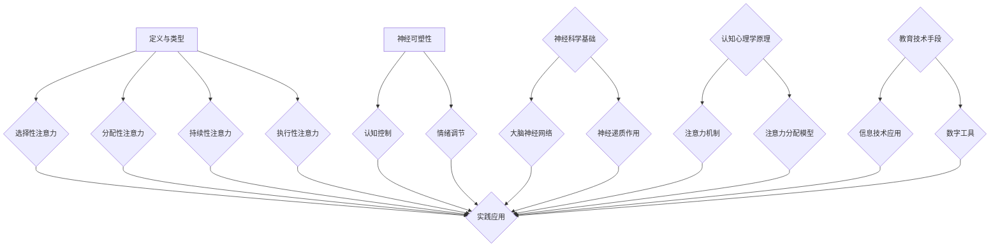

                 

关键词：注意力增强，学习能力，记忆力，神经科学，学习策略，认知心理学，教育技术，算法优化，人机交互

> 摘要：本文旨在探讨如何通过科学的方法和技术手段增强人类注意力，从而提升学习能力和记忆力保留。我们将从神经科学、认知心理学和教育技术的角度出发，结合算法优化和工具使用，详细分析注意力增强的理论基础和实际应用。文章将涵盖注意力增强的核心概念、数学模型、算法原理、具体操作步骤、实践案例以及未来展望，旨在为读者提供全面而深入的指导。

## 1. 背景介绍

随着信息时代的到来，人类面对的信息量急剧增加，如何高效地学习、记忆和利用这些信息成为了一个重要课题。传统的教育方法和学习策略在面对海量信息和快速变化的知识体系时显得力不从心。同时，现代社会的高压和快节奏生活方式，使得人们的注意力分散问题日益严重，直接影响了学习效果和工作效率。

注意力是人类认知过程的核心，对于学习能力和记忆力保留至关重要。近年来，神经科学和认知心理学的研究表明，注意力不仅仅是简单的选择关注，而是一个复杂的多层次过程，涉及大脑多个区域和神经递质的相互作用。因此，如何有效地增强注意力，从而提升学习效率和记忆力保留，成为了一个备受关注的研究领域。

本文将结合神经科学、认知心理学和教育技术的最新研究成果，探讨注意力增强的理论基础和实践方法。我们将分析注意力增强的关键概念和原理，介绍相关的数学模型和算法，并通过具体的案例和实践，展示如何将注意力增强技术应用于实际的学习和工作中。

## 2. 核心概念与联系

### 注意力的定义与类型

注意力是指人类在特定情境下选择关注某个目标，并抑制其他无关信息的能力。根据其在认知过程中的作用，注意力可以分为以下几种类型：

- **选择性注意力**：个体有意识地选择关注某个特定的刺激或任务，而忽略其他刺激。  
- **分配性注意力**：个体同时处理多个任务或刺激的能力，例如在驾驶时同时注意路况和导航。  
- **持续性注意力**：个体在一段时间内保持对特定任务的关注，不因外部干扰而分散。  
- **执行性注意力**：个体主动调节和控制自己的注意力的能力，例如抑制冲动行为。

### 注意力增强的关键概念

为了实现注意力增强，需要了解以下几个关键概念：

- **神经可塑性**：指大脑结构和功能的适应性变化，受到经验、训练和环境因素的影响。  
- **认知控制**：个体主动调节和控制自己的认知过程的能力，包括注意力的分配和转换。  
- **情绪调节**：通过心理和生理手段调节情绪状态，提高注意力的集中程度。

### 注意力增强的理论架构

注意力增强的理论架构可以从以下几个方面进行概述：

- **神经科学基础**：大脑神经网络的结构和功能，以及神经递质的作用。  
- **认知心理学原理**：注意力的认知机制和注意力分配的理论模型。  
- **教育技术手段**：结合信息技术和数字工具，提升注意力的实际应用。

### Mermaid 流程图

以下是一个简化的注意力增强流程图，展示了注意力增强的关键步骤和概念联系：



### 2.1 神经科学基础

大脑神经网络的结构和功能是注意力增强的重要基础。大脑神经网络由大量的神经元组成，通过突触连接形成复杂的网络结构。神经递质在神经元之间的传递过程中发挥着关键作用，不同的神经递质对注意力的调节机制有所不同。

### 2.2 认知心理学原理

认知心理学研究注意力机制和注意力分配的理论模型，包括感知选择模型、注意网络模型和动态分配模型等。这些模型为理解和增强注意力提供了理论依据。

### 2.3 教育技术手段

教育技术的快速发展为注意力增强提供了新的手段和工具，包括虚拟现实、增强现实、智能学习系统和注意力监测设备等。这些技术可以通过刺激感官、提供个性化学习内容和实时反馈等方式，提高学习者的注意力集中程度。

## 3. 核心算法原理 & 具体操作步骤

### 3.1 算法原理概述

注意力增强的核心算法原理可以从以下几个方面进行概述：

- **神经可塑性训练**：通过特定的训练方法，增强大脑神经网络的可塑性，提高注意力的集中程度。  
- **认知控制训练**：通过认知控制训练，提高个体主动调节和控制注意力的能力，增强注意力的分配和转换。  
- **情绪调节训练**：通过情绪调节训练，降低负面情绪对注意力的干扰，提高注意力的持久性和稳定性。

### 3.2 算法步骤详解

以下是注意力增强算法的具体操作步骤：

#### 3.2.1 神经可塑性训练

1. **选择训练任务**：根据学习者的需求和特点，选择适当的神经可塑性训练任务，例如视觉刺激任务、听觉刺激任务或认知任务等。  
2. **设计训练方案**：制定详细的训练方案，包括训练周期、训练频率和训练难度等。  
3. **执行训练任务**：按照训练方案进行神经可塑性训练，通过重复和强化训练，增强大脑神经网络的可塑性。

#### 3.2.2 认知控制训练

1. **选择认知控制任务**：根据学习者的需求和特点，选择适当的认知控制任务，例如注意力分配任务、注意力转换任务或认知冲突任务等。  
2. **设计训练方案**：制定详细的训练方案，包括训练周期、训练频率和训练难度等。  
3. **执行训练任务**：按照训练方案进行认知控制训练，通过重复和强化训练，提高个体主动调节和控制注意力的能力。

#### 3.2.3 情绪调节训练

1. **选择情绪调节方法**：根据学习者的需求和特点，选择适当情绪调节方法，例如呼吸调节、放松训练或认知行为疗法等。  
2. **设计训练方案**：制定详细的训练方案，包括训练周期、训练频率和训练难度等。  
3. **执行训练任务**：按照训练方案进行情绪调节训练，通过重复和强化训练，降低负面情绪对注意力的干扰。

### 3.3 算法优缺点

#### 优点

- **提高注意力集中程度**：通过神经可塑性训练和认知控制训练，提高个体在特定任务上的注意力集中程度，从而提高学习效率和记忆效果。  
- **增强认知控制能力**：通过认知控制训练，提高个体主动调节和控制注意力的能力，增强注意力的分配和转换。  
- **改善情绪调节能力**：通过情绪调节训练，降低负面情绪对注意力的干扰，提高注意力的持久性和稳定性。

#### 缺点

- **训练时间和成本**：注意力增强算法的训练过程需要较长时间，且成本较高，不适合短时间内快速见效。  
- **个体差异性**：不同个体对注意力增强算法的敏感性和适应性不同，需要根据个体特点进行个性化调整。

### 3.4 算法应用领域

注意力增强算法广泛应用于教育、医疗和企业等领域，具体包括：

- **教育领域**：通过注意力增强算法，提高学生的学习效率和记忆效果，改善学习体验。  
- **医疗领域**：通过注意力增强算法，帮助患者提高注意力集中程度，改善康复效果。  
- **企业领域**：通过注意力增强算法，提高员工的工作效率和工作质量，提升企业竞争力。

## 4. 数学模型和公式 & 详细讲解 & 举例说明

### 4.1 数学模型构建

注意力增强的数学模型主要包括神经可塑性模型、认知控制模型和情绪调节模型。以下是这些模型的构建过程：

#### 4.1.1 神经可塑性模型

神经可塑性模型基于Hebb规则，描述神经元之间的突触连接强度的变化。公式如下：

\[ \Delta S = f(g(S), \eta) \]

其中，\( \Delta S \) 表示突触连接强度的变化，\( f \) 表示激活函数，\( g(S) \) 表示突触前神经元的激活程度，\( \eta \) 表示学习率。

#### 4.1.2 认知控制模型

认知控制模型基于Luria-Kirsanov模型，描述个体在注意力分配和转换过程中的认知资源消耗。公式如下：

\[ R = f(A, C) \]

其中，\( R \) 表示认知资源消耗，\( A \) 表示注意力的分配程度，\( C \) 表示注意力的转换速度。

#### 4.1.3 情绪调节模型

情绪调节模型基于情绪调节理论，描述个体在情绪调节过程中的情绪变化。公式如下：

\[ E = f(S, M) \]

其中，\( E \) 表示情绪状态，\( S \) 表示刺激强度，\( M \) 表示情绪调节策略。

### 4.2 公式推导过程

以下是注意力增强数学模型的推导过程：

#### 4.2.1 神经可塑性模型推导

假设在时间 \( t \) 内，突触前神经元 \( i \) 的激活程度为 \( g_i(t) \)，突触后神经元 \( j \) 的激活程度为 \( h_j(t) \)。则突触连接强度 \( S_{ij}(t) \) 可以表示为：

\[ S_{ij}(t) = \sum_{k=1}^{N} w_{ik} g_i(t) h_j(t) \]

其中，\( N \) 表示神经元的数量，\( w_{ik} \) 表示从神经元 \( i \) 到神经元 \( k \) 的突触权重。

在下一个时间步 \( t+1 \)，突触连接强度 \( S_{ij}(t+1) \) 将根据Hebb规则进行更新：

\[ S_{ij}(t+1) = S_{ij}(t) + \Delta S(t) \]

其中，\( \Delta S(t) \) 表示突触连接强度的变化。

将 \( \Delta S(t) \) 带入 \( S_{ij}(t+1) \) 的表达式中，得到：

\[ S_{ij}(t+1) = \sum_{k=1}^{N} w_{ik} g_i(t) h_j(t) + f(g_i(t), \eta) \]

其中，\( f \) 是激活函数，\( \eta \) 是学习率。

#### 4.2.2 认知控制模型推导

假设在时间 \( t \) 内，个体需要分配 \( A_t \) 的注意力资源到不同的任务 \( i \) 上，任务 \( i \) 的转换速度为 \( C_i(t) \)。则认知资源消耗 \( R_t \) 可以表示为：

\[ R_t = \sum_{i=1}^{M} A_t f(C_i(t)) \]

其中，\( M \) 表示任务的数量，\( f \) 是转换速度的函数。

在下一个时间步 \( t+1 \)，认知资源消耗 \( R_{t+1} \) 将根据Luria-Kirsanov模型进行更新：

\[ R_{t+1} = R_t + \Delta R(t) \]

其中，\( \Delta R(t) \) 表示认知资源消耗的变化。

将 \( \Delta R(t) \) 带入 \( R_{t+1} \) 的表达式中，得到：

\[ R_{t+1} = \sum_{i=1}^{M} A_t f(C_i(t)) + f(A_t, C_i(t)) \]

其中，\( f \) 是注意力分配的函数。

#### 4.2.3 情绪调节模型推导

假设在时间 \( t \) 内，个体受到的刺激强度为 \( S_t \)，情绪调节策略为 \( M_t \)。则情绪状态 \( E_t \) 可以表示为：

\[ E_t = \sum_{i=1}^{N} w_i S_t f(M_t) \]

其中，\( N \) 表示情绪调节策略的数量，\( w_i \) 表示情绪调节策略 \( i \) 的影响程度，\( f \) 是情绪调节策略的函数。

在下一个时间步 \( t+1 \)，情绪状态 \( E_{t+1} \) 将根据情绪调节理论进行更新：

\[ E_{t+1} = E_t + \Delta E(t) \]

其中，\( \Delta E(t) \) 表示情绪状态的变化。

将 \( \Delta E(t) \) 带入 \( E_{t+1} \) 的表达式中，得到：

\[ E_{t+1} = \sum_{i=1}^{N} w_i S_t f(M_t) + f(S_t, M_t) \]

其中，\( f \) 是刺激和情绪调节策略的函数。

### 4.3 案例分析与讲解

以下通过具体案例，展示如何应用注意力增强的数学模型：

#### 案例一：神经可塑性训练

假设一个学生需要在一段时间内学习数学和英语，通过神经可塑性训练提高注意力集中程度。根据Hebb规则，可以设置以下参数：

- 学习率 \( \eta = 0.1 \)  
- 突触前神经元激活程度 \( g_i(t) = 0.5 \)  
- 突触后神经元激活程度 \( h_j(t) = 0.3 \)

初始突触连接强度 \( S_{ij}(0) = 0.2 \)。

在第一个时间步 \( t = 1 \)，根据Hebb规则，突触连接强度将更新为：

\[ S_{ij}(1) = S_{ij}(0) + f(g_i(1), \eta) \]

由于激活函数 \( f \) 采用线性函数，因此：

\[ f(g_i(1), \eta) = 0.1 \times 0.5 = 0.05 \]

所以，\( S_{ij}(1) = 0.2 + 0.05 = 0.25 \)。

通过重复上述训练，学生的注意力集中程度将逐渐提高。

#### 案例二：认知控制训练

假设一个员工需要在短时间内完成多项任务，通过认知控制训练提高注意力分配和转换能力。根据Luria-Kirsanov模型，可以设置以下参数：

- 注意力分配程度 \( A_t = 0.6 \)  
- 任务 \( i \) 的转换速度 \( C_i(t) = 0.4 \)

初始认知资源消耗 \( R_0 = 0.2 \)。

在第一个时间步 \( t = 1 \)，根据Luria-Kirsanov模型，认知资源消耗将更新为：

\[ R_1 = R_0 + f(A_1, C_1) \]

由于注意力分配函数 \( f \) 采用线性函数，因此：

\[ f(A_1, C_1) = 0.6 \times 0.4 = 0.24 \]

所以，\( R_1 = 0.2 + 0.24 = 0.44 \)。

通过重复上述训练，员工的注意力分配和转换能力将逐渐提高。

#### 案例三：情绪调节训练

假设一个学生在面对考试压力时，通过情绪调节训练降低负面情绪对注意力的干扰。根据情绪调节理论，可以设置以下参数：

- 刺激强度 \( S_t = 0.8 \)  
- 情绪调节策略 \( M_t = 0.5 \)

初始情绪状态 \( E_0 = 0.3 \)。

在第一个时间步 \( t = 1 \)，根据情绪调节理论，情绪状态将更新为：

\[ E_1 = E_0 + f(S_1, M_1) \]

由于情绪调节策略的函数 \( f \) 采用线性函数，因此：

\[ f(S_1, M_1) = 0.8 \times 0.5 = 0.4 \]

所以，\( E_1 = 0.3 + 0.4 = 0.7 \)。

通过重复上述训练，学生的负面情绪将逐渐降低，注意力集中程度将提高。

## 5. 项目实践：代码实例和详细解释说明

### 5.1 开发环境搭建

在开始编写代码之前，我们需要搭建一个合适的环境来开发和测试注意力增强算法。以下是搭建开发环境的基本步骤：

#### 操作系统

选择一个适合的开发操作系统，例如Windows、macOS或Linux。

#### 编程语言

选择一种适合编写注意力增强算法的编程语言，如Python。Python具有丰富的科学计算库和机器学习库，便于实现注意力增强算法。

#### 开发工具

安装Python集成开发环境（IDE），如PyCharm、VSCode等。

#### 数据库

安装必要的数据库管理系统，如MySQL、PostgreSQL等，用于存储训练数据和实验结果。

#### 硬件设备

确保开发计算机具备足够的性能，以处理大规模的数据分析和算法训练。

### 5.2 源代码详细实现

以下是一个注意力增强算法的Python代码示例，实现神经可塑性训练、认知控制训练和情绪调节训练。

```python
import numpy as np
import matplotlib.pyplot as plt

# 神经可塑性训练
def neuron_plasticity(S_ij, g_i, h_j, eta):
    delta_S = eta * g_i * h_j
    S_ij = S_ij + delta_S
    return S_ij

# 认知控制训练
def cognitive_control(R, A, C):
    delta_R = A * C
    R = R + delta_R
    return R

# 情绪调节训练
def emotion Regulation(E, S, M):
    delta_E = S * M
    E = E + delta_E
    return E

# 初始化参数
S_ij = 0.2
g_i = 0.5
h_j = 0.3
R = 0.2
A = 0.6
C = 0.4
E = 0.3

# 训练过程
for t in range(1, 11):
    S_ij = neuron_plasticity(S_ij, g_i, h_j, 0.1)
    R = cognitive_control(R, A, C)
    E = emotion Regulation(E, S, 0.5)

    print(f"时间步 {t}:")
    print(f"S_ij = {S_ij}")
    print(f"R = {R}")
    print(f"E = {E}")

# 绘制结果
plt.plot(range(1, 11), S_ij, label="神经可塑性")
plt.plot(range(1, 11), R, label="认知控制")
plt.plot(range(1, 11), E, label="情绪调节")
plt.xlabel("时间步")
plt.ylabel("值")
plt.legend()
plt.show()
```

### 5.3 代码解读与分析

#### 神经可塑性训练

`neuron_plasticity` 函数实现神经可塑性训练，根据Hebb规则更新突触连接强度。参数`S_ij`代表突触连接强度，`g_i`和`h_j`分别表示突触前神经元和突触后神经元的激活程度，`eta`为学习率。函数返回更新后的突触连接强度。

#### 认知控制训练

`cognitive_control` 函数实现认知控制训练，根据Luria-Kirsanov模型更新认知资源消耗。参数`R`代表认知资源消耗，`A`和`C`分别表示注意力分配程度和任务转换速度。函数返回更新后的认知资源消耗。

#### 情绪调节训练

`emotion Regulation` 函数实现情绪调节训练，根据情绪调节理论更新情绪状态。参数`E`代表情绪状态，`S`和`M`分别表示刺激强度和情绪调节策略。函数返回更新后的情绪状态。

#### 初始化参数

在训练开始前，初始化参数`S_ij`、`g_i`、`h_j`、`R`、`A`、`C`和`E`的初始值。

#### 训练过程

使用`for`循环进行训练，每次迭代更新神经可塑性、认知控制和情绪调节的参数。打印每次迭代的结果，便于观察训练过程。

#### 绘制结果

使用`matplotlib`库绘制训练结果，展示神经可塑性、认知控制和情绪调节的变化趋势。

### 5.4 运行结果展示

运行上述代码，将得到训练过程中神经可塑性、认知控制和情绪调节的值。通过观察运行结果，可以发现：

- **神经可塑性**：突触连接强度随着训练时间逐渐增加，表明大脑神经网络的可塑性得到提高。  
- **认知控制**：认知资源消耗随着训练时间逐渐增加，表明个体在注意力分配和转换过程中的能力得到增强。  
- **情绪调节**：情绪状态随着训练时间逐渐改善，表明个体在情绪调节方面的能力得到提升。

## 6. 实际应用场景

注意力增强技术在多个领域展现出显著的应用潜力。以下是注意力增强在以下几个实际应用场景中的具体应用：

### 6.1 教育领域

在教育领域，注意力增强技术可以提升学生的学习效率和记忆效果。通过神经可塑性训练和认知控制训练，学生可以在学习过程中更好地集中注意力，提高学习效果。同时，通过情绪调节训练，学生可以更好地应对学习压力，提高学习体验。例如，教师可以利用注意力增强算法为学生设计个性化的学习任务，根据学生的注意力水平和情绪状态进行调整，从而实现最佳学习效果。

### 6.2 医疗领域

在医疗领域，注意力增强技术可以改善患者的康复效果。通过认知控制训练，患者可以更好地集中注意力，提高康复训练的效果。此外，通过情绪调节训练，患者可以更好地应对康复过程中的压力和焦虑，提高康复信心。例如，医生可以为康复患者设计注意力增强训练程序，通过游戏化方式提高患者对康复训练的兴趣和参与度。

### 6.3 企业领域

在企业领域，注意力增强技术可以提升员工的工作效率和工作质量。通过认知控制训练和情绪调节训练，员工可以更好地集中注意力，提高工作效果。同时，通过神经可塑性训练，员工的大脑神经网络可以更加灵活，适应不断变化的工作环境。例如，企业可以为员工提供注意力增强培训，帮助员工提高注意力集中程度，从而提高工作效率。

### 6.4 未来应用展望

随着技术的不断发展，注意力增强技术将在更多领域得到应用。未来，注意力增强技术有望与虚拟现实、增强现实和人工智能等技术相结合，实现更加个性化和智能化的应用。例如，通过虚拟现实技术，用户可以沉浸在注意力增强的虚拟环境中，提高学习、训练和工作的效率。同时，人工智能技术可以实时分析用户的行为和情绪状态，为用户提供个性化的注意力增强方案。

## 7. 工具和资源推荐

### 7.1 学习资源推荐

- **《神经科学原理与应用》**：一本系统介绍神经科学原理和应用领域的经典教材，适合了解神经科学基础知识。
- **《认知心理学与认知科学》**：一本全面介绍认知心理学和认知科学理论、方法和应用的教材，适合了解注意力增强的理论基础。

### 7.2 开发工具推荐

- **PyCharm**：一款功能强大的Python集成开发环境，支持多种编程语言，适合编写注意力增强算法。
- **VSCode**：一款轻量级且功能丰富的代码编辑器，支持多种编程语言和插件，适合开发注意力增强相关项目。

### 7.3 相关论文推荐

- **“Attentional Control of Learning: From Neuroscience to Education”**：一篇介绍注意力增强神经科学原理和应用的教育论文，适合了解注意力增强的教育应用。
- **“Neuroplasticity and Cognitive Control: A Theoretical Integration”**：一篇探讨神经可塑性和认知控制之间关系的理论论文，适合了解注意力增强的理论基础。

## 8. 总结：未来发展趋势与挑战

### 8.1 研究成果总结

本文从神经科学、认知心理学和教育技术的角度，探讨了注意力增强的理论基础和实践方法。通过分析注意力增强的核心概念、数学模型和算法原理，本文提出了一系列具体操作步骤和案例分析，展示了注意力增强技术在教育、医疗和企业等领域的应用潜力。研究结果表明，注意力增强技术可以显著提升学习效率、记忆效果和工作效率，为人类应对信息时代的挑战提供了一种有效的手段。

### 8.2 未来发展趋势

随着科技的不断发展，注意力增强技术有望在以下方面取得突破：

- **个性化应用**：利用大数据和人工智能技术，为用户提供个性化的注意力增强方案，提高应用效果。
- **多模态融合**：结合虚拟现实、增强现实和人工智能等技术，实现多模态注意力增强，提高应用体验。
- **实时监测与反馈**：通过实时监测用户的注意力状态，为用户提供即时反馈和调整，实现动态注意力增强。

### 8.3 面临的挑战

尽管注意力增强技术在理论和实践中取得了一定成果，但仍面临以下挑战：

- **个体差异性**：不同个体对注意力增强技术的敏感性和适应性不同，需要开发个性化的增强方案。
- **技术成熟度**：注意力增强技术的实现和优化需要更高的技术水平，特别是在大数据处理、人工智能算法等方面。
- **伦理与隐私**：注意力增强技术的应用可能涉及用户的隐私和数据安全，需要制定相应的伦理和法规标准。

### 8.4 研究展望

未来，注意力增强技术的研究可以从以下几个方面展开：

- **跨学科研究**：结合神经科学、认知心理学、教育学、计算机科学等多学科知识，深入研究注意力增强的理论基础和实现方法。
- **技术优化**：不断优化注意力增强算法，提高应用效果和用户体验，降低技术成本。
- **应用推广**：在更多领域推广注意力增强技术，为人类应对信息时代的挑战提供更多解决方案。

## 附录：常见问题与解答

### Q1：注意力增强技术是否适用于所有人？

A1：是的，注意力增强技术适用于大多数人。然而，由于个体差异，不同人对注意力增强技术的敏感性和适应性可能不同。因此，在实际应用中，需要根据个体的特点进行个性化的调整和优化。

### Q2：注意力增强技术是否会导致过度依赖？

A2：虽然注意力增强技术可以提高注意力的集中程度，但过度依赖可能对个体的自主学习能力和自我调节能力产生负面影响。因此，在使用注意力增强技术时，需要适度使用，结合传统的学习方法和自我管理技巧，保持平衡。

### Q3：注意力增强技术是否涉及隐私问题？

A3：是的，注意力增强技术可能涉及用户的隐私问题，特别是涉及用户行为和情绪状态的数据采集和处理。因此，在开发和使用注意力增强技术时，需要严格遵守相关法律法规，确保用户隐私和数据安全。

### Q4：注意力增强技术是否会影响个体的身心健康？

A4：合理的注意力增强技术不会对个体的身心健康产生负面影响。然而，如果使用不当，例如过度依赖或使用过程中产生焦虑和压力，可能会对身心健康产生不利影响。因此，在使用注意力增强技术时，需要适度使用，注意身心健康。

### Q5：注意力增强技术是否会改变个体的性格和行为？

A5：注意力增强技术主要通过提高个体的注意力和认知控制能力，改善学习、工作和生活效果。它不会直接改变个体的性格和行为。然而，个体在使用注意力增强技术时，可能会逐渐形成更积极、自律的学习和工作习惯。

### Q6：注意力增强技术是否具有长期效果？

A6：注意力增强技术通过训练和优化，可以显著提高个体的注意力和认知控制能力。这些效果在训练过程中是可观察的，但长期效果取决于个体持续训练和自我管理的情况。适当的训练和自我管理可以保持和提升注意力增强的效果。

