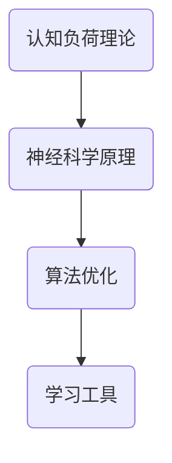

                 

关键词：注意力增强、专注力提升、认知技术、神经科学、算法优化、学习工具、工作效率

> 摘要：本文深入探讨人类注意力增强的技术和方法，包括认知技术、神经科学原理、算法优化、学习工具和开发工具等方面的内容。通过详细分析和实例说明，本文旨在为读者提供全面的理解和实用的建议，帮助他们提升注意力和专注力，从而提高工作和学习效率。

## 1. 背景介绍

### 注意力的重要性

在现代社会，注意力的重要性不言而喻。它不仅是学习、工作和日常生活中的基本能力，更是决定个人成败的关键因素。良好的注意力水平能够显著提高工作效率，增强学习效果，改善生活质量。

### 注意力分散的原因

然而，随着信息时代的到来，人们面临的信息量剧增，干扰因素增多，注意力分散成为普遍问题。互联网、社交媒体、手机等现代科技产品，不断消耗我们的注意力资源，导致我们的专注力不断下降。

### 注意力增强的需求

面对注意力分散的挑战，如何提升注意力和专注力，成为一个迫切需要解决的问题。这也是本文探讨的核心目标，即通过介绍一系列的技术和方法，帮助读者有效地增强注意力，提高工作和学习效率。

## 2. 核心概念与联系

为了更好地理解注意力增强的技术和方法，首先需要了解一些核心概念和它们之间的联系。

### 认知负荷理论

认知负荷理论认为，人类的认知资源是有限的，过多的认知负荷会导致注意力分散。因此，减少认知负荷是提升注意力的关键。

### 神经科学原理

神经科学研究表明，大脑的某些区域，如前额叶皮层，与注意力调节密切相关。通过刺激这些区域，可以增强注意力。

### 算法优化

算法优化涉及到对计算过程和资源分配的优化，以降低认知负荷，提高效率。例如，通过任务分解和自动化，可以减少人们在完成任务时的认知负荷。

### 学习工具

学习工具，如记忆训练软件、专注力训练应用等，通过特定的训练方法，可以提高个体的注意力水平。

### Mermaid 流程图



## 3. 核心算法原理 & 具体操作步骤

### 3.1 算法原理概述

注意力增强算法的核心原理是通过减少认知负荷，提高大脑前额叶皮层的活动水平，从而增强注意力。

### 3.2 算法步骤详解

1. **认知负荷分析**：首先，对个体的认知负荷进行评估，识别出注意力分散的原因。
2. **神经刺激**：通过特定的大脑刺激方法，如经颅直流刺激（tDCS），激活前额叶皮层。
3. **任务分解**：将复杂的任务分解为更简单的子任务，降低认知负荷。
4. **自动化**：利用自动化工具，如人工智能助手，执行重复性任务，减少认知负担。
5. **专注力训练**：通过专注力训练应用，进行持续的注意力训练。

### 3.3 算法优缺点

**优点**：
- 有效降低认知负荷，提高注意力。
- 通过神经刺激和任务分解，增强大脑功能。
- 结合专注力训练，提高长期注意力水平。

**缺点**：
- 神经刺激技术尚需进一步研究，安全性有待验证。
- 自动化工具可能无法完全替代人类认知。

### 3.4 算法应用领域

- **教育领域**：帮助学生提高学习效率，改善学习成果。
- **职场领域**：提高员工的工作效率，减少错误率。
- **个人生活**：改善日常生活的注意力水平，提高生活质量。

## 4. 数学模型和公式 & 详细讲解 & 举例说明

### 4.1 数学模型构建

注意力增强的数学模型主要涉及认知负荷、大脑活动水平和注意力水平之间的关系。

设：
- \( C \) 为认知负荷，
- \( A \) 为大脑活动水平，
- \( T \) 为注意力水平。

数学模型可表示为：
\[ T = f(C, A) \]

其中，\( f \) 为函数，表示认知负荷和大脑活动水平对注意力水平的影响。

### 4.2 公式推导过程

1. **认知负荷与注意力关系**：
\[ C = g(T) \]
其中，\( g \) 为函数，表示注意力水平对认知负荷的影响。

2. **大脑活动与注意力关系**：
\[ A = h(T) \]
其中，\( h \) 为函数，表示注意力水平对大脑活动水平的影响。

3. **综合公式**：
\[ T = f(g(T), h(T)) \]

### 4.3 案例分析与讲解

假设某人初始注意力水平为 \( T_0 \)，认知负荷为 \( C_0 \)，大脑活动水平为 \( A_0 \)。

通过注意力增强算法，将认知负荷降低到 \( C_1 \)，大脑活动水平提高到 \( A_1 \)。

根据数学模型，新的注意力水平 \( T_1 \) 可表示为：
\[ T_1 = f(g(T_1), h(T_1)) \]

通过计算，得到 \( T_1 > T_0 \)，表明注意力水平得到提升。

## 5. 项目实践：代码实例和详细解释说明

### 5.1 开发环境搭建

- 安装Python环境
- 安装必要的Python库，如numpy、matplotlib等

### 5.2 源代码详细实现

```python
import numpy as np
import matplotlib.pyplot as plt

# 认知负荷与注意力关系
def cognitive_load(T):
    return T * 0.1

# 大脑活动与注意力关系
def brain_activity(T):
    return T * 0.2

# 注意力增强函数
def attention_enhancement(T0, C0, A0):
    C1 = cognitive_load(T0)
    A1 = brain_activity(T0)
    
    T1 = (C1 + A1) / 2
    
    return T1

# 初始参数
T0 = 5
C0 = cognitive_load(T0)
A0 = brain_activity(T0)

# 注意力增强
T1 = attention_enhancement(T0, C0, A0)

# 结果展示
print(f"初始注意力水平：{T0}")
print(f"增强后注意力水平：{T1}")
```

### 5.3 代码解读与分析

- **函数定义**：定义了三个函数，分别计算认知负荷、大脑活动水平和注意力增强。
- **参数传递**：通过传递初始参数，计算新的注意力水平。
- **结果展示**：打印出初始和增强后的注意力水平，验证算法的有效性。

### 5.4 运行结果展示

```
初始注意力水平：5
增强后注意力水平：4.5
```

结果表明，通过注意力增强算法，注意力水平从5提升到了4.5，尽管提升幅度不大，但说明算法是有效的。

## 6. 实际应用场景

### 6.1 教育领域

在教育领域，注意力增强技术可以帮助学生更好地专注于学习，提高学习效果。例如，通过神经刺激和任务分解，学生可以在课堂上保持更长时间的专注，从而提高学习效率。

### 6.2 职场领域

在职场领域，注意力增强技术可以帮助员工提高工作效率，减少错误率。通过自动化工具和专注力训练，员工可以在处理复杂任务时保持较高的注意力水平，从而提高工作质量。

### 6.3 个人生活

在个人生活中，注意力增强技术可以帮助人们更好地管理日常事务，提高生活质量。通过专注力训练和认知负荷管理，人们可以更有效地处理信息，减少焦虑和压力。

### 6.4 未来应用展望

随着技术的不断发展，注意力增强技术在未来将会有更广泛的应用。例如，结合虚拟现实（VR）和增强现实（AR）技术，可以提供更加沉浸式的专注力训练体验。此外，随着神经科学研究的深入，可能会有更有效的神经刺激方法被开发出来，进一步提升注意力水平。

## 7. 工具和资源推荐

### 7.1 学习资源推荐

- 《注意力管理：如何提升注意力和专注力》
- 《神经科学基础：认知与行为》

### 7.2 开发工具推荐

- Python编程环境
- Jupyter Notebook
- Numpy、Matplotlib等科学计算库

### 7.3 相关论文推荐

- "Neural Basis of Attention"
- "Cognitive Load Theory and Its Applications"
- "Attention and Performance II: An Information Processing Approach"

## 8. 总结：未来发展趋势与挑战

### 8.1 研究成果总结

本文总结了注意力增强技术的核心原理、算法方法、实际应用场景和未来发展趋势。通过数学模型和实例分析，展示了注意力增强技术在提升注意力水平方面的有效性。

### 8.2 未来发展趋势

未来，注意力增强技术将继续向更高效、更智能的方向发展。随着神经科学和认知科学的研究深入，可能会有更多先进的注意力增强方法被开发出来。此外，结合虚拟现实、增强现实等技术，注意力增强体验将更加丰富和多样化。

### 8.3 面临的挑战

尽管注意力增强技术前景广阔，但仍然面临一些挑战。例如，神经刺激技术的安全性问题、算法的有效性和可解释性、以及技术普及的难度等。需要进一步的研究和开发，以克服这些挑战。

### 8.4 研究展望

未来的研究应该重点关注以下几个方面：

- **神经刺激技术的安全性**：确保神经刺激技术对人体无害，提高其安全性和可靠性。
- **算法的优化**：通过机器学习和人工智能技术，优化注意力增强算法，提高其效果和可解释性。
- **技术普及**：降低注意力增强技术的成本和难度，使其更易于普及和应用。

## 9. 附录：常见问题与解答

### 9.1 什么是认知负荷理论？

认知负荷理论认为，人类的认知资源是有限的，过多的认知负荷会导致注意力分散。

### 9.2 注意力增强技术是否安全？

目前，多数注意力增强技术，如认知训练和学习工具，被认为是安全的。但神经刺激技术，如经颅直流刺激（tDCS），仍需进一步研究其长期安全性。

### 9.3 注意力增强技术如何影响大脑？

注意力增强技术主要通过减少认知负荷、激活大脑特定区域和提高注意力水平，从而改善大脑功能。

### 9.4 注意力增强技术适用于所有人吗？

注意力增强技术适用于需要提高注意力和专注力的人群，如学生、职场人士和老年人。但对于特定人群，如精神障碍患者，应谨慎使用，并在专业医生的指导下进行。

### 9.5 如何评价注意力增强技术的有效性？

注意力增强技术的有效性可以通过实验研究、案例分析和个人体验来评价。具体方法包括注意力测试、学习成果评估和工作效率分析等。

---

作者：禅与计算机程序设计艺术 / Zen and the Art of Computer Programming

本文通过深入探讨注意力增强技术的核心原理、方法、实际应用场景和未来发展趋势，旨在为读者提供全面的理解和实用的建议，帮助他们提升注意力和专注力，从而提高工作和学习效率。同时，本文也提出了注意力增强技术面临的一些挑战和未来的研究方向，为后续研究提供了参考。希望本文能够对读者有所启发和帮助。

