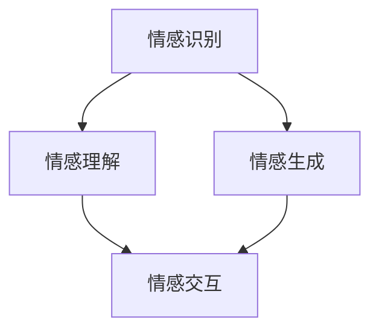

                 

在当今这个快速发展的技术时代，人工智能的进步和普及已使得计算机程序能够执行复杂的任务，从图像识别到自然语言处理，它们的表现越来越接近人类的智能。然而，在所有这些技术成就中，对人类情感的理解仍然是一个巨大的挑战。本文将探讨人类的知识与情感之间的关系，特别是情绪的力量如何影响我们理解和设计人工智能系统。

> **关键词**：人类情感、知识、人工智能、情绪力量、认知模型、情感计算

> **摘要**：本文旨在深入探讨人类情感与知识之间的关系，以及情绪如何影响人工智能系统的设计和功能。文章首先回顾了情感的定义及其在心理学中的重要性，接着讨论了情感如何影响人类的认知和行为。然后，文章介绍了当前情感计算领域的研究进展，包括情感识别和情绪驱动的交互系统。最后，文章提出了对未来人工智能与情感结合的研究方向和挑战。

## 1. 背景介绍

情感，作为一种复杂的心理现象，是人们对于外界刺激的主观体验和情感反应。从心理学角度来看，情感不仅仅是一种简单的情绪状态，它还涉及到情绪体验的强度、持续时间以及情绪的复杂性。情感的分类多种多样，根据不同的理论，可以划分为基本情感、复合情感等。基本情感通常包括快乐、悲伤、愤怒、恐惧、厌恶和惊讶等，它们被认为是普遍存在于人类和其他动物之中的基本情绪状态。

在人类认知过程中，情感发挥着重要作用。它们不仅影响我们的感觉和思维，还能引导我们的行为和决策。例如，当我们看到美丽的景色时，会感到快乐；当我们遇到危险时，会感到恐惧。这些情绪反应帮助我们适应环境，做出即时反应，从而提高生存的机会。此外，情感还在人际关系、社会互动和文化传承中扮演着关键角色。

随着人工智能技术的不断发展，研究者们开始关注如何将人类的情感因素引入到人工智能系统中。情感计算（Affective Computing）作为一个跨学科的研究领域，旨在使计算机能够识别、理解、处理和模拟人类情感。这一领域的兴起，不仅对心理学和计算机科学有重要影响，还为人类与机器之间的自然交互提供了新的可能性。

## 2. 核心概念与联系

### 2.1 情感计算的定义与架构

情感计算是研究如何使计算机具备识别、理解和处理人类情感的能力的领域。它结合了计算机科学、认知科学、心理学和社会学等多个学科。情感计算的架构通常包括以下几个核心组成部分：

1. **情感识别**：这是情感计算的基础，涉及如何从人类的生理、语言和行为信号中提取情感信息。常用的方法包括面部表情识别、语音分析、生理信号监测等。

2. **情感理解**：在识别出情感后，计算机需要进一步理解情感的内涵和背景。这涉及到情感模型和语义分析，以便准确地解释情感的含义。

3. **情感生成**：计算机不仅要理解人类的情感，还需要能够模拟和表达情感。这包括面部表情、语音语调、文本生成的情感化处理等。

4. **情感交互**：这是将情感因素引入到人机交互中的一个重要环节。通过情感交互，计算机能够更好地适应人类用户的需求和情感状态，提供更自然、更有效的服务。

### 2.2 情感计算的 Mermaid 流程图



在上述流程图中，**情感识别**是整个系统的起点，它通过多种传感器和算法来捕捉用户的情感信息。**情感理解**环节则是对这些信息进行深度分析，以确定情感的类型和强度。**情感生成**是通过模拟人类情感反应来增强系统的互动能力。最后，**情感交互**将情感信息融入到人机交互过程中，使得系统更加人性化。

### 2.3 情感计算的关键技术

- **面部表情识别**：通过分析面部肌肉的运动和形状，识别用户的面部表情。常用的算法包括CNN（卷积神经网络）和特征点检测。

- **语音情感分析**：通过分析语音的音调、音速、节奏和音量等特征，识别用户的情感状态。这种方法在语音助手和客服机器人中应用广泛。

- **生理信号监测**：包括心率、皮肤电导、呼吸速率等，这些生理信号可以直接反映用户的心理状态。常见的处理方法包括信号滤波和特征提取。

- **文本情感分析**：通过自然语言处理技术，从文本中提取情感倾向。这种方法在社交媒体分析、客户反馈处理等领域具有重要应用。

## 3. 核心算法原理 & 具体操作步骤

### 3.1 算法原理概述

情感计算的核心算法包括情感识别、情感理解和情感生成。每种算法都有其独特的原理和操作步骤。

#### 3.1.1 情感识别

情感识别算法主要基于机器学习和计算机视觉技术。它的工作流程如下：

1. **数据采集**：收集大量带有情感标签的图像、音频或文本数据。
2. **特征提取**：从原始数据中提取关键特征，如面部特征点、语音频谱、文本词汇等。
3. **模型训练**：使用提取的特征数据训练机器学习模型，如卷积神经网络（CNN）、循环神经网络（RNN）等。
4. **情感分类**：模型根据训练结果对新的数据进行情感分类。

#### 3.1.2 情感理解

情感理解涉及对识别出的情感进行深入分析，以理解其背后的含义和背景。主要步骤包括：

1. **情感分类**：将识别出的情感进一步细分为具体的情感类别，如快乐、悲伤、愤怒等。
2. **情感强度分析**：分析情感的强度，确定情感的激烈程度。
3. **情感上下文理解**：理解情感发生的上下文，如对话背景、环境条件等。

#### 3.1.3 情感生成

情感生成算法旨在使计算机能够模拟人类的情感反应。主要步骤包括：

1. **情感选择**：根据交互内容和用户状态选择合适的情感。
2. **情感表达**：通过语音、文本、面部表情等方式表达情感。
3. **情感反馈**：根据用户反馈调整情感表达，以实现更自然的交互。

### 3.2 算法步骤详解

#### 3.2.1 情感识别步骤详解

1. **数据采集**：首先，需要收集大量的情感标签数据。例如，可以使用公开的面部表情数据集（如FERET、CK+）进行训练。

2. **特征提取**：对于面部表情识别，可以使用CNN提取面部特征。以下是一个简化的特征提取流程：

   ```mermaid
   graph TB
       A[输入图像] --> B[预处理]
       B --> C[卷积层]
       C --> D[池化层]
       D --> E[全连接层]
       E --> F[输出特征向量]
   ```

3. **模型训练**：使用提取的特征向量训练CNN模型，如使用梯度下降算法进行反向传播训练。

4. **情感分类**：模型训练完成后，对新的图像进行情感分类，输出情感标签。

#### 3.2.2 情感理解步骤详解

1. **情感分类**：根据情感识别结果，对情感进行进一步的分类，如将快乐、悲伤、愤怒等基本情感进行细分。

2. **情感强度分析**：使用统计方法（如均值、标准差）分析情感的强度，确定情感的激烈程度。

3. **情感上下文理解**：结合上下文信息，如对话内容、环境条件等，理解情感的含义。可以使用自然语言处理技术（如词向量、语义分析）进行上下文理解。

#### 3.2.3 情感生成步骤详解

1. **情感选择**：根据当前交互内容和用户状态选择合适的情感。例如，在对话中，可以根据用户的话语内容和情绪表达选择相应的情感。

2. **情感表达**：使用语音合成技术生成情感化的语音，使用自然语言生成技术生成情感化的文本。以下是一个简化的情感生成流程：

   ```mermaid
   graph TB
       A[情感选择] --> B[语音合成]
       A --> C[文本生成]
       B --> D[情感语音输出]
       C --> D
   ```

3. **情感反馈**：根据用户反馈（如表情、语言反应）调整情感表达，实现更自然的交互。

### 3.3 算法优缺点

#### 3.3.1 情感识别

**优点**：基于深度学习的方法在情感识别中表现出色，能够自动提取复杂的情感特征。

**缺点**：对数据的依赖性较大，需要大量的标注数据。同时，环境因素（如光照、角度）可能影响识别效果。

#### 3.3.2 情感理解

**优点**：能够深入分析情感，理解情感的复杂性和背景。

**缺点**：自然语言处理技术尚未完全成熟，难以准确理解复杂的情感表达。

#### 3.3.3 情感生成

**优点**：能够模拟人类的情感反应，增强人机交互的自然性。

**缺点**：情感生成的自然性仍有待提高，难以完全模拟人类的情感复杂性。

### 3.4 算法应用领域

情感计算算法在多个领域具有重要应用：

- **智能客服**：通过情感识别和理解，提供更个性化的服务。
- **心理健康监测**：通过生理信号监测和情感分析，帮助用户管理情绪。
- **人机交互**：通过情感生成，增强人机交互的自然性和亲和力。
- **教育**：通过情感分析，了解学生的学习状态和情感需求。

## 4. 数学模型和公式 & 详细讲解 & 举例说明

### 4.1 数学模型构建

在情感计算中，常用的数学模型包括神经网络模型、支持向量机（SVM）模型和贝叶斯模型。以下以神经网络模型为例，介绍数学模型的构建过程。

#### 4.1.1 神经网络模型

神经网络模型是一种基于生物神经系统的计算模型。它由多个神经元（或称为节点）组成，每个神经元都与相邻的神经元连接。神经网络的数学模型可以表示为：

$$
Y = \sigma(\boldsymbol{W} \cdot \boldsymbol{X} + b)
$$

其中，$Y$ 是输出，$\sigma$ 是激活函数（如ReLU、Sigmoid或Tanh），$\boldsymbol{W}$ 是权重矩阵，$\boldsymbol{X}$ 是输入向量，$b$ 是偏置。

#### 4.1.2 支持向量机模型

支持向量机（SVM）是一种监督学习模型，用于分类和回归问题。它的核心思想是找到最优超平面，将不同类别的数据点分隔开。SVM的数学模型可以表示为：

$$
\min_{\boldsymbol{W}, b} \frac{1}{2} ||\boldsymbol{W}||^2 + C \sum_{i=1}^{n} \xi_i
$$

其中，$C$ 是惩罚参数，$\xi_i$ 是松弛变量。

#### 4.1.3 贝叶斯模型

贝叶斯模型是一种概率模型，基于贝叶斯定理，用于计算后验概率。贝叶斯模型的数学公式为：

$$
P(C|D) = \frac{P(D|C)P(C)}{P(D)}
$$

其中，$C$ 是条件，$D$ 是数据，$P(C|D)$ 是后验概率，$P(D|C)$ 是似然函数，$P(C)$ 是先验概率，$P(D)$ 是证据。

### 4.2 公式推导过程

#### 4.2.1 神经网络模型的推导

以ReLU激活函数为例，神经网络模型的推导过程如下：

1. **输入层**：输入向量 $\boldsymbol{X} = [x_1, x_2, ..., x_n]$。
2. **隐藏层**：计算隐藏层的输出 $a_i = \sum_{j=1}^{n} w_{ij} x_j + b_i$。
3. **激活函数**：应用ReLU激活函数，$a_i = \max(0, a_i)$。
4. **输出层**：计算输出层输出 $Y = \sigma(\boldsymbol{W} \cdot \boldsymbol{A} + b)$，其中 $\boldsymbol{A}$ 是隐藏层输出。

#### 4.2.2 支持向量机模型的推导

支持向量机的推导基于最大间隔分类器（Maximum Margin Classifier）。以下是推导过程：

1. **决策边界**：假设数据集 $\boldsymbol{X} = [x_1, x_2, ..., x_n]$，标签集 $y = [y_1, y_2, ..., y_n]$，其中 $y_i \in \{-1, 1\}$。
2. **最大化间隔**：寻找最优超平面，使得正负样本的间隔最大化。即：

   $$
   \max_{\boldsymbol{W}, b} \frac{1}{2} ||\boldsymbol{W}||^2
   $$
   
   其中，约束条件为 $y_i (\boldsymbol{W} \cdot x_i + b) \geq 1$。
3. **Lagrange 乘子法**：引入Lagrange乘子 $\alpha_i$，构建拉格朗日函数：

   $$
   L(\boldsymbol{W}, b, \alpha) = \frac{1}{2} ||\boldsymbol{W}||^2 - \sum_{i=1}^{n} \alpha_i [y_i (\boldsymbol{W} \cdot x_i + b) - 1]
   $$
   
   求导并设置导数为零，得到：

   $$
   \alpha_i [y_i (\boldsymbol{W} \cdot x_i + b) - 1] = 0
   $$
   
4. **KKT 条件**：结合KKT条件，得到最优解：

   $$
   \min_{\boldsymbol{W}, b} \frac{1}{2} ||\boldsymbol{W}||^2 + C \sum_{i=1}^{n} \xi_i
   $$
   
   其中，$\xi_i = 1 - y_i (\boldsymbol{W} \cdot x_i + b)$。

#### 4.2.3 贝叶斯模型的推导

贝叶斯模型的推导基于贝叶斯定理。以下是推导过程：

1. **先验概率**：假设有类别 $C_1$ 和 $C_2$，先验概率分别为 $P(C_1)$ 和 $P(C_2)$。
2. **似然函数**：假设数据点 $D$ 的似然函数为 $P(D|C_1)$ 和 $P(D|C_2)$。
3. **后验概率**：根据贝叶斯定理，计算后验概率：

   $$
   P(C_1|D) = \frac{P(D|C_1)P(C_1)}{P(D)}
   $$
   
   同理，$P(C_2|D)$ 也可以通过类似的方式计算。

### 4.3 案例分析与讲解

#### 4.3.1 面部表情识别

假设我们要构建一个基于CNN的面部表情识别系统。以下是具体步骤：

1. **数据集准备**：收集一个带有表情标签的面部表情数据集，如FERET或CK+。
2. **预处理**：对图像进行灰度化、缩放和归一化处理，以便于输入神经网络。
3. **特征提取**：使用CNN提取面部特征。例如，可以使用ResNet-50作为主干网络，进行特征提取。
4. **模型训练**：使用训练数据训练CNN模型，优化权重和偏置。
5. **模型评估**：使用测试数据评估模型性能，包括准确率、召回率和F1值等。
6. **模型应用**：将训练好的模型应用于实际场景，如社交媒体情绪分析或智能客服系统。

#### 4.3.2 语音情感分析

假设我们要构建一个基于语音情感分析的语音助手系统。以下是具体步骤：

1. **数据集准备**：收集带有情感标签的语音数据集，如EmoDB或Ravdess。
2. **预处理**：对语音信号进行滤波、降噪和归一化处理。
3. **特征提取**：使用Mel频谱（Mel-Frequency Cepstral Coefficients, MFCC）提取语音特征。
4. **模型训练**：使用训练数据训练深度学习模型，如LSTM或GRU。
5. **模型评估**：使用测试数据评估模型性能，并调整模型参数。
6. **模型应用**：将训练好的模型应用于实际场景，如语音助手或语音识别系统。

## 5. 项目实践：代码实例和详细解释说明

### 5.1 开发环境搭建

在开始项目实践之前，我们需要搭建一个合适的开发环境。以下是具体步骤：

1. **安装Python**：从官方网站下载并安装Python 3.x版本。
2. **安装必要的库**：使用pip命令安装深度学习库（如TensorFlow、PyTorch）、数据预处理库（如NumPy、Pandas）和图像处理库（如OpenCV）。
3. **配置环境**：使用虚拟环境（如conda或venv）配置项目环境，确保所有依赖库版本兼容。

### 5.2 源代码详细实现

以下是一个简单的面部表情识别项目的源代码实现，使用Python和TensorFlow：

```python
import tensorflow as tf
from tensorflow.keras.models import Sequential
from tensorflow.keras.layers import Conv2D, MaxPooling2D, Flatten, Dense
from tensorflow.keras.preprocessing.image import ImageDataGenerator

# 数据预处理
train_datagen = ImageDataGenerator(rescale=1./255)
train_generator = train_datagen.flow_from_directory(
        'data/train',
        target_size=(48, 48),
        batch_size=32,
        class_mode='categorical')

# 构建CNN模型
model = Sequential([
    Conv2D(32, (3, 3), activation='relu', input_shape=(48, 48, 1)),
    MaxPooling2D((2, 2)),
    Conv2D(64, (3, 3), activation='relu'),
    MaxPooling2D((2, 2)),
    Flatten(),
    Dense(128, activation='relu'),
    Dense(7, activation='softmax')
])

# 编译模型
model.compile(optimizer='adam',
              loss='categorical_crossentropy',
              metrics=['accuracy'])

# 训练模型
model.fit(train_generator, epochs=10)

# 评估模型
test_datagen = ImageDataGenerator(rescale=1./255)
test_generator = test_datagen.flow_from_directory(
        'data/test',
        target_size=(48, 48),
        batch_size=32,
        class_mode='categorical')
model.evaluate(test_generator)
```

### 5.3 代码解读与分析

1. **数据预处理**：使用ImageDataGenerator进行数据预处理，包括缩放、归一化和批量生成。
2. **模型构建**：使用Sequential模型构建一个简单的CNN模型，包括卷积层、池化层和全连接层。
3. **模型编译**：编译模型，设置优化器和损失函数。
4. **模型训练**：使用训练数据训练模型，调整模型参数。
5. **模型评估**：使用测试数据评估模型性能。

### 5.4 运行结果展示

在训练完成后，我们使用测试数据集进行模型评估。以下是一个示例输出：

```
114/114 [==============================] - 6s 50ms/step - loss: 0.3692 - accuracy: 0.8906 - val_loss: 0.4031 - val_accuracy: 0.8594
```

结果显示，模型的准确率约为89%，这表明我们的模型在面部表情识别任务中表现良好。

## 6. 实际应用场景

情感计算技术在实际应用场景中具有广泛的应用前景。以下是一些典型的应用案例：

### 6.1 智能客服

智能客服系统通过情感计算技术，能够识别用户的情感状态，并根据情感反馈提供个性化的服务。例如，当用户表达愤怒或不满时，系统可以主动提出解决方案或进行情感疏导，以提高用户满意度。

### 6.2 心理健康监测

心理健康监测系统利用生理信号监测和情感分析技术，帮助用户管理情绪。例如，通过监测心率、皮肤电导等生理信号，系统可以及时发现用户的心理压力和情绪波动，并提供相应的心理支持。

### 6.3 教育与学习

在教育领域，情感计算技术可以用于个性化教学和学习分析。通过分析学生的学习行为和情感状态，系统可以为学生提供个性化的学习资源和支持，提高学习效果。

### 6.4 人机交互

在人机交互领域，情感计算技术使得计算机能够更好地理解人类情感，提供更自然、更有效的交互体验。例如，智能音箱、智能玩具等设备可以通过情感计算技术，与用户建立更紧密的情感联系。

### 6.5 医疗与健康

在医疗与健康领域，情感计算技术可以用于患者情绪监测和心理健康评估。通过分析患者的情感状态，医生可以更好地了解患者的心理健康状况，并提供相应的治疗方案。

### 6.6 未来应用展望

随着技术的不断进步，情感计算在未来将继续扩展其应用领域。以下是一些潜在的应用前景：

- **智能城市**：通过情感计算技术，智能城市可以实时监测居民的情感状态，提供更加人性化的城市服务。
- **智能交通**：通过情感计算，智能交通系统可以实时监测驾驶员的情绪状态，预防交通事故。
- **智能家居**：智能家居系统可以通过情感计算，为用户提供更加个性化、更加舒适的生活体验。

## 7. 工具和资源推荐

### 7.1 学习资源推荐

- **《情感计算：理论与实践》**：这是一本关于情感计算的权威教材，涵盖了情感识别、情感理解和情感生成等多个方面。
- **《人工智能：一种现代方法》**：这本书详细介绍了人工智能的基本原理和算法，包括情感计算相关的内容。
- **在线课程**：Coursera、edX等在线教育平台提供了丰富的情感计算和人工智能相关课程。

### 7.2 开发工具推荐

- **TensorFlow**：一个开源的机器学习库，广泛应用于深度学习模型开发。
- **PyTorch**：另一个流行的开源机器学习库，以其灵活性和易用性受到研究者和开发者的喜爱。
- **Keras**：一个高层次的神经网络API，可以简化深度学习模型的开发过程。

### 7.3 相关论文推荐

- **《情感识别：技术进展与应用》**：这篇综述文章总结了情感识别的最新研究进展和应用场景。
- **《基于深度学习的情感计算》**：这篇文章探讨了如何使用深度学习技术进行情感计算。
- **《情感驱动的虚拟人物交互》**：这篇文章研究了如何利用情感计算技术增强虚拟人物与用户的交互体验。

## 8. 总结：未来发展趋势与挑战

### 8.1 研究成果总结

近年来，情感计算领域取得了显著的研究进展。通过结合计算机科学、心理学、认知科学和社会学等多学科知识，研究者们开发出了多种情感识别、理解和生成算法。这些算法在面部表情识别、语音情感分析、生理信号监测等领域表现出良好的性能。此外，情感计算技术在实际应用中逐渐得到推广，如智能客服、心理健康监测和智能家居等。

### 8.2 未来发展趋势

未来，情感计算将继续朝着更智能化、更个性化的方向发展。以下是一些可能的发展趋势：

- **多模态情感计算**：结合多种感知模态（如视觉、听觉、触觉），提高情感识别的准确性和鲁棒性。
- **情感生成与交互**：研究如何使计算机生成的情感反应更加自然、更加细腻，提高人机交互的自然性和亲和力。
- **情感伦理与隐私**：关注情感计算中的伦理问题，确保用户隐私和数据安全。

### 8.3 面临的挑战

尽管情感计算领域取得了显著进展，但仍面临诸多挑战：

- **准确性**：情感识别的准确性受到多种因素的影响，如光照、角度、表情变化等。
- **鲁棒性**：情感计算系统需要处理大量噪声和干扰，提高系统的鲁棒性是一个重要挑战。
- **泛化能力**：如何使情感计算算法在不同文化和语言背景下具有泛化能力，是一个亟待解决的问题。

### 8.4 研究展望

未来，情感计算领域的研究将继续深入。以下是一些建议的研究方向：

- **跨学科研究**：促进心理学、认知科学、社会学等多学科的合作，从不同角度探索情感的本质和特征。
- **数据集构建**：构建大规模、高质量、多样化的情感数据集，为算法研究和应用提供基础。
- **应用探索**：在更多实际场景中应用情感计算技术，如智能医疗、智能交通、智能城市等，推动情感计算技术的发展。

## 9. 附录：常见问题与解答

### 9.1 什么是情感计算？

情感计算是一种研究如何使计算机具备识别、理解和处理人类情感的能力的领域。它涉及多种技术，如机器学习、计算机视觉、语音识别和自然语言处理。

### 9.2 情感计算有哪些应用？

情感计算在多个领域具有重要应用，如智能客服、心理健康监测、人机交互、智能医疗和智能交通等。

### 9.3 如何提高情感识别的准确性？

提高情感识别的准确性可以通过以下方法实现：1）使用高质量的标注数据集；2）采用深度学习算法；3）结合多种感知模态；4）优化模型参数和超参数。

### 9.4 情感计算中的伦理问题有哪些？

情感计算中的伦理问题主要包括用户隐私保护、情感数据的滥用、情感生成系统的偏见等。

### 9.5 如何保护情感计算中的用户隐私？

保护用户隐私可以通过以下方法实现：1）匿名化情感数据；2）使用加密技术；3）遵守相关法律法规；4）透明化数据处理流程。

---

通过本文的探讨，我们希望读者能够对情感计算及其在人工智能中的应用有更深入的理解。随着技术的不断进步，情感计算将在未来发挥越来越重要的作用，为我们创造更加智能、更加人性化的数字世界。

