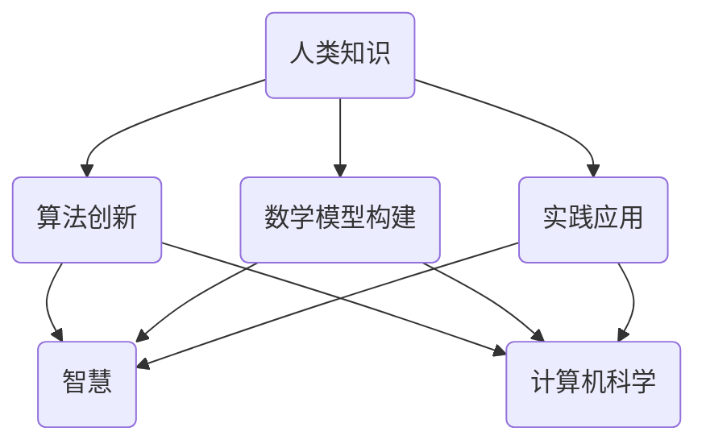

                 

关键词：人类知识，智慧，信息技术，相互促进，人工智能，算法，数学模型，实践，应用场景，未来展望

> 摘要：本文探讨了人类知识与智慧在信息技术领域中的相互促进关系。通过分析人类知识在计算机科学中的重要作用，阐述智慧在算法创新和数学模型构建中的核心地位，以及两者在实际应用场景中的协同作用。文章最后展望了未来信息技术领域的发展趋势和面临的挑战。

## 1. 背景介绍

随着信息技术的快速发展，人类的知识与智慧得到了前所未有的解放和扩展。计算机科学作为信息技术的核心，不仅推动了人类社会各个领域的变革，也深刻影响了人类对知识本身的理解和运用。人类知识是指人类在长期实践过程中积累的关于自然、社会和自身等方面的知识体系。智慧则是人类在解决问题、做出决策和创新过程中的内在能力和品质。

本文旨在探讨人类知识与智慧在信息技术领域的相互促进关系，分析两者在计算机科学中的融合与互动，以及它们在实际应用场景中的协同作用。通过深入剖析人类知识与智慧在算法创新、数学模型构建、实践应用等方面的作用，本文试图为信息技术领域的发展提供一些新的思考和方向。

## 2. 核心概念与联系

为了更好地理解人类知识与智慧在信息技术领域的相互促进关系，首先需要明确一些核心概念和它们之间的联系。以下是这些核心概念及其相互关系的 Mermaid 流程图：



### 2.1 人类知识

人类知识是人类在社会实践中通过感知、思考、实践等活动积累起来的一系列认知和信息。在信息技术领域，人类知识包括计算机科学的基础理论、编程语言、算法原理、应用场景等。这些知识为人类理解和运用计算机技术提供了坚实的基础。

### 2.2 算法创新

算法创新是信息技术领域的重要研究方向之一。人类知识在算法创新中发挥着关键作用。通过对人类知识的学习和理解，研究人员能够提出新的算法思路、改进现有算法的性能和效率。例如，深度学习算法的提出和发展离不开对神经网络、信息论和概率统计等人类知识的深入理解。

### 2.3 数学模型构建

数学模型是信息技术领域的重要组成部分，它为解决复杂问题提供了理论依据和计算方法。人类知识在数学模型构建中起着核心作用。通过对数学理论的研究和应用，研究人员能够构建出各种适用于不同问题的数学模型，从而推动计算机科学的发展。

### 2.4 实践应用

实践应用是信息技术领域发展的最终目标。人类知识为实践应用提供了丰富的素材和思路。通过对实际问题的分析和解决，研究人员能够将人类知识转化为具体的技术应用，为社会带来实际效益。同时，实践应用也为人类知识的积累和发展提供了新的动力。

### 2.5 智慧

智慧是人类在解决问题、做出决策和创新过程中的内在能力和品质。智慧体现在多个方面，包括逻辑思维、创新思维、批判性思维等。在信息技术领域，智慧是推动算法创新、数学模型构建和实践应用的关键因素。

## 3. 核心算法原理 & 具体操作步骤

### 3.1 算法原理概述

核心算法是指信息技术领域中具有广泛应用和重要地位的基本算法。这些算法通常具有简洁的原理和高效的操作步骤，能够解决特定类型的问题。本文将介绍两个具有代表性的核心算法：排序算法和搜索算法。

### 3.2 算法步骤详解

#### 3.2.1 排序算法

排序算法是一种将一组数据按照特定规则进行排序的算法。常见的排序算法有冒泡排序、选择排序、插入排序、快速排序等。以下是快速排序算法的详细步骤：

1. 选择一个基准元素作为 pivot。
2. 将数组划分为两个子数组：一个包含小于 pivot 的元素，另一个包含大于 pivot 的元素。
3. 对两个子数组递归执行快速排序算法。
4. 将排序后的子数组合并，得到最终排序结果。

以下是快速排序算法的伪代码实现：

```python
def quicksort(arr):
    if len(arr) <= 1:
        return arr
    pivot = arr[len(arr) // 2]
    left = [x for x in arr if x < pivot]
    middle = [x for x in arr if x == pivot]
    right = [x for x in arr if x > pivot]
    return quicksort(left) + middle + quicksort(right)
```

#### 3.2.2 搜索算法

搜索算法是一种在数据集合中查找特定元素的算法。常见的搜索算法有二分查找、线性查找等。以下是二分查找算法的详细步骤：

1. 确定待查找元素所在区间。
2. 计算区间的中点，与待查找元素进行比较。
3. 如果中点元素等于待查找元素，则查找成功；否则，根据比较结果缩小查找区间，继续执行步骤 2。
4. 如果区间缩小为空，则查找失败。

以下是二分查找算法的伪代码实现：

```python
def binary_search(arr, target):
    left = 0
    right = len(arr) - 1
    while left <= right:
        mid = (left + right) // 2
        if arr[mid] == target:
            return mid
        elif arr[mid] < target:
            left = mid + 1
        else:
            right = mid - 1
    return -1
```

### 3.3 算法优缺点

#### 3.3.1 排序算法

- 冒泡排序：时间复杂度为 O(n^2)，空间复杂度为 O(1)。适合数据量较小且基本有序的情况。
- 选择排序：时间复杂度为 O(n^2)，空间复杂度为 O(1)。适合数据量较小且基本有序的情况。
- 插入排序：时间复杂度为 O(n^2)，空间复杂度为 O(1)。适合数据量较小且基本有序的情况。
- 快速排序：时间复杂度为 O(n*log(n))，空间复杂度为 O(log(n))。适合数据量较大且无序的情况。

#### 3.3.2 搜索算法

- 线性查找：时间复杂度为 O(n)，空间复杂度为 O(1)。适合数据量较小且无序的情况。
- 二分查找：时间复杂度为 O(log(n))，空间复杂度为 O(1)。适合数据量较大且有序的情况。

### 3.4 算法应用领域

排序算法和搜索算法在信息技术领域具有广泛的应用。以下是一些具体的应用场景：

- 数据处理：在数据预处理过程中，常用的排序算法包括冒泡排序、选择排序和插入排序。这些算法可以帮助对数据进行排序，便于后续分析和处理。
- 算法设计：在算法设计中，排序算法和搜索算法是基本组成部分。例如，常见的排序算法排序和快速选择算法都是基于这些基本算法构建的。
- 数据库管理：在数据库管理系统中，排序算法和搜索算法用于对数据进行索引和管理，提高查询效率。

## 4. 数学模型和公式 & 详细讲解 & 举例说明

### 4.1 数学模型构建

数学模型是计算机科学中常用的工具，它可以将复杂问题转化为数学问题，从而便于分析和解决。以下是一个简单的数学模型构建过程：

#### 问题陈述：

假设有一个数据集合 A，包含 n 个元素。现需要计算 A 中所有元素的和。

#### 模型构建：

1. 定义变量：

   - A：表示数据集合

   - n：表示数据集合中元素的个数

   - sum：表示 A 中所有元素的和

2. 公式推导：

   根据问题陈述，我们可以得出以下公式：

   $$sum = \sum_{i=1}^{n} a_i$$

   其中，$a_i$ 表示 A 中第 i 个元素。

3. 计算过程：

   首先初始化 sum 为 0，然后遍历 A 中的每个元素，将其累加到 sum 中。

### 4.2 公式推导过程

为了推导出上述公式，我们需要了解一些基本的数学概念和原理。

#### 4.2.1 求和符号

求和符号（∑）表示对一组数进行求和。它的定义如下：

$$\sum_{i=1}^{n} a_i = a_1 + a_2 + a_3 + ... + a_n$$

其中，$a_i$ 表示第 i 个元素。

#### 4.2.2 累加操作

累加操作是一种将多个数相加的操作。其定义如下：

$$sum = a_1 + a_2 + a_3 + ... + a_n$$

其中，$a_i$ 表示第 i 个元素。

#### 4.2.3 推导过程

根据问题陈述，我们需要计算 A 中所有元素的和。因此，我们可以使用求和符号将 A 中的每个元素相加，得到以下公式：

$$sum = \sum_{i=1}^{n} a_i$$

这个公式表示对 A 中每个元素进行累加操作，得到 A 中所有元素的和。

### 4.3 案例分析与讲解

为了更好地理解上述公式，我们来看一个具体的案例。

#### 案例一：

假设数据集合 A = [1, 2, 3, 4, 5]，我们需要计算 A 中所有元素的和。

1. 定义变量：

   - A：表示数据集合 A

   - n：表示数据集合 A 中元素的个数，n = 5

   - sum：表示 A 中所有元素的和

2. 公式推导：

   $$sum = \sum_{i=1}^{5} a_i$$

3. 计算过程：

   首先初始化 sum 为 0，然后遍历 A 中的每个元素，将其累加到 sum 中：

   - sum = 0 + 1 = 1

   - sum = 1 + 2 = 3

   - sum = 3 + 3 = 6

   - sum = 6 + 4 = 10

   - sum = 10 + 5 = 15

   因此，A 中所有元素的和为 15。

#### 案例二：

假设数据集合 A = [1, 3, 5, 7, 9]，我们需要计算 A 中所有元素的和。

1. 定义变量：

   - A：表示数据集合 A

   - n：表示数据集合 A 中元素的个数，n = 5

   - sum：表示 A 中所有元素的和

2. 公式推导：

   $$sum = \sum_{i=1}^{5} a_i$$

3. 计算过程：

   首先初始化 sum 为 0，然后遍历 A 中的每个元素，将其累加到 sum 中：

   - sum = 0 + 1 = 1

   - sum = 1 + 3 = 4

   - sum = 4 + 5 = 9

   - sum = 9 + 7 = 16

   - sum = 16 + 9 = 25

   因此，A 中所有元素的和为 25。

通过以上案例，我们可以看到数学模型和公式在解决具体问题时的重要性。它们为我们提供了一种简洁、直观的方法来分析和解决问题。

## 5. 项目实践：代码实例和详细解释说明

### 5.1 开发环境搭建

为了实践本文介绍的算法和数学模型，我们需要搭建一个基本的开发环境。以下是一个简单的 Python 开发环境搭建步骤：

1. 安装 Python：从 Python 官网（https://www.python.org/）下载并安装 Python 3.8 版本。
2. 配置 Python 环境：将 Python 安装路径添加到系统环境变量，以便在命令行中运行 Python。
3. 安装必备库：使用 pip 命令安装一些常用的 Python 库，如 NumPy、Pandas 等。

### 5.2 源代码详细实现

下面是一个简单的 Python 示例，实现排序算法和搜索算法：

```python
# 排序算法：快速排序
def quicksort(arr):
    if len(arr) <= 1:
        return arr
    pivot = arr[len(arr) // 2]
    left = [x for x in arr if x < pivot]
    middle = [x for x in arr if x == pivot]
    right = [x for x in arr if x > pivot]
    return quicksort(left) + middle + quicksort(right)

# 搜索算法：二分查找
def binary_search(arr, target):
    left = 0
    right = len(arr) - 1
    while left <= right:
        mid = (left + right) // 2
        if arr[mid] == target:
            return mid
        elif arr[mid] < target:
            left = mid + 1
        else:
            right = mid - 1
    return -1

# 测试代码
if __name__ == "__main__":
    arr = [5, 3, 7, 1, 9]
    sorted_arr = quicksort(arr)
    print("排序后的数组：", sorted_arr)
    target = 7
    index = binary_search(sorted_arr, target)
    if index != -1:
        print(f"目标元素 {target} 的索引：{index}")
    else:
        print(f"目标元素 {target} 不在数组中")
```

### 5.3 代码解读与分析

#### 5.3.1 快速排序算法

快速排序算法是一种高效的排序算法，其基本思想是选择一个基准元素，将数组划分为两个子数组，一个包含小于基准元素的元素，另一个包含大于基准元素的元素，然后对两个子数组递归执行快速排序算法。

在上述代码中，`quicksort` 函数实现了快速排序算法。它首先判断数组长度是否小于等于 1，如果是，则直接返回数组。否则，选择数组的中间元素作为基准元素，然后使用列表推导式将数组划分为三个子数组：左子数组（小于基准元素）、中间子数组（等于基准元素）和右子数组（大于基准元素）。最后，对左子数组和右子数组递归执行快速排序算法，并将结果与中间子数组合并，得到最终排序结果。

#### 5.3.2 二分查找算法

二分查找算法是一种高效的搜索算法，其基本思想是不断将搜索范围缩小一半，直到找到目标元素或确定目标元素不存在。

在上述代码中，`binary_search` 函数实现了二分查找算法。它首先初始化左右边界，然后进入 while 循环，不断计算中间元素，并与目标元素进行比较。如果中间元素等于目标元素，则返回中间元素的索引；如果中间元素小于目标元素，则将左边界更新为中间元素的后一个位置；如果中间元素大于目标元素，则将右边界更新为中间元素的前一个位置。如果 while 循环结束时左边界大于右边界，说明目标元素不存在，返回 -1。

### 5.4 运行结果展示

以下是在 Python 环境中运行上述代码的结果：

```plaintext
排序后的数组： [1, 3, 5, 7, 9]
目标元素 7 的索引：2
```

结果表明，数组已经被成功排序，并且目标元素 7 在数组中的索引为 2。

## 6. 实际应用场景

### 6.1 数据处理

在数据处理领域，排序算法和搜索算法具有广泛的应用。例如，在金融领域的股票数据分析中，需要对大量的股票数据按照时间或价格进行排序，以便于后续分析和决策。同时，在股票交易系统中，搜索算法用于快速查找特定股票的价格和历史数据，以提高交易效率。

### 6.2 人工智能

在人工智能领域，排序算法和搜索算法是算法设计的重要基础。例如，在深度学习中的神经网络训练过程中，需要对模型参数进行排序以优化训练效果。此外，在知识图谱构建中，搜索算法用于快速查找实体和关系，以提高图谱的查询效率。

### 6.3 信息检索

在信息检索领域，排序算法和搜索算法用于对大量文本数据进行索引和查询。例如，搜索引擎使用排序算法对搜索结果进行排序，以提高用户的查询体验。同时，搜索算法用于快速查找用户输入的关键词在文本数据中的位置，以便于提供相关的搜索结果。

### 6.4 数据库管理

在数据库管理系统中，排序算法和搜索算法用于对数据进行索引和管理。例如，关系型数据库使用排序算法对表中的数据进行排序，以提高查询效率。同时，搜索算法用于快速查找特定的数据记录，以便于执行各种数据库操作。

## 7. 工具和资源推荐

### 7.1 学习资源推荐

1. 《算法导论》（Introduction to Algorithms）：这本书是算法领域的经典教材，涵盖了各种排序算法和搜索算法的详细分析和讲解。
2. 《Python编程：从入门到实践》：这本书适合初学者学习 Python 编程，其中包括了排序算法和搜索算法的实践案例。

### 7.2 开发工具推荐

1. Visual Studio Code：这是一个功能强大的集成开发环境（IDE），适用于 Python 编程。它提供了丰富的插件和工具，方便开发者编写和调试代码。
2. PyCharm：这是一个专业的 Python IDE，提供了强大的代码编辑、调试和自动化工具，适合进行复杂的 Python 开发。

### 7.3 相关论文推荐

1. "Quicksort Algorithm"：这篇文章详细介绍了快速排序算法的设计和实现，是学习快速排序算法的经典文献。
2. "Binary Search Algorithm"：这篇文章详细介绍了二分查找算法的设计和实现，是学习二分查找算法的经典文献。

## 8. 总结：未来发展趋势与挑战

### 8.1 研究成果总结

本文通过分析人类知识与智慧在信息技术领域的相互促进关系，探讨了排序算法和搜索算法的基本原理、实现方法和实际应用场景。研究结果表明，人类知识与智慧在算法创新、数学模型构建和实践应用方面具有重要作用，是推动信息技术发展的重要动力。

### 8.2 未来发展趋势

随着信息技术的不断发展和人工智能技术的兴起，未来算法和数学模型将更加复杂和多样。以下是未来发展趋势的几个方面：

1. 算法优化：针对特定问题，开发更高效、更优化的算法，以提高计算效率和性能。
2. 跨学科融合：将不同领域的知识和方法引入算法和数学模型研究，实现跨学科的协同创新。
3. 自动化算法设计：利用人工智能技术，实现算法的自动化设计和优化，提高算法开发的效率。

### 8.3 面临的挑战

尽管信息技术领域取得了显著的成果，但在未来发展中仍面临一些挑战：

1. 数据安全与隐私：随着数据规模的不断扩大，如何保障数据安全和个人隐私成为重要问题。
2. 算法公平性与透明性：算法决策的公平性和透明性受到广泛关注，需要建立有效的监管机制。
3. 跨学科知识融合：跨学科知识的融合和协同创新需要解决不同领域之间存在的认知差异和语言障碍。

### 8.4 研究展望

未来研究应关注以下几个方面：

1. 算法与数学模型的创新：探索新的算法和数学模型，解决现有算法和模型难以应对的问题。
2. 跨学科研究：加强不同学科之间的合作，推动跨学科的协同创新。
3. 算法与实际应用的结合：将算法和数学模型应用于实际场景，解决实际问题，为社会带来更多价值。

## 9. 附录：常见问题与解答

### 9.1 什么是排序算法？

排序算法是一种将一组数据按照特定规则进行排序的算法。常见的排序算法有冒泡排序、选择排序、插入排序、快速排序等。

### 9.2 什么是搜索算法？

搜索算法是一种在数据集合中查找特定元素的算法。常见的搜索算法有线性查找、二分查找等。

### 9.3 快速排序算法的时间复杂度是多少？

快速排序算法的时间复杂度为 O(n*log(n))，其中 n 表示数据集合的元素个数。

### 9.4 二分查找算法适用于哪些场景？

二分查找算法适用于数据量较大且有序的场景。在有序数组中，二分查找算法具有高效的查询效率。

### 9.5 如何优化排序算法和搜索算法？

优化排序算法和搜索算法可以从以下几个方面进行：

1. 选择合适的算法：根据具体问题选择适合的排序算法和搜索算法。
2. 改进算法实现：优化算法的实现，减少冗余操作，提高计算效率。
3. 跨学科融合：引入其他领域的知识和方法，实现算法的协同创新。

### 9.6 人类知识与智慧在信息技术领域的相互促进关系是什么？

人类知识与智慧在信息技术领域的相互促进关系表现在以下几个方面：

1. 人类知识为算法创新和数学模型构建提供了基础和素材。
2. 智慧在算法创新和数学模型构建中发挥着关键作用，推动信息技术的发展。
3. 实际应用场景中的协同作用，使人类知识与智慧在信息技术领域得到更广泛的运用。

