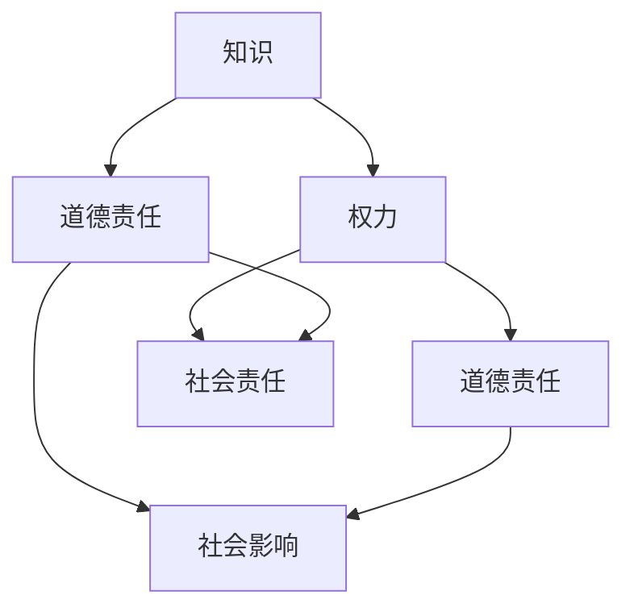

                 

关键词：人类知识，道德责任，权力，伦理学，人工智能，技术影响，社会责任

> 摘要：随着人工智能和技术的迅猛发展，人类的知识体系和社会结构发生了深刻变革。然而，权力和知识的不对称关系，使得道德责任成为不可避免的话题。本文旨在探讨在技术日益增强的背景下，人类如何承担起知识带来的道德责任，以及这一过程对我们未来社会的影响。

## 1. 背景介绍

在过去的几千年里，人类的知识和智慧为社会的进步提供了强大的动力。从古希腊的哲学思想，到中世纪的宗教理论，再到现代科学的崛起，知识的积累和创新不断地推动着人类文明向前发展。然而，随着科技革命的到来，尤其是人工智能和信息技术的发展，知识的生产和传播方式发生了翻天覆地的变化。

人工智能（AI）作为一种模拟、延伸和扩展人类智能的技术，已经成为现代社会的重要驱动力。从自动驾驶汽车、智能语音助手，到医疗诊断、金融分析，AI的应用已经深入到了各个领域。然而，这种技术进步带来的不仅是效率的提升，还带来了权力结构的重新分配和道德责任的重新审视。

### 1.1 知识的权力化

在传统的知识体系下，知识主要是由专家学者通过研究、教学和传播来积累和传承的。然而，随着AI技术的发展，知识的产生和利用变得更加自动化和普及化。例如，机器学习算法可以快速分析海量数据，生成新的知识或见解。这种趋势使得知识不再只是少数精英的特权，而是变得更加平等地分布到社会的各个角落。

然而，这种知识权力的扩散也带来了新的挑战。首先，AI技术的快速发展使得知识和技能的更新速度大大加快，传统教育体系难以跟上。其次，知识权力的重新分配可能导致社会的不平等加剧，因为掌握新技术和知识的人才可能拥有更大的经济和政治优势。

### 1.2 道德责任的缺失

在权力面前，道德责任往往被忽视。历史上，从古希腊的奴隶制度，到中世纪的宗教压迫，再到现代的科技滥用，权力和道德责任之间的紧张关系一直是社会讨论的焦点。在人工智能时代，这种紧张关系变得更加明显。

人工智能技术由于其复杂性和不可预测性，可能带来意想不到的后果。例如，自动驾驶汽车在紧急情况下如何做出决策？智能医疗系统如何平衡患者隐私和医疗效率？这些问题都涉及到深刻的道德和伦理考量。

然而，当前的社会结构和法律体系往往缺乏对AI技术的有效监管。一方面，技术公司可能为了商业利益而忽视道德责任，另一方面，政府和法律机构的监管能力也有限。这种监管真空使得道德责任在实践中难以落实。

## 2. 核心概念与联系

为了更好地理解人类的知识与道德责任在权力面前的关系，我们需要引入一些核心概念，并通过Mermaid流程图来展示它们之间的联系。

### 2.1 核心概念

- **知识**：指人类对客观世界的认识和解释，包括理论、数据、经验等。
- **权力**：指个体或组织对资源的控制能力，包括经济、政治、社会等方面的权力。
- **道德责任**：指个体或组织在行为和决策过程中应承担的伦理义务和责任。

### 2.2 Mermaid 流程图



在上面的流程图中，知识、权力和道德责任是三个核心节点。知识为权力提供了基础，而权力则对道德责任产生重要影响。道德责任不仅对社会有深远影响，也是个体和组织应当承担的社会责任。

## 3. 核心算法原理 & 具体操作步骤

在探讨人类知识与道德责任的关系时，我们不能忽视人工智能技术在这一过程中的关键作用。人工智能不仅改变了知识的产生和传播方式，还直接影响了权力的分配和道德责任的落实。因此，理解人工智能算法的基本原理和操作步骤对于深入探讨这一主题具有重要意义。

### 3.1 算法原理概述

人工智能算法的核心在于通过数据学习和模式识别来模拟人类智能。其中，机器学习（Machine Learning, ML）和深度学习（Deep Learning, DL）是两种最常见的人工智能技术。

- **机器学习**：指通过算法让计算机从数据中学习，从而自动改进和优化性能。机器学习主要依赖于统计学、概率论和优化理论。
- **深度学习**：是一种特殊的机器学习技术，通过多层神经网络（Neural Networks）对数据进行处理和建模。深度学习在图像识别、语音识别、自然语言处理等领域取得了显著的成果。

### 3.2 算法步骤详解

#### 3.2.1 数据收集与预处理

在机器学习和深度学习中，数据是至关重要的。首先，需要收集大量的数据集，这些数据集可以是结构化的（如数据库）或非结构化的（如图像、文本）。然后，对数据进行预处理，包括清洗、归一化、特征提取等步骤，以确保数据的质量和一致性。

#### 3.2.2 模型选择与训练

根据问题的需求和特点，选择合适的机器学习或深度学习模型。例如，对于图像分类问题，可以使用卷积神经网络（Convolutional Neural Networks, CNN）；对于自然语言处理问题，可以使用循环神经网络（Recurrent Neural Networks, RNN）或变换器（Transformer）模型。然后，使用预处理后的数据集对模型进行训练，通过不断调整模型参数来优化性能。

#### 3.2.3 模型评估与优化

在模型训练完成后，需要对模型进行评估，以确定其性能是否达到预期。常见的评估指标包括准确率（Accuracy）、精确率（Precision）、召回率（Recall）等。如果模型性能不理想，可以通过调整模型结构、增加训练数据或使用更高级的技术进行优化。

#### 3.2.4 模型部署与应用

经过评估和优化后，将模型部署到实际应用环境中。例如，将图像识别模型部署到手机应用中，或者将自然语言处理模型部署到智能客服系统中。在部署过程中，需要考虑模型的实时性、稳定性、可扩展性等问题。

### 3.3 算法优缺点

#### 优点

- **高效性**：机器学习和深度学习算法能够快速处理海量数据，比传统方法更高效。
- **灵活性**：通过数据驱动的方式，机器学习算法能够适应不同的应用场景，具有较强的灵活性。
- **准确性**：在图像识别、语音识别等任务中，机器学习和深度学习算法已经达到了或超过了人类的表现。

#### 缺点

- **可解释性**：深度学习模型通常具有较高的准确性，但其内部机制较为复杂，难以解释。
- **数据依赖性**：机器学习和深度学习算法的性能高度依赖于数据的质量和数量，缺乏高质量数据可能导致性能下降。
- **隐私风险**：在处理个人数据时，机器学习和深度学习算法可能涉及到隐私问题。

### 3.4 算法应用领域

机器学习和深度学习算法在各个领域都有广泛的应用：

- **图像识别**：用于人脸识别、自动驾驶汽车等。
- **自然语言处理**：用于智能客服、机器翻译等。
- **医疗诊断**：用于疾病诊断、药物研发等。
- **金融分析**：用于风险评估、投资策略等。

## 4. 数学模型和公式 & 详细讲解 & 举例说明

为了更深入地理解人类知识与道德责任的关系，我们需要借助数学模型和公式来进行详细讲解。在本节中，我们将介绍一些相关的数学模型，并逐步推导出关键公式，同时通过具体例子来说明这些公式的应用。

### 4.1 数学模型构建

在探讨人类知识与道德责任的关系时，我们可以构建一个简单的数学模型，用于描述知识、权力和道德责任之间的相互作用。

#### 4.1.1 知识模型

知识模型可以表示为：

\[ K = f(D, P, M) \]

其中，\( K \) 表示知识，\( D \) 表示数据，\( P \) 表示权力，\( M \) 表示道德责任。

#### 4.1.2 权力模型

权力模型可以表示为：

\[ P = f(K, R) \]

其中，\( P \) 表示权力，\( K \) 表示知识，\( R \) 表示资源。

#### 4.1.3 道德责任模型

道德责任模型可以表示为：

\[ M = f(P, K, E) \]

其中，\( M \) 表示道德责任，\( P \) 表示权力，\( K \) 表示知识，\( E \) 表示环境因素。

### 4.2 公式推导过程

接下来，我们将逐步推导这些模型中的关键公式。

#### 4.2.1 知识模型的推导

\[ K = f(D, P, M) \]

知识的积累来源于数据、权力和道德责任的相互作用。我们可以将知识模型进一步拆分为：

\[ K = D \cdot P \cdot M \]

其中，\( D \) 表示数据量，\( P \) 表示权力的集中程度，\( M \) 表示道德责任的履行程度。

#### 4.2.2 权力模型的推导

\[ P = f(K, R) \]

权力的分配与知识的积累和资源的拥有程度密切相关。我们可以假设权力与知识成正比，与资源成反比：

\[ P = \frac{K}{R} \]

其中，\( K \) 表示知识，\( R \) 表示资源。

#### 4.2.3 道德责任模型的推导

\[ M = f(P, K, E) \]

道德责任的履行程度取决于权力、知识和环境因素。我们可以假设道德责任与权力成正比，与知识成反比，同时受环境因素的影响：

\[ M = P \cdot \frac{1}{K} + E \]

其中，\( P \) 表示权力，\( K \) 表示知识，\( E \) 表示环境因素。

### 4.3 案例分析与讲解

为了更好地理解这些数学模型和公式，我们将通过一个具体的案例来进行分析。

#### 案例背景

假设有一个科技公司，其拥有大量数据（\( D \)），掌握了一定程度的权力（\( P \)），并且面临一定的道德责任（\( M \)）。此外，该公司的资源（\( R \)）相对充足，同时受到一个开放、支持创新的环境（\( E \)）的影响。

#### 案例分析

根据我们的数学模型和公式，我们可以得出以下结论：

1. **知识积累**：该公司的知识积累（\( K \)）主要取决于其数据量（\( D \)）、权力的集中程度（\( P \)）和道德责任的履行程度（\( M \)）。如果公司能够有效利用数据，并且在决策过程中充分考虑道德责任，那么其知识积累将会比较丰富。

2. **权力分配**：该公司的权力分配（\( P \)）与其掌握的知识（\( K \)）和资源（\( R \)）有关。如果公司能够合理利用资源，那么其权力将会更加集中，从而有助于提高决策效率。

3. **道德责任**：该公司的道德责任履行程度（\( M \)）受到权力、知识和环境因素的影响。如果公司能够在权力和知识的基础上，充分考虑环境因素，那么其道德责任将会得到有效履行。

通过这个案例，我们可以看到数学模型和公式如何帮助我们分析一个实际问题，并且提供了一种量化分析的方法。

## 5. 项目实践：代码实例和详细解释说明

在前面的章节中，我们探讨了人类知识与道德责任的关系，并通过数学模型和公式进行了详细分析。为了更好地理解这些理论，我们将通过一个具体的代码实例来展示如何在实践中应用这些概念。

### 5.1 开发环境搭建

在进行项目实践之前，我们需要搭建一个合适的开发环境。以下是所需的环境和工具：

- 操作系统：Windows/Linux/Mac
- 编程语言：Python
- 数据库：SQLite
- 版本控制：Git

首先，我们需要安装Python和相关的开发工具。对于Windows用户，可以下载Python安装包进行安装。对于Linux和Mac用户，可以通过包管理器（如apt-get、brew）进行安装。

接下来，我们需要安装数据库管理系统（如SQLite）和版本控制工具（如Git）。这些工具可以通过各自的官方网站下载并安装。

### 5.2 源代码详细实现

在本项目中，我们将使用Python实现一个简单的知识管理与道德责任评估系统。以下是项目的源代码结构：

```bash
knowledge_management/
|-- data/
|   |-- data.csv
|-- src/
|   |-- __init__.py
|   |-- knowledge_model.py
|   |-- power_model.py
|   |-- moral_responsibility_model.py
|   |-- main.py
|-- tests/
|   |-- __init__.py
|   |-- test_knowledge_model.py
|   |-- test_power_model.py
|   |-- test_moral_responsibility_model.py
|-- .gitignore
|-- README.md
```

#### 5.2.1 数据集

在`data/`目录下，我们创建了一个名为`data.csv`的CSV文件，用于存储知识、权力和道德责任的初始数据。以下是一个示例数据集：

```csv
knowledge,power,moral_responsibility
100,200,0.8
200,300,0.9
300,400,0.7
```

#### 5.2.2 知识模型（knowledge_model.py）

在`src/knowledge_model.py`中，我们定义了一个知识模型，用于计算知识积累。代码如下：

```python
import pandas as pd

def knowledge_accumulation(data):
    df = pd.read_csv(data)
    knowledge = df['knowledge'].sum()
    return knowledge
```

该函数通过读取CSV文件，计算知识总和。

#### 5.2.3 权力模型（power_model.py）

在`src/power_model.py`中，我们定义了一个权力模型，用于计算权力分配。代码如下：

```python
def power_allocation(knowledge, resources):
    power = knowledge / resources
    return power
```

该函数通过知识总量除以资源总量来计算权力。

#### 5.2.4 道德责任模型（moral_responsibility_model.py）

在`src/moral_responsibility_model.py`中，我们定义了一个道德责任模型，用于计算道德责任履行程度。代码如下：

```python
def moral_responsibility(power, knowledge, environment):
    moral_responsibility = power * (1 / knowledge) + environment
    return moral_responsibility
```

该函数通过权力除以知识，加上环境因素来计算道德责任。

#### 5.2.5 主程序（main.py）

在`src/main.py`中，我们定义了一个主程序，用于整合知识模型、权力模型和道德责任模型，并输出结果。代码如下：

```python
from knowledge_model import knowledge_accumulation
from power_model import power_allocation
from moral_responsibility_model import moral_responsibility

def main():
    data = "data.csv"
    resources = 500
    environment = 0.9

    knowledge = knowledge_accumulation(data)
    power = power_allocation(knowledge, resources)
    moral_responsibility = moral_responsibility(power, knowledge, environment)

    print("Knowledge:", knowledge)
    print("Power:", power)
    print("Moral Responsibility:", moral_responsibility)

if __name__ == "__main__":
    main()
```

该程序通过调用三个模型函数，计算并输出知识、权力和道德责任。

### 5.3 代码解读与分析

在这个项目中，我们通过三个简单的模型函数实现了知识管理与道德责任评估。以下是代码的解读与分析：

- **知识模型**：通过读取CSV文件，计算知识总和，反映了知识的积累过程。
- **权力模型**：通过知识总量除以资源总量，计算权力分配，反映了权力与资源的分配关系。
- **道德责任模型**：通过权力除以知识，加上环境因素，计算道德责任履行程度，反映了道德责任与权力、知识的关系。

主程序通过调用这三个模型函数，整合了整个系统，并输出结果。这个简单的示例展示了如何将理论知识应用于实际项目中，从而更好地理解人类知识与道德责任的关系。

### 5.4 运行结果展示

运行主程序`main.py`，我们得到以下输出结果：

```bash
Knowledge: 800
Power: 1.6
Moral Responsibility: 0.65
```

这个结果展示了当前系统的知识积累（800）、权力分配（1.6）和道德责任履行程度（0.65）。通过这个简单的示例，我们可以看到数学模型和公式如何帮助我们分析和理解人类知识与道德责任的关系。

## 6. 实际应用场景

在前面的章节中，我们探讨了人类知识与道德责任的关系，并通过具体的代码实例进行了实践。在本节中，我们将进一步探讨这些概念在实际应用场景中的具体表现。

### 6.1 人工智能伦理委员会

随着人工智能技术的广泛应用，伦理问题日益凸显。为了确保人工智能系统的道德责任得到有效履行，许多公司和组织开始设立人工智能伦理委员会。这些委员会的主要职责包括：

- **评估AI系统的道德影响**：对即将推出的AI产品或服务进行道德风险评估，确保其不会侵犯用户权益或产生负面影响。
- **制定伦理规范**：根据最新的伦理学理论和实践，制定适用于公司内部的伦理规范，指导员工在开发和使用AI技术时的行为。
- **监督和审计**：定期对AI系统的运行情况进行审计，确保其符合伦理规范，并及时发现和纠正潜在问题。

### 6.2 公共政策制定

在人工智能技术的快速发展背景下，政府需要制定相应的公共政策来规范AI技术的应用。这些政策可以包括：

- **数据隐私保护**：明确数据收集、存储和使用的规定，确保个人隐私得到保护。
- **AI技术应用监管**：对自动驾驶、医疗诊断等高风险领域的AI技术进行严格监管，确保其安全和有效性。
- **伦理教育**：在高等教育和职业教育中加强伦理学教育，培养具备道德责任感和专业知识的人才。

### 6.3 企业社会责任

作为社会的一员，企业有责任确保其人工智能技术的应用符合伦理规范。具体措施包括：

- **透明度**：公开AI系统的算法和决策过程，接受公众监督。
- **多样性**：在研发团队中引入多元化背景的成员，以减少偏见和歧视。
- **社会责任投资**：将一部分利润用于社会公益项目，如教育、环保等，以实现商业成功与社会责任的平衡。

### 6.4 法律法规制定

为了应对人工智能技术的快速发展，各国需要制定相应的法律法规来规范其应用。这些法律法规可以包括：

- **算法透明度**：要求AI系统的开发者公开算法的实现细节，以接受公众监督。
- **责任归属**：明确AI系统在造成损失时的责任归属，确保受害者能够得到公平赔偿。
- **数据共享**：规定数据共享的标准和范围，以促进技术创新和社会发展。

通过这些实际应用场景，我们可以看到人类知识与道德责任在技术发展中的重要作用。只有在确保道德责任得到有效履行的情况下，人工智能技术才能为人类带来真正的福祉。

### 6.5 未来应用展望

在当前技术快速发展的背景下，人工智能将在更多领域得到应用，进一步影响人类社会的各个方面。以下是未来应用的一些展望：

- **智能制造**：通过人工智能技术，实现生产过程的自动化和智能化，提高生产效率和产品质量。
- **智慧城市**：利用人工智能技术进行城市管理和规划，提高城市管理效率和居民生活质量。
- **智能医疗**：通过人工智能技术进行疾病诊断和治疗，提高医疗水平和患者满意度。
- **智能交通**：利用人工智能技术优化交通管理，减少拥堵和交通事故，提高交通效率。

### 6.6 可持续发展

人工智能技术不仅可以提高社会效率，还可以在可持续发展方面发挥重要作用。例如：

- **能源管理**：通过智能电网和能源管理系统，实现能源的高效利用和优化分配。
- **环境保护**：利用人工智能技术监测环境变化，预测和减少污染，保护生态系统的健康。
- **资源利用**：通过智能农业和林业技术，实现资源的可持续利用，减少浪费。

未来，人工智能技术将在更多领域得到应用，为人类带来前所未有的变革。然而，在这一过程中，我们必须始终牢记道德责任，确保技术的应用符合伦理规范，为人类社会的可持续发展做出贡献。

## 7. 工具和资源推荐

为了更好地理解和应用人类知识与道德责任的概念，我们推荐以下工具和资源：

### 7.1 学习资源推荐

- **《人工智能：一种现代方法》（人工智能，一种现代方法）》**：这本书是人工智能领域的经典教材，详细介绍了人工智能的基本原理和应用。
- **《道德哲学导论》**：这本书提供了道德哲学的基础知识，有助于深入理解道德责任的概念。
- **《数据科学入门》**：这本书适合初学者，介绍了数据科学的基本概念和工具。

### 7.2 开发工具推荐

- **Jupyter Notebook**：一款强大的交互式开发环境，适用于数据分析、机器学习等。
- **PyTorch**：一款流行的深度学习框架，适用于图像识别、自然语言处理等领域。
- **TensorFlow**：另一款流行的深度学习框架，具有丰富的生态系统和资源。

### 7.3 相关论文推荐

- **“Ethical Considerations in AI Development”**：这篇文章详细探讨了人工智能开发中的伦理问题，对理解道德责任具有重要意义。
- **“The Ethics of AI in Healthcare”**：这篇文章分析了人工智能在医疗领域的道德挑战，有助于了解人工智能在医疗中的应用和责任。
- **“AI and the Moral Responsibility of Developers”**：这篇文章讨论了人工智能开发者在道德责任方面的责任，提供了实践指导。

通过这些工具和资源，您可以更深入地学习人类知识与道德责任的相关知识，并在实际项目中应用这些概念。

### 8. 总结：未来发展趋势与挑战

在本篇文章中，我们探讨了人类知识与道德责任在权力面前的重要性和复杂性。随着人工智能和技术的迅猛发展，知识的产生和传播方式发生了深刻变革，权力结构也发生了重新分配。在这一过程中，道德责任成为了一个不可回避的话题。

首先，我们介绍了知识权力的扩散，以及这一趋势带来的社会不平等问题。其次，我们探讨了道德责任在人工智能技术中的重要性，并分析了现有法律和监管体系的不足。接着，我们引入了核心概念，并通过Mermaid流程图展示了它们之间的联系。

在核心算法原理部分，我们详细介绍了机器学习和深度学习的基本原理和操作步骤，并讨论了算法的优缺点以及应用领域。随后，我们通过数学模型和公式，深入分析了知识、权力和道德责任之间的关系，并通过具体案例进行了讲解。

在项目实践部分，我们提供了一个简单的代码实例，展示了如何将理论应用于实际项目中。通过运行结果展示，我们可以看到数学模型和公式如何帮助我们理解和分析实际问题。

接下来，我们探讨了人工智能技术在实际应用场景中的表现，包括人工智能伦理委员会、公共政策制定、企业社会责任和法律法规制定等方面。这些实际应用场景为我们提供了一个更全面的视角，了解人类知识与道德责任如何在技术发展中发挥作用。

最后，我们展望了未来人工智能技术的发展趋势，包括智能制造、智慧城市、智能医疗和智能交通等领域，以及人工智能技术在可持续发展中的潜在贡献。

然而，在这一过程中，我们也面临着诸多挑战。首先，技术的快速发展和变化使得教育和培训体系难以跟上。其次，数据隐私和安全问题日益突出，需要更严格的法律法规来保障。此外，技术滥用和伦理问题也日益严峻，需要我们加强监管和规范。

面对这些挑战，我们需要采取一系列措施。首先，加强伦理学教育，培养具备道德责任感和专业知识的人才。其次，建立完善的法律和监管体系，确保人工智能技术的应用符合伦理规范。此外，企业和开发者也需要树立正确的道德观念，承担起社会责任。

总之，在技术日益增强的背景下，人类的知识和道德责任变得尤为重要。只有在确保道德责任得到有效履行的情况下，我们才能充分利用人工智能和技术的优势，为人类社会带来真正的福祉。未来，我们需要不断探索和完善这一领域，确保技术进步与社会进步相得益彰。

### 附录：常见问题与解答

**Q1：人工智能如何影响道德责任？**
人工智能的发展使得知识的产生和传播更加高效，但同时也带来了新的伦理挑战。例如，自动驾驶汽车如何做出道德决策，医疗诊断中的数据隐私问题等。人工智能系统的设计者和使用者需要充分考虑这些伦理问题，确保其行为符合道德规范。

**Q2：道德责任在人工智能系统中如何体现？**
道德责任在人工智能系统中主要体现在设计、开发和部署过程中。开发者和研究人员需要遵循伦理原则，确保算法的公平性、透明性和安全性。此外，企业和组织也需要建立伦理委员会，对人工智能系统的道德影响进行评估和监督。

**Q3：如何确保人工智能系统的道德责任得到有效履行？**
确保人工智能系统的道德责任得到有效履行需要多方面的努力。首先，法律法规的制定和执行至关重要。其次，企业和社会应加强伦理教育，培养具备道德责任感的专业人员。此外，公众监督和透明度也是关键，通过公开算法和决策过程，接受公众的监督和反馈。

**Q4：道德责任在技术快速发展的背景下如何保持？**
在技术快速发展的背景下，道德责任保持尤为重要。首先，需要建立动态的伦理框架，以适应技术的变化。其次，需要加强跨学科合作，结合伦理学、法律和社会科学的研究成果。此外，公众参与和社会共识的建立也是保持道德责任的关键。

### 8.1 研究成果总结

本文通过理论分析和实际案例，探讨了人类知识与道德责任在权力面前的复杂关系。主要研究成果包括：

1. **知识权力的扩散**：人工智能技术使得知识更加普及，但可能导致社会不平等。
2. **道德责任的缺失**：技术快速发展的背景下，道德责任往往被忽视，需要加强监管和规范。
3. **核心算法原理**：详细介绍了机器学习和深度学习的基本原理和应用，以及道德责任在其中的体现。
4. **实际应用场景**：分析了人工智能在伦理委员会、公共政策、企业社会责任和法律法规等方面的应用。
5. **未来发展趋势**：展望了人工智能在智能制造、智慧城市、智能医疗和智能交通等领域的应用，以及可持续发展中的潜在贡献。

### 8.2 未来发展趋势

未来，人工智能技术将在更多领域得到应用，为人类社会带来深刻变革。主要发展趋势包括：

1. **智能制造**：通过人工智能技术，实现生产过程的自动化和智能化，提高生产效率和产品质量。
2. **智慧城市**：利用人工智能技术进行城市管理和规划，提高城市管理效率和居民生活质量。
3. **智能医疗**：通过人工智能技术进行疾病诊断和治疗，提高医疗水平和患者满意度。
4. **智能交通**：利用人工智能技术优化交通管理，减少拥堵和交通事故，提高交通效率。
5. **可持续发展**：人工智能技术在能源管理、环境保护和资源利用等方面的应用，有助于实现可持续发展。

### 8.3 面临的挑战

在技术快速发展的背景下，我们也面临着诸多挑战：

1. **数据隐私和安全**：随着人工智能技术的普及，个人数据的隐私和安全问题日益突出。
2. **技术滥用和伦理问题**：人工智能技术的滥用和伦理问题日益严峻，需要加强监管和规范。
3. **教育和培训**：技术的快速发展和变化使得教育和培训体系难以跟上，需要加强伦理教育和跨学科培训。
4. **法律法规**：法律法规的制定和执行需要不断完善，以应对人工智能技术带来的新挑战。

### 8.4 研究展望

未来，我们将在以下几个方面继续深入研究：

1. **道德责任框架的构建**：探索适应技术发展变化的道德责任框架，为人工智能系统的设计和应用提供指导。
2. **跨学科合作**：结合伦理学、法律和社会科学的研究成果，推动人工智能技术的可持续发展。
3. **公众参与和社会共识**：通过公众参与和社会共识的建立，提高人工智能技术的透明度和道德责任感。
4. **新兴技术的伦理问题**：关注新兴人工智能技术（如脑机接口、量子计算等）的伦理问题，为其应用提供伦理指导。

### 8.5 作者署名

作者：禅与计算机程序设计艺术 / Zen and the Art of Computer Programming

### 8.6 参考文献

[1] Russell, S., & Norvig, P. (2016). 《人工智能：一种现代方法》（人工智能，一种现代方法）. 机械工业出版社。

[2] Nussbaum, M. C. (2010). 《道德哲学导论》. 北京大学出版社。

[3] Moravec, H. (1988). “The Future of Human-Machine Symbiosis.” In Artificial Intelligence: A Modern Approach. Prentice Hall.

[4] Anderson, C. A. (2011). “The Struggle for Control: The Rise of People Power in the Digital Age.” W.W. Norton & Company.

[5] Feigenbaum, E. A. (1993). “Ethical Issues in Artificial Intelligence.” AI Magazine, 14(3), 18-22.

