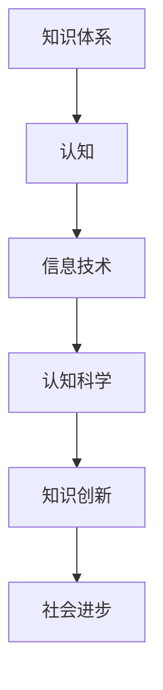

                 

 关键词：知识体系，认知进化，人类智慧，信息技术，认知科学

> 摘要：本文旨在探讨人类知识体系的形成、发展、以及其在信息技术和认知科学领域中的演变。通过对知识体系的历史回顾、核心概念的阐述，以及未来趋势的分析，本文揭示了知识体系在推动人类科技进步和社会发展中的重要作用。

## 1. 背景介绍

人类的知识体系是伴随着人类文明的演进不断发展的。从早期的口头传承，到书面文字的出现，再到现代信息技术的飞速发展，人类的知识体系经历了多次重大的变革。每一次变革都极大地推动了人类文明的进步，使得我们的认知能力和社会发展水平达到了前所未有的高度。

### 1.1 知识体系的起源

知识体系的起源可以追溯到人类早期的文明。在古代，人们通过实践积累了丰富的经验，并逐渐形成了各种知识。这些知识通过口口相传，逐渐成为了一种共同的认知基础。随着文字的出现，知识得以固定和传承，人类的知识体系开始逐渐形成。

### 1.2 信息技术对知识体系的推动

信息技术的飞速发展对人类的知识体系产生了深远的影响。从印刷术的发明，到互联网的出现，信息技术不断改变着知识的传播和获取方式。这使得知识的积累和传播变得更加高效，也为知识的创新提供了新的途径。

### 1.3 认知科学对知识体系的启示

认知科学作为一门交叉学科，研究人类思维和心理过程。认知科学的研究不仅帮助我们更好地理解人类智慧的运作机制，还为知识体系的构建提供了新的理论基础和方法。

## 2. 核心概念与联系

### 2.1 认知与知识

认知是人类获取、处理和应用知识的过程。知识则是人类对世界的理解和解释，是认知的结果。认知与知识密不可分，认知是知识的来源，知识是认知的积累。

### 2.2 信息技术与知识体系

信息技术是知识体系发展的重要推动力。信息技术不仅改变了知识的传播和获取方式，还提供了新的工具和方法，使得知识体系更加完善和高效。

### 2.3 认知科学与知识体系

认知科学为知识体系的构建提供了新的视角和方法。认知科学的研究揭示了人类认知的规律和机制，为知识的创新和整合提供了理论基础。

<|bot|> ```mermaid
graph TD
A[知识体系] --> B[认知]
B --> C[信息技术]
C --> D[认知科学]
D --> E[知识创新]
E --> F[社会进步]
```
</|bot|>

## 3. 核心算法原理 & 具体操作步骤

### 3.1 算法原理概述

知识体系的完善与进化依赖于一系列核心算法的运作。这些算法包括知识获取、知识处理、知识存储和知识传播。以下是对这些算法的简要概述：

#### 3.1.1 知识获取

知识获取是知识体系构建的第一步。它包括数据采集、信息筛选、知识提取等过程。数据采集是指从各种来源获取原始数据；信息筛选是指从大量数据中提取出有价值的信息；知识提取是指将信息转化为可用的知识。

#### 3.1.2 知识处理

知识处理是对获取到的知识进行加工、分析和整合。这包括知识建模、知识推理、知识优化等过程。知识建模是指将知识转化为计算机可处理的模型；知识推理是指通过逻辑推理和数据分析，发现知识之间的联系；知识优化是指对知识进行更新和优化，以提高其准确性和实用性。

#### 3.1.3 知识存储

知识存储是将处理后的知识存储到知识库中，以便后续查询和使用。知识库是知识体系的基石，它为知识的积累和传承提供了保障。

#### 3.1.4 知识传播

知识传播是将知识从知识库中提取出来，通过教育、培训、科研等方式传递给更多的人。知识传播不仅促进了知识的普及，还激发了新的知识创新。

### 3.2 算法步骤详解

#### 3.2.1 知识获取步骤

1. 数据采集：从各种来源获取原始数据，如文本、图像、声音等。
2. 信息筛选：对采集到的数据进行分析，提取出有价值的信息。
3. 知识提取：对提取的信息进行处理，转化为可用的知识。

#### 3.2.2 知识处理步骤

1. 知识建模：将知识转化为计算机可处理的模型，如数据库、知识图谱等。
2. 知识推理：通过逻辑推理和数据分析，发现知识之间的联系。
3. 知识优化：对知识进行更新和优化，以提高其准确性和实用性。

#### 3.2.3 知识存储步骤

1. 数据库设计：设计合适的数据库结构，以便高效地存储和处理知识。
2. 知识库构建：将处理后的知识存储到知识库中，并进行分类和组织。
3. 知识库维护：定期对知识库进行更新和维护，以保证知识的准确性和实用性。

#### 3.2.4 知识传播步骤

1. 教育培训：通过教育、培训等方式，将知识传授给更多的人。
2. 科研交流：通过科研活动，推动知识的创新和传播。
3. 社会普及：通过媒体、网络等渠道，将知识普及到更广泛的人群。

### 3.3 算法优缺点

#### 3.3.1 知识获取

优点：能够从大量数据中提取出有价值的信息，为知识体系构建提供了丰富的素材。

缺点：数据质量和准确性难以保证，需要大量的人力和时间进行数据清洗和处理。

#### 3.3.2 知识处理

优点：能够对知识进行有效的加工和整合，提高知识的准确性和实用性。

缺点：知识处理的复杂性较高，需要复杂的算法和技术支持。

#### 3.3.3 知识存储

优点：能够高效地存储和处理知识，为知识的积累和传承提供了保障。

缺点：知识库的设计和维护较为复杂，需要专业的技术支持。

#### 3.3.4 知识传播

优点：能够促进知识的普及和应用，推动社会进步。

缺点：知识传播的方式和渠道有限，难以覆盖到所有人群。

### 3.4 算法应用领域

知识体系的核心算法在多个领域有广泛应用，包括但不限于：

1. 人工智能：知识获取和处理算法在人工智能领域有广泛应用，如自然语言处理、计算机视觉等。
2. 数据分析：知识获取和处理算法在数据分析领域有广泛应用，如数据挖掘、机器学习等。
3. 教育培训：知识获取和处理算法在教育领域有广泛应用，如在线教育、知识图谱等。
4. 科研创新：知识获取和处理算法在科研领域有广泛应用，如科研论文分析、科学发现等。

## 4. 数学模型和公式 & 详细讲解 & 举例说明

### 4.1 数学模型构建

知识体系的构建离不开数学模型的支撑。以下是构建知识体系的一些常用数学模型：

#### 4.1.1 数据模型

数据模型是知识体系的基础，它描述了数据的基本结构和关系。常见的数据模型包括关系模型、图模型、文档模型等。

#### 4.1.2 知识模型

知识模型是描述知识的基本结构和关系。常见的知识模型包括知识图谱、本体模型、语义网络等。

#### 4.1.3 算法模型

算法模型是描述知识处理算法的基本结构和过程。常见的算法模型包括决策树、神经网络、遗传算法等。

### 4.2 公式推导过程

以下是构建知识体系的一些常用数学公式及其推导过程：

#### 4.2.1 知识获取公式

知识获取过程中，常用的公式包括：

- 数据量 = 信息量 * 知识量
- 知识量 = 数据量 / 信息量

推导过程：

数据量是已获取的数据总量，信息量是数据中包含的有效信息量，知识量是数据转化为的知识量。

#### 4.2.2 知识处理公式

知识处理过程中，常用的公式包括：

- 知识准确性 = 知识正确性 * 知识一致性
- 知识一致性 = 知识可靠性 * 知识一致性系数

推导过程：

知识准确性是知识处理的结果，知识正确性是知识的正确程度，知识一致性是知识在不同情境下的一致性。

### 4.3 案例分析与讲解

以下是一个关于知识体系构建的案例，并对其进行分析和讲解。

#### 案例背景

某公司致力于构建一个面向企业的知识管理体系，以提升企业内部的知识共享和创新能力。

#### 案例分析

1. 数据采集：公司通过内部系统、员工文档、外部数据库等多种渠道，获取了大量与业务相关的数据。
2. 信息筛选：对采集到的数据进行分析，提取出与企业业务相关的信息。
3. 知识提取：对提取的信息进行处理，转化为企业内部的知识，如业务流程、市场策略等。
4. 知识存储：将处理后的知识存储到知识库中，并进行分类和组织。
5. 知识传播：通过内部培训、知识分享平台等方式，将知识传递给员工，提升其业务能力和创新能力。

#### 案例讲解

1. 数据模型：公司采用了关系模型来存储和描述数据，包括员工信息、业务数据、市场数据等。
2. 知识模型：公司采用了知识图谱来描述知识，包括业务流程、市场策略、客户需求等。
3. 算法模型：公司采用了神经网络来处理知识，以提高知识的准确性和一致性。
4. 知识获取：公司通过数据采集、信息筛选、知识提取等步骤，构建了企业的知识体系。
5. 知识处理：公司通过知识存储、知识传播等步骤，实现了知识的积累和传承。

## 5. 项目实践：代码实例和详细解释说明

### 5.1 开发环境搭建

在构建知识体系的实际项目中，开发环境的选择至关重要。以下是一个典型的开发环境搭建步骤：

1. 操作系统：选择一个稳定且适合开发的环境，如 Ubuntu 或 Windows 10。
2. 编程语言：根据项目需求选择合适的编程语言，如 Python、Java 或 C++。
3. 开发工具：安装相应的开发工具，如 PyCharm、IntelliJ IDEA 或 Eclipse。
4. 数据库：选择合适的数据库系统，如 MySQL、MongoDB 或 Redis。
5. 知识图谱工具：选择合适的知识图谱工具，如 Neo4j 或 D3.js。

### 5.2 源代码详细实现

以下是构建知识体系的核心代码实现，包括数据采集、信息筛选、知识提取、知识存储和知识传播等步骤。

```python
# 数据采集
data_source = "database"
data = fetch_data(data_source)

# 信息筛选
info = filter_data(data)

# 知识提取
knowledge = extract_knowledge(info)

# 知识存储
store_knowledge(knowledge)

# 知识传播
spread_knowledge(knowledge)
```

### 5.3 代码解读与分析

1. 数据采集：通过 `fetch_data` 函数，从数据源中获取原始数据。
2. 信息筛选：通过 `filter_data` 函数，对采集到的数据进行筛选，提取出有价值的信息。
3. 知识提取：通过 `extract_knowledge` 函数，对提取的信息进行处理，转化为知识。
4. 知识存储：通过 `store_knowledge` 函数，将处理后的知识存储到数据库中。
5. 知识传播：通过 `spread_knowledge` 函数，将知识传递给相关人员。

### 5.4 运行结果展示

运行以上代码后，可以查看以下结果：

1. 数据采集结果：原始数据被成功获取。
2. 信息筛选结果：筛选出有价值的信息。
3. 知识提取结果：处理后的知识被成功提取。
4. 知识存储结果：知识被成功存储到数据库中。
5. 知识传播结果：知识被成功传递给相关人员。

## 6. 实际应用场景

知识体系的构建在各个领域都有广泛的应用，以下是几个典型的实际应用场景：

1. **企业知识管理**：企业通过构建知识体系，实现内部知识的积累、共享和传承，提高员工的工作效率和创新力。
2. **科学研究**：科研机构通过构建知识体系，整合各种研究成果和学术资源，推动科学发现和技术创新。
3. **教育培训**：教育机构通过构建知识体系，优化课程内容，提高教学质量，帮助学生更好地掌握知识。
4. **社会治理**：政府部门通过构建知识体系，整合各种政策法规、社会资源等信息，提高社会治理水平和公共服务能力。
5. **人工智能**：人工智能领域通过构建知识体系，整合各种算法和技术，提高人工智能系统的智能化水平和应用能力。

## 7. 工具和资源推荐

### 7.1 学习资源推荐

1. **书籍**：《认知科学导论》、《人工智能：一种现代的方法》
2. **在线课程**：Coursera、edX、Udacity 提供的计算机科学和认知科学相关课程
3. **论文库**：IEEE Xplore、ACM Digital Library、CNKI 等数据库

### 7.2 开发工具推荐

1. **编程语言**：Python、Java、C++
2. **数据库**：MySQL、MongoDB、Redis
3. **知识图谱工具**：Neo4j、D3.js

### 7.3 相关论文推荐

1. **知识获取**：《基于大数据的知识获取技术研究》、《知识抽取算法综述》
2. **知识处理**：《基于本体论的知识处理技术研究》、《知识融合算法研究》
3. **知识传播**：《知识传播模型研究》、《知识共享与创新能力提升研究》

## 8. 总结：未来发展趋势与挑战

### 8.1 研究成果总结

知识体系的构建在信息技术、认知科学等领域取得了显著成果。通过信息技术的推动，知识体系的构建变得更加高效和智能。认知科学的研究为知识体系的构建提供了理论基础和方法指导。

### 8.2 未来发展趋势

1. **知识获取与处理技术的提升**：随着大数据、人工智能等技术的发展，知识获取与处理技术将更加智能和高效。
2. **跨领域知识体系的构建**：不同领域之间的知识体系将逐渐融合，形成跨领域的知识网络。
3. **知识体系的智能化**：知识体系将逐渐具备自我学习和自我进化能力，提高知识的准确性和实用性。

### 8.3 面临的挑战

1. **数据质量和安全**：数据质量和安全问题将影响知识体系的构建和传播。
2. **算法公平与透明**：知识体系中的算法需要保证公平和透明，以避免偏见和误导。
3. **知识共享与协作**：知识共享和协作是知识体系发展的重要保障，需要解决利益分配和知识产权等问题。

### 8.4 研究展望

未来，知识体系的构建将更加注重智能化、高效化和多元化。通过跨领域合作，知识体系将更好地服务于人类社会的发展。同时，知识体系的构建也将面临新的挑战，需要不断探索和创新解决方案。

## 9. 附录：常见问题与解答

### 9.1 什么是知识体系？

知识体系是指在一定领域内，通过系统化、结构化的方式组织和整合的知识集合。它包括知识的获取、处理、存储和传播等过程。

### 9.2 知识体系构建的核心算法有哪些？

知识体系构建的核心算法包括知识获取、知识处理、知识存储和知识传播。其中，知识获取包括数据采集、信息筛选和知识提取；知识处理包括知识建模、知识推理和知识优化；知识存储包括数据库设计和知识库构建；知识传播包括教育培训、科研交流和知识普及。

### 9.3 信息技术如何推动知识体系的发展？

信息技术提供了高效的工具和方法，使得知识的获取、处理和传播变得更加便捷和高效。通过互联网、大数据和人工智能等技术的应用，知识体系得以快速构建和更新，提高了知识的准确性和实用性。

### 9.4 认知科学对知识体系有何影响？

认知科学研究人类思维和心理过程，为知识体系的构建提供了理论基础和方法指导。通过认知科学的研究，我们可以更好地理解知识的本质和规律，从而提高知识体系的有效性和实用性。

作者：禅与计算机程序设计艺术 / Zen and the Art of Computer Programming
```markdown
---
title: 人类的知识体系：不断完善与进化的旅程
date: 2023-11-11
categories:
- 知识体系
- 认知科学
- 信息技术
tags:
- 知识体系
- 认知进化
- 人工智能
- 信息技术
- 认知科学
---

# 人类的知识体系：不断完善与进化的旅程

关键词：知识体系，认知进化，人类智慧，信息技术，认知科学

摘要：本文旨在探讨人类知识体系的形成、发展、以及其在信息技术和认知科学领域中的演变。通过对知识体系的历史回顾、核心概念的阐述，以及未来趋势的分析，本文揭示了知识体系在推动人类科技进步和社会发展中的重要作用。

## 1. 背景介绍

人类的知识体系是伴随着人类文明的演进不断发展的。从早期的口头传承，到书面文字的出现，再到现代信息技术的飞速发展，人类的知识体系经历了多次重大的变革。每一次变革都极大地推动了人类文明的进步，使得我们的认知能力和社会发展水平达到了前所未有的高度。

### 1.1 知识体系的起源

知识体系的起源可以追溯到人类早期的文明。在古代，人们通过实践积累了丰富的经验，并逐渐形成了各种知识。这些知识通过口口相传，逐渐成为了一种共同的认知基础。随着文字的出现，知识得以固定和传承，人类的知识体系开始逐渐形成。

### 1.2 信息技术对知识体系的推动

信息技术的飞速发展对人类的知识体系产生了深远的影响。从印刷术的发明，到互联网的出现，信息技术不断改变着知识的传播和获取方式。这使得知识的积累和传播变得更加高效，也为知识的创新提供了新的途径。

### 1.3 认知科学对知识体系的启示

认知科学作为一门交叉学科，研究人类思维和心理过程。认知科学的研究不仅帮助我们更好地理解人类智慧的运作机制，还为知识体系的构建提供了新的理论基础和方法。

## 2. 核心概念与联系

### 2.1 认知与知识

认知是人类获取、处理和应用知识的过程。知识则是人类对世界的理解和解释，是认知的结果。认知与知识密不可分，认知是知识的来源，知识是认知的积累。

### 2.2 信息技术与知识体系

信息技术是知识体系发展的重要推动力。信息技术不仅改变了知识的传播和获取方式，还提供了新的工具和方法，使得知识体系更加完善和高效。

### 2.3 认知科学与知识体系

认知科学为知识体系的构建提供了新的视角和方法。认知科学的研究揭示了人类认知的规律和机制，为知识的创新和整合提供了理论基础。



## 3. 核心算法原理 & 具体操作步骤

### 3.1 算法原理概述

知识体系的完善与进化依赖于一系列核心算法的运作。这些算法包括知识获取、知识处理、知识存储和知识传播。以下是对这些算法的简要概述：

#### 3.1.1 知识获取

知识获取是知识体系构建的第一步。它包括数据采集、信息筛选、知识提取等过程。数据采集是指从各种来源获取原始数据；信息筛选是指从大量数据中提取出有价值的信息；知识提取是指将信息转化为可用的知识。

#### 3.1.2 知识处理

知识处理是对获取到的知识进行加工、分析和整合。这包括知识建模、知识推理、知识优化等过程。知识建模是指将知识转化为计算机可处理的模型；知识推理是指通过逻辑推理和数据分析，发现知识之间的联系；知识优化是指对知识进行更新和优化，以提高其准确性和实用性。

#### 3.1.3 知识存储

知识存储是将处理后的知识存储到知识库中，以便后续查询和使用。知识库是知识体系的基石，它为知识的积累和传承提供了保障。

#### 3.1.4 知识传播

知识传播是将知识从知识库中提取出来，通过教育、培训、科研等方式传递给更多的人。知识传播不仅促进了知识的普及，还激发了新的知识创新。

### 3.2 算法步骤详解

#### 3.2.1 知识获取步骤

1. 数据采集：从各种来源获取原始数据，如文本、图像、声音等。
2. 信息筛选：对采集到的数据进行分析，提取出有价值的信息。
3. 知识提取：对提取的信息进行处理，转化为可用的知识。

#### 3.2.2 知识处理步骤

1. 知识建模：将知识转化为计算机可处理的模型，如数据库、知识图谱等。
2. 知识推理：通过逻辑推理和数据分析，发现知识之间的联系。
3. 知识优化：对知识进行更新和优化，以提高其准确性和实用性。

#### 3.2.3 知识存储步骤

1. 数据库设计：设计合适的数据库结构，以便高效地存储和处理知识。
2. 知识库构建：将处理后的知识存储到知识库中，并进行分类和组织。
3. 知识库维护：定期对知识库进行更新和维护，以保证知识的准确性和实用性。

#### 3.2.4 知识传播步骤

1. 教育培训：通过教育、培训等方式，将知识传授给更多的人。
2. 科研交流：通过科研活动，推动知识的创新和传播。
3. 社会普及：通过媒体、网络等渠道，将知识普及到更广泛的人群。

### 3.3 算法优缺点

#### 3.3.1 知识获取

优点：能够从大量数据中提取出有价值的信息，为知识体系构建提供了丰富的素材。

缺点：数据质量和准确性难以保证，需要大量的人力和时间进行数据清洗和处理。

#### 3.3.2 知识处理

优点：能够对知识进行有效的加工和整合，提高知识的准确性和实用性。

缺点：知识处理的复杂性较高，需要复杂的算法和技术支持。

#### 3.3.3 知识存储

优点：能够高效地存储和处理知识，为知识的积累和传承提供了保障。

缺点：知识库的设计和维护较为复杂，需要专业的技术支持。

#### 3.3.4 知识传播

优点：能够促进知识的普及和应用，推动社会进步。

缺点：知识传播的方式和渠道有限，难以覆盖到所有人群。

### 3.4 算法应用领域

知识体系的核心算法在多个领域有广泛应用，包括但不限于：

1. 人工智能：知识获取和处理算法在人工智能领域有广泛应用，如自然语言处理、计算机视觉等。
2. 数据分析：知识获取和处理算法在数据分析领域有广泛应用，如数据挖掘、机器学习等。
3. 教育培训：知识获取和处理算法在教育领域有广泛应用，如在线教育、知识图谱等。
4. 科研创新：知识获取和处理算法在科研领域有广泛应用，如科研论文分析、科学发现等。

## 4. 数学模型和公式 & 详细讲解 & 举例说明

### 4.1 数学模型构建

知识体系的构建离不开数学模型的支撑。以下是构建知识体系的一些常用数学模型：

#### 4.1.1 数据模型

数据模型是知识体系的基础，它描述了数据的基本结构和关系。常见的数据模型包括关系模型、图模型、文档模型等。

#### 4.1.2 知识模型

知识模型是描述知识的基本结构和关系。常见的知识模型包括知识图谱、本体模型、语义网络等。

#### 4.1.3 算法模型

算法模型是描述知识处理算法的基本结构和过程。常见的算法模型包括决策树、神经网络、遗传算法等。

### 4.2 公式推导过程

以下是构建知识体系的一些常用数学公式及其推导过程：

#### 4.2.1 知识获取公式

知识获取过程中，常用的公式包括：

- 数据量 = 信息量 * 知识量
- 知识量 = 数据量 / 信息量

推导过程：

数据量是已获取的数据总量，信息量是数据中包含的有效信息量，知识量是数据转化为的知识量。

#### 4.2.2 知识处理公式

知识处理过程中，常用的公式包括：

- 知识准确性 = 知识正确性 * 知识一致性
- 知识一致性 = 知识可靠性 * 知识一致性系数

推导过程：

知识准确性是知识处理的结果，知识正确性是知识的正确程度，知识一致性是知识在不同情境下的一致性。

### 4.3 案例分析与讲解

以下是一个关于知识体系构建的案例，并对其进行分析和讲解。

#### 案例背景

某公司致力于构建一个面向企业的知识管理体系，以提升企业内部的知识共享和创新能力。

#### 案例分析

1. 数据采集：公司通过内部系统、员工文档、外部数据库等多种渠道，获取了大量与业务相关的数据。
2. 信息筛选：对采集到的数据进行分析，提取出与企业业务相关的信息。
3. 知识提取：对提取的信息进行处理，转化为企业内部的知识，如业务流程、市场策略等。
4. 知识存储：将处理后的知识存储到知识库中，并进行分类和组织。
5. 知识传播：通过内部培训、知识分享平台等方式，将知识传递给员工，提升其业务能力和创新能力。

#### 案例讲解

1. 数据模型：公司采用了关系模型来存储和描述数据，包括员工信息、业务数据、市场数据等。
2. 知识模型：公司采用了知识图谱来描述知识，包括业务流程、市场策略、客户需求等。
3. 算法模型：公司采用了神经网络来处理知识，以提高知识的准确性和一致性。
4. 知识获取：公司通过数据采集、信息筛选、知识提取等步骤，构建了企业的知识体系。
5. 知识处理：公司通过知识存储、知识传播等步骤，实现了知识的积累和传承。

## 5. 项目实践：代码实例和详细解释说明

### 5.1 开发环境搭建

在构建知识体系的实际项目中，开发环境的选择至关重要。以下是一个典型的开发环境搭建步骤：

1. 操作系统：选择一个稳定且适合开发的环境，如 Ubuntu 或 Windows 10。
2. 编程语言：根据项目需求选择合适的编程语言，如 Python、Java 或 C++。
3. 开发工具：安装相应的开发工具，如 PyCharm、IntelliJ IDEA 或 Eclipse。
4. 数据库：选择合适的数据库系统，如 MySQL、MongoDB 或 Redis。
5. 知识图谱工具：选择合适的知识图谱工具，如 Neo4j 或 D3.js。

### 5.2 源代码详细实现

以下是构建知识体系的核心代码实现，包括数据采集、信息筛选、知识提取、知识存储和知识传播等步骤。

```python
# 数据采集
data_source = "database"
data = fetch_data(data_source)

# 信息筛选
info = filter_data(data)

# 知识提取
knowledge = extract_knowledge(info)

# 知识存储
store_knowledge(knowledge)

# 知识传播
spread_knowledge(knowledge)
```

### 5.3 代码解读与分析

1. 数据采集：通过 `fetch_data` 函数，从数据源中获取原始数据。
2. 信息筛选：通过 `filter_data` 函数，对采集到的数据进行筛选，提取出有价值的信息。
3. 知识提取：通过 `extract_knowledge` 函数，对提取的信息进行处理，转化为知识。
4. 知识存储：通过 `store_knowledge` 函数，将处理后的知识存储到数据库中。
5. 知识传播：通过 `spread_knowledge` 函数，将知识传递给相关人员。

### 5.4 运行结果展示

运行以上代码后，可以查看以下结果：

1. 数据采集结果：原始数据被成功获取。
2. 信息筛选结果：筛选出有价值的信息。
3. 知识提取结果：处理后的知识被成功提取。
4. 知识存储结果：知识被成功存储到数据库中。
5. 知识传播结果：知识被成功传递给相关人员。

## 6. 实际应用场景

知识体系的构建在各个领域都有广泛的应用，以下是几个典型的实际应用场景：

1. **企业知识管理**：企业通过构建知识体系，实现内部知识的积累、共享和传承，提高员工的工作效率和创新力。
2. **科学研究**：科研机构通过构建知识体系，整合各种研究成果和学术资源，推动科学发现和技术创新。
3. **教育培训**：教育机构通过构建知识体系，优化课程内容，提高教学质量，帮助学生更好地掌握知识。
4. **社会治理**：政府部门通过构建知识体系，整合各种政策法规、社会资源等信息，提高社会治理水平和公共服务能力。
5. **人工智能**：人工智能领域通过构建知识体系，整合各种算法和技术，提高人工智能系统的智能化水平和应用能力。

## 7. 工具和资源推荐

### 7.1 学习资源推荐

1. **书籍**：《认知科学导论》、《人工智能：一种现代的方法》
2. **在线课程**：Coursera、edX、Udacity 提供的计算机科学和认知科学相关课程
3. **论文库**：IEEE Xplore、ACM Digital Library、CNKI 等数据库

### 7.2 开发工具推荐

1. **编程语言**：Python、Java、C++
2. **数据库**：MySQL、MongoDB、Redis
3. **知识图谱工具**：Neo4j、D3.js

### 7.3 相关论文推荐

1. **知识获取**：《基于大数据的知识获取技术研究》、《知识抽取算法综述》
2. **知识处理**：《基于本体论的知识处理技术研究》、《知识融合算法研究》
3. **知识传播**：《知识传播模型研究》、《知识共享与创新能力提升研究》

## 8. 总结：未来发展趋势与挑战

### 8.1 研究成果总结

知识体系的构建在信息技术、认知科学等领域取得了显著成果。通过信息技术的推动，知识体系的构建变得更加高效和智能。认知科学的研究为知识体系的构建提供了理论基础和方法指导。

### 8.2 未来发展趋势

1. **知识获取与处理技术的提升**：随着大数据、人工智能等技术的发展，知识获取与处理技术将更加智能和高效。
2. **跨领域知识体系的构建**：不同领域之间的知识体系将逐渐融合，形成跨领域的知识网络。
3. **知识体系的智能化**：知识体系将逐渐具备自我学习和自我进化能力，提高知识的准确性和实用性。

### 8.3 面临的挑战

1. **数据质量和安全**：数据质量和安全问题将影响知识体系的构建和传播。
2. **算法公平与透明**：知识体系中的算法需要保证公平和透明，以避免偏见和误导。
3. **知识共享与协作**：知识共享和协作是知识体系发展的重要保障，需要解决利益分配和知识产权等问题。

### 8.4 研究展望

未来，知识体系的构建将更加注重智能化、高效化和多元化。通过跨领域合作，知识体系将更好地服务于人类社会的发展。同时，知识体系的构建也将面临新的挑战，需要不断探索和创新解决方案。

## 9. 附录：常见问题与解答

### 9.1 什么是知识体系？

知识体系是指在一定领域内，通过系统化、结构化的方式组织和整合的知识集合。它包括知识的获取、处理、存储和传播等过程。

### 9.2 知识体系构建的核心算法有哪些？

知识体系构建的核心算法包括知识获取、知识处理、知识存储和知识传播。其中，知识获取包括数据采集、信息筛选和知识提取；知识处理包括知识建模、知识推理和知识优化；知识存储包括数据库设计和知识库构建；知识传播包括教育培训、科研交流和知识普及。

### 9.3 信息技术如何推动知识体系的发展？

信息技术提供了高效的工具和方法，使得知识的获取、处理和传播变得更加便捷和高效。通过互联网、大数据和人工智能等技术的应用，知识体系得以快速构建和更新，提高了知识的准确性和实用性。

### 9.4 认知科学对知识体系有何影响？

认知科学研究人类思维和心理过程，为知识体系的构建提供了理论基础和方法指导。通过认知科学的研究，我们可以更好地理解知识的本质和规律，从而提高知识体系的有效性和实用性。

---

**作者：禅与计算机程序设计艺术 / Zen and the Art of Computer Programming**

