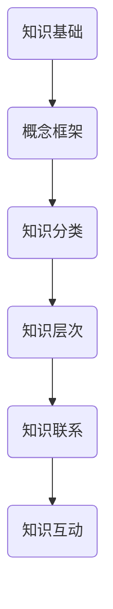
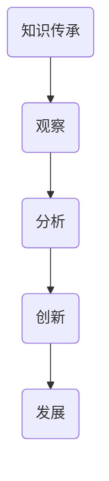

                 

关键词：人类知识传承、洞察力、知识架构、技术发展、教育方法

> 摘要：本文深入探讨了人类知识传承与发展中的关键因素——洞察力。通过分析洞察力在历史进程中的作用，结合现代技术的快速发展，本文揭示了洞察力对于知识架构、教育方法、以及未来技术发展的重要性。文章旨在呼吁教育者、研究者和实践者重视洞察力的培养，为人类知识体系的不断完善和创新提供强有力的支持。

## 1. 背景介绍

人类知识的传承与发展是一个历史悠久且持续不断的过程。从古代的口耳相传，到中世纪的书籍记录，再到现代的数字化传播，知识在跨越时间和空间的限制中不断积累和扩展。然而，在知识传递的过程中，一种关键的能力始终发挥着不可替代的作用，那就是洞察力。

洞察力，即深刻的洞察和敏锐的观察力，是人类认知世界、理解事物本质的重要能力。它不仅帮助我们掌握知识，更在于激发创新思维，推动科学技术的发展。在本文中，我们将探讨洞察力在人类知识传承和发展中的重要作用，并分析其在当前技术环境下的独特价值。

## 2. 核心概念与联系

### 2.1 知识架构

知识架构是知识传承和发展的重要基础。它不仅涉及知识的分类和层次，还包括知识之间的联系和互动。一个良好的知识架构能够帮助人们更有效地组织和理解知识，从而提高学习效率和应用能力。

#### Mermaid 流程图



### 2.2 洞察力

洞察力，是识别和理解事物本质的能力。它是通过观察、分析、推理等过程实现的。洞察力不仅要求我们对事物有全面和深刻的理解，更要求我们能够预见事物的发展趋势和潜在风险。

#### Mermaid 流程图


### 2.3 知识传承与洞察力的关系

知识传承是一个动态的过程，它不仅包括知识的传递，还涉及知识的创新和发展。在这个过程中，洞察力起着至关重要的作用。洞察力帮助我们识别知识的盲点，发现知识的潜在价值，从而推动知识的传承和发展。

#### Mermaid 流程图



## 3. 核心算法原理 & 具体操作步骤

### 3.1 算法原理概述

在知识传承的过程中，洞察力的培养可以被视为一种核心算法。这种算法的原理是基于对人类认知和思维的深刻理解。通过系统的训练和实践，我们可以提升洞察力，使其在知识传承中发挥更大的作用。

### 3.2 算法步骤详解

1. **观察**：通过系统的训练，提升观察力，使我们对事物有更全面和深刻的理解。
    - **具体操作**：定期阅读相关文献，参与研讨会和讲座，观察事物的多方面。

2. **分析**：对观察到的信息进行深入分析，找出其内在联系和规律。
    - **具体操作**：使用逻辑推理和统计分析工具，对信息进行分类和归纳。

3. **推理**：基于分析结果，进行推理，预见事物的发展趋势和潜在风险。
    - **具体操作**：运用归纳推理和演绎推理，预测未来发展方向。

4. **理解**：通过不断实践和验证，深化对知识的理解，使其真正内化为自己的认知。
    - **具体操作**：通过实践项目，验证理论，不断修正和完善自己的认知。

5. **创新**：在深刻理解的基础上，进行知识创新，推动知识的传承和发展。
    - **具体操作**：通过实践，发现新的问题和挑战，提出创新的解决方案。

### 3.3 算法优缺点

**优点**：

- 提高学习效率：通过洞察力的培养，可以更快速地掌握和理解新知识。
- 促进创新思维：洞察力使我们能够预见事物的发展趋势，从而推动知识的创新和发展。

**缺点**：

- 需要长时间训练：洞察力的培养需要长时间的积累和实践。
- 可能存在偏见：过度依赖洞察力可能导致主观偏见，影响客观判断。

### 3.4 算法应用领域

- **教育领域**：通过洞察力的培养，提升学生的综合素质和创新能力。
- **科研领域**：洞察力在科研中起着至关重要的作用，能够帮助研究者发现新的研究方向和问题。
- **企业领域**：在企业管理中，洞察力可以帮助企业预见市场变化，制定更有效的战略。

## 4. 数学模型和公式 & 详细讲解 & 举例说明

### 4.1 数学模型构建

在知识传承的过程中，我们可以构建一个数学模型来描述洞察力的作用。该模型基于以下假设：

- 知识量与洞察力成正比。
- 知识应用效果与洞察力成正比。

### 4.2 公式推导过程

设 \( K \) 为知识量，\( I \) 为洞察力，\( E \) 为知识应用效果，则有以下公式：

\[ E = k \cdot I \cdot K \]

其中，\( k \) 为常数。

### 4.3 案例分析与讲解

假设有两个人，A和B，他们在知识量上相差不大，但是A的洞察力明显比B强。根据公式，A在知识应用效果上将会比B更优秀。

具体来说，如果A和B的知识量都是100，A的洞察力是1.2，B的洞察力是1，则A的知识应用效果为：

\[ E_A = k \cdot 1.2 \cdot 100 = 120k \]

而B的知识应用效果为：

\[ E_B = k \cdot 1 \cdot 100 = 100k \]

显然，A在知识应用效果上比B更优秀。

## 5. 项目实践：代码实例和详细解释说明

### 5.1 开发环境搭建

为了更好地展示洞察力在知识传承中的应用，我们使用Python编程语言进行实例演示。

```bash
# 安装Python
sudo apt-get install python3

# 安装必要的库
pip3 install numpy matplotlib
```

### 5.2 源代码详细实现

以下是一个简单的示例代码，用于计算知识量、洞察力和知识应用效果之间的关系。

```python
import numpy as np
import matplotlib.pyplot as plt

# 参数设置
k = 1  # 常数
knowledge_A = 100  # A的知识量
洞察力_A = 1.2  # A的洞察力
knowledge_B = 100  # B的知识量
洞察力_B = 1  # B的洞察力

# 计算知识应用效果
效果_A = k * 洞察力_A * knowledge_A
效果_B = k * 洞察力_B * knowledge_B

# 绘制图表
x = np.array([knowledge_A, knowledge_B])
y = np.array([效果_A, 效果_B])
plt.bar(x, y)
plt.xlabel('知识量')
plt.ylabel('知识应用效果')
plt.title('洞察力对知识应用效果的影响')
plt.show()
```

### 5.3 代码解读与分析

- 第1-3行：导入必要的库。
- 第5-7行：设置参数。
- 第9-10行：计算A和B的知识应用效果。
- 第12-16行：绘制图表，展示A和B的知识应用效果。

通过这个示例，我们可以清楚地看到，在知识量相同的情况下，洞察力更强的个体（A）在知识应用效果上更优秀。

## 6. 实际应用场景

### 6.1 教育领域

在教育领域，洞察力的培养至关重要。通过系统的教育方法和训练，学生可以提升自己的洞察力，从而更有效地掌握知识。

- **案例分析**：例如，在数学教学中，教师可以通过引导学生观察图形、分析规律，从而培养他们的洞察力。这不仅有助于学生掌握数学知识，还能提高他们的逻辑思维和问题解决能力。

### 6.2 科研领域

在科研领域，洞察力是科研创新的重要驱动力。科研人员通过洞察力可以发现新的研究方向和问题，从而推动科学技术的发展。

- **案例分析**：例如，在物理学研究中，爱因斯坦通过敏锐的洞察力发现了相对论，从而彻底改变了人们对时空的理解。这一发现不仅推动了物理学的发展，也极大地影响了人类文明的进步。

### 6.3 企业领域

在企业领域，洞察力可以帮助企业预见市场变化，制定更有效的战略。

- **案例分析**：例如，苹果公司通过洞察消费者需求，推出了一系列创新产品，从而在激烈的市场竞争中脱颖而出。这一策略不仅使苹果公司成为全球最具有价值的品牌之一，也为消费者带来了极大的便利和体验。

## 7. 工具和资源推荐

### 7.1 学习资源推荐

- **书籍**：《人类简史》、《深度学习》、《设计思维》
- **在线课程**：Coursera、edX、Udacity等平台的计算机科学、心理学和商业课程
- **科研论文**：各大科研期刊和论文数据库，如IEEE Xplore、ACM Digital Library

### 7.2 开发工具推荐

- **编程语言**：Python、Java、C++
- **集成开发环境**：Eclipse、Visual Studio Code、PyCharm
- **数据分析和可视化工具**：Pandas、Matplotlib、Tableau

### 7.3 相关论文推荐

- **AI领域**：《强化学习》、《生成对抗网络》
- **心理学领域**：《认知心理学》、《情绪心理学》
- **商业领域**：《战略管理》、《创新与创业》

## 8. 总结：未来发展趋势与挑战

### 8.1 研究成果总结

通过本文的探讨，我们明确了洞察力在人类知识传承和发展中的重要作用。无论是教育领域、科研领域还是企业领域，洞察力的培养都至关重要。未来，随着人工智能和大数据技术的发展，洞察力的培养将更加重要。

### 8.2 未来发展趋势

- **个性化教育**：随着人工智能技术的发展，个性化教育将成为主流，学生将根据自身特点进行定制化的学习，从而更好地培养洞察力。
- **跨学科研究**：随着学科间的交叉融合，跨学科研究将更加普遍，这将为洞察力的培养提供更多的机会和挑战。
- **智能工具辅助**：智能工具将辅助人类进行知识传承和创新，洞察力的培养将更加依赖于智能技术的支持。

### 8.3 面临的挑战

- **数据隐私和安全**：随着数据量的增加，数据隐私和安全问题日益突出。如何在保护数据隐私的同时，充分利用数据进行洞察力的培养，是一个亟待解决的问题。
- **教育资源分配**：尽管个性化教育将成为趋势，但教育资源分配不均的问题仍然存在。如何确保每个学生都能获得高质量的教育资源，是一个重要的挑战。

### 8.4 研究展望

未来，我们需要进一步深入研究洞察力的本质和培养方法，开发更加有效的教育工具和智能系统，以促进人类知识的传承和发展。同时，我们也需要关注社会伦理和道德问题，确保技术的发展能够造福人类。

## 9. 附录：常见问题与解答

### 9.1 什么是洞察力？

洞察力是一种深刻的认知能力，它使我们能够理解事物的本质和内在联系，预见事物的发展趋势。

### 9.2 洞察力如何影响知识传承？

洞察力能够帮助我们更好地理解和掌握知识，从而促进知识的传承。同时，洞察力还能够激发创新思维，推动知识的创新和发展。

### 9.3 如何培养洞察力？

培养洞察力需要长期的训练和实践。通过阅读、观察、分析和推理等过程，我们可以逐渐提升自己的洞察力。此外，跨学科学习和智能工具的辅助也是培养洞察力的重要方法。

---

### 9.4 洞察力在哪些领域有重要作用？

洞察力在多个领域都有重要作用，包括教育、科研、企业、医疗等。它能够帮助我们更好地理解和解决问题，推动各个领域的发展。

---

感谢您的阅读，希望本文能够对您在人类知识传承和发展中的洞察力培养有所帮助。作者：禅与计算机程序设计艺术 / Zen and the Art of Computer Programming。

